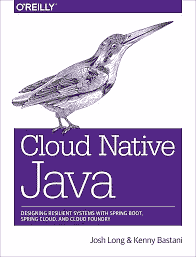
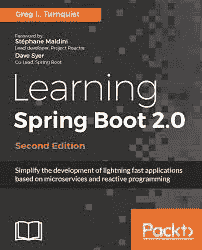
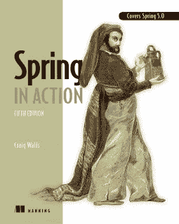

# 6 本高级 Spring 框架书籍，有经验的 Java 开发人员应该在 2023 年阅读——最好的

> 原文：<https://medium.com/javarevisited/5-advanced-spring-framework-books-experienced-java-developers-should-read-in-2020-best-of-lot-2a786fc5ad31?source=collection_archive---------0----------------------->

保罗·斯查费在 [Unsplash](https://unsplash.com?utm_source=medium&utm_medium=referral) 上的照片

H ello 伙计们，Spring 框架在过去几年里发生了很大的变化。在过去的几年里，我们已经看到了 Spring、Spring Boot 和 Spring Security 的主要版本。

这些新版本引入了几个令人兴奋的功能，以满足最新的软件开发趋势，如反应式编程，支持用于开发 Spring 应用程序的 [Kotlin](http://www.java67.com/2017/12/10-programming-languages-to-learn-in.html) ，Spring web flux——一个开发非阻塞和反应式 web 应用程序的新框架——等等。

由于软件世界正在发生变化，并且大多数开发都是在云上进行的，其中[微服务架构](http://javarevisited.blogspot.sg/2018/02/top-5-spring-microservices-courses-with-spring-boot-and-spring-cloud.html)处于领先地位，所以现在是有经验的 Java 开发人员自我升级的时候了。

如果你已经使用 Spring 很多年了，但还没有机会赶上 Spring 世界的所有最新发展趋势，那么今年是纠正这种情况的最佳时机。

在 Java SE 8 发布之后，大多数 Java 框架都得到了升级，以支持新的 Java 编码风格。它现在已经成为 Java 的标准——使用旧风格编写的代码已经不再实用。

技术领导和架构师在同行代码评审中拒绝这样的代码，并鼓励有经验的 Java 开发人员，比如有 5 到 8 年经验的人，学习 [Java 8](http://www.java67.com/2014/09/top-10-java-8-tutorials-best-of-lot.html) 和 [Spring 5](http://javarevisited.blogspot.sg/2018/01/how-to-learn-spring-core-spring-mvc-boot-security-framework.html#axzz55IgfKjy8) 。

> 这是有道理的:如果有更好的选择，可读性更好，更直观，并提供更好的性能，你就不能用老方法编写代码。反应式编程模型也是如此。

好吧，我承认一旦你获得了经验，你的学习速度就会变慢，而且许多 Java 开发人员，包括我自己，都没有花足够的精力来使自己跟上时代。

> 你的公司在这方面也起着重要的作用。例如，如果你正在为投资银行和使用旧技术的大机构工作，那么你就不太可能提升自己，因为没有推动力。

但是如果你正在为一家创业公司工作，这家公司非常敏捷地采用最新最棒的[框架](/javarevisited/top-10-frameworks-full-stack-java-developers-can-learn-in-2020-5995021401e5)、[库](/javarevisited/10-of-the-most-popular-javascript-frameworks-libraries-for-web-development-in-2019-a2c8cea68094)和[技术](/javarevisited/these-are-the-highest-paying-tech-jobs-programmers-can-aim-to-increase-their-pay-c59e1eeb6904)，你可能会更频繁地升级自己。

# 2023 年面向 Java 开发人员的 6 本高级春季书籍

无论如何，如果你想给你的职业生涯一个推动，打破束缚，这里有几本我认为有经验的 Java 开发人员应该阅读的 Spring 书籍，以了解 Spring 5、Spring Boot、Spring Cloud 的新功能，以及如何使用 Spring 框架开发面向云的 Java 应用程序。

## 1.[弹簧微服务在行动](https://www.amazon.com/Spring-Microservices-Action-John-Carnell/dp/1617293989/?tag=javamysqlanta-20)

围绕微服务有很多讨论，Spring 通过提供用 Java 构建基于微服务的应用程序所需的技术而处于领先地位。

在这本书里，John Carnell 将教你如何用 Java 和 Spring 平台一步一步有条理地构建基于微服务的应用。

它不仅教你[核心微服务设计原则](https://www.educative.io/courses/introduction-microservice-principles-concepts?affiliate_id=5073518643380224)，还教你在现实世界中开发和部署微服务所需的所有技术。

您将了解 Spring Boot 和 Spring Cloud 如何简化您的微服务应用，以及 Spring Cloud 为企业和云发现、路由和部署微服务提供的所有工具，如 Hystrix、Ribbon 等。

如果你愿意，你也可以将此与 Udemy 的 [**大师微服务与 Spring Boot 和春云**](https://click.linksynergy.com/deeplink?id=JVFxdTr9V80&mid=39197&murl=https%3A%2F%2Fwww.udemy.com%2Fcourse%2Fmicroservices-with-spring-boot-and-spring-cloud%2F) 课程相结合，进行一些实践和主动学习。

## 2.[云原生 Java](https://www.amazon.com/Cloud-Native-Java-Designing-Resilient/dp/1449374646?tag=javamysqlanta-20)

这是 2023 年 Java 开发人员的必读春季书籍之一，他们希望学习如何为云设计和开发生产质量的 Java 应用程序。

这本书的全名是*“云原生 Java:用 Spring Boot、Spring Cloud 和 Cloud Foundry 设计弹性系统”*正如书名所示，它涵盖了你推出第一个云 Java 应用所需的所有技术和框架。

两位作者 Josh Long 和 Kenny Bastani 都是 Spring 方面的专家，他们详细概述了书名中提到的所有技术，如 Spring Boot、Spring Cloud 和 Cloud Foundry，同时重点介绍了现实世界中的例子，如他们关于亚马逊、网飞和优步的故事。

也可以将本书与 [**学习 AWS——将 Java Spring Boot 部署到 AWS 弹性豆茎**](https://click.linksynergy.com/deeplink?id=JVFxdTr9V80&mid=39197&murl=https%3A%2F%2Fwww.udemy.com%2Fcourse%2Fdeploy-java-spring-boot-to-aws-amazon-web-service%2F) 课程结合起来，获得一些在 AWS 平台上部署 Spring Boot 应用的实践经验。

这本书主要面向有经验的 Java/JVM 开发人员，他们希望使用 Spring Boot、Spring Cloud 和 Cloud Foundry 构建基于云的 Java 应用程序。有大量的细节，有时会让人不知所措。

如果你不了解 Spring，那么这本书不适合你，相反，你应该首先阅读 Spring in Action 或 Pro Spring 书籍来熟悉 Spring，或者你可以参加 Udemy 上的[**Spring master class**](https://click.linksynergy.com/fs-bin/click?id=JVFxdTr9V80&subid=0&offerid=323058.1&type=10&tmpid=14538&RD_PARM1=https%3A%2F%2Fwww.udemy.com%2Fspring-tutorial-for-beginners%2F)课程。

如果你对微服务或 Spring Boot 感兴趣，并想知道为什么许多公司都在使用 Cloud Foundry，那么你应该看看这本书。

## 3.[学习 Spring Boot 2.0](https://www.amazon.com/Learning-Spring-Boot-2-0-microservices/dp/1786463784?tag=javamysqlanta-20)

这本书用复杂的反应主题的详细解释解释了这些例子，并且它被很好地组织以在反应范例上从头构建一个应用程序。

顺便再说一遍，这本书不适合初学者。你需要 Java 8 的经验，你应该熟悉像 [lambdas](http://www.java67.com/2017/06/10-points-about-lambda-expressions-in-java-8.html) 这样的概念。你还需要对 Spring Boot 和 Spring 框架、反应式编程和云计算有一个基本的了解，才能从本书中获得最大的收获。

如果你想使用 Spring Boot 构建高效的后端和微服务，那么这是你的必读之作。

我还向任何试图学习 Spring Boot 2.0 和反应式编程模型概念的人推荐了这本书。为了更好的理解，你也可以把这本书和凯莎·威廉姆斯在 Pluralsight 上的 [**Spring Boot 基础**](https://pluralsight.pxf.io/c/1193463/424552/7490?u=https%3A%2F%2Fwww.pluralsight.com%2Fcourses%2Fspring-boot-fundamentals) 课程结合起来

顺便说一下，你需要一个 [Pluralsight 会员](https://pluralsight.pxf.io/c/1193463/424552/7490?u=https%3A%2F%2Fwww.pluralsight.com%2Fpricing)才能加入这个课程，费用大约是每月 29 美元或每年 299 美元(14%的折扣)。如果你没有这个计划，我强烈推荐你加入，因为它能促进你的学习，而且作为一名程序员，你总是需要学习新的东西。

或者，你也可以使用他们的 1 [0 天免费试用](https://pluralsight.pxf.io/c/1193463/424552/7490?u=https%3A%2F%2Fwww.pluralsight.com%2Flearn)来免费观看这个课程。

 [## 对个人来说

### Pluralsight 帮助个人学习者获得掌握最新软件开发所需的技术技能…

pluralsight.pxf.io](https://pluralsight.pxf.io/c/1193463/424552/7490?u=https%3A%2F%2Fwww.pluralsight.com%2Flearn) 

## 4.[春季 5 食谱:解决问题的方法](https://www.amazon.com/Spring-5-Recipes-Problem-Solution-Approach/dp/1484227891?tag=javamysqlanta-20)

如果你喜欢通过阅读操作指南和食谱来学习新概念，那么这本书就是为你准备的。它不仅涵盖了 Spring 5.0 的新特性，还教你如何使用 [Spring 5](https://www.java67.com/2017/11/top-5-free-core-spring-mvc-courses-learn-online.html) 和 [Java 9](http://www.java67.com/2018/01/top-10-java-9-tutorials-and-courses.html) 进行开发。

它提供了来自核心 Spring 和 Spring MVC 的可重用代码配方和代码片段，可用于 web 开发。它还包含了如何使用 Spring REST 和微服务进行 web 服务开发的方法。

它还涵盖了用于构建和集成各种云计算服务和资源的 Spring Batch、NoSQL 和大数据。

总的来说，这是一本用 Spring 5 学习现代 Java 开发的好书。如果你愿意，你也可以将这本书与易小轩·汤普森的 [**Spring Boot 微服务与春云初学者到大师**](https://click.linksynergy.com/deeplink?id=JVFxdTr9V80&mid=39197&murl=https%3A%2F%2Fwww.udemy.com%2Fcourse%2Fspring-boot-microservices-with-spring-cloud-beginner-to-guru%2F) 课程结合起来

## 5.[临春 5](https://www.amazon.com/Pro-Spring-Depth-Guide-Framework/dp/1484228073?tag=javamysqlanta-20)

这应该是你 2023 年最先读的几本书之一，当然是在你读完《有效的 Java》之后。这本书将帮助你发现 Spring Framework 5 中的新特性，比如反应特性、WebFlux 等。

它还将教你如何使用 Spring 框架和 Java 9 以及主数据访问和事务，使用新的功能性 web 框架，以及使用 Spring Boot 和其他云技术创建微服务和其他 web 服务。

即使我喜欢 *Spring in Action* 胜过 Spring 框架中的其他任何一本书，我还是建议如果你在 2023 年学习 Spring 框架的话，请跟随这本书。它是最新的，并且遵循了使用 Spring 开发 Java 应用程序的最新实践。

## 6.[春天在行动第五版](https://www.amazon.com/Spring-Action-Craig-Walls/dp/1617294942?tag=javamysqlanta-20)

虽然 Spring in Action 不需要任何介绍或推荐，是目前学习 Spring 框架的最佳书籍，但它也更新到了 Spring 5，这意味着您可以使用它来学习和发现 [Spring Framework 5](/javarevisited/10-best-online-courses-to-learn-spring-framework-in-2020-f7f73599c2fd) 中的新功能，如 Reactive 特性、 [WebFlux](/javarevisited/7-best-webflux-and-reactive-spring-boot-courses-for-java-programmers-33b7c6fa8995) 等。

它还将教你如何使用 Spring 框架和 [Java 9](http://www.java67.com/2018/02/5-online-courses-to-learn-java-9-better.html) 以及 aster 数据访问和事务，使用新的功能性 web 框架，以及使用 Spring Boot 和其他云技术创建微服务和其他 web 服务。

如果你正在学习 2023 年的 Spring 框架，我建议你跟着这本书走。它是最新的，并且遵循了使用 Spring 开发 Java 应用程序的最新实践。

如果你愿意，还可以将本书与 Udemy 上的 [**Spring Framework 5:初学者到宗师**](https://click.linksynergy.com/fs-bin/click?id=JVFxdTr9V80&subid=0&offerid=323058.1&type=10&tmpid=14538&RD_PARM1=https%3A%2F%2Fwww.udemy.com%2Fspring-framework-5-beginner-to-guru%2F) 课程结合使用，这也是 2023 年学习 Spring Framework 的最新课程。

以上是一些**为有经验的开发者提供的学习 Spring 框架的最佳书籍**。这些书将帮助你学习所有的关键技术和框架，像 Spring Boot、Spring Cloud、Spring 5 updates 和 Spring Security 5 updates，这些对于 Java web 开发者来说都是非常重要的。

您可能想探索的其他 **Web 开发资源文章**

1.  [完整的 Web 开发者路线图](/hackernoon/the-2019-web-developer-roadmap-ab89ac3c380e)
2.  [为有经验的程序员开设的 10 门高级 Spring Boot 课程](/javarevisited/10-advanced-spring-boot-courses-for-experienced-java-developers-5e57606816bd?source=collection_home---4------0-----------------------)
3.  [15 面向 Web 开发人员的 Docker、Kubernetes 和 AWS 课程](/javarevisited/top-15-online-courses-to-learn-docker-kubernetes-and-aws-for-fullstack-developers-and-devops-d8cc4f16e773)
4.  [Web 开发者可以学习的 10 个 JavaScript 框架](/javarevisited/10-of-the-most-popular-javascript-frameworks-libraries-for-web-development-in-2019-a2c8cea68094)
5.  [学习 Web 开发的前 5 门课程](/better-programming/my-5-favorite-courses-to-learn-web-development-in-2019-a5e74167f8b2)
6.  [我最喜欢的学习 HTML 和 CSS 的免费课程](/javarevisited/5-free-html-and-css-courses-to-learn-front-end-web-development-online-8b04517c6ecb?source=collection_home---4------0-----------------------)
7.  面向前端开发人员的 5 门免费 Docker 课程
8.  [初学者学习 SQL 和数据库的 7 门免费课程](/javarevisited/7-free-courses-to-learn-database-and-sql-for-programmers-and-data-scientist-e7ae19514ed2)
9.  [完整的 React.js 开发者路线图](/javarevisited/the-2019-react-js-developer-roadmap-9a8e290b8a56)
10.  [2023 年学习棱角分明的 10 本书和课程](/javarevisited/top-10-angular-books-and-courses-for-beginners-and-experienced-web-developers-best-of-lot-9a2dae87f04c)

感谢您阅读本文。如果你喜欢这些网络开发课程，请与你的朋友和同事分享。如果您有任何问题或反馈，请留言。

## 结束语

谢谢，你坚持到了文章的结尾…祝你编程面试好运！这当然不容易，但是通过遵循这个路线图和指南，你离成为你一直想成为的 Spring 专家又近了一步。

如果你喜欢这篇文章，那么请分享给你的朋友和同事，别忘了在 Twitter 上关注 [javinpaul](https://twitter.com/javinpaul) ！

**附言——**如果你更喜欢在线课程而不是书本，并且正在为 Java 开发人员寻找高级春季课程，那么我强烈推荐你在 Udemy 上查看 [**Go Java 全栈和 Angular**](https://click.linksynergy.com/deeplink?id=JVFxdTr9V80&mid=39197&murl=https%3A%2F%2Fwww.udemy.com%2Fcourse%2Ffull-stack-application-development-with-spring-boot-and-angular%2F) 课程。成为 Spring Boot 的全栈 Java 开发人员是一门很棒的课程。

 [## 用 Spring Boot 和 Angular 实现 Java 全栈

### 成为全栈 Java 开发者。用 Angular 和 Spring Boot 构建你的第一个 Java 全栈应用。

udemy.com](https://click.linksynergy.com/deeplink?id=JVFxdTr9V80&mid=39197&murl=https%3A%2F%2Fwww.udemy.com%2Fcourse%2Ffull-stack-application-development-with-spring-boot-and-angular%2F) 

**其他你可能喜欢的关于编程书籍的中型文章:**

 [## Java、C/C++和 Python 初学者的 10 本最佳数据结构和算法书籍

### 算法是语言不可知的，任何称职的程序员都应该能够将它们转换成他们自己的代码…

medium.com](/javarevisited/10-best-books-for-data-structure-and-algorithms-for-beginners-in-java-c-c-and-python-5e3d9b478eb1)  [## 面向程序员的十大 Java 书籍——空前伟大

### 从核心 Java 到最佳实践，从单元测试到 Spring……

medium.com](/swlh/top-10-java-books-for-programmers-all-time-great-82b0ee0b831a)  [## 2023 年学习 Spring Boot 和春云我最喜欢的书

### 用这些令人敬畏的书开始你的 Spring Boot 和春云之旅

medium.com](/hackernoon/top-5-spring-boot-and-spring-cloud-books-for-java-developers-75df155dcedc)