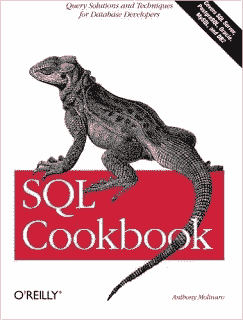
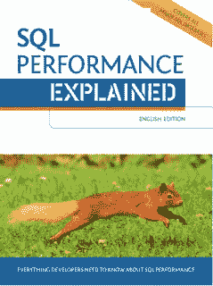
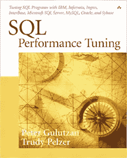
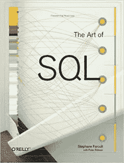
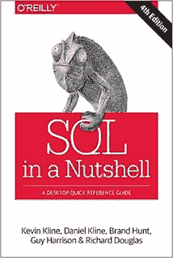

# 面向有经验的开发人员和数据科学家的 6 本高级 SQL 书籍

> 原文：<https://medium.com/javarevisited/5-advanced-sql-books-for-experienced-programmers-software-engineers-and-data-scientists-e82bb8bf81cd?source=collection_archive---------0----------------------->

## 从索引到性能调优，我最喜欢的掌握 SQL 和高级数据库概念的书籍。

大家好，如果你是一名经验丰富的程序员或数据科学家，知道如何编写 SQL 查询和数据库基础知识，但希望将你的 SQL 和数据库技能提升到一个新的水平，那么你来对地方了。

早些时候，我已经分享了针对初学者的最佳 SQL 课程，以及学习 T2、MySQL 和 T4 SQL Server 的课程，在这篇文章中，我将分享一些更高级的 SQL 书籍，任何有经验的专业人士都可以阅读这些书籍，将他们的 SQL 技能提升到一个新的水平。

这也是关于 SQL 书籍的第二篇文章，在第一部分，我分享了一些最好的 SQL 书籍，这些书籍对于学习 SQL 查询和数据库的基础知识是必不可少的，如规范化、索引和其他设计知识，如果你还没有读过，我建议现在就去读。你会发现一些惊人的书籍开始学习 SQL。

在这篇文章中，我将分享一些学习高级 SQL 编程的最佳书籍，它们可以帮助你编写[更好的 SQL 查询](http://javarevisited.blogspot.sg/2017/01/a-better-way-to-write-sql-queries.html)，并了解数据库如何处理那些查询。我坚信书籍是学习编程和技术的一个很好的来源，尽管它们在快速变化。只有书籍提供了掌握像 SQL 这样的主题所需的技术和技巧的全面覆盖。

SQL 是任何程序的[必备技能之一](/javarevisited/11-essential-skills-to-become-software-developer-in-2020-c617e293e90e) r .每个专业程序员、软件工程师、DBA、业务分析师，甚至测试人员都应该读一本关于 SQL 的好书。幸运的是，市场上有许多好的 SQL 书籍，但是根据你现有的知识和经验水平，你应该选择那些能让你的 SQL 技能更上一层楼的书籍。

这些书也将帮助你跨数据库厂商工作，比如[甲骨文](http://www.java67.com/2018/02/5-free-oracle-and-microsoft-sql-server-online-courses.html)、[微软 SQL Server](https://javarevisited.blogspot.com/2020/02/top-5-courses-to-learn-microsoft-sql-server-mssql.html) 、 [MySQL](https://javarevisited.blogspot.com/2018/05/top-5-mysql-courses-to-learn-online.html) 。一旦你知道如何编写符合 ANSI 标准并能在任何数据库上运行的正确的 SQL 查询，你就会感受到成为 SQL 高手的快乐。

# 面向有经验的专业人员的 5 本高级 SQL 书籍

这里有一些能让你的 SQL 技能更上一层楼的最佳书籍。这些书将帮助您学习高级概念，并帮助您弥补基础知识的不足，如[连接](http://javarevisited.blogspot.com/2013/05/difference-between-left-and-right-outer-join-sql-mysql.html)、[索引](http://javarevisited.blogspot.sg/2013/08/difference-between-clustered-index-and-nonclustered-index-sql-server-database.html)，以及其他数据库设计概念，如规范化。

## 1. [SQL 食谱:数据库开发人员的查询解决方案和技术](https://www.amazon.com/SQL-Cookbook-Solutions-Techniques-Developers/dp/0596009763?tag=javamysqlanta-20)

由 Anthony Molinaro 编写的 SQL Cookbook:Query Solutions and Techniques for Database Developers(Cookbooks(O ' Reilly))第一版是另一本针对有经验的程序员和任何以 SQL 编码为生的人的精彩书籍。

我非常喜欢这本书对 SQL 的描述，即“ **SQL 是一种看似简单的语言，”**许多程序员和 DBA 都没有超越简单的 CRUD 语句，如 SELECT、INSERT、UPDATE 等。删除。尽管如此，您仍然可以用 SQL 做很多事情；这就是 SQL Cookbook 帮助你的地方。

它将通过使用作者安东尼·莫利纳利最喜欢的 SQL 技术和特性，教你如何将你的 SQL 技能提升到一个新的水平。

您将了解高级 SQL 概念，如窗口函数、强大的数据库特定功能，如 SQL Server 的 PIVOT 和 UNPIVOT 运算符、Oracle 的 MODEL 子句以及 PostgreSQL 的便捷 GENERATE_SERIES 函数。

这本书还解释了遍历字符串的技术，它允许您使用 SQL 解析字符、单词或分隔的字符串元素。简而言之，这是一本让你的 SQL 技能更上一层楼的好书。

而且，如果你更喜欢在线课程，你可以将这本书与何塞·波尔蒂利亚在 Udemy 上的 [**完整的 SQL Bootcamp**](https://click.linksynergy.com/fs-bin/click?id=JVFxdTr9V80&subid=0&offerid=323058.1&type=10&tmpid=14538&RD_PARM1=https%3A%2F%2Fwww.udemy.com%2Fthe-complete-sql-bootcamp%2F) 课程结合起来，这样可以两全其美。

<https://click.linksynergy.com/fs-bin/click?id=JVFxdTr9V80&subid=0&offerid=323058.1&type=10&tmpid=14538&RD_PARM1=https%3A%2F%2Fwww.udemy.com%2Fthe-complete-sql-bootcamp%2F>  

## [2。Markus Winand 解释了 SQL 性能](http://www.amazon.com/Performance-Explained-Everything-Developers-about/dp/3950307826/?tag=javamysqlanta-20)

这是另一本高级 SQL 书籍，我认为每个程序员和数据科学家都应该阅读。如果你想知道数据库如何执行你的 SQL 查询？什么是查询引擎？在更新记录和搜索记录的过程中，索引是如何工作的？以及如何编写比这本书更好的 SQL 查询。

如果我说我所知道的关于 SQL indexe 的一切都是因为这本书，那就不会错。我对数据库索引有很多误解，不知道它们的顺序如何影响性能。

我甚至不知道[什么是表扫描、索引扫描和索引搜索](https://www.java67.com/2017/12/difference-between-table-scan-index.html)，以及一般来说，索引在 SQL 中是如何详细工作的，直到学习索引如何工作以及它们如何影响查询性能。

这本优秀的书是马库斯·温南写的，我非常感谢他详细解释了如此重要的话题。每个程序员必读的 SQL 书籍之一，我向每个软件开发人员和数据科学家强烈推荐这本书。

这本书的另一个优点是，Markus 解释了所有主要数据库(如 MySQL、PostgreSQL、SQL Server 和 Oracle)中的概念和代码，这意味着无论您使用哪个数据库，您都会更好地理解。

此外，如果你需要一门在线课程来配合这本书，那么我推荐你查看 Udemy 上的 [**Oracle SQL 性能调优大师班 20232**](https://click.linksynergy.com/deeplink?id=CuIbQrBnhiw&mid=39197&murl=https%3A%2F%2Fwww.udemy.com%2Fcourse%2Fsql-performance-tuning-masterclass%2F) 课程。它非常适合从事 Oracle 数据库工作的开发人员和数据库管理员。

<https://click.linksynergy.com/deeplink?id=CuIbQrBnhiw&mid=39197&murl=https%3A%2F%2Fwww.udemy.com%2Fcourse%2Fsql-performance-tuning-masterclass%2F>  

## 3. [SQL For Smarties，第五版:高级 SQL 编程](https://www.amazon.com/Joe-Celkos-SQL-Smarties-Fifth/dp/0128007613/?tag=javamysqlanta-20)

Joe Celko 的 SQL for Smarties，第四版:高级 SQL 编程(数据管理系统中的 Morgan Kaufmann 系列)是一本将您的 SQL 技能提升到一个新水平的优秀书籍。

他是 SQL 的权威之一，也是几本流行的 SQL 书籍的作者，包括 [SQL 谜题](http://www.java67.com/2016/09/sql-5-best-books-to-learn-and-master.html)。他还是 ANSI SQL 标准委员会的成员长达十年。

这本书提供了使用 ANSI 标准 SQL 编写有效的、有时是复杂的 SQL 语句的技巧、技术和指导。它涉及的主题从[数据库设计](https://javarevisited.blogspot.com/2017/11/top-5-books-to-learn-database-design.html)和规范化到使用正确的数据类型到分组和集合操作、优化、数据缩放等等。

即使你读过这本书的前几版，也应该读最新修订版。

每个以编写 SQL 查询为生的程序员都会在 SQL 中找到对聪明人有用的东西。如果你需要更多的练习，Udemy 上的 [**棒球数据库查询与 SQL**](http://bit.ly/2CUTGC7) 免费 SQL 查询课程提供了很好的查询练习。

<http://bit.ly/2CUTGC7>  

## 4.[Peter Gulutzan 和 Trudy Pelzer 的 SQL 性能调优](https://www.amazon.com/SQL-Performance-Tuning-Peter-Gulutzan/dp/0201791692?tag=javamysqlanta-20)

知道如何编写 SQL 查询是一回事，编写快速且高性能的 SQL 查询是另一项技能。这也是区分新手和有经验程序员的技巧。这本书提供了许多实用的技巧来提高所有主要数据库系统的 SQL 性能。

它并不教你 SQL 语法和如何使用特定的 SQL 命令，而是帮助你理解主要 DBBS 之间的区别，包括三大巨头、 [Oracle](/javarevisited/6-best-pl-sql-and-oracle-courses-for-beginners-to-learn-online-effd07d5fd2) 、 [SQL Server](/javarevisited/5-best-courses-to-learn-microsoft-sql-server-in-depth-e9f11b73c14a) 和 [MySQL](http://www.java67.com/2018/02/5-free-php-and-mysql-courses-for-web-developers.html) 。

在本书中，作者介绍了几个实用技巧来提高跨数据库的 SQL 性能。如果您处理不同的数据库实现，无论您是程序员、顾问、DBA 还是技术最终用户，这本书都将是一笔巨大的财富。

本书中给出的技巧可以帮助您决定哪种调优技术适用于哪种数据库。在 SQL Server 中提供更好性能的一个技巧并不需要在 Oracle 中提供最佳性能。

本质上，这就是你将在本书中学到的东西。你也可以把这本书和 Udemy 的[**Oracle SQL Performance Tuning master class 2023**](https://click.linksynergy.com/deeplink?id=CuIbQrBnhiw&mid=39197&murl=https%3A%2F%2Fwww.udemy.com%2Fcourse%2Fsql-performance-tuning-masterclass%2F)结合使用，Udemy 是这本书的好伙伴。

<https://click.linksynergy.com/deeplink?id=CuIbQrBnhiw&mid=39197&murl=https%3A%2F%2Fwww.udemy.com%2Fcourse%2Fsql-performance-tuning-masterclass%2F>  

顺便说一句，如果你对学习 SQL 的好处有任何疑问，因为你是 Java 或 web 开发人员，让我非常明确地告诉你，今天每个人都想要一个完整的开发人员，也就是说，一个万事通，至少精通一项技能。认识到这一点很重要，因为作为一名 Java 开发人员。我几乎没有参与过任何只做 Java 相关工作的项目。它总是混合了各种技术，如 [Linux](http://javarevisited.blogspot.sg/2016/06/10-example-of-lsof-command-in-unix-linux.html) 、 [XML](http://javarevisited.blogspot.sg/2013/01/10-xml-interview-questions-and-answers.html) 、 [SQL](http://javarevisited.blogspot.sg/2017/02/top-6-sql-query-interview-questions-and-answers.html) 、 [Java](https://javarevisited.blogspot.sg/2017/11/top-5-free-java-courses-for-beginners.html#axzz4zuIICRs9) ，以及用其他语言和技术开发的其他应用程序，如 [C++](https://dev.to/javinpaul/top-10-courses-to-learn-c-in-depth-best-of-lot-1k7) 。

SQL 最大的好处是，它是一种非常稳定的技术，作为一种编程语言，它不会以很快的速度变化，并且在未来的许多年里，它将很好地为您服务。这也为你提供了领先于其他相同背景的候选人的竞争优势。

举个例子，如果你得到两个核心 Java 知识扎实的候选人，一个有更好的 [SQL](https://javarevisited.blogspot.com/2015/06/5-websites-to-learn-sql-online-for-free.html) 和 [UNIX](http://www.java67.com/2018/02/5-free-linux-unix-courses-for-programmers-learn-online.html) 技能，你会选谁？很可能是第二个候选人。

不管怎样，让我们进入下一本书:

## 5.[夏羽·法鲁特的 SQL 艺术](https://www.amazon.com/Art-SQL-Stephane-Faroult/dp/0596008945?tag=javamysqlanta-20)

这是另一本很棒的 SQL 书籍，适合有经验的开发人员，他们接触数据库和 SQL 的关键领域，比如设计一个高性能的数据库。任何构建数据库应用程序的人都知道，设计不当的数据库可能是完美应用程序性能的最大障碍。这本书是以《孙子兵法》的风格写成的。每一章都有相似的标题，如“铺设计划”、“战术部署”、“九种情况”等。

标题为“战术部署”的章节涵盖了索引的主题，在“九种情况”中，作者考察了几种经典的 SQL 模式以及如何最好地实现它们。

如果你愿意，你也可以将这本书与 Educative 上的 [**软件工程师数据库设计基础**](https://www.educative.io/courses/database-design-fundamentals?affiliate_id=5073518643380224) 这样的互动课程结合起来，获得一些数据库设计的实践经验。

## 6.[简而言之 SQL](https://www.amazon.com/SQL-Nutshell-Desktop-Reference-OReilly/dp/0596518846?tag=javamysqlanta-20)

由凯文·克兰、丹尼尔·克莱恩和布兰德·亨特合著的《SQL 简括》第三版是程序员、分析师和数据库管理员(DBA)的必备参考。这本书为 SQL 提供了很好的跨平台语法参考。要找到一个特定 DBMS 的确切语法，这可能不是最容易的参考，但对于那些使用多个 DBMS 的人来说，这绝对是最好的参考。

对了，如果你正在学习 SQL 成为一名数据科学家，那么我也推荐你去看看加州大学戴维斯分校在 Coursera 上开设的**[**数据科学课程 SQL**](https://coursera.pxf.io/c/3294490/1164545/14726?u=https%3A%2F%2Fwww.coursera.org%2Flearn%2Fsql-for-data-science)。**

**真正掌握 SQL 是一门很牛逼的课程。与其他 Coursera 课程一样，它也是免费审核的，这意味着你可以免费学习，但该课程也是数据科学专业 [**学习 SQL 基础知识**](https://coursera.pxf.io/c/3294490/1164545/14726?u=https%3A%2F%2Fwww.coursera.org%2Fspecializations%2Flearn-sql-basics-data-science) **和**的一部分，如果你需要 Coursera 证书以显示在你的 LinkedIn 个人资料或简历中，你需要付费。**

**<https://coursera.pxf.io/c/3294490/1164545/14726?u=https%3A%2F%2Fwww.coursera.org%2Flearn%2Fsql-for-data-science>  

顺便说一下，除了单独加入这些课程和专业，你还可以加入 [**Coursera Plus**](https://coursera.pxf.io/c/3294490/1164545/14726?u=https%3A%2F%2Fwww.coursera.org%2Fcourseraplus) ，这是 Coursera 的一个订阅计划，让你可以无限制地访问他们最受欢迎的课程、专业、专业证书和指导项目。

<https://coursera.pxf.io/c/3294490/1164545/14726?u=https%3A%2F%2Fwww.coursera.org%2Fcourseraplus>  

以上是学习高级 SQL 编程的最佳书籍。如果您在项目中使用 SQL，正在学习 SQL，或者已经在 SQL 领域工作了几年，那么您可以阅读这些书籍，将您的 SQL 技能提升到一个新的水平。

关于 SQL then select、update 和 insert 语句，有太多东西需要学习，你会对这些书中学到的一些概念感到惊讶，尤其是涉及到跨数据库知识的时候。

我也分享了许多免费的 [SQL 书籍](http://www.java67.com/2018/01/top-4-free-microsoft-sql-server-books.html)和[课程](http://www.java67.com/2018/02/5-free-database-and-sql-query-courses-programmers.html)，你可以用它们开始你的 SQL 之旅。

其他**免费在线课程**面向程序员你可能喜欢的
[5 门免费课程面向初学者学习 Docker](/javarevisited/top-5-free-courses-to-learn-docker-for-beginners-best-of-lot-b2b1ad2b98ad)
[10 门免费课程面向 2023 年学习 AWS](/javarevisited/top-10-courses-to-learn-amazon-web-services-aws-cloud-in-2020-best-and-free-317f10d7c21d)
[5 门免费课程面向数据科学学习 R](/javarevisited/top-5-free-courses-to-learn-r-programming-for-data-science-and-statistics-in-2020-305bf1c6f24e)
[我最喜欢的免费 JavaScript 初学者教程](/javarevisited/my-favorite-free-tutorials-and-courses-to-learn-javascript-8f4d0a71faf2)
[10 门免费 Python 教程来自微软和谷歌](/swlh/5-free-python-courses-for-beginners-to-learn-online-e1ca90687caf)
[15 门免费课程面向初学者学习 Python 编程 免费课程学习 Java 编程](/swlh/5-free-python-courses-for-beginners-to-learn-online-e1ca90687caf)
[7 免费课程学习 SQL 和数据库](/javarevisited/7-free-courses-to-learn-database-and-sql-for-programmers-and-data-scientist-e7ae19514ed2)
[10 书籍和课程学习 Angular for Web 开发](/javarevisited/top-10-angular-books-and-courses-for-beginners-and-experienced-web-developers-best-of-lot-9a2dae87f04c)
[我最喜欢的免费课程学习数据结构和算法](/free-code-camp/these-are-the-best-free-courses-to-learn-data-structures-and-algorithms-in-depth-4d52f0d6b35a)
[我最喜欢的免费课程学习 Jenkins、Maven 和 Docker](/javarevisited/top-10-free-courses-to-learn-maven-jenkins-and-docker-for-java-developers-51fa7a1e66f6?source=collection_home---4------3-----------------------)

如果你喜欢这篇文章和这些*最适合开发人员和 DBA 的高级 SQL 书籍，* 这很重要。如果您有任何建议、反馈或问题，请留言，我会尽力回答。
我只是喜欢发现伟大的书籍。

另外，如果你喜欢从在线课程中学习，那么你可以将这些高级 SQL 书籍与何塞·波尔蒂利亚在 Udemy 网站上的 [**完整的 SQL 训练营**](https://click.linksynergy.com/fs-bin/click?id=JVFxdTr9V80&subid=0&offerid=323058.1&type=10&tmpid=14538&RD_PARM1=https%3A%2F%2Fwww.udemy.com%2Fthe-complete-sql-bootcamp%2F) 课程结合起来，这样可以两全其美。

<https://click.linksynergy.com/fs-bin/click?id=JVFxdTr9V80&subid=0&offerid=323058.1&type=10&tmpid=14538&RD_PARM1=https%3A%2F%2Fwww.udemy.com%2Fthe-complete-sql-bootcamp%2F> **