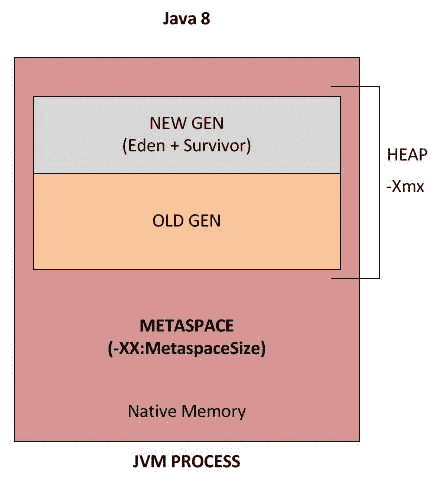
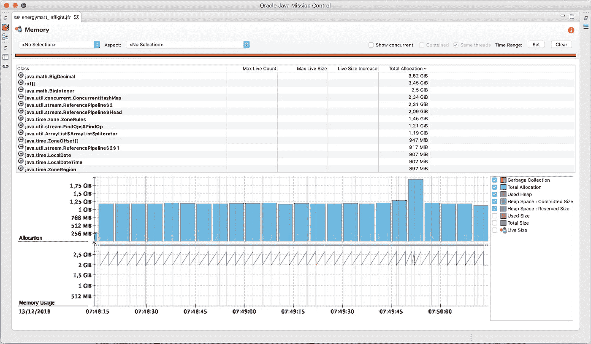
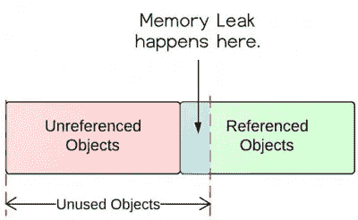

# 2023 年面向有经验开发人员的 5 门最佳 Java 性能和内存管理课程

> 原文：<https://medium.com/javarevisited/5-best-advanced-java-performance-and-memory-management-courses-for-experienced-programmers-f7b2e07be5ca?source=collection_archive---------1----------------------->

## 这些是高级 Java 课程，为中级和有经验的开发人员学习内存管理和性能调优

image_credit — Pluralsight 了解内存管理

大家好，如果你从事 Java 开发已经有几年了，那么你就会知道**性能**是任何 Java 应用程序的关键。作为一名高级 Java 开发人员，你应该知道**如何提高 Java 应用程序的性能**，并且了解经常导致 Java 应用程序性能下降的内存管理和垃圾收集。

这些是一些需要花些功夫去培养的[高级技能](https://javarevisited.blogspot.com/2017/12/10-things-java-programmers-should-learn.html#axzz5atl0BngO)。即使你用 Java 编程多年，它也不会默认出现，因为大多数人不接触这些主题。他们中的许多人害怕或接受性能调优工作，并总是向他们团队中最资深或最优秀的开发人员看齐。由于我的许多读者问我如何提高他们的 Java 性能调优技能，我将分享一些你可以用来学习 Java 性能调优的最好的在线课程。

这是我之前为有经验的程序员写的帖子的延续，比如[最佳 JVM 内部课程](/javarevisited/7-best-courses-to-learn-jvm-garbage-collection-and-performance-tuning-for-experienced-java-331705180686)、[高级 Java 书籍](https://javarevisited.blogspot.com/2020/04/top-10-advanced-java-books-for-experienced-programmers.html)和[高级核心 Java 课程](https://javarevisited.blogspot.com/2020/04/top-10-advanced-core-java-courses-for-experienced-developers.html)。这些课程将教你每个有经验的 Java 专业人员应该知道的关于内存、垃圾收集、调优 VM 和避免内存泄漏的知识。您将学习内存分析器等工具，JProfiler、VisualVM 等分析器，了解如何监控 Java 应用程序的性能，**如何检查 GC 日志**，如何检查是否存在[死锁](https://javarevisited.blogspot.com/2018/08/how-to-avoid-deadlock-in-java-threads.html)或线程争用，以及如何读取线程转储以了解**和 Java 应用程序内部发生了什么**。

你还将培养朝正确方向思考的技能，比如你的 Java 服务比你希望的要慢吗？随着负载的增加，他们是否消耗了太多的系统资源或性能滞后？除非你质疑自己并发展这种思维，否则不容易找到性能下降的根本原因并解决它。

Java 应用程序经常会遇到内存问题，如 [OutOfMemoryError](http://javarevisited.blogspot.sg/2011/09/javalangoutofmemoryerror-permgen-space.html#axzz5DmwFLA1K) 和过多的 GC 日志记录，这会使您的应用程序变慢，但您需要经验和知识来解决，因为有太多的事情需要了解，如数据是否增加，DB 是否阻塞或变慢，或者 Linux 机器是否有资源问题，或者是您的 Java 代码或 JVM 设置。

这些课程将向您展示如何使用免费工具来修复它们。

顺便说一句，这些课程面向熟悉 Java 基础知识的有经验的 Java 开发人员。如果你是 Java 新手，那么最好从像 Udemy 上 Tim Buchalaka 的 [**完整 Java 大师班**](https://click.linksynergy.com/deeplink?id=JVFxdTr9V80&mid=39197&murl=https%3A%2F%2Fwww.udemy.com%2Fcourse%2Fjava-the-complete-java-developer-course%2F) 这样的综合性 Java 课程开始，而不是加入这些高级课程。这将以更加结构化的方式为您提供 Java 开发人员需要了解的所有基础知识。

<https://click.linksynergy.com/deeplink?id=JVFxdTr9V80&mid=39197&murl=https%3A%2F%2Fwww.udemy.com%2Fcourse%2Fjava-the-complete-java-developer-course%2F>  

# 2023 年学习性能调优和内存管理的 5 门高级 Java 课程

在不浪费您更多时间的情况下，这里有学习 Java 性能调优、内存管理、垃圾收集调优和 JVM 特定内容的最佳课程。这些都是 Java 专家精心挑选并极力推荐的课程，而且价格也非常实惠。

## 1. [Java 应用性能和内存管理](https://click.linksynergy.com/deeplink?id=JVFxdTr9V80&mid=39197&murl=https%3A%2F%2Fwww.udemy.com%2Fcourse%2Fjava-application-performance-and-memory-management%2F)

如果您是一名高级 Java 开发人员，并且希望提高您的 Java 应用程序性能技能，那么这可能是开始学习的最佳课程。在本课程中，您将首先了解哪些因素会导致 Java 应用程序中的性能问题，如线程、内存、垃圾收集，以及如何解决这些问题。

它还会教你一些 Java 开发人员在设计时可用的最佳实践，比如如何做出好的编码选择以获得最佳性能。

我们将了解**配置 Java 虚拟机以在运行时提供更好性能的各种方法**。我们将深入探讨虚拟机如何管理内存和垃圾收集过程。

**以下是参加本课程的链接** — [Java 应用性能和内存管理](https://click.linksynergy.com/deeplink?id=JVFxdTr9V80&mid=39197&murl=https%3A%2F%2Fwww.udemy.com%2Fcourse%2Fjava-application-performance-and-memory-management%2F)

在这一过程中，我们将学习即时编译器、性能测试和基准测试、反编译字节码、使用 **GraalVM** 作为替代虚拟机等等。简而言之，这是有经验的 Java 开发人员的最佳课程之一，他们希望将自己的技能提升到一个新的水平。

## 2. [Java 多线程、并发&性能优化](https://click.linksynergy.com/deeplink?id=JVFxdTr9V80&mid=39197&murl=https%3A%2F%2Fwww.udemy.com%2Fcourse%2Fjava-multithreading-concurrency-performance-optimization%2F)

这是另一门优秀的课程，面向希望成为 Java 多线程、并发并行编程专家的有经验的 JAva 开发人员，重点强调高性能。

在本课程中，您将学习到排除性能和内存相关问题、线程相关问题以及 [JVM](/javarevisited/7-best-courses-to-learn-jvm-garbage-collection-and-performance-tuning-for-experienced-java-331705180686) 特定问题所需的所有基本工具。正如我以前说过的，[工具](https://www.java67.com/2018/04/10-tools-java-developers-should-learn.html)真的很重要，因为一个 Java 开发者和他的工具一样优秀。

如果您不知道如何分析您的 Java 应用程序，那么您永远也不会知道哪个对象占用了所有的内存，代码的瓶颈在哪里。

类似地，如果你不能读取线程转储，那么你就不知道你的程序到底在哪里卡住了，它们是在等待数据库响应还是另一个服务器，还是在等待某个文件锁定。如果您知道正确的工具，您可以快速有效地排除故障。

**这里是加入本课程的链接** — [Java 多线程、并发&性能优化](https://click.linksynergy.com/deeplink?id=JVFxdTr9V80&mid=39197&murl=https%3A%2F%2Fwww.udemy.com%2Fcourse%2Fjava-multithreading-concurrency-performance-optimization%2F)

这个课程的好处在于它是设计来教你**“如何钓鱼”**。您将学习并发编程的基础，而不是记忆类、库或 Java APIs，从完整的基础开始，一直到多线程中非常高级的主题。

## 2. [Java 内存管理](https://click.linksynergy.com/deeplink?id=JVFxdTr9V80&mid=39197&murl=https%3A%2F%2Fwww.udemy.com%2Fcourse%2Fjava-memory-management%2F)

这是 Udemy 关于 Java 内存管理和提高 Java 性能的另一个很棒的课程。对于需要深入理解 Java 中内存如何工作的 Java 专业人员(或有抱负的 Java 专业人员)来说，这是一门理想的课程。在本课程中，你将学习 Java 中可能出现的内存泄漏类型(是的，Java 中可能出现内存泄漏)，以及如何避免它们。此外，您还将了解常用工具，这些工具可用于分析您的应用程序如何运行，并检测低效的内存使用，例如占用过多内存的对象，或由于低效的[垃圾收集](https://www.java67.com/2019/08/best-books-to-learn-java-virtual-machine-in-depth.html)而导致的问题，以及最重要的是如何修复它们。

如果你认为这可能对你来说太高级了，那么不要担心，你不需要成为 Java 专家来学习这门课程，但是你应该能够在开始之前自信地创建基本的 Java 代码。

以下是加入本课程的链接— [Java 内存管理](https://click.linksynergy.com/deeplink?id=JVFxdTr9V80&mid=39197&murl=https%3A%2F%2Fwww.udemy.com%2Fcourse%2Fjava-memory-management%2F)

## 4.[Tim Ojo 的 Java 性能调优](https://pluralsight.pxf.io/c/1193463/424552/7490?u=https%3A%2F%2Fwww.pluralsight.com%2Fcourses%2Fjava-performance-tuning)

如果你是一个 plur sight 学习者，并且正在 plur sight 上寻找好的 Java 课程，那么你会很高兴找到这个课程。这是 Pluralsight 上的高级 Java 课程之一，它将向您传授故障排除、分析和提高 Java 应用程序性能的所有工具和技术。在本课程中，您将学习如何以结构化和系统化的方式提高 Java 应用程序的性能。首先，您将发现用于分析应用程序性能和解决性能问题的工具和技术。

接下来，您将了解影响性能的 [JVM 内部](https://javarevisited.blogspot.com/2019/04/top-5-courses-to-learn-jvm-internals.html#axzz5wCEaQjmJ)以及如何调优它们。最后，你将获得编写高性能应用程序代码的最佳实践。完成本课程后，您将具备在生产环境中构建和运行高性能 Java 应用程序所需的技能和知识。

**这里是加入本课程的链接**—[Tim Ojo 的 Java 性能调优](https://pluralsight.pxf.io/c/1193463/424552/7490?u=https%3A%2F%2Fwww.pluralsight.com%2Fcourses%2Fjava-performance-tuning)

顺便说一句，你需要一个 Pluralsight 会员才能进入这个课程，费用大约是每年 299 美元或每月 29 美元，但可以无限制地进入他们的 5000+专家指导的课程。如果你想尝试，你也可以查看他们的 [**10 天免费通行证**](https://pluralsight.pxf.io/c/1193463/424552/7490?u=https%3A%2F%2Fwww.pluralsight.com%2Flearn) 免费进入这个课程。

<https://pluralsight.pxf.io/c/1193463/424552/7490?u=https%3A%2F%2Fwww.pluralsight.com%2Flearn>  

## 5.[理解并解决 Java 内存问题](https://pluralsight.pxf.io/c/1193463/424552/7490?u=https%3A%2F%2Fwww.pluralsight.com%2Fcourses%2Fjava-understanding-solving-memory-problems)

这是 Pluralsight 的另一门高级 Java 课程，我强烈推荐给有经验的 Java 开发人员。您可能会惊讶地发现，尽管存在垃圾收集，但 Java 应用程序经常会遇到内存问题，如内存不足错误和过多的 GC 日志记录，这会使您的应用程序变慢。本课程将教你如何发现并解决这些问题。您将学习如何在 Java 中解决与内存相关的问题，如[堆空间](https://javarevisited.blogspot.com/2011/05/java-heap-space-memory-size-jvm.html#axzz5SDsAfcC8)、[栈](https://javarevisited.blogspot.com/2013/01/difference-between-stack-and-heap-java.html)和元空间。

首先，您将探索如何解决内存泄漏的问题。接下来，您将发现关于过度消耗内存和耗尽堆的建议。

最后，您将了解为什么您的应用程序会因为过快的内存分配速度而变慢。本课程结束时，你将学会如何解决这些问题，以及如何从总体上理解与记忆相关的问题。

**这里是加入本课程的链接** e — [理解和解决 Java 内存问题](https://pluralsight.pxf.io/c/1193463/424552/7490?u=https%3A%2F%2Fwww.pluralsight.com%2Fcourses%2Fjava-understanding-solving-memory-problems)

以上是学习 Java 性能调优和内存管理的**最佳课程**。对于高级 Java 开发人员来说，诊断和修复内存问题和性能问题是一项重要的技能，这些课程将为您提供足够的知识、工具和策略来解决内存泄漏和其他与内存相关的错误，并提高 Java 应用程序的性能。

您可能想探索的其他**编程资源文章**

*   [面向程序员的 10 门高级核心 Java 课程](https://javarevisited.blogspot.com/2020/04/top-10-advanced-core-java-courses-for-experienced-developers.html)
*   [面向 Java 开发者的 5 门免费 Spring 框架课程](http://www.java67.com/2017/11/top-5-free-core-spring-mvc-courses-learn-online.html)
*   [与 Spring Boot 学习微服务的 5 大课程](https://javarevisited.blogspot.com/2018/02/top-5-spring-microservices-courses-with-spring-boot-and-spring-cloud.html#axzz6JJFPbsyP)
*   [2021 年学习 Web 开发的 5 门课程](http://javarevisited.blogspot.sg/2018/02/top-5-online-courses-to-learn-web-development.html#axzz57wed1PWd)
*   [面向有经验开发人员的 10 本高级 Java 书籍](https://javarevisited.blogspot.com/2020/04/top-10-advanced-java-books-for-experienced-programmers.html)
*   [学习 Java 微服务的 7 大课程](/javarevisited/top-5-courses-to-learn-microservices-in-java-and-spring-framework-e9fed1ba804d)
*   [编程/编码工作面试 10 门课程](http://javarevisited.blogspot.sg/2018/02/10-courses-to-prepare-for-programming-job-interviews.html)
*   [深入学习 Spring 的五大课程](https://javarevisited.blogspot.com/2018/06/top-6-spring-framework-online-courses-Java-programmers.html)
*   [5 门免费学习核心 Java 的在线课程](http://javarevisited.blogspot.sg/2017/11/top-5-free-java-courses-for-beginners.html#axzz4zuIICRs9)
*   [学习正则表达式的前 5 门课程](https://javarevisited.blogspot.com/2020/04/top-5-courses-to-learn-regular-expression-regex.html)
*   面向有经验的 Java 开发人员的 5 大 Java 设计模式课程
*   [面向 Java 开发人员的 10 门高级 Spring Boot 课程](/javarevisited/10-advanced-spring-boot-courses-for-experienced-java-developers-5e57606816bd)
*   [初学春云的 5 大课程](https://javarevisited.blogspot.com/2018/04/top-5-spring-cloud-courses-for-java.html)
*   [学习 learn Shell 脚本的 5 门课程](http://javarevisited.blogspot.sg/2018/02/5-courses-to-learn-shell-scripting-in-linux.html)
*   [10 个面向 Java 开发人员的免费 Spring Boot 教程和课程](/javarevisited/10-free-spring-boot-tutorials-and-courses-for-java-developers-53dfe084587e)

感谢您阅读本文。如果你喜欢这些最好的 Java 性能调优和内存管理课程，请与你的朋友和同事分享。如果您有任何问题或反馈，请留言。

**P. S. —** 如果您是 Java 世界的新手，并且正在寻找一些免费的在线课程来开始学习 Java 编程语言，那么您也可以查看 [**Java 编程:初学者到大师**](https://click.linksynergy.com/deeplink?id=JVFxdTr9V80&mid=39197&murl=https%3A%2F%2Fwww.udemy.com%2Fcourse%2Fjava-programming-beginner-to-guru%2F)—Udemy 上的一门免费课程，开始您的 Java 开发之旅。

<https://click.linksynergy.com/deeplink?id=JVFxdTr9V80&mid=39197&murl=https%3A%2F%2Fwww.udemy.com%2Fcourse%2Fjava-programming-beginner-to-guru%2F> 