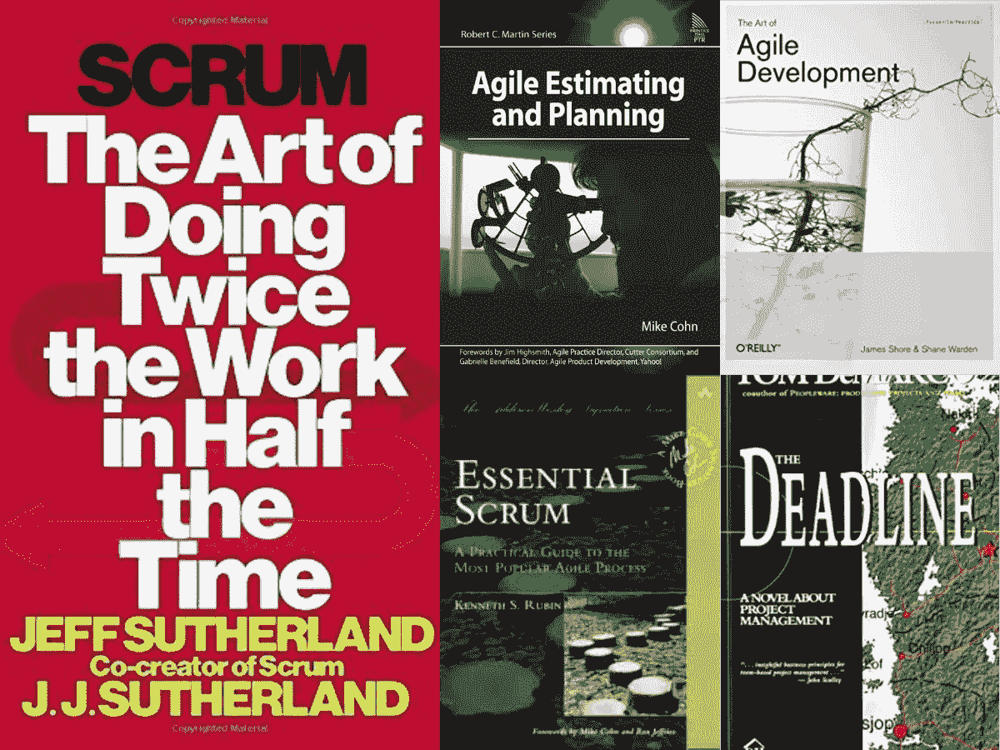
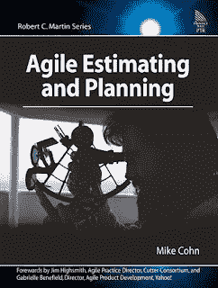
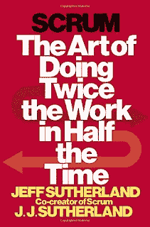

# 程序员和软件开发人员的 5 本最佳敏捷和 Scrum 书籍

> 原文：<https://medium.com/javarevisited/5-best-agile-and-scrum-books-for-programmers-and-software-developers-2bbff0a1c976?source=collection_archive---------0----------------------->

## 我最喜欢的书籍，适合初学软件工程师和程序员学习敏捷、Scrum 和 Xtreme 编程

大家好，如果你想学习敏捷和 Scrum 进行软件开发，并寻找最好的资源，比如最好的敏捷书籍和在线课程，那么你来对地方了。之前，我已经分享了 [**最佳敏捷课程**](/javarevisited/7-best-agile-and-scrum-online-training-courses-3b191e9b65eb) ，在这篇文章中，我将分享软件开发人员学习敏捷和 Scrum 的最佳书籍。

我开始职业生涯的时候，都是瀑布模型。你尝试，失败，然后每一个版本你都会得到一个软件的改进版本。我非常习惯于这种[软件开发的模式](https://javarevisited.blogspot.com/2019/01/10-things-every-programmer-and-software-engineer-should-know.html)，直到我在下一家公司接触到**敏捷开发方法**。我对敏捷感到困惑，因为有些人说它是 Scrum 和 Sprint，其他人说它是 XP 和看板，等等。

这种困惑持续了很长时间，因为我害怕问问题(害怕被认为是哑巴和浪费会议时间的人)，并且只获得零零碎碎的信息，而且当时我不擅长搜索书籍。

从那次经历中，我了解到，当你有困惑并想了解更多新技术时，没有什么比一本书或在线培训课程更好的开始了。你学习所有的基本信息，比如词汇、目的、现实世界的用法、术语，这些对于理解人们在 Scrum 或 Sprint 回顾/计划会议上谈论的内容是很重要的。

因为我很接近，一本书对我来说永远不够，我很自豪地收集了几本关于敏捷开发方法的最好的书，它们不仅教会了我如何使用敏捷、Scrum 或 XP，还教会了我为什么要使用敏捷？我认为这比站在 Scrum 会议上说你今天要做什么或者昨天已经完成了什么更重要。

很多程序员不明白，敏捷提供了开发复杂软件的过程、方法论。它试图在时间/金钱估算和软件开发的随机性中带来一些秩序。

对于高级程序员来说，了解敏捷在当今世界非常重要，因为许多公司越来越多地寻找 Scrum 大师职位，并希望他们的团队领导、解决方案架构师和高级开发人员擅长 Sprint、JIRA、Scrum 和 XP 方法。

顺便说一句，如果你更喜欢课程，那么你也可以看看 [**敏捷速成班:敏捷项目管理；Udemy 上的敏捷交付**](https://click.linksynergy.com/fs-bin/click?id=JVFxdTr9V80&subid=0&offerid=323058.1&type=10&tmpid=14538&RD_PARM1=https%3A%2F%2Fwww.udemy.com%2Fagile-crash-course%2F) 。这是一门很好的课程。

<https://click.linksynergy.com/fs-bin/click?id=JVFxdTr9V80&subid=0&offerid=323058.1&type=10&tmpid=14538&RD_PARM1=https%3A%2F%2Fwww.udemy.com%2Fagile-crash-course%2F>  

# 软件开发人员的 5 本最佳敏捷、Scrum 和 XP 书籍

这里是我收集的一些学习敏捷方法、Scrum 会议、XP 和项目开发和管理看板方法的最佳书籍。

对于想要成为 Scrum 大师的高级程序员和想要理解敏捷如何工作的初级开发人员来说，这些书是很好的资源。

顺便说一句，这是关于想成为项目经理和解决方案架构师或 Java 架构师的高级开发人员的书籍的第二篇文章，在上一篇文章中，我已经分享了一些关于[软件估算和项目管理的最佳书籍](http://javarevisited.blogspot.sg/2016/11/top-10-software-development-and-project.html)而在这篇文章中， 我将分享我学习敏捷方法的前 5 本书，包括 Scrum 和 XP

由于敏捷在过去几年变得越来越重要，几乎每个项目都在使用敏捷技术来满足不断变化的客户需求和业务环境，它也成为了获得程序员、软件工程师和项目经理工作的关键技能。 这些书将帮助你快速掌握敏捷方法。

尽管像 [JIRA](https://jira.atlassian.com/secure/Dashboard.jspa) 这样的工具使得采用敏捷变得非常容易，但是作为一名程序员，你必须理解敏捷开发方法所要求的术语和过程。

一个团队如果不够敏捷，无法对当今不断变化的业务需求做出反应，就无法提供技术应该为业务提供的竞争优势。

## 1.[敏捷开发的艺术第一版](https://www.amazon.com/Agile-Development-first-Text-Only/dp/B004SCFAC4/?tag=javamysqlanta-20)

这是我迄今为止读过的关于敏捷的最好的书之一。《敏捷开发的艺术》由 James Shore 和 Shane Warden 撰写，它教给你的不是 Scrum，而是 XP 方法论。

是的，我同意 Scrum 是当今世界上最流行的敏捷方法，我们都在团队中使用它，但是如果你使用它，XP 也可以带来很大的不同。

我学到的一些最好的开发实践，像[测试驱动开发](http://javarevisited.blogspot.com/2014/08/top-5-books-to-learn-unit-testing-junit-tdd-Java-programmers.html)，Spiking，进化设计都是因为 XP。好的一面是，当你在 Scrum 团队中工作或使用看板时，你可以作为个人使用 XP 原则。

简而言之，这是一本从敏捷开发开始的最好的书，无论你有什么经验，都必须阅读。这本书对高级开发人员、团队领导、解决方案架构师、项目经理以及实际开发和编写代码的初级开发人员同样有用。

如果你愿意，你也可以将这本书与 Jeremy 和 Vivek Khatri 在 Udemy 上开设的 [**敏捷基础**](https://click.linksynergy.com/deeplink?id=JVFxdTr9V80&mid=39197&murl=https%3A%2F%2Fwww.udemy.com%2Fcourse%2Fagile-fundamentals-scrum-kanban-scrumban%2F) 课程结合起来，该课程也涵盖了 Scrum 和看板以及敏捷基础并进行更新。

<https://click.linksynergy.com/deeplink?id=JVFxdTr9V80&mid=39197&murl=https%3A%2F%2Fwww.udemy.com%2Fcourse%2Fagile-fundamentals-scrum-kanban-scrumban%2F>  

## 2.[基本 Scrum:最流行敏捷过程的实用指南](https://www.amazon.com/Essential-Scrum-Practical-Addison-Wesley-Signature/dp/0137043295/?tag=javamysqlanta-20)

由于我是通过使用 XP 开始学习敏捷的，当谈到 Scrum 时，我让我的团队领导给我推荐一本书，他说去看看 Kenneth S. Rubin 的 Essential Scrum。

谢天谢地，我们的图书馆里有这本书的副本，那一周没有人借走它。我在周五拿到了这本书，在那个周末我了解了 Scrum 是怎么一回事。在读这本书之前，Scrum 对我来说只是在会议上站起来说你昨天做了什么，你今天要做什么，什么阻碍了你的道路，但这本书教会了我 Scrum 如何帮助一个大项目变得有序。

简而言之，这是学习 Scrum 方法论的最佳书籍之一，尤其是如果你想成为团队的 Scrum 大师的话。这也是软件开发中最热门的职位之一，许多大公司和投资银行都在寻找同时也是 Scrum 大师的高级程序员。

这本书也可以帮助你准备 Scrum Master 认证，但是如果你想准备得更好，我也推荐你加入 Udemy 上 Paul Ashun 的 Scrum 认证大师班 。通过 PSM 和在线 scrum 认证的绝佳课程。

<https://click.linksynergy.com/deeplink?id=JVFxdTr9V80&mid=39197&murl=https%3A%2F%2Fwww.udemy.com%2Fcourse%2Fscrum-certification%2F>  

## 3.[迈克·科恩的《敏捷评估和规划》](https://www.amazon.com/Agile-Estimating-Planning-first-Text/dp/B005GP91NG/?tag=javamysqlanta-20)

软件开发世界中最困难的事情之一是评估。除非你对工具、领域、现有代码库、开发人员等有全面的了解，否则很难预测一个特性要花多长时间。

有太多的变数和挑战，这就是为什么我钦佩任何能够准确预测的人。因为我们对自己的估计和计划从来都不自信，所以总会有一些缓冲时间。这本书介绍了一些很好的评估和计划技术，比如使用斐波那契将评估分成故事点。

此外，计划扑克是一个很好的主意，你应该在你的团队中尝试一下。这很有趣，有助于项目管理中最棘手的任务评估。我还推荐你参加 Udemy 上的 [**敏捷速成班:敏捷项目管理** t](https://click.linksynergy.com/fs-bin/click?id=JVFxdTr9V80&subid=0&offerid=323058.1&type=10&tmpid=14538&RD_PARM1=https%3A%2F%2Fwww.udemy.com%2Fagile-crash-course%2F) 课程，更好地学习敏捷。它和这本书很相配。

<https://click.linksynergy.com/fs-bin/click?id=JVFxdTr9V80&subid=0&offerid=323058.1&type=10&tmpid=14538&RD_PARM1=https%3A%2F%2Fwww.udemy.com%2Fagile-crash-course%2F>  

## 4. [Scrum:用一半的时间做两倍工作的艺术](https://www.amazon.com/Scrum-Doing-Twice-Work-Half/dp/038534645X/?tag=javamysqlanta-20)

这是另一本学习 Scrum 方法论的好书。这本书名副其实，被称为萨瑟兰的 Scrum 指南。我真的很喜欢读这本书，因为它就像读故事一样。

这本书充满了它们，作者用它们向你解释 Scrum 是如何工作的，以及 Scrum 不仅在软件开发中，而且在现实生活中的价值。

高级 Java 开发人员和所有那些想成为软件架构师项目经理的程序员的必读书籍之一。如果你想在职业生涯中成长，就不能错过这本书。简而言之，一本好书。如果你喜欢通过故事来学习，我当然喜欢。

如果你愿意，你也可以把这本书和 David Starr 的 课程上的**[**Scrum Fundamentals 结合起来。顺便说一下，你需要一个 Pluralsight 会员才能参加这个课程，费用大约是每月 29 美元或每年 299 美元。**](https://pluralsight.pxf.io/c/1193463/424552/7490?u=https%3A%2F%2Fwww.pluralsight.com%2Fcourses%2Fscrum-fundamentals)**

**<https://pluralsight.pxf.io/c/1193463/424552/7490?u=https%3A%2F%2Fwww.pluralsight.com%2Fcourses%2Fscrum-fundamentals> ** 

## **5.[截止日期:一部关于项目管理的小说](https://www.amazon.com/Deadline-Novel-about-Project-Management/dp/0932633390/?tag=javamysqlanta-20)**

**敏捷有时可能是一个技术性的、令人厌烦的话题，我在阅读关于敏捷的书籍时会严重睡着，这就是为什么我保持阅读时间短而集中的原因。但是，这本书并不无聊，因为它是以一种新颖的风格写的，这意味着它很有趣，很容易浏览。这是关于软件开发，尤其是项目管理的最佳书籍之一。它有助于更好地理解软件开发人员做什么以及他们的动机是什么。最棒的是，这是关于项目管理和软件开发的最容易阅读的书籍之一。**

**如果你在阅读关于敏捷方法和项目管理的书籍时感到无聊或睡着了，那就读这本书，这是一本有趣的关于项目经理在几乎不可能的期限内完成项目的经历的书。**

**很像 [**凤凰计划**](https://www.amazon.com/Phoenix-Project-DevOps-Helping-Business/dp/1942788290/?tag=javamysqlanta-20) 。如果你还没有读过这本书，我强烈推荐它，它是关于 DevOps 和自动化的，但是你会学到很多关于业务、流程、人员和 it 文化的知识。**

****

**顺便说一下，如果你对项目管理很认真，我强烈推荐你加入 Coursera 上的 [**谷歌项目管理:专业证书**](https://coursera.pxf.io/c/3294490/1164545/14726?u=https%3A%2F%2Fwww.coursera.org%2Fprofessional-certificates%2Fgoogle-project-management) 。这是最受欢迎的 Coursera 项目管理认证之一，由谷歌提供。**

**<https://coursera.pxf.io/c/3294490/1164545/14726?u=https%3A%2F%2Fwww.coursera.org%2Fprofessional-certificates%2Fgoogle-project-management>  

它设计得非常好，内容也是最新的，你会学到很多关于项目实施的有用细节。因为这是一个专业证书，你也可以把它添加到你的简历或 LinkedIn 个人资料中，以展示你的项目管理技能。

你可以单独加入这个证书，或者你可以获得一个[**Coursera Plus subscription**](https://coursera.pxf.io/c/3294490/1164545/14726?u=https%3A%2F%2Fwww.coursera.org%2Fcourseraplus)n，它允许无限制地访问许多流行的认证、课程和班级。

<https://coursera.pxf.io/c/3294490/1164545/14726?u=https%3A%2F%2Fwww.coursera.org%2Fcourseraplus>  

以上是关于学习敏捷开发方法的一些最好的书，比如 Scrum、看板、水晶、精益、冲刺故事和极限编程。你可以挑选自己喜欢的书，但是如果你想要我的推荐，并且对敏捷毫无概念，那么你应该从学习敏捷和 Scrum 的第一本书开始。

而且，如果你已经对敏捷和 Crum 有了一些了解，那么你应该从清单上的第二本 Scrum 书籍(杰夫·萨瑟兰和 JJ·萨瑟兰的《Scrum:事半功倍的艺术》)开始了解更多关于 Scrum 的知识。

现在，如果你对选择哪一本书感到困惑，这完全取决于你更好地联系哪一位作者，这两本书都很棒。只要试着读几页，你就会发现哪一页最适合你。如果你感到无聊，那么你就没有和作者交流，但是如果时间只是流逝，那么这本书就适合你。

其他**程序员推荐书籍**

*   [学习项目管理的前 5 本书](https://javarevisited.blogspot.com/2016/11/top-10-software-development-and-project.html#axzz5YWjgMMkL)
*   [破解 PMP 认证的 5 大课程](https://javarevisited.blogspot.com/2019/09/top-5-courses-to-crack-pmp-project-management-professional-certification-exam.html)
*   [给严肃程序员的 10 本算法书](http://www.java67.com/2015/09/top-10-algorithm-books-every-programmer-read-learn.html)
*   [每个程序员都应该读的 5 本书](http://www.java67.com/2016/02/5-books-to-improve-coding-skills-of.html)
*   [每个程序员都应该阅读的 5 本 SQL 书籍](http://www.java67.com/2016/09/sql-5-best-books-to-learn-and-master.html)
*   [12 本高级 Java 编程书籍—第 1 和第 2 部分](http://www.java67.com/2017/01/12-advanced-java-programming-books-for-experienced-programmers.html)
*   [编程/编码面试的前 5 本书](http://javarevisited.blogspot.sg/2016/06/top-5-books-for-programming-coding-interviews-best.html)
*   每个软件工程师都应该读的 10 本书
*   [学习 SOAP 和 REST Web 服务的最佳书籍](http://www.java67.com/2017/04/3-great-books-to-learn-java-web-services-soap-and-restful.html)
*   [2020 年学习 DevOps 的前 5 本书](https://javarevisited.blogspot.com/2020/04/top-5-books-to-learn-devops-for-developers.html)
*   [高级技术开发人员的下一步是什么？](/javarevisited/what-next-for-senior-developers-in-tech-project-manager-technical-architect-or-a-devops-engineer-b532a80c9ba1)

感谢阅读这篇文章。如果你喜欢这些书，请与你的朋友和同事分享。如果你有任何学习敏捷的好书，但不在这个列表中，或者有任何问题或反馈，请留下你的评论。
**p . s .**——如果你更喜欢在线课程，并且你需要一个免费的课程来学习敏捷和项目管理，那么你也可以看看这个为程序员提供的 [**5 个免费敏捷课程的列表**](http://javarevisited.blogspot.sg/2018/01/top-5-free-agile-courses-for-programmers.html) **。它包含来自 Udemy、Pluralsight 和 Coursera 的关于敏捷、Scrum 和项目管理的免费课程。**

</javarevisited/10-free-online-courses-to-learn-agile-and-scrum-for-beginners-e028711532ce> **