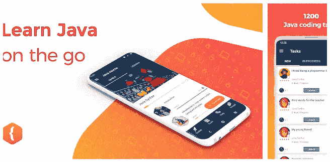
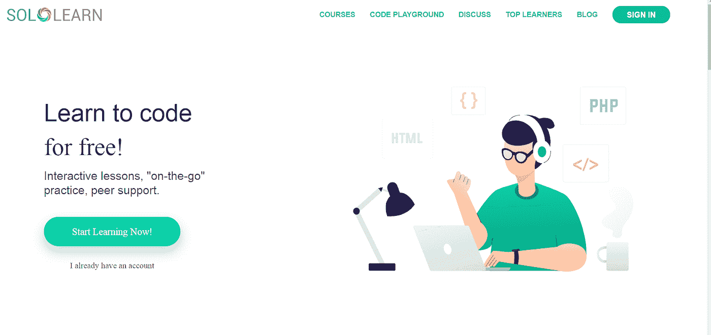
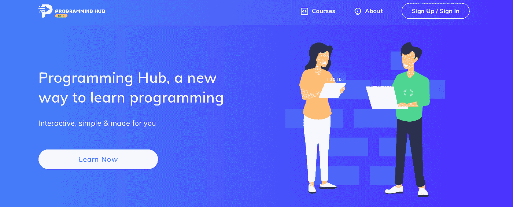

# 学习 Java 语言的 5 款最佳 Android 应用

> 原文：<https://medium.com/javarevisited/5-best-android-apps-to-learn-java-language-7103267928e2?source=collection_archive---------2----------------------->

乔纳森·肯珀在 [Unsplash](https://unsplash.com/s/photos/android?utm_source=unsplash&utm_medium=referral&utm_content=creditCopyText) 上拍摄的照片

所以你决定学习 Java，甚至选择了一门课程，但现在你的日程安排非常繁忙，很难打开笔记本电脑开始学习。如果这种情况听起来很熟悉，那么对你来说最好的选择是转到一个不仅在桌面上，而且在移动版本上呈现的课程。

在 [Android](/hackernoon/top-5-courses-to-learn-android-for-java-programmers-667e03d995b4) 上有非常好的平台可以帮助你学习 Java 编程。那么，让我们来谈谈这些改变游戏规则的应用程序。

# Java 编程语言

有不同的编程语言，但 Java 在近二十年来一直是其中的佼佼者。Java 可用于构建桌面和移动应用、大数据处理、嵌入式系统，以及最重要的服务器端企业级应用。

像优步、Airbnb 和易贝这样的公司都是基于 Java 运行的。Java 也是 IoT(物联网)的大玩家。这种[编程语言](/javarevisited/why-java-is-the-best-programming-language-to-learn-coding-for-beginners-cba79aed1271)最好的一点是它已经发展了一段时间，现在有多种工具可以使 Java 开发变得容易。

它的受欢迎程度可以从甲骨文(拥有 Java 的公司)陈述的事实来衡量；全球有 600 万 Java 开发人员，它运行在 30 亿台设备上。

只要 Java 是一种如此受欢迎的语言，就有相当多的可以教你 Java 的应用程序被开发出来。让我们仔细看看我个人的前五名。我们真的相信，如果你不得不在运行中学习 Java，这些应用程序是一个福音。

# Android 学习 Java 语言的 5 款最佳应用

## CodeGym

**编程语言:** Java

CodeGym 是学习 Java 编程最高效的课程之一。这门课的 80%用于实践，只有 20%用于理论。该课程的主要目标是培养你解决问题的能力，为你从事现实生活中的程序员工作做好准备。这门课程绝对适合紧张忙碌的时间表，它不需要你付出全部时间。

此外，该课程会即时反馈每项任务的结果，因此您可以轻松观察自己的学习进度。在这个混乱的时代， [CodeGym](https://codegym.cc/) 让你摆脱了繁忙的课程、时间限制和地点限制，你可以随时随地学习，因为你可以选择从网站或移动应用程序中学习。完成本课程一定会让你掌握 Java 编码。

**优点**

*   CodeGym 提供了 1200 多种编码任务
*   这门课程是游戏化的，所以它使学习过程非常令人兴奋
*   练习任务会立即得到验证，并且很容易跟踪进度

**缺点**

*   如果你打算编码，你需要连接键盘

**价格**

*   CodeGym 应用程序是免费的

[**点击下载**](https://play.google.com/store/apps/details?id=com.hitechrush.codegym&hl)

## SoloLearn

**编程语言:** [Python](/swlh/5-free-python-courses-for-beginners-to-learn-online-e1ca90687caf) ， [JavaScript](/javarevisited/12-free-courses-to-learn-javascript-and-es6-for-beginners-and-experienced-developers-aa35874c9a32) ， [C++](/javarevisited/6-best-unreal-engine-courses-for-c-game-developers-in-2021-41ca05907ae4) ， [HTML](/javarevisited/10-best-html-and-css-courses-for-beginners-in-2021-6757eec00032) ， [Java](/javarevisited/2-best-java-books-for-c-developers-ee4795504498) ， [C#，](/javarevisited/5-best-c-c-sharp-programming-courses-for-beginners-in-2020-494f7afc7a5c) [SQL](/javarevisited/top-10-free-courses-to-learn-microsoft-sql-server-and-oracle-database-in-2020-6708afcf4ad7) ， [PHP](/javarevisited/top-10-free-courses-to-learn-php-and-mysql-for-web-development-e96e69982675?source=---------34------------------) ， [CSS](/javarevisited/top-10-free-courses-to-learn-html-5-css-3-and-web-development-872d62d97a97) ，jQuery， [Ruby](/javarevisited/top-5-free-courses-to-learn-ruby-and-rails-for-beginners-best-of-lot-e149fe03c964) ， [Swift](/javarevisited/7-free-courses-to-learn-swift-programming-language-in-2020-f40ac9d3ee53?source=---------7------------------)

如果你没有任何编码经验，那么这个课程对你来说是一个完美的选择。SoloLearn 是专门为零编码背景的人设计的。就像你如何通过拖放过滤器来编辑你的图片一样，SoloLearn 也提供了相同类型的编码，你应该拖放不同的代码片段来解决任务。

实际任务非常简单，只需几分钟就能解决。SoloLearn 有近 42，758，088 名学生，课程有近 15000+次测验。我们生活在一个知识离你的智能手机只需点击一下的世界，这门课程最棒的部分是它以一种有趣的方式教你。

SoloLearn 的用户界面简洁易学，具有四个主要功能:

**学习:**免费编码讲座帮你学习

**玩法:**在这里你可以通过挑战其他玩家来进行一场良性竞争

**代码:**一个内置的开发环境供你编码

**讨论:**一个讨论论坛，从高级开发人员那里获得技巧并解决您的问题。

**优点**

*   SoloLearn 的社区非常有帮助，令人鼓舞
*   本课程不需要编码背景
*   2000 多节免费课

**缺点**

*   轻松传达知识，不深入
*   这款应用确实存在一些功能问题

**价格**

*   SoloLearn 应用是免费的

[**点击下载**](https://play.google.com/store/apps/details?id=com.sololearn&hl=en_US&ref=hackernoon.com)

## 编程中心

**编程语言:** HTML、 [JavaScript](https://www.java67.com/2019/01/best-websites-to-learn-javascript-online.html) 、 [C](/javarevisited/10-best-c-programming-courses-for-beginners-2c2c1f6bcb12) 、 [C++](https://javarevisited.blogspot.com/2020/07/top-10-courses-to-learn-c-in-depth-best.html) 、 [C#](/javarevisited/9-free-c-c-sharp-courses-and-tutorials-for-beginners-and-intermediate-programmers-best-of-lot-dc8c793aab31) 、 [Swift](/javarevisited/top-5-online-courses-to-learn-ios-12-swift-in-2019-a35ae1be7b2b?source=---------56------------------) 、 [Python](/javarevisited/10-free-python-tutorials-and-courses-from-google-microsoft-and-coursera-for-beginners-96b9ad20b4e6) 、 [R 编程](/javarevisited/10-best-r-programming-courses-for-data-science-and-statistics-8f84ebec4974)、Java、[人工智能](/javarevisited/7-best-courses-to-learn-artificial-intelligence-in-2020-26d59d62f6fe?source=---------17------------------)、CSS 等。

有 18 亿人从这个平台学习编程，验证了这个课程及其内容的可信度。与以前的课程不同，在这里你通过观看视频来学习。

你可以在每门课程结束时获得一个经过验证的程序员中心认证，这将为你的简历提供一个可信的认证。它拥有 500 万次下载，在产品搜索中被列为前三名，它的主要目标是让你能够以正确、高效、有趣的方式学习 Java。

**优点**

*   编译器是内置的
*   用户界面可以定制
*   Java 教的很详细

**缺点**

*   有订阅费
*   装载速度不同
*   这门课程不为初学者提供任何东西

**价格**

使用该设施需要付费。编程中心提供以下会员计划:

*   6.99 美元/月
*   14.59 美元/6 个月
*   41.99 美元/年

[**点击下载**](https://play.google.com/store/apps/details?id=com.freeit.java&hl=en&ref=hackernoon.com)

## 恩奇

**编程语言:** [SQL](/hackernoon/top-5-sql-and-database-courses-to-learn-online-48424533ac61) ，[数据科学](/javarevisited/10-free-data-science-online-courses-for-beginners-a5fe78c2cb7b)， [JavaScript](/javarevisited/5-best-javascript-books-for-beginners-and-experienced-web-developers-2c6353d1cc85) ， [Python](/javarevisited/8-projects-you-can-buil-to-learn-python-in-2020-251dd5350d56) ，[区块链](/javarevisited/7-free-courses-to-learn-blockchain-in-2020-764e66b47ebe)， [CSS](/javarevisited/top-5-advanced-css-courses-to-learn-flexbox-grid-and-sass-da8e37b09b1d?source=---------8------------------) ，HTML，[安全](/javarevisited/7-best-cyber-security-courses-for-programmers-and-developers-50afafae050b)， [git](/javarevisited/7-best-courses-to-master-git-and-github-for-programmers-d671859a68b2) ，CompSci fundamentals， [Linux](/javarevisited/7-best-linux-courses-for-developers-cloud-engineers-and-devops-in-2021-7415314087e1) ，以及 [Java](/javarevisited/10-books-java-developers-should-read-in-2020-e6222f25cc72) 。

一个方便初学者和中级观众的平台，值得选择。如果你渴望掌握 Java，这个平台是你通过解决编码挑战来练习的最佳场所。

专家会定期监控你的表现。培训师认为，解决问题的方法就是解决问题的方法，以及你解决问题所花的时间。在有人监督的情况下学习编程是最好的方法。该课程的可信度可以根据其学员在谷歌、网飞、微软和亚马逊工作的事实来衡量。

**优点**

*   你在监督下学习
*   有许多游戏和测验，所以你不会感到无聊

**缺点**

*   只有支付订阅费才能访问内容
*   装载速度低
*   存在与应用程序相关的性能问题

**价格**

基础版的 Enki 是免费的(内容非常有限)。需要支付 9 美元/月的订阅费才能获得其余的课程材料。

[点击下载](https://play.google.com/store/apps/details?id=com.enki.insights&hl=en_US&ref=hackernoon.com)

## 简易编码器

**编程语言:** Java

与其他课程一样，本课程侧重于实践和培养解决问题的技能。这门课程组织得很好，主题逐步涵盖。进度很快，因为你从头开始编码。再说一次，这个课程完全适合那些日程安排紧张的人。有了 Easycoder，你就可以 [**无压力地学习 Java**](https://javarevisited.blogspot.com/2018/07/top-5-websites-to-learn-coding-in-java.html) 。

**优点**

*   用户界面易于操作
*   测验和游戏可以帮助你以有趣的方式学习
*   本课程适合中级和初级观众

**缺点**

*   外国字幕不可用，这限制了该应用程序的覆盖范围
*   没有其他语言可供选择，本课程只提供 Java

**价格**

轻松编码应用程序是免费的。有一个基于信用的系统，你必须完成挑战和测验才能解锁优质内容。你也可以购买一个积分包。

[**点击下载**](https://play.google.com/store/apps/details?id=com.amensah.easycoder&hl=en&ref=hackernoon.com)

# 结论

如果你有一部安卓手机，你就可以访问上述所有课程。你不再需要粘在电脑前学习编程语言，这的确是一件幸事。以上 5 款 app 可以帮助你在旅途中学习 Java 编程。唯一需要的是你对学习过程的投入。付出一点努力，你会得到最大的收获。