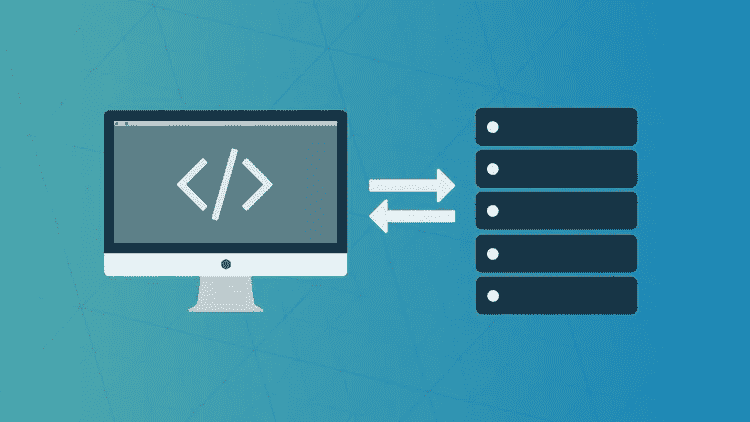
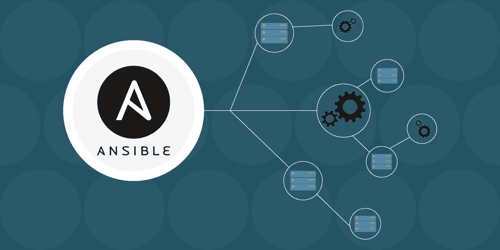

# 2023 年 DevOps 工程师的 7 门最佳可答课程

> 原文：<https://medium.com/javarevisited/5-best-ansible-courses-for-devops-engineers-cc87692fdf52?source=collection_archive---------0----------------------->

## 这些是 2023 年学习 Ansible for DevOps 和基础架构自动化的最佳在线课程

image_credit — Udemy

大家好，如果你想学习 Ansible for DevOps 并寻找最好的 Ansible 课程，那么你来对地方了。之前我已经分享了 [**最佳 DevOps 课程**](/javarevisited/13-best-courses-to-learn-devops-for-senior-developers-in-2020-a2997ff7c33c) 和 [**免费 Kubernetes 课程**](/javarevisited/7-free-online-courses-to-learn-kubernetes-in-2020-3b8a68ec7abc) 而今天我要分享的是 2023 年学习 Ansible 的最佳课程。

如果您在 DevOps 领域，那么您可能听说过 [**Ansible**](https://www.ansible.com/) ，这是基础设施自动化的强大工具之一。过去，当您需要为您的应用程序设置服务器时，您需要前往每台服务器，安装所有软件并进行验证。

随着像 [Ansible](https://javarevisited.blogspot.com/2019/11/top-5-course-to-learn-ansible-for-devops.html) 、 [Chef](https://www.chef.io/) 、 [Puppet](https://javarevisited.blogspot.com/2020/05/top-5-puppet-courses-for-programmers-and-devops-engineers.html) 和 [Salt](https://www.saltstack.com/saltstack-enterprise-for-devops/) 这样的工具的出现，这个缓慢、手动和痛苦的服务器设置过程已经结束。这些工具推广了基础设施即代码的理念，也为基础设施自动化带来了版本控制和扩展的额外好处。

如果你正朝着 [DevOps](https://javarevisited.blogspot.com/2018/09/10-devops-courses-for-experienced-java-developers.html) 的职业方向努力，你已经是团队中的 [DevOps 冠军](/javarevisited/what-next-for-senior-developers-in-tech-project-manager-technical-architect-or-a-devops-engineer-b532a80c9ba1)了，那么学习 Ansible 是个好主意，你来对地方了。

在这篇文章中，我准备分享一些 2023 年学习 Ansible 最好的课程。我尽了最大努力将初学者和高级课程都包括在内，这样不仅**可以从头开始学习 Ansible**，而且如果你已经知道 Ansible，还可以通过插件和模块将你的 ansi ble 技能提升到一个新的水平。

# 什么是 Ansible？它解决了哪个问题？

如果你不知道 Ansible 是什么或者第一次听到 Ansible 这个名字，让我给你一个快速的概述。Ansible 是一个自动化服务器设置部分的工具。

如果您是一名开发人员，并且曾经设置过您的 UAT 和生产环境，那么您知道在运行或安装您的应用程序之前，需要做大量的工作来准备您的服务器。

你需要在每台服务器上手动安装 [Java](https://javarevisited.blogspot.com/2019/10/the-java-developer-roadmap.html) 、 [Tomcat](https://www.java67.com/2019/07/spring-boot-3-ways-to-change-port-of-tomcat.html) 、 [Apache](https://javarevisited.blogspot.com/2017/01/12-essential-apache-web-server-interview-questions-answers-java-linux.html) 之类的软件，即使你的服务器屈指可数，这也需要很长时间。幸运的是，现在所有这些都可以使用 Ansible 自动完成。你需要做的就是创建一个 Ansible 剧本，很像一个脚本，然后 Ansible 会为你做设置和安装。

并不是说 Ansible 是唯一可以做到这一点的工具，因为你还有 [**木偶**](https://click.linksynergy.com/deeplink?id=JVFxdTr9V80&mid=39197&murl=https%3A%2F%2Fwww.udemy.com%2Fcourse%2Flearn-puppet%2F)[**厨师**](https://click.linksynergy.com/deeplink?id=JVFxdTr9V80&mid=39197&murl=https%3A%2F%2Fwww.udemy.com%2Fcourse%2Fchef-fundamentals-a-recipe-for-automating-infrastructure%2F)[**盐堆**](https://www.saltstack.com/saltstack-enterprise-for-devops/) 。尽管如此，Ansible 可能是最简单的工具，因为它可以使用 SSH 完成所有这些工作，而 Puppet 等其他工具需要在每台服务器上安装一个专用代理。被称为 Ansible playbook 的 Ansible script 可以用 YAML(另一种标记语言)编写，读起来像英语，不需要太多的学习。

它也有 RedHat 做后盾，可以用很多 Python 插件定制；所有这些使 Ansible 成为服务器设置和自动化的完美选择，这些课程是开始 Ansible 之旅的好地方。

# 2023 年学习 Ansible for DevOps 的 6 门最佳在线课程

现在您已经知道了什么是 Ansible，以及它如何帮助服务器设置、自动化和可伸缩性，让我们深入学习一些最好的课程来深入了解 Ansible。

正如我所说的，这个列表包括初级和高级 Ansible 课程，这样你可以从头开始学习，也可以提高你的 Ansible 技能。

## 1.[适合绝对初学者——动手——开发人员](https://click.linksynergy.com/deeplink?id=JVFxdTr9V80&mid=39197&murl=https%3A%2F%2Fwww.udemy.com%2Fcourse%2Flearn-ansible%2F)

对于任何想从头开始学习 Ansible 的人来说，这是我的首选课程。这是最好的 Ansible 初学者课程之一，它将一步一步地教你如何编写 Ansible playing book，构建 Ansible inventory 文件，以及在几个主机上部署软件。

该课程最棒的地方在于，它有撰写投资者简历的动手练习，你可以在浏览器中练习。它还提供了一些关于 YAML 的介绍，该工具用于编写可行的构建脚本，也称为剧本。

本课程包含 2 个小时的内容，将教会您自动化 web 服务器部署所需的一切。

**这里是加入这个可回答的初学者课程** — [可回答的绝对初学者](https://click.linksynergy.com/deeplink?id=JVFxdTr9V80&mid=39197&murl=https%3A%2F%2Fwww.udemy.com%2Fcourse%2Flearn-ansible%2F)

谈到社会证明，这门课程得到了超过 27750 名学生的信任，他们充分说明了这门课程的质量。如果你想在 2023 年学习 Ansible，这是你应该加入的课程。

## 2.[掌握 ansi ble](https://click.linksynergy.com/deeplink?id=JVFxdTr9V80&mid=39197&murl=https%3A%2F%2Fwww.udemy.com%2Fcourse%2Fmastering-ansible%2F)【Udemy】

这是另一门初级课程，为 Ansible 的配置管理和编排提供了完整的指南。如果你喜欢基于项目的学习或者喜欢边做边学，那么这个课程就是为你准备的。

本课程设计为从头开始配置现实应用堆栈的旅程。这意味着，在构建和重构应用程序时，主题会根据应用程序日益增长的复杂性进行排序，而不是一页一页地浏览 Ansible 文档。这是我向初学 Ansible 的人强烈推荐的另一门课程。如果你不仅想学习如何使用 Ansible 进行配置管理，还想学习如何创建一个非常干净和合理的 ansible-playbook，那么这个课程就是为你准备的。

**这是加入在线翻译课程**——[掌握翻译](https://click.linksynergy.com/deeplink?id=JVFxdTr9V80&mid=39197&murl=https%3A%2F%2Fwww.udemy.com%2Fcourse%2Fmastering-ansible%2F)的链接

## 3.[掌握可行的自动化——循序渐进](https://click.linksynergy.com/deeplink?id=JVFxdTr9V80&mid=39197&murl=https%3A%2F%2Fwww.udemy.com%2Fcourse%2Fautomation-with-ansible%2F)

如果你想在 IT 自动化领域开始职业生涯，并想从头开始学习 Ansible，那么这是适合你的课程。在本课程中，什卡·维尔马将一步步教你 Ansible。

这是一门非常详细的课程，你会学到实现可翻译剧本、编写 YAML 脚本、变量、范围、模块、清单等等。

好的一面是，所有部分都有指导练习，这意味着你将在实践中学习。

该课程不仅介绍了 Ansible，还展示了使用该工具和创建可靠自动化管道的多种方法。如果你能联系到一位教师，那么这是一门学习 Ansible 的极好课程。

**这是参加 Ansible 自动化课程** — [逐步掌握 Ansible 自动化](https://click.linksynergy.com/deeplink?id=JVFxdTr9V80&mid=39197&murl=https%3A%2F%2Fwww.udemy.com%2Fcourse%2Fautomation-with-ansible%2F)的链接

## 4.[ansi ble Advanced—hand-On—devo PS](https://click.linksynergy.com/deeplink?id=JVFxdTr9V80&mid=39197&murl=https%3A%2F%2Fwww.udemy.com%2Fcourse%2Flearn-ansible-advanced%2F)

正如我在本文开头所说的，你会发现 Ansible 在这方面有初学者和高级课程，并且信守承诺，这里有一个课程学习和练习 Ansible 中的高级主题，包括角色、Jinja2、查找、过滤器。

这是一门课程，你只应在学习了前三门课程中的任何一门后学习，理想情况下是列表中的第一门，完全适合初学者，因为这门课程来自同一位教师， [**Mumshad Mannambeth。**](https://click.linksynergy.com/deeplink?id=JVFxdTr9V80&mid=39197&murl=https%3A%2F%2Fwww.udemy.com%2Fuser%2Fmumshad-mannambeth%2F)

这是 Ansible 系列的第二个课程，在这个课程中，你会学到 Ansible 中的一些高级概念，以及一些真实生活中的用例，比如编写定制模块。

**还有，这里是加入这个高级 Ansible 课程** — [Ansible 高级—动手](https://click.linksynergy.com/deeplink?id=JVFxdTr9V80&mid=39197&murl=https%3A%2F%2Fwww.udemy.com%2Fcourse%2Flearn-ansible-advanced%2F)的链接

顺便说一下，初学者和本课程之间有一些不同之处。初学者课程中使用的操作系统是 CentOS，但本课程使用 Debian，这可能需要一些时间来设置环境。

## 5.[动手回答](https://pluralsight.pxf.io/c/1193463/424552/7490?u=https%3A%2F%2Fwww.pluralsight.com%2Fcourses%2Fhands-on-ansible)【复数视线】

这是一个很好的学习复视的课程。本课程从编排和变更管理基础开始，然后介绍 Ansible 的工作原理。

您还将构建您的测试环境，并在此过程中浏览 Ansible 提供的几个实际例子和特性。

完成本课程后，您将能够在所有系统上运行临时命令，编写行动手册，并使用 Ansible 附带的数百个模块创建角色。

本课程还有许多实践演示，展示如何实施自动化任务。

**这里是加入这个可回答课程** — [动手回答](https://pluralsight.pxf.io/c/1193463/424552/7490?u=https%3A%2F%2Fwww.pluralsight.com%2Fcourses%2Fhands-on-ansible)的链接

总的来说，学习 Ansible 是一门很好的课程，但你需要一个 Pluralsight 会员才能进入这门课程，每年大约需要 299 美元。或者，您也可以报名参加 [**10 天免费试用**](http://pluralsight.pxf.io/c/1193463/424552/7490?u=https%3A%2F%2Fwww.pluralsight.com%2Flearn) ，免费参加本课程。

 [## 个人技术技能|多视角

### 借助 Pluralsight，在开发运维、机器学习、云、安全基础设施等领域构建所需技能…

pluralsight.pxf.io](http://pluralsight.pxf.io/c/1193463/424552/7490?u=https%3A%2F%2Fwww.pluralsight.com%2Flearn) 

## 6.[答:从零到生产就绪](https://www.educative.io/courses/ansible-zero-to-production-ready?affiliate_id=5073518643380224)【教育性】

这是一个新的交互式课程，在 Educative 上从头开始学习 Ansible，Educative 是一个基于文本的在线学习平台，允许您在浏览器上练习代码。在这个交互式 Ansible 课程中，您将学习 Ansible 的细节，目标是管理和自动化您的基础设施和代码部署。

以下是您将在本课程中学到的内容:

1.  如何设置 docker 环境
2.  如何连接像 AWS 和 Azure 这样的云提供商
3.  如何使用 Ansible 管理 AWS 和 Azure 上的基础设施，
4.  如何自动化配置和状态管理过程。

在每一节中，您将通过实际和真实的场景深入 Ansible 的基础知识。

最后，你将拥有一项新技能，这将为你打开许多大门，比如云计算和开发运维。这绝对会是放在简历上的一个好工具，会帮助你推进你的职业生涯

**这是参加本课程的链接**——[ansi ble:零到生产就绪](https://www.educative.io/courses/ansible-zero-to-production-ready?affiliate_id=5073518643380224)

而且，如果你找到了教育平台和他们基于文本的互动课程，那么考虑购买 [**教育订阅**](https://www.educative.io/subscription?affiliate_id=5073518643380224) ，每月只需 14.9 美元就可以访问他们的 100 多门课程。它非常划算，非常适合准备编码面试和学习 Docker、Ansible、Kubernetes 等最新技术。

 [## 教育无限:保持领先

### 我们听到了您的反馈。你现在只需支付一次费用，就可以获得 Educative 上的所有课程。

www.educative.io](https://www.educative.io/subscription?affiliate_id=5073518643380224) 

以上是关于**要深入学习 Ansible 的 7 大在线课程**。正如我所说的，Ansible 是一个很好的工具，特别是对于 DevOps 工程师来说。Ansible 是软件供应、配置管理和应用程序部署的领先工具之一，学习 Ansible 对您的职业生涯大有裨益。

作为一名高级开发人员，你还应该了解 Ansible，这样你就可以使用那些 Ansible 剧本，并了解我的服务器是如何设置的。想在 [DevOps](/javarevisited/top-5-online-courses-to-become-a-devops-engineer-in-2020-764f5e60c2b) 谋职也可以学 Ansible，绝对值得。

您可能喜欢的其他 **DevOps 资源和文章**

*   [完整的 DevOps 开发者路线图](https://javarevisited.blogspot.com/2018/09/the-2018-devops-roadmap-your-guide-to-become-DevOps-Engineer.html)
*   [面向 Java 和 DevOps 专业人员的 10 门免费 Docker 课程](https://javarevisited.blogspot.sg/2018/02/10-free-docker-container-courses-for-Java-Developers.html)
*   [学习 Jenkins 自动化和开发运维的五大课程](https://javarevisited.blogspot.com/2018/09/top-5-jenkins-courses-for-java-and-DevOps-Programmers.html)
*   [5 门免费硒课程学习自动化测试](https://javarevisited.blogspot.sg/2018/02/top-5-selenium-webdriver-with-java-courses-for-testers.html)
*   [面向 Java 开发人员的 6 门 Maven 课程](http://www.java67.com/2018/02/6-free-maven-and-jenkins-online-courses-for-java-developers.html)
*   [学习 Docker 和 Kubernetes 的 5 大课程](https://javarevisited.blogspot.com/2019/05/top-5-courses-to-learn-docker-and-kubernetes-for-devops.html)
*   [2023 年 Java 开发者应该学会的 10 件事](http://javarevisited.blogspot.sg/2017/12/10-things-java-programmers-should-learn.html#axzz53ENLS1RB)
*   [面向高级开发人员的 10 门 DevOps 课程](https://javarevisited.blogspot.com/2018/09/10-devops-courses-for-experienced-java-developers.html)
*   [学习 Docker、Kubernetes 和 AWS 的 15 门课程](/javarevisited/top-15-online-courses-to-learn-docker-kubernetes-and-aws-for-fullstack-developers-and-devops-d8cc4f16e773)
*   [2023 年 Java 开发人员应该学习的 10 种工具](http://www.java67.com/2018/04/10-tools-java-developers-should-learn.html)
*   [深入学习 AWS 的 10 门免费课程](/javarevisited/top-10-courses-to-learn-amazon-web-services-aws-cloud-in-2020-best-and-free-317f10d7c21d)
*   [5 免费弹簧框架和 Spring Boot 课程](http://www.java67.com/2017/11/top-5-free-core-spring-mvc-courses-learn-online.html)
*   [面向 Java JEE 开发者的 5 大 Hibernate 和 JPA 课程](http://javarevisited.blogspot.sg/2018/01/top-5-hibernate-and-jpa-courses-for-java-programmers-learn-online.html)

感谢您阅读本文。如果你喜欢这些 Ansible 在线培训课程，那么请与你的朋友和同事分享。如果您有任何问题或反馈，请留言。

**P. S.** —如果你正在寻找一些免费课程来开始你的 DevOps 之旅，并学习像 Jenkins、Docker 和 Kubernetes 这样的基本工具，那么你应该看看这个为 DevOps 和程序员提供的 [**免费 Jenkins、Docker 和 Kubernetes 课程**](http://www.java67.com/2019/03/5-free-devops-courses-to-learn-jenkins.html) 列表。

 [## 2023 年学习 DevOps 的十大免费 Jenkins、Docker 和 Kubernetes 课程—最佳选择

### 大家好，你们可能听说过 DevOps 以及它现在受到的所有关注。DevOps 是一种新现象…

medium.com](/javarevisited/top-10-free-courses-to-learn-jenkins-docker-and-kubernetes-for-devops-in-2020-best-of-lot-62a0541ffeb3)