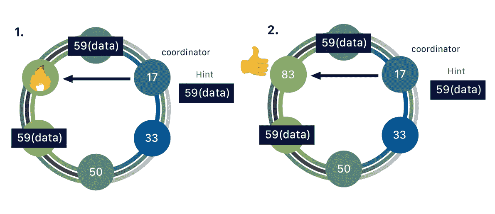
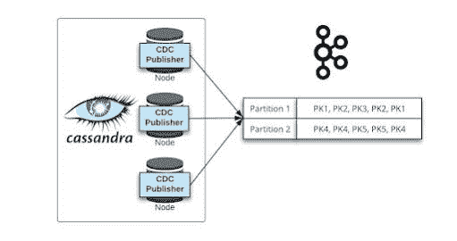
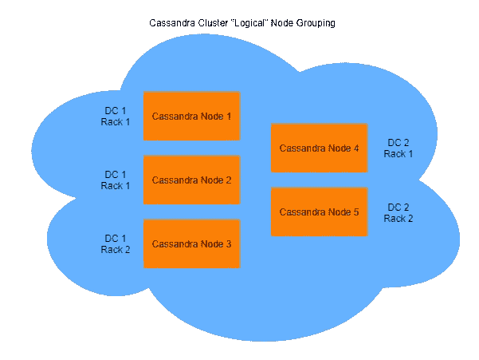
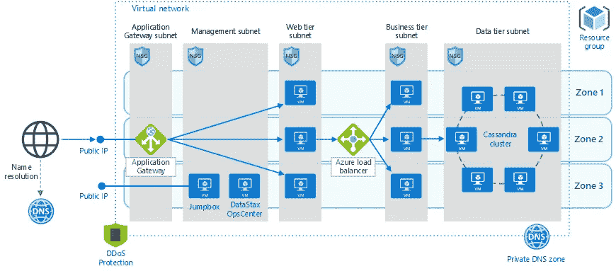

# 2023 年为初学者和有经验者提供的 5 个最佳 Apache Cassandra 课程

> 原文：<https://medium.com/javarevisited/5-best-apache-cassandra-courses-for-beginners-and-experienced-ca37195b2fc4?source=collection_archive---------3----------------------->

## **2023 年想学 Apache Cassandra 数据库？以下是 Udemy 和 Pluralsight 提供的从零开始学习卡珊德拉的最佳在线课程**

你好伙计们，如果你们打算使用或学习任何分散存储机制和 NoSQL 数据库，那么你已经登陆了！在过去，我已经分享了 [**最佳 MongoDB 课程**](https://javarevisited.blogspot.com/2019/01/top-5-mongodb-online-training-courses.html) ，和 [**最佳课程学习 Redis**](https://javarevisited.blogspot.com/2022/02/top-5-courses-to-learn-redis.html) 和今天我们今天将回顾 Apache Cassandra 和看到一些最佳课程学习相同。

> Apache Cassandra 是一个开源、分散/分布式存储系统(数据库),用于处理分散在全球的大量结构化数据。

许多大公司，如脸书、Twitter、思科、Rackspace、易贝、Twitter、网飞等，都使用 Cassandra。Cassandra 也是最昂贵的一个，但是对于大数据有非常好的性能。那么，还等什么？让我们从可以学习卡珊德拉的地方来看看一些课程。

# 2023 年学习 Aapche 卡珊德拉 NoSQL 数据库的 5 门最佳在线课程

在不浪费你更多时间的情况下，这里有 2023 年学习 Apache Cassandra 的最佳在线课程:

## 1.[Apache Cassandra 入门](https://click.linksynergy.com/deeplink?id=CuIbQrBnhiw&mid=39197&murl=https%3A%2F%2Fwww.udemy.com%2Fcourse%2Fapache-cassandra%2F)【Udemy】

“无限技能”Apache Cassandra 培训课程涵盖了使用 Cassandra 的基础知识。本培训面向完全没有 Cassandra 使用经验的初学者。如果你以前用过数据库、SQL 和编程，那就更好了。

在了解如何与 Cassandra 交互之前，您将首先学习如何安装它。接下来，在本课程中，您将学习如何建立数据库、表以及插入和建模数据。

**评分:4.2 分(满分 5 分)**

**持续时间:8 小时**

**讲师:无限学习**

**价格:42 美元**

本视频课将讲述如何创建应用程序、更新和删除数据、挑选硬件以及向群集添加节点。您还将学习如何监视集群，修复和替换节点，以及重命名集群。

完成本视频培训课程后，您将对 Cassandra 有一个全面的了解，并且能够在自己的开发项目中使用 Cassandra。

**这是参加本课程的链接**——[Apache Cassandra 入门](https://click.linksynergy.com/deeplink?id=CuIbQrBnhiw&mid=39197&murl=https%3A%2F%2Fwww.udemy.com%2Fcourse%2Fapache-cassandra%2F)

## 2.[开发者的卡珊德拉](https://pluralsight.pxf.io/c/1193463/424552/7490?u=https%3A%2F%2Fwww.pluralsight.com%2Fcourses%2Fcassandra-developers)【复数视线】

本课程将向您介绍 Cassandra 健壮的分布式体系结构，同时让您深入掌握 Cassandra 查询语言(CQL)。这门课会教你卡珊德拉的简史。如何用 Docker 设置 Cassandra 集群？

Cassandra 对“可调一致性”和复制方案的支持您将了解 Cassandra 的短暂历史以及如何使用 Docker 设置 Cassandra 集群。首先，您将了解复制算法和 Cassandra 的“可调一致性”支持。

**评分:4.5 分(满分 5 分)**

**持续时间:3.1 小时**

**讲师:保罗·奥法伦**

**价格:Pluralsight 保费计划**

然后，您将学习 CQL，以及表、键空间和常见数据类型。之后，您将了解主键以及它们是如何由分区键和聚集键组成的。最后，将检查辅助索引、批处理和轻量级事务。

完成本课程后，您将掌握使用集合、列表、映射、元组和用户定义类型在 Cassandra 中存储时间序列数据所需的技能和知识。

以下是加入本课程的链接— [面向开发者的卡珊德拉](https://pluralsight.pxf.io/c/1193463/424552/7490?u=https%3A%2F%2Fwww.pluralsight.com%2Fcourses%2Fcassandra-developers)

顺便说一下，你需要一个 [Pluralsight 会员](https://pluralsight.pxf.io/c/1193463/424552/7490?u=https%3A%2F%2Fwww.pluralsight.com%2Fpricing%2Fskills)才能加入这个课程，费用大约是每月 29 美元或每年 299 美元(14%的折扣)。我向所有程序员强烈推荐这个订阅，因为它提供了超过 7000 个在线课程的即时访问，以学习任何技术技能。或者，你也可以使用他们的 [**10 天免费通行证**](https://pluralsight.pxf.io/c/1193463/424552/7490?u=https%3A%2F%2Fwww.pluralsight.com%2Fpricing%2Ffree-trial) 来免费观看这个课程。

<https://pluralsight.pxf.io/c/1193463/424552/7490?u=https%3A%2F%2Fwww.pluralsight.com%2Fpricing%2Ffree-trial>  

## 3.[从 0 到 1:卡珊德拉分布式数据库](https://click.linksynergy.com/deeplink?id=CuIbQrBnhiw&mid=39197&murl=https%3A%2F%2Fwww.udemy.com%2Fcourse%2Ffrom-0-to-1-the-cassandra-distributed-database%2F)【UDEMY】

两名斯坦福大学毕业的前谷歌员工和两名前 Flipkart 首席分析师组成了教师队伍。该团队在大规模数据处理方面拥有多年的实践经验。既庞大又难以处理的数据。

非结构化:Cassandra 是一个柱状数据库系统。当保存具有可变和扩展属性的数据时，不会有空的单元格或浪费的空间。始终可访问:Cassandra 使用分区和复制来确保即使集群中的节点出现故障，您的数据仍然可用。

本课程包括以下内容:

*   要设置和管理 Cassandra 集群，请使用 Cassandra 集群管理器(CCM)。
*   要建立键空间、列族、对列族执行 CRUD 操作以及其他管理任务，请使用 Cassandra 查询语言(CQL)。
*   对键进行分区和聚集，以及设计主索引和辅助索引
*   查询受到主键和辅键设计的限制。
*   使用仲裁和本地仲裁，可以实现可调的一致性。节点的读写一致性
*   架构和存储的组件:提交日志、内存表、表、布隆过滤器、索引文件、摘要文件和数据文件是您可以使用的一些工具。
*   一个实际项目:Cassandra Java 驱动程序用于创建一个小型目录管理系统。

本课程将向您展示如何构建一个包含大量节点的集群，以便数据可以跨机器分布。

**以下是加入本课程的链接—** [从 0 到 1:卡珊德拉分布式数据库](https://click.linksynergy.com/deeplink?id=CuIbQrBnhiw&mid=39197&murl=https%3A%2F%2Fwww.udemy.com%2Fcourse%2Ffrom-0-to-1-the-cassandra-distributed-database%2F)

## 4.[从头开始学习阿帕奇卡珊德拉](https://click.linksynergy.com/deeplink?id=CuIbQrBnhiw&mid=39197&murl=https%3A%2F%2Fwww.udemy.com%2Fcourse%2Flearn-apache-cassandra-from-scracth%2F)【Udemy】

Cassandra 是一个速度非常快的开源分布式数据库系统。在新的数据库系统中，它的增长速度最快，正处于爆炸式增长的边缘。我们的课程旨在教你所有你需要知道的关于 Cassandra DB 的知识。

课程从基本的 Cassandra 概念开始，然后转移到 CQL，最后教你如何开发一个真正的 Cassandra 和 NodeJs 应用程序。

**评分:5 分中的 4 分**

**时长:4 小时**

**讲师:Eduonix tech**

**价格:36 美元**

使用 Cassandra 和 [Nodejs](https://www.java67.com/2020/06/top-5-courses-to-learn-mern-stack-for-web-development.html) ，创建一个简单的 Twitter 克隆应用程序。该课程包含演示文件、源代码和视频培训材料，它结合了易于遵循的方法和实践重点，向您讲授该行业的所有细节。

这门课程适合任何想从头开始学习卡珊德拉的人。即使是新手也可以入手。本课程还包括构建一个应用程序，您将在其中使用 Cassandra 及其应用程序。

以下是加入本课程的链接— [从头开始学习 Apache Cassandra】](https://click.linksynergy.com/deeplink?id=CuIbQrBnhiw&mid=39197&murl=https%3A%2F%2Fwww.udemy.com%2Fcourse%2Flearn-apache-cassandra-from-scracth%2F)

## 5.[卡桑德拉行政](https://click.linksynergy.com/deeplink?id=CuIbQrBnhiw&mid=39197&murl=https%3A%2F%2Fwww.udemy.com%2Fcourse%2Fcassandra-administration%2F)【乌德米】

本课程将为您提供成功管理和操作 Cassandra 所需的技能。您还将了解 Cassandra 在架构方面与传统数据库和其他著名的 NoSQL 数据库有何不同。

课程首先演示如何建立自己的集群，并向您介绍 Cassandra 的许多使用案例。你会遇到基于可能不适合的环境的免责声明。

**评分:4.2 分(满分 5 分)**

**持续时间:3 小时**

**讲师:Packt 出版**

**价格:45 美元**

在学习如何安装 Cassandra 之后，您将学习如何利用不同的监控工具和方法来输入和输出大量数据。

接下来，您将了解主索引和辅助索引，以帮助您选择正确的索引，快速有效地查找数据，响应搜索和检索请求。

最后，您将利用各种工具来帮助优化性能，并在集群上运行压力测试和分析结果。

**以下是加入本课程的链接** — [卡桑德拉管理](https://click.linksynergy.com/deeplink?id=CuIbQrBnhiw&mid=39197&murl=https%3A%2F%2Fwww.udemy.com%2Fcourse%2Fcassandra-administration%2F)

以上就是 2023 年学习 Apache Cassandera 的**最佳在线课程。**你可以从这个列表中选择一到两门课程来深入学习 Apache Cassandera。希望你们现在都知道目前市场上有哪些学习 Apache Cassandra 的最佳课程。每一种都比另一种更多样化，各有各的好处。选择适合自己的！

您可能想探索的其他**编程资源文章**

*   [2023 年 Java 程序员应该学会的 10 件事](https://javarevisited.blogspot.com/2017/12/10-things-java-programmers-should-learn.html#axzz5atl0BngO)
*   [面向 Java 开发者的 5 门免费 Spring 框架课程](http://www.java67.com/2017/11/top-5-free-core-spring-mvc-courses-learn-online.html)
*   [2023 年 DevOps 开发者路线图](https://javarevisited.blogspot.com/2018/09/the-2018-devops-roadmap-your-guide-to-become-DevOps-Engineer.html)
*   [面向有经验的 Java 开发人员的 5 大 Java 设计模式课程](http://javarevisited.blogspot.sg/2018/02/top-5-java-design-pattern-courses-for-developers.html)
*   [编程/编码工作面试 10 门课程](http://javarevisited.blogspot.sg/2018/02/10-courses-to-prepare-for-programming-job-interviews.html)
*   [学习 learn Shell 脚本的 5 门课程](http://javarevisited.blogspot.sg/2018/02/5-courses-to-learn-shell-scripting-in-linux.html)
*   [学习 Python 编程的 10 门免费课程](https://javarevisited.blogspot.com/2018/12/10-free-python-courses-for-programmers.html)
*   [2023 年网络开发者路线图](https://javarevisited.blogspot.com/2019/02/the-2019-web-developer-roadmap.html)
*   2023 年 Java 开发人员可以学到的 21 项技术技能
*   [初级开发人员的 10 个 Web 开发技巧](/javarevisited/10-things-aspiring-web-developers-should-learn-in-2021-6747bfbfc12e)
*   [50+数据结构与算法面试问题](http://www.java67.com/2018/06/data-structure-and-algorithm-interview-questions-programmers.html)
*   [如何在 2023 年成为一名现代 React JS 开发者](https://javarevisited.blogspot.com/2018/10/the-2018-react-developer-roadmap.html)
*   [学习 Java 编程的 10 门免费在线课程](http://www.java67.com/2018/08/top-10-free-java-courses-for-beginners-experienced-developers.html)
*   [深入学习数据结构和算法的 10 门免费课程](http://www.java67.com/2019/02/top-10-free-algorithms-and-data.html)

感谢您阅读本文。如果你喜欢这些*最好的 Apache Cassendra NOSQL 数据库*，那么请分享给你的朋友和同事。如果您有任何问题或反馈，请留言。

**P. S.** —如果您对学习 NoSQL 技术感兴趣，尤其是 MongoDB，但正在寻找免费的在线培训课程，那么我强烈建议您查看 Udemy 上的—[**MongoDB Essentials——了解 Mongo DB**](https://click.linksynergy.com/deeplink?id=JVFxdTr9V80&mid=39197&murl=https%3A%2F%2Fwww.udemy.com%2Fcourse%2Fmongodb-essentials%2F) 课程的基础知识。这是完全免费的，你只需要一个 Udemy 帐户就可以加入这个课程。

</javarevisited/10-free-online-courses-to-learn-mongodb-and-nosql-942609611664> 