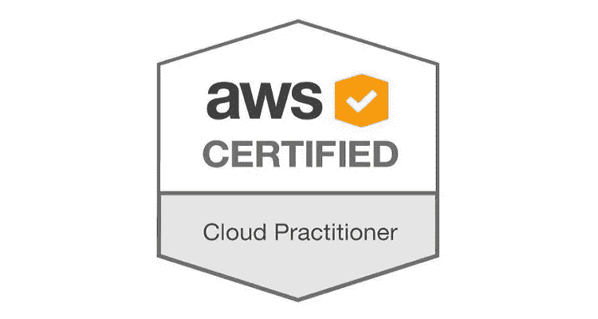
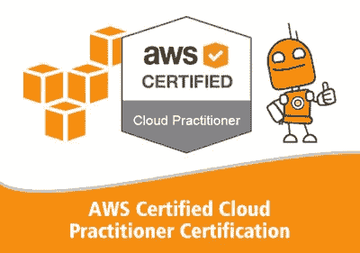
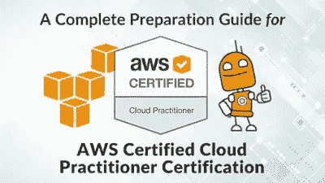
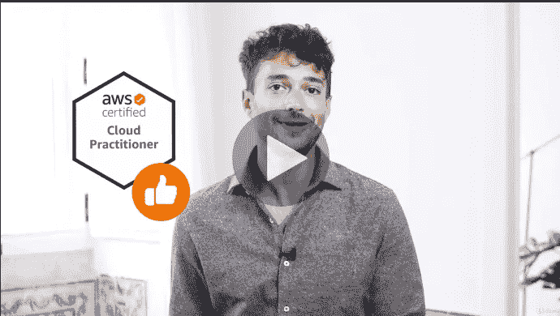
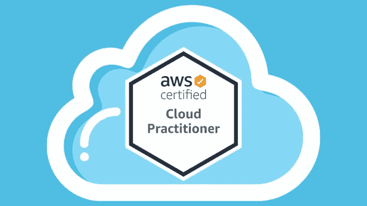
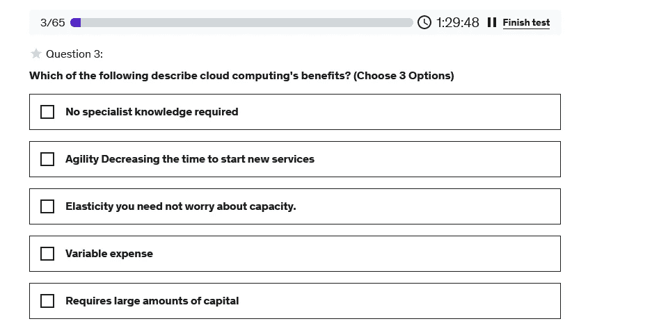

# 5 最佳 AWS 认证云从业者认证(CLF-C01)练习题、模拟测试和考试转储

> 原文：<https://medium.com/javarevisited/5-best-aws-cloud-practitioner-certification-clf-c01-practice-questions-mock-tests-and-exam-55330b140e58?source=collection_archive---------0----------------------->

## 我最喜欢的 AWS 云从业者课程和实践测试来自 Udemy、Plurlasiht、Whizlabs，可以在线学习。

大家好，如果你正在准备 AWS 云从业者认证，并寻找通过考试的最佳书籍、课程和整体指导，那么你来对地方了。

此前，我已经分享了[最佳 AWS 云从业者课程](/javarevisited/10-best-aws-certified-cloud-practitioner-clf-c01-online-courses-and-practice-test-to-crack-ecc0f913091e)，今天，我将分享一些技巧和实践测试，以在第一次尝试中通过这项享有盛誉的认证。

正如我之前所说的，实践测试和考试转储不仅在通过 [**AWS 认证云从业者**认证](https://javarevisited.blogspot.com/2020/09/top-10-aws-certifications-for-cloud-professionals.html) (CLF-C01)中发挥着重要作用，而且还能获得高分，这可以真正让你在竞争中脱颖而出。

在实际例子之前，在考试模拟器上进行模拟测试和解决问题有很多好处。例如，它将帮助你提前发现自己的优势和劣势，以便更好地了解本周的主题。

他们还帮助你提高速度和准确性，这是通过限时考试的关键，如亚马逊的 [AWS 认证云从业者(CLF-C01)](https://javarevisited.blogspot.com/2020/02/top-5-courses-to-crack-aws-certified-cloud-practitioner-exam-certification-clf-c01.html) 认证。

如果你知道，要通过 AWS 认证云从业者考试，至少需要取得 1000 分中的 **700 分；那是 70%,你只有 90 分钟的时间来完成所有的问题，不仅仅是选择题，还有多个答案。这意味着，任何问题都可能有不止一个正确答案。当一个问题有多个答案时，这意味着你需要阅读所有选项并评估它们，而不是仅仅找到正确的答案并继续前进，这在真正的考试中可能需要很长时间，特别是如果你事先没有做任何练习测试。

通过在类似真实考试的环境中解决模拟测试，你可以发展这种**速度和准确性**。这也有助于减少恐慌、压力和考试恐惧症，它们不仅会影响你的分数，还会导致考试失败。

模拟考试的另一个重要好处是让你熟悉**考试模式**。我发现没有多少人仔细阅读过 [AWS](https://aws.amazon.com/certification/) 的考试指南，不知道一个问题可以有多个答案。这意味着他们最终错过了许多问题，如果他们知道这种格式，他们就会答对。[练习测试](https://javarevisited.blogspot.com/2020/03/top-5-aws-certified-cloud-practitioner-mock-test-practice-questions.html)帮你避免这样的意外。因为所有这些好处，我强烈建议每个准备 AWS 认证的人，像[云从业者](https://www.java67.com/2020/07/top-5-aws-certified-cloud-practitioner-courses-and-practice-test.html)、 [AWS 开发者](/javarevisited/top-5-online-courses-to-become-aws-certified-developer-associate-in-2020-best-of-lot-9b22baf84ca8)和 [AWS 解决方案架构师](https://javarevisited.blogspot.com/2019/05/top-5-courses-to-crack-aws-solutions-architect-associate-certification-exam-SAA-C01.html#axzz5rHwAwycj)一样，尽可能多地解决模拟测试。

如果你同意我的观点，并需要一些关于你应该解决哪些 AWS 实践考试的建议，那么请和我呆在一起，我将分享一些来自[**【Udemy】**](https://click.linksynergy.com/deeplink?id=JVFxdTr9V80&mid=39197&murl=https%3A%2F%2Fwww.udemy.com%2F)、 [**Whizlabs**](https://shareasale.com/r.cfm?b=1551042&u=880419&m=43514&urllink=&afftrack=) 、 [**、Certification-Questions.com**](https://www.certification-questions.com/practice-exam/amazon/aws-certified-cloud-practitioner?affiliateCode=fcff36fd-557a-4713-abf6-973e9924770f&utm_source=Javin&utm_medium=affiliate&utm_campaign=affiliate)等的最佳 AWS 转储和实践论文，你可以用来更好地准备 AWS 云从业者(CLF-C01)考试。顺便说一句，不能保证你会从这些模拟测试中得到任何问题，但这也不是重点。这些模拟测试在真正意义上为你的考试做准备，这样你就可以在真正的考试中回答所有看不见的问题。**

# 前 5 名 AWS 云从业者考试(CLF-C01)认证实践测试和模拟问题

为了不浪费你更多的时间，下面是我列出的通过 2023 年 AWS 云从业者考试的一些最佳实践测试和考试转储:

## 1. [AWS 认证云从业者:2023 年 6 次全面实践测试](https://click.linksynergy.com/deeplink?id=JVFxdTr9V80&mid=39197&murl=https%3A%2F%2Fwww.udemy.com%2Fcourse%2Faws-certified-cloud-practitioner-practice-test%2F)

这是第一次尝试通过 *AWS 认证云从业者*考试的最佳练习题之一！。是的，第一次通过考试很重要，因为那时你有很多注意力，如果你想重考，你需要再花 100 美元。

问题列表分为 **6 个全程练习测试**，每个测试包含 65 个问题，这意味着您总共有 390 个问题要练习。

所有问题的质量都很好，并提供了详细的解释，以了解正确的答案是否正确以及为什么不正确的答案是不正确的。

**以下是参加本次模拟测试** — [AWS 认证云从业者:6 次全面实践测试 2023](https://click.linksynergy.com/deeplink?id=JVFxdTr9V80&mid=39197&murl=https%3A%2F%2Fwww.udemy.com%2Fcourse%2Faws-certified-cloud-practitioner-practice-test%2F)

这些模拟测试也是有时间限制的，这对于实际练习和发展通过正式测试所需的速度和准确性是很重要的。

在测试结束时，您将收到您回答正确和错误的问题的个人明细(以及每个问题的详细解释)，以提高您的知识，并使您更好地准备通过实际的 AWS 云认证考试。

谈到社会证明，这一模拟考试受到了 23000 多名学生的信任，5247 名参与者的平均评分为 4.4，这充分说明了模拟考试和问题的质量。

## 2.[由 Whizlabs 进行的 AWS 认证云从业者测试](https://shrsl.com/25qiz)

说到购买模拟考试，Whizlabs 是我的一站式商店。在过去的 10 年里，我一直在使用 Whizlabs，它帮助我通过了几个认证考试，如 [OCAJP](https://www.java67.com/2017/03/top-10-ocajp-and-ocpjp-exam-simulators.html) 、 [OCPJP](https://javarevisited.blogspot.com/2019/10/top-5-books-courses-to-crack-oracles-java-se-11-certification-OCAJP11.html) 、 [OCEJWCD](https://javarevisited.blogspot.com/2017/01/5-free-ocejwcd-6-mock-exam-1z0-899.html) 等等。

他们还有一个像样的实践测试来通过 AWS 认证云从业者认证考试，该考试包含 3 个全程模拟考试和 **195 个独特问题**。

每个模拟考试有 65 个问题，您需要在实际考试要求的 90 分钟内解决这些问题。最棒的是，每个问题都有详尽的解释，您还可以访问 AWS 认证云从业者考试的 **11 个实验室**。

如果您还没有在 AWS 控制台和门户网站上做过很多工作，那么这些实验将帮助您熟悉 AWS。

以下是参加 AWS 实践测试的链接— [AWS 认证云从业者测试](https://shrsl.com/25qiz)

模拟考试还提供无限制的访问权限，您可以通过网络和手机访问考试模拟器。如果你问我，我强烈推荐 Whizlabs AWS 实践测试的质量和我过去的经验。

他们还有一个 [**免费的 AWS 练习测试**](https://shrsl.com/25qiu) ，其中包含的问题较少，但在你在 Whizlabs 上购买这个 AWS 练习测试之前可以很好地检查问题的质量。

## 3.[实践考试| AWS 认证云从业者 CLF-C01](https://click.linksynergy.com/deeplink?id=JVFxdTr9V80&mid=39197&murl=https%3A%2F%2Fwww.udemy.com%2Fcourse%2Faws-certified-cloud-practitioner-2018-practice-questions%2F)

这是 Udemy 和 [Stéphane Maarek](https://medium.com/u/98189c4cef0?source=post_page-----55330b140e58--------------------------------) 的另一门不错的课程，为 2023 年 AWS 云从业者认证考试提供了 325 个以上独特的练习题。

他们还对每一个问题提供详细的解释，帮助你理解问题和主题。这也将鼓励你探索更多，因为你可能会遇到你从未听说过的话题。为了更好的准备，我还建议你看看他的 [**AWS 云从业者课程**](https://click.linksynergy.com/deeplink?id=JVFxdTr9V80&mid=39197&murl=https%3A%2F%2Fwww.udemy.com%2Fcourse%2Faws-certified-cloud-practitioner-new%2F) ，已经有超过 100K 的学生加入了他们。

这个测试的好处在于，它们是非常独特的高质量试题，并且有详细的解释！夏羽是 AWS 的英雄，他所有的 AWS 课程都是黄金标准。

以下是参加本练习测试的链接— [AWS 认证云从业者 2023 练习题](https://click.linksynergy.com/deeplink?id=JVFxdTr9V80&mid=39197&murl=https%3A%2F%2Fwww.udemy.com%2Fcourse%2Faws-certified-cloud-practitioner-2018-practice-questions%2F)

## 4.[David Mayer 撰写的亚马逊 AWS 认证云从业者考试转储(105 个问题)](https://www.certification-questions.com/practice-exam/amazon/aws-certified-cloud-practitioner?affiliateCode=fcff36fd-557a-4713-abf6-973e9924770f&utm_source=Javin&utm_medium=affiliate&utm_campaign=affiliate)

与练习题不同，考试转储有点不同。它们实际上是考试中出现的真正的考试问题，是从经历过这些考试的考生那里收集来的，大卫·梅尔在收集这些问题并提供给我们方面做得很好。虽然不能保证这些问题会重复出现，而且你只要从考卷中找出这些问题就能通过考试，但它们是你除了亲自出题之外能得到的最真实的样题。

考试转储的最佳用途是查看考试的难度等级和形式，并据此进行准备。我经常准备过度，以便能应付任何意外。总的来说，你会发现练习纸上的问题比你在垃圾堆里找到的真正的考试问题更难。

以下是查看 AWS 转储问题的链接— [AWS 转储](https://www.certification-questions.com/practice-exam/amazon/aws-certified-cloud-practitioner?affiliateCode=fcff36fd-557a-4713-abf6-973e9924770f&utm_source=Javin&utm_medium=affiliate&utm_campaign=affiliate)

## 5. [AWS 认证云从业者 500 模拟试题](https://click.linksynergy.com/deeplink?id=JVFxdTr9V80&mid=39197&murl=https%3A%2F%2Fwww.udemy.com%2Fcourse%2Faws-certified-cloud-practitioner-practice-exams-c%2F)

这是我推荐给准备高分(高于 900 分)的考生的又一个模拟测试。因为你的目标很高，你也需要努力准备，你可能需要解决 15 或 20 道练习题，而不是 6 道。

您还需要选择难度和质量高于实际考试的练习题，这也是 Udemy 的 AWS 认证云从业者考试的亮点。

它是最新的，包含 500 多个新的 2023 AWS 认证云从业者练习题，分为 6 个完整的练习测试考试模拟器。你也将获得快速复习的备忘单。他们还在自己的数字云培训网站上提供免费的考试模拟器(需要注册)。考试模拟器从我们的 500 多个独特问题中随机选择 65 个问题，模拟真实的 AWS 考试环境。

以下是参加本练习测试的链接— [AWS 认证云从业者 500 练习试题](https://click.linksynergy.com/deeplink?id=JVFxdTr9V80&mid=39197&murl=https%3A%2F%2Fwww.udemy.com%2Fcourse%2Faws-certified-cloud-practitioner-practice-exams-c%2F)

实践考试与真正的 AWS 考试具有相同的格式、风格、时间限制和及格分数。在培训模式下，你还可以在每道题后检查答案，以帮助你准备考试(这在 [Udemy](https://hackernoon.com/pluralsight-vs-udemy-vs-codecademy-vs-educative-6gia333d) 上是不可能的)。谈到社会证明，这些模拟测试得到了 11，000 多名学生的信任，平均有 4.4 分，接近 2，350 分，这很了不起。我强烈推荐这个模拟测试，以便在 AWS 认证云从业者考试中获得高分。

## 6.[我的 AWS 云从业者 CLF-C01 练习题测试 2023](https://www.udemy.com/course/aws-cloud-practitioner-clf-c01-practice-questions-test/?referralCode=AAB01559CD68D6CA87A0)

知道的人不多，但我在 Udemy 上也有一个全长的 AWS 云从业者考试模拟测试。我根据自己的准备创建了这个测试，以便其他人也能从中受益。

本课程包含 5 个完整长度的模拟测试，每套 65 个问题，因此总共 325 个问题，您可以在第一次尝试时练习每个问题来解决考试。

以下是您将在 AWS 云从业者模拟测试中获得的内容:

1.  5 全长测试
2.  详细说明
3.  重温错题
4.  终身访问

你也可以用它们来检查你的准备水平、速度和准确性，你也可以在 Udemy 上打折学习这门课程。

**下面是链接—** [我的 AWS 云从业者 CLF-C01 练习题测试 2023](https://www.udemy.com/course/aws-cloud-practitioner-clf-c01-practice-questions-test/?referralCode=AAB01559CD68D6CA87A0)

# 充分利用 AWS 实践测试的 5 个技巧

另外，这里有一些我的建议，可以让你从练习中得到最大的收获。首先解决主题明智的实践测试，以掌握每个主题，不是每个模拟测试提供商都提供，但 [Whizlabs](https://shareasale.com/r.cfm?b=1551042&u=880419&m=43514&urllink=&afftrack=) 这样做，这就是为什么我推荐他们。

2。尽可能多的解决全长练习纸。此列表中的第二个模拟测试包含 5 个全长模拟测试。

3。在真实的类似考试的环境中解决问题，这意味着将您的手机设置为静音模式，并在一个安静的房间中进行测试，同时打开摄像头。

4。重温正确和不正确的问题，理解答案背后的逻辑。首先，浏览不正确的，因为它们更重要，因为你需要纠正，然后快速浏览正确的，看看是否有任何误解或惊喜。

5。监控你的进度、速度和准确度。检查你是否在规定时间内解决了所有问题，我的意思是在 90 分钟内。

以上是关于**最佳 AWS 云从业者实践测试**的全部内容，你可以解决这些问题，以便在考试中取得好成绩。顺便说一下，仅仅解决练习题是不够的，你还需要重新审视正确和不正确的问题，以了解正确的答案为什么是正确的，不正确的答案为什么是错误的。我通常在解决模拟测试时这样做，在这个过程中，我学到了很多东西。这也帮助我纠正了我的任何误解。

其他**认证资源**面向 **IT 专业人士**和 Java 程序员

*   [如何通过 Azure 云架构师(AZ-300)认证](https://javarevisited.blogspot.com/2019/07/top-5-courses-to-crack-azure-architecture-technologies-certification-az-300-exam.html)
*   [如何破解甲骨文 2023 年 Java 认证](https://medium.freecodecamp.org/how-to-pass-oracles-java-certifications-a-practical-guide-for-developers-e9b607ba6173)
*   [春季认证对工作和事业有帮助吗？](https://javarevisited.blogspot.com/2017/07/does-spring-certification-help-in-job-and-career.html)
*   [如何通过 Spring Core Professional 5.0 认证](https://javarevisited.blogspot.com/2018/08/how-to-crack-spring-core-professional-certification-exam-java-latest.html)
*   [10 门学习数据结构和算法的免费课程](http://www.java67.com/2019/02/top-10-free-algorithms-and-data.html)
*   [破解 AWS 解决方案架构师认证的 5 大课程](https://hackernoon.com/top-5-online-courses-to-crack-amazon-web-service-aws-solutions-architect-associate-exam-saa-c01-c667514ca72)
*   [如何在 2023 年成为 DevOps 工程师](https://javarevisited.blogspot.com/2018/09/the-2018-devops-roadmap-your-guide-to-become-DevOps-Engineer.html)
*   [每个软件开发人员都应该学习的 10 件事](https://dev.to/javinpaul/10-things-every-software-developer-should-know-39pe)
*   [通过 AWS 解决方案架构师助理考试的 5 次免费模拟测试](https://javarevisited.blogspot.com/2019/08/top-5-free-aws-solution-architect-Associate-certification-dumps-practice-questions.html)
*   [学习 Linux 命令行的 5 门免费课程](https://hackernoon.com/top-5-free-linux-courses-for-programmers-4a433b4edade)
*   [程序员学习 Git 的五大免费课程](https://javarevisited.blogspot.com/2018/01/5-free-git-courses-for-programmers-to-learn-online.html)
*   [OCAJP 和 OCPJP 考试 10 道免费样题](http://www.java67.com/2017/05/10-free-java-8-certification-sample-questions-OCAJP8-OCPJP8-Mock-Exams.html)
*   [如何在 2023 年成为 AWS 认证开发者](https://javarevisited.blogspot.com/2020/05/top-5-courses-to-crack-aws-certified-developer-associate-certification-exam.html)
*   [如何通过 AWS 解决方案架构师专业考试](https://javarevisited.blogspot.com/2020/04/top-5-course-to-crack-aws-solution-architect-professional-sap-c01-certification-exam.html)
*   [如何成为 AWS 认证系统管理员](https://javarevisited.blogspot.com/2020/07/top-5-courses-to-pass-aws-sysops-administrator-associate-certification-exam.html)
*   [如何在 1 周内通过 Azure 基础认证](https://javarevisited.blogspot.com/2020/04/how-to-crack-microsoft-azure-fundamentals-certification-az-900-exam.html)

感谢您阅读本文。如果你喜欢这篇文章，请与你的朋友和同事分享。如果您有任何问题或反馈，请留言。

**附言——**如果你是 AWS 世界的新手，并希望通过一些免费的 AWS 培训课程开始你的旅程，那么你也可以查看这个 [**免费 AWS 培训课程**](https://www.java67.com/2020/08/top-5-free-courses-to-pass-aws-cloud.html) 列表，从头开始学习亚马逊网络服务。

</javarevisited/top-10-courses-to-learn-amazon-web-services-aws-cloud-in-2020-best-and-free-317f10d7c21d> 