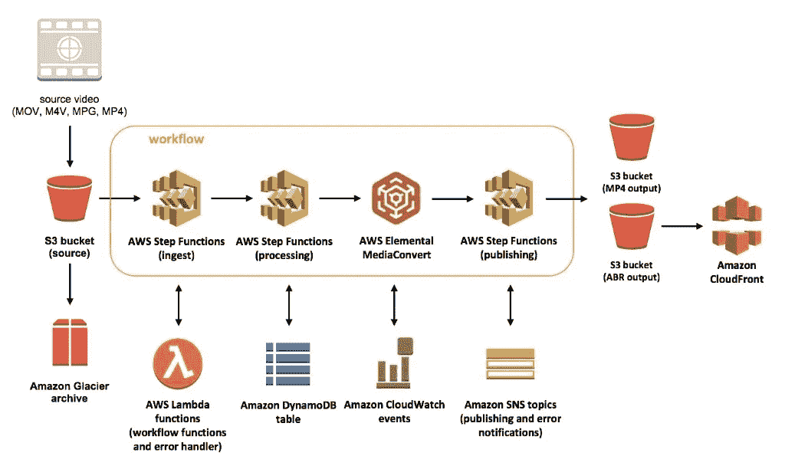
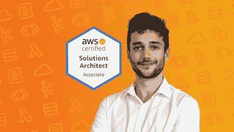
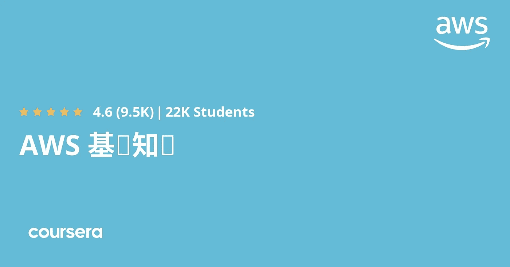
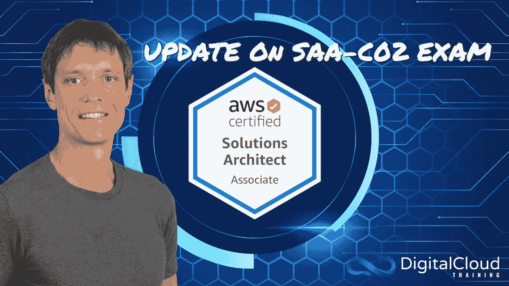
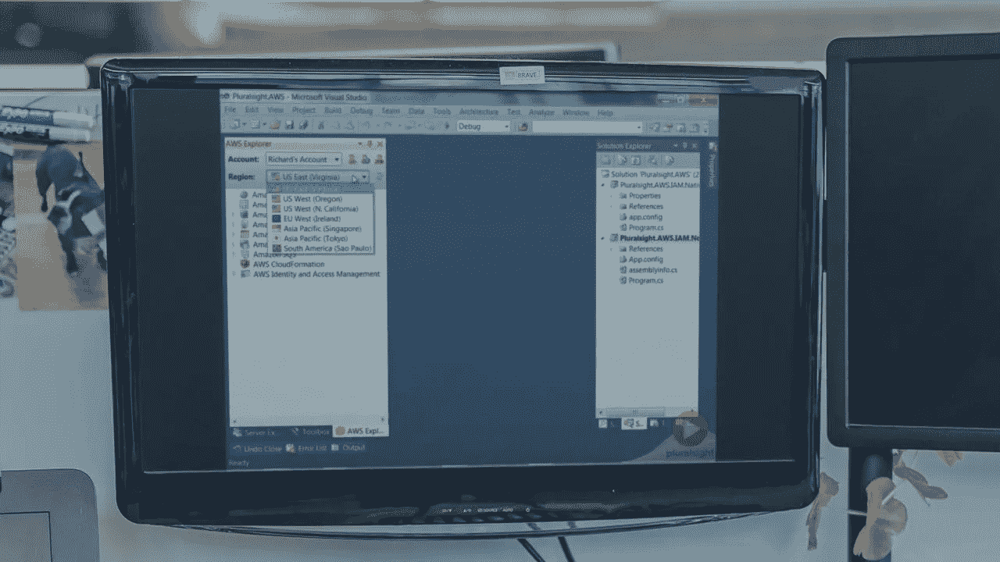
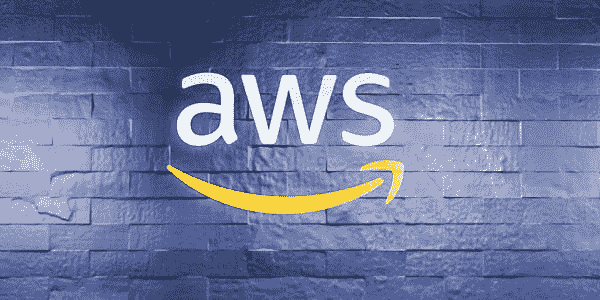
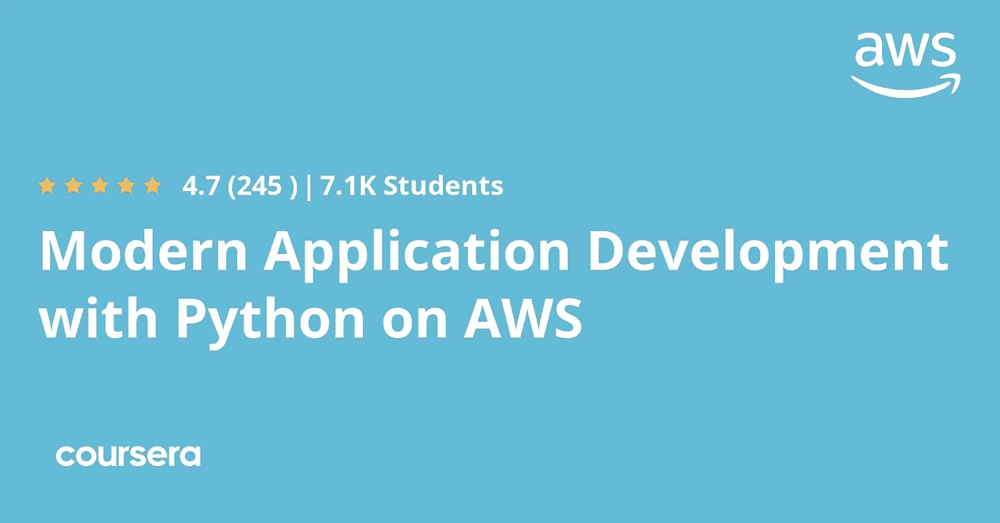
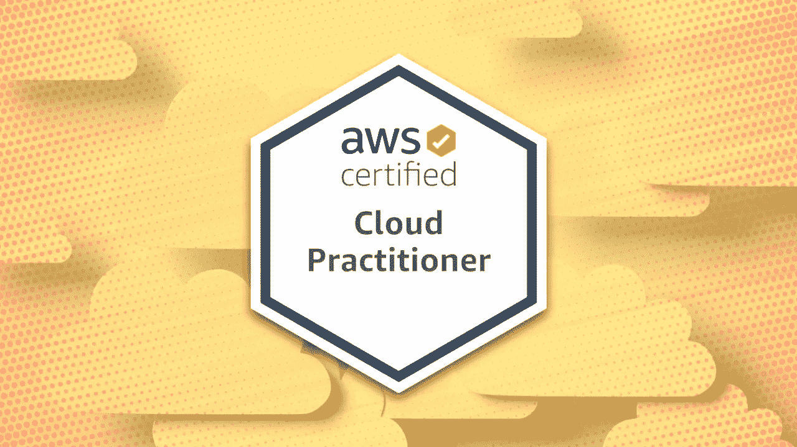

# 2023 年新手在线学习的 7 门最佳 AWS(亚马逊网络服务)课程

> 原文：<https://medium.com/javarevisited/5-best-aws-courses-for-beginners-and-experienced-developers-to-learn-in-2021-563212409fbd?source=collection_archive---------0----------------------->

## 这些是初学者在 2023 年可以加入的最好的 AWS 课程，以深入学习亚马逊 Web 服务。

image_credit — AWS

你好，伙计们，如果你想在 2023 年学习 AWS 并寻找最好的书籍、课程、教程和文章，那么你来对地方了。以前我分享过**最好的** [**免费课程学习 AWS**](/javarevisited/top-5-aws-training-courses-to-crack-amazon-web-service-solutions-architect-associate-certification-3f4affa8f660?source=collection_home---4------0-----------------------) 和[**免费 AWS 实践测试**](https://javarevisited.blogspot.com/2019/08/top-5-free-aws-solution-architect-Associate-certification-dumps-practice-questions.html) 通过 AWS 解决方案架构师助理认证，今天我要分享的是*适合初学者和有经验程序员的最好的 AWS 课程*。你可以利用这些课程从零开始深入学习 AWS。

随着近年来[云计算](https://javarevisited.blogspot.com/2019/07/top-5-online-courses-to-learn-cloud-computing-aws.html)的增长，亚马逊网络服务( [AWS](https://aws.amazon.com/) )已经成为当今科技领域最抢手的技能之一。这并不奇怪，因为 AWS 是历史最悠久、规模最大的公共云提供商，许多大小公司都在 AWS 上托管了他们的解决方案。

它拥有 AWS 市场上最大的服务集合，为个人和组织提供创新的工具和技术，将他们的整个基础设施部署或迁移到 AWS 平台上。

对 [AWS 认证专家](https://javarevisited.blogspot.com/2019/08/how-to-crack-aws-certified-solution-architect-exam.html)的需求只会增加，因为向云迁移现在是许多组织的首要任务。

这也意味着对于有经验的 it 专业人士来说，这是一个转行进入 [AWS 开发者](/javarevisited/top-5-online-courses-to-become-aws-certified-developer-associate-in-2020-best-of-lot-9b22baf84ca8)、 [AWS 系统管理员](/javarevisited/6-best-aws-sysops-online-courses-for-devops-engineers-to-become-a-certified-aws-sysops-5c2ae9dad31d) r、 [AWS 架构师](/javarevisited/6-best-courses-for-aws-certified-solution-architect-professional-exam-in-2020-df5850a9279a)等利润丰厚的领域的绝佳机会。我强烈建议程序员获得 AWS 认证，不仅仅是因为他们想要一份 AWS 工作，也是为了向客户展示他们了解 AWS。

很快， [AWS](/javarevisited/top-5-aws-training-courses-to-crack-amazon-web-service-solutions-architect-associate-certification-3f4affa8f660) 和[云计算技能](/javarevisited/5-best-cloud-computing-courses-to-learn-in-2020-f5f091159401)将成为必修课，如果你不懂云计算或者没有在云计算三巨头 [AWS](/javarevisited/top-10-courses-to-learn-amazon-web-services-aws-cloud-in-2020-best-and-free-317f10d7c21d) 、 [GCP](https://javarevisited.blogspot.com/2019/07/top-5-google-cloud-platform-gcp-courses-certifications-online.html) 和 [Azure](https://javarevisited.blogspot.com/2020/04/how-to-crack-microsoft-az-103-azure-administrator-associate-exam-certification.html) 工作的经验，那么你将会被落在后面。如果你想提升自己的技能，或者想在 2023 年学习一门热门技能，那么我强烈推荐你学习 AWS。你不仅会学到一项对你目前的工作有帮助的关键技能，还会为你未来许多令人兴奋的职业机会打开大门。

# 2023 年学习亚马逊网络服务或 AWS 的 7 门最佳在线课程

正如我所说，AWS 或亚马逊网络服务是最受欢迎的云平台，学习 AWS 将为有经验的开发人员打开新的职业机会之门。这些是在线培训课程，您可以在自己的家里或办公室，按照自己的时间和节奏学习 2023 年的 AWS 云平台。

## 1.[终极 AWS 认证解决方案架构师助理](https://click.linksynergy.com/deeplink?id=JVFxdTr9V80&mid=39197&murl=https%3A%2F%2Fwww.udemy.com%2Fcourse%2Faws-certified-solutions-architect-associate-saa-c02%2F)

这可能是 2023 年学习 AWS 最好的、最前沿的课程。虽然本课程侧重于 AWS 解决方案架构师考试，但对全面了解 AWS 非常有帮助。

教授这门课程的不是别人，正是 Stéphane Maarek，他是 AWS 专家、AWS 认证开发人员和解决方案架构师，也是 Udemy 在学习 [Apache Kafka](https://javarevisited.blogspot.com/2018/04/top-5-apache-kafka-course-to-learn.html#axzz5aXrBEVUU) 、 [gRPC](https://javarevisited.blogspot.com/2020/04/top-5-courses-to-learn-grpc-and-google-protocol-buffer-java-python-golang.html) 和 [AWS](https://javarevisited.blogspot.com/2020/02/top-5-courses-to-crack-aws-certified-cloud-practitioner-exam-certification-clf-c01.html) 方面的最佳导师。

在本课程中，您将了解许多 AWS 概念和服务，如 IAM、 [EC2](https://javarevisited.blogspot.com/2020/08/top-5-courses-to-learn-amazon-aws-ec-2.html#axzz6f4s58Ml9) 、负载平衡、自动伸缩、EBS、EFS、53 号公路、RDS、ElastiCache、 [S3](/javarevisited/7-best-aws-s3-and-dynamodb-courses-for-beginners-in-2021-a8a44b6066da) 、CloudFront 等。

这些是每个在 AWS 工作的人都应该知道的 AWS 服务。您还将了解数据库之类的东西——RDS、Aurora、DynamoDB、Neptune、ElastiCache、Redshift、ElasticSearch、Athena、监控、故障排除&审计，如 AWS CloudWatch、CloudTrail 和 VPC &深度联网

这也是一门实践课程，夏羽不仅会告诉您，还会向您展示如何使用 AWS Free Tier 做事。你将学习如何超越 AWS 自由层，并在现实世界中工作。

**以下是参加 AWS 课程的链接**—[AWS 认证解决方案架构师助理](https://click.linksynergy.com/deeplink?id=JVFxdTr9V80&mid=39197&murl=https%3A%2F%2Fwww.udemy.com%2Fcourse%2Faws-certified-solutions-architect-associate-saa-c02%2F)

在每一部分的最后还有小测验，在课程结束时还有一次练习考试，这对检查你的进步非常有用。如果你正在准备 [AWS 解决方案架构师考试](https://www.java67.com/2020/04/how-to-paas-aws-certified-solution-architect-exam-in-2020.html)，你也可以用这个来衡量你的准备水平。

## 2. [AWS 基础专业](https://coursera.pxf.io/c/3294490/1164545/14726?u=https%3A%2F%2Fwww.coursera.org%2Fspecializations%2Faws-fundamentals)【AWS 最佳课程】

如果你想从亚马逊学习 Coursera 上的 AWS，那么这是加入 Coursera 计划的最佳选择。这是一个 Coursera 专业化课程，包含由 AWS 技术专家设计和教授的 4 门 AWS 课程。

本 [AWS 课程](https://coursera.pxf.io/c/3294490/1164545/14726?u=https%3A%2F%2Fwww.coursera.org%2Fspecializations%2Faws-fundamentals)最适合希望学习核心 AWS 服务、关键 AWS 安全概念、从内部迁移到 AWS 的策略以及使用 AWS 构建无服务器应用程序的基础知识的初学者。

这种*Coursera specialization*n 不仅教你 AWS 基础知识和基本概念，而且给你机会通过完成实验室和由 AWS 技术讲师开发的练习来实践你所学的知识。

如果你不知道，Coursera Specialization 是一个紧密结合的课程集合，旨在教授你一项特定的技能，它还包括一个实践项目。您需要成功完成项目才能完成专业化认证并获得证书。

谈到社会证明，这门课程是由 AWS 自己开设的，已经有超过 22，977 名学生注册了他的课程。接近 10K 的参与者平均给它打了 4.6 分。总的来说，这是从 AWS 开始云计算生涯的完美课程。

**这是参加本课程的链接** — [AWS 基础专业](https://coursera.pxf.io/c/3294490/1164545/14726?u=https%3A%2F%2Fwww.coursera.org%2Fspecializations%2Faws-fundamentals)

## 3. [AWS 认证解决方案架构师助理 SAA-C02【2023】Neal Davis](https://click.linksynergy.com/deeplink?id=JVFxdTr9V80&mid=39197&murl=https%3A%2F%2Fwww.udemy.com%2Fcourse%2Faws-certified-solutions-architect-associate-hands-on%2F)

这是深入学习 AWS 服务以及通过 AWS 解决方案架构师认证考试的最佳课程之一。这实际上是通过 AWS 解决方案架构师考试的更推荐的课程，但同时，这也是深入学习 AWS 的很好的课程。

在本课程中，您将全面了解 AWS 平台，然后深入了解 AWS 服务的基本知识和必备知识。您将探索 Route53、EC2、S3、云锋、自动缩放、负载平衡、RDS、红移、 [DynamoDB](https://www.java67.com/2020/08/top-5-courses-to-learn-aws-s3-and-dynamoDB-in-depth.html) 、EMR、VPC 等。这门课程结构严谨，动手能力强，这意味着你不会感到无聊。大多数讲座时长为 5-12 分钟，几乎没有超过 20 分钟的。

**以下是加入这一最佳 AWS 课程的链接** — [AWS 认证解决方案架构师](https://click.linksynergy.com/deeplink?id=JVFxdTr9V80&mid=39197&murl=https%3A%2F%2Fwww.udemy.com%2Fcourse%2Faws-certified-solutions-architect-associate-hands-on%2F)

导师尼尔·戴维斯(Neal Davis)是 AWS 方面的权威，也是数字云培训的创始人。他还是 AWS 认证解决方案架构师、开发人员和系统管理员，在 IT 领域拥有超过 17 年的专业经验。

## 4. [AWS 开发者基础](https://pluralsight.pxf.io/c/1193463/424552/7490?u=https%3A%2F%2Fwww.pluralsight.com%2Fpaths%2Faws-course)【最佳 Pluralsight AWS 课程】

Pluralsight 有一些最令人惊叹的 AWS 课程，由 AWS 的专家和权威创建，本课程就是其中之一。在本课程中，您将从开发人员的角度学习从头开始使用 AWS 所需的核心 AWS 技能和概念。

本课程涵盖了 Amazon Web Services 在计算、存储、数据库、消息传递和管理方面的产品。每个模块都包括一系列演示，展示如何通过管理控制台、本机 API 和。NET SDK。

本 Pluralsight AWS 课程还涵盖 EC2 等经典 AWS 服务以及 DynamoDB 等全新服务。

学完本课程后，您将准备好进入更高级的主题，如 AWS 认证开发人员和 AWS 认证解决方案架构师考试。如果你正在准备这些认证，那么这是一个很好的基础课程。

**以下是参加 Pluralsight AWS 课程的链接**——[AWS 开发者基础](https://pluralsight.pxf.io/c/1193463/424552/7490?u=https%3A%2F%2Fwww.pluralsight.com%2Fpaths%2Faws-course)

顺便说一下，你需要一个 [Pluralsight 会员](/javarevisited/pluralsight-or-udemy-d9a94d2e8ee)才能进入这个课程，这个课程每月花费大约 29 美元，但是你现在一年只需要 199 美元，因为他们提供年度会员 40%的折扣**。这是一笔很好的交易，因为你不会总是以低于 200 美元的价格获得 Pluralsight 会员资格。**

** [## 个人技术技能|多视角

### 借助 Pluralsight，在开发运维、机器学习、云、安全基础设施等领域构建所需技能…

pluralsight.pxf.io](https://pluralsight.pxf.io/c/1193463/424552/7490?u=https%3A%2F%2Fwww.pluralsight.com%2Flearn) 

如果你是一名开发人员或 IT 专业人士，我鼓励你获得 Pluralsight 会员资格，因为它允许你访问他们的 [7000+在线课程](/javarevisited/7000-free-pluralsight-courses-to-build-in-demand-tech-skills-without-leaving-your-house-40edb50a8cf2)，这些课程涉及前端和后端开发、机器学习等所有最新主题。它还包括交互式测验、练习和最新的认证材料。** 

## **5.[全面了解亚马逊网络服务(AWS)](https://www.educative.io/courses/learn-the-a-to-z-of-amazon-web-services-aws?affiliate_id=5073518643380224) 【教育性】**

**这是一个基于文本的交互式课程，学习云计算和 AWS 基础知识。在本课程中，您将学习所有基本的 AWS 服务，如计算、存储、网络、虚拟网络，以及它们如何与 IAM、Routing、Lambdas 等其他服务协同工作。

本课程由三位 AWS 认证解决方案架构师设计，他们拥有 17 年的行业经验，并在 AWS 领域开展了大量工作。该课程的深度适合初学者，您将学习初学者需要了解的所有基本 AWS 服务。
如果你喜欢基于文本的、互动的和动手的课程，那么你应该参加这个。**

****这里是加入这个交互式 AWS 课程的链接**——[学习亚马逊网络服务(AWS)的 A 到 Z](https://www.educative.io/courses/learn-the-a-to-z-of-amazon-web-services-aws?affiliate_id=5073518643380224)**

****

**此外，作为一个平台，教育性真的很好，如果你觉得这个课程不错，我建议你参加 [**教育性订阅**](https://www.educative.io/subscription?affiliate_id=5073518643380224) ，价格约为 14.99 美元，并提供他们 100 多门软件开发课程的访问权限。大多数情况下，这是一个更好的交易，因为你不需要在未来购买课程，你可以直接注册并开始学习。**

** [## 介绍:教育性订阅。获得无限制的访问权限！

### 我们使用 cookies 来确保您在我们的网站上获得最佳体验。请查看我们的隐私政策以了解更多信息…

www.educative.io](https://www.educative.io/subscription?affiliate_id=5073518643380224)** 

## **6.[基于 AWS 专业化的 Python 现代应用开发](https://coursera.pxf.io/c/3294490/1164545/14726?u=https%3A%2F%2Fwww.coursera.org%2Fspecializations%2Faws-python-serverless-development)**

**这门课是由 AWS 自己提供的。这将向您介绍 Amazon Web Services (AWS)的核心服务和基础设施。通过演示，您将了解如何使用和配置 AWS 服务来部署和托管云原生应用程序。

本课程将通过演示向您介绍亚马逊网络服务(AWS)的核心服务和基础设施，您还将学习如何使用和配置 AWS 服务来部署和托管云原生应用，尤其是使用 Python 编程语言。

在本课程中，您不需要完成动手练习，但是我们强烈建议您利用 [AWS 免费课程](https://aws.amazon.com/free/)来跟随讲师演示 AWS 服务。课堂论坛还将允许您提出问题并与 AWS 培训讲师互动。**

**这是 Coursera 上*最好的 AWS 课程之一*，完成本课程后，您将具备开始学习 AWS 的基本基础。**

****这里是加入 AWS 课程的链接** — [用 Python 进行 AWS 专业化的现代应用程序开发](https://coursera.pxf.io/c/3294490/1164545/14726?u=https%3A%2F%2Fwww.coursera.org%2Fspecializations%2Faws-python-serverless-development)**

****

**如果你觉得这个课程很有用，并想加入 Coursera 上的其他 AWS 课程，那么你也可以加入 [**Coursera Plus 计划**](https://coursera.pxf.io/c/3294490/1164545/14726?u=https%3A%2F%2Fwww.coursera.org%2Fcourseraplus) ，它允许无限制地获得来自常春藤联盟大学和公司的 3000 多个 Coursera 专业和专业证书。

Coursera Plus 不需要购买多门课程，既经济实惠又易于使用，因为你不需要一直购买课程。**

** [## Coursera Plus |无限制访问 7，000 多门在线课程

### 用 Coursera Plus 投资你的职业目标。无限制访问 90%以上的课程、项目…

coursera.pxf.io](https://coursera.pxf.io/c/3294490/1164545/14726?u=https%3A%2F%2Fwww.coursera.org%2Fcourseraplus)** 

## **7.[ZTM 学院 AWS 认证云从业者](https://academy.zerotomastery.io/a/aff_1f8vmvjz/external?affcode=441520_zytgk2dn)**

**这是 2023 年从零开始在线学习 AWS 的又一个很棒的课程，还可以通过受欢迎的 AWS 认证云从业者考试。这门课程不是来自 Udemy 或 Coursera，而是来自 ZTM 学院，由 Udemy 最好的讲师之一 Andrei Negaoie 创建的一个新的在线课程平台。**

**在[这门在线课程](https://academy.zerotomastery.io/a/aff_1f8vmvjz/external?affcode=441520_zytgk2dn)中，您将学习 AWS 基础知识以及先进的云技术(来自一位拥有 15 年以上经验的专家！)，以便您能够通过认证考试，并被聘为云工程师！**

**您一定在想，这个课程与本文中提到的其他 AWS 课程有什么不同？**

**原因有很多，但这里有几个最有意义的:**

1.  **本课程以激光为重点。一切都是为了高效学习，而不是浪费你宝贵的时间。**
2.  **您将向一位拥有超过 15 年经验和多项认证的行业专家学习。**
3.  **有 94 个独家问题，有完整的答案和解释(包括一个完整的实践考试)，以帮助您准备和确保您在考试中获得高分。**

**简而言之，在 2023 年学习亚马逊网络服务基础知识的一门引人入胜的、最新的和全面的在线课程(35 个小时和一个带有许多实践练习的项目)。**

****以下是参加本课程的链接** — [AWS 认证云从业者](https://academy.zerotomastery.io/a/aff_1f8vmvjz/external?affcode=441520_zytgk2dn)**

****

**顺便说一句，你需要一个 [**ZTM 会员**](https://academy.zerotomastery.io/a/aff_c0gnlvf7/external?affcode=441520_zytgk2dn) 才能观看这个课程，这个课程每月花费大约 39 美元，但也提供了许多超级有趣和有用的课程，如 AWS 课程。您还可以使用我的代码**好友 10** 获得您选择的任何套餐的 10%折扣。**

** [## 学习需求技能。被录用。推进你的事业。|零到精通

### 不要在无聊、过时的教程上浪费时间。加入 750，000 多名学生的行列，学习受欢迎的技能，并在…

academy.zerotomastery.io](https://academy.zerotomastery.io/a/aff_c0gnlvf7/external?affcode=441520_zytgk2dn)** 

# **2023 年为什么要学亚马逊 Web Service 或者 AWS？**

**如果你不确定是否要学习 AWS 或 Azure 或谷歌云平台或云计算本身，那么不要担心，只是学习它。AWS 很庞大。非常大。AWS 拥有企业云市场约 75%的份额。它是万亿美元市场中最大的玩家。**

**关键外卖？**

**AWS 是一项非常有利可图的技能，许多公司都在拼命招人。**

**最酷的是，成为 AWS 认证的云从业者是在技术领域开始职业生涯的一个很好的方式(之前没有经验)。**

**如果你需要数字，那么 2023 年有两个数据应该是学习 AWS 的令人信服的理由:**

1.  **仅在美国，LinkedIn 上就有 30 万个以上(不是一个错别字)的招聘信息是为那些拥有 AWS 技能的人列出的**
2.  **AWS 云工程师的平均工资超过 102，000 美元/年**

**更重要的是，几乎每个公司都在向云迁移，迟早你需要学习云计算，而 AWS 是市场领导者。不仅如此，对于有经验的程序员来说，这也是一项惊人的技能，可以将你现有的技术职业提升到一个新的水平。**

**以上就是 2023 年**初学者和有经验程序员学习 AWS 的一些**最佳课程。如果你正在学习云计算，AWS 是一个很好的开始平台。它不仅对你现在的工作有帮助，对外面的世界也有帮助。******

**这些无疑是学习 AWS 或 Amazon Web Service 基础知识的最佳课程，对新手和中级 AWS 开发人员都非常有用。

其他 **IT 和云认证文章**您可能喜欢:**

*   **[破解 AWS DevOps 工程师考试的前 5 门课程](https://javarevisited.blogspot.com/2020/04/top-5-course-to-crack-aws-certified-devops-engineer-professional-exam-certification.html)**
*   **[如何成为 DevOps 工程师？](https://hackernoon.com/the-2018-devops-roadmap-31588d8670cb?gi=8829080e6d7d)**
*   **[破解 AWS 解决方案架构师专业考试的前 5 门课程](https://javarevisited.blogspot.com/2020/04/top-5-course-to-crack-aws-solution-architect-professional-sap-c01-certification-exam.html)**
*   **[如何通过 Spring Core Professional 5.0 认证](https://javarevisited.blogspot.com/2018/08/how-to-crack-spring-core-professional-certification-exam-java-latest.html)**
*   **[学习数据结构和算法的 10 门免费课程](http://www.java67.com/2019/02/top-10-free-algorithms-and-data.html)**
*   **[如何破解 Azure Fundamentals (AZ-900)认证](https://javarevisited.blogspot.com/2020/04/how-to-crack-microsoft-azure-fundamentals-certification-az-900-exam.html)**
*   **[学习 Docker 和 Kubernetes 的 10 大课程](https://dev.to/javinpaul/top-10-courses-to-learn-docker-and-kubernetes-for-programmers-4lg0)**
*   **[程序员前 5 名 AZ-900 模拟测试](https://javarevisited.blogspot.com/2020/02/top-5-AZ-900-exam-Azure-Fundamentals-certification-practice-tests-and-mock-exams-to.html)**
*   **[如何破解 Azure 管理员助理认证(AZ-103)](https://javarevisited.blogspot.com/2020/04/how-to-crack-microsoft-az-103-azure-administrator-associate-exam-certification.html)**
*   **[如何破解甲骨文 2023 年 Java 认证？](https://medium.freecodecamp.org/how-to-pass-oracles-java-certifications-a-practical-guide-for-developers-e9b607ba6173)**
*   **[Spring 认证对工作和事业有帮助吗？](https://javarevisited.blogspot.com/2017/07/does-spring-certification-help-in-job-and-career.html)**
*   **[10 门数据科学和机器学习认证课程](https://dev.to/javinpaul/10-data-science-and-machine-learning-courses-for-programmers-looking-to-switch-career-57kd)**
*   **[通过谷歌助理云工程师认证的前 5 门课程](https://javarevisited.blogspot.com/2019/07/top-5-google-cloud-platform-gcp-courses-certifications-online.html)**
*   **每个软件开发人员都应该学习的 10 件事**
*   **[破解 Azure 云架构师(AZ-300)考试的前 5 门课程](https://javarevisited.blogspot.com/2019/07/top-5-courses-to-crack-azure-architecture-technologies-certification-az-300-exam.html#axzz6E6VuRMsx)**
*   **[OCAJP 和 OCPJP 考试 10 道免费样题](http://www.java67.com/2017/05/10-free-java-8-certification-sample-questions-OCAJP8-OCPJP8-Mock-Exams.html)**
*   **[破解 AWS 解决方案架构师职业认证的 5 大课程](https://javarevisited.blogspot.com/2020/04/top-5-course-to-crack-aws-solution-architect-professional-sap-c01-certification-exam.html)**

**感谢您阅读本文。如果你觉得这些 AWS 课程有用，请与你的朋友和同事分享。如果您有任何问题或反馈，请留言。

**附言——**如果你喜欢 AWS 并想学习 AWS 服务，但正在寻找一些免费课程，那么不要担心。你也可以查看这份免费 AWS 课程清单**。它们不像这些课程那样全面，但对初学者来说，它们给人的印象相当深刻。****

**** [## 5 大亚马逊网络服务或 AWS 在线学习课程-免费和最好的

### 大家好，如果你正在考虑学习云技术或云计算，并关注各种云…

www.java67.com](https://www.java67.com/2018/05/top-5-amazon-web-services-or-aws-courses-to-learn-online.html)****