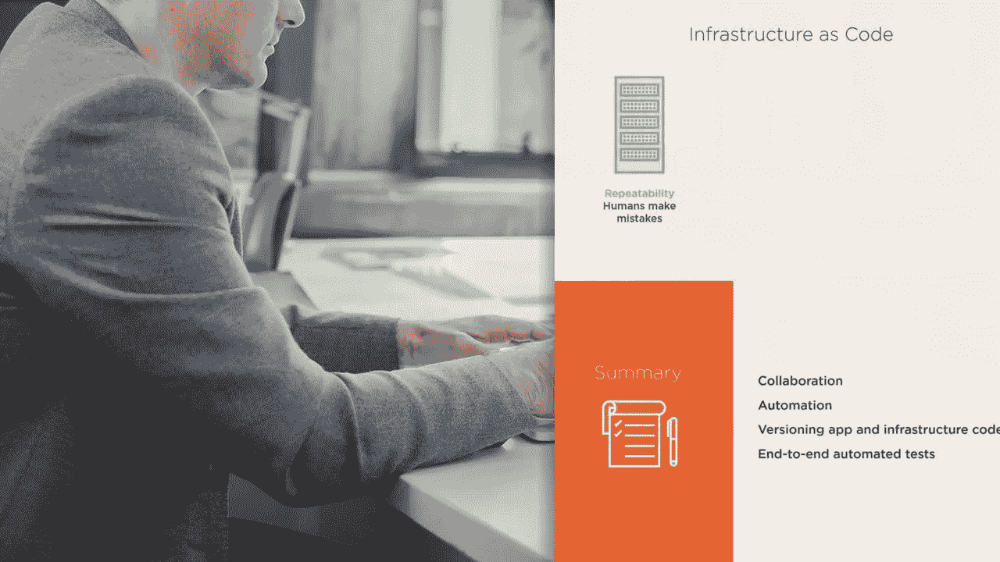
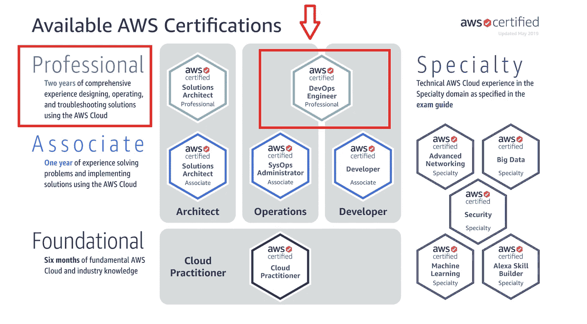
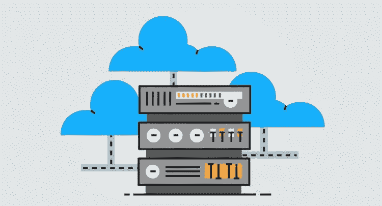
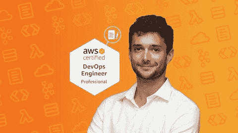
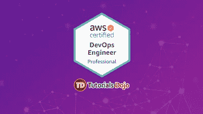

# 2023 年 AWS DevOps 工程师认证考试的 5 门最佳课程+实践测试

> 原文：<https://medium.com/javarevisited/5-best-aws-devops-engineer-certification-courses-to-join-in-2021-aa78f44767e4?source=collection_archive---------0----------------------->

## 这些是 Udemy、Coursera 和 Pluralsight 为 2023 年 AWS 认证 DevOps 工程师认证考试准备的最佳在线课程

image_credit- Pluralsight

各位好，你想成为 AWS 这样的云平台的 DevOps 工程师但是没有目标，那你来对地方了。前面我已经分享了最好的 [AWS 云从业者](/javarevisited/10-best-aws-certified-cloud-practitioner-clf-c01-online-courses-and-practice-test-to-crack-ecc0f913091e)、[开发者](/javarevisited/top-5-online-courses-to-become-aws-certified-developer-associate-in-2020-best-of-lot-9b22baf84ca8)、[系统运维管理员](/javarevisited/6-best-aws-sysops-online-courses-for-devops-engineers-to-become-a-certified-aws-sysops-5c2ae9dad31d)、[解决方案架构师助理](/javarevisited/top-5-aws-training-courses-to-crack-amazon-web-service-solutions-architect-associate-certification-3f4affa8f660?source=collection_home---4------0-----------------------)课程/实践测试，今天我要讲的是 **AWS 认证 DevOps 工程师专业考试，分享最好的在线课程，为这个久负盛名的考试做好准备**。

虽然成为一名优秀的开发人员很棒，编写可扩展的代码也是一项资产，但交付时间在所有 IT 项目中也非常重要，这也是 2009 年第一个 DevOps 日的原因。

DevOps 是单词 development 和 operations 的组合，是导致更快软件开发的操作。在 DevOps 中获得证书使 IT 专业人员能够展示他们的技能，并使他们有资格成为 DevOps 领导者的一部分。

**AWS 认证 DevOps 工程师——专业认证**是亚马逊网络服务提供的证书。该考试只对已经具备 AWS Developer 资格的人员开放——助理或 AWS 认证系统运行管理员。

如果您已经作为 [DevOps 工程师](/hackernoon/the-2018-devops-roadmap-31588d8670cb)工作了一段时间(两年或两年以上)，并且在为您的公司管理、配置和操作 AWS 平台方面经验丰富，那么这些课程非常适合您，它将帮助您更好地准备考试。

这是很难通过的考试之一，可能比 [AWS 解决方案架构师专业人员](https://javarevisited.blogspot.com/2019/05/top-5-courses-to-crack-aws-solutions-architect-associate-certification-exam-SAA-C01.html#axzz5rHwAwycj)稍差一些，但仍然需要努力准备才能通过这个认证。我还加入了一些模拟测试，以提高通过这一著名考试所需的速度和准确度。

# 成为 AWS 认证 DevOps 工程师(专业)的 5 大在线课程

下面是亚马逊 AWS 认证的完整路线图:

****

**你可以看到，目前只有两种专业水平的考试，AWS 认证解决方案架构师专业人员和 **AWS 认证开发运维工程师专业人员**，这两种考试非常适合那些想要成为[开发运维工程师](/javarevisited/top-5-online-courses-to-become-a-devops-engineer-in-2020-764f5e60c2b)或者已经是开发运维冠军并且需要证明来展示他们技能的人。**

**在不浪费你更多时间的情况下，这里有你可以参加的最好的课程，为 2023 年的 AWS DevOps 工程师专业考试做好准备。**

## **1. [AWS 认证 DevOps 工程师专家 2023 —动手操作！](https://click.linksynergy.com/deeplink?id=JVFxdTr9V80&mid=39197&murl=https%3A%2F%2Fwww.udemy.com%2Fcourse%2Faws-certified-devops-engineer-professional-hands-on%2F)**

**虽然这不是速成课程，但它提供了连续 20 小时的实践课程，允许用户在最短的时间内通过 AWS 认证 DevOps 工程师专业考试。**

**如果你认为自己学得很快，记忆力很强，那么这个课程对你来说是极好的。

它也是目前 Udemy 的畅销书，90%的学生第一次尝试就通过了考试。它的评级为 4.7，注册学生超过 13，000 人，有英语和意大利语两种版本。这并不奇怪，因为它是由拥有大多数 AWS 认证的 [AWS 专家夏羽·马雷克](https://click.linksynergy.com/deeplink?id=JVFxdTr9V80&mid=39197&murl=https%3A%2F%2Fwww.udemy.com%2Fuser%2Fstephane-maarek%2F)教授的。在你完全掌握这门课程之前，你需要至少一年的亚马逊网络服务助理的 AWS 工作经验。成为认证的系统操作员或开发人员是一大优势。**

**本课程不仅会让您通过 AWS 认证 DevOps 工程师专业考试，还会为您提供示例和练习，让您获得现实生活中的技能。这门 20.5 小时的课程现在可以在 Udemy 上以略高于 10 美元的价格获得。**

**以下是加入这一最佳 AWS 课程的链接— [AWS 认证 DevOps 工程师专家](https://click.linksynergy.com/deeplink?id=JVFxdTr9V80&mid=39197&murl=https%3A%2F%2Fwww.udemy.com%2Fcourse%2Faws-certified-devops-engineer-professional-hands-on%2F)**

****

**课程内容涵盖课程概述—AWS Certified devo PS Engineer Professional、SDLC Automation 作为领域 1、配置管理和基础架构作为代码作为领域 2、监控和日志记录作为领域 3、策略和标准自动化作为领域 4、事件和事件响应领域 5 和 HA、容错和灾难恢复作为领域 6。**

## **2. [AWS 认证 DevOps 工程师——专业由 Mike Pfeiffer 负责](https://pluralsight.pxf.io/c/1193463/424552/7490?u=https%3A%2F%2Fwww.pluralsight.com%2Fpaths%2Faws-certified-devops-engineer)**

**本课程由 Mike Pfeiffer 教授，通过提供在 AWS 环境中管理、配置和操作分布式应用系统的专业知识，帮助运营工程师和开发人员准备 AWS 认证 DevOps 工程师考试。

它讲述了亚马逊 web 服务上交付系统的实施和管理，这些系统在 AWS 平台上具有高可用性、可伸缩性和自我修复能力，以及如何定义和部署指标、设计、管理和维护应用程序，利用 [AWS](/javarevisited/18-coursera-courses-you-can-join-in-2020-to-learn-from-the-worlds-top-tech-companies-google-74af46967d1e?source=collection_home---4------0-----------------------) 上的连续交付系统和方法实现流程、安全控制、治理流程和合规性验证的自动化。

在学习本课程之前，需要了解一些 [DevOps](/javarevisited/13-best-courses-to-learn-devops-for-senior-developers-in-2020-a2997ff7c33c?source=extreme_sidebar---------0-2----------------------) 的背景知识，并且需要 AWS 认证系统管理员或 AWS 认证开发人员(助理)的证书。**

**没有以上认证，就不能参加 AWS 认证 DevOps 工程师-专业考试。到目前为止，该课程已经获得了很多积极的反馈，并在 Pluralsight 上排名第一。**

**以下是参加 AWS 课程的链接— [AWS 认证 DevOps 工程师—专业](https://pluralsight.pxf.io/c/1193463/424552/7490?u=https%3A%2F%2Fwww.pluralsight.com%2Fpaths%2Faws-certified-devops-engineer)**

****

**顺便说一句，你需要一个 [Pluralsight 会员](https://javarevisited.blogspot.com/2019/10/udemy-vs-pluralsight-review-which-is-better-to-learn-code.html)才能进入这个课程，费用大约是每月 29 美元或每年 199 美元(现在**有 40%的折扣**)。

如果您没有 Pluralsight 会员资格，我鼓励您申请一个，因为它允许您访问他们的 5000 多门在线课程，以通过不同的云认证。**

**他们还提供为期 [**10 天的免费试用**](https://pluralsight.pxf.io/c/1193463/424552/7490?u=https%3A%2F%2Fwww.pluralsight.com%2Flearn) ，无需任何承诺，这不仅是免费学习这门课程的好方法，也是在加入 Pluralsight 之前检查课程质量的好方法。**

**<https://pluralsight.pxf.io/c/1193463/424552/7490?u=https%3A%2F%2Fwww.pluralsight.com%2Flearn> ** 

## **3. [AWS 认证 DevOps 工程师—专业 2023](https://click.linksynergy.com/deeplink?id=JVFxdTr9V80&mid=39197&murl=https%3A%2F%2Fwww.udemy.com%2Fcourse%2Fmaster-aws-certified-devops-engineer-professional%2F)**

**这门课程的评分为 4.5 分，有近 300 万名学生注册，唯一的缺点是只用英语授课。

与大多数同行不同，本课程对 DevOps 有更深入的了解，理解它所需要的只是对 Amazon Web Services 的基本理解。它旨在帮助 It 专业人员获得 AWS DevOps 工程师专业认证。

它是针对新的 [AWS 认证 DevOps 工程师考试](https://javarevisited.blogspot.com/2020/04/top-5-course-to-crack-aws-certified-devops-engineer-professional-exam-certification.html)而创建的，提供许多实用和动手练习，帮助您为考试做好准备。教师也可以提供关于课程的课外咨询。

课程内容也包含六个领域，第一个是 SDLC 自动化，第二个是配置管理和基础架构代码，第三个是监控和日志记录，第四个是策略和标准自动化，第五个是事件和事件响应，最后一个是高可用性、容错和灾难恢复。最后还有一次模拟考试。**

****以下是参加 AWS DevOps 课程的链接** — [AWS 认证 DevOps 工程师—专业 2023](https://click.linksynergy.com/deeplink?id=JVFxdTr9V80&mid=39197&murl=https%3A%2F%2Fwww.udemy.com%2Fcourse%2Fmaster-aws-certified-devops-engineer-professional%2F)**

****

## **4.[实践考试:AWS 认证 DevOps 工程师专业](https://click.linksynergy.com/deeplink?id=JVFxdTr9V80&mid=39197&murl=https%3A%2F%2Fwww.udemy.com%2Fcourse%2Faws-certified-devops-engineer-professional-practice-exam-dop%2F)**

**这是另一门考试课程，针对在小组中学习更好的学生。如果你不喜欢冗长的演讲和令人厌倦的概念，这可能适合你。**

**本课程已经假定您拥有足够的 DevOps 知识，旨在让您顺利通过 AWS 认证 DevOps 工程师专业考试。它的评分为 4.5 分(满分为 5.0 分)，有近 4000 名学生注册。练习题也很难，水平和真题差不多。没有深入的知识，你就无法解决它们。**

**我还建议你在一个安静的房间里，在真实的考试场景中进行这些模拟测试，这样你就可以衡量你的速度和准确性。

他们还会帮你在考前找到自己的强项和弱项，以便你在弱项上下功夫，让强项变强。**

**这里是购买这个模拟考试的链接— [模拟考试:AWS 认证 DevOps 工程师专业](https://click.linksynergy.com/deeplink?id=JVFxdTr9V80&mid=39197&murl=https%3A%2F%2Fwww.udemy.com%2Fcourse%2Faws-certified-devops-engineer-professional-practice-exam-dop%2F)**

****

## **5. [AWS 认证 DevOps 工程师专业实践考试](https://click.linksynergy.com/deeplink?id=JVFxdTr9V80&mid=39197&murl=https%3A%2F%2Fwww.udemy.com%2Fcourse%2Faws-certified-devops-engineer-professional-practice-exams-amazon%2F)**

**这是另一个作为 Udemy 及其课程出售的模拟测试，来自 TutorialsDojo，它以其高质量的 AWS 模拟测试而闻名。它的评分为 4.5 分(满分为 5.0 分)，有近 2000 名学生注册。**

**该课程旨在帮助 IT 专业人员通过 AWS 认证 DevOps 工程师专业考试，尽管它被标记为实践考试，但它对 DevOps 中的所有主题都有详细的解释。

本课程包括两门 AWS 认证 DevOps 实践考试，每门考试有 75 道题。这些问题涵盖了 DevOps 的各个方面，并提供了额外的参考资料和附加表格来进一步解释概念。

有一个问答板，可以让你和其他准 AWS 认证 DevOps 工程师专业考试考生进行互动和交流。导师也很有求必应。**

**以下是参加 AWS 考试的链接— [AWS 认证 DevOps 工程师专业实践考试](https://click.linksynergy.com/deeplink?id=JVFxdTr9V80&mid=39197&murl=https%3A%2F%2Fwww.udemy.com%2Fcourse%2Faws-certified-devops-engineer-professional-practice-exams-amazon%2F)**

****

**以上就是关于**破解 AWS 认证 DevOps 工程师专业考试**的最佳课程。正如我告诉你的，通过考试并不容易，你需要花一些时间学习不同的 AWS 服务和 DevOps 实践来通过考试。**

**这些课程不仅可以帮助您准备考试，还可以让您获得一些关于 AWS 环境的实践经验。你还应该花一些时间进行模拟测试，这样你就可以建立通过这个著名考试所需的速度和准确性。

其他 **IT 和云认证文章**您可能喜欢:**

*   **[学习 Docker 和 Kubernetes 的十大课程](https://dev.to/javinpaul/top-10-courses-to-learn-docker-and-kubernetes-for-programmers-4lg0)**
*   **[通过谷歌助理云工程师认证的前 5 门课程](https://javarevisited.blogspot.com/2019/07/top-5-google-cloud-platform-gcp-courses-certifications-online.html)**
*   **[如何成为 DevOps 工程师？](https://hackernoon.com/the-2018-devops-roadmap-31588d8670cb?gi=8829080e6d7d)**
*   **[如何通过 Spring Core Professional 5.0 认证](https://javarevisited.blogspot.com/2018/08/how-to-crack-spring-core-professional-certification-exam-java-latest.html)**
*   **[10 门学习数据结构和算法的免费课程](http://www.java67.com/2019/02/top-10-free-algorithms-and-data.html)**
*   **[如何破解 Azure Fundamentals (AZ-900)认证](https://javarevisited.blogspot.com/2020/04/how-to-crack-microsoft-azure-fundamentals-certification-az-900-exam.html)**
*   **[AWS 认证 DevOps 工程师专业考试官方指南](https://aws.amazon.com/certification/certified-devops-engineer-professional/)**
*   **[程序员前 5 名 AZ-900 模拟测试](https://javarevisited.blogspot.com/2020/02/top-5-AZ-900-exam-Azure-Fundamentals-certification-practice-tests-and-mock-exams-to.html)**
*   **[如何破解 Azure 管理员助理认证(AZ-103)](https://javarevisited.blogspot.com/2020/04/how-to-crack-microsoft-az-103-azure-administrator-associate-exam-certification.html)**
*   **[如何破解甲骨文 2023 年 Java 认证？](https://medium.freecodecamp.org/how-to-pass-oracles-java-certifications-a-practical-guide-for-developers-e9b607ba6173)**
*   **Spring 认证对工作和职业生涯有帮助吗？**
*   **[10 门数据科学和机器学习认证课程](https://dev.to/javinpaul/10-data-science-and-machine-learning-courses-for-programmers-looking-to-switch-career-57kd)**
*   **每个软件开发人员都应该学习的 10 件事**
*   **[破解 Azure 云架构师(AZ-300)考试的前 5 门课程](https://javarevisited.blogspot.com/2019/07/top-5-courses-to-crack-azure-architecture-technologies-certification-az-300-exam.html#axzz6E6VuRMsx)**
*   **[OCAJP 和 OCPJP 考试 10 道免费样题](http://www.java67.com/2017/05/10-free-java-8-certification-sample-questions-OCAJP8-OCPJP8-Mock-Exams.html)**
*   **[破解 AWS 解决方案架构师职业认证的 5 大课程](https://javarevisited.blogspot.com/2020/04/top-5-course-to-crack-aws-solution-architect-professional-sap-c01-certification-exam.html)**

**本课程帮助您从问题开始，从底部覆盖 *AWS 认证 DevOps 工程师专业*音节。模拟考试很难，也很专业，然后问题会被分解并作为主题对待。

**P. S.** —如果你不熟悉云计算和 AWS 的世界，并且正在寻找一些免费的课程来学习亚马逊 Web 服务，那么你也可以查看这份针对初学者的免费 AWS 课程列表<https://www.java67.com/2020/08/top-5-free-courses-to-pass-aws-sysops-administrator-associate-exam.html>****，**，其中包含 Udemy、Coursera 和其他平台的免费 AWS 课程。****

****</javarevisited/top-10-courses-to-learn-amazon-web-services-aws-cloud-in-2020-best-and-free-317f10d7c21d> ****