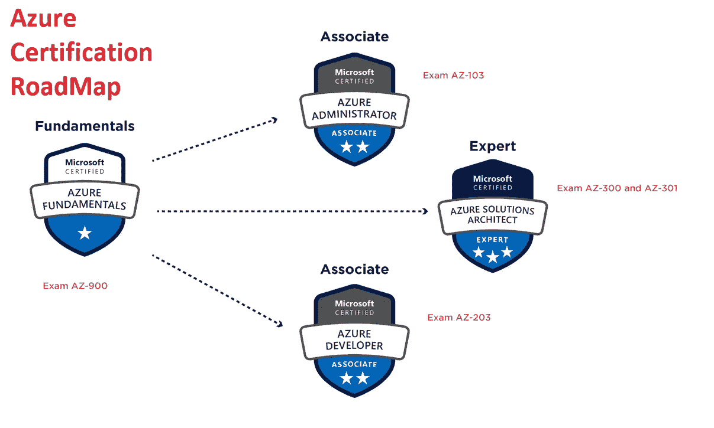
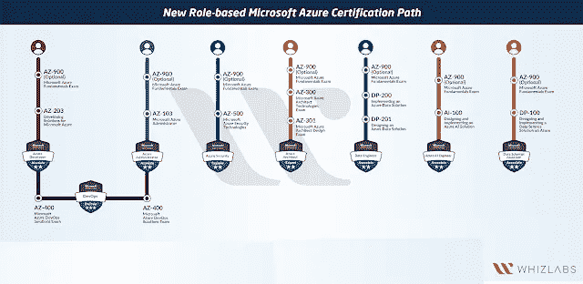
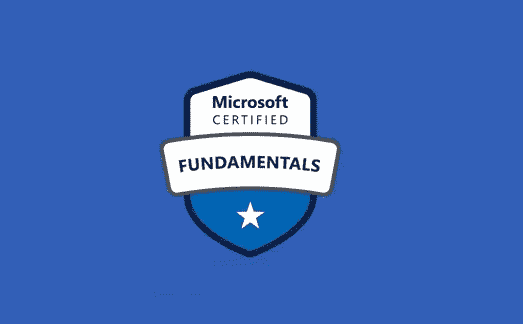
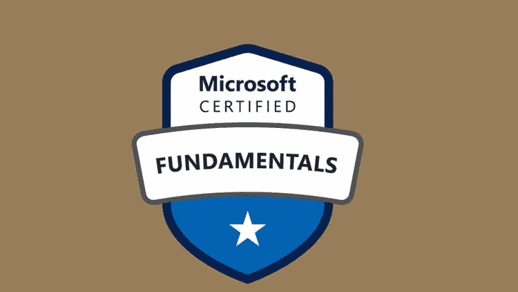

# 2023 年通过 AZ-900 认证考试的 6 门最佳 Azure 基础课程

> 原文：<https://medium.com/javarevisited/5-best-azure-fundamentals-courses-to-pass-az-900-certification-exam-in-2020-9e602aea035d?source=collection_archive---------0----------------------->

## 准备 AZ-900 认证？这些是第一次通过考试的最好的在线课程

你好伙计们，如果你正在准备 [AZ-900 或微软 Azure Fundamentals](https://javarevisited.blogspot.com/2020/02/top-5-AZ-900-exam-Azure-Fundamentals-certification-practice-tests-and-mock-exams-to.html) 考试，并在寻找一些好的在线课程来通过这次考试，那么你来对地方了。

在过去，我已经分享了学习 Azure 和认证的最佳课程，如[**【AZ-104】**](https://javarevisited.blogspot.com/2020/06/top-5-course-to-become-microsoft-azure-administrator-certification-exam.html)[**Azure Developer(AZ-204)**](https://javarevisited.blogspot.com/2020/06/top-5-course-to-crack-Microsoft-Azure-Developer-Certification-Exam-AZ-203.html)[Azure**Architect(AZ-303)**](https://javarevisited.blogspot.com/2019/07/top-5-courses-to-crack-azure-architecture-technologies-certification-az-300-exam.html)在这篇文章中，我将列出一些破解 AZ-900 认证考试的最佳课程。

你可能知道云计算变得越来越重要，技术和非技术 it 人员几乎必须了解云计算和不同的云平台，如 [AWS](https://javarevisited.blogspot.com/2019/05/top-5-courses-to-crack-aws-solutions-architect-associate-certification-exam-SAA-C01.html#axzz5rHwAwycj) 、 [Azure](https://javarevisited.blogspot.com/2019/07/top-5-courses-to-crack-azure-architecture-technologies-certification-az-300-exam.html) 和 [GCP](https://javarevisited.blogspot.com/2019/07/top-5-google-cloud-platform-gcp-courses-certifications-online.html) 。

你不能再躲在云下了，你需要学习它来理解和掌握它，以便在技术工作中保持相关性。值得庆幸的是，有很多学习材料可以用来了解云的好处以及为什么公司应该迁移到云。

尽管如此，认证可能是发展知识、技能和获得许多云工作所需的认可的最佳方式。如果你刚刚开始接触微软 Azure 这样的[云计算](https://javarevisited.blogspot.com/2019/07/top-5-online-courses-to-learn-cloud-computing-aws.html)和[云平台](/javarevisited/5-best-cloud-computing-courses-to-learn-in-2020-f5f091159401)，那么**微软 Azure Fundamentals (AZ-900)** 可能是建立基础云技能并获得认可的最佳认证。

该认证与 [*AWS 云从业者*认证](https://javarevisited.blogspot.com/2020/02/top-5-courses-to-crack-aws-certified-cloud-practitioner-exam-certification-clf-c01.html)非常相似，主要面向希望展示云服务基础知识以及这些服务如何通过 Microsoft Azure 平台提供的候选人。

成功通过这个考试的人，被称为[微软 Azure Fundamentals](https://javarevisited.blogspot.com/2020/02/top-5-AZ-900-exam-Azure-Fundamentals-certification-practice-tests-and-mock-exams-to.html) 或 [AZ-900](https://javarevisited.blogspot.com/2020/02/top-5-courses-to-crack-az-900-microsoft-azure-fundamentals-certification-exam.html) ，将获得微软认证 Azure Fundamentals？认证，这在很多基于云的工作中是被认可的。你也可以把认证徽章放在你的 LinkedIn 个人资料和简历上，以吸引招聘人员。

这个考试也可以作为学习云服务以及这些概念如何被微软 Azure 所体现的可选的第一步。如果你碰巧参加了微软的任何培训，那么你也可能获得一些*免费代金券来免费参加这个认证考试*。

# 2023 年微软 Azure 基础(AZ-900)考试的前 6 门课程

这里是我的最佳课程列表，您可以参加这些课程来破解 AZ-00 或 Microsoft Azure Fundamentals 考试，并获得 Microsoft Certified Azure Fundamentals 认证，但在此之前，让我们看看这个漂亮的 **Microsoft Azure 认证路线图**，它是由领先的 IT 认证测试提供商之一 [Whizlabs](https://www.shareasale.com/r.cfm?b=1325594&u=880419&m=43514&urllink=&afftrack=) 准备的。

他们也有非常好的 Azure 认证的学习材料和练习测试，包括 AZ-900(微软 Azure 基础考试)。

## 1. [AZ-900:微软 Azure 基础考试准备-2023 版](https://click.linksynergy.com/deeplink?id=JVFxdTr9V80&mid=39197&murl=https%3A%2F%2Fwww.udemy.com%2Fcourse%2Faz900-azure%2F)

这是 Udemy 上准备 AZ-900 或微软 Azure 基础考试的最佳课程之一。

本课程完全符合 AZ-900 教学大纲，涵盖了所有的主题。这门课的授课老师斯科特·达菲(Scott Duffy)并不清晰简洁，很容易消化其中的概念。

这门课程还有很多额外的好处，比如你将获得一本 *24 页的学习指南*，你甚至可以下载课程的音频，随时随地学习。最棒的是课程是最新的，鉴于 Azure 的不断更新，这是非常有挑战性的。它还包含巩固学习的测验。

**这里是加入本课程的链接** — [AZ-900:微软 Azure 基础考试准备-2023 版](https://click.linksynergy.com/deeplink?id=JVFxdTr9V80&mid=39197&murl=https%3A%2F%2Fwww.udemy.com%2Fcourse%2Faz900-azure%2F)

它还包含一个 50 个问题的最终准备模拟测试。这还不够，但是你仍然可以在考试前找到你的强项和弱项。如果你是认真的，我建议你将本课程与 Whizlab 的 AZ-900 练习测试结合起来，以便更好地准备，如果你需要更多的练习题，你也可以加入我的课程，我已经分享了 300 多个问题，只需 10 美元。

## 2.[微软 Azure 基础 AZ-900 考试准备专业化](https://coursera.pxf.io/c/3294490/1164545/14726?u=https%3A%2F%2Fwww.coursera.org%2Fspecializations%2Fmicrosoft-azure-fundamentals-az-900)【Coursera】

这是一个很好的资源或在线课程，可以为 Coursera 上的 Microsoft Azure Fundamentals 和 AZ -900 考试做准备，因为这是由微软自己创建的，这意味着你将从资源本身学习。

这个 Microsoft Azure Fundamentals AZ-900 考试准备专业化包括四门课程，将提供您准备 AZ-900 认证考试和云计算领域职业所需的所有基础知识。

以下是您将在本课程中学到的重要内容:

1.  核心微软 Azure 服务；
2.  核心解决方案和管理工具；
3.  一般安全和网络安全；
4.  治理、隐私和合规性特征；
5.  微软 Azure 成本管理和服务水平协议。

这个 [**Azure 认证课程**](https://coursera.pxf.io/c/3294490/1164545/14726?u=https%3A%2F%2Fwww.coursera.org%2Fspecializations%2Fmicrosoft-azure-fundamentals-az-900) **e** 最好的一点是，这个 Coursera 专业化的内容与 AZ-900 考试的目标领域紧密相关。这对于刚开始使用微软 Azure 的 IT 人员或任何想了解它的人来说是理想的。

谈到社交证明，该计划得到了超过 100 名 10K 人的 4.7 分的好评，他们相信这将开启他们在云计算领域的职业生涯。简而言之，AZ-900 考试和在微软 Azure 学习云计算的最佳 Coursera 课程之一。

**这里是加入本课程的链接** — [微软 Azure 基础 AZ-900 考试准备专业化](https://coursera.pxf.io/c/3294490/1164545/14726?u=https%3A%2F%2Fwww.coursera.org%2Fspecializations%2Fmicrosoft-azure-fundamentals-az-900)

除此之外，Coursera 和微软还为其他 Azure 基础考试(如 DP-900 和 AI-900)创建了准备级别课程，如果您正在准备这些考试，您也可以查看微软的以下课程:

1.  [微软 Azure 数据基础 DP-900 考试准备专业化](https://coursera.pxf.io/c/3294490/1164545/14726?u=https%3A%2F%2Fwww.coursera.org%2Fspecializations%2Fmicrosoft-azure-dp-900-data-fundamentals)
2.  [微软 Azure AI 基础 AI-900 考试准备专业化](https://coursera.pxf.io/c/3294490/1164545/14726?u=https%3A%2F%2Fwww.coursera.org%2Fspecializations%2Fmicrosoft-azure-ai-900-ai-fundamentals)
3.  [微软 Azure 数据工程助理 DP-203 考试准备专业](https://coursera.pxf.io/c/3294490/1164545/14726?u=https%3A%2F%2Fwww.coursera.org%2Fspecializations%2Fmicrosoft-azure-dp-203-data-engineering)

顺便说一下，除了单独加入这些课程和专业，你还可以加入 [**Coursera Plus**](https://coursera.pxf.io/c/3294490/1164545/14726?u=https%3A%2F%2Fwww.coursera.org%2Fcourseraplus) ，这是 Coursera 的一个订阅计划，让你可以无限制地访问他们最受欢迎的课程、专业、专业证书和指导项目。

<https://coursera.pxf.io/c/3294490/1164545/14726?u=https%3A%2F%2Fwww.coursera.org%2Fcourseraplus>  

## 3.[微软 Azure —初学者指南+ AZ-900 准备](https://click.linksynergy.com/deeplink?id=JVFxdTr9V80&mid=39197&murl=https%3A%2F%2Fwww.udemy.com%2Fcourse%2Fmicrosoft-azure-beginners-guide%2F)

这是准备微软 Azure 基础考试的最佳课程之一。它包含所有你需要知道通过 AZ-900 考试。内容非常实用，你会看到教师向你展示微软 Azure 门户网站内的真实内容，微软学习仅用文本教你。

如果你是云技术和 Azure 的初学者，那么你会从一个真正的 Azure 门户网站学到比阅读微软学习文档更多的东西。

除了涵盖 AZ-900 考试所有主题的讲座，如[云基础](https://javarevisited.blogspot.com/2019/07/top-5-online-courses-to-learn-cloud-computing-aws.html)、核心 Azure 服务、定价和计费等。，本课程还提供了 AZ-900 练习题，帮助您为考试做好准备。

**这里是加入本课程的链接** — [微软 Azure —初学者指南+ AZ-900 准备](https://click.linksynergy.com/deeplink?id=JVFxdTr9V80&mid=39197&murl=https%3A%2F%2Fwww.udemy.com%2Fcourse%2Fmicrosoft-azure-beginners-guide%2F)

在课程结束时，您将有机会参加两次 *AZ-900 模拟测试*，包含 74 个问题。由于[模拟测试](https://javarevisited.blogspot.com/2020/02/top-5-AZ-900-exam-Azure-Fundamentals-certification-practice-tests-and-mock-exams-to.html)对提高速度和准确性至关重要，我强烈建议你通过这些测试来提高速度和准确性。也有助于你在考前找到自己的强项和弱项重点关注。

## 4.[微软 Azure 基础(免费)](https://docs.microsoft.com/en-us/learn/paths/azure-fundamentals/)

微软提供了几个免费的学习资料来准备他们的 Azure 认证，准备好微软 Azure Fundamentals AZ-900 认证的所有题目是有好处的。这是一个基于文本的文档，有一些视频，但写得很好，准确，信息丰富。如果你不太喜欢阅读，那么你可以将这个学习资源与我上面分享的一个在线课程结合起来。但是，如果你喜欢阅读多于观看在线课程，那么你会喜欢这种基于文本的培训材料，它也是完全免费的。

你可以很容易地做笔记，阅读也比看课程快，而且在大多数情况下，它们是你从在线课程中学习的补充。

这里是免费加入本课程的链接— [微软的 Azure 基础知识](https://docs.microsoft.com/en-us/learn/paths/azure-fundamentals/)

## 5. [AZ-900 Azure 考试准备:微软 Azure 基础](https://click.linksynergy.com/deeplink?id=JVFxdTr9V80&mid=39197&murl=https%3A%2F%2Fwww.udemy.com%2Fcourse%2Faz-900-azure-exam-prep-understanding-cloud-concepts%2F)

这是 Udemy 上的另一个全面的 AZ-900 课程，学习云计算和 Azure 基础知识。您不仅将了解云基础知识，如基础设施即服务(IaaS)、平台即服务(PaaS)和软件即服务(SaaS)之间的差异，还将了解核心 Azure 服务，如 Azure 计算机、存储、网络和安全功能。

本课程由拥有 25 年 IT 从业经验的资深人士(微软认证培训师)托马斯·米切尔教授，是 Udemy 上最全面的 AZ-900 备考课程之一。它包括 5 个小时的视频讲座、大量的实践演示、可下载的精美信息图表和几个小测验。在课程结束时，您还可以参加一个 50 道题的模拟测试。

**这里是加入本课程的链接** — [AZ-900 Azure 考试准备:微软 Azure 基础](https://click.linksynergy.com/deeplink?id=JVFxdTr9V80&mid=39197&murl=https%3A%2F%2Fwww.udemy.com%2Fcourse%2Faz-900-azure-exam-prep-understanding-cloud-concepts%2F)

谈到社会证明，这门课程受到了 10，000 多名学生的信任，它从近 3000 个评级中获得了平均 4.4 个评级，这令人难以置信，也充分说明了它的质量。

总的来说，这是一门准备 AZ-900 或微软 Azure 基础认证考试的优秀课程。

## 6.[微软 Azure 基础知识(AZ-900) —模拟测试](https://click.linksynergy.com/deeplink?id=JVFxdTr9V80&mid=39197&murl=https%3A%2F%2Fwww.udemy.com%2Fcourse%2Fmicrosoft-azure-fundamentals-az-900-practice-tests%2F)

我非常喜欢在参加认证考试之前解决练习题，这件事帮助我在迄今为止的大多数考试中取得了高分。

解决练习题有一个巨大的好处，当谈到选择考试模拟器或练习测试时，我总是选择 [Whizlabs](https://javarevisited.blogspot.com/2017/07/entuware-or-whizlabs-which-exam-simulator-best-for-java-certification.html) ，it 认证[测试的领导者](https://javarevisited.blogspot.com/2019/12/top-10-it-certifications-for-java-programmers.html)。他们提供高质量的试题，在难度和形式上模拟真实的考试。

whiz labs 上的微软 Azure Fundamentals 或 AZ-900 模拟测试也不例外。您将获得最高质量和*独特的 275 道练习题*。它们被分成 5 个全程模拟考试。还有另外 35 个问题，分为 7 个部分测试。

这个测试只需要 15 美元，如果你想第一次通过 AZ-900 考试，我强烈建议你购买这个。顺便说一句，如果你正在准备多种认证或计划在不久的将来授予它们，我建议获得一个 [**Whizlabs 订阅**](https://shareasale.com/r.cfm?b=1551042&u=880419&m=43514&urllink=&afftrack=) ，它提供对他们所有在线培训课程和不同认证的实践测试的完全访问，如 AWS、Java、Cloud、Docker 和 Kubernetes，每年仅需 99 美元(现在有 50%的折扣)。

她是加入这个测试的链接— [微软 Azure 基础(AZ-900) —模拟测试](https://click.linksynergy.com/deeplink?id=JVFxdTr9V80&mid=39197&murl=https%3A%2F%2Fwww.udemy.com%2Fcourse%2Fmicrosoft-azure-fundamentals-az-900-practice-tests%2F)

他们还提供了每个问题的详细解释，这样你就知道为什么某个选项是正确的，为什么其他选项是不正确的。这有助于巩固你的学习，消除你的任何误解。

除了 [**Whizlabs 的模拟测试，**](https://www.shareasale.com/r.cfm?b=1325595&u=880419&m=43514&urllink=&afftrack=) 还有一个微软官方测试，你可以在安排考试时购买。它们有点贵，大约 100 美元左右。我比较喜欢 Whizlabs，便宜很多，质量差不多。

而且，你可能已经知道， [**我在 Udemy**](https://www.udemy.com/course/az-900-practice-test-azure-fundamentls-certification-exam/?referralCode=C335B28D838A48DEDFA1) 上也有一个 AZ-900 练习课程，我在那里分享了 300 多个问题，并有详细的解释，以建立你需要的速度和准确性，并填补你学习中的空白。如果你喜欢支持，你也可以加入这个课程。

以上就是破解 AZ-900 的一些**最佳课程:微软 Azure 基础认证**。这是微软 Azure 认证中的第一个云认证，为 AZ-300 微软 Azure 解决方案架构师等更全面、更卓越的认证提供了一个良好的平台。

这两者都很容易通过，准备工作将使你具备基本云技术和 Azure 服务的良好知识，如计算、存储、网络、安全和价格。

由于云在当今世界是必不可少的，并且每个公司都在向云迁移，我强烈建议所有 IT 专业人士[参加本课程](https://javarevisited.blogspot.com/2019/10/top-5-coursera-professional-certificates-for-programmers-IT-professionals.html)，如程序员、BAs、项目经理、基础架构人员和支持人员。

其他**认证资源**面向 **IT 专业人士**和 Java 程序员

*   [微软 Azure 基础知识前 5 名模拟测试](https://javarevisited.blogspot.com/2020/02/top-5-AZ-900-exam-Azure-Fundamentals-certification-practice-tests-and-mock-exams-to.html)
*   [破解 AWS 解决方案架构师认证的 5 大课程](https://javarevisited.blogspot.com/2019/05/top-5-courses-to-crack-aws-solutions-architect-associate-certification-exam-SAA-C01.html#axzz5rHwAwycj)
*   [如何准备 Azure 解决方案架构师(AZ-300)认证](https://javarevisited.blogspot.com/2020/04/how-to-crack-microsoft-azure-solution-architect-exam-az-300.html)
*   [2023 年如何破解 AZ-900 认证](https://javarevisited.blogspot.com/2020/04/how-to-crack-microsoft-azure-fundamentals-certification-az-900-exam.html)
*   [破解 Azure 管理员认证的 5 门最佳课程(AZ-103/104)](https://javarevisited.blogspot.com/2020/06/top-5-course-to-become-microsoft-azure-administrator-certification-exam.html)
*   [程序员前 5 名 AZ-900 模拟测试](https://javarevisited.blogspot.com/2020/02/top-5-AZ-900-exam-Azure-Fundamentals-certification-practice-tests-and-mock-exams-to.html)
*   [如何破解 2023 年 AZ-103 Azure 行政考试](https://javarevisited.blogspot.com/2020/04/how-to-crack-microsoft-az-103-azure-administrator-associate-exam-certification.html)
*   [破解 Azure 云架构师(AZ-300)考试的前 5 门课程](https://javarevisited.blogspot.com/2019/07/top-5-courses-to-crack-azure-architecture-technologies-certification-az-300-exam.html#axzz6E6VuRMsx)
*   [通过 Azure 开发人员助理认证的 5 门在线课程](https://javarevisited.blogspot.com/2020/06/top-5-course-to-crack-Microsoft-Azure-Developer-Certification-Exam-AZ-203.html)
*   [学习 Docker 和 Kubernetes 的十大课程](https://dev.to/javinpaul/top-10-courses-to-learn-docker-and-kubernetes-for-programmers-4lg0)
*   [通过谷歌助理云工程师认证的前 5 门课程](https://javarevisited.blogspot.com/2019/07/top-5-google-cloud-platform-gcp-courses-certifications-online.html)
*   [如何成为 DevOps 工程师？](https://javarevisited.blogspot.com/2018/09/the-2018-devops-roadmap-your-guide-to-become-DevOps-Engineer.html)
*   [如何破解甲骨文 2023 年 Java 认证](https://medium.freecodecamp.org/how-to-pass-oracles-java-certifications-a-practical-guide-for-developers-e9b607ba6173)
*   Spring 认证对工作和职业生涯有帮助吗？
*   [如何通过 Spring Core Professional 5.0 认证](https://javarevisited.blogspot.com/2018/08/how-to-crack-spring-core-professional-certification-exam-java-latest.html)
*   [10 门免费学习数据结构和算法的课程](http://www.java67.com/2019/02/top-10-free-algorithms-and-data.html)
*   [10 门数据科学和机器学习认证课程](https://dev.to/javinpaul/10-data-science-and-machine-learning-courses-for-programmers-looking-to-switch-career-57kd)
*   [每个软件开发人员都应该学会的 10 件事](https://dev.to/javinpaul/10-things-every-software-developer-should-know-39pe)
*   [破解 Azure 云架构师(AZ-300)考试的前 5 门课程](https://javarevisited.blogspot.com/2019/07/top-5-courses-to-crack-azure-architecture-technologies-certification-az-300-exam.html#axzz6E6VuRMsx)
*   [OCAJP 和 OCPJP 考试 10 道免费样题](http://www.java67.com/2017/05/10-free-java-8-certification-sample-questions-OCAJP8-OCPJP8-Mock-Exams.html)

感谢您阅读本文。如果你喜欢这些 AZ-900 转储或练习测试，那么请分享给你的朋友和同事。如果您有任何问题或反馈，请留言。

**P. S.** —如果你是 Azure 云世界的新手，正在寻找一些学习云计算的免费课程，那么你也可以在 2023 年使用 Microsoft Azure 查看这个 [**免费云计算课程列表。**](https://www.java67.com/2020/07/5-free-courses-to-learn-microsoft-azure-cloud.html)

</javarevisited/my-favorite-free-microsoft-azure-cloud-courses-for-beginners-to-learn-in-2020-3418524bb531>  

另外，如果你感觉亲切，你也可以在 Udemy 上购买我的 [**题目式 AZ-900 模拟试题**](https://click.linksynergy.com/deeplink?id=JVFxdTr9V80&mid=39197&murl=https%3A%2F%2Fwww.udemy.com%2Fcourse%2Faz-900-practice-test-azure-fundamentls-certification-exam%2F) 。它包含 250 多个高质量的问题，根据 AZ-900 课程分为 5 个主题，并为您提供全面的练习。你可以利用考试来找出你的强项和弱项，并在实际考试前加以改进。

<https://click.linksynergy.com/deeplink?id=JVFxdTr9V80&mid=39197&murl=https%3A%2F%2Fwww.udemy.com%2Fcourse%2Faz-900-practice-test-azure-fundamentls-certification-exam%2F> 