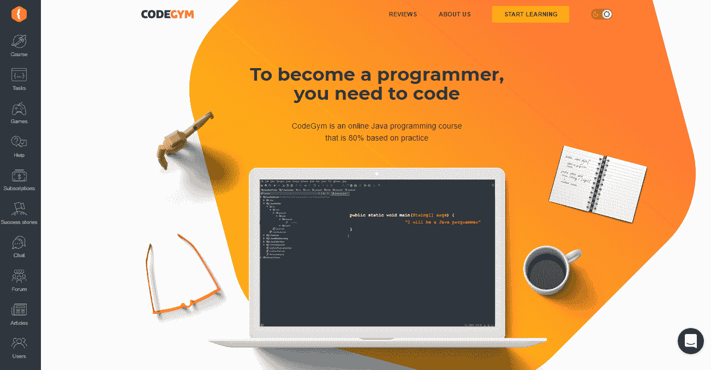
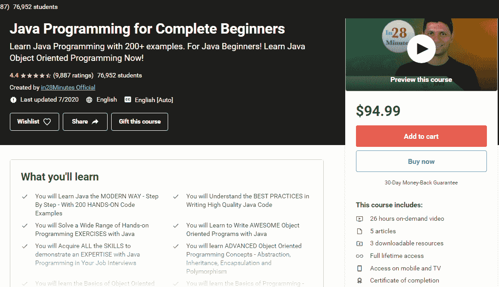
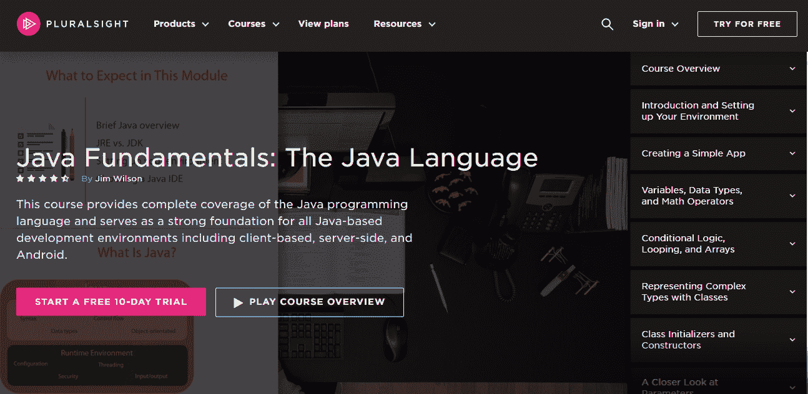
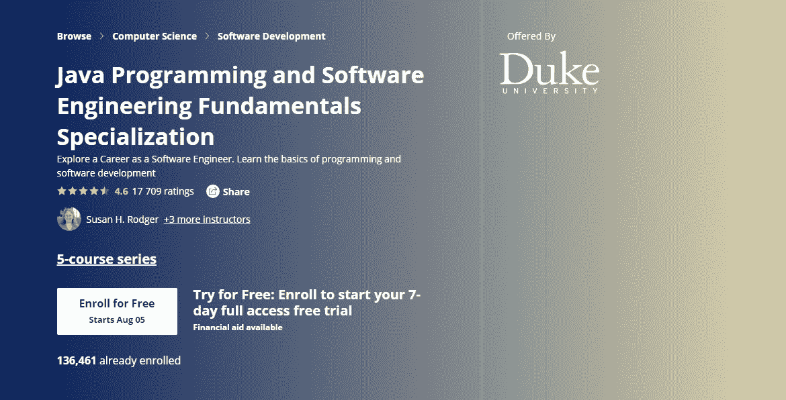

# 2021 年 5 门最适合初学者的 Java 课程

> 原文：<https://medium.com/javarevisited/5-best-beginner-friendly-java-courses-in-2021-e381a65d231f?source=collection_archive---------2----------------------->

尼克·莫里森在 [Unsplash](https://unsplash.com/?utm_source=unsplash&utm_medium=referral&utm_content=creditCopyText) 上拍摄的照片

当您刚开始学习 Java 编程时，您可能不知道从哪里开始。首先，我建议将 80%的注意力放在实践上，剩下的 20%放在理论上，同时结合各种资源，并向社区中更有经验的开发人员寻求帮助。这些只是我马上想到的一些建议。

关于如何[学习使用 Java 编程](/javarevisited/top-10-free-interactive-programming-courses-from-educative-for-beginners-to-learn-in-2021-713cbf96d4eb)的更多有用的建议和最佳实践，请仔细阅读这篇文章。接下来，你会发现我认为最适合新手开发者的最具创新性和互动性的课程。所以，努力吧，磨练你的技能。

# Java 编程初学者:从什么程序开始

当你刚开始自学编码时，一切都显得势不可挡，模糊不清。你很难理解从哪里开始，使用什么资源来获得潜在雇主寻求的技能。这份对初学者友好的最佳在线课程列表旨在减轻你的痛苦，并希望能让一切都各就各位。

# CodeGym

成为一名程序员需要一种全面的方法，不仅包括阅读书籍，甚至主要是编写大量代码以获得更好的结果。这就是 CodeGym 拯救你的地方，它为你带来了成为一名合格的程序员所需要的一切。

它是一个在线学习平台，包括一个核心 Java 课程，侧重于实践，并提供 1200 个日益复杂的实践任务。CodeGym 会让你别无选择，只能写大量的代码来获得你梦寐以求的工作所需的经验。

CodeGym 吸引所有新手的另一个原因是它的游戏化技术使学习变得更加容易和高效。比如可以和机器人 Amigo 学习编程，需要升级的角色。当你正确通过一项任务时，你会获得帮助你升级的分数(它们也是所谓的“暗物质”)。

从我的经验来看，游戏形式让学生保持参与，并鼓励他们继续训练。所以[如果平台](https://codegym.cc)的方法对你有吸引力，就去看看吧。

**支持的平台** : [Web](https://codegym.cc) ， [Android](https://play.google.com/store/apps/details?id=com.hitechrush.codegym&hl=en)

**定价**:免费基础课程，高级课程每月 49 美元，高级专业课程每月 99 美元

**核心特性**:

*   完整的核心 Java 课程
*   帮助您解决任务的即时解决方案验证和提示
*   最初阶段的小而简单的任务，以及后来更复杂的任务和小型项目
*   为初学者和有经验的 Java 学习者提供了广泛的内容选择
*   免费的基本 Java 语法

**主要优势**:

*   方便的移动应用程序，适合经常外出的学习者
*   虚拟导师
*   一个友好的 Java 学习者社区
*   结构良好的培训模块

# 面向软件开发人员的一站式 Java 大师班

这个[深入的在线课程](https://www.udemy.com/course/java-the-complete-java-developer-course/?LSNPUBID=JVFxdTr9V80&ranEAID=JVFxdTr9V80&ranMID=39197&ranSiteID=JVFxdTr9V80-6QCuRnNznf5Y3JgD6i5w8g&utm_medium=udemyads&utm_source=aff-campaign)致力于 Java 编程，给你雇主在招聘 Java 专家时想要的所有必要技能。它已经注册了超过 260，000 名用户，收到了数千条五星评论，这证明了它的质量和在长期停顿后回到 Java 的初学者和开发人员中的受欢迎程度。

该课程包括 80 小时的点播视频，涵盖 Java 基础知识以及中级、高级和可选材料。你没有义务浏览整个程序——它都归结为你计划进行的项目，无论是带有 GUI 或用户界面的桌面应用程序，等等。

**支持的平台** : [Web](https://www.udemy.com/course/java-the-complete-java-developer-course/?LSNPUBID=JVFxdTr9V80&ranEAID=JVFxdTr9V80&ranMID=39197&ranSiteID=JVFxdTr9V80-6QCuRnNznf5Y3JgD6i5w8g&utm_medium=udemyads&utm_source=aff-campaign) ， [Android](https://play.google.com/store/apps/details?id=com.udemy.android&hl=en) ， [iOS](https://apps.apple.com/us/app/udemy-online-video-courses/id562413829)

价格:94.99 美元

**核心特征**:

*   36 个编码练习
*   每个概念后的挑战
*   竣工证明
*   手机和电视接入

**主要优势**

*   35 年经验丰富的讲师，定期添加新的、更新的内容
*   在开始新的讲座之前，讲师会给出反馈和解释
*   关于开发人员用来提高生产力的工具和实践的信息

# Java 编程的 250 个步骤

在考虑了列表上的多种 Java 培训之后，我发现这一个是编程可能有趣和令人兴奋这一概念的一个很好的例证。它是为初学者设计的，使用 JShell 和 Eclipse 的组合作为 IDE。该课程提供了 200 多个练习、难题和代码示例，作为学习编程的最佳方式。在 250 多个步骤中，您将探索核心 Java 特性，从基础到函数式编程和多线程，以及其他重要主题。

除此之外，你还会对一位杰出导师的方法和教学风格感到满意。导师会彻底解释所有的概念，以确保你理解每一行代码的作用。这就是为什么在完成课程后，学生在编写 Java 程序和申请工作时会感到自信。

**支持的平台** : [桌面](https://www.udemy.com/course/java-programming-tutorial-for-beginners/)，[安卓](https://play.google.com/store/apps/details?id=com.udemy.android&hl=en)， [iOS](https://apps.apple.com/us/app/udemy-online-video-courses/id562413829)

**定价**:94.99 美元

**核心特性**:

*   26 小时视频点播
*   5 篇文章
*   解答了 200 多个常见问题的故障排除指南
*   终身访问

**主要优势**

*   将理论、实践和解决方案相结合，实现更有效的培训
*   简短而全面的材料
*   卓越导师的方法
*   零编程经验学生的理想课程
*   循序渐进的学习计划

# Pluralsight 的 Java 基础课程

掌握 Java 语言不仅要了解语法和 API，还要了解软件开发中常见问题的典型解决方案。后者可以大大减少完成项目所需的时间，从而提高生产率和效率。所以，经过长时间的搜索，我终于发现了 Pluralsight 的一个关于设计模式的像样的[程序。](https://www.pluralsight.com/courses/java-fundamentals-language)

该课程对任何以前的编码经验没有任何假设，这使它成为初学者的理想选择。拥有 30 年经验的程序作者 Jim Wilson 将教你开始使用 Java 编程语言所需的一切。您将学习语言结构、错误处理、创建、使用 Java 包等。注册成为 Pluralsight 的会员后，您就可以学习这门课程，或者您也可以注册参加为期 10 天的免费试用，并获得 200 分钟的免费观看时间。

**支持的平台** : [桌面](https://www.udemy.com/course/java-programming-tutorial-for-beginners/)，[安卓](https://play.google.com/store/apps/details?id=com.pluralsight&hl=en)， [iOS](https://apps.apple.com/us/app/pluralsight/id431748264)

**定价**:每月个人计划 19 美元，年度个人计划 159 美元，高级个人计划 239 美元。团队计划也有专业版和企业版。

**核心特性**:

*   互动培训材料
*   8 小时简明课程
*   概念的真实例子
*   Java 语法、构造、[设计模式](/javarevisited/7-best-online-courses-to-learn-object-oriented-design-pattern-in-java-749b6399af59)和用法

**主要优势**:

*   对坚实原则的合理介绍
*   面向实践的作业
*   少量不耗费时间的教程
*   能够在任何依赖 Java 的环境中工作

# 杜克大学 Java 编程基础(Coursera)

这是另一门复杂的 Java 课程，是为努力步入软件工程职业生涯的初学者设计的。杜克大学的专业化将让你对关键的编程概念有更清晰的认识，从函数和条件语句到解决现实世界的问题。您将获得所有必要的工具，用于编写程序和设计算法来测试和调试程序。

这是一个五个系列的讲座，已经有超过 13 万用户注册。涵盖了 JS、 [HTML](/javarevisited/top-10-free-courses-to-learn-html-5-css-3-and-web-development-872d62d97a97) 和 CSS、[新数据结构](/javarevisited/7-best-courses-to-learn-data-structure-and-algorithms-d5379ae2588?source=---------18------------------)的编程基础，软件设计原理，推荐系统等。完成这门课程后，你将能够在软件工程领域找到一份工作。

**支持的平台** : [桌面](https://www.coursera.org/specializations/java-programming)，[安卓](https://play.google.com/store/apps/details?id=org.coursera.android&hl=en_US)， [iOS](https://apps.apple.com/us/app/coursera-learn-new-skills/id736535961)

**定价**:49 美元/月

**核心特性**:

*   解决现实世界问题的基本技能
*   关于设计算法、测试和调试程序的讲座
*   关于各种语言方面的 5 系列课程
*   顶点项目，应用在实践中学到的一切

**主要优势**:

*   以项目为导向的课程，让您在培训过程中建立投资组合
*   其他学员反馈的分级任务
*   能够获得证书并在 LinkedIn 上分享
*   灵活的时间表，以自己的速度掌握 Java 语言

# 包裹

因为 Java 是网络上最受欢迎的编程语言之一，所以未来的 Java 开发人员会获得很多职业机会，并且更有可能受到高度需求。有了 [Java](/javarevisited/10-free-courses-to-learn-java-in-2019-22d1f33a3915) ，你可以创建用户界面、移动应用、游戏和其他项目——可能性是无限的。

但是在你开始之前，你得上一门相应的课程，甚至几门，这取决于你想从事的项目。幸运的是，有许多从头开始学习 Java 的有用资源，从一站式程序到专注于特定 Java 概念的培训。

在这篇文章中，我整理了一些最适合初学者的课程，希望你能找到符合你需求的课程。

如果你曾经尝试过其中的任何一种，请随时与我分享你的想法。