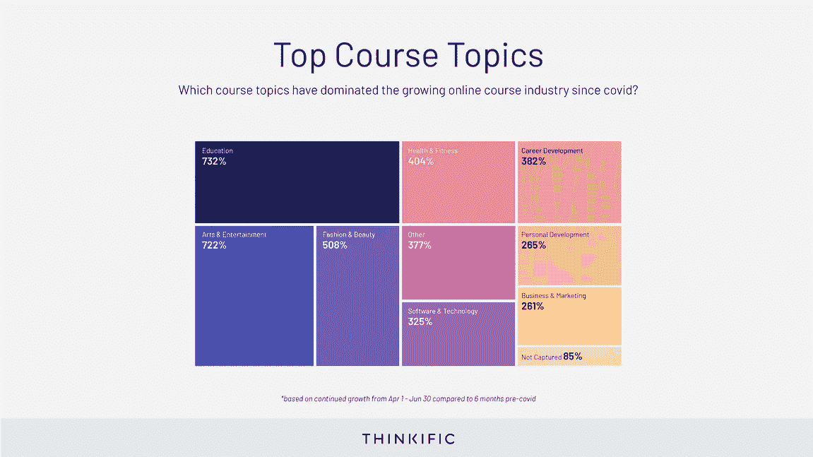
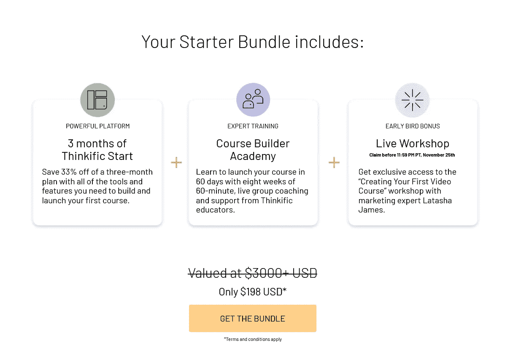

# 内容创作者和课程讲师的 5 个最佳黑色星期五+网络星期一交易

> 原文：<https://medium.com/javarevisited/5-best-black-friday-cyber-monday-deals-for-content-creators-and-course-instructors-ec3ce53c4d16?source=collection_archive---------2----------------------->

## 2023 年想成为内容创作者或者卖在线课程？这里是你能达到目标的最好的黑色星期五和网络星期一交易

image _ Credit—thinkfic

大家好，我一直倡导程序员和开发人员在 2022 年创建既学习又赚钱的在线课程，并一直推荐****[**Podia**](https://podia.sjv.io/c/3294490/1274189/15666?u=https%3A%2F%2Fwww.podia.com%2F)**[**learn world**](https://learnworlds.grsm.io/javarevisited)**和[**teached**](https://teachable.sjv.io/c/1193463/998814/12646)创建他们的在线课程并分享他们的知识。********

****你们中的许多人询问了折扣券和交易，这就是为什么我分享了思维和教学平台的最佳折扣优惠，以在 2022 年创建你们的在线课程业务。****

****在当今世界，没有比开设课程更好的教学方式了，这个疫情已经证明，在不久的将来，电子学习将会继续发展。****

****但是，开设课程说起来容易做起来难，尤其是如果你是一个完美主义者。这涉及到很多事情，比如选择相机、麦克风、 [**在线课程托管** **平台**](https://javarevisited.blogspot.com/2020/03/top-5-websites-to-create-online-courses.html) 、 [**工具**](https://javarevisited.blogspot.com/2019/12/how-to-create-online-courses-for-free.html#axzz6enw6Ycw1) ，以及购买其他装备。如果你想投资在线课程创建工具和平台，那么黑色星期五和网络星期一可能是购买任何东西的最佳时机。****

****有很多优惠飞来飞去，很难选择哪一个选择，哪一个放弃，这就是为什么我创建了这个页面，在这里你可以找到最好的黑色星期五和在线课程创作者和教育工作者的网络星期一交易。****

****这是我的第二个这样的列表，昨天，我发布了程序员的最佳黑色星期五交易，我的读者对此非常高兴。所以，我想为在线课程创作者和教育工作者整理一个类似的列表，毕竟，我也打算在本周出版我的第一本书**寻找编码采访**后，下一步发布我的课程，猜猜我将与[thinkfic](http://try.thinkific.com/javinpaul8817-blackfriday)一起开始我的在线课程业务。****

****我选择 Thinkific 是因为他们提供一流的工具、应用商店、专家培训，并帮助创建和营销你的课程。他们还不定期地举办免费的网络研讨会和免费培训，指导你完成整个过程，除此之外，他们还有一个 [**免费思维计划**](https://try.thinkific.com/javinpaul8817-pricing) 来免费创建你的在线课程，这是最好不过的了。****

# ****2022 年，世界黑色星期五和网络星期一为教师和内容创作者提供了 5 个最好的可教、可思考、可学习的项目****

****在不浪费你更多时间的情况下，这里为在线课程创建者和教育工作者列出了一个最好的黑色星期五和网络星期一交易清单。这些交易将对你的课程创建之旅有很大帮助。****

## ****1.[thinkfic 黑色星期五交易 2022-](http://try.thinkific.com/javinpaul8817-blackfriday)**价值 3824 美元【196 美元(33%折扣)******

****Thinkific 是最受欢迎的创建高质量在线课程的平台之一。如果你想出售课程，并希望完全控制它们，那么你需要把它们放到像 Thinkific 或 Teachable 这样的平台上，这就是这笔交易将帮助你的地方。

这项交易将为您提供创建首个在线课程所需的所有工具。只需花费**198 美元，**您将获得价值**3000 多美元**的限时套餐，其中包含指导您完成课程创建之旅的所有工具和培训。

无论你是初学者还是想将课程提升到更高水平的人，你都将作为一名自信的课程创建者，准备好打造你梦寐以求的在线教育业务，跨入 2022 年。****

****以下是你将在这个充满想象力的黑色星期五套装中得到的东西:****

******1。为期 3 个月的 Thinkific Start(免费)**
为期 3 个月的计划可节省 33%的费用，该计划包含您构建和启动第一门课程所需的所有工具和功能。****

******2。课程建设者学院的专家培训******

****学习在 60 天内启动你的课程，八周 60 分钟的现场小组辅导和来自思维型教育者的支持。简而言之，通过课程建设者学院免费提供 8 周的现场培训。****

******3。现场研讨会**
你可以看到，在 2022 年，你将获得创建你的第一个在线课程所需的一切。我的意思是，这对任何想在 2022 年开设在线课程业务的人来说都是一件大事，相信我，在 11 月 30 日之后，你将不会得到这么多的折扣，所以抓紧时间吧。****

****这里是获得这笔交易的链接— [**领取你的黑色星期五礼包**](https://try.thinkific.com/javinpaul8817-blackfriday2424)****

********

## ****2.[可教的最佳黑色星期五交易(节省高达 35%)](https://teachable.sjv.io/c/1193463/998814/12646)****

****teacheble 是另一个受欢迎的在线平台，如果你喜欢 teacheble，这可能是购买他们年度计划的最佳时机，因为你将节省高达 47%或几乎一半的钱。有了年度可教计划，你可以通过销售在线课程和辅导产品在网上赚钱。

如果你不知道 [Teachable](https://teachable.sjv.io/c/1193463/998814/12646) 是一个知识商务平台，是像我(还有你)这样的创业者值得信赖的商业伙伴！)，也是任何希望将其专业知识转化为利润的人的资源。****

****我喜欢 Teachable 的地方在于，他们去掉了棘手的东西(比如编码和支付处理)，让分享我的知识变得前所未有的容易。功能包括:****

*   ****无限视频带宽****
*   ****无限学生****
*   ****无缝的第三方集成****
*   ****功能强大、易于使用的页面编辑器****
*   ****学生测验和课程完成证书****
*   ****高级定价选项，如订阅和一次性付款****
*   ****全面的报告工具****

****Teachable 还支持[在线辅导](https://teachable.sjv.io/c/1193463/998807/12646)，让你销售和推广一对一辅导、日程安排和吸纳客户，并在一个地方赚钱。

在 Teachable 的黑色星期五促销活动期间加入，你不仅可以节省数百美元，还可以加入其他 10 多万名创作者的行列，他们在该平台上的总收入超过 5 亿美元，教授从编码到水彩画到外语的各种知识。****

****这里是获得可教黑色星期五交易的链接— [**可教黑色星期五折扣**](https://teachable.sjv.io/rnLVgy)****

********

****销售在线课程。提供一对一辅导服务。创建数字下载。无论你选择哪条道路，Teachable 的强大工具将帮助你达到目标。****

## ****3.[Podia](https://podia.sjv.io/c/3294490/1274189/15666?u=https%3A%2F%2Fwww.podia.com%2F)[2022 年最佳 Podia 交易—节省高达 20%]****

****这是在 2022 年托管您的在线课程和创建您的在线课程业务的另一个最佳平台。如果你不知道，Podia 是一个一体化的数字店面，为你提供托管、营销和销售产品所需的一切，如****

*   ****支持课程、网络研讨会、数字下载、在线社区等，****
*   ****不需要第三方应用程序，****
*   ****超级友好，全天候客户支持，****
*   ****价格实惠的计划起价仅为 39 美元/月，交易费用为零，****
*   ****你需要的一切，包括销售网页，文件托管，结帐，电子邮件营销，****
*   ****还有更多。****

****Podia 可以为创作者替换 5+工具，而成本只是它的零头！。毫不奇怪，Podia 也在开展黑色星期五和网络星期一活动，并提供有吸引力的折扣和优惠。****

****如果你一直在考虑将数字产品添加到你的商业计划中，或者将现有产品转移到一个新的平台上，你会想看看 Podia 的这个神奇的 [**黑色星期五-网络星期一交易**](https://www.podia.com/black-friday-cyber-monday-2021?via=javin) 。****

****当您在本周末注册时，您将获得 14 天的免费试用期，并锁定当前计划价格的 10%折扣，并且您将在前两个月节省 50%的费用。这是两个半月的 Podia，仅售 35 美元，因此您可以开始建立您的商店，装载产品，并实现您的梦想！如果你使用我在这篇文章中的链接，你还会得到 10%的额外折扣。****

****作为一个创作者，销售你的产品有助于你现在和将来增加收入。众所周知，问题在于许多产品平台都面临着巨大的挑战——必须拼凑出不完整的解决方案，需要复杂技术技能的工具，或者会占用你很大一部分收入的费用。****

****这就是我喜欢波迪亚的原因。它简单、直观、易于使用。它也很实惠，套餐起价仅为**39 美元/月，没有任何费用。******

******Podia 是一个一体化平台，您可以使用它来运营您的整个业务，从托管您的网站和产品到收集电子邮件地址、发送时事通讯和点滴、收款、举办网络研讨会，甚至托管在线社区。******

******如果你正在考虑转换平台，你不想错过这个开始的机会。立即注册，优惠有效期从美国东部时间黑色星期五(11/26)上午 12:00 到网络星期一东部时间晚上 11:59(11/29)******

******以下是获得折扣的链接— [**在 Podia 享受两个月五折优惠**](https://www.podia.com/black-friday-cyber-monday-2021?via=javin)******

********

## ****4.[learn world 黑色星期五优惠[37%]](https://learnworlds.grsm.io/javarevisited)****

****如果你正在寻找一个除了 Thinkific 或 Teachable 之外的工具来创建你的在线课程网站，那么[learn world](https://learnworlds.grsm.io/javarevisited)是另一个很好的选择，因为 learn world 拥有数字企业家所需的一切，是一个一体化的在线课程平台。****

****它具有丰富的课程创建功能，允许您构建交互式内容、内置社区、深入的学习者和课程分析、实时会话、销售在线课程的关键推广工具以及原生移动应用程序。****

****learn world 为您提供全程指导。凭借其强大的网站生成器，您可以定制高级网页设计，帮助您提高品牌知名度。该平台允许您创造独特的学习体验，将教师和学习者的需求放在第一位。****

*****他们还提供了一个伟大的黑色星期五交易，你可以获得他们的付费计划 37%的折扣*****

******这里是了解更多信息并获得折扣的链接** — [了解世界[37%折扣]](https://learnworlds.grsm.io/javarevisited)****

********

****你也可以在这里试用 LearnWorlds。认领你的 [***免费 30 天试用***](https://learnworlds.grsm.io/javarevisited) 现在和****

**** [## 主页

### 创建、销售和推广您的在线课程的最佳在线课程平台。开始将你的技能货币化…

learn world . grsm . io](https://learnworlds.grsm.io/javarevisited) 

以上就是课程创造者的**最佳黑色星期五交易**。我建议你买一个，为明年的在线课程做准备。创建一个在线课程并不容易，但从长远来看，它的回报是巨大的，你也有机会学习和建立你的听众。

如果你有任何关于 Podia、Thinkific、LearnWorlds 或 Teachable 的问题，请告诉我——我很乐意帮忙！

顺便说一句，你可能注意到我只分享了 4 个黑色星期五交易，而不是 5 个，等着瞧吧，更多的黑色星期五交易即将到来，但我只会分享最好的交易，所以请放心，你将在 2023 年开始你的在线课程业务。

您可能喜欢的其他**在线课程文章**

*   [**7 步推出自己赚钱的在线课程**](https://teachable.sjv.io/c/1193463/1014938/12646)
*   [为什么每个开发者都应该创建在线课程](https://javarevisited.blogspot.com/2019/06/why-programmers-should-create-and-sell.html#axzz5zt6Ca1vv)
*   可教的、有思想的还是无意义的——哪一个是课程创作者的最佳平台？
*   [学习如何创建在线课程的前 5 门课程](https://javarevisited.blogspot.com/2019/12/top-5-courses-to-learn-how-to-create-online-courses.html)
*   [创建最畅销在线课程的 5 种资源](https://javarevisited.blogspot.com/2019/12/top-5-courses-to-learn-how-to-create-online-courses.html)
*   [学习如何在 10 分钟内创建在线课程](https://javarevisited.blogspot.com/2019/12/how-to-create-online-courses-for-free.html)
*   [创建和销售课程的 5 个最佳网站](https://javarevisited.blogspot.com/2020/03/top-5-websites-to-create-online-courses.html)
*   [创建在线课程作为副业的 10 个理由](https://javarevisited.blogspot.com/2020/03/10-reasons-to-create-online-courses.html)
*   [2022 react . js 开发者路线图](https://javarevisited.blogspot.com/2018/10/the-2018-react-developer-roadmap.html)
*   [十大程序员多元化课程和认证](https://javarevisited.blogspot.com/2017/12/top-10-pluralsight-courses-java-and-web-developers.html)
*   [2022 年 Java 开发人员应该学会的 10 件事](https://javarevisited.blogspot.com/2017/12/10-things-java-programmers-should-learn.html#axzz5atl0BngO)
*   [5 个课程创作者最佳在线教学平台](https://hackernoon.com/5-online-teaching-and-coaching-platforms-for-course-creators-and-bloggers-3lfj302n)

感谢您阅读本文。如果你发现这些**在线课程创建者和内容创建者的最佳黑色星期五和网络星期一交易，**特别是可教的和有思想的黑色星期五交易是最好的交易，请与你的朋友和同事分享。

如果您有任何问题或反馈，或者在创建在线课程、销售或营销方面面临任何问题，请在下面留言，我们将尽力回答您的问题。

**附言——**如果你只是想做一件事， [**在 thinkfic**](http://try.thinkific.com/javinpaul8817)上启动你的在线课程网站，你可以用更少的成本和更多的支持来完成，使用[*thinkfic 黑色星期五启动包*](http://try.thinkific.com/javinpaul8817) ，相信我你不会后悔这个决定，以后再感谢我吧。

 [## 黑色星期五套餐

### 将您的疑虑转化为决心，三个月 Thinkific Start 优惠 33%——我们的计划专为帮助……

try.thinkific.com](http://try.thinkific.com/javinpaul8817)****