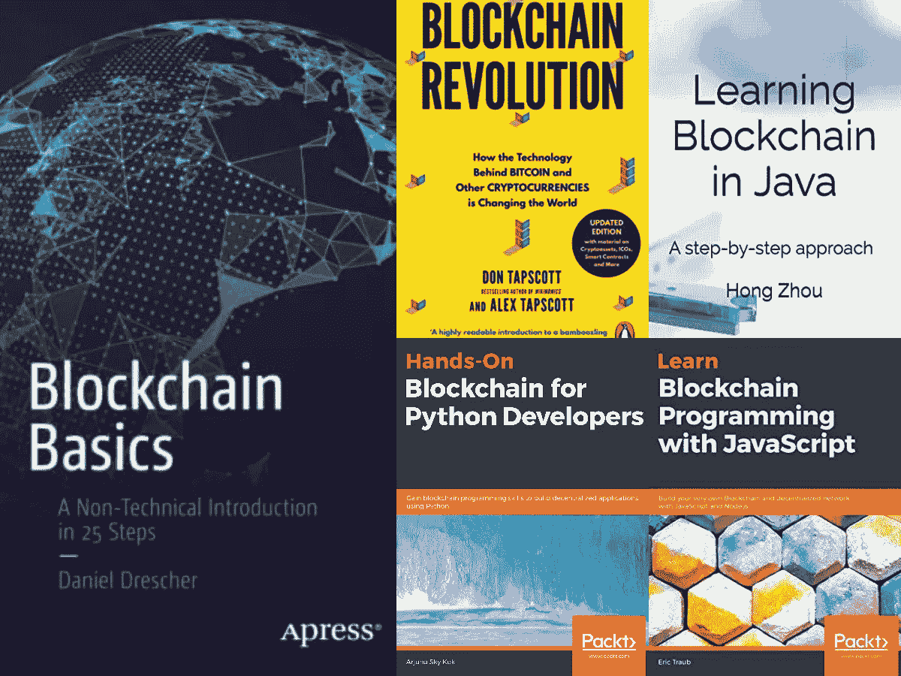
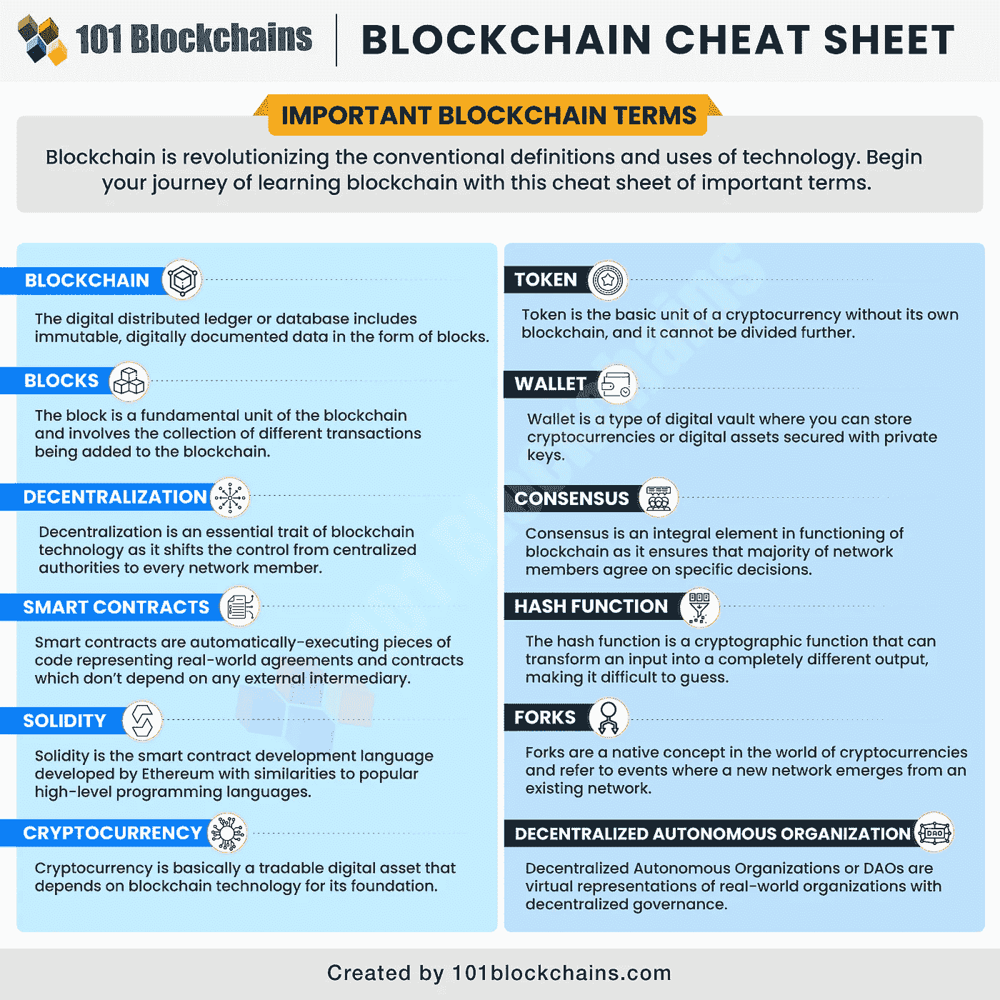
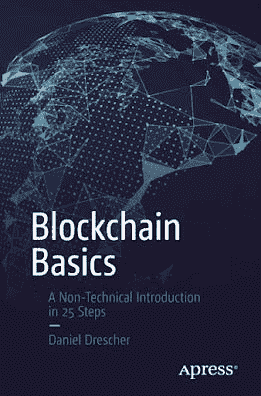
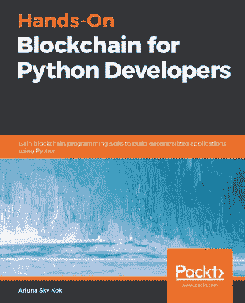
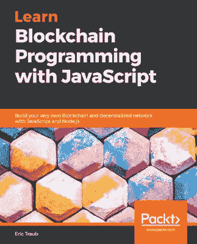
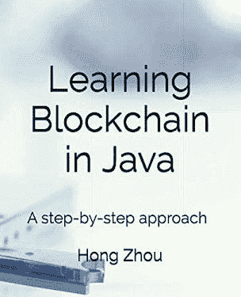

# 2023 年新手和有经验开发者的 5 本最佳区块链书籍

> 原文：<https://medium.com/javarevisited/5-best-blockchain-books-for-beginners-and-experienced-developer-984194f517b?source=collection_archive---------0----------------------->

## 我最喜欢的书学习区块链技术，成为区块链开发者和架构师。

大家好，如果你正在寻找 2023 年学习区块链技术的最佳书籍，那么你来对地方了。之前我已经分享过 [**最好的区块链课程**](/javarevisited/best-blockchain-courses-and-certification-in-2020-63729f8f04d0)[认证](https://javarevisited.blogspot.com/2022/01/5-best-blockchain-certifications-and.html)，[学习区块链最好的网站](https://www.java67.com/2020/07/top-5-websites-to-learn-blockchain-in.html)今天我就分享学习区块链最好的书籍。

虽然在线课程是学习区块链等新技术的更简单的方法，但它们无法取代书籍，书籍是深入学习区块链的更准确和全面的资源。

我通常从一门课程开始，然后转向阅读书籍，深入学习任何新技术，区块链也不例外。从这些[免费区块链课程](/javarevisited/7-free-courses-to-learn-blockchain-in-2020-764e66b47ebe)中学习基础知识后，我加入了一个像[认证区块链开发者](https://www.shareasale.com/r.cfm?b=1713885&u=880419&m=105464&urllink=&afftrack=)的区块链认证，从 101 区块链转移到书本上深入学习题目

顺便说一句，如果你是区块链新手，在阅读这些书籍之前先从什么是区块链开始是有意义的。几年前，有一项技术问世，它带来了巨大的好处，可以触及几乎每个行业，从银行交易到消息应用程序，保护您的系统以及互联网广告等等。

你可能猜到了。嗯，它叫区块链！

区块链基本上是一个复杂的系统，它以一种其他人几乎不可能入侵和欺骗这个系统的形式记录信息，它包含一个被称为 DLT 的分布式账本([分布式账本技术](https://javarevisited.blogspot.com/2022/02/top-5-courses-to-learn-hyperledger-blockchain.html))，它允许数据存储在世界各地数以千计的远程服务器上。

现在，如果你是一名程序员，你想学习区块链，可能是为了创建你自己的区块链系统，或者只是好奇想了解更多关于这项技术的知识，我强烈建议你阅读这些书籍中的一本，它们肯定会丰富你关于这项技术的知识。

顺便说一下，如果你正在寻找一个区块链认证来开始你的区块链技术生涯，那么没有什么比 1011 区块链学院的 [**认证企业区块链专业人员**](https://www.shareasale.com/r.cfm?b=1713885&u=880419&m=105464&urllink=&afftrack=) 更好的了。我在互联网上参加了多个区块链课程，这个课程是最全面、最新的，也充满了现实生活中的例子。我强烈推荐这个给每一个想以课程或认证开始区块链生涯的人。

这里还有一个**好看的区块链小抄**从他们那里了解并记住重要的区块链术语:

图片 _ 信用—区块链 101

# 2023 年学习区块链技术的 5 本最佳书籍

在不浪费你时间的情况下，这里有一份最佳书籍清单，你可以阅读这些书籍来深入学习区块链，并在 2023 年成为区块链开发者。该列表包括初学者和有经验水平书籍，从零开始学习区块链技术。

## 1.[区块链革命](https://www.amazon.com/Blockchain-Revolution-Technology-Cryptocurrencies-Changing/dp/1101980141/?tag=javamysqlanta-20)

这本区块链革命是亚马逊上学习这项技术的最佳书籍之一，由畅销书作家唐·塔斯考特和区块链专家亚历克斯·泰普斯科特创作，这本书在 kindle 上的售价约为 11.40 美元。

您将学习区块链的设计原则，如网络完整性、分布式电源、安全性、隐私等。此外，您将看到区块链对证券交易所等金融服务的影响，以及它对计算和物联网的影响。

最后，你会看到经济包容性和企业家精神将因区块链而改变。如果你愿意，也可以把这本书和 Coursera 的 [**区块链专精**](https://coursera.pxf.io/c/3294490/1164545/14726?u=https%3A%2F%2Fwww.coursera.org%2Fspecializations%2Fblockchain) 结合起来快速学习。这个 Coursera 课程将帮助你快速上手，通过阅读和观看，你一定会学得更好，你还将获得 Coursera 的区块链认证，以添加到你的个人资料中。

## 2.[区块链基础知识](https://www.amazon.com/Blockchain-Basics-Non-Technical-Introduction-Steps/dp/1484226038/?tag=javamysqlanta-20)

凭借在亚马逊上的第一畅销标志，这本关于区块链的书将帮助非技术人员了解和学习什么是区块链，它是如何工作的，以及它可以应用在哪里。这本书由银行业专业人士丹尼尔·德雷舍创作，kindle 售价 15.74 美元。

这本书是理论性的，目标是这项技术的初学者，讨论了区块链的基础，例如区块链是什么，它可以在哪里应用来解决人们的问题，以及为什么世界如此兴奋地将这项技术纳入他们的日常生活。

然后你会看到一些技术内容，如区块链如何工作及其局限性等，如果你正在寻找一个积极的学习伙伴，那么 Udemy 上的 [**区块链 A-Z:学习如何构建你的第一个区块链**](https://click.linksynergy.com/deeplink?id=JVFxdTr9V80&mid=39197&murl=https%3A%2F%2Fwww.udemy.com%2Fcourse%2Fbuild-your-blockchain-az%2F) 课程是这本书的好伙伴。你将在阅读区块链概念的同时获得动手实践。

## 3.[Python 开发者手把手的区块链](https://www.amazon.com/Hands-Blockchain-Python-Developers-decentralized-ebook/dp/B07NSRVNK3/?tag=javamysqlanta-20)

你已经看到的前两本书是谈论区块链革命的理论书籍，但是如果你是一名 python 开发者，并且想要实践经验来创建你自己的[区块链技术](/javarevisited/7-best-places-to-learn-blockchain-technology-online-for-free-89cfbeab669a)，那么你可能需要在亚马逊上看到这本书，在 kindle 上售价约为 22.39 美元。

你将从了解区块链技术和比特币的价值开始。然后，您将开始实践课程，学习智能联系人基础知识，并使用 python 语言实现它们。

您还将学习 populous，这是以太坊区块链的智能合约框架，并为这种货币和更多货币创建钱包。你也可以将这本书与 [**Solidity、以太坊、区块链:开发者完全指南**](https://academy.zerotomastery.io/a/aff_bt7chn53/external?affcode==441520_zytgk2dn) 结合起来，了解更多其他流行的区块链网络，以及使用 Solidity 的区块链开发。

## 4.[用 JavaScript 学习区块链编程](https://www.amazon.com/Learn-Blockchain-Programming-JavaScript-decentralized-ebook/dp/B07KW53HY4/?tag=javamysqlanta-20)

构建区块链可以使用多种语言完成，不仅仅是 python，本书将讨论如何使用 JavaScript 语言为自己创建一个。这本书由作者埃里克·特劳布创作，在 kindle 上售价约为 19.79 美元。

在开始创建区块链环境之前，您将像往常一样深入学习这项技术。然后你将从头开始创建你的第一个分散的区块链网络。

您还将学习工作证明和哈希算法，创建事务，将事务存储在块中，以及许多其他主题，如果您需要本书的配套课程，那么 Udemy 的 [**通过用 JavaScript**](https://click.linksynergy.com/deeplink?id=JVFxdTr9V80&mid=39197&murl=https%3A%2F%2Fwww.udemy.com%2Fcourse%2Fbuild-a-blockchain-in-javascript%2F) 构建自己的学习区块链课程是一个不错的选择。

通过阅读本书和观看本课程，你将更快更好地学习 JavaScript 的区块链，你也不会因为坚持阅读本书而感到无聊。

## 5.[用 Java 学习区块链](https://www.amazon.com/Learning-Blockchain-Java-step-step/dp/1795002158/?tag=javamysqlanta-20)

这本书非常适合那些至少有一些 Java 语言编程知识的技术人员，他们希望学习如何创建由作者周红博士创建的区块链技术，作为一本真正的书花费 16.98 美元。

你将首先了解什么是区块链，以便对你将要建造的东西有所了解。然后，您将看到挖掘块和安全散列算法、事务、加密、网络、网络消息传递、分布式区块链系统等等。

也可以把这本书和 Udemy 上的 [**学习区块链技术&Cryptocurrency in Java**](https://click.linksynergy.com/deeplink?id=JVFxdTr9V80&mid=39197&murl=https%3A%2F%2Fwww.udemy.com%2Fcourse%2Flearn-blockchain-technology-in-java%2F)课程结合起来。这是一个很好的课程，可以获得用 Java 开发区块链的实践经验，因为您将学习如何用 Java 从头开始实现自己的区块链和加密货币。

以上就是 2023 年**初学者学习区块链的最佳书籍**。这些几乎是学习区块链技术的最佳书籍，无论您是非技术人员，只想了解区块链如何工作，以及它如何在您的业务和日常生活中帮助您，或者您有兴趣创建和开发更多这种技术，使其更加可靠和安全。

您可能喜欢的其他**区块链和技术文章**

*   [开发者的 10 门最佳区块链课程](/javarevisited/best-blockchain-courses-and-certification-in-2020-63729f8f04d0)
*   [回顾——来自 101 区块链的区块链开发者认证值得吗？](https://javarevisited.blogspot.com/2022/05/review-is-certified-enterprise-blockchain-professional-certification-worth.html)
*   [初学者学习 NFT 的 5 大课程](https://javarevisited.blogspot.com/2021/12/top-5-courses-to-learn-about-nfts-non.html)
*   [我最喜欢的学习以太坊的在线课程](https://javarevisited.blogspot.com/2021/11/top-5-courses-to-learn-ethereum-for.html)
*   [学习 Solidity 编程语言的 5 门最佳课程](https://javarevisited.blogspot.com/2022/01/top-5-courses-to-learn-solidity-for.html)
*   [学习数据科学表格的前 5 门课程](https://javarevisited.blogspot.com/2019/07/top-5-tableau-online-courses-and-certifications-for-data-science-engineers.html)
*   [我最喜欢的学习加密和比特币的课程](https://javarevisited.blogspot.com/2022/01/5-best-courses-to-learn-cryptocurrency.html)
*   [学习机器学习的 5 大免费课程](https://www.java67.com/2019/01/5-free-courses-to-learn-machine-and-deep-learning-in-2019.html)
*   [面向程序员的 10 门机器学习和深度学习课程](https://hackernoon.com/top-5-courses-to-learn-python-in-2018-best-of-lot-26644a99e7ec)
*   [2023 年学习 Python 的 10 个理由](https://hackernoon.com/10-reasons-to-learn-python-in-2018-f473dc35e2ee)
*   [初学者学习 Python 的 10 门免费课程](https://hackernoon.com/10-free-python-programming-courses-for-beginners-to-learn-online-38312f3b9912)
*   [学习数据科学 Python 的 5 本书](https://javarevisited.blogspot.com/2019/08/top-5-python-books-for-data-science-and-machine-learning.html)
*   [学习高级数据科学的前 5 门课程](https://hackernoon.com/top-5-data-science-and-machine-learning-course-for-programmers-e724cfb9940a)
*   [初学者学习 TensorFlow 的 5 大课程](https://hackernoon.com/top-5-tensorflow-and-ml-courses-for-programmers-8b30111cad2c)
*   [2023 年学习区块链的 7 门免费课程](/javarevisited/7-free-courses-to-learn-blockchain-in-2020-764e66b47ebe)

感谢您阅读本文。如果你喜欢这些学习区块链技术的最佳书籍，那么如果你觉得它们有用，请与你的朋友和同事分享。如果您有任何问题或反馈，请留言。

**P. S.** —如果你认真学习区块链技术并寻找最好的区块链认证开始，那么 1011 区块链学院的 [**认证企业区块链专业人士**](https://www.shareasale.com/r.cfm?b=1713885&u=880419&m=105464&urllink=&afftrack=) **是**最好的开始资源。我的许多学生和读者都选了这门课，反馈非常好。

<https://javarevisited.blogspot.com/2022/01/5-best-blockchain-certifications-and.html> 