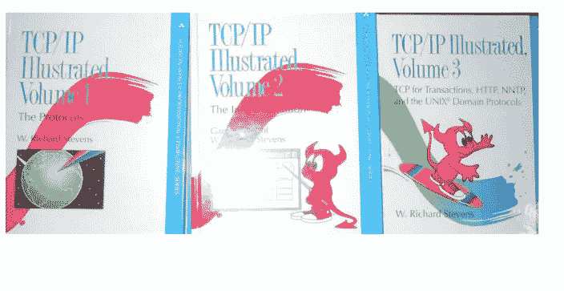
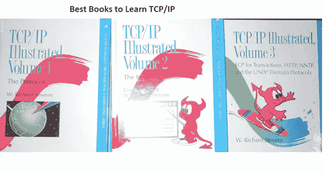
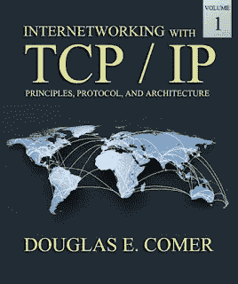
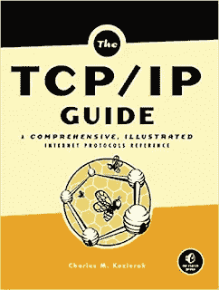
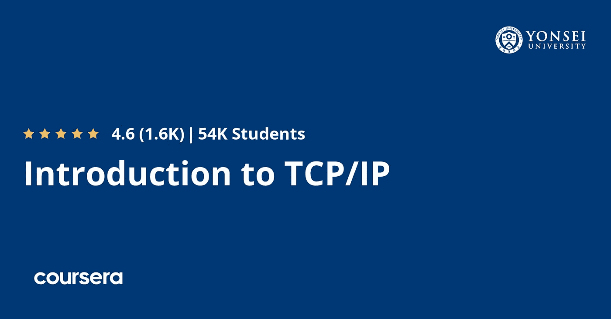

# 学习计算机网络、TCP/IP 和 UDP 协议的 7 本最佳书籍和课程

> 原文：<https://medium.com/javarevisited/5-best-books-and-courses-to-learn-computer-networking-tcp-ip-and-udp-protocols-5a0e4dce75fa?source=collection_archive---------0----------------------->

## 这些是我最喜欢的电子书，学习基本的计算机网络协议，如 TCP/IP，UDP 等。

大家好，如果你想了解计算机网络基础知识和基本的计算机网络协议，如 TCP/IP 和 UDP，并寻找资源，那么你来对地方了。

早些时候，我已经分享了 [**最佳计算机科学课程**](/javarevisited/8-best-computer-science-courses-for-beginners-to-learn-online-696379aa4e96) 和 [**学习操作系统的最佳课程**](/javarevisited/6-best-operating-system-courses-for-beginners-to-learn-7d727882d267) ，在本文中，我将分享您可以阅读的学习计算机网络基础和协议，特别是 TCP/IP 和 UDP 的最佳书籍。

TCP/IP 和 UDP 都是非常流行的网络协议，在这个互联网和互联世界的时代，它们变得更加重要。

不管你是计算机科学毕业生还是计算机科学硕士、软件工程师、网络工程师还是 Java 程序员，良好的 TCP/IP 和 UDP 知识对获得工作并做好工作大有帮助。

尽管我面试的大多是 Java 程序员，但我几乎总是会问几个关于 TCP/IP 和 UDP 协议的问题，以检查候选人是否熟悉计算机网络基础知识，因为即使你为 Java 应用程序工作，你也会接触到网络。

在分布式架构中，运行在不同上的多个进程相互协作，大多数应用程序使用 TCP/IP 和 UDP 连接到其他应用程序。

许多人使用[多播](http://javarevisited.blogspot.sg/2014/08/socket-programming-networking-interview-questions-answers-Java.html)进行快速消息传递，如果候选人不熟悉这样一个基本而重要的概念，他将无法理解内部发生了什么，也无法进行故障排除或提供适当的支持。

在这篇文章中，我将分享几本来自 [Coursera](/javarevisited/top-15-free-coursera-courses-and-certifications-for-it-professionals-384207d56f45) 和 [Udemy](/javarevisited/100-free-programming-and-web-development-courses-on-udemy-free-resource-center-3f8415eb5e6f?source=collection_home---4------3-----------------------) 的学习 TCP/IP 和 UDP 协议的好书和在线课程。这些书籍和课程不仅可以帮助您学习 TCP/IP、UDP 和其他网络协议的基础知识，还可以帮助您了解它们的内部工作原理。这些知识对于在您的应用程序中有效地使用这些协议以及设计可靠和健壮的分布式应用程序非常重要。

# 5 本最佳 TCP/IP 和计算机网络书籍和课程，适合初学者和有经验者

TCP/IP 和 UDP 等基本计算机网络协议的良好知识也将在编程工作面试中对你有所帮助，因为 TCP/IP 是一个非常受欢迎的话题，像 TCP 和 UDP 之间的区别这样的问题非常受欢迎。

很多程序员只知道 TCP 是面向连接的，UDP 是无连接的，但并没有真正理解它们背后的含义和它们的后果像排序和可靠交付是如何附加在上面的？

组播如何利用 UDP，如果客户端停止消费消息但是服务器一直发送 Nagle 的算法，各种 TCP 选项会怎么样？这些书和在线课程会给你回答所有这些问题所需的知识。

## 1.[计算机网络的点点滴滴](https://coursera.pxf.io/c/3294490/1164545/14726?u=https%3A%2F%2Fwww.coursera.org%2Flearn%2Fcomputer-networking)【谷歌教程】

这门在线课程是从计算机网络开始的绝佳资源。它是由谷歌提供的，可以在 Coursera 上加入。

它也是 Coursera 著名的 [**谷歌 It 支持专业证书**](https://coursera.pxf.io/c/3294490/1164545/14726?u=https%3A%2F%2Fwww.coursera.org%2Fprofessional-certificates%2Fgoogle-it-support) 的一部分，超过 90 万人参加该证书开始他们的 IT 职业生涯。

本课程旨在提供计算机网络的全面概述。我们将涵盖一切，从现代网络技术和协议的基础到云的概述，再到实际应用和网络故障排除

以下是您将在本课程中学到的关键技能:

1.  就五层模型而言，什么是计算机网络
2.  TCP/IP 通信涉及哪些标准协议
3.  了解强大的网络故障排除工具和技术
4.  了解有助于计算机网络运行的网络服务，如 DNS 和 DHCP
5.  了解云计算、一切即服务和云存储

总的来说，这是一门学习计算机网络基础知识和基本计算机网络协议的入门课程。我向每个软件工程师、开发人员、开发人员和 IT 专业人员强烈推荐这门课程。

**这里是加入本课程**——[计算机网络的比特与字节](https://coursera.pxf.io/c/3294490/1164545/14726?u=https%3A%2F%2Fwww.coursera.org%2Flearn%2Fcomputer-networking)的链接

顺便说一句，如果你计划参加多个 Coursera 课程或专业，那么考虑参加[**Coursera Plus 订阅**](https://coursera.pxf.io/c/3294490/1164545/14726?u=https%3A%2F%2Fwww.coursera.org%2Fcourseraplus) ，它为你提供无限制的访问他们最受欢迎的课程、专业、专业证书和指导项目的机会。

 [## Coursera Plus |无限制访问 7，000 多门在线课程

### 用 Coursera Plus 投资你的职业目标。无限制访问 90%以上的课程、项目…

coursera.pxf.io](https://coursera.pxf.io/c/3294490/1164545/14726?u=https%3A%2F%2Fwww.coursera.org%2Fcourseraplus) 

## 2. [TCP/IP 图解](https://www.amazon.com/TCP-Illustrated-Vol-Addison-Wesley-Professional/dp/0201633469/?tag=javamysqlanta-20)

这是关于 TCP/IP 协议的三本书系列，作者是 W. Richard Stevens。到目前为止，我已经阅读了 TCP/IP 图解第一卷:协议和 TCP/IP 图解第二卷:实现。

本系列可能是您需要完全理解 TCP/IP 协议内部工作原理的唯一系列书籍。也是最全面的 TCP/IP 协议指南。

所有的基础知识都喜欢**为什么 TCP/IP 是面向连接的协议？**可靠和有序意味着什么，什么是三次握手，以及 TCP 如何确保消息的传递，这些都在本书中有很好的阐述。

你们中的一些人可能会觉得这本书有点无聊，就像[算法介绍](http://www.amazon.com/dp/0072970545/?tag=javamysqlanta-20)但是一旦你开始理解，你就会喜欢这本书。我经常用这本书作为参考书。

正如我所说，这是一个 3 本书的系列，其中**卷 1** 侧重于协议，而**卷 2** 侧重于 TCP/IP 的实现，第三本也是最后一本书通过解释 HTTP(基于 TCP、NNTP 和 UNIX 域协议的最常用协议)涵盖了事务的 TCP

如果你需要一些主动学习的在线课程，你也可以在 Udemy 上查看马克·尼尔森的 [**学习 TCP/IP——计算机网络基础**](https://click.linksynergy.com/deeplink?id=JVFxdTr9V80&mid=39197&murl=https%3A%2F%2Fwww.udemy.com%2Fcourse%2Flearn-tcpip-computer-networking-fundamentals%2F) 课程。它很好地补充了这本书，将必要的信息压缩到 2 小时的课程中。

 [## 学习 TCP/IP -计算机网络基础知识

### 我拥有计算机科学(IT)硕士学位，通过多年的学习，我了解到…

udemy.com](https://click.linksynergy.com/deeplink?id=JVFxdTr9V80&mid=39197&murl=https%3A%2F%2Fwww.udemy.com%2Fcourse%2Flearn-tcpip-computer-networking-fundamentals%2F) 

## 3.[与 TCP/IP 的网络互联](https://www.amazon.com/Internetworking-TCP-IP-One-6th/dp/013608530X?tag=javamysqlanta-20)

这是另一本学习 TCP/IP、UDP 和其他计算机网络协议的好书。也是学习 TCP/IP 和计算机网络基础知识最值得推荐的书籍之一。

这是全世界许多计算机网络课程的必读材料。如果你孤立地阅读，有些人会觉得很无聊，但是如果你正在学习一门关于计算机网络的课程，Douglas E. Comer 的《TCP/IP 网络》第一卷(第六版)可能是一本很好的教科书。

## 4.****【课程】**软件工程师计算机网络探索**

**顺便说一句，如果你真的想详细地学习计算机网络，并且需要一个互动的平台，那么我也建议你去看看 Educative 的 [**为软件工程师寻找计算机网络**](https://www.educative.io/courses/grokking-computer-networking?affiliate_id=5073518643380224) 课程，这是一个基于文本的互动平台，学习软件开发和计算机科学技能。**

**本交互式计算机网络课程将教授您网络的基础知识、Python 中的套接字编程、命令行工具以及各层的主要协议。**

**您不仅将获得套接字编程的实践经验，还将获得实现需要分布式处理的网络协议的实践经验。加入我们，深入了解与网络相关的一切。**

**以下是加入本课程的链接— [**为软件工程师探索计算机网络**](https://www.educative.io/courses/grokking-computer-networking?affiliate_id=5073518643380224)**

** [## 软件工程师的计算机网络探索——交互式学习

### 今天开发应用程序的方式要求软件工程师对客户机-服务器有一个牢固的理解…

www.educative.io](https://www.educative.io/courses/grokking-computer-networking?affiliate_id=5073518643380224) 

顺便说一句，你可以单独参加这个课程，也可以参加 [**教育订阅**](https://www.educative.io/subscription?affiliate_id=5073518643380224) (推荐)来访问他们的 250 多个高质量、基于文本的交互式课程，以学习编码面试、软件开发和技术的关键技能。

 [## 教育无限:保持领先

### 我们听到了您的反馈。你现在只需支付一次费用，就可以获得 Educative 上的所有课程。

www.educative.io](https://www.educative.io/subscription?affiliate_id=5073518643380224) 

## 5.[《TCP/IP 指南》:全面、图文并茂的互联网协议参考](https://www.amazon.com/TCP-Guide-Comprehensive-Illustrated-Protocols/dp/159327047X/?tag=javamysqlanta-20)

这是我最喜欢的，也可能是详细学习 TCP/IP 最好的一本书。甚至在阅读这本书之前，我在工作中已经熟悉了 TCP 和 UDP，但是这本书中给出的大量细节使我的知识相形见绌。感觉我在看这本书之前只了解了大概 1%的 TCP/IP。这本书最精彩的部分是插图和图表，让你很容易理解 TCP/IP 协议的内部工作原理。我的图书馆里有一本硬拷贝的《TCP/IP Guide: A Comprehensive，Illustrated Internet Protocols Reference》第一版，作者是 Charles M. Kozierok，我的智能手机上有电子书，每当我需要了解 TCP/IP、UDP 或 ICMP 等其他基本计算机网络协议时，我都会参考这本书。

它对在 It 和计算机网络领域工作的专业人员以及世界各地正在攻读计算机网络课程的毕业生和硕士研究生都很有用。

## 7.延世大学【Coursera】TCP/IP 课程简介

而且，如果你需要一门课程来结合这本书，我强烈推荐你加入 Coursera 上延世大学的**I**[**n TCP/IP 入门课程**](https://coursera.pxf.io/c/3294490/1164545/14726?u=https%3A%2F%2Fwww.coursera.org%2Flearn%2Ftcpip) 。这个长达 8 小时的课程是获得 TCP/IP 协议实践经验的绝佳资源。

您不仅将学习 IPv4、IPv6、TCP、UDP、寻址、路由、域名等互联网技术的操作功能，以及您的 PC/笔记本电脑的安全和网关互联网设置和基本原理，而且您还将通过一个简单的 Wireshark 实验来了解为您的 PC/笔记本电脑提供服务的 TCP/IP 数据包和安全系统。

以下是加入本课程的链接—[**TCP/IP 介绍课程**](https://coursera.pxf.io/c/3294490/1164545/14726?u=https%3A%2F%2Fwww.coursera.org%2Flearn%2Ftcpip)

以上是关于理解 TCP/IP 和 UDP 协议的一些最好的书籍和在线课程。这些书对任何对互联网和网络内部细节感兴趣的人都有好处，因为 TCP/IP 是一切的支柱。

对于任何攻读学士或硕士学位的计算机科学学生来说，它们也是很好的教科书和在线课程。

如果你是一名做应用程序编程的软件工程师或程序员，过去没有太多接触计算机网络的经历，这些书籍和课程会给你所有关于 TCP/IP 和 UDP 的必备知识。

其他**书籍和课程** **推荐**由我为好奇的程序员

*   [严肃程序员的 10 本算法书](http://www.java67.com/2015/09/top-10-algorithm-books-every-programmer-read-learn.html)
*   [每个程序员都应该读的 5 本书](http://www.java67.com/2016/02/5-books-to-improve-coding-skills-of.html)
*   每个程序员都应该阅读的 5 本 SQL 书籍
*   [12 本高级 Java 编程书籍—第一和第二部分](http://www.java67.com/2017/01/12-advanced-java-programming-books-for-experienced-programmers.html)
*   [编程/编码面试的前 5 本书](http://javarevisited.blogspot.sg/2016/06/top-5-books-for-programming-coding-interviews-best.html)
*   [每个软件工程师都应该读的 10 本书](http://java67.blogspot.com/2015/09/top-10-algorithm-books-every-programmer-read-learn.html)
*   【Java 程序员学习 UML 的 3 本必备书籍
*   [准备春季认证的 3 本书](http://www.java67.com/2017/07/3-spring-certification-books-best-of.html)
*   [准备技术编程/编码面试的 10 本书](http://www.java67.com/2017/06/10-books-to-prepare-technical-coding-job-interviews.html)
*   [排名前五的 Java 和 Android 游戏编程书籍](http://javarevisited.blogspot.sg/2017/06/top-5-java-and-android-game-programming-books.html)
*   [十大免费 Java 编程书籍和 PDF](http://javarevisited.blogspot.sg/2017/05/top-10-free-java-programming-books-ebooks-pdf.html)
*   [过去 5 年排名前 10 的 Java 书籍](http://javarevisited.blogspot.sg/2017/04/top-10-java-books-of-last-5-years-for-experienced-java-Programmers.html)
*   [学习面向对象编程的前 5 本书](http://javarevisited.blogspot.sg/2017/04/top-5-books-to-learn-object-oriented-programming.html)

感谢您阅读本文，如果您喜欢这些最好的 TCP/IP 和计算机网络书籍和在线课程，请与您的朋友和同事分享。如果你有任何学习 TCP/IP 和其他基本网络协议的好书可以添加到这个列表中，请随时与我们分享。

**附言——**如果你完全是计算机网络初学者，或者想重温你的计算机技能，并寻找一门免费课程开始学习，那么你也可以查看 Udemy 上的 [**初学者网络概念**](https://click.linksynergy.com/deeplink?id=JVFxdTr9V80&mid=39197&murl=https%3A%2F%2Fwww.udemy.com%2Fcourse%2Fnetworking-concepts-for-beginners%2F) 免费课程。完全免费。你需要做的就是创建一个免费的 Udemy 帐户来学习这门课程。

 [## 免费 IT 网络基础教程-基本 IT 网络基础概念免费教程

### 本课程是为任何想要了解网络技术的人设计的。你有没有想过什么…

udemy.com](https://click.linksynergy.com/deeplink?id=JVFxdTr9V80&mid=39197&murl=https%3A%2F%2Fwww.udemy.com%2Fcourse%2Fnetworking-concepts-for-beginners%2F)**