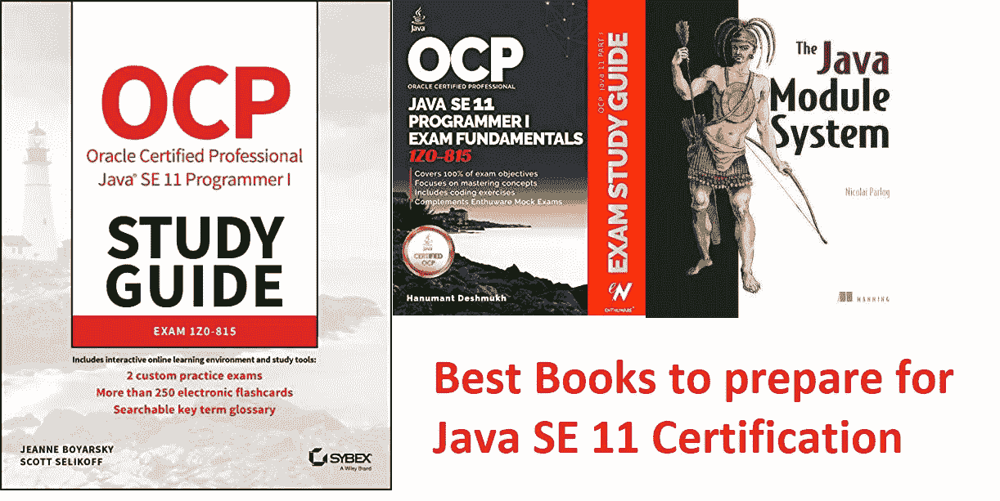
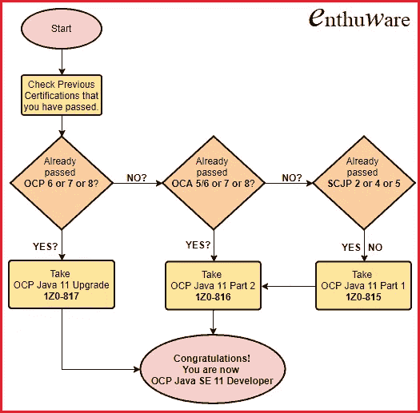
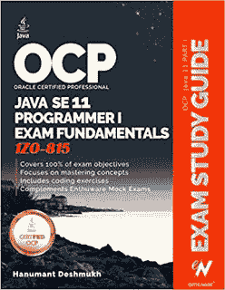
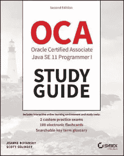
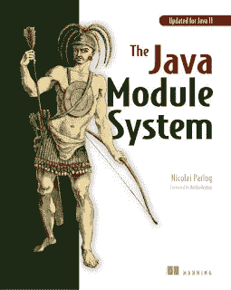
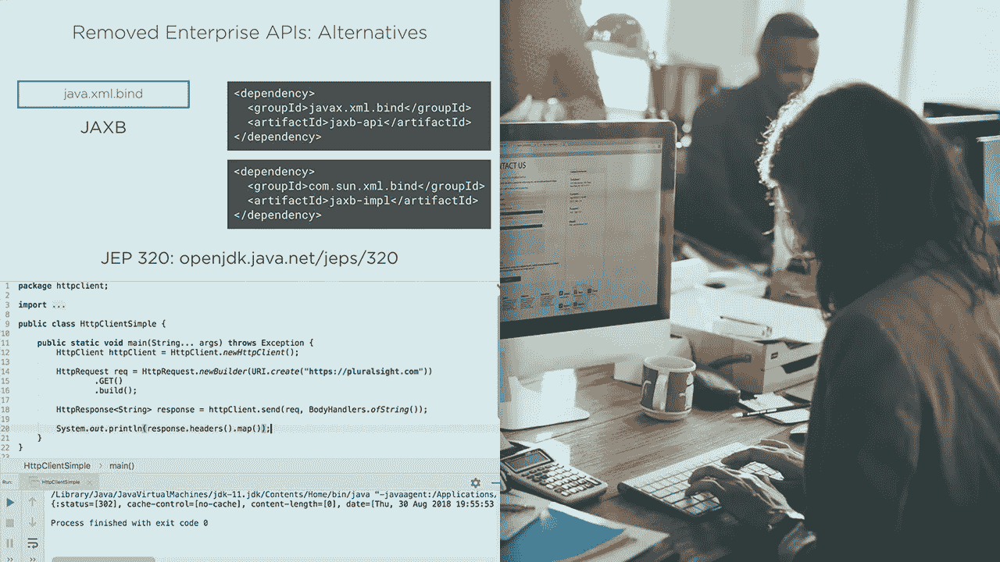
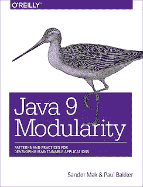

# 破解 2023 年 Java SE 11 开发人员认证考试的 7 本最佳书籍、课程和实践测试

> 原文：<https://medium.com/javarevisited/5-best-books-courses-and-practice-tests-to-crack-java-se-11-certification-ocajp-11-1z0-815-6c861d6d147f?source=collection_archive---------1----------------------->

图像-

大家好，如果你正在准备 OCAJP 11(1z 0–815)或 OCPJP 11(1z 0–816)或**OCPJD 1z 0–819 考试**并寻求一些关于准备的建议，那么你来对地方了。 **Java SE 11 认证**是开发人员级别最难的 Java 认证之一。

它比它的前身 [OCAJP 8](https://javarevisited.blogspot.com/2017/04/ocajp-1z0-808-best-books-and-mock-exams-Java8-certification.html) 难多了，一些尝试过它的程序员称它甚至比像 [OCPJP 8](https://javarevisited.blogspot.com/2015/11/5-free-ocajp8-ocpjp8-mock-exams-and-practice-questions.html) 这样的专业级认证还要难。

为了破解 Java SE 11 认证，你需要努力准备，但是，与此同时，你也需要知道你应该重点关注哪些领域。你应该在哪些主题上花更多的时间，哪些书籍和课程可以帮助你学习这些重要的主题？

我从大部分给予 Java SE 11 认证的开发人员(*半数未通过*)那里得到的反馈是 **Java 模块系统**是一个至关重要的话题，由于他们从未真正使用过模块，所以他们真的很难回答那些问题。

我从反馈中了解到的另一个重要的事情是，问题比之前的 [**Java SE 8 认证考试**](https://javarevisited.blogspot.com/2018/01/top-5-java-8-certifications-courses-training-online-OCAJP.html) 更加深入和混乱。你需要知道一些概念来回答一个问题，而多个答案的问题很难回答正确。
不再有“Oracle 认证 Java 程序员助理”这个头衔了。

事实上，如果你通过 OCAJP 11(1z 0–815)或 OCPJP 11(1z 0–816)考试中的任何一门，你都不会获得任何头衔，如果你以任何顺序通过这两门考试，你只会获得头衔**“Oracle 认证 Java SE 11 程序员”**。

还有一个考试，*1z 0–817，升级 OCP Java 6，7 & 8 到 Java SE 11 开发者考试*，针对已经通过 Java SE 8 认证的 Java 程序员像 [OCAJP8](http://www.java67.com/2017/11/what-is-cost-of-oracle-java.html) 和 [OCPJP8](http://javarevisited.blogspot.sg/2016/10/top-2-books-for-ocpjp8-certification-1Z0-809-810-813.html#axzz5BnsEM0ee) 或者任何 Java SE 6 之前的版本像 [OCAJP7](http://www.java67.com/2018/02/difference-between-ocajp7-and-ocajp8-certification-1Z0-803-vs-809.html) 或者 OCAJP6。

他们可以通过这个考试将他们的 Java 认证升级到 Java SE 11。同样不容易，但至少你只需要通过一门考试就能获得职称，而不是通过两门考试。

这里有一个来自 Enthuware Java 的漂亮的 **Java 认证路线图**来指导你:

现在你已经知道了 OCAJP 11 考试的变化，让我们来关注一下你可以阅读哪些书籍，可以参加哪些在线培训课程来准备这次考试。

# 针对 OCAJP 11 和 OCPJP 11 考试(1z 0–815、1z0- 816 和 1z 0–819)的 7 种以上最佳书籍、课程和练习测试

如果你看一下考试题目，你会发现考试大纲和 OCAJP 8 考试非常相似，除了模块部分，它是在 Java 9 中引入的，但当你去真正考试时，问题要严厉得多。

这意味着你真的需要深入了解 Java 8 的概念以及其他在 [Java 9](/javarevisited/5-courses-to-learn-java-9-features-in-depth-373f7afcf9fa) 、 [Java 10](https://javarevisited.blogspot.com/2018/03/java-10-released-10-new-features-java.html) 和 [Java 11](https://www.java67.com/2018/02/5-online-courses-to-learn-java-9-better.html) 中介绍的概念，尤其是**模块化**。另一个问题是，这次的教学大纲宽泛而模糊，这意味着你需要准备的不仅仅是考试题目。

基于此，这里有几本书和在线课程，你可以阅读并参加，为你的 Java SE 11 认证做好准备，也知道 OCAJP 11(1z 0–815)、OCPJP 11(1z 0–816)、OCP 11 升级考试(1z 0–817)或简单的 Java 开发社区上的 OCP 11。

## 1.[Hanumant desh mukh 的 Java SE 11 学习指南](https://www.amazon.com/dp/1086955811/?tag=javamysqlanta-20)

在撰写本文时，这是 Java SE 11 认证唯一可用的学习指南。根据我自己通过多项 Java 认证的经验，学习指南是必须的，你很幸运有一本，非常感谢 Hanumant Deshmukh 编写了这本指南。它与考试主题密切相关，但更进一步深入解释了该主题，即使它涉及探索一些其他相关概念。

每一章都充满了测验和练习，颜色编码真的很容易查看代码，我当然更喜欢书中的颜色编码:-) Hanumant 还为考生分享了有用的考试技巧，如如何消除答案，这对回答多答案问题非常重要。

如果你能把这本书和 Udemy 上的 [**完整 Java 大师班**](https://click.linksynergy.com/deeplink?id=JVFxdTr9V80&mid=39197&murl=https%3A%2F%2Fwww.udemy.com%2Fcourse%2Fjava-the-complete-java-developer-course%2F) 课程结合起来，你就能顺利通过这次考试。本课程还涵盖了 Java 模块系统，这是本认证的一个基本主题。

你可以做的另一件事是将这本书和课程与 Whizlabs 的[**Java SE 11 练习测试**](http://shrsl.com/1mekf) 结合起来。它有 600 多个问题，并将给出一些解决 Java 11 认证难度级别问题的实际经验。

这也将是对你的速度和准确性的一个很好的考验，如果你想以优异的成绩在第一次尝试中通过考试，这是非常重要的。这是我向希望通过 Java SE 11 认证的读者推荐的组合。

## 2. [Java SE 11 认证学习指南](https://www.amazon.com/Oracle-Certified-Professional-Programmer-Study/dp/1119584701?tag=javamysqlanta-20)

这是 Jeanne Boyarsky 和 Scott Selikoff 的另一个 Java SE 11 认证学习指南，他们是 Java 认证指南的两位畅销书作者。这本书现在可以买到了。如果你读过 Jeanne 和 Scott 的 OCAJP 认证指南，你就会知道他们有多优秀。他们的指南现在已经成为 Java SE 11 认证工具包的标准组成部分，因为几乎所有通过 Java SE 8 考试的开发人员都提到了这本书。

您也可以购买本学习指南，为您的 OCAJP 11 认证指南做准备。除了本指南，您还可以使用 Udyan Khatr 的 [**Java 认证(1z 0–815)考试模拟**](https://click.linksynergy.com/deeplink?id=JVFxdTr9V80&mid=39197&murl=https%3A%2F%2Fwww.udemy.com%2Fcourse%2Fjava-se-11_1z0-815%2F) 模拟测试 Udemy (480 题)以获得最佳结果。

## 3.[Nicolai Parlog 的 Java 模块系统](https://www.amazon.com/Java-Module-System-Nicolai-Parlog/dp/1617294284/?tag=javamysqlanta-20)

这本书是为那些想获得 Java SE 11 认证并想深入学习 Java 模块化的人准备的。这本书深入介绍了什么是 Java 的模块系统，以及如何从中受益。它还提供了许多例子和迁移策略，供想要使用模块的应用程序使用。

由于模块是 Java SE 11 认证考试的一大部分，我指的是 OCAJP 11(1z 0–815)和 OCPJP 11(1z 0–816)，所以你不能忽视这个话题。事实上，Java SE 11 认证指南的作者 Jeanne Boyarsky 阅读了这本书，以通过今年的 OCP 11 认证。

既然模块对于 Java 开发者来说是一个必不可少的概念，那么即使你没有准备认证，也可以阅读这本书，但是如果你准备了，那么你绝对应该阅读这本书。

这是在亚马逊上购买这门课程的链接 Nicolai Parlog 的[Java 模块系统](https://www.amazon.com/Java-Module-System-Nicolai-Parlog/dp/1617294284/?tag=javamysqlanta-20)

## 4.[Java 11 课程新内容](https://pluralsight.pxf.io/c/1193463/424552/7490?u=https%3A%2F%2Fwww.pluralsight.com%2Fcourses%2Fjava-11-whats-new)

这是一门简明的课程，涵盖了 Java 11 最重要的更新。还有类似的课程像[Java 8 的新功能](https://pluralsight.pxf.io/c/1193463/424552/7490?u=https%3A%2F%2Fwww.pluralsight.com%2Fcourses%2Fjava-8-whats-new)、[Java 9 的新功能](https://pluralsight.pxf.io/c/1193463/424552/7490?u=https%3A%2F%2Fwww.pluralsight.com%2Fcourses%2Fjava-9-whats-new)和[Java 10 的新功能](https://pluralsight.pxf.io/c/1193463/424552/7490?u=https%3A%2F%2Fwww.pluralsight.com%2Fcourses%2Fwhats-new-java-10-local-variable-type-inference)，涵盖了那些 Java 版本中所做的更新。

如果你正在准备认证，我强烈建议你通过这一系列的课程，大致了解一下最近 Java 版本中发布的最重要的概念和特性。

**以下是加入本课程的链接**—[Java 11 课程的新特性](https://pluralsight.pxf.io/c/1193463/424552/7490?u=https%3A%2F%2Fwww.pluralsight.com%2Fcourses%2Fjava-11-whats-new)

## 5.[Sander Mak 的 Java 9 模块化书籍](https://www.amazon.com/Java-Modularity-Developing-Maintainable-Applications/dp/1491954167/?tag=javamysqlanta-20)

这是另一本关于模块化的优秀书籍，作者不是别人，正是 Sander Mak，他是 Pluralsight 上一些最好的 Java 课程的讲师，也是一位 Java 冠军。这本书和尼古拉斯·帕洛格的书很像，但我觉得更容易读懂。
对我来说，这本书更适合，因为我已经喜欢上了 Sander Mak 的课程，熟悉他的教学风格。

Sander Mak 也有一门课程叫 [**Java 9 模块化:先在 Pluralsight 上看**](https://pluralsight.pxf.io/c/1193463/424552/7490?u=https%3A%2F%2Fwww.pluralsight.com%2Fcourses%2Fjava-9-modularity-first-look) ，如果你觉得有些题目很混乱很难理解，那就去看看这门课程，用一门课程来掌握这个概念要比看书容易得多。

 [## Java 9 模块化:初看

### 先看看全新的 Java 模块系统。在本课程中，您将了解模块化概念，例如…

pluralsight.pxf.io](https://pluralsight.pxf.io/c/1193463/424552/7490?u=https%3A%2F%2Fwww.pluralsight.com%2Fcourses%2Fjava-9-modularity-first-look) 

## 6. [Java SE 11 程序员 1(1z 0–815)—模拟测试](https://click.linksynergy.com/deeplink?id=JVFxdTr9V80&mid=39197&murl=https%3A%2F%2Fwww.udemy.com%2Fcourse%2Fjava-se11-programmer-1-1z0-815-practice-tests%2F)

实践测试对于通过任何 Java 认证都是非常重要的，但是考虑到 OCAJP 11 的难度，它真的很重要。我强烈建议你通过一些类似 Whizlabs 的[模拟测试](/javarevisited/top-7-practice-tests-and-mock-exams-to-prepare-for-oracles-java-certifications-ocajp-and-ocpjp-36502d4ca061)，为 Java SE 11 认证做好准备。

他们将帮助你建立考试所需的速度和准确性，并帮助你找到自己的强项和弱项，以便你能在这些方面做更好的准备。

以下是您将在本课程中获得的内容:

1.  400 个独特的问题
2.  5 道模拟试题，每道 80 题
3.  详细说明

还有，**这里是购买本课程的链接** — [Java SE 11 程序员 1(1z 0–815)——模拟测试](https://click.linksynergy.com/deeplink?id=JVFxdTr9V80&mid=39197&murl=https%3A%2F%2Fwww.udemy.com%2Fcourse%2Fjava-se11-programmer-1-1z0-815-practice-tests%2F)

## 7. [Java 认证(1z 0–815)主题式测试【2023】](https://click.linksynergy.com/deeplink?id=JVFxdTr9V80&mid=39197&murl=https%3A%2F%2Fwww.udemy.com%2Fcourse%2Fjava-11_1z0-815%2F)

这是 Udemy 的另一个模拟测试，有效地补充了这本书和 Whizlabs 全长模拟测试。在这个测试中，你会发现选择题涵盖了 Java SE 11 程序员 I 考试的所有考试目标。

顾名思义，问题被分成不同的主题，这样你就可以根据主题来评估你的准备情况。它还包含关于 Java 模块的高质量问题，这是考试中最难和最棘手的话题之一，通常是成功和失败的区别。

以下是您将在本课程中获得的内容:

1.  492 个独特的问题
2.  主题式问题分为 6 个测试，48 个模块问题
3.  详细说明

还有，**这里是购买本课程的链接** — [Java 认证(1z 0–815)专题式考试【2023】](https://click.linksynergy.com/deeplink?id=JVFxdTr9V80&mid=39197&murl=https%3A%2F%2Fwww.udemy.com%2Fcourse%2Fjava-11_1z0-815%2F)

这就是关于一些**最好的书籍、课程和实践测试，以破解甲骨文的 Java SE 11 认证**或 OCAJP 11、OCPJP 11 和 OCP 11。正如我所说的，这是我参加过的最难的 Java 认证之一，你真的需要努力准备才能通过这个考试。

不过，如果你想得高分，我建议你坚持练习 [Whizlabs](https://click.linksynergy.com/deeplink?id=JVFxdTr9V80&mid=39197&murl=https%3A%2F%2Fwww.udemy.com%2Fcourse%2Fjava-se11-programmer-1-1z0-815-practice-tests%2F) 和 [Enthuware 的练习考试](https://enthuware.com/java-certification-mock-exams/oracle-certified-associate/ocp-java-11-exam-i-1z0-815)，它们会帮助你在考试中真正获得高分。

其他**认证资源**面向 **IT 专业人员**和 Java 程序员

*   [2023 年 Java 开发者路线图](https://javarevisited.blogspot.com/2019/10/the-java-developer-roadmap.html)
*   [Java SE 11 认证官方指南](https://education.oracle.com/oracle-certified-professional-java-se-11-developer/trackp_815)
*   面向程序员的前 5 名免费 Java 11 实践测试
*   [如何通过 Spring Core Professional 5.0 认证](https://javarevisited.blogspot.com/2018/08/how-to-crack-spring-core-professional-certification-exam-java-latest.html)
*   [如何破解甲骨文 2023 年 Java 认证](https://medium.freecodecamp.org/how-to-pass-oracles-java-certifications-a-practical-guide-for-developers-e9b607ba6173)
*   [Pivotal 的 Spring 认证对工作和职业生涯有帮助吗？](https://javarevisited.blogspot.com/2017/07/does-spring-certification-help-in-job-and-career.html)
*   [如何破解 2023 年 AWS 解决方案架构师考试](https://javarevisited.blogspot.com/2019/08/how-to-crack-aws-certified-solution-architect-exam.html)
*   [10 门免费学习数据结构和算法的课程](http://www.java67.com/2019/02/top-10-free-algorithms-and-data.html)
*   [通过 AWS 解决方案架构师助理考试的 5 次免费模拟测试](https://javarevisited.blogspot.com/2019/08/top-5-free-aws-solution-architect-Associate-certification-dumps-practice-questions.html)
*   [每个软件开发人员都应该学会的 10 件事](https://dev.to/javinpaul/10-things-every-software-developer-should-know-39pe)
*   [2023 年破解 PMP 认证的 5 大球场](https://javarevisited.blogspot.com/2019/09/top-5-courses-to-crack-pmp-project-management-professional-certification-exam.html)
*   [程序员学习 Git 的 5 大免费课程](https://javarevisited.blogspot.com/2018/01/5-free-git-courses-for-programmers-to-learn-online.html)
*   [OCAJP 和 OCPJP 考试 10 道免费样题](http://www.java67.com/2017/05/10-free-java-8-certification-sample-questions-OCAJP8-OCPJP8-Mock-Exams.html)

感谢您阅读本文。如果这些书帮助你通过了 Java SE 11 认证，那么请分享给你的朋友和同事。如果您有任何问题或反馈，请留言。

**P. S.** —如果你是 Java 新手，正在寻找一门全面的课程来深入学习 Java，既有助于工作，又能获得该证书，那么我强烈建议你查看 Udemy 上的 [**完整的 Java Masterclass**](https://click.linksynergy.com/deeplink?id=JVFxdTr9V80&mid=39197&murl=https%3A%2F%2Fwww.udemy.com%2Fcourse%2Fjava-the-complete-java-developer-course%2F) 课程。这是学习 Java 的最全面和最新的课程之一，涵盖了 Java 最新版本的新特性。

 [## 完整的 Java 软件开发人员大师班(针对 Java 17)

### 你刚刚在网上偶然发现了最完整、最深入的 Java 编程课程。拥有超过 260，000 名学生…

Udemy.com](https://click.linksynergy.com/deeplink?id=JVFxdTr9V80&mid=39197&murl=https%3A%2F%2Fwww.udemy.com%2Fcourse%2Fjava-the-complete-java-developer-course%2F)