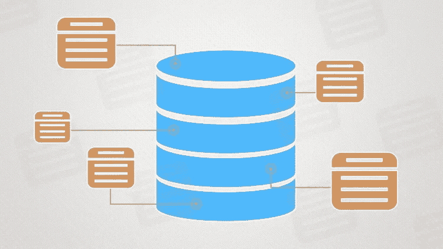
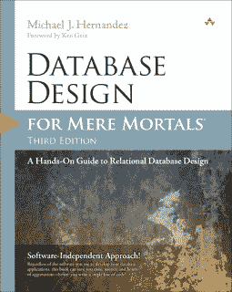
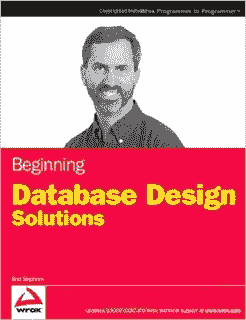
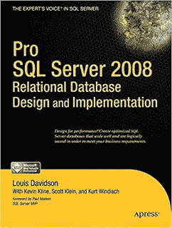

# 2023 年学习 SQL 和数据库设计的 5 本最佳书籍

> 原文：<https://medium.com/javarevisited/5-best-books-to-learn-sql-and-database-design-for-programmers-and-developers-1e7839df2f3e?source=collection_archive---------0----------------------->

image_credit —数据库设计和管理

大家好，如果你想在 2023 年学习 SQL 和数据库设计，并寻找最好的 SQL & DB 设计书籍，那么你来对地方了。前面我已经分享过 [**最好的 SQL 和数据库课程**](/hackernoon/top-5-sql-and-database-courses-to-learn-online-48424533ac61) ，[最好的学习 SQL 的网站](/javarevisited/8-best-resources-to-learn-sql-online-for-free-b00506d88c91)，今天我要分享的是 2023 年学习数据库设计和 SQL 最好的在线课程。

数据库设计和建模是一些很少得到应有关注的主题，尤其是在项目开始时，但是一旦事情失去控制，每个人都会谈论它们。

> 像这样的评论——这个数据库设计得很差，模式执行得不好，不能轻松地添加新列，等等。变得非常普遍。

数据库设计的最大问题是，它主要是由应用程序开发人员完成的，如了解 SQL 的 Java 或 C++，但他们并不擅长如何设计表和模式。

> 数据库管理员或 DBA 比应用程序程序员更了解数据库和 SQL，但他们主要关注数据库的管理部分，最好是应用程序部分，如设计表和它们之间的关系，这是留给应用程序开发人员的。

这导致了一个设计糟糕的数据库的创建，暴露在生产的真实世界中会崩溃，因为 SQL 和数据库设计也是想要破解编码面试的程序员 的 [**必备技能之一。SQL 和数据库设计的良好知识对软件开发大有帮助

当你设计一个糟糕的数据库时，它在 QA 中工作得很好，但是一旦插入真实数据，性能开始下降，这是第一次打击，当需求发展时，这是第二次也是最后一次打击，你会发现很难应付这种情况。

**您突然发现仅仅添加一个或多个列就需要您在许多地方进行修改，并且打破了约束等。**

在这篇文章中，我将分享一些学习数据库设计的最佳书籍，还会提到一些在线课程，如 Udemy 上的基里尔·叶列缅科的**](https://javarevisited.blogspot.com/2020/04/5-essential-skills-to-crack-coding-interviews.html) **[**SQL &数据库设计**](https://click.linksynergy.com/fs-bin/click?id=JVFxdTr9V80&subid=0&offerid=323058.1&type=10&tmpid=14538&RD_PARM1=https%3A%2F%2Fwww.udemy.com%2Fsqldatabases%2F) 来教你数据库设计的基础知识。**

<https://click.linksynergy.com/fs-bin/click?id=JVFxdTr9V80&subid=0&offerid=323058.1&type=10&tmpid=14538&RD_PARM1=https%3A%2F%2Fwww.udemy.com%2Fsqldatabases%2F>  

# 2023 年学习数据库设计和 SQL 的前 5 本书

数据库设计和建模对于理解这一核心信息的所有级别和语言的程序员来说都是必不可少的，因为无论您在哪里工作，您都会或多或少地使用关系数据库。这里是我的书单，它将帮助你一劳永逸地学习和掌握这个话题。有些书关注特定的数据库供应商，如 [SQL Server](/javarevisited/top-10-free-courses-to-learn-microsoft-sql-server-and-oracle-database-in-2020-6708afcf4ad7) ，但是您仍然可以从那里学到一些重要的经验，这些经验也适用于其他数据库。

## 1.[凡人数据库设计](https://www.amazon.com/Database-Design-Mere-Mortals-Hands/dp/0201752840?tag=javamysqlanta-20)

《面向普通人的数据库设计》是新手和任何需要复习的人对关系数据库设计的完美介绍。本书的作者 Michael J. Hernandez 凭借其多年设计关系数据库的实际经验，向您展示了如何分析和改进现有数据库、实现键、定义表关系和业务规则，以及创建数据视图、

**【优点】**
—实际例子
—易于阅读

**缺点**
—没有深入探讨索引、应用主键/外键以及应用约束来防止数据的完整性
—没有充分讨论各种问题

如果你愿意，你也可以将这本书与 Udemy 网站上的基里尔·叶列缅科的 SQL 数据库设计结合在一起，这也是非常实惠的，你可以在 Udemy flash 销售中只花 10 美元。

简而言之，Michael J. Hernandez 所著的《普通人的数据库设计:关系数据库设计实践指南第三版》是一本从零开始学习数据库建模和设计的优秀书籍。

## 2.[开始数据库设计解决方案](https://www.amazon.com/Beginning-Database-Design-Solutions-Stephens/dp/0470385499?tag=javamysqlanta-20)

这是另一本优秀的，也是学习数据建模和数据库设计的最佳书籍之一。这本书解释了数据库设计，这是非常重要的，因为从长远来看，设计不良的数据库可能会令人头痛。Rod Stephens 的《数据库设计解决方案入门》对[规范化](http://www.java67.com/2018/02/5-free-database-and-sql-query-courses-programmers.html)、常见的[数据库设计模式](http://www.java67.com/2016/09/sql-5-best-books-to-learn-and-master.html)以及你需要避免的常见设计陷阱给出了最好的建议。

它告诉我们如何规划数据库的结构，使数据库健壮、抗错，并且足够灵活以适应未来合理的变化。它还解释了如何发现数据库需求，构建数据模型，并改进这些模型以提高数据库的有效性。本书还涵盖了 MySQL 和 Microsoft Access，但是即使您使用的是不同的数据库，也不必太担心，本书中讨论的概念适用于所有重要的数据库。你也可以把这本书和 Udemy 上 Tim Buchalaka 的 [**使用 MySQL 学习 SQL 和数据库设计**](https://click.linksynergy.com/deeplink?id=JVFxdTr9V80&mid=39197&murl=https%3A%2F%2Fwww.udemy.com%2Fcourse%2Fsql-for-beginners-course%2F) 课程结合起来，学习一些 MySQL 特有的数据库设计技巧。

Rod Stephens 的《数据库设计解决方案入门》中有很多例子和练习，它们不仅教你如何做事，还挑战你如何应用你的知识和解决问题。这些练习将促使你思考各种场景，最终帮助你更好地设计数据库。

## 3.[六步关系数据库设计](https://www.amazon.com/Six-Step-Relational-Database-DesignTM-development/dp/1481942727?tag=javamysqlanta-20)

这是另一本学习关系数据库设计的优秀书籍。这本书最好的部分是，它有一些案例研究，从一开始就教你像客户要求设计一个关系数据库。

它涵盖了基本的设计理论、数据库建模以及后续的实施。这本书的可读性也很强，所以你不需要多次阅读一章来理解它。

顾名思义(六步关系数据库设计:一步一步的关系数据库设计和开发方法，Fidel A Captain 第二版)，它教你从需求到一个全功能的数据库只需 6 个步骤。

我也推荐你把这本书和 [**软件工程师数据库设计基础**](https://www.educative.io/courses/database-design-fundamentals?affiliate_id=5073518643380224)Educative 的课程结合起来，一个基于文本的交互式编码和学习平台。本课程有一些漂亮的图表来教你标准化和其他关键的数据库设计概念。

## 4. [SQL 反模式:避免数据库编程的陷阱](http://www.amazon.com/dp/1934356557/?tag=javamysqlanta-20)

仅仅学习最佳实践是不够的，同样重要的是不要重复导致问题的“坏实践”或反模式。如果你不避免这些不好的做法，即使你在其他设计方面做得很好，你也会一事无成。这本书包含了几条关于常见模式的实用建议，我们很多人都在不知其危害的情况下使用这些模式。

无论你使用什么平台或编程语言，无论你是初级程序员还是博士，Bill Karwin 的《SQL 反模式:避免数据库编程的陷阱》将向你展示**如何设计和构建数据库**，[如何编写更好的数据库查询](https://javarevisited.blogspot.com/2017/01/a-better-way-to-write-sql-queries.html)，以及如何像专家一样将 SQL 编程与你的应用程序集成。

## 5. [Pro SQL Server 2008 关系数据库的设计与实现](https://www.amazon.com/Server-Relational-Database-Implementation-Experts/dp/143020866X?tag=javamysqlanta-20)

学习如何设计性能良好的数据库的极好的书籍之一。这本书是任何 SQL Server 开发人员或只想学习如何开发数据库的人的必读之作。

它涵盖了所有的基本主题，包括规范化、安全性，以及如何使用约束和触发器来保护数据的完整性。

这本书最重要的是读起来有趣。与其他关于数据库设计和实现的书籍不同，您不需要多次阅读一章来消化概念。

它还提供了解决许多业务问题的技巧和诀窍，每章都以最佳实践总结结尾。如果你愿意，你也可以将这本书与来自 [Pluralsight](https://javarevisited.blogspot.sg/2017/12/top-10-pluralsight-courses-java-and-web-developers.html) 的[**Why Physical Database Design Matters**](https://pluralsight.pxf.io/c/1193463/424552/7490?u=https%3A%2F%2Fwww.pluralsight.com%2Fcourses%2Fsqlserver-why-physical-db-design-matters)等在线课程相结合，进行更积极的学习。

路易·戴维森、凯文·克兰、斯科特·克莱恩和库尔特·温迪施的 Pro SQL Server 2008 关系数据库设计和实现的唯一缺点是，它是以 [SQL Server](/javarevisited/7-free-courses-to-learn-database-and-sql-for-programmers-and-data-scientist-e7ae19514ed2) 为中心的，因此，如果你一直在使用 Oracle 或 [MySQL](/@javinpaul/top-5-courses-to-learn-mysql-in-2020-4ffada70656f) ，你可能会发现一些讨论是不相关的，但总的来说，你会喜欢这本书，不管你正在使用哪种数据库。

以上是关于学习数据库设计和建模的一些最好的书籍。一个好的数据库设计对保证数据的安全和方便检索大有帮助。

如果你想了解数据库设计和建模是多么重要，我建议你阅读 [**为什么物理数据库设计很重要**](https://pluralsight.pxf.io/c/1193463/424552/7490?u=https%3A%2F%2Fwww.pluralsight.com%2Fcourses%2Fsqlserver-why-physical-db-design-matters) ，该课程主要针对 SQL Server，但给出的建议一般适用于所有数据库。

我的其他**书籍推荐**和**资源**用于进一步学习:
[完整的 SQL Bootcamp](https://click.linksynergy.com/fs-bin/click?id=JVFxdTr9V80&subid=0&offerid=323058.1&type=10&tmpid=14538&RD_PARM1=https%3A%2F%2Fwww.udemy.com%2Fthe-complete-sql-bootcamp%2F)
[学习微软 SQL Server 的 5 大课程](https://javarevisited.blogspot.com/2020/02/top-5-courses-to-learn-microsoft-sql-server-mssql.html)
[学习和掌握 SQL 的 5 本最佳书籍](http://www.java67.com/2016/09/sql-5-best-books-to-learn-and-master.html)
[深入学习 MySQL 数据库的 5 大课程](/@javinpaul/top-5-courses-to-learn-mysql-in-2020-4ffada70656f)
[5 本免费 SQL 书籍供初学者和有经验者使用【T25 学习 Oracle PL/SQL 编程的 4 本书](http://www.java67.com/2017/08/5-free-sql-books-for-beginners-and-experienced-pdf-download.html)
[5 本免费的 Oracle 和 SQL Server 在线课程](http://www.java67.com/2018/02/5-free-oracle-and-microsoft-sql-server-online-courses.html)
[面向有经验程序员的 5 本高级 SQL 书籍](http://javarevisited.blogspot.sg/2017/03/top-5-advanced-sql-books-for-programmers.html)
[面向初学者的 5 本学习 PostgreSQL 的课程](https://javarevisited.blogspot.com/2020/02/top-5-courses-to-learn-postgresql-in.html)
[准备技术性编程/编码工作面试的 10 本书](http://www.java67.com/2017/06/10-books-to-prepare-technical-coding-job-interviews.html)

感谢您阅读本文到此为止，如果您喜欢这些书，那么请分享给您的朋友和同事。 如果您对反馈有任何问题，请留言。

**P. S.** —如果你更喜欢在线课程而不是阅读书籍，那么你也可以看看 [**SQL for 初学者:使用 MySQL 学习 SQL 和数据库设计**](https://click.linksynergy.com/deeplink?id=JVFxdTr9V80&mid=39197&murl=https%3A%2F%2Fwww.udemy.com%2Fcourse%2Fsql-for-beginners-course%2F) for 程序员和数据库管理员。它不仅能帮助你学习 SQL，还能帮助你学习数据库设计。

<https://click.linksynergy.com/deeplink?id=JVFxdTr9V80&mid=39197&murl=https%3A%2F%2Fwww.udemy.com%2Fcourse%2Fsql-for-beginners-course%2F> 