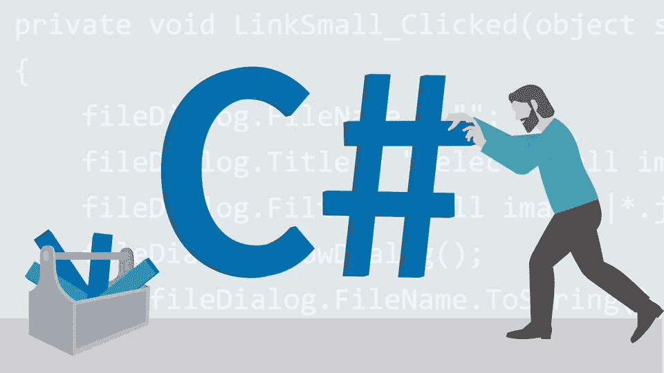
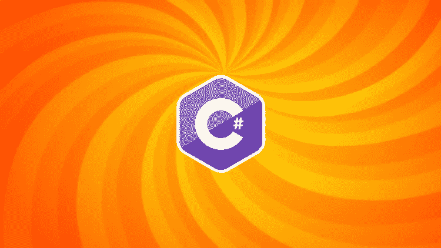
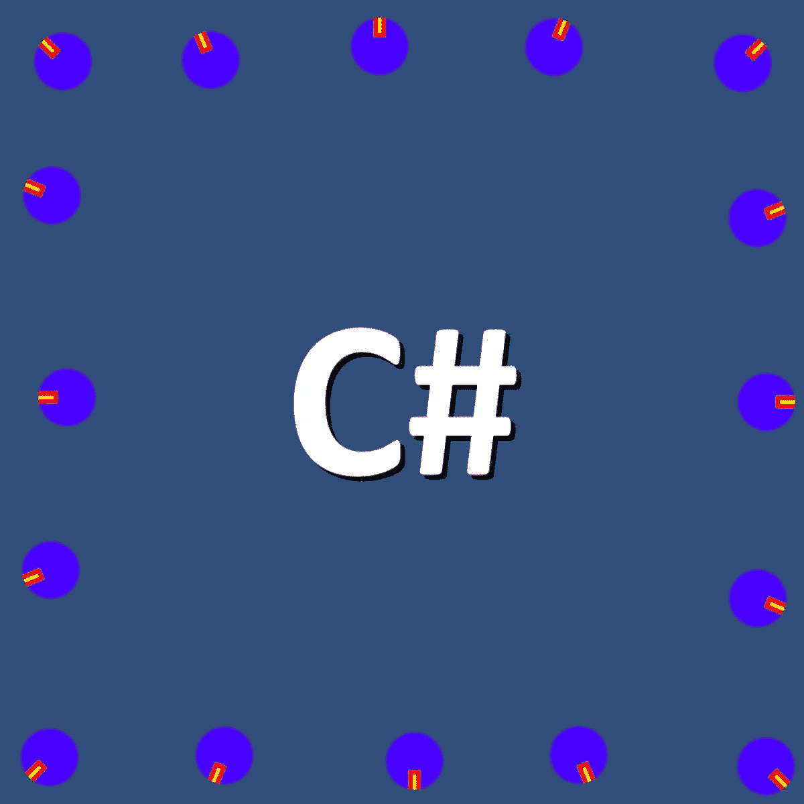
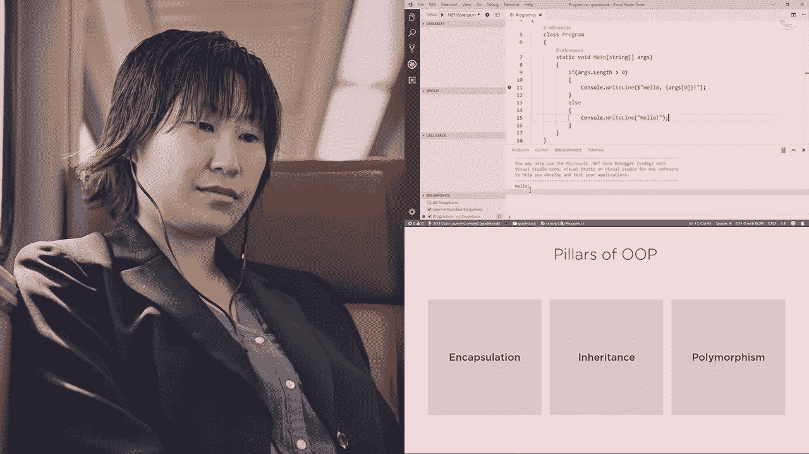
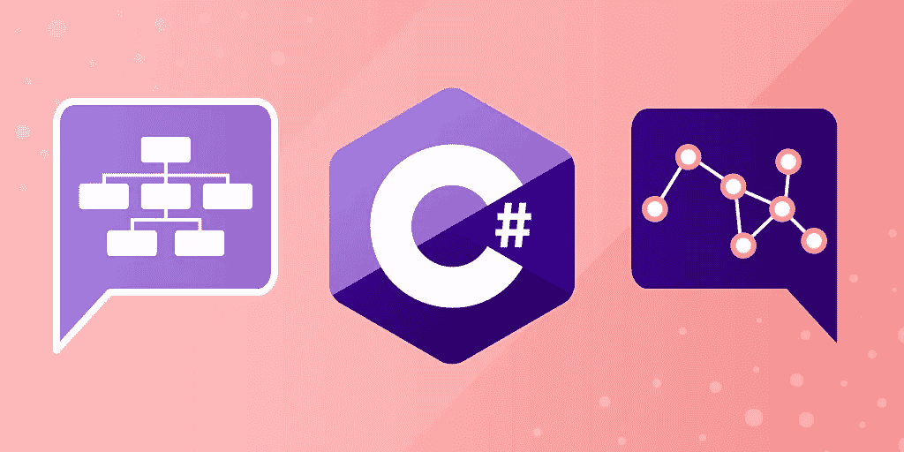

# 2023 年 6 门最佳 C# (C-Sharp)初学者在线课程

> 原文：<https://medium.com/javarevisited/5-best-c-c-sharp-programming-courses-for-beginners-in-2020-494f7afc7a5c?source=collection_archive---------0----------------------->

## 这些是初学者和中级开发人员在线学习 C#或 C-sharp 编程的最佳课程

image _ credit—LinkedIn Learning 上的 C#

大家好，如果你想学习 ASP 的 C#语言。NET 或游戏开发，那么你来对地方了。以前分享过 [**免费 C#课程**](/javarevisited/9-free-c-c-sharp-courses-and-tutorials-for-beginners-and-intermediate-programmers-best-of-lot-dc8c793aab31) 和 [**最佳 ASP。NET 课程**](/javarevisited/7-best-online-courses-to-learn-asp-net-core-and-mvc-in-depth-a68c1b728090?source=---------28------------------) ，而今天我要分享的是初学者学习 C-sharp 的最佳课程。

如果有一种编程语言比它目前从开发者那里得到的更值得称赞，那么它将是微软的 c#(T8)或 C-Sharp。

当我们谈论流行的编程语言时，我们主要谈论的是 [Java](https://javarevisited.blogspot.com/2018/07/10-reasons-to-learn-java-programming.html) 如何统治了过去三十年的编程世界， [JavaScript](https://www.java67.com/2019/01/best-websites-to-learn-javascript-online.html) 如何改变了 web 世界，或者 [Python](https://javarevisited.blogspot.com/2018/05/10-reasons-to-learn-python-programming.html) 如何在过去几年接管了所有的编程语言，但我们很少提到 C#，它默默地提供了就业机会，并以此为职业。NET、 [Unity](/@javinpaul/7-best-courses-to-learn-unity-for-game-development-in-2020-99f870d88e5e) ，并成为创建桌面 GUI 应用程序的首选。

如果你按照 StackOverflow 的调查，那么你知道 C#一直是程序员评价的 [**前 5 的编程语言**](https://javarevisited.blogspot.com/2018/08/5-programming-language-every-programmer-learn.html) 之一，今年也有接近 31.0%的人已经表示他们使用 C#，这一点意义重大。

有整个世界的[。NET](https://javarevisited.blogspot.com/2019/10/top-5-courses-to-learn-asp-net-in-2019.html) 、 [Unity](https://javarevisited.blogspot.com/2019/04/top-5-unity-game-development-and.html) 和其他 GUI 开发者，他们使用 C#来开发任务关键型应用程序，这就是为什么学习 C#对程序员来说是一项极好的投资。对 C#冷淡的一个原因可能是它依赖于平台，你只能创建一个 Windows 应用程序，但现在已经改变了。带[。NET core](https://javarevisited.blogspot.com/2019/10/top-5-courses-to-learn-asp-net-in-2019.html) ，你可以使用 C#构建跨平台的应用程序，比如 Linux 和 macOS 的 GUI。

这是区分 [Java](https://javarevisited.blogspot.com/2018/05/top-5-java-courses-for-beginners-to-learn-online.html) 和 [C#](https://www.java67.com/2017/12/10-programming-languages-to-learn-in.html) 的唯一标准，但是最近，微软一直在做正确的事情(想想 [Azure](https://javarevisited.blogspot.com/2019/07/top-5-courses-to-crack-azure-architecture-technologies-certification-az-300-exam.html) 、 [VS Code](/javarevisited/8-best-vs-code-courses-for-beginners-to-learn-online-bd5c169f59b7) )，他们也消除了这种差异。这意味着 C#在未来的日子里肯定会增长。

如果你相信 C#的潜力，想学习 C#或者已经在学习 c#以便在你最近的项目中使用，并寻找一些在线课程来学习基础知识，那么你来对地方了。

在这篇文章中，我准备分享一些 2023 年学习 C# **或 C-Sharp**的 [**最佳课程。这些课程既适合初学者，也适合希望填补 C#知识空白的有经验的程序员。**](https://javarevisited.blogspot.com/2019/11/top-5-courses-to-learn-c-sharp-in.html)

<https://coursera.pxf.io/c/3294490/1164545/14726?u=https%3A%2F%2Fwww.coursera.org%2Fspecializations%2Fprogramming-unity-game-development>  

# 排名前六的 C#在线课程。2023 年的 NET 程序员和初学者

正如我以前说过的，C#一直是业界广泛使用的三大编程语言之一。这些是网上学习 C#的一些最好的课程。我仔细地选择了路径，以便这个列表对初学者和有一些 C#经验的中级开发人员都有用。

所以，如果你想在 2023 年从零开始学习 C#，或者只是想学习 C#的高级功能以使你的学习更上一层楼，看看这些课程吧。

## 1.[初学者 C#基础:通过编码学习 C#基础](https://click.linksynergy.com/deeplink?id=JVFxdTr9V80&mid=39197&murl=https%3A%2F%2Fwww.udemy.com%2Fcourse%2Fcsharp-tutorial-for-beginners%2F)

我第一次分享的时候。前几天，我告诉你我找到了两位优秀的学习导师。NET CORE，Udemy 上的 Mosh Hamedani 和 Pluralsight 上的 Scott Allen，事实证明他们也是学习 C#编程语言的两位最佳导师。在寻找 C#初学者课程时，我从 Mosh Hamedani 教授的其他课程开始搜索，我发现了不止一门，而是三门优秀的 C#课程——初级、中级和高级。这是该系列的第一门课程，它将帮助你掌握 C#的基本原理，如语法、执行等。六小时后。嗯，对我来说花的时间比那个多，但是是的，课程很棒。

Mosh 以完美简洁的方式解释了每一行代码以及它们背后的 C#概念。

**这里是加入这个 C#在线课程**——[初学者 C#基础](https://click.linksynergy.com/deeplink?id=JVFxdTr9V80&mid=39197&murl=https%3A%2F%2Fwww.udemy.com%2Fcourse%2Fcsharp-tutorial-for-beginners%2F)的链接

谈到社会证明，已经有超过 90，000 名学生注册了这门课程，平均而言，它得到了近 28，000 名参与者的 4.5 分，这使得它成为了在 Udemy 上最受欢迎的 C#课程。

如果你是从零开始，这是你应该加入的 C#课程。—拥有 50，000+名学生的最受欢迎的课程，包含提示和练习！

## 2.C#中级:类、接口和 OOP

这是 Mosh 在 [Udemy](/javarevisited/10-best-udemy-online-courses-for-java-developers-4c9ab70cd01f) 为 C#开发人员开设的三部分课程系列中的第二部分。在这一部分中，他提供了对 C#的类、接口和面向对象编程( [OOP](/javarevisited/my-favorite-courses-to-learn-object-oriented-programming-and-design-in-2019-197bab351733) )的深入、逐步的解释。

如果你不知道，C#是和 Java 一起最流行的 [OOP 编程语言](/javarevisited/my-favorite-courses-to-learn-object-oriented-programming-and-design-in-2019-197bab351733?source=---------103------------------)之一，学习 C#确实可以帮助你更好的解决那些复杂的项目。

从类和对象的角度思考，很容易发现对象之间的关系以及它们如何交互。使用像抽象、多态、封装和继承这样的面向对象工具可以提高代码的可重用性，也使得调试和修改程序变得容易。

**这里是加入最佳 C#在线课程**——[c#中级](https://click.linksynergy.com/deeplink?id=JVFxdTr9V80&mid=39197&murl=https%3A%2F%2Fwww.udemy.com%2Fcourse%2Fcsharp-intermediate-classes-interfaces-and-oop%2F)的链接

谈到社交证明，该课程受到超过 68，000 名开发人员和学生的信任，平均有近 15，000 名参与者给予 4.5 分，这充分说明了该课程的质量。除了学习 C#，如果有人对学习[面向对象编程](https://javarevisited.blogspot.com/2018/08/5-object-oriented-programming-and-design-courses-for-Java-programmers.html)感兴趣，这是一门可以加入的绝佳课程。

## 3. [C#高级主题:准备技术面试](https://click.linksynergy.com/deeplink?id=JVFxdTr9V80&mid=39197&murl=https%3A%2F%2Fwww.udemy.com%2Fcourse%2Fcsharp-advanced%2F)

这是 Mosh Hamedani 在 Udemy 上的 C#课程系列的第三部分，也是最后一部分。在这一部分，Mosh 将教授高级 C#概念，如事件、委托、 [Lambda 表达式](/javarevisited/7-best-java-tutorials-and-books-to-learn-lambda-expression-and-stream-api-and-other-features-3083e6038e14?source=---------14------------------)、LINQ、异步/等待等。

这些概念不仅高级而且非常混乱，许多开发人员不理解它们，但是如果你正在编写一个真实世界的 C#应用程序，它们是必不可少的。该课程还将帮助你准备[技术面试](https://javarevisited.blogspot.com/2018/02/10-courses-to-prepare-for-programming-job-interviews.html#axzz5oeVu3CYQ)。这里是你将在本课程中学到的高级 C#特性的完整列表:

*   异常处理
*   无商标消费品
*   代表
*   事件
*   λ表达式
*   扩展方法
*   LINQ
*   可空类型
*   力学
*   使用 Async / Await 进行异步编程
*   更多

谈到社交证明，有超过 59，000 名开发人员注册了这门课程，平均来说，它有近 10，000 名参与者的 4.5 个评级。如果你知道 C#但是纠结于事件、Lambda 表达式、Async/Await，那么你绝对应该加入这个课程。

**这里是加入高级 C#课程**的链接— [C#高级主题:准备技术面试](https://click.linksynergy.com/deeplink?id=JVFxdTr9V80&mid=39197&murl=https%3A%2F%2Fwww.udemy.com%2Fcourse%2Fcsharp-advanced%2F)

## 4.[c#编程和 Unity 简介](https://coursera.pxf.io/c/3294490/1164545/14726?u=https%3A%2F%2Fwww.coursera.org%2Flearn%2Fintroduction-programming-unity) (Coursera)

以防你不了解 Mosh 的教学风格，我对此非常怀疑，你可以看看这个 C#编程课程，在另一个流行的在线学习平台 Coursera 上，它允许你在线学习著名的大学课程，就像科罗拉多大学提供的这门课程。

这是关于 C#和[编程](/javarevisited/7-best-coding-course-to-learn-programming-with-zero-experience-in-2020-52f7d0d9cb80)本身的基础课程之一，从变量、操作符和循环开始，但它也解释了流行的 [Unity 游戏引擎](https://javarevisited.blogspot.com/2019/03/5-free-game-development-courses-unity-corona-libgdx-java.html)，它用于在 C#中创建视频游戏

在这门课程中，你将学习如何使用 Unity 游戏引擎为 Windows 和 macOS 编写基于 C#的视频游戏，理解每一个步骤。它不假设你有任何编程语言，即使你从来没有写过一行代码也不用担心。

**这是 Coursera 上的 C#课程的链接**—[c#编程和 Unity 简介](https://coursera.pxf.io/c/3294490/1164545/14726?u=https%3A%2F%2Fwww.coursera.org%2Flearn%2Fintroduction-programming-unity)

出于这样或那样的原因，我强烈建议那些没有参加 Mosh 在 Udemy 上的任何课程的初学者学习这门课程，但是如果你有一些编程经验，你应该去看看 Stock Allen 的课程，他是下一个目标。

而且，如果你觉得 Coursera 专业化和认证有用，特别是来自 Google、AWS 和 IBM 的认证，那么我建议你加入 [**Coursera Plus**](https://coursera.pxf.io/c/3294490/1164545/14726?u=https%3A%2F%2Fwww.coursera.org%2Fcourseraplus) ，这是 Coursera 的一个伟大的订阅计划，让你可以无限制地访问他们最受欢迎的课程、专业化、专业证书和指导项目。它每年花费大约 399 美元，但是它完全值得你的钱，因为你得到了无限的证书。

<https://coursera.pxf.io/c/3294490/1164545/14726?u=https%3A%2F%2Fwww.coursera.org%2Fcourseraplus>  

## 5.斯科特·艾伦(Pluralsight)的 C#基础知识(T1)

本课程为你提供了在任何平台上成为高效 C#开发人员所需的一切。学习在自己的应用程序中读写 C#代码的基础知识。

你可能已经知道，在学习方面，斯科特·艾伦是我最喜欢的导师之一。NET 和 C#，而这门课又是一颗宝石。您将从基础开始，但很快获得运行和调试 C#应用程序的实践经验。

首先，您将学习 C#语言的语法。接下来，您将发现. NET 的内置特性。一旦您理解了这些概念，您将学习如何使用面向对象的编程技术来解决问题。

**这里是在 Coursera** — [C#基础](https://pluralsight.pxf.io/c/1193463/424552/7490?u=https%3A%2F%2Fwww.pluralsight.com%2Fcourses%2Fcsharp-fundamentals-dev)上加入这个 C#课程的链接

学完本课程后，您将具备现实世界解决方案所需的技能和知识。您甚至可以了解到哪里去学习高级 C#概念，如泛型、Linq 和 Async，以及编写有效 C#代码的技巧。

顺便说一下，你需要一个 [Pluralsight 会员资格](https://pluralsight.pxf.io/c/1193463/424552/7490?u=https%3A%2F%2Fwww.pluralsight.com%2Fpricing) p 才能加入这个课程，费用大约是每月 29 美元或每年 299 美元(14%的折扣)。我向所有程序员强烈推荐这个订阅，因为它提供了超过 7000 个在线课程的即时访问，以学习任何技术技能。或者，你也可以使用他们的 [**10 天免费通行证**](https://pluralsight.pxf.io/c/1193463/424552/7490?u=https%3A%2F%2Fwww.pluralsight.com%2Flearn) 免费观看本课程。

<https://pluralsight.pxf.io/c/1193463/424552/7490?u=https%3A%2F%2Fwww.pluralsight.com%2Flearn>  

## 6.[c#中编码面试的数据结构](https://www.educative.io/courses/data-structures-interviews-cs?affiliate_id=5073518643380224)【教育课程】

我们都知道了解你的数据结构有多重要，尤其是当你即将有一次面试的时候。事实上，我通常建议那些已经有一段时间没有被面试过的人花大约六周时间学习数据结构和算法。

在面试中有很多标准来评估你，但是正如老话所说，“数据结构+算法=程序。”数据结构可以有效地检验你的整体编程能力。

一门 C#语言的数据结构课程是最好的 C#课程列表中的必备课程，这是一门非常棒的课程。

本课程是 Educative 最畅销的数据结构系列的一部分，该系列还包括:Python、JavaScript、Java 和 C++。

在本课程中，您将获得大量使用最广泛的数据结构的实践，包括数组、链表、图、树、大 o 符号等等。

本课程的伟大之处在于，您实际上获得了一步一步的实施细节，帮助您了解解决每个问题的最佳方式，而不仅仅是解决实践问题。

**这里是加入本课程的链接—** [用 C#编写面试的数据结构](https://www.educative.io/courses/data-structures-interviews-cs?affiliate_id=5073518643380224)

而且，如果你发现教育平台和他们的搜索课程，像[搜索系统设计面试](https://www.educative.io/collection/5668639101419520/5649050225344512?affiliate_id=5073518643380224)，搜索面向对象编程面试，然后考虑获得 [**教育订阅**](https://www.educative.io/subscription?affiliate_id=5073518643380224) ，每月只需 14.9 美元就可以访问他们的 100 多门课程。非常划算，非常适合准备编码面试。

<https://www.educative.io/subscription?affiliate_id=5073518643380224>  

以上就是关于**深入学习 C# (C-Sharp)的最佳课程**。如果你想在 2023 年学习 C#，你可以从这些课程开始，不需要购买所有的课程，只需选择一个你可以与讲师联系的课程。

找出答案的一个好方法是观看预习课。如果你能不跳不跳地看完预习课，这是一个很好的迹象，表明你正在和老师交流并学习。

这些课程会给你在项目中使用 C#打下坚实的基础和信心。它们既适合初学者，也适合中级开发者。

如果您想使用 C#构建控制台、GUI 或 web 应用程序，这些课程将帮助您实现这一目标。而且，既然可以用 [C#](https://www.java67.com/2019/03/5-free-c-net-courses-to-learn-online.html) 和[。为了创建一个跨平台的应用程序，许多公司会将目光投向 C#来构建 GUI 应用程序和游戏。

其他**编程资源(免费和付费)**您可以查看一下](/javarevisited/7-best-online-courses-to-learn-asp-net-core-and-mvc-in-depth-a68c1b728090)

*   [Web 开发人员的 5 个最佳角度课程](/javarevisited/10-courses-to-learn-angular-for-web-development-6da1bd2856dc)
*   [学习 Ruby 编程的前 5 门课程](https://www.java67.com/2018/02/5-free-ruby-and-rails-courses-to-learn-online.html)
*   [学习 Java 编程的 5 门免费课程](https://javarevisited.blogspot.com/2018/05/top-5-java-courses-for-beginners-to-learn-online.html)
*   [2023 年学习 JavaScript 的十大课程](https://javarevisited.blogspot.com/2018/06/top-10-courses-to-learn-javascript-in.html)
*   [2023 年学习 Swift 编程的前 5 门课程](https://javarevisited.blogspot.com/2019/01/top-5-ios-developer-course-to-learn-ios.html)
*   [2023 年学习 Spring Boot 的 10 门课程](/javarevisited/top-10-courses-to-learn-spring-boot-in-2020-best-of-lot-6ffce88a1b6e)
*   [学习 PHP 和 MySQL 的前 5 门课程？](https://hackernoon.com/5-free-php-and-mysql-courses-to-learn-web-development-63836cd3e587)
*   [为网络开发人员提供的 5 门免费 JavaScript 课程](http://www.java67.com/2018/04/top-5-free-javascript-courses-to-learn.html)
*   [2023 年学习 C 编程的前 5 门课程](https://javarevisited.blogspot.com/2019/11/top-5-courses-to-learn-c-programming-in.html)
*   Web 开发人员的 7 门最佳打字课程
*   [2023 年最适合初学者的 15 门 JavaScript 课程](/javarevisited/10-best-online-courses-to-learn-javascript-in-2020-af5ed0801645)

感谢您到目前为止阅读本文。如果你觉得这些最好的 C#课程有用，那么请分享给你的朋友和同事。如果您有任何问题或反馈，请留言。

**P. S.** —如果你想学习 C#或 C-Sharp 并寻找一些免费课程，那么你也可以在 Udemy 上查看 [**编程基础:理解 C#**](https://click.linksynergy.com/deeplink?id=JVFxdTr9V80&mid=39197&murl=https%3A%2F%2Fwww.udemy.com%2Fcourse%2Funderstandingc%2F) 免费课程。这是完全免费的，你只需要一个 Udemy 帐户就可以加入这个课程。

<https://click.linksynergy.com/deeplink?id=JVFxdTr9V80&mid=39197&murl=https%3A%2F%2Fwww.udemy.com%2Fcourse%2Funderstandingc%2F> 