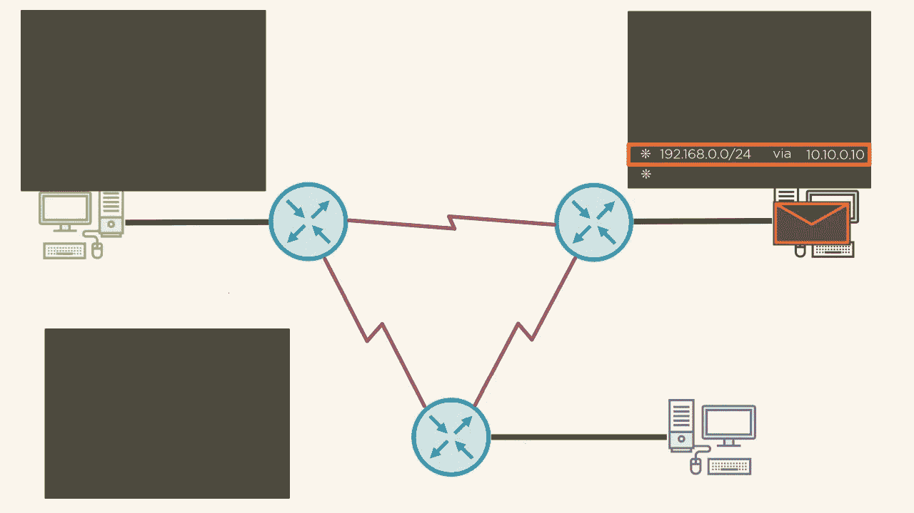
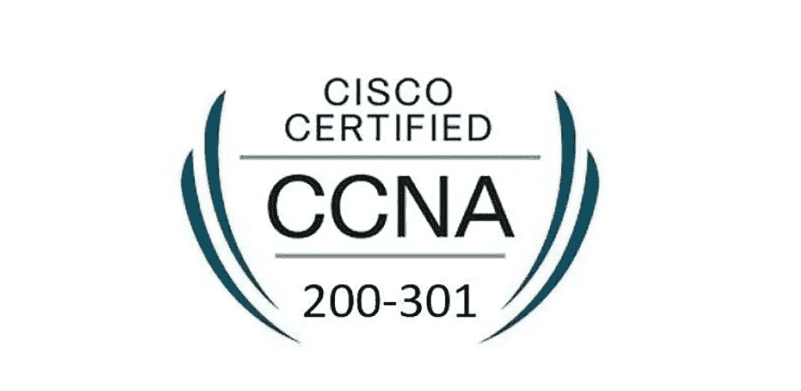
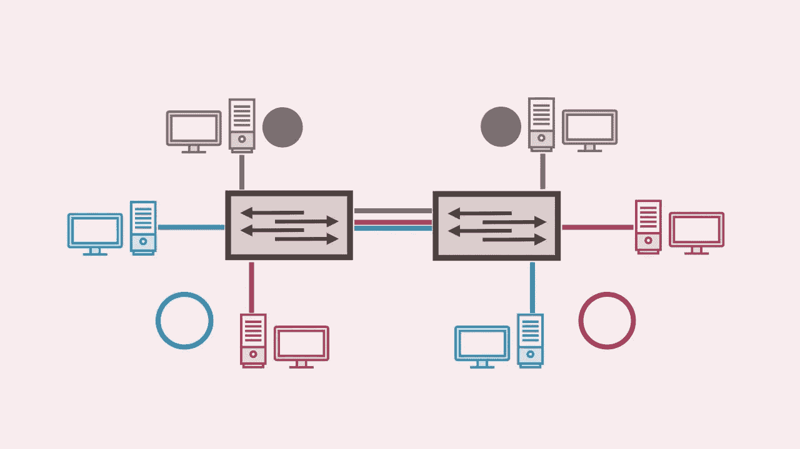
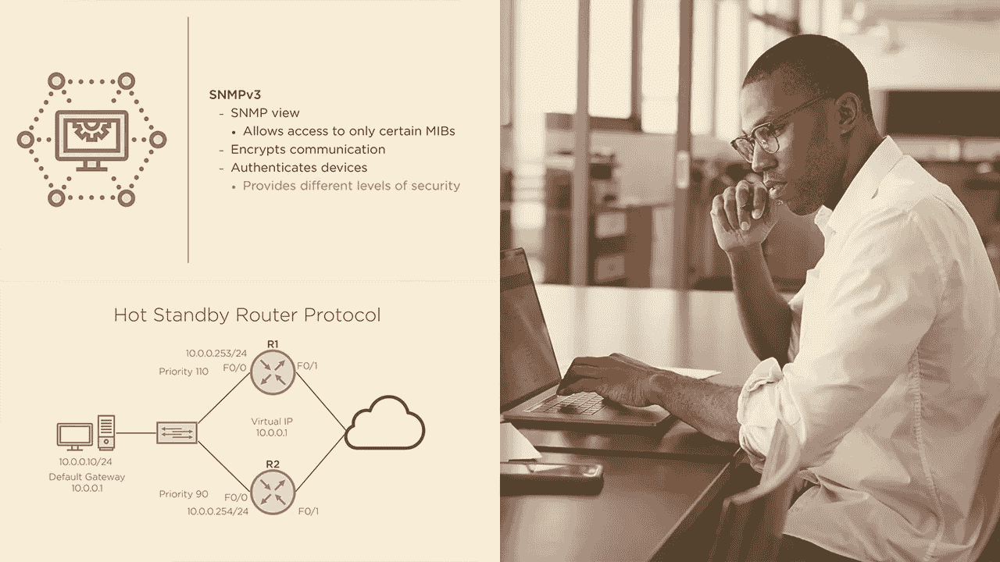
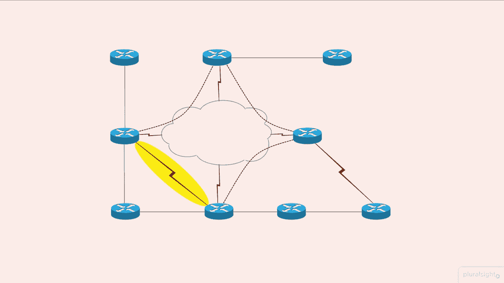
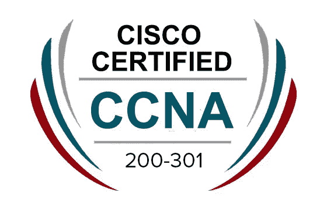

# 2023 年面向初学者和有经验者的 5 个最佳思科 CCNA 课程

> 原文：<https://medium.com/javarevisited/5-best-cisco-ccna-courses-for-beginners-and-experienced-c4a944b650bb?source=collection_archive---------0----------------------->

## 这些是准备思科 CCNA 认证的最佳在线课程，如 CCNA 200–301 和其他课程。

大家好，如果你正在准备思科 CCNA 认证，特别是 CCNA 200-301，并寻找最好的资源，如在线课程，教程，练习测试，书籍等，那么你来对地方了。

之前，我已经分享了[最佳 CompTIA 认证课程](https://javarevisited.blogspot.com/2020/07/top-5-comptia-a-plus-certification-courses-and-practice-tests.html)，在本文中，我将分享准备思科 CCNA 200–301 认证考试的最佳在线课程。

这些课程由专家创建，受到成千上万开发人员的信任，您可以加入他们，了解和学习更多关于思科 CCNA 认证的知识，并通过他们的思科 CCNA 官方考试获得您的认证。

因此，如果你已经在寻找最好的考试课程来帮助你训练和测试你的知识，然后再参加真正的考试，那么你来对地方了。

这项名为“思科 CCNA”的认证将验证您的知识和技能以及网络基础知识，如网络接入、IP 连接以及一些安全基础知识等。

如果您想了解更多信息并通过思科 CCNA 认证考试，那么您可以继续阅读本文末尾的最佳 5 门在线考试课程，以通过并获得思科 CCNA 认证。

# 2023 年面向初学者的 5 门最佳思科 CCNA 在线培训课程

为了不浪费你更多的时间，这里列出了为 2021 年思科 CCNA 考试准备的最好的在线课程。这个列表包括了 Udemy 和 Pluralsight 最好的在线 CCNA 培训课程，这是我最喜欢的两个在线学习网站。

## 1.[思科 CCNA 200–301——获得认证的完整指南](https://click.linksynergy.com/deeplink?id=CuIbQrBnhiw&mid=39197&murl=https%3A%2F%2Fwww.udemy.com%2Fcourse%2Fccna-complete%2F)

另一个有趣的课程是学习思科 CCNA 200–301，这是该认证在 2020 年的最新版本。该课程包含 38 小时的视频内容以及 4.7 分的评分，注册学生超过 115，000 人，这意味着您在注册该课程时会有很好的表现。

本课程从设置实验开始，然后学习一些网络基础知识，如 TCP/IP、OSI 上层和下层、子网划分等。

您还将了解思科故障排除方法、思科设备管理、动态路由协议、网络地址转换、服务质量、云计算等等。

由 Neil Anderson 创建，这也是 Udemy 上最受欢迎的 CCNA 课程之一，已经有超过 115，000 名学生加入了该课程。它也有非常高的收视率和积极的评论。平均来说，它在 37000 人中有 4.7 分的评分，这是惊人的。如果你正在准备思科 CCNA 200–201 考试，那么我强烈推荐这门课程。

**以下是参加本课程的链接** — [思科 CCNA 200–301—获得认证的完整指南](https://click.linksynergy.com/deeplink?id=CuIbQrBnhiw&mid=39197&murl=https%3A%2F%2Fwww.udemy.com%2Fcourse%2Fccna-complete%2F)

## 3.[完整的网络基础课程。你的 CCNA 开始了](https://click.linksynergy.com/deeplink?id=CuIbQrBnhiw&mid=39197&murl=https%3A%2F%2Fwww.udemy.com%2Fcourse%2Fcomplete-networking-fundamentals-course-ccna-start%2F)

另一个有趣的和伟大的课程，在 Udemy 平台上为思科 CCNA 认证准备了超过 80 小时的视频内容。

该课程有超过 10 万名学生注册，这对于谈论网络和思科 CCNA 认证的这类课程来说是疯狂的

本课程首先在您的计算机上安装软件和所有推荐的软件包，然后学习基本的网络术语，如端口和服务器。

然后学习子网划分数据包、IPv4 子网划分、TCP/UDP 等等。您还将了解 Vlans、动态中继协议、端口跨度、安全性、故障排除等等。

**这是参加本课程** — [完整网络基础课程的链接。你的 CCNA 开始](https://click.linksynergy.com/deeplink?id=CuIbQrBnhiw&mid=39197&murl=https%3A%2F%2Fwww.udemy.com%2Fcourse%2Fcomplete-networking-fundamentals-course-ccna-start%2F)

## 3.[思科 CCNA 网络简介](https://pluralsight.pxf.io/c/1193463/424552/7490?u=https%3A%2F%2Fwww.pluralsight.com%2Fcourses%2Fintroduction-networking-cisco-ccna)【plural sight 课程】

Pluralsight 上的一个很好的入门课程，学习网络基础，并为思科 CCNA 认证做好准备。这个小课程是为您准备思科 CCNA 官方认证的一系列课程，您将在这一部分学习网络的基础知识。

首先介绍网络以及作为网络基础的协议和通信模型。

然后，您将详细了解不同的网络通信模型，并学习封装、数据网络和寻址，如网络寻址、IP 网络、更改机器上的 IP 地址等。

**这是参加本课程的链接** — [思科 CCNA 网络简介](https://pluralsight.pxf.io/c/1193463/424552/7490?u=https%3A%2F%2Fwww.pluralsight.com%2Fcourses%2Fintroduction-networking-cisco-ccna)

顺便说一下，你需要一个 [**Pluralsight 会员**](https://pluralsight.pxf.io/c/1193463/424552/7490?u=https%3A%2F%2Fwww.pluralsight.com%2Fpricing%2Ffree-trial) 才能加入这个课程，费用大约是每月 29 美元或每年 299 美元(14%的折扣)。我向所有程序员强烈推荐这个订阅，因为它提供了超过 7000 个在线课程的即时访问，以学习任何技术技能。或者，您也可以使用他们的[**10 天免费通行证**](https://pluralsight.pxf.io/c/1193463/424552/7490?u=https%3A%2F%2Fwww.pluralsight.com%2Fpricing%2Ffree-trial) 免费观看本课程。

<https://pluralsight.pxf.io/c/1193463/424552/7490?u=https%3A%2F%2Fwww.pluralsight.com%2Fpricing%2Ffree-trial>  

## 4. [CCNA 实验室—距离您的思科 200–125 和 200–105 考试还有 7 天](https://click.linksynergy.com/deeplink?id=CuIbQrBnhiw&mid=39197&murl=https%3A%2F%2Fwww.udemy.com%2Fcourse%2Fccna-icnd2-cisco-labs%2F)

这是 Udemy 平台中学习思科 CCNA 最优质的课程之一。本课程包含教授您通过思科 CCNA 认证所需的所有知识的讲座，以及在某些部分测试您在学习新事物时的知识的测验。

首先，您将开始学习如何配置 IP 地址、启用 telnet 和 ssh 以及排除故障和认证路由交换。

然后，您将了解 Vlan 间路由、以太网通道、路由协议以及如何排除故障。在本课程中，您还将了解如何配置网络安全功能以及更多内容。

总的来说，这是为 2021 年思科 CCNA 认证做准备的绝佳课程。谈到社会证明，1320 多名网络管理员已经参加了这一课程，准备参加著名的思科 CCNA 考试。

**这是参加本课程的链接** — [CCNA 实验室—距离您的思科 200–125 和 200–105 考试还有 7 天](https://click.linksynergy.com/deeplink?id=CuIbQrBnhiw&mid=39197&murl=https%3A%2F%2Fwww.udemy.com%2Fcourse%2Fccna-icnd2-cisco-labs%2F)

## 5.[思科 CCNA 200–301:网络基础完整课程](https://click.linksynergy.com/deeplink?id=JVFxdTr9V80&mid=39197&murl=https%3A%2F%2Fwww.udemy.com%2Fcourse%2Fnew-ccna-full-course%2F)

此列表中的最后一门课程有大约 18 个小时的视频内容，用于学习思科 CCNA 200–301，这是 2020 年的最新版本，该课程的注册人数超过 16k，评分为 4.5 分，这非常酷，这很好地表明了该课程的质量。

从网络基础开始，如网络协议、网络接入、传输层、IP 地址。然后，我们将学习路由和交换的基本知识，如 Vlan、动态路由、访问控制列表等。

您还将了解扩展网络、连接网络、安全基础知识等等。

**这里是加入本课程的链接**——[思科 CCNA 200–301:网络基础知识完整课程](https://click.linksynergy.com/deeplink?id=JVFxdTr9V80&mid=39197&murl=https%3A%2F%2Fwww.udemy.com%2Fcourse%2Fnew-ccna-full-course%2F)

以上是为思科 CCNA 认证考试准备的**最佳在线课程。到目前为止，您已经看到了许多很棒的课程，这些课程肯定会帮助您学习思科 CCNA 基础知识，并为正式考试做好准备，现在您所要做的就是选择其中一门课程，开始您在网络领域的旅程和新的职业生涯。**

面向程序员的其他**免费在线课程**

*   [深入学习 Docker 的 10 门免费课程](https://javarevisited.blogspot.com/2018/02/10-free-docker-container-courses-for-Java-Developers.html)
*   [免费学习区块链技术的 5 门课程](http://www.java67.com/2018/02/5-free-blockchain-technology-courses.html)
*   [2023 年学习 Kubernetes 的 7 门免费课程](/javarevisited/7-free-online-courses-to-learn-kubernetes-in-2020-3b8a68ec7abc)
*   [学习 Linux 命令的 5 门免费课程](https://hackernoon.com/top-5-free-linux-courses-for-programmers-4a433b4edade)
*   [5 门免费课程，学习核心 Spring、Spring Boot 和 Spring MVC](http://www.java67.com/2017/11/top-5-free-core-spring-mvc-courses-learn-online.html)
*   [10 门学习数据结构和算法的免费课程](http://www.java67.com/2019/02/top-10-free-algorithms-and-data.html)
*   [2023 年网络开发者路线图](https://javarevisited.blogspot.com/2019/02/the-2019-web-developer-roadmap.html)
*   [面向 Java 和 DevOps 工程师的 5 门免费 Docker 课程](http://www.java67.com/2018/02/5-free-docker-courses-for-java-and-DevOps-engineers.html)
*   [2023 年学习 Linux 命令的 10 门免费课程](/javarevisited/top-10-courses-to-learn-linux-command-line-in-2020-best-and-free-f3ee4a78d0c0)
*   [学习数据科学和机器学习的 10 门免费课程](http://www.java67.com/2018/10/top-10-data-science-and-machine-learning-courses.html)
*   [初学者学习 Java 的 10 门免费课程](http://www.java67.com/2018/08/top-10-free-java-courses-for-beginners-experienced-developers.html)
*   [我最喜欢的深入学习 AWS 的课程](/javarevisited/top-10-courses-to-learn-amazon-web-services-aws-cloud-in-2020-best-and-free-317f10d7c21d)
*   [2023 年十大云认证目标](https://www.java67.com/2020/09/top-10-cloud-certification-you-can-aim.html)
*   [成为全栈 Java 开发者的 10 门课程](/javarevisited/10-best-java-full-stack-web-development-courses-to-join-in-2020-6cd6cd2e5868)
*   [提高生产力和速度的 9 个 Linux 技巧](/javarevisited/top-10-unix-and-linux-productivity-tips-for-programmers-and-developers-c748129cf3e8)

感谢您阅读本文。如果您喜欢这些来自 Udemy、Pluralsight 和 Coursera 的**最佳思科 CCNA 认证在线培训课程**，请与您的朋友和同事分享。如果您有任何问题或反馈，请留言。

**附言——**如果你认真准备并通过思科 CCNA 认证考试，但正在寻找在线课程，那么你也可以在 Udemy 上查看 [**思科 CCNA 入门课程**](https://click.linksynergy.com/deeplink?id=JVFxdTr9V80&mid=39197&murl=https%3A%2F%2Fwww.udemy.com%2Fcourse%2Fcisco-ccna-getting-started%2F) 。这是一个免费的课程，你只需要一个 Udemy 帐户就可以参加。基尔·马丁教授的这个 3.5 小时的免费课程非常适合刚刚开始准备思科 CCNA 考试的初学者。

<https://javarevisited.blogspot.com/2021/10/top-5-courses-to-pass-cisco-ccna-200-301.html> 