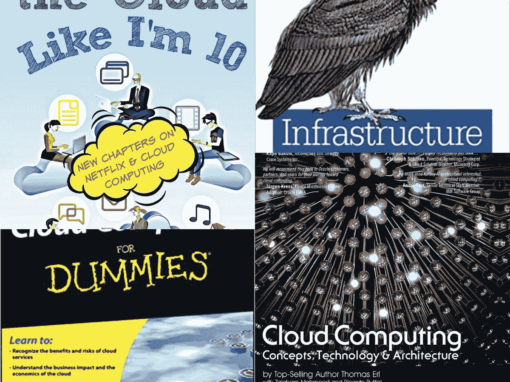
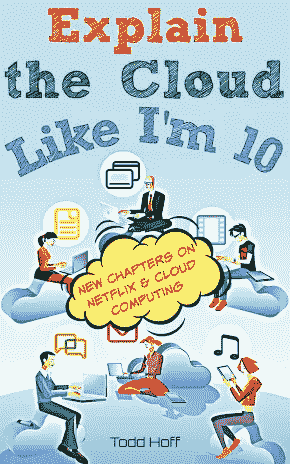
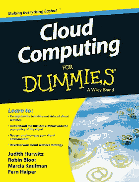
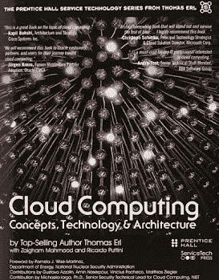
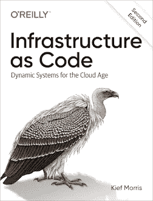
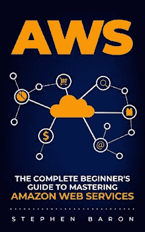

# 2023 年初学者学习的 5 本最佳云计算书籍

> 原文：<https://medium.com/javarevisited/5-best-cloud-computing-books-for-beginners-53267098a3e3?source=collection_archive---------0----------------------->

## 从零开始学习云计算概念的我最喜欢的书。对初学者非常有用，无论是想从零开始学习云计算的技术人员还是非技术人员。

大家好，如果你想学习云计算，比如 AWS、谷歌云平台、微软 Azure 或任何云计算平台，并寻找最好的资源，那么你来对地方了。

早些时候，我已经分享了适合初学者的 [**最佳云计算课程**](/javarevisited/5-best-cloud-computing-courses-to-learn-in-2020-f5f091159401) 以及一些[免费云计算课程](/javarevisited/10-free-courses-to-learn-cloud-computing-for-beginners-4f3cd984ddb1)。在这篇文章中，我将分享给初学者学习云计算的最佳书籍*。*

该列表不仅包括学习云计算基础和基本概念的书籍，如 IaaS、Pass、Saas 等，还包括涵盖流行的云计算平台的书籍，如 [AWS](https://javarevisited.blogspot.com/2020/08/top-10-coursera-certifications-to-learn-cloud-computing-aws.html) 。

如果你是一个完全的初学者，云计算是使用远程服务器网络的领域，这些服务器是强大的计算机，在世界某个地方的数据中心 24 小时工作。你可以在那台电脑上托管你的网站、数据和文件，并远程使用。

使用[云计算](/javarevisited/10-best-aws-google-cloud-and-azure-courses-and-certification-from-coursera-to-join-in-2021-5c5e2029a8e7)的好处使得许多企业使用这种技术来托管他们的 web 应用程序，并且这种技术具有成本效益，而不是在本地主机服务器上托管他们的服务并花费大量资金来管理它们。

使用云计算还有其他好处，如数据转换速度快，能够恢复和备份数据和文件，帮助不同地点的员工协作，以及其他许多好处。一些最好的云计算是[亚马逊 AWS](https://javarevisited.blogspot.com/2020/05/top-5-amazon-web-services-aws-courses-for-beginners-and-experienced-programmers.html#axzz6f4s58Ml9) 、[谷歌云平台](https://www.java67.com/2020/07/5-free-courses-to-learn-google-cloud-platform-and-concepts.html)和[微软 Azure](https://javarevisited.blogspot.com/2020/09/top-5-courses-to-learn-microsoft-azure.html) 。

如果你正试图在云计算领域入门，那么我在本文中列出了五本 [*最好的云计算书籍*](https://javarevisited.blogspot.com/2021/09/topbooks-to-learn-cloud-computing-aws-for-beginners.html) ，它们既适合初学者，也适合专家。

我也分享了一些在线课程，这样可以两全其美，因为在线课程可以帮助你学得更快，而书籍通常可以帮助你学得更深。

# 2023 年初学者学习的 5 本最佳云计算书籍

在不浪费你更多时间的情况下，这里有一个最好的云计算书籍列表，可以学习关于计算、存储、网络、计费以及 AWS 等流行的公共云平台的基本和必要的云计算概念。

## 1.[像我 10 岁一样解释云](https://www.amazon.com/Explain-Cloud-Like-Im-10-ebook/dp/B0765C4SNR?tag=javamysqlanta-20?tag=javamysqlanta-20)

如题，你将作为初学者从零开始学习云计算。这本书真的是开始云计算生涯的有用资源，有很多图片和例子可以学习，就像你 10 岁一样，亚马逊上的 kindle 书售价 9.99 美元。你将涉及大量有趣的话题，从云的定义开始，它是如何得到这个名字的，当一些人说作为服务像软件作为服务时，它意味着什么，以及天气是否真的像大多数人认为的那样影响云计算。

**这里是获取这本书的链接—** [像我 10 岁一样解释云](https://www.amazon.com/Explain-Cloud-Like-Im-10-ebook/dp/B0765C4SNR?tag=javamysqlanta-20?tag=javamysqlanta-20)

如果你需要一门课程，我强烈推荐你将这本书与 Neal Davis 教授的《亚马逊 AWS 上的云计算入门教程》结合起来。这可能是在单一课程中从零开始学习 AWS 和云计算的最好和最新的课程。

 [## 2023 年学习云计算的 5 大在线课程-最佳选择

### 随着越来越多的人开始使用云计算，云计算正成为任何软件开发人员或 IT 专业人员的一项基本技能

javarevisited.blogspot.com](https://javarevisited.blogspot.com/2019/07/top-5-online-courses-to-learn-cloud-computing-aws.html) 

## 2.[虚拟云计算](https://www.amazon.com/Cloud-Computing-Dummies-Computer-Tech-ebook/dp/B08CRDJ3BK/?tag=javamysqlanta-20)

另一本为初学者学习云计算基础知识的有趣的书是一本名为《傻瓜云计算》的书，作者是 Judith S. Hurwitz 和 Daniel Kirsch，他们写了第二版，在亚马逊上以 kindle 的形式出售，售价 21 美元。

您将了解云计算以及使用该技术的弱点和风险等安全问题。

您还将了解云模式，如软件即服务和其他模式 IaaS 和 Paas，以及在多云环境中进行管理、通过在云中集成数据来制定云战略、促进云安全等。

你也可以把这本书和 Udemy 的 **C** [**面向初学者的云计算——基础设施即服务**](https://click.linksynergy.com/deeplink?id=JVFxdTr9V80&mid=39197&murl=https%3A%2F%2Fwww.udemy.com%2Fcourse%2Fcloud-computing-for-beginners-infrastructure-as-a-service%2F) 课程结合起来，混合一些主动学习。这将帮助您更好地学习云计算概念。

## 3.[云计算:概念、技术&架构](https://www.amazon.com/Cloud-Computing-Concepts-Technology-Architecture-ebook/dp/B00CM9V7Q8/?tag=javamysqlanta-20)

如果你在亚马逊上搜索云计算，你会在亚马逊的第一个结果建议上看到这本书，这意味着这本书是该平台上最畅销的书之一。

这本云计算书是作者 Erl Thomas 创作的，作为 kindle 书售价 229.26 美元，挺贵的吧？但是，一旦你读了这本书，你就会发现它是值得的。

读完这本书后，您将对这个被称为[云计算](/javarevisited/5-best-cloud-computing-courses-to-learn-in-2020-f5f091159401)的行业的基础知识及其架构和模型有一个扎实的了解，了解让世界领先的公司使用这项技术托管其服务和网站的商业和经济因素，等等。

如果你需要一门课程来配合这本书，IBM 在 Coursera 上的 [**云计算入门课程**](https://coursera.pxf.io/c/3294490/1164545/14726?u=https%3A%2F%2Fwww.coursera.org%2Flearn%2Fintroduction-to-cloud) 是一个不错的开始。审计也是免费的。

 [## 云计算简介

### 本课程向您介绍云计算的核心概念。您获得了…所需的基础知识

coursera.pxf.io](https://coursera.pxf.io/c/3294490/1164545/14726?u=https%3A%2F%2Fwww.coursera.org%2Flearn%2Fintroduction-to-cloud) 

## 4.[基础设施代码](https://www.amazon.com/Infrastructure-Code-Managing-Servers-Cloud-ebook/dp/B01GUG9ZNU/?tag=javamysqlanta-20)

Kief Morris 在云计算领域已经工作了二十多年，负责管理和部署 IT 基础设施服务。他创作了一本名为《作为代码的基础设施》的书，教你获得系统管理员或基础设施工程师工作所需的技能。

我喜欢这本书的一点是，作者让它变得很实用，不仅仅是理论上像大多数在线书籍一样，你将了解配置云基础架构的工具，以及编写代码来自动化任务，探索管理基础架构的服务，等等。

如果你需要一门课程来配合这本书，请查看 Udemy 上的 [**基础设施作为代码，掌握 AWS 云开发工具包 CDK**](https://click.linksynergy.com/deeplink?id=CuIbQrBnhiw&mid=39197&murl=https%3A%2F%2Fwww.udemy.com%2Fcourse%2Faws-cdk-course%2F) 课程。

## 5. [AWS:完全初学者指南](https://www.amazon.com/Infrastructure-Code-Managing-Servers-Cloud-ebook/dp/B01GUG9ZNU/?tag=javamysqlanta-20)

正如我前面提到的，最好的云服务提供商之一是亚马逊 AWS(亚马逊网络服务)，现在大多数公司都在使用这项服务。这本书将为你提供亚马逊 AWS 的基础，以及如何使用其不同的服务和基础设施。

在这本实用指南中，你将了解什么是云计算，以及为什么大多数企业选择 [AWS](/javarevisited/5-best-aws-courses-for-beginners-and-experienced-developers-to-learn-in-2021-563212409fbd) 而不是其他云提供商。

然后，您将了解如何在[亚马逊 S3](/javarevisited/7-best-aws-s3-and-dynamodb-courses-for-beginners-in-2021-a8a44b6066da) 上存储您的数据和文件，以及如何使用硬件和软件云资源通过亚马逊 EC2 部署您的 web 应用程序，保护您的数据，等等。

**这里是获得这本书的链接**——[AWS:完全初学者指南](https://www.amazon.com/Infrastructure-Code-Managing-Servers-Cloud-ebook/dp/B01GUG9ZNU/?tag=javamysqlanta-20)

如果你需要一门课程来配合这本书，我强烈推荐你去看看 Coursera 的[**AWS 基础专业化**](https://coursera.pxf.io/c/3294490/1164545/14726?u=https%3A%2F%2Fwww.coursera.org%2Fspecializations%2Faws-fundamentals) ，它是由 AWS 自己创建和提供的，已经有超过 20，000 人加入了这门课程。

 [## AWS 基础知识

### 这一专业为当前或有抱负的 IT 专业人员提供了特性、优势和能力的概述…

coursera.pxf.io](https://coursera.pxf.io/c/3294490/1164545/14726?u=https%3A%2F%2Fwww.coursera.org%2Fspecializations%2Faws-fundamentals) 

以上是初学者学习云计算和 AWS 的最佳书籍**。我与您一起列出的上述书籍是由在该行业工作多年的作者创作的，他们分享了如果您试图涉足该行业将需要知道的内容，它们肯定会帮助您学习在云计算领域开始旅程所需的技能。**

目前，列表中没有任何关于谷歌云平台或 Azure 的书籍，但我会在图中更新它，以包括那些。

您可能喜欢的其他 **IT 和云认证文章**:

*   [如何成为 DevOps 工程师？](https://hackernoon.com/the-2018-devops-roadmap-31588d8670cb?gi=8829080e6d7d)
*   [破解 AWS 解决方案架构师专业考试的前 5 门课程](https://javarevisited.blogspot.com/2020/04/top-5-course-to-crack-aws-solution-architect-professional-sap-c01-certification-exam.html)
*   [如何通过 Spring Core Professional 5.0 认证](https://javarevisited.blogspot.com/2018/08/how-to-crack-spring-core-professional-certification-exam-java-latest.html)
*   [破解 AWS DevOps 工程师考试的 5 大课程](https://javarevisited.blogspot.com/2020/04/top-5-course-to-crack-aws-certified-devops-engineer-professional-exam-certification.html)
*   [如何破解 Azure Fundamentals (AZ-900)认证](https://javarevisited.blogspot.com/2020/04/how-to-crack-microsoft-azure-fundamentals-certification-az-900-exam.html)
*   [学习 Docker 和 Kubernetes 的 10 大课程](https://dev.to/javinpaul/top-10-courses-to-learn-docker-and-kubernetes-for-programmers-4lg0)
*   [程序员前 5 名 AZ-900 模拟测试](https://javarevisited.blogspot.com/2020/02/top-5-AZ-900-exam-Azure-Fundamentals-certification-practice-tests-and-mock-exams-to.html)
*   [如何破解 Azure 管理员助理认证(AZ-103)](https://javarevisited.blogspot.com/2020/04/how-to-crack-microsoft-az-103-azure-administrator-associate-exam-certification.html)
*   [10 门数据科学和机器学习认证课程](https://dev.to/javinpaul/10-data-science-and-machine-learning-courses-for-programmers-looking-to-switch-career-57kd)
*   [通过 AWS 解决方案架构师的 5 次免费模拟测试](https://javarevisited.blogspot.com/2019/08/top-5-free-aws-solution-architect-Associate-certification-dumps-practice-questions.html)
*   [通过谷歌助理云工程师认证的前 5 门课程](https://javarevisited.blogspot.com/2019/07/top-5-google-cloud-platform-gcp-courses-certifications-online.html)
*   每个软件开发人员都应该学习的 10 件事
*   [破解 Azure 云架构师(AZ-300)考试的前 5 门课程](https://javarevisited.blogspot.com/2019/07/top-5-courses-to-crack-azure-architecture-technologies-certification-az-300-exam.html#axzz6E6VuRMsx)
*   [破解 AWS 解决方案架构师职业认证的 5 大课程](https://javarevisited.blogspot.com/2020/04/top-5-course-to-crack-aws-solution-architect-professional-sap-c01-certification-exam.html)

感谢您阅读本文。如果你喜欢这些*最好的云计算在线课程*，那么请分享给你的朋友和同事。如果您有任何问题或反馈，请留言。

**p . s .**——如果你是云计算和 AWS 领域的新手，并且正在寻找学习亚马逊 Web 服务的最佳在线课程，那么我强烈推荐你去看看 Coursera 的[**AWS 基础专业化**](https://click.linksynergy.com/deeplink?id=JVFxdTr9V80&mid=40328&murl=https%3A%2F%2Fwww.coursera.org%2Fspecializations%2Faws-fundamentals) ，它是由 AWS 自己创建和提供的，已经有超过 2 万人加入了这个课程。

 [## AWS 基础知识

### 计算云计算安全 aws 云联网存储 AWS 信息隐私云管理安全云…

coursera.com](https://click.linksynergy.com/deeplink?id=JVFxdTr9V80&mid=40328&murl=https%3A%2F%2Fwww.coursera.org%2Fspecializations%2Faws-fundamentals)