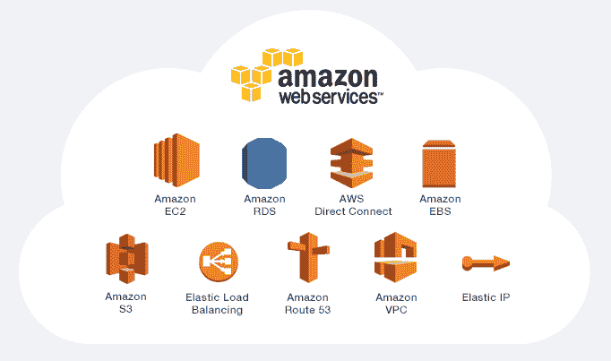
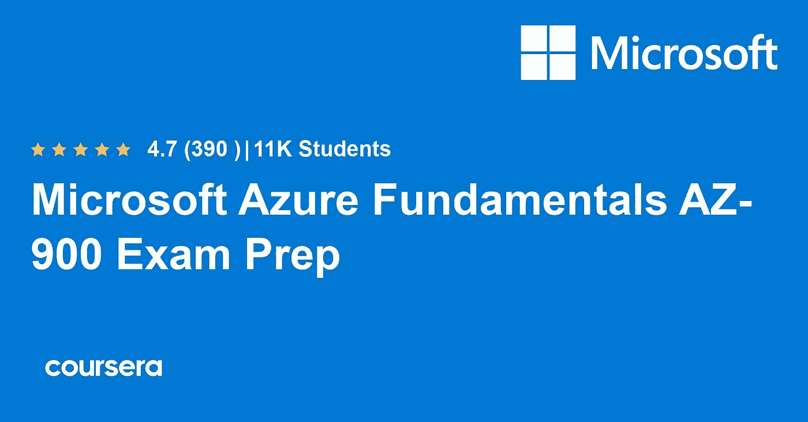
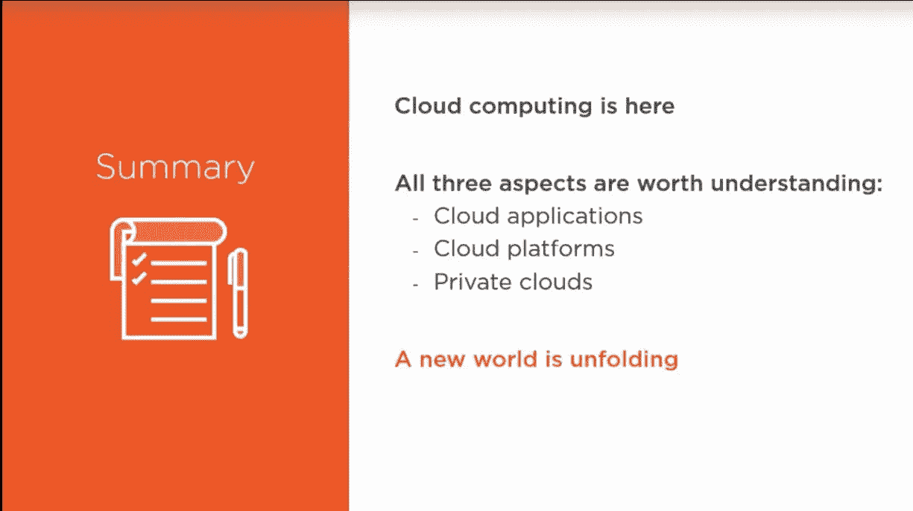
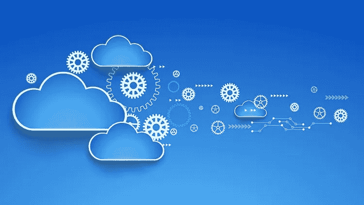
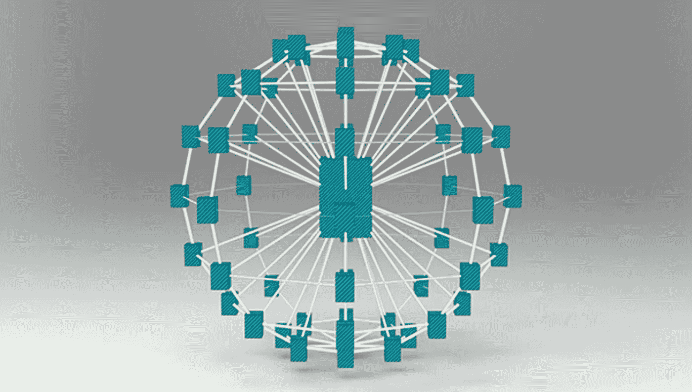
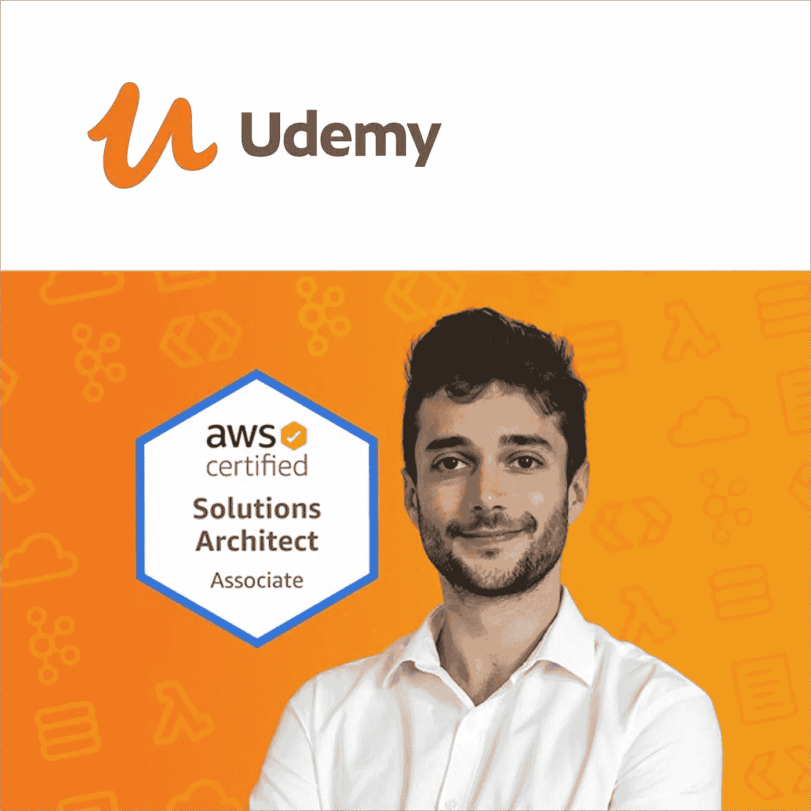
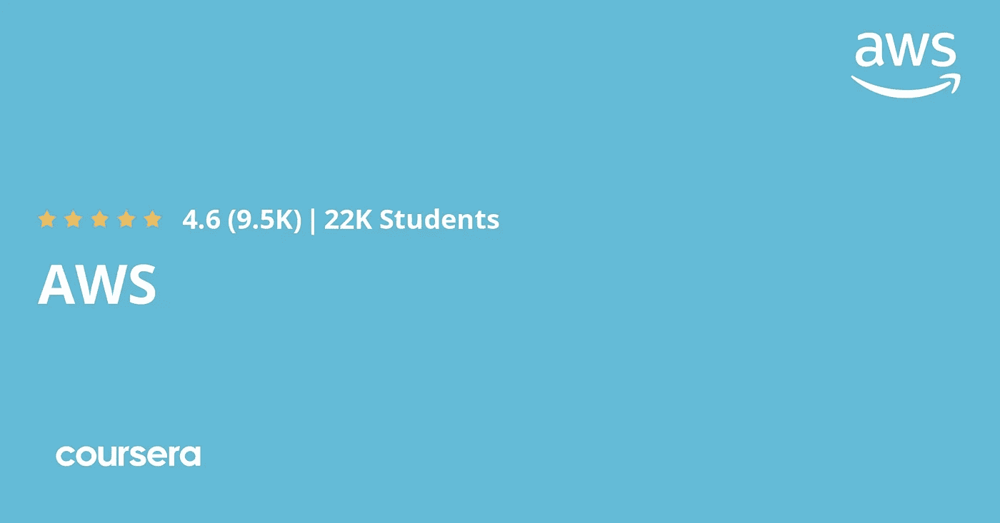

# 2023 年最值得学习的 5 门云计算课程

> 原文：<https://medium.com/javarevisited/5-best-cloud-computing-courses-to-learn-in-2020-f5f091159401?source=collection_archive---------0----------------------->

大家好，随着越来越多的公司转向云计算来满足其基础设施和服务需求，云计算正在成为任何软件开发人员或 IT 专业人员的一项基本技能。

今天 [*学习云计算*](https://javarevisited.blogspot.com/2019/07/top-5-online-courses-to-learn-cloud-computing-aws.html)*是值得的，因为未来最有可能的应用程序将在云中单独构建和部署。*

*不管你的角色是什么，如果你在技术领域工作，云计算会以某种方式影响你。*

*无论如何，如果你想学习云计算，那么你来对地方了，在这篇文章中，我将分享一些学习云计算基础知识的最佳课程，特别是与 [AWS](https://javarevisited.blogspot.com/2019/05/top-5-courses-to-crack-aws-solutions-architect-associate-certification-exam-SAA-C01.html) 和 [GCP](https://javarevisited.blogspot.com/2019/07/top-5-google-cloud-platform-gcp-courses-certifications-online.html) 的课程。

老实说，我很难找到一门学习云计算的优秀课程，在尝试了几门关于 [Udemy](https://javarevisited.blogspot.com/2019/08/top-10-udemy-courses-and-certifications-for-programmers.html) 、 [Pluralsight](https://javarevisited.blogspot.com/2019/10/udemy-vs-pluralsight-review-which-is-better-to-learn-code.html) 、 [Educative](https://javarevisited.blogspot.com/2020/01/top-10-free-interactive-online-courses.html) 和 [Coursera](https://javarevisited.blogspot.com/2020/02/10-best-coursera-courses--for-python.html) 的课程后，我最终锁定了以下五个方向来学习云计算的基础知识。

这些课程广泛介绍了云计算的各个方面，但在开始学习这些课程之前，让我们先了解什么是云以及它能带来哪些好处？**云解决了什么问题，**为什么有这么多关于它的讨论？

嗯，云对不同的人有不同的含义，在不同的上下文中也用来指代不同的事物，但一般来说，云意味着一系列可随时用于您的应用程序的服务。有很多云服务提供商公司像 AWS ( [亚马逊网络服务](https://hackernoon.com/top-5-amazon-web-services-or-aws-courses-to-learn-online-free-and-best-of-lot-d94e192054b7))、GCP ( [谷歌云平台](https://www.java67.com/2020/07/5-free-courses-to-learn-google-cloud-platform-and-concepts.html))、微软 Azure 都提供这些服务。

现在，那些服务是什么？这些可能是服务器、网络、存储、计算能力和其他基础设施相关的服务，通常被称为 IaaS(基础设施即服务)。*

*还有其他云模式，如 **PaaS** (平台即服务)和 **SaaS** (软件即服务)，它们只不过是云应用程序，非常流行于构建在线产品和创业公司，但让我们首先关注 IaaS，以了解[云](https://javarevisited.blogspot.com/2020/08/top-10-coursera-certifications-to-learn-cloud-computing-aws.html)提供的好处。

不久前，为了托管一个真实世界的电子商务应用程序，您需要购买服务器、网络和存储设备，并需要按照您的要求进行设置，例如安装所需的软件和操作系统。大多数公司都有自己的数据中心来保存这些服务器，维持这些数据中心的运行需要很高的成本。

设置服务器只是初始时间和成本，而且利用率很低；例如，辅助服务器经常处于闲置状态，浪费了宝贵的 CPU 和内存资源。这种影响在那些拥有遍布全球多个数据中心的数千台服务器的大公司身上更加明显。

亚马逊就是这样一家公司，他们很快意识到，通过使用虚拟化，他们可以使用基础设施的计算能力，这就催生了云。*

*在云中，你可以启动[服务器](https://javarevisited.blogspot.com/2018/12/top-5-free-microsoft-sql-server-and-transact-sql-online-courses.html#axzz5hG3koJem)、[数据库](https://javarevisited.blogspot.com/2018/05/top-5-sql-and-database-courses-to-learn-online.html)，只需点击几下鼠标就能快速联网，而且你只需为你使用的任何东西付费。因此，这解决了设置、利用率和可伸缩性的问题。*

# *初学者学习云计算的 5 大在线课程*

*现在，您已经了解了什么是云，以及它在成本、安装简易性、效率和可扩展性方面提供了哪些优势，是时候深入了解并浏览这些在线培训课程了，这些课程将帮助您更好地学习云计算基础知识。*

## *1.[亚马逊网络服务云计算简介](https://click.linksynergy.com/deeplink?id=JVFxdTr9V80&mid=39197&murl=https%3A%2F%2Fwww.udemy.com%2Fintroduction-to-cloud-computing-with-amazon-web-services%2F)*

*当我开始学习云的时候，它对我来说是一个非常抽象的东西；我不明白什么是云，为什么每个人都在谈论云。这就像一个没有脸的人，但当我了解 AWS 时，我可以很快地将各种云概念联系起来。

所以， [AWS](https://javarevisited.blogspot.com/2020/05/top-5-amazon-web-services-aws-courses-for-beginners-and-experienced-programmers.html) 就像给云加上了一张脸，这也是为什么我向开始学习云的人推荐这门课程。

本课程通过来自 [AWS](https://hackernoon.com/top-5-online-courses-to-crack-amazon-web-service-aws-solutions-architect-associate-exam-saa-c01-c667514ca72) 的示例解释了云的关键概念，如 Iaas、PaaS 和 Saas，这使得学习什么是云以及云提供的好处变得很容易。

了解 AWS 也是一个优势，因为它是最受欢迎的云平台之一，你在 AWS 方面的经验也将提升你在任何 AWS 工作或需要 [AWS 技能](/javarevisited/11-essential-skills-to-become-software-developer-in-2020-c617e293e90e?source=---------7------------------)的开发人员工作中的简历。*

*以下是加入本课程的链接— [亚马逊网络服务云计算简介](https://click.linksynergy.com/deeplink?id=JVFxdTr9V80&mid=39197&murl=https%3A%2F%2Fwww.udemy.com%2Fintroduction-to-cloud-computing-with-amazon-web-services%2F)*

**

## *2.[微软 Azure 基础 AZ-900 考试准备专业化](https://coursera.pxf.io/c/3294490/1164545/14726?u=https%3A%2F%2Fwww.coursera.org%2Fspecializations%2Fmicrosoft-azure-fundamentals-az-900)【Coursera】*

*无论你是想学习云计算基础知识，还是想准备 Azure Fundamentals AZ-900 考试，这门课程都非常适合开始你的云计算之旅。*

*这门课程是由微软自己提供的，它非常适合启动你在云计算领域的职业生涯，并为 Azure 基础考试做准备。*

*该微软认证课程由四门课程组成，将作为基础知识的基石，为您准备 AZ-900 认证考试和云计算职业生涯。*

*该计划将提供关于 Microsoft Azure 概念的基础知识；核心微软 Azure 服务；核心解决方案和管理工具；一般安全和网络安全；治理、隐私和合规性特征；微软 Azure 成本管理和服务水平协议。*

*总的来说，这是一门理想的云计算和 Azure 课程，适合刚刚开始使用 Microsoft Azure 的 IT 人员或任何想了解它的人。*

***这里是加入这个项目的链接**——[微软 Azure 基础 AZ-900 考试准备专业化](https://coursera.pxf.io/c/3294490/1164545/14726?u=https%3A%2F%2Fwww.coursera.org%2Fspecializations%2Fmicrosoft-azure-fundamentals-az-900)*

**

## *3.[云计算:大卫·沙佩尔著](https://pluralsight.pxf.io/c/1193463/424552/7490?u=https%3A%2F%2Fwww.pluralsight.com%2Fcourses%2Fcloud-computing-big-picture)*

*你们中的一些人可能知道我也有 Pluralsight 会员资格，这是我最喜欢的在线学习场所之一。*

*因此，当我开始学习云计算的一般知识，特别是 [AWS](/javarevisited/top-10-courses-to-learn-amazon-web-services-aws-cloud-in-2020-best-and-free-317f10d7c21d) 时，我查看了 Pluralsight 的一些学习资料，并迷上了这门课程。

本课程很好地概述了云平台，包括[亚马逊 Web 服务](/javarevisited/top-5-aws-training-courses-to-crack-amazon-web-service-solutions-architect-associate-certification-3f4affa8f660?source=collection_home---4------0-----------------------)和[微软 Azure](https://javarevisited.blogspot.com/2020/02/top-5-courses-to-crack-az-900-microsoft-azure-fundamentals-certification-exam.html) ，以及私有云(在内部部署云技术)。当你完成时，你会知道云计算是怎么回事，并准备开始探索具体的实现。*

***这是加入本课程的链接**——[大卫·沙佩尔的《云计算:大图景》](https://pluralsight.pxf.io/c/1193463/424552/7490?u=https%3A%2F%2Fwww.pluralsight.com%2Fcourses%2Fcloud-computing-big-picture)*

**

*所以，如果你有 [**复数会员**](http://pluralsight.pxf.io/c/1193463/424552/7490?u=https%3A%2F%2Fwww.pluralsight.com%2Flearn) ，这个课程就是为你准备的。如果你没有会员资格，它是值得的，因为你只需每月 29 美元或每年 299 美元就可以获得近 6000 多门顶级课程。如果你想尝试，你也可以通过参加他们的 [**10 天免费试用**](https://javarevisited.blogspot.com/2017/12/top-10-pluralsight-courses-java-and-web-developers.html) 来免费获得这门课程。*

* [## 2023 年 Java 和 Web 开发人员需要学习的 10 大 Pluralsight 课程——最棒的

### 从上周开始，我一直在分享我的 2023 年学习目标，以及 Java 程序员在 2023 年应该学些什么，但是我…

javarevisited.blogspot.com](https://javarevisited.blogspot.com/2017/12/top-10-pluralsight-courses-java-and-web-developers.html)* 

## *4.[云计算入门—第 1 级](https://click.linksynergy.com/deeplink?id=JVFxdTr9V80&mid=39197&murl=https%3A%2F%2Fwww.udemy.com%2Fgetting-started-with-cloud-computing-level-1%2F) [Udemy]*

*这是另一个关于云计算的初级 Udemy 课程，我经常推荐给我的读者。*

*本课程将为您提供什么是云计算的基本理解，并解释云计算的基本特征。

还解释了 IaaS(基础设施即服务)、SaaS(软件即服务)、PaaS(平台即服务)等 3 种主要服务模式，以及私有云、公共云、混合云和社区模式等 4 种云部署模式。

除此之外，您还将了解公共云服务的主要优势，如 [AWS](https://javarevisited.blogspot.com/2019/05/top-5-courses-to-crack-aws-solutions-architect-associate-certification-exam-SAA-C01.html#axzz5rHwAwycj) 、 [GCP](https://javarevisited.blogspot.com/2019/07/top-5-google-cloud-platform-gcp-courses-certifications-online.html) 和[微软 Azure](https://javarevisited.blogspot.com/2020/04/how-to-crack-microsoft-az-103-azure-administrator-associate-exam-certification.html) 。总的来说，这是一门优秀的云计算初学者课程，适合刚刚起步的人。*

***这是加入本课程的链接** e — [云计算入门—第 1 级](https://click.linksynergy.com/deeplink?id=JVFxdTr9V80&mid=39197&murl=https%3A%2F%2Fwww.udemy.com%2Fgetting-started-with-cloud-computing-level-1%2F)*

**

## *5.[Coursera 的云计算概念](https://coursera.pxf.io/c/3294490/1164545/14726?u=https%3A%2F%2Fwww.coursera.org%2Flearn%2Fcloud-computing)*

*这是 Coursera 上学习云计算的最佳在线课程之一。我向任何想学习云计算基础知识的人强烈推荐这门课程。

课程素材非常优秀，导师 Indranil Gupta 也是现象级。他特别细心，他的表达也很出色，这使得学习成为一种快乐的经历。

除此之外，考试非常棒，有助于你记住所学的知识。这门课程也是 Coursera 的 [**云计算专业化**](https://coursera.pxf.io/c/3294490/1164545/14726?u=https%3A%2F%2Fwww.coursera.org%2Fspecializations%2Fcloud-computing) 的一部分，它只不过是一些学习云计算不同领域的个人会议的集合。*

***这是加入本课程**—[Coursera](https://coursera.pxf.io/c/3294490/1164545/14726?u=https%3A%2F%2Fwww.coursera.org%2Flearn%2Fcloud-computing)的云计算概念的链接*

**

*本课程也是伊利诺伊大学香槟分校 [*100%计算机科学在线硕士学位*](https://coursera.pxf.io/c/3294490/1164545/14726?u=https%3A%2F%2Fwww.coursera.org%2Fdegrees%2Fmaster-of-computer-science-illinois) 的一部分。如果你参加了完整的项目，你的课程也将计入你的学位学习。*

*对于在线学习者，这个专业提供了自定进度的学习选项、练习测验、带同行反馈的评分作业、评分测验和可共享的证书，您可以将它们放在您的 LinkedIn 个人资料中。*

## *6.[终极 AWS 认证解决方案架构师助理 2023！](https://click.linksynergy.com/deeplink?id=JVFxdTr9V80&mid=39197&murl=https%3A%2F%2Fwww.udemy.com%2Fcourse%2Faws-certified-solutions-architect-associate-saa-c02%2F)*

*跟你说实话，这是对我来说教你最多的关于云和云计算的课程。*

*当我开始准备 [AWS 认证解决方案架构师考试](https://www.java67.com/2020/04/how-to-paas-aws-certified-solution-architect-exam-in-2020.html)时，我学到了最多；不幸的是，我无法继续下去，需要中途放弃，因为我没有任何时间进一步参加考试，但参加这个课程对我来说是最好的决定。

导师夏羽·马雷克是著名的云专家之一，也是一位 AWS 英雄，鉴于他们对 [AWS 云](https://javarevisited.blogspot.com/2020/05/top-5-amazon-web-services-aws-courses-for-beginners-and-experienced-programmers.html#axzz6NSsyt5xB)的丰富经验和深入了解，这是非常正确的。他们还持有你能想到的大部分 AWS 云认证。*

***以下是参加本课程的链接—**[2023 年 AWS 认证解决方案架构师终极助理！](https://click.linksynergy.com/deeplink?id=JVFxdTr9V80&mid=39197&murl=https%3A%2F%2Fwww.udemy.com%2Fcourse%2Faws-certified-solutions-architect-associate-saa-c02%2F)*

**

*这是通过 AWS 解决方案架构师助理考试的[最佳课程，但它也教你许多关于 AWS 云计算的小细节。您将了解您每天在云上使用的服务是如何工作的，如 S3、IAM 等。

谈到社会证明，这门课程在 132，775 个评分和 417，354 名注册学生中平均获得 4.5 分，这对于任何想象来说都是巨大的。毫无疑问，这门课程是我的 Udemy 上最畅销的课程，我见过的大多数 AWS 认证的人都学过这门课程。](https://javarevisited.blogspot.com/2019/05/top-5-courses-to-crack-aws-solutions-architect-associate-certification-exam-SAA-C01.html#axzz5sc8WyVHT)*

## *7. [AWS 基础专业](https://coursera.pxf.io/c/3294490/1164545/14726?u=https%3A%2F%2Fwww.coursera.org%2Fspecializations%2Faws-fundamentals)【Coursera 最佳 AWS 课程】*

*如果你正在寻找一个 Coursera 课程来学习亚马逊网络服务的云计算，那么这个由 AWS 本身提供的 AWS 基础专业是一个很好的开始。*

*这个 Coursera 认证项目很好地概述了 Amazon Web Services (AWS)的特性、优势和功能。*

*Coursera AWS 专业化包含四门在线课程，让您详细了解核心 AWS 服务、关键 AWS 安全概念、从内部迁移到 AWS 的策略，以及使用 AWS 构建[无服务器](/javarevisited/7-best-serverless-and-aws-lambda-courses-to-learn-in-2021-de1820111c85)应用程序的基础知识。*

*此外，您将有机会通过完成由 AWS 技术讲师开发的实验和练习来实践您所学到的知识。这使得它成为 Coursera 上最适合初学者的 AWS 课程，我强烈推荐给想用 AWS 学习云计算的人。*

***这是加入本课程的链接**——[AWS 基础专业](https://coursera.pxf.io/c/3294490/1164545/14726?u=https%3A%2F%2Fwww.coursera.org%2Fspecializations%2Faws-fundamentals)*

**

*顺便说一句，如果你觉得 Coursera 课程和专业有用，那么你也应该加入 Coursera Plus ，这是 Coursera 的一个订阅计划，为你提供无限制的访问**他们最受欢迎的课程、专业、专业证书和指导项目的机会。它每年花费大约 399 美元，但是它完全物有所值，因为你得到了*无限证书****

* [## Coursera Plus |无限制访问 7，000 多门在线课程

### 用 Coursera Plus 投资你的职业目标。无限制访问 90%以上的课程、项目…

coursera.pxf.io](https://coursera.pxf.io/c/3294490/1164545/14726?u=https%3A%2F%2Fwww.coursera.org%2Fcourseraplus) 

以上是关于学习云计算的一些最好的在线课程。没有比今天更好的学习云计算的时间了，我建议每个程序员学习并熟悉云计算，因为无论你在做什么，你的工作都会受到云的影响，如果你现在不注意，你将来就会落后。

只要了解一下像 [AWS](https://hackernoon.com/top-5-online-courses-to-crack-amazon-web-service-aws-solutions-architect-associate-exam-saa-c01-c667514ca72) 、 [GCP](https://javarevisited.blogspot.com/2019/07/top-5-google-cloud-platform-gcp-courses-certifications-online.html) 和[微软 Azure](https://javarevisited.blogspot.com/2019/07/top-5-courses-to-crack-azure-architecture-technologies-certification-az-300-exam.html) 这样的公共云平台，也会帮助你快速找到工作，因为越来越多的公司正在寻找能够在这些公共云上运营的专业人士。换句话说，云计算对于 [IT 专业人士](/javarevisited/18-coursera-courses-you-can-join-in-2020-to-learn-from-the-worlds-top-tech-companies-google-74af46967d1e?source=collection_home---4------0-----------------------)来说是一个得心应手的技能，你要注意。

其他 **IT 和云认证文章**您可能喜欢:

*   [如何成为 DevOps 工程师？](https://hackernoon.com/the-2018-devops-roadmap-31588d8670cb?gi=8829080e6d7d)
*   [破解 AWS 解决方案架构师专业考试的前 5 门课程](https://javarevisited.blogspot.com/2020/04/top-5-course-to-crack-aws-solution-architect-professional-sap-c01-certification-exam.html)
*   [如何通过 Spring Core Professional 5.0 认证](https://javarevisited.blogspot.com/2018/08/how-to-crack-spring-core-professional-certification-exam-java-latest.html)
*   [破解 AWS DevOps 工程师考试的前 5 门课程](https://javarevisited.blogspot.com/2020/04/top-5-course-to-crack-aws-certified-devops-engineer-professional-exam-certification.html)
*   [如何破解甲骨文 2023 年 Java 认证？](https://medium.freecodecamp.org/how-to-pass-oracles-java-certifications-a-practical-guide-for-developers-e9b607ba6173)
*   [10 门免费学习数据结构和算法的课程](http://www.java67.com/2019/02/top-10-free-algorithms-and-data.html)
*   [如何破解 Azure Fundamentals (AZ-900)认证](https://javarevisited.blogspot.com/2020/04/how-to-crack-microsoft-azure-fundamentals-certification-az-900-exam.html)
*   [学习 Docker 和 Kubernetes 的十大课程](https://dev.to/javinpaul/top-10-courses-to-learn-docker-and-kubernetes-for-programmers-4lg0)
*   [程序员前 5 名 AZ-900 模拟测试](https://javarevisited.blogspot.com/2020/02/top-5-AZ-900-exam-Azure-Fundamentals-certification-practice-tests-and-mock-exams-to.html)
*   [如何破解 Azure 管理员助理认证(AZ-103)](https://javarevisited.blogspot.com/2020/04/how-to-crack-microsoft-az-103-azure-administrator-associate-exam-certification.html)
*   [10 门数据科学和机器学习认证课程](https://dev.to/javinpaul/10-data-science-and-machine-learning-courses-for-programmers-looking-to-switch-career-57kd)
*   [通过 AWS 解决方案架构师的 5 次免费模拟测试](https://javarevisited.blogspot.com/2019/08/top-5-free-aws-solution-architect-Associate-certification-dumps-practice-questions.html)
*   [通过谷歌助理云工程师认证的前 5 门课程](https://javarevisited.blogspot.com/2019/07/top-5-google-cloud-platform-gcp-courses-certifications-online.html)
*   [每个软件开发人员都应该学习的 10 件事](https://dev.to/javinpaul/10-things-every-software-developer-should-know-39pe)
*   [破解 Azure 云架构师(AZ-300)考试的前 5 门课程](https://javarevisited.blogspot.com/2019/07/top-5-courses-to-crack-azure-architecture-technologies-certification-az-300-exam.html#axzz6E6VuRMsx)
*   [破解 AWS 解决方案架构师职业认证的 5 大课程](https://javarevisited.blogspot.com/2020/04/top-5-course-to-crack-aws-solution-architect-professional-sap-c01-certification-exam.html)

感谢您阅读本文。如果你喜欢这些云计算在线课程，那么请分享给你的朋友和同事。如果您有任何问题或反馈，请留言。

**p . s .**——如果你是云计算和 AWS 的新手，正在寻找一些学习亚马逊 Web 服务的免费课程，那么你也可以查看一下这个为初学者提供的 [**免费 AWS 课程列表**](http://www.java67.com/2018/05/top-5-amazon-web-services-or-aws-courses-to-learn-online.html) 。

 [## 我最喜欢的学习亚马逊网络服务(AWS)和云计算的初学者课程

### 大家好，如果你想学习亚马逊网络服务，俗称 AWS，并寻找一些优秀的资源…

medium.com](/javarevisited/top-10-courses-to-learn-amazon-web-services-aws-cloud-in-2020-best-and-free-317f10d7c21d)*