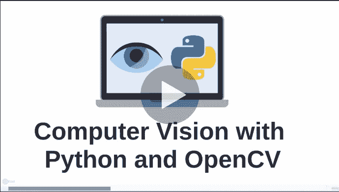
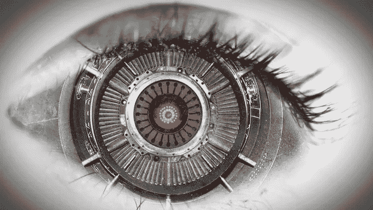
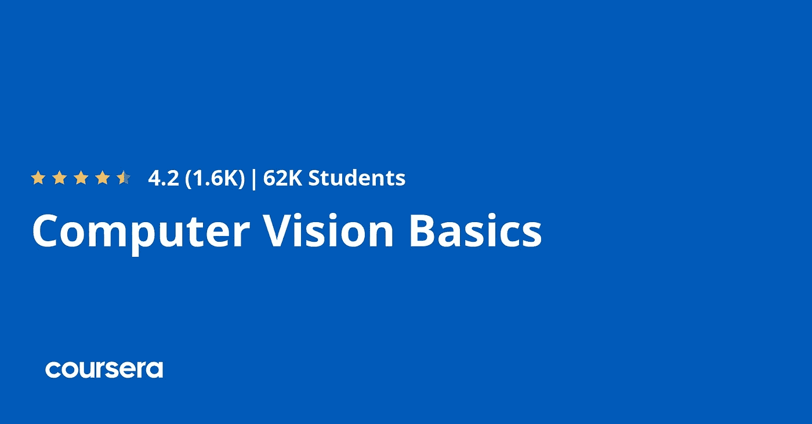
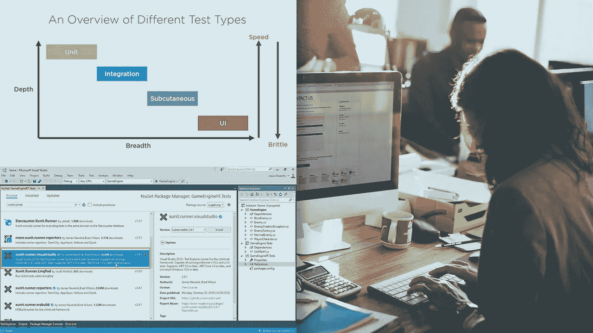

# 2023 年最适合初学者的 5 门计算机视觉课程

> 原文：<https://medium.com/javarevisited/5-best-computer-vision-courses-for-beginners-85f901a8f88a?source=collection_archive---------0----------------------->

## 我在 Udemy、Coursera、Pluralsight 和其他在线门户网站上列出的学习 Python 计算机视觉的最佳在线课程。

image_credit — Coursera

大家好，如果你想从头开始学习计算机视觉和 OpenCV，并从 Udemy、Coursera 和 Pluralsight 寻找最好的计算机视觉在线课程，那么你来对地方了。

之前我已经分享了 Coursera 和 Udemy 的 [**学习 Python**](/better-programming/top-5-courses-to-learn-python-in-2018-best-of-lot-26644a99e7ec)[数据科学](/javarevisited/top-10-machine-learning-and-data-science-certifications-and-training-courses-for-beginners-and-a6308497b764?source=extreme_sidebar---------0-2----------------------)[机器学习](https://javarevisited.blogspot.com/2020/08/top-10-coursera-courses-and-certification-for-artificial-intelligence-and-machine-learning.html)的最佳在线课程，而在这篇文章中，我将分享学习计算机视觉和 OpenCV 的最佳在线培训课程。

该列表包括初学者和有经验的程序员的课程，他们想学习计算机视觉和开放简历的先进概念。

这是[机器学习](https://www.java67.com/2020/06/top-5-data-science-degree-you-can-earn-online-coursera-edx.html)和[人工智能](https://www.java67.com/2019/11/top-5-artificial-intelligence-courses.html)最现有的领域之一，在物体检测、无人驾驶汽车、机器人等行业都有应用。

如果你不知道， [**计算机视觉**](/javarevisited/2-projects-to-learn-computer-vision-and-open-cv-for-beginners-1e0479ed171b) 简单来说就是让机器看到并检测、跟踪、分类、分析物体，或者任何与处理图像和视频相关的任务的科学或领域。并且， [OpenCV](https://opencv.org/) 是一个流行的 Python 库，它允许你做像图像过滤等事情。

学习计算机视觉可以让你掌握当今需求的主要领域之一，并让你在不同领域创建令人惊叹的项目，如自动驾驶汽车、癌症等疾病诊断、创建如今在军队中广泛使用的智能武器制导系统等等。

在本文中，你将学习许多让你掌握计算机视觉的在线课程，其中一些课程将向你展示如何用计算机视觉更准确地实现[深度学习](https://javarevisited.blogspot.com/2019/08/top-5-courses-to-learn-deep-learning.html)，这些课程的好处是，每门课程都有其独特的编程语言，用于执行这些处理图像和视频的任务。

# 2023 年学习计算机视觉的 5 门最佳在线课程

在不浪费你更多时间的情况下，这里有一个在家里或办公室学习计算机视觉和 OpenCV 的最佳在线培训课程列表。

这些课程由专家创建，受到全球成千上万人的信任。他们也很实惠，而且你只需花 10 美元就能在不时举办的 T21 网上买到大多数课程。

## 1.[使用 OpenCV 的计算机视觉 Python](https://click.linksynergy.com/deeplink?id=JVFxdTr9V80&mid=39197&murl=https%3A%2F%2Fwww.udemy.com%2Fcourse%2Fpython-for-computer-vision-with-opencv-and-deep-learning%2F)【Udemy 最佳课程】

这是 Python 开发者学习计算机视觉和 OpenCV 库最好的 Udemy 课程之一。本课程将带您了解如何使用 python 和 OpenCV 的基础知识，学习用于分析和检测图片或视频中的对象的方法。

这个课程不是别人，正是由 Udemy 上的[何塞·波尔蒂利亚](https://click.linksynergy.com/deeplink?id=JVFxdTr9V80&mid=39197&murl=https%3A%2F%2Fwww.udemy.com%2Fuser%2Fjoseportilla%2F)、 [**完整 Python Bootcamp**](https://click.linksynergy.com/deeplink?id=JVFxdTr9V80&mid=39197&murl=https%3A%2F%2Fwww.udemy.com%2Fcourse%2Fcomplete-python-bootcamp%2F) 和 [**完整 SQL Bootcamp**](https://click.linksynergy.com/deeplink?id=JVFxdTr9V80&mid=39197&murl=https%3A%2F%2Fwww.udemy.com%2Fcourse%2Fthe-complete-sql-bootcamp%2F) 课程的讲师所创建，这两个课程都有数百万开发者加入。以下是您将在本课程中学到的内容:

*   计算机视觉基础(OpenCV)
*   创建像人脸检测这样的识别软件。
*   使用深度学习开发图像分类器。

该课程将从如何使用 OpenCV 和如何处理图像开始，然后教你如何使用 OpenCV 开发许多不同的应用程序，如人脸检测、对象检测和流式视频。

**这里是加入这个精彩课程的链接** — [Python 与 OpenCV 的计算机视觉](https://click.linksynergy.com/deeplink?id=JVFxdTr9V80&mid=39197&murl=https%3A%2F%2Fwww.udemy.com%2Fcourse%2Fpython-for-computer-vision-with-opencv-and-deep-learning%2F)

## 2.[深度学习与计算机视觉 A-Z](https://click.linksynergy.com/deeplink?id=JVFxdTr9V80&mid=39197&murl=https%3A%2F%2Fwww.udemy.com%2Fcourse%2Fcomputer-vision-a-z%2F)【Udemy 课程】

这是另一个学习计算机视觉和深度学习的奇妙的 Udemy 课程。在本课程中，您不仅将掌握如何通过 python 编程语言使用 OpenCV，还将在实践中学习深度学习，以及如何通过计算机视觉实现它，以及本课程的特别之处。

该课程向您展示了一系列与 OpenCV 一起用于[计算机视觉](https://opencv.org/)的工具，然后实现人工智能来创建一些程序，如精确的人脸检测软件、对象检测和使用人工智能创建图像。

以下是您将在本课程中学到的重要内容:

*   基于 OpenCV 的人脸和物体检测软件。
*   用计算机视觉实现深度学习。
*   学习人工智能。

总的来说，2023 年在 Udemy 上学习[深度学习](/javarevisited/top-5-advanced-deep-learning-and-neural-network-courses-to-learn-in-2020-a273f5eddca5)和计算机视觉是一门很棒的课程。这也是一个非常实惠的课程，你可以在 Udemy 销售中获得 10 美元，这种销售时有发生。

**这里是加入本课程 OpenCV 课程**——[深度学习和计算机视觉 A-Z](https://click.linksynergy.com/deeplink?id=JVFxdTr9V80&mid=39197&murl=https%3A%2F%2Fwww.udemy.com%2Fcourse%2Fcomputer-vision-a-z%2F) 的链接

## 3.[计算机视觉基础— Coursera](https://coursera.pxf.io/c/3294490/1164545/14726?u=https%3A%2F%2Fwww.coursera.org%2Flearn%2Fcomputer-vision-basics) 【免费课程】

如果你熟悉 Matlab，并想开始你在计算机视觉方面的冒险，那么这个程序对你来说是正确的，因为它将教你计算机视觉的基础知识，以及如何用 [Matlab](https://javarevisited.blogspot.com/2022/02/top-5-courses-to-learn-matlab-for.html) 实现它。本课程将教你人类如何看的关键要素，以及机器如何实现这一要素来完成计算机视觉任务，然后将带你进入一些代码，以获得关于该主题的实践经验。在课程期间，你将获得安装 Matlab 的免费许可证。

在本课程中，您将学到:

*   人类如何在现实世界中看到事物并做出反应。
*   计算机视觉如何在物体识别中模仿人类。
*   用 Matlab 代码实现计算机视觉。

这是一门 [**免费的 Coursera 课程**](https://dev.to/javinpaul/20-best-coursera-certifications-courses-from-google-facebook-ibm-amazon-aws-alibaba-cloud-sas-to-join-in-2021-45j) ，你可以免费报名。这门计算机视觉课程由布法罗大学和纽约州立大学提供。

**这是加入这个令人敬畏的课程**——[计算机视觉基础](https://coursera.pxf.io/c/3294490/1164545/14726?u=https%3A%2F%2Fwww.coursera.org%2Flearn%2Fcomputer-vision-basics)的链接

## 4.[在中开始使用 OpenCV。NET](https://pluralsight.pxf.io/c/1193463/424552/7490?u=https%3A%2F%2Fwww.pluralsight.com%2Fcourses%2Fgetting-started-opencv-net)【plural sight 最佳课程】

在本课程中，您将学习如何使用 OpenCV。微软开发的. NET 框架，它会告诉你用属于微软的 c++编程语言写一些代码，然后打包。

你将编写对象检测、运动检测、人脸检测和识别的代码，然后向你展示如何使用 NVidia Cuda 来加速计算机视觉的过程。

以下是您将在本课程中学到的内容:

*   计算机视觉的工作原理。
*   编写计算机视觉代码。NET 框架。
*   在你的程序中实现 NVidia Cuda。

**以下是在 Pluralsight** — [上加入本课程的链接。网络](https://pluralsight.pxf.io/c/1193463/424552/7490?u=https%3A%2F%2Fwww.pluralsight.com%2Fcourses%2Fgetting-started-opencv-net)

顺便说一句，你需要一个 Pluralsight 会员才能参加这个课程，费用大约是每月 29 美元或每年 299 美元(14%的折扣)。或者，您也可以利用他们的 [**10 天免费试用期**](https://pluralsight.pxf.io/c/1193463/424552/7490?u=https%3A%2F%2Fwww.pluralsight.com%2Flearn) 来免费学习这门课程。

 [## 对个人来说

### 无论你想进入一个新的领域，改善你的角色，还是把你的伟大想法变成现实，Pluralsight…

pluralsight.pxf.io](https://pluralsight.pxf.io/c/1193463/424552/7490?u=https%3A%2F%2Fwww.pluralsight.com%2Flearn) 

## 5.[使用 Watson 和 OpenCV 介绍计算机视觉](https://coursera.pxf.io/c/3294490/1164545/14726?u=https%3A%2F%2Fwww.coursera.org%2Flearn%2Fintroduction-computer-vision-watson-opencv)

如果你想用 python 学习计算机视觉，并且想一个接一个地安装所有的库，那么你应该看看 Coursera 上的这个在线 OpenCV 和 Watson 课程，它会让你直接在云上创建你的程序。

您将在本课程中学习到:

*   计算机视觉及其各种应用。
*   用 python 和 OpenCV 创建一个计算机视觉程序。
*   将您的代码部署到云中。

这个 Coursera 计算机视觉课程也是 IBM 应用人工智能专业证书的一部分，它是由 IBM 提供的，IBM 是最负盛名和最古老的科技公司之一，也是沃森人工智能背后的公司。

**这是加入本课程的链接**——[沃森和 OpenCV 计算机视觉简介](https://coursera.pxf.io/c/3294490/1164545/14726?u=https%3A%2F%2Fwww.coursera.org%2Flearn%2Fintroduction-computer-vision-watson-opencv)

而且，如果你觉得 Coursera 的课程和认证有用，那么我也建议你加入 [**Coursera Plus**](https://coursera.pxf.io/c/3294490/1164545/14726?u=https%3A%2F%2Fwww.coursera.org%2Fcourseraplus) ，这是 Coursera 的一个订阅计划，让你可以无限制地访问他们最受欢迎的课程、专业、专业证书和指导项目。它每年花费大约 399 美元，但是它完全值得你的钱，因为你没有任何额外的费用就可以获得无限制的证书。

 [## Coursera Plus |无限制访问 7，000 多门在线课程

### 用 Coursera Plus 投资你的职业目标。无限制访问 90%以上的课程、项目…

coursera.pxf.io](https://coursera.pxf.io/c/3294490/1164545/14726?u=https%3A%2F%2Fwww.coursera.org%2Fcourseraplus) 

以上就是关于**学习计算机视觉和用 Python 打开 CV 库的最佳在线课程**。计算机视觉是机器学习和人工智能中最令人兴奋的领域之一。它在许多行业都有应用，如人脸检测、自动驾驶汽车、机器人、增强现实等。

这些课程肯定会教你如何掌握这个行业中最受欢迎的工作之一，这个行业价值超过 80 亿美元，读完这篇文章后，通过参加我上面列出的课程，你离进入这个领域更近了一步。

其他有用的**数据科学和机器学习**资源

*   [2023 年学习 Python 的 5 大课程](http://javarevisited.blogspot.sg/2018/03/top-5-courses-to-learn-python-in-2018.html)
*   [哈佛和 IBM 的 9 门数据科学课程](https://becominghuman.ai/9-data-science-and-machine-learning-courses-by-harvard-ibm-udemy-and-others-12a0c7c23ec1)
*   [学习自然语言处理(NLP)的 5 门最佳课程](https://www.java67.com/2020/07/top-5-courses-to-learn-natural-language-processing-NLP.html)
*   [在线学习 PyTorch 和 Keras 的前 5 门课程](https://www.java67.com/2020/06/top-5-courses-to-learn-pytorch-and-keras.html)
*   [学习人工智能的 7 门最佳课程](/javarevisited/7-best-courses-to-learn-artificial-intelligence-in-2020-26d59d62f6fe?source=---------17------------------)
*   [5 门免费课程学习机器学习的 R 编程](http://www.java67.com/2018/09/top-5-free-R-programming-courses-for-Data-Science-Machine-Learning-Programmers.html)
*   [从零开始学习 Python 的前 5 本书](https://javarevisited.blogspot.com/2019/07/top-5-books-to-learn-python-in-2019.html)
*   [面向初学者的 5 大机器学习算法](https://www.java67.com/2020/07/top-5-machine-learning-algorithms-for-beginners.html)
*   [8 大 Python 机器学习库](https://javarevisited.blogspot.com/2018/10/top-8-python-libraries-for-data-science-machine-learning.html)
*   [学习 PyTorch、Keras、Sci-kit 和 MatPlotLib 的 9 门课程](https://becominghuman.ai/10-free-courses-to-learn-python-machine-learning-libraries-scikit-learn-numpy-pandas-keras-3c77ba1a6907)
*   [2023 年程序员可以学习的 10 项技术](http://www.java67.com/2018/01/top-10-web-mobile-and-big-data-framework-libraries-technologies-programmers-should-learn-in-2018.html)
*   [2023 年学习 Python 的 5 门免费课程](http://www.java67.com/2018/02/5-free-python-online-courses-for-beginners.html)
*   [学习 Tableau 进行数据可视化的 7 门最佳课程](https://becominghuman.ai/my-favorite-courses-to-learn-tableau-for-data-science-and-visualization-46623ba5b424)
*   [学习数据分析 Panadas 的 5 门最佳课程](https://becominghuman.ai/5-best-courses-to-learn-pythons-pandas-libary-for-data-analysis-and-data-science-34b62abb0e96)
*   为了学得更好，你可以做的 8 个 Python 项目
*   [Coursera 和 Udemy 的十大数据科学认证](/javarevisited/my-favorite-data-science-and-machine-learning-courses-from-coursera-udemy-and-pluralsight-eafc73acc73f?source=---------5------------------)
*   [排名前五的数据科学和机器学习课程](https://hackernoon.com/top-5-data-science-and-machine-learning-course-for-programmers-e724cfb9940a)
*   [免费学习 Python 编码的五大网站](https://javarevisited.blogspot.com/2019/09/5-websites-to-learn-python-for-free.html)
*   [tensor flow 和机器学习课程前 5 名](https://hackernoon.com/top-5-tensorflow-and-ml-courses-for-programmers-8b30111cad2c)

感谢您阅读本文。如果你觉得这些来自 Udemy、Coursera 和 Pluralsight 的*best*C*computer Vision 和 Open CV 在线课程*有用，那么请与你的朋友和同事分享。如果您有任何问题或反馈，请留言。

**附言——**如果你热衷于学习 OpenCV 和计算机视觉，但正在寻找*免费在线课程*开始学习，那么你也可以查看这个 [**使用 Python 使用 OpenCV 学习计算机视觉**](https://click.linksynergy.com/deeplink?id=JVFxdTr9V80&mid=39197&murl=https%3A%2F%2Fwww.udemy.com%2Fcourse%2Fpythoncv%2F)**——Udemy 上的一个免费课程**开始学习。超过 30K 人已经加入了这个免费的 OpenCV 课程，你也可以加入。

 [## 免费计算机视觉教程-使用 Python 学习 OpenCV 库的计算机视觉

### 我目前在南佛罗里达大学攻读电子工程学士学位。我…

udemy.com](https://click.linksynergy.com/deeplink?id=JVFxdTr9V80&mid=39197&murl=https%3A%2F%2Fwww.udemy.com%2Fcourse%2Fpythoncv%2F)