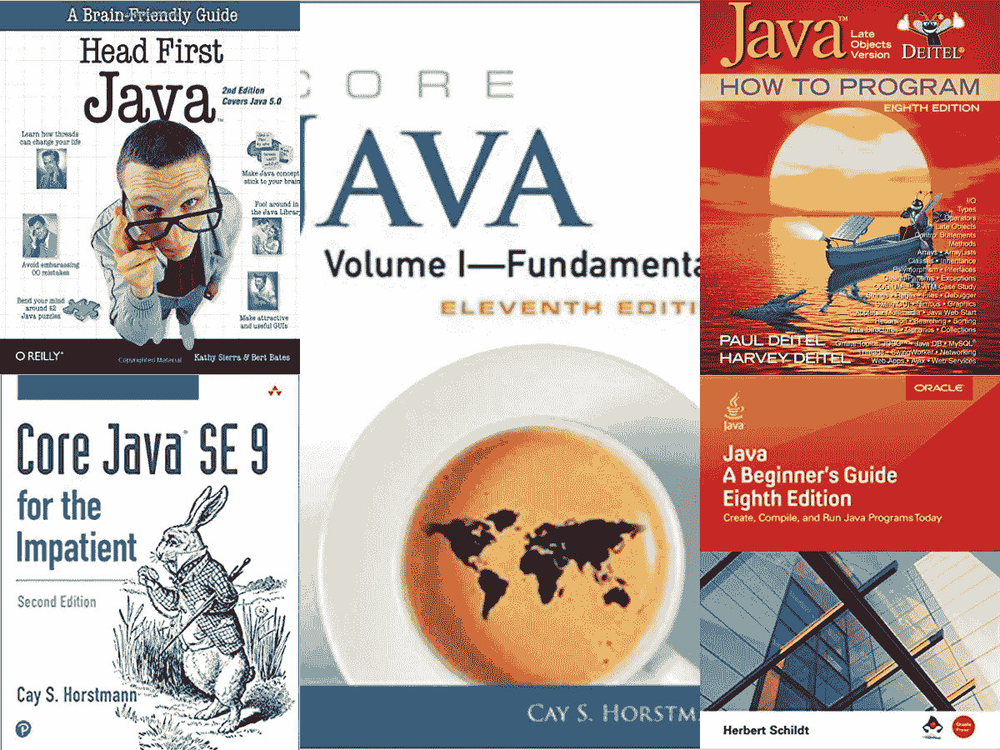
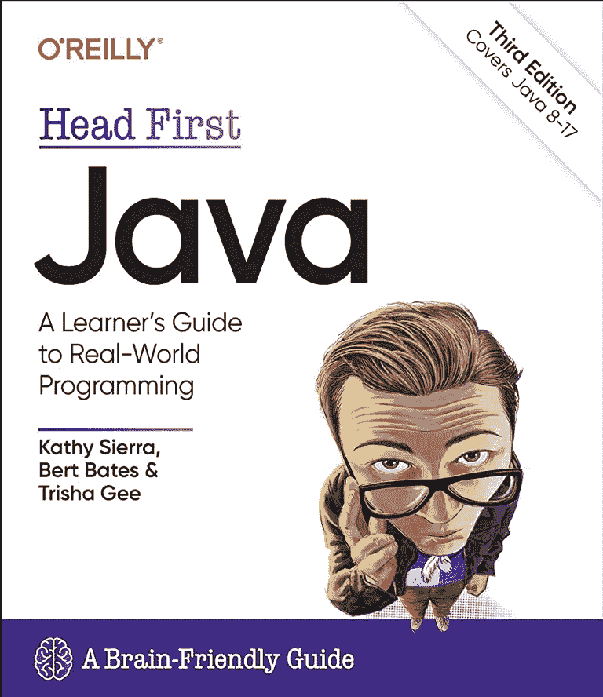
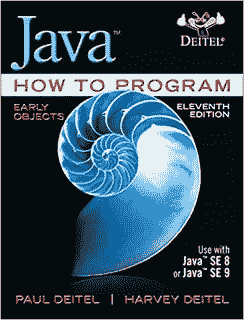
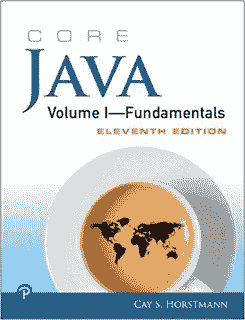

# 2023 年初学者学习编程的 5 本最佳核心 Java 书籍

> 原文：<https://medium.com/javarevisited/5-best-core-java-books-for-beginners-20e3f723e3a?source=collection_archive---------0----------------------->

## 想学 Java？这些是从头开始学习 Java 的最佳书籍

初学者最佳核心 Java 书籍

大家好，如果你是编程新手，想学习核心 java 并寻找最好的核心 Java 书籍，那么你来对地方了。前面我已经分享了 [**最适合初学者的 Java 课程**](/javarevisited/top-5-java-online-courses-for-beginners-best-of-lot-1e1e240a758) ，[学习 Java 的最佳去处](/javarevisited/10-best-places-to-learn-java-online-for-free-ce5e713ab5b2)，今天我要分享的是你学习核心 Java 可以阅读的最佳书籍。

我过去一直在分享很多关于 Java 和相关技术的书籍，像书籍和在线课程学习 [Spring](https://javarevisited.blogspot.com/2018/04/5-spring-framework-books-experienced-Java-developers-2018.html) 、 [Hibernate](https://javarevisited.blogspot.com/2018/08/top-5-hibernate-books-for-java.html) 、 [JVM 内部](https://javarevisited.blogspot.com/2019/04/top-5-courses-to-learn-jvm-internals.html)、 [Java 性能调优](https://www.java67.com/2020/04/top-5-advanced-courses-to-learn-java-perofrmance-concurrency-memory-management.html)、[多线程和并发](https://javarevisited.blogspot.com/2016/06/5-books-to-learn-concurrent-programming-multithreading-java.html)、[设计模式](https://www.java67.com/2016/10/top-5-object-oriented-analysis-and-design-patterns-book-java.html)、[数据结构和算法](/javarevisited/7-best-courses-to-learn-data-structure-and-algorithms-d5379ae2588)等。，但是我还没有为初学者分享*核心 Java 书籍。*

尽管我不时提到一些流行的书籍，但我真的没有一本完整的初学者核心 Java 书籍汇编。

由于 Java 是最受欢迎的编程语言之一，并且对于获得软件开发人员的工作非常有用，它已经成为开始学习编码和应用程序开发的编程语言的选择，因此从[核心 Java](http://www.java67.com/2015/05/best-book-to-learn-java-for-beginners.html) 开始是有意义的。

这篇文章包含了教你如何使用 Java 编程语言编码的书籍。在过去的时代，当 [C](https://javarevisited.blogspot.com/2019/11/top-5-courses-to-learn-c-programming-in.html) 和 [C++](/javarevisited/top-10-courses-to-learn-c-for-beginners-best-and-free-4afc262a544e) 统治着学术界，也是工程师和程序员用来学习如何编码的第一语言时，我们通常会有一些好的建议来开始，比如丹尼斯里奇自己的 C 编程语言[。](https://www.amazon.com/Programming-Language-Brian-W-Kernighan/dp/0131103628?tag=javamysqlanta-20)

多年来, **Head First Java** 这本书为 Java 程序员服务于同样的目的，但是它在 2023 年仍然相关吗？尤其是在 Java 13 时代？嗯，我们很快会在这篇文章中找到答案。

更重要的是，我给初学者分享了 **5 本最好的核心 Java 书籍**。我选择这些书有三个标准，第一是可读性，第二是例子，第三是内容。

这些书对于刚接触 Java 的人来说很棒，但对于已经有 1 到 2 年 Java 经验并希望填补其学习空白的人来说也很好。我还建议你将这些书中的一本与像 [**完整的 Java 大师班**](https://click.linksynergy.com/fs-bin/click?id=JVFxdTr9V80&subid=0&offerid=323058.1&type=10&tmpid=14538&RD_PARM1=https%3A%2F%2Fwww.udemy.com%2Fjava-the-complete-java-developer-course%2F) 这样的在线课程结合起来，这不仅能快速理解重要的概念，还能深入学习它们，而且现在在线课程也比书本便宜。

<https://click.linksynergy.com/fs-bin/click?id=JVFxdTr9V80&subid=0&offerid=323058.1&type=10&tmpid=14538&RD_PARM1=https%3A%2F%2Fwww.udemy.com%2Fjava-the-complete-java-developer-course%2F>  

# 2023 年初学者学习编程的 5 本最佳核心 Java 书籍

这里是我收集的一些学习核心 Java 的最佳书籍，尤其适合没有或很少有编程和 Java 经验的初学者。

这些书不仅会教你 Java 编程语言的基础知识，还会教你很多来自 Java API 的重要类，像 String、 [Java 集合框架](https://javarevisited.blogspot.com/2020/04/top-5-courses-to-learn-java-collections-and-streams.html#axzz6XMFoMrEo)、[线程](https://javarevisited.blogspot.com/2018/06/top-5-java-multithreading-and-concurrency-courses-experienced-programmers.html)、 [Java 执行器框架](https://javarevisited.blogspot.com/2017/02/difference-between-executor-executorservice-and-executors-in-java.html)、Java IO、Java 联网等。

这个书单对于那些只在学校和大学学过 Java 或者有一些编程经验的人也很有用。这些将帮助您填补对 Java 语言及其丰富的 API 的理解上的空白。

## 1.[头一个 Java【第三版】](https://www.amazon.com/Head-First-Java-Brain-Friendly-Guide/dp/1491910771?tag=javamysqlanta-20)

每当我提到 Head First Java，任何人想到的第一个问题是这本书在今天是否仍然适用，现在这不再是一个问题，因为这本书的新版本已经推出，涵盖了 Java SE 17

由于这本书很长时间没有针对 Java SE 8 进行更新，所以它显然不是最新的[初学者 Java 书](https://www.freecodecamp.org/news/must-read-books-to-learn-java-programming-327a3768ea2f/#f2fc)，但在为初学者选择书籍时，学习风格起着重要作用，Head First books 在那里得分很大。

简而言之,《Head First Java》不是最好的核心 Java 书籍，现在作者已经为 Java SE 17 更新了这本书，它将成为 2023 年学习 Java 的最佳书籍。

**这里是在亚马逊上购买这本书的链接**——[Head First Java](https://www.amazon.com/Head-First-Java-Brain-Friendly-Guide/dp/1491910771?tag=javamysqlanta-20)

另一件有利于 Head First Java 的事情是，Java 基础在过去的十年或二十年中没有太大的变化，但如果你想学得更好，你也可以将其与在线课程结合，如 [**完整的 Java master class**](https://click.linksynergy.com/fs-bin/click?id=JVFxdTr9V80&subid=0&offerid=323058.1&type=10&tmpid=14538&RD_PARM1=https%3A%2F%2Fwww.udemy.com%2Fjava-the-complete-java-developer-course%2F)**，它也更新为涵盖 Java SE 17。**

**<https://javarevisited.blogspot.com/2018/05/top-5-java-courses-for-beginners-to-learn-online.html> ** 

## **2. [Java:如何用 Deitel 和 Deitel 编程](https://www.amazon.com/Java-How-Program-9th-Deitel/dp/0132575663?tag=javamysqlanta-20)**

**这是另一本适合初学者的优秀核心 Java 书籍。它有效地结合了凯·s·霍斯特曼在两卷《核心 Java》中所做的工作，我们在上一节已经讨论过了。**

**我喜欢这本书，因为它的例子、编程错误警告信息和易懂的语言。它也是用 Java 编写的最全面的书籍之一，甚至涵盖了像[【JDBC】](http://javarevisited.blogspot.sg/2012/12/top-10-jdbc-interview-questions-answers.html)、AWT、Swing 等高级主题。

该书第 11 版涵盖了 Java 8 的所有新特性，如 [lambda 表达式](/javarevisited/7-best-java-tutorials-and-books-to-learn-lambda-expression-and-stream-api-and-other-features-3083e6038e14?source=---------14------------------)，流 API，可选 API，日期和时间 API，以及语言增强，如默认方法，接口上的静态方法等。它还涵盖了 Java 9 中引入的新特性，如集合、列表、集合和其他接口中的静态工厂方法、HTTP 2、JVM 改进等。**

**如果你对 Java 8 和 9 的更多特性，以及现在 Java 10、11、12 和 Java 13 中引入的其他特性感到好奇，可以看看 Udemy 上的这个 [**Java 新特性(Java 12、Java 11、Java 10、Java9 & Java8)**](https://click.linksynergy.com/deeplink?id=JVFxdTr9V80&mid=39197&murl=https%3A%2F%2Fwww.udemy.com%2Fcourse%2Fjava-new-features%2F) 课程。它涵盖了核心 Java 开发人员应该学习的所有重要的新特性。**

****

## **3.[为不耐烦的人准备的核心 Java](http://www.amazon.com/Core-Java-Impatient-Cay-Horstmann/dp/0321996321?tag=javamysqlanta-20)**

**我发现初学者的一个特点是他们有点不耐烦，也就是说，他们想快速学习。即使是我自己，当我开始一件全新的事情时，比如演奏一种新的乐器，我想快速学习音阶，和弦来演奏完整的歌曲。这就是为什么在向初学者推荐一本核心 Java 书籍时，我把《为没有耐心的人准备的核心 Java》放在首位。顾名思义，它解释了基本的核心 Java 概念，省略了不太重要的细节，包括了最近的细节，比如 J [ava 8 lambda 表达式，以及 Streams](https://javarevisited.blogspot.com/2018/08/top-5-java-8-courses-to-learn-online.html) 。

在 Java 13 和 Java 14 的时代，这可能是最适合初学者的 Java 书籍，但如果你想要全面覆盖，同一作者的核心 Java 第 1 卷和第 2 卷提供了这一点。**

**如果你愿意，可以把这本书和我最喜欢的 Udemy 的 [**完整 Java Masterclass**](https://click.linksynergy.com/fs-bin/click?id=JVFxdTr9V80&subid=0&offerid=323058.1&type=10&tmpid=14538&RD_PARM1=https%3A%2F%2Fwww.udemy.com%2Fjava-the-complete-java-developer-course%2F) 课程结合起来，两全其美。**

****

## **4.[凯·s·霍斯特曼的《核心 Java》第 1 卷和第 2 卷](https://www.amazon.com/Core-Java-I--Fundamentals-10th/dp/0134177304?tag=javamysqlanta-20)**

**伟大的凯·s·霍斯特曼是我最喜欢的 Java 书籍作者之一。我真的很喜欢 Cay 解释事情的方式，并用这么少的话表达这么多的内容。他不仅解释概念，还解释什么该做，什么不该做。

如果你是来自 [C](https://javarevisited.blogspot.com/2019/11/top-5-courses-to-learn-c-programming-in.html) 和 [C++](/javarevisited/top-10-courses-to-learn-c-for-beginners-best-and-free-4afc262a544e) 背景，那么这本书对你来说是一个额外的激励。它解释并比较了 C++特性和相关的 Java 特性，如构造函数、模板和泛型等。

这本书的最新版本，Core Java 第 11 版全面更新，涵盖了 Java SE 8、9、10、& 11，这意味着您将学习所有重要的新功能，如 lambda expression、 [Stream API](https://javarevisited.blogspot.com/2018/08/top-5-java-8-courses-to-learn-online.html) 、[可选的](https://www.java67.com/2018/06/java-8-optional-example-ispresent-orElse-get.html?fbclid=IwAR3_3ir-IAia8frQHZetwSqQaN3hQerLvhpq7Jukh1zD_EbPtaRjHn0rkhk#ixzz5mMbVkkfm)、[来自 Java 8 的日期和时间 API](https://javarevisited.blogspot.com/2015/03/20-examples-of-date-and-time-api-from-Java8.html)、来自 Java 9 的集合的工厂方法、来自 Java 10 的本地变量的 var 等等。**

****这里是购买这本书的链接** — [核心 Java，第 1、2 卷](https://www.amazon.com/Core-Java-I--Fundamentals-10th/dp/0134177304?tag=javamysqlanta-20)**

****

**万一你已经懂 Java，只是好奇想学习 Java 的新特性，可以查看我的课程列表，学习从 Java 9 到 Java 12 的新特性。这本书还包含了关于类似 C++特性的相关注释，这使得它可能成为 C/C++程序员的[最佳核心 Java 书籍。](http://javarevisited.blogspot.sg/2016/09/best-book-to-learn-java-for-c-CPP-programmers.html)**

## **5.Java:初学者指南**

**如果你对编程世界完全陌生，并学习如何使用 Java 编程语言编码，那么这是你应该选择的书。这本书从零开始，然后从那里开始。你会发现许多简单易懂的例子，并附有坚实的理论和解释。简而言之，对于没有编码经验的程序员来说，这是一本直截了当、精彩绝伦的书。**

**这本书最棒的地方在于它一直保持更新，这本书的最新版本， **Java: A 初学者指南，第 8 版**覆盖到 Java SE 11，非常完美。当你购买这本书时，确保你买的是平装本和电子书，这会给你这本书的 PDF 版本，你可以在旅行时阅读。Kindle 版本也有。**

**我也推荐把这本书和类似 [**完整 Java 大师班**](https://click.linksynergy.com/fs-bin/click?id=JVFxdTr9V80&subid=0&offerid=323058.1&type=10&tmpid=14538&RD_PARM1=https%3A%2F%2Fwww.udemy.com%2Fjava-the-complete-java-developer-course%2F) 这样的综合 Java 课程结合起来学习更好。该课程有助于一些主动学习，该书提供了深入的解释。**

****

**以上是关于初学者最佳核心 Java 书籍的全部内容。如果你是从 Java 编程开始，那么这本书将帮助你更好地理解核心 Java 的基础。我强烈建议从书单里挑一本，完成两遍就能得到大部分。

一旦你把一本书看了两遍，你就明白了 Java 的所有基础知识和它辉煌的 API。之后，你可以选择更多的书籍来增强你的 Java 语言和 API 知识，你不需要逐字阅读，你可以浏览你已经知道的章节和细节。

由于 Java 浩如烟海，仅仅了解基础知识是不够的，一旦你浏览了基础知识并理解了 Java，你就可以探索下面的书单，真正成为一名 Java 编程专家。**

**每个列表都包含了让你成为特定领域专家的书籍，像[并发](https://dzone.com/articles/top-5-courses-to-learn-java-concurrency-in-2019)、 [JVM 内部](/javarevisited/7-best-courses-to-learn-jvm-garbage-collection-and-performance-tuning-for-experienced-java-331705180686?source=---------8------------------)、[性能调优](https://javarevisited.blogspot.com/2019/04/top-5-courses-to-learn-jvm-internals.html)、[单元测试](https://hackernoon.com/5-courses-java-programmers-can-join-to-learn-junit-and-mockito-in-2019-h74t38r4)、 [Spring](https://dzone.com/articles/5-courses-to-learn-spring-cloud-in-2019) 、 [Hibernate](https://javarevisited.blogspot.com/2018/01/top-5-hibernate-and-jpa-courses-for-java-programmers-learn-online.html) 等等。对于有几年 Java 实际编码经验的有经验的中级 Java 程序员来说，这个列表特别有用。

其他**你可能喜欢的 Java 文章和资源****

*   **[2023 年 Java 程序员应该读的 21 本书](/javarevisited/10-books-java-developers-should-read-in-2020-e6222f25cc72)**
*   **[深入学习 Java 的十大课程](/javarevisited/top-5-java-online-courses-for-beginners-best-of-lot-1e1e240a758)**
*   **[学习 Spring 框架的前 5 本书](http://www.java67.com/2016/12/5-spring-framework-books-for-java-programmers.html)**
*   **[深入学习 Spring 框架的 5 门课程](https://javarevisited.blogspot.com/2018/06/top-6-spring-framework-online-courses-Java-programmers.html)**
*   **[Java 开发人员学习 Hibernate 的前五本书](http://javarevisited.blogspot.com/2014/01/top-5-hibernate-books-for-java-programmers-learning.html)**
*   **[初学者的 5 门最佳 Hibernate 和 JPA 课程](/javarevisited/top-5-hibernate-online-training-courses-for-beginners-and-advance-java-programmers-469460596b2b)**
*   **[学习 JVM 内部和性能调优的前 5 本书](http://javarevisited.blogspot.sg/2014/07/top-5-java-performance-tuning-books.html)**
*   **[面向有经验开发人员的 10 门高级核心 Java 课程](https://javarevisited.blogspot.com/2020/04/top-10-advanced-core-java-courses-for-experienced-developers.html#axzz6KyOHbmCo)**
*   **[学习 Java 数据结构和算法的前 5 本书](http://javarevisited.blogspot.com/2016/05/5-free-data-structure-and-algorithm-books-in-java.html)**
*   **[编码面试 10 门数据结构课程](/hackernoon/10-data-structure-algorithms-and-programming-courses-to-crack-any-coding-interview-e1c50b30b927)**
*   **[学习 Java 设计模式的前 5 本书](http://www.java67.com/2016/10/top-5-object-oriented-analysis-and-design-patterns-book-java.html)**
*   **[学习 Java 面向对象设计模式的 7 门最佳课程](/javarevisited/7-best-online-courses-to-learn-object-oriented-design-pattern-in-java-749b6399af59)**
*   **[这些是学习 Java 8 的最佳书籍](http://javarevisited.blogspot.sg/2016/10/best-books-to-learn-java-8.html)**
*   **[学习 Java 8 到 Java 17 的 5 门最佳课程](/javarevisited/top-5-courses-to-learn-new-features-of-java-8-to-java-13-107eb51d2a13)**
*   **[学习 Java 多线程和并发的 6 本书](/javarevisited/6-multithreading-and-concurrency-books-every-java-programmer-should-read-b6a08d2aae54)**
*   **[学习 Java 多线程和并发性的前 5 门课程](https://javarevisited.blogspot.com/2018/06/top-5-java-multithreading-and-concurrency-courses-experienced-programmers.html)**
*   **[学习 JVM 内部和 GC 的 5 门课程](https://javarevisited.blogspot.com/2019/04/top-5-courses-to-learn-jvm-internals.html)**

**感谢您阅读本文，如果您有任何建议，请不吝赐教。如果你喜欢这篇文章和推荐的书籍，请分享给你的朋友和同事。**

****p . s .**——如果你正在寻找一些免费的在线课程来启动你的核心 Java 之旅，你也可以看看这个为中级初学者提供的免费核心 Java 课程</javarevisited/10-free-courses-to-learn-java-in-2019-22d1f33a3915>**列表。****

****<https://www.java67.com/2018/08/top-10-free-java-courses-for-beginners-experienced-developers.html> ****