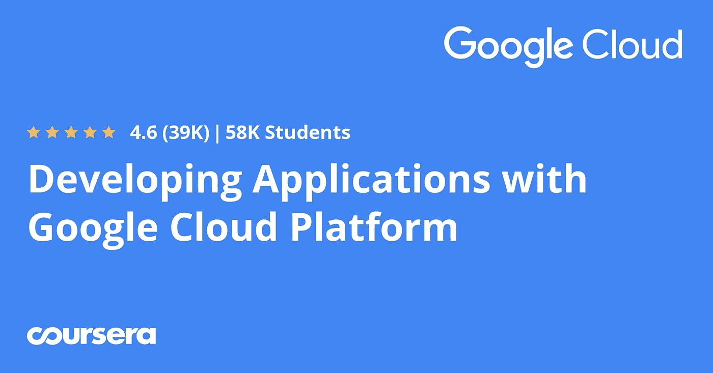
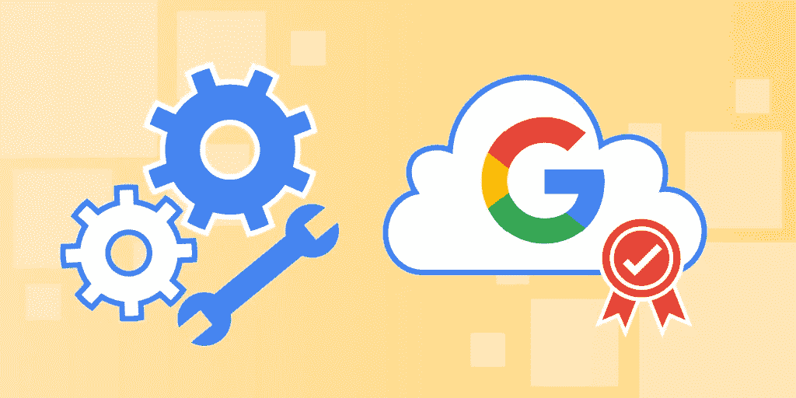
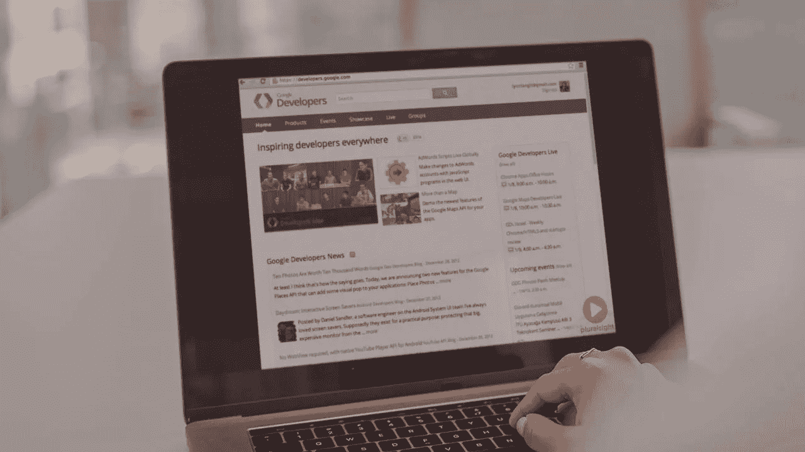
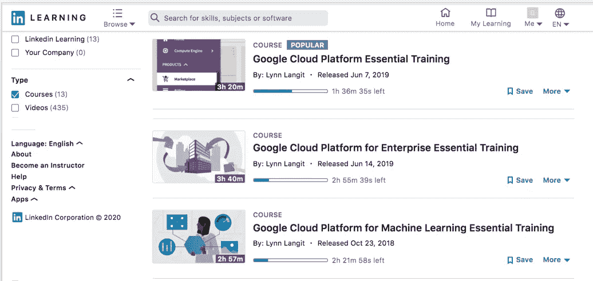
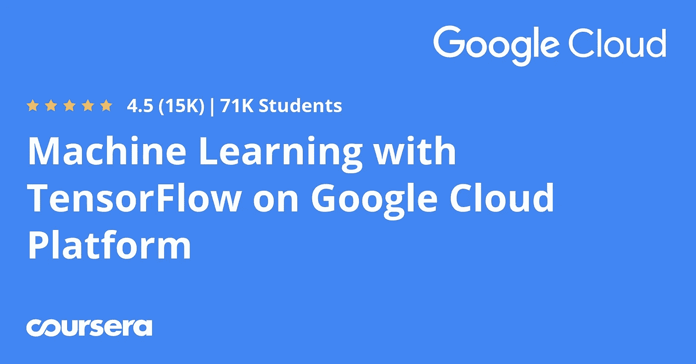

# 2023 年学习谷歌云平台(GCP)的 5 门最佳课程

> 原文：<https://medium.com/javarevisited/5-best-courses-to-learn-google-cloud-platform-gcp-in-2021-169093a3771a?source=collection_archive---------0----------------------->

## 这些是 Udemy、Coursera 和 Pluralsight 提供的 2023 年在线学习 GCP 的最佳谷歌云平台课程

image_credit — Udemy

大家好，如果你想学习谷歌云平台并寻找最好的在线课程，那么你来对地方了。之前我已经分享过[最好的 AWS 课程](/javarevisited/5-best-aws-courses-for-beginners-and-experienced-developers-to-learn-in-2021-563212409fbd?source=extreme_sidebar---------0-2----------------------)和[最好的学习 Azure 的课程](/javarevisited/5-best-azure-fundamentals-courses-to-pass-az-900-certification-exam-in-2020-9e602aea035d)，今天我要分享的是最适合初学者的 Google Cloud 课程。

*披露——顺便说一句，其中一些链接是附属链接，如果你使用我的链接加入这些课程，我可能会得到报酬。*

GCP 或谷歌云平台在公共云计算领域的进入时间稍晚，但在过去几年中，它已经完全改变了公共云的格局，特别是 AWS 在云领域的垄断地位受到了挑战。

它仍然不是像亚马逊网络服务那样最受欢迎的公共云平台，也不是像微软 Azure 那样的企业界宠儿，但它的性能、工具和创新谷歌正在吸引越来越多的公司使用谷歌云平台，特别是在大数据和机器学习领域。

凭借 BigTable、BigQuery 等工具和 [TensorFlow](https://javarevisited.blogspot.com/2018/08/top-5-tensorflow-and-machine-learning-courses-online-programmers.html) 等库，谷歌云平台正迅速成为机器学习创新的首选平台。

正因为如此，对熟悉 GCP 和谷歌云平台概念和工具的云专家的需求越来越大。

不幸或幸运的是，目前开发者对谷歌云产品如 Bigtable、BigQuery、Google Compute Engine 等的了解非常匮乏。同样，如果你寻找一个**认证的谷歌云架构师**，你会在你的网络中找到一两个，相比之下只有少数 [AWS 架构师](https://javarevisited.blogspot.com/2019/05/top-5-courses-to-crack-aws-solutions-architect-associate-certification-exam-SAA-C01.html#axzz5rHwAwycj)。

谷歌云平台的流行和熟练 GCP 开发人员的短缺意味着这是学习[云计算](/javarevisited/5-best-cloud-computing-courses-to-learn-in-2020-f5f091159401)和[谷歌云平台](https://cloud.google.com/)的绝佳时机，尤其是如果你想在云计算领域发展事业的话。最重要的是，谷歌目前正在提供 300 美元的免费积分，这意味着现在是学习谷歌云平台的最佳时机。那么，我们如何开始？

嗯，没有比参加 Coursera 和 Udemy 上最好的 Google Cloud 在线课程更好的学习 Google Cloud 的方法了，这些课程是由 Google Cloud 自己提供的*像 Coursera 上的 [**用 Google Cloud Platform Specialization**](https://coursera.pxf.io/c/3294490/1164545/14726?u=https%3A%2F%2Fwww.coursera.org%2Fspecializations%2Fdeveloping-apps-gcp)**开发应用程序。***

***<https://coursera.pxf.io/c/3294490/1164545/14726?u=https%3A%2F%2Fwww.coursera.org%2Fspecializations%2Fdeveloping-apps-gcp>  

你也可以利用这些课程来准备谷歌云助理和专业认证，如[谷歌云助理云工程师](https://javarevisited.blogspot.com/2020/05/top-5-course-to-crack-google-cloud-associate-cloud-engineer-certification-exam.html)和[谷歌云专业云架构师](https://javarevisited.blogspot.com/2020/07/top-5-courses-to-become-google-cloud-professional-architect.html)、 [GCP 专业数据工程师](https://javarevisited.blogspot.com/2020/06/top-5-course-to-crack-google-cloud-professional-data-engineer-certification.html)和[谷歌云开发人员](https://www.java67.com/2020/09/5-free-courses-to-pass-google-cloud-developer-certification.html?utm_source=dlvr.it&utm_medium=facebook)。

# 面向初学者的 5 门最佳谷歌云平台课程

这里有一些了解谷歌云平台或 GCP 的最佳在线课程。在这些课程中，你不仅会学到构成谷歌云世界的概念和技术，还会了解谷歌云能为 [DevOps](/javarevisited/13-best-courses-to-learn-devops-for-senior-developers-in-2020-a2997ff7c33c?source=extreme_sidebar---------0-2----------------------) 、开发者和[机器学习爱好者](/javarevisited/top-10-machine-learning-and-data-science-certifications-and-training-courses-for-beginners-and-a6308497b764)提供什么。

我还收录了 Coursera 上一些最好的谷歌云课程，特别是一门 [**谷歌云领导者专业化**](https://coursera.pxf.io/c/3294490/1164545/14726?u=https%3A%2F%2Fwww.coursera.org%2Fprofessional-certificates%2Fgoogle-cloud-digital-leader-training) ，它不仅会教你如何在 GCP 上设计、开发和部署应用。而且还提供了大量实践实验室来实践 Google 云组件和服务，这将最终帮助您构建安全、可伸缩和智能的云原生应用程序。

事不宜迟，下面是*我列出的在线学习谷歌云平台*的最佳课程:

## 1. [GCP:完整的谷歌数据工程师和云架构师指南](https://click.linksynergy.com/deeplink?id=JVFxdTr9V80&mid=39197&murl=https%3A%2F%2Fwww.udemy.com%2Fgcp-data-engineer-and-cloud-architect%2F)

这是学习谷歌云及其大数据技术的基础知识以及通过谷歌数据工程师和谷歌云专家认证考试的最佳在线课程之一。

在本课程中，您不仅将了解计算引擎和应用引擎等 GCP 基础知识，还将了解他们的大数据和机器学习工具，如 BigQuery、Bigtable、DataProc、Datalab、 [TensorFlow](https://hackernoon.com/top-5-tensorflow-and-ml-courses-for-programmers-8b30111cad2c) 和 [Hadoop](https://dev.to/javinpaul/top-5-courses-to-learn-big-data-and-hadoop-for-beginners-6g8) 集群。

对于想了解谷歌云平台的初学者，以及想准备谷歌数据工程师和谷歌云专家平台的人，我强烈推荐这门课程。

**以下是参加 GCP 课程的链接**——[GCP:完整的谷歌数据工程师和云架构师指南](https://click.linksynergy.com/deeplink?id=JVFxdTr9V80&mid=39197&murl=https%3A%2F%2Fwww.udemy.com%2Fgcp-data-engineer-and-cloud-architect%2F)

两位讲师都非常了解 Google 大数据技术，并在本课程中有丰富的经验。他们也来自谷歌，对这些技术有第一手的经验，这使得本课程更加有趣。

谈到社交证明，这门课程已经向超过 20，000 名学生教授了谷歌云基础知识，并从近 3，110 名参与者那里获得了平均 4.2 分的评分，这充分说明了它的质量。*** 

## ***2.[用谷歌云平台开发应用](https://coursera.pxf.io/c/3294490/1164545/14726?u=https%3A%2F%2Fwww.coursera.org%2Fspecializations%2Fdeveloping-apps-gcp)【Coursera】***

***这是了解谷歌云平台的最完整的在线资源之一。Coursera 专业化是 4 门在线课程的集合，将教你如何设计、开发和部署无缝集成 Google 云平台组件的应用程序。

课程动手性很强，讲解透彻。您将学习关键的 GPC 概念，如[计算引擎](https://cloud.google.com/compute)、云存储、数据流等，以开发可扩展的智能云原生应用。

这种专业化最好的部分是*课程由谷歌云培训本身*提供。我已经参加了这个课程，并保证他们的质量。他们在内容和交付上都做得太好了。如果你每周花 14 个小时的话，大概需要 1 个月的时间来完成，但是这个课程是完全在线的，你可以按照自己的时间表来学习。除英语外，本课程还提供法语、葡萄牙语、德语、西班牙语和日语版本。***

*****这里是参加 GCP 课程**——[用谷歌云平台开发应用](https://coursera.pxf.io/c/3294490/1164545/14726?u=https%3A%2F%2Fwww.coursera.org%2Fspecializations%2Fdeveloping-apps-gcp)的链接***

******

***顺便说一下，除了单独加入这些课程和专业，你还可以加入 Coursera Plu 的订阅计划，让你无限制地访问他们最受欢迎的课程、专业、专业证书和指导项目。***

***<https://coursera.pxf.io/c/3294490/1164545/14726?u=https%3A%2F%2Fwww.coursera.org%2Fcourseraplus> *** 

## ***3.[破解 Google 协理云工程师认证](https://www.educative.io/courses/google-cloud-assoc-certification?affiliate_id=5073518643380224)***

***好吧，让我告诉你，这可能是通过著名的谷歌认证助理云工程师和架构师考试的最佳互动在线培训课程，不仅仅是内容，还有演示和交付。

本课程是快速接触 GCP 并使自己适应它的开端。你会以“为什么是 GCP？”开始并且会以不同的方式使用它的服务。***

***如果你有 AWS 背景，你会发现这个课程非常容易理解，因为 [AWS](/javarevisited/5-best-aws-courses-for-beginners-and-experienced-developers-to-learn-in-2021-563212409fbd) 和 [GCP 服务有相似之处。](https://www.java67.com/2020/07/5-free-courses-to-learn-google-cloud-platform-and-concepts.html)在课程结束时，你将参加一次模拟考试，类似于你获得[谷歌云工程师认证](/javarevisited/7-free-online-courses-to-crack-google-cloud-associate-cloud-engineer-ace-certification-exam-in-2cf0b297aed)时将要参加的考试。***

***这意味着对于初学者或任何想学习 GCP 的人来说，这也是一门学习谷歌云服务的极好课程。本课程还包括一个模拟测试，帮助您为 Google 云工程师助理认证考试做好准备。***

*****这里是加入谷歌云课程** — [破解谷歌云工程师助理认证](https://www.educative.io/courses/google-cloud-assoc-certification?affiliate_id=5073518643380224)的链接***

******

***顺便说一句，你可以单独参加这个课程，也可以参加 [**教育订阅**](https://www.educative.io/subscription?affiliate_id=5073518643380224) (推荐)来访问他们的 250 多个高质量、基于文本的交互式课程，以学习编码面试、软件开发和技术的关键技能。***

## ***4.[Lynn Langit 介绍谷歌云](https://pluralsight.pxf.io/c/1193463/424552/7490?u=https%3A%2F%2Fwww.pluralsight.com%2Fcourses%2Fgoogle-cloud-intro)***

***这是谷歌云平台或 GCP 上最好但陈旧的入门课程之一，面向想要进入谷歌云的程序员和架构师。在本课程中，谷歌开发专家 Lynn Langit 向您介绍了谷歌的云技术，并概述了谷歌云的可能性。

本课程结束时，您将了解和理解基本的谷歌云服务，如[谷歌应用引擎](https://cloud.google.com/appengine)、谷歌计算引擎等。

不需要谷歌云知识，但是会传授很多。本课程面向开发人员和业务决策者，也适用于高管。***

***它还包括一个使用 Eclipse ( [Java](/javarevisited/10-free-courses-to-learn-java-in-2019-22d1f33a3915) )的“Hello World”GAE 演示，这对于想要了解谷歌云平台的 Java 开发人员来说是非常理想的。***

*****这里是加入本课程的链接**——[Lynn Langit 的谷歌云介绍](https://pluralsight.pxf.io/c/1193463/424552/7490?u=https%3A%2F%2Fwww.pluralsight.com%2Fcourses%2Fgoogle-cloud-intro)***

******

***顺便说一句，这个课程需要 [Pluralsight 会员](http://pluralsight.pxf.io/c/1193463/424552/7490?u=https%3A%2F%2Fwww.pluralsight.com%2Flearn)。如果你已经是 Pluralsight 会员，那么这是一个关于 GCP 的很好的入门课程。如果你没有会员资格，那么你可以订阅，费用大约为每月 29 美元或每年 299 美元**(目前仅为 179 美元，40%折扣**)，或者通过签署他们的 [**10 天免费试用**](http://pluralsight.pxf.io/c/1193463/424552/7490?u=https%3A%2F%2Fwww.pluralsight.com%2Flearn) **来免费参加这门课程。*****

***<http://pluralsight.pxf.io/c/1193463/424552/7490?u=https%3A%2F%2Fwww.pluralsight.com%2Flearn>  

虽然这门课程对初学者来说很好，但考虑到技术变化的速度，它有点过时了 [Lynn Langit](https://medium.com/u/8945742012d2?source=post_page-----169093a3771a--------------------------------) 也在 LinkedIn Learning 上创建了 [GCP 基础知识](http://linkedin-learning.pxf.io/c/1193463/449670/8005?u=https%3A%2F%2Fwww.linkedin.com%2Flearning%2Fgoogle-cloud-platform-for-enterprise-essential-training)、 [GCP 企业基础知识](http://linkedin-learning.pxf.io/c/1193463/449670/8005?u=https%3A%2F%2Fwww.linkedin.com%2Flearning%2Fgoogle-cloud-platform-for-enterprise-essential-training)和 [GCP 机器学习基础知识](http://linkedin-learning.pxf.io/c/1193463/449670/8005?u=https%3A%2F%2Fwww.linkedin.com%2Flearning%2Fgoogle-cloud-platform-for-machine-learning-essential-training)课程，你也可以查看一下。LinkedInLearning 提供 1 个月的免费学习，因此有足够的时间免费查看这些课程。

***

## ***5.[Google 云平台上 TensorFlow 的机器学习](https://coursera.pxf.io/c/3294490/1164545/14726?u=https%3A%2F%2Fwww.coursera.org%2Fspecializations%2Fmachine-learning-tensorflow-gcp)***

***这是 Coursera 为数据科学家提供的又一个优秀专业，这些数据科学家希望在谷歌云上部署他们的机器学习模型，以利用 TensorFlow 和 GCP 提供的性能。

和第一个专业化一样，这个也是 Google Cloud 提供的，这使得它成为 Google Cloud 平台学习机器学习的一种官方资源。

专业化是以下 5 门课程的集合
— [谷歌如何进行机器学习](https://coursera.pxf.io/c/3294490/1164545/14726?u=https%3A%2F%2Fwww.coursera.org%2Flearn%2Fgoogle-machine-learning)
— [启动机器学习](https://coursera.pxf.io/c/3294490/1164545/14726?u=https%3A%2F%2Fwww.coursera.org%2Flearn%2Flaunching-machine-learning%3Fspecialization%3Dmachine-learning-tensorflow-gcp)
—tensor flow 简介
—特征工程，以及
—机器学习的艺术与科学

所有课程都是 100%在线的，这意味着您可以按照自己的时间表学习。一般来说，完成这个专业需要 1 个月的时间，因为你每周花了大约 15 个小时，但是你可以在方便的时候去。本课程还提供英语、法语、葡萄牙语、巴西语、德语、西班牙语和日语版本。在线实验室是由 Qwiklabs 提供的，这使得与 GCP 的合作变得非常愉快。你可以从任何你想要的课程开始，但是你需要完成所有的课程和作业。我们会给你颁发一个证书，你可以把它放在你的 LinkedIn 个人资料或者你的简历上。***

*****这里是加入 GCP ML 课程**——[谷歌云平台上 TensorFlow 的机器学习](https://coursera.pxf.io/c/3294490/1164545/14726?u=https%3A%2F%2Fwww.coursera.org%2Fspecializations%2Fmachine-learning-tensorflow-gcp)的链接***

******

***顺便说一句，如果你觉得 Coursera 课程和专业很有用，那么你也应该加入 Coursera Plus<https://coursera.pxf.io/c/3294490/1164545/14726?u=https%3A%2F%2Fwww.coursera.org%2Fcourseraplus>**，这是 Coursera 的一个订阅计划，它可以让你无限制地访问他们最受欢迎的课程、专业、专业证书和指导项目。*****

*****<https://coursera.pxf.io/c/3294490/1164545/14726?u=https%3A%2F%2Fwww.coursera.org%2Fcourseraplus> ***** 

## *****6.[谷歌云平台(GCP)初学者基础](https://click.linksynergy.com/deeplink?id=JVFxdTr9V80&mid=39197&murl=https%3A%2F%2Fwww.udemy.com%2Fcourse%2Fgoogle-cloud-platform-gcp-fundamentals-for-beginners%2F)*****

*****Udemy 上另一个很棒的课程是学习面向初学者的 Google 云平台。从零开始学习谷歌云平台真的很棒。您将了解关键的 GCP 服务及其优缺点，并了解在现实世界中何时使用它们。*****

*******这里是加入本课程的链接**——[谷歌云平台(GCP)初学者基础](https://click.linksynergy.com/deeplink?id=JVFxdTr9V80&mid=39197&murl=https%3A%2F%2Fwww.udemy.com%2Fcourse%2Fgoogle-cloud-platform-gcp-fundamentals-for-beginners%2F)*****

*****<https://click.linksynergy.com/deeplink?id=JVFxdTr9V80&mid=39197&murl=https%3A%2F%2Fwww.udemy.com%2Fcourse%2Fgoogle-cloud-platform-gcp-fundamentals-for-beginners%2F> ***** 

## *****7.[面向自动气象站专业人员的谷歌云平台——学习 GCP](https://click.linksynergy.com/deeplink?id=JVFxdTr9V80&mid=39197&murl=https%3A%2F%2Fwww.udemy.com%2Fcourse%2Fgoogle-cloud-platform-for-aws-professionals%2F)*****

*****如果你有一些关于云计算的知识，并且你以前使用过 AWS，那么学习谷歌云平台对你来说并不困难，这个课程会让它变得更加容易。*****

*****企业正在走向云化。仅仅了解一朵云是不够的。你需要了解多种云。*****

*****在本课程中，您将在 AWS 知识的基础上学习 Google Cloud。*****

******与学习 AWS* 的方式不同，你将学习 GCP 对 GCP 服务和 AWS 服务的比较。你将学习以 AWS 为敲门砖的谷歌云平台。*****

*****在课程结束时，你会看到学习谷歌云平台-GCP 是非常容易的，当你已经知道 AWS！*****

*******以下是参加本课程的链接—** [面向 AWS 专业人员的谷歌云平台](https://click.linksynergy.com/deeplink?id=JVFxdTr9V80&mid=39197&murl=https%3A%2F%2Fwww.udemy.com%2Fcourse%2Fgoogle-cloud-platform-for-aws-professionals%2F)*****

*****<https://click.linksynergy.com/deeplink?id=JVFxdTr9V80&mid=39197&murl=https%3A%2F%2Fwww.udemy.com%2Fcourse%2Fgoogle-cloud-platform-for-aws-professionals%2F>  

以上是学习谷歌云平台或 GCP 的一些最佳课程。我还加入了一些课程，为谷歌认证助理云工程师认证做准备，这是学习谷歌云平台和获得技能证书的另一个好方法。一些你可以放入简历和 LinkedIn 个人资料的东西。

这并不是一个很大的列表，因为我也在学习谷歌云，所以如果你有一门课程应该在这个列表上，或者我应该看看的东西，请随时在评论中提出建议。

其他**认证资源**面向 **IT 专业人士**和 Java 程序员

*   [2023 年网络开发者路线图](https://hackernoon.com/the-2019-web-developer-roadmap-ab89ac3c380e)
*   [如何在 2023 年成为 DevOps 工程师](https://javarevisited.blogspot.com/2018/09/the-2018-devops-roadmap-your-guide-to-become-DevOps-Engineer.html)
*   [如何破解甲骨文 2023 年 Java 认证](https://medium.freecodecamp.org/how-to-pass-oracles-java-certifications-a-practical-guide-for-developers-e9b607ba6173)
*   [学习亚马逊网络服务我最喜欢的课程](/javarevisited/top-10-courses-to-learn-amazon-web-services-aws-cloud-in-2020-best-and-free-317f10d7c21d)
*   [如何破解 2023 年 AZ 300 认证](https://javarevisited.blogspot.com/2020/04/how-to-crack-microsoft-azure-solution-architect-exam-az-300.html)
*   [Spring 专业认证对工作和事业有帮助吗？](https://javarevisited.blogspot.com/2017/07/does-spring-certification-help-in-job-and-career.html)
*   [2023 年学习 Linux 的十大课程](/javarevisited/top-10-courses-to-learn-linux-command-line-in-2020-best-and-free-f3ee4a78d0c0)
*   [如何通过 Spring Core Professional 5.0 认证](https://javarevisited.blogspot.com/2018/08/how-to-crack-spring-core-professional-certification-exam-java-latest.html)
*   [如何成为 Azure 认证管理员](https://javarevisited.blogspot.com/2020/04/how-to-crack-microsoft-az-103-azure-administrator-associate-exam-certification.html)
*   [10 门免费课程学习数据结构和算法](http://www.java67.com/2019/02/top-10-free-algorithms-and-data.html)
*   [10 门数据科学和机器学习认证课程](https://dev.to/javinpaul/10-data-science-and-machine-learning-courses-for-programmers-looking-to-switch-career-57kd)
*   [每个软件开发人员都应该学习的 10 件事](https://dev.to/javinpaul/10-things-every-software-developer-should-know-39pe)
*   [如何通过 Azure 基础(AZ-900)考试](https://javarevisited.blogspot.com/2020/04/how-to-crack-microsoft-azure-fundamentals-certification-az-900-exam.html)
*   [学习 Linux 命令行的 5 门免费课程](https://hackernoon.com/top-5-free-linux-courses-for-programmers-4a433b4edade)
*   [程序员学习 Git 的 5 大免费课程](https://javarevisited.blogspot.com/2018/01/5-free-git-courses-for-programmers-to-learn-online.html)
*   [OCAJP 和 OCPJP 考试 10 道免费样题](http://www.java67.com/2017/05/10-free-java-8-certification-sample-questions-OCAJP8-OCPJP8-Mock-Exams.html)

感谢您阅读本文。如果你喜欢这篇文章，请与你的朋友和同事分享。如果您有任何问题或反馈，请留言。

</javarevisited/top-10-courses-to-learn-amazon-web-services-aws-cloud-in-2020-best-and-free-317f10d7c21d> *****