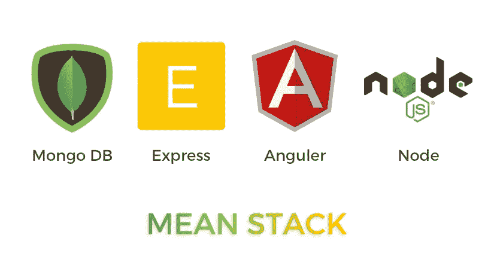
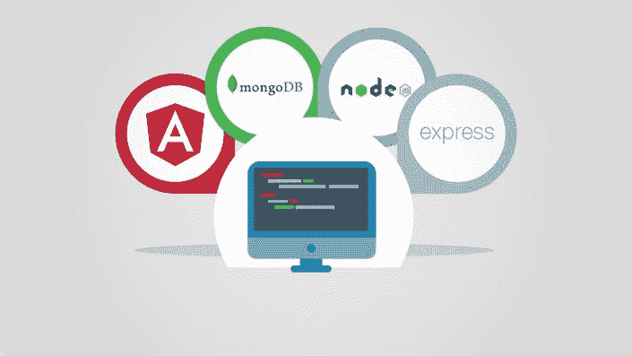
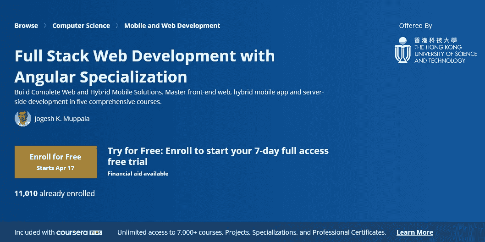
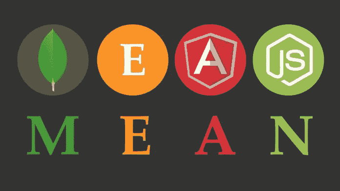
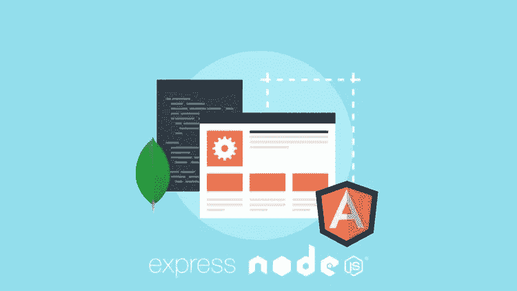

# 2023 年学习 MEAN Stack 的 5 门最佳在线课程

> 原文：<https://medium.com/javarevisited/5-best-courses-to-learn-mean-stack-for-beginners-and-experienced-developers-31162f8e3c03?source=collection_archive---------0----------------------->

## 这些是初学者和有经验的程序员在线学习 MEAN stack 的最佳 Udemy 和 Coursera 课程。

大家好， **MEAN stack** 无疑是全栈 web 开发中最流行的软件栈。对[全栈开发者](/javarevisited/top-10-online-courses-to-become-a-fullstack-web-developer-in-2020-d608a6b63232)的需求近年来大幅增长。

MEAN stack 包含一些广泛使用的最流行的技术。越来越多的人，尤其是新人，想从零开始学习均值栈。谷歌上充斥着各种各样的课程，并不是所有的课程都值得一去。

我一直在分享学习现代技术堆栈的有用课程，就像在以前的文章中，我们已经看到了学习 MERN 堆栈的 [**最佳课程**](/javarevisited/top-5-online-courses-to-learn-mern-stack-in-depth-9947230f194) ，在这篇文章中，我将列出前 5 名的平均堆栈课程，它们很好地解释了每个概念。

但首先，我们简单讨论一下栈是什么意思。

MERN 分别代表 MongoDB、Express.js、AngularJS(或 [Angular](/javarevisited/top-10-angular-books-and-courses-for-beginners-and-experienced-web-developers-best-of-lot-9a2dae87f04c) )和 [Node.js](/javarevisited/7-free-courses-to-learn-node-js-in-2020-2f1dd6722b49) 。

*   MongoDB:一个流行的 NoSQL 数据库。它以 JSON 格式存储数据。
*   express . js:node . js 的一个灵活的最小化 web 框架
*   [Angular](/javarevisited/10-courses-to-learn-angular-for-web-development-6da1bd2856dc) :用于创建动态 web 应用的 JavaScript 框架。
*   [Node.js](/javarevisited/top-10-online-courses-to-learn-node-js-in-depth-8ef0e31ca139) :用于在浏览器外执行 JavaScript 的运行时环境。

Angular 是 web 应用程序开发社区中最流行的术语之一。它是一个用于创建动态 web 应用程序的 JavaScript web 框架。在过去的十年里，Angular 一直被放在 JavaScript 框架的前列。不要把 Angular 和 AngularJS 混淆。两者都不一样。

MongoDB 是无模式的，不像 [SQL 数据库](/javarevisited/7-free-courses-to-learn-database-and-sql-for-programmers-and-data-scientist-e7ae19514ed2)那么复杂。使用 MongoDB 很容易理解和操作。没有复杂的连接和查询。

# 2023 年学习 MEAN stack 的 5 门最佳 Udemy 和 Coursera 在线课程

在不浪费你更多时间的情况下，这里有 2023 年学习均值堆栈的最佳课程。这些课程是由像 Maximilian Schwarzmuller 这样的专家创建的，它们也非常便宜，尤其是 Udemy 课程，你只需花 10 美元就可以买到，这种课程时有发生。

## 1. [Angular and NodeJS —均值叠加指南【2023 版】](https://click.linksynergy.com/deeplink?id=JVFxdTr9V80&mid=39197&murl=https%3A%2F%2Fwww.udemy.com%2Fcourse%2Fangular-2-and-nodejs-the-practical-guide%2F)

由 udemy 最受欢迎的讲师之一创建的“Angular & NodeJS —平均堆栈指南[2023 版]”是您深入研究 Angular 和其他平均堆栈技术的完美选择。超过八万名学生注册了这门课程，它被认为是 Udemy 上最畅销的平均堆栈课程。

要求

*   Node、Express 和 MongoDB 的基础知识。
*   [HTML](/javarevisited/5-free-html-and-css-courses-to-learn-front-end-web-development-online-8b04517c6ecb?source=collection_home---4------0-----------------------) 、 [CSS](/javarevisited/top-10-free-courses-to-learn-html-5-css-3-and-web-development-872d62d97a97) 和基础 [JavaScript](/javarevisited/10-best-online-courses-to-learn-javascript-in-2020-af5ed0801645) 的知识。
*   建议初学角度知识。

maximilian Schwarzüller，讲师从对均值堆栈的适当解释开始，然后转移到 Angular，深入解释每个概念。在转移到后端之前，他还介绍了 Node 和 Express。

**以下是加入本课程的链接** e — [Angular and NodeJS —均值叠加指南【2023 版】](https://click.linksynergy.com/deeplink?id=JVFxdTr9V80&mid=39197&murl=https%3A%2F%2Fwww.udemy.com%2Fcourse%2Fangular-2-and-nodejs-the-practical-guide%2F)

## 2.[完整的 JavaScript 开发者:从零到英雄的平均堆栈](https://click.linksynergy.com/deeplink?id=JVFxdTr9V80&mid=39197&murl=https%3A%2F%2Fwww.udemy.com%2Fcourse%2Fthe-complete-javascript-developer-mean-stack-zero-to-hero%2F)

Udemy 的另一门热门课程“完整的 JavaScript 开发人员:从零到英雄”是为那些不太熟悉 [Angular](/javarevisited/top-10-free-courses-to-learn-angular-framework-in-2020-bb62148c73d3) 、MongoDB、Express 和 Node 的人开设的。

讲师将课程具体划分为不同的部分，针对均值叠加的不同方面。在解释完所有的概念后，他的目标是使用在课程中学到的所有概念构建一个应用程序。

要求:

*   HTML、 [CSS](/javarevisited/top-5-advanced-css-courses-to-learn-flexbox-grid-and-sass-da8e37b09b1d) 和 [JavaScript](/javarevisited/12-free-courses-to-learn-javascript-and-es6-for-beginners-and-experienced-developers-aa35874c9a32) 的知识。

这门课程被评价了近 2000 次，8000 多名学生注册了这门课程。

**这是加入本课程的链接** e — [完整的 JavaScript 开发人员:从零到英雄的平均堆栈](https://click.linksynergy.com/deeplink?id=JVFxdTr9V80&mid=39197&murl=https%3A%2F%2Fwww.udemy.com%2Fcourse%2Fthe-complete-javascript-developer-mean-stack-zero-to-hero%2F)

## 3.[全栈 Web 和多平台移动应用开发](https://coursera.pxf.io/c/3294490/1164545/14726?u=https%3A%2F%2Fwww.coursera.org%2Fspecializations%2Ffull-stack-mobile-app-development)

这是一门 Coursera 课程，分为五个子课程。本课程不仅面向那些打算学习 MEAN stack 开发的人，也面向那些对跨平台移动应用程序开发感兴趣的人。

两个子课程致力于 MEAN stack 开发，而其他课程则致力于 [Bootstrap](/javarevisited/7-free-courses-to-learn-bootstrap-for-web-designers-and-developers-5135215648f1) 、 [Ionic](/@javinpaul/10-frameworks-and-libraries-mobile-application-developers-can-learn-in-2020-e0b91391cade) 、Cordova 和 Native Script。

这是一门付费课程，但是如果你有经济问题，你可以随时选择 Coursera 提供的经济资助选项，免费入学。

要求

*   HTML、CSS 和 [JavaScript](/javarevisited/my-favorite-free-tutorials-and-courses-to-learn-javascript-8f4d0a71faf2) 的知识。
*   推荐[角度](https://dev.to/javinpaul/10-books-tutorials-and-courses-to-learn-angular-in-2019-2m0l)、[节点](/javarevisited/7-free-courses-to-learn-node-js-in-2020-2f1dd6722b49)、[快递](https://javarevisited.blogspot.com/2018/01/top-5-nodejs-and-express-js-online-courses-for-web-developers.html)、 [MongoDB](https://javarevisited.blogspot.com/2019/01/top-5-mongodb-online-training-courses.html) 的入门知识。

如果您希望参加移动应用程序开发课程，强烈建议您完成 Angular 课程。

**这里是加入本课程的链接** e — [全栈 Web 和多平台移动应用开发](https://coursera.pxf.io/c/3294490/1164545/14726?u=https%3A%2F%2Fwww.coursera.org%2Fspecializations%2Ffull-stack-mobile-app-development)

顺便说一句，如果你觉得 Coursera 的课程很有用，因为它们是由知名公司如**谷歌**、 **IBM** 、**亚马逊**和世界上最好的大学创建的，我建议你加入 Coursera 的年度订阅计划 [**Coursera Plus**](https://coursera.pxf.io/c/3294490/1164545/14726?u=https%3A%2F%2Fwww.coursera.org%2Fcourseraplus) 。

这种单一订阅让你可以无限制地访问他们最受欢迎的**课程**、**专业化**、**职业证书**和**指导项目**。它每年花费大约 399 美元，但是它完全值得你的钱，因为你得到了无限的证书。

 [## Coursera Plus |无限制访问 7，000 多门在线课程

### 用 Coursera Plus 投资你的职业目标。无限制访问 90%以上的课程、项目…

coursera.pxf.io](https://coursera.pxf.io/c/3294490/1164545/14726?u=https%3A%2F%2Fwww.coursera.org%2Fcourseraplus) 

## 4.[使用平均堆栈构建 Angular 和 Node.js 应用](https://pluralsight.pxf.io/c/1193463/424552/7490?u=https%3A%2F%2Fwww.pluralsight.com%2Fcourses%2Fbuilding-angularjs-nodejs-apps-mean)

这是 Pluralsight 最好的平均堆栈课程之一。该课程是由 Joe Eames 创建的，他有 16 年的 web 开发经验。

本课程为中级课程，面向对均值堆栈有基本了解的受众。它包含一些在[全栈 web 开发中非常有用的高级主题。](https://javarevisited.blogspot.com/2020/04/top-5-courses-to-become-full-stack-java-developer-with-Angular-and-Reactjs.html#axzz6Nq9yk7Sc)

要求

*   均值叠加的基础知识。

除了 MEAN stack 之外，它还涵盖了身份验证、安全性、授权和客户端测试。

**这是加入本课程的链接** e — [用平均堆栈构建 AngularJS 和 Node.js 应用](https://pluralsight.pxf.io/c/1193463/424552/7490?u=https%3A%2F%2Fwww.pluralsight.com%2Fcourses%2Fbuilding-angularjs-nodejs-apps-mean)

顺便说一句，你需要一个 [**Pluralsight 会员**](https://pluralsight.pxf.io/c/1193463/424552/7490?u=https%3A%2F%2Fwww.pluralsight.com%2Fpricing) 才能加入这个课程，费用大约是每月 29 美元，每年 299 美元(14%的折扣)，但它完全值得。另类。你也可以使用他们的 [**10 天免费试用**](https://pluralsight.pxf.io/c/1193463/424552/7490?u=https%3A%2F%2Fwww.pluralsight.com%2Flearn) 免费观看本课程。

 [## 对个人来说

### Pluralsight 帮助个人学习者获得掌握最新软件开发所需的技术技能…

pluralsight.pxf.io](https://pluralsight.pxf.io/c/1193463/424552/7490?u=https%3A%2F%2Fwww.pluralsight.com%2Flearn) 

## 5.[掌握均值叠加—举例学习— Udemy](https://click.linksynergy.com/deeplink?id=JVFxdTr9V80&mid=39197&murl=https%3A%2F%2Fwww.udemy.com%2Fcourse%2Fmaster-the-mean-stack%2F)

如果你熟悉 AngularJS 和 Node，想从中级概念开始，跳过基本的基础知识，那么 Udemy 的“掌握均值堆栈—通过实例学习”是一个完美的选择。

要求

*   角度和节点的基本知识。
*   安装的节点
*   JavaScript 基础的基本知识。

目标是涵盖创建全栈应用所需的所有必要概念。该课程相对较短，整体视频内容不到五个小时。所以可以肯定的是，这个课程不是为绝对的初学者开设的，而是为那些已经有基本的角和节点知识的人开设的。

**这是加入本课程的链接** e — [掌握均值叠加—通过实例学习— Udemy](https://click.linksynergy.com/deeplink?id=JVFxdTr9V80&mid=39197&murl=https%3A%2F%2Fwww.udemy.com%2Fcourse%2Fmaster-the-mean-stack%2F)

## 结论

Angular JS 或 Angular 是均值的主要概念之一，也是现代 [web 开发](/better-programming/my-5-favorite-courses-to-learn-web-development-in-2019-a5e74167f8b2)的重要部分之一。对于一个 web 开发人员来说，在职业生涯的某个阶段遇到 Angular 的几率很高。

所以如果你有一些 MEAN stack 的知识，学习 MEAN stack 就不会那么难了。但是如果你是 Angular 的新手，不要担心，这个列表也包含了那些绝对初学者的课程。

本文列出的课程是一些你可以在网上找到的[最佳均值堆栈课程](https://www.java67.com/2020/06/top-5-courses-to-learn-mean-stack-in.html)。通读文章，看看哪个课程适合你。

其他**你可能喜欢探索的 Web 开发文章**

*   [2023 年网络开发者路线图](https://javarevisited.blogspot.com/2019/02/the-2019-web-developer-roadmap.html)
*   [2023 年学习 HTML 和 CSS 的 5 大免费课程](http://www.java67.com/2018/02/5-free-html-and-css-courses-to-learn-web-development.html)
*   [2023 年学习 React 和 Redux 的 5 大课程](/@javinpaul/top-5-courses-to-learn-react-js-in-2019-best-of-lot-fa02cd96cdf0)
*   [2023 年 7 门免费学习 Bootstrap 的课程](/javarevisited/7-free-courses-to-learn-bootstrap-for-web-designers-and-developers-5135215648f1)
*   [我最喜欢的 2023 年学习 Web 开发的课程](/better-programming/my-5-favorite-courses-to-learn-web-development-in-2019-a5e74167f8b2)
*   [2023 年 5 门免费学习 Bootstrap 的课程](https://www.java67.com/2019/01/5-free-bootstrap-course-to-learn-online.html)
*   [2023 年学习棱角的 10 本书和课程](/javarevisited/top-10-angular-books-and-courses-for-beginners-and-experienced-web-developers-best-of-lot-9a2dae87f04c)
*   [深入学习 JavaScript 的 10 门课程](https://javarevisited.blogspot.com/2018/06/top-10-courses-to-learn-javascript-in.html)
*   [面向 Java 开发者的 5 门免费 Spring 框架课程](http://www.java67.com/2017/11/top-5-free-core-spring-mvc-courses-learn-online.html)
*   [初学者学习打字的 10 门免费课程](/javarevisited/top-10-free-typescript-courses-to-learn-online-best-of-lot-44bce9da41d1)
*   [为什么学习 Web 开发永远不晚](https://javarevisited.blogspot.com/2019/06/its-never-too-late-to-learn-web-development.html)
*   [深入学习 Angular 的 5 大课程](https://javarevisited.blogspot.com/2018/06/5-best-courses-to-learn-angular.html)
*   [深入学习 Node.js 的最佳课程之五](https://javarevisited.blogspot.com/2018/01/top-5-nodejs-and-express-js-online-courses-for-web-developers.html#axzz5VllnxgVT)
*   [如何在 2023 年成为现代 React JS 开发者](https://javarevisited.blogspot.com/2018/10/the-2018-react-developer-roadmap.html)

感谢您阅读本文。如果您发现这些 *best MEAN stack 在线培训课程*有用，请与您的朋友和同事分享。如果您有任何问题或反馈，请留言。

**P. S.** —如果你对学习 MEAN stack 感兴趣，但正在寻找免费的在线培训课程，那么你也可以在 Udemy 上查看这个 [**面向 Web 开发人员的 MEAN Stack**](https://click.linksynergy.com/deeplink?id=JVFxdTr9V80&mid=39197&murl=https%3A%2F%2Fwww.udemy.com%2Fcourse%2Fjavascript-based-website-in-minutes-using-the-mean-stack%2F)免费课程。它会教你如何使用 JavaScript 建立网站，而且完全免费。只需创建一个免费的 Udemy 帐户即可注册本课程。

 [## 免费的 MEAN Stack 教程——面向 Web 开发者的 MEAN Stack:基于 Javascript 构建网站

### 使用前沿工具，通过 MongoDB、Express、Angular 和 Node 构建快速、健壮的基于 Javascript 的 web 应用程序…

udemy.com](https://click.linksynergy.com/deeplink?id=JVFxdTr9V80&mid=39197&murl=https%3A%2F%2Fwww.udemy.com%2Fcourse%2Fjavascript-based-website-in-minutes-using-the-mean-stack%2F)