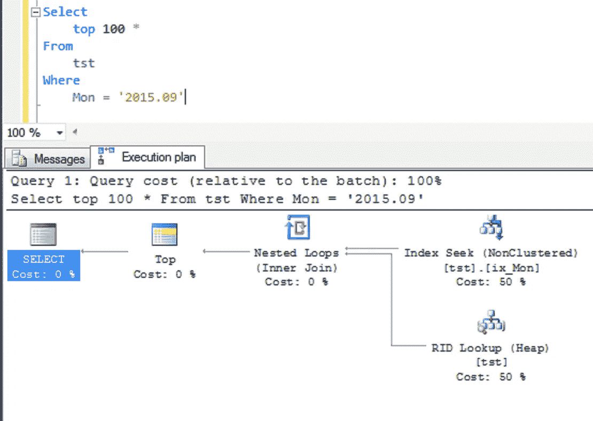
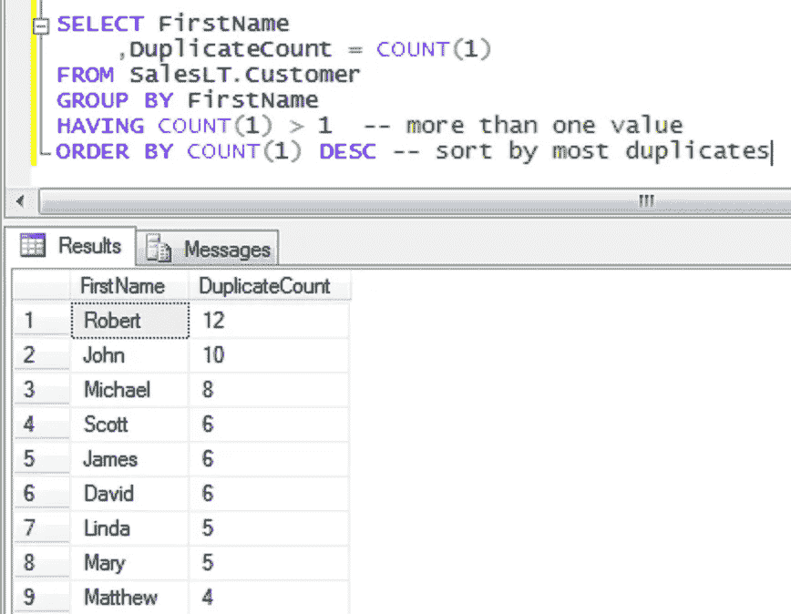
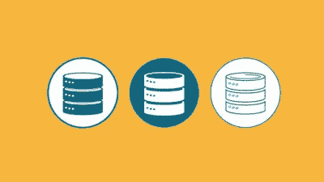

# 2023 年最值得学习的 5 门 Microsoft SQL Server 在线课程

> 原文：<https://medium.com/javarevisited/5-best-courses-to-learn-microsoft-sql-server-in-depth-e9f11b73c14a?source=collection_archive---------0----------------------->

## 这些是深入学习 Microsoft SQL Server 的最佳 Udemy 和 Pluralsight 课程

伙计们，你们可能知道，除了 Oracle 和 MySQL，微软 SQL Server 是科技界最流行的关系数据库之一。它被用于许多大型组织，如投资银行、保险公司，尤其是使用微软技术的公司，如 Windows Server。

随着微软 Azure 越来越受欢迎，市场份额越来越大，对微软 SQL Server 的需求很有可能也会增加，尤其是在云计算领域。对微软 SQL Server DBA 和有 SQL Server 经验的程序员都已经有很高的需求，这也是为什么 2023 年学习 MSSQL 是一个极好的决定。

如果您也是这样想的，并且正在寻找一些很棒的资源来启动您的 SQL Server 之旅，那么您来对地方了。在过去，我分享了许多学习微软 SQL Server 的[免费书籍](http://www.java67.com/2018/01/top-4-free-microsoft-sql-server-books.html)和[课程](https://www.java67.com/2018/02/5-free-oracle-and-microsoft-sql-server-online-courses.html)，这些书真的受到了我的读者的喜欢和赞赏

但是他们一直问我关于全面、深入和最好的在线付费课程。在 Facebook Messenger 和 LinkedIn 上分别回答了这些问题后，我决定以一篇文章的形式分享这些课程，我们来了。

在这篇文章中，我将分享一些 2023 年学习微软 SQL Server 的**最佳课程**。他们不是免费的，但他们完全值得你的时间和金钱。我还选择了从头开始教你 SQL Server 的课程。

如果你已经了解 SQL，并且熟悉任何关系数据库，比如 [Oracle](https://www.java67.com/2018/02/5-free-oracle-and-microsoft-sql-server-online-courses.html) 、 [MySQL](/@javinpaul/top-5-courses-to-learn-mysql-in-2020-4ffada70656f) 、Sybase、IBM DB2、 [PostgreSQL](/javarevisited/7-best-free-postgresql-courses-for-beginners-to-learn-in-2021-3bf369d73794) 、SQLite 等。，那么你会学得更快，但这不是必须的。

# 初学者和有经验的开发人员学习 SQL Server 的五大在线课程

为了不浪费你更多的时间，这里是我列出的 2023 年从微软 SQL Server 学习的一些最好的课程。正如我已经告诉你的，这些课程从零开始覆盖 MSSQL，这对于初学者和想要学习端到端的人来说很重要。

我还选择了现场展示 SQL 代码并解释其工作原理的实践课程，因为除非您解释 SQL Server 引擎如何评估您的 SQL 查询以及索引和连接如何协同工作，否则您将无法排除故障并优化您的查询以提高执行速度。

应读者要求，我还加入了 SQL Server 课程，以通过**Microsoft SQL Server 70–461，761:使用 Transact-SQL** 认证查询 Microsoft SQL Server。如果你正在准备那个梦寐以求的认证，那么这个课程真的会帮到你。

尽管如此，即使您没有准备 MSSQL 认证考试，该课程也将帮助您深入了解 Microsoft SQL Server。

## 1.[面向初学者的微软 SQL—Udemy](https://click.linksynergy.com/deeplink?id=JVFxdTr9V80&mid=39197&murl=https%3A%2F%2Fwww.udemy.com%2Fcourse%2Fmicrosoft-sql-for-beginners%2F)

这是教你如何使用 Microsoft SQL Server 和 T-SQL 语言编写 SQL 查询的最全面的课程之一。

本课程完全侧重于 SQL 查询，您将学习如何选择、更新和删除数据，如何使用 group by 子句，如何使用 [WHERE 和 HAVING](https://javarevisited.blogspot.com/2013/08/difference-between-where-vs-having-clause-SQL-databse-group-by-comparision.html) 筛选行，以及如何使用 SUM、AVG、MAX、MIN 等聚合函数。您还将学习如何使用 ORDER BY 子句对数据进行排序，以及如何使用[将多个表](https://javarevisited.blogspot.com/2012/11/how-to-join-three-tables-in-sql-query-mysql-sqlserver.html#axzz5az3hfsHW)连接在一起以生成报告等。

由于 SQL 查询是任何程序员和开发人员最重要的技能，所以这是学习微软 SQL Server 的一个很好的起点。无论您是一名程序员还是一名有抱负的 DBA，本课程都将为您提供了解 Microsoft SQL Server 更多信息的敲门砖。

说到社交证明，这门课程受到了超过 24626 名学生的信任，平均有近 6400 名参与者给出了 4.5 分的评分，令人惊叹。非常感谢创作者布鲁斯特诺尔顿创造了这个可怕的课程。

**以下是加入本课程的链接—** [**微软 SQL 初学者— Udemy**](https://click.linksynergy.com/deeplink?id=JVFxdTr9V80&mid=39197&murl=https%3A%2F%2Fwww.udemy.com%2Fcourse%2Fmicrosoft-sql-for-beginners%2F)

## 2.[70–461，761:使用 Transact-SQL 查询 Microsoft SQL Server](https://click.linksynergy.com/deeplink?id=JVFxdTr9V80&mid=39197&murl=https%3A%2F%2Fwww.udemy.com%2Fcourse%2F70-461-session-2-querying-microsoft-sql-server-2012%2F)

老实说，我已经通过阅读 70–461 和 70–761 的书籍学到了大部分的 SQL Server 基础知识，而本课程只是将这些知识推向了一个新的高度。这是一个众所周知的真理，我可以从个人经历中说，当你准备认证时，你会学到很多东西。

接下来你要关注细节，比如*一个 SQL 查询是如何执行的*，【WHERE 和 HAVING 的区别是什么，一个临时表是如何工作的，等等。这在你的头脑中产生了问题和好奇心，这进一步激励你做研究和关注，并最终了解重要的细节。

本课程几乎涵盖了开发人员或初级 SQL Server DBA 应该了解的所有内容，如表、SQL SELECT 查询、视图、表、触发器、SQL Server 2012、2014、2016、2017、2019、考试 70–461 和 70–761 等等。

如果你正在准备微软 SQL server 认证，那么这个课程一定会提升你的机会，即使你没有准备，通过学习这个课程你也会学得更好。

**以下是加入本课程的链接—**[70–461，761:使用 Transact-SQL 查询 Microsoft SQL Server](https://click.linksynergy.com/deeplink?id=JVFxdTr9V80&mid=39197&murl=https%3A%2F%2Fwww.udemy.com%2Fcourse%2F70-461-session-2-querying-microsoft-sql-server-2012%2F)

## 3.[Dan Sullivan 的 SQL Server 简介](https://pluralsight.pxf.io/c/1193463/424552/7490?u=https%3A%2F%2Fwww.pluralsight.com%2Fcourses%2Fintro-sql-server)

这是 Pluralsight 的另一个关于微软服务器的入门课程，由独立顾问、作者、演讲者和数据极客 Dan Sullivan 讲授。

本课程介绍关系数据库和 SQL Server。它从对关系数据库的高级介绍开始，接着介绍作为 SQL Server 一部分的数据修改和数据定义语言的使用。

**这里是加入本课程的链接—** [丹·苏利文的《SQL Server 简介》](https://pluralsight.pxf.io/c/1193463/424552/7490?u=https%3A%2F%2Fwww.pluralsight.com%2Fcourses%2Fintro-sql-server)

不过，你需要一个 [Pluralsight 会员](https://pluralsight.pxf.io/c/1193463/424552/7490?u=https%3A%2F%2Fwww.pluralsight.com%2Fpricing)才能进入这门课程，每年的费用大约为 299 美元。您的公司很有可能已经支持 Pluralsight，然后可以免费访问本课程。

或者，Pluralsight 还提供了 [**10 天免费试用**](https://pluralsight.pxf.io/c/1193463/424552/7490?u=https%3A%2F%2Fwww.pluralsight.com%2Flearn) 和 200 分钟免费观看时间，足以免费接入并完成本课程。

<https://pluralsight.pxf.io/c/1193463/424552/7490?u=https%3A%2F%2Fwww.pluralsight.com%2Flearn>  

## 4.[微软 SQL Server Reporting Services(SSRS)](https://click.linksynergy.com/deeplink?id=JVFxdTr9V80&mid=39197&murl=https%3A%2F%2Fwww.udemy.com%2Fcourse%2Fmicrosoft-sql-server-reporting-services-ssrs%2F)

Microsoft SQL Server Reporting Services 或 SSRS 是 SQL Server 最重要的功能之一，它允许您生成报表。这是一项需要学习的基本技能，尤其是对于经常负责实现报告的 DBA 来说。

本课程主要讲述如何在 SQL Server Reporting Services(SSRS)中创建报表。不需要任何先验知识，但是一些 T-SQL 知识会很有用。它涵盖了如何管理布局和在报表中添加交互性。

它还涵盖了*微软 70–466 考试“使用微软 SQL Server 实现数据模型和报告”*认证考试中测试的几个方面。如果你正在准备那场考试，那么这门课可以给你很大的帮助。

**以下是参加本课程的链接—** [微软 SQL Server Reporting Services(SSRS)](https://click.linksynergy.com/deeplink?id=JVFxdTr9V80&mid=39197&murl=https%3A%2F%2Fwww.udemy.com%2Fcourse%2Fmicrosoft-sql-server-reporting-services-ssrs%2F)

## 5.[微软 SQL Server 2016 认证(70–764)](https://click.linksynergy.com/deeplink?id=JVFxdTr9V80&mid=39197&murl=https%3A%2F%2Fwww.udemy.com%2Fcourse%2Fms-sql-server-70-764%2F)

这是我在此列表中包含的另一个认证课程，用于深入学习 Microsoft SQL Server。本课程提供了全面而实用的 SQL Server 基础知识，以便您能够通过 Microsoft SQL 2016(70–764)考试。

本课程对于初级 SQL server 数据库管理员和希望通过 **Microsoft SQL Server 2016 认证(70–764)——管理 SQL 数据库基础架构**的有志数据库管理员非常有用。

如果您不知道，本认证考试面向执行数据库安装、维护和配置任务的数据库管理员，包括设置数据库系统、确保这些系统高效运行，以及定期存储、备份和保护数据免受未经授权的访问。在本课程中，您将学习如何配置数据访问和审计、管理数据库的备份和恢复、管理和监控 SQL Server 实例，以及管理高可用性和灾难恢复。

**以下是参加本课程的链接—**[Microsoft SQL Server 2016 认证(70–764)](https://click.linksynergy.com/deeplink?id=JVFxdTr9V80&mid=39197&murl=https%3A%2F%2Fwww.udemy.com%2Fcourse%2Fms-sql-server-70-764%2F)

完成本 MSSQL 课程后，您将具备通过 SQL 数据库基础设施管理考试所需的技能和知识，并从数据库管理员的角度深入了解 Microsoft SQL Server。

以上就是 2023 年**学习微软 SQL Server 的一些最佳课程**。正如我所说，MSSQL 或 Microsoft SQL Server 是顶级数据库之一，在三大数据库中排名第二，仅次于 Oracle，领先于 MySQL。

许多企业和科技公司使用 Microsoft SQL Server，随着 Microsoft Azure 市场的不断增长，越来越多的公司将选择在云中使用 SQL Server。这意味着对微软 SQL Server 专业人员和从事这些工作的程序员的需求增加。如果你想保持领先地位，让你的简历增色不少，学习 SQL Server 技能将会带来丰厚的回报。

其他**有用的编程资源**你可能喜欢:

*   [学习 SQL 和数据库基础知识的五大课程](https://javarevisited.blogspot.com/2018/05/top-5-sql-and-database-courses-to-learn-online.html)
*   [2023 年 Java 开发者路线图](https://javarevisited.blogspot.com/2019/10/the-java-developer-roadmap.html#123)
*   [学习 MySQL 数据库的前 5 门课程](https://javarevisited.blogspot.com/2018/05/top-5-mysql-courses-to-learn-online.html)
*   [数据库设计和建模的前五本书](https://javarevisited.blogspot.com/2017/11/top-5-books-to-learn-database-design.html)
*   [2023 年前端和后端开发者路线图](https://javarevisited.blogspot.com/2019/02/the-2019-web-developer-roadmap.html)
*   [学习 SQL 和数据库的 7 门免费课程](/javarevisited/7-free-courses-to-learn-database-and-sql-for-programmers-and-data-scientist-e7ae19514ed2)
*   [学习 Oracle 和 PL/SQL 的前四本书](https://javarevisited.blogspot.com/2017/09/top-4-books-to-learn-oracle-plsql-best-must-read.html)
*   [每个程序员都应该学习的 10 件事](https://javarevisited.blogspot.com/2019/01/10-things-every-programmer-and-software-engineer-should-know.html)
*   [面向程序员的五大高级 SQL 书籍](https://javarevisited.blogspot.com/2018/07/top-5-advanced-sql-books-for.html)
*   [面向程序员和数据库管理员的 5 门免费 T-SQL 和 SQL Server 课程](https://javarevisited.blogspot.com/2018/12/top-5-free-microsoft-sql-server-and-transact-sql-online-courses.html)
*   [2023 年 Java 开发者应该学会的 11 件事](/javarevisited/9-things-java-programmers-should-learn-in-2018-3f0b2207dfc4)
*   [2023 年学习 PostgreSQL 的 5 大课程](https://javarevisited.blogspot.com/2020/02/top-5-courses-to-learn-postgresql-in.html)
*   [学习 Oracle 和 MSSQL 的 10 门免费课程](/javarevisited/top-10-free-courses-to-learn-microsoft-sql-server-and-oracle-database-in-2020-6708afcf4ad7)

感谢您阅读本文。如果您喜欢这些最好的 Microsoft SQL Server 在线课程，请与您的朋友和同事分享。如果您有任何问题或反馈，请留言。

**P. S.** —如果您是 SQL 和数据库的新手，并且希望在深入了解 PostgreSQL 之前学习数据库基础知识和 SQL 基础知识，那么您也可以在 Udemy 上查看这个 [**Microsoft SQL Server —简介**](http://bit.ly/2DpaKnJ) 课程。这是完全免费的，你只需要一个免费的 Udemy 帐户就可以参加这个课程。

<http://bit.ly/2DpaKnJ> 