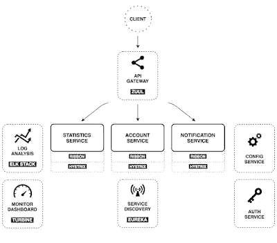
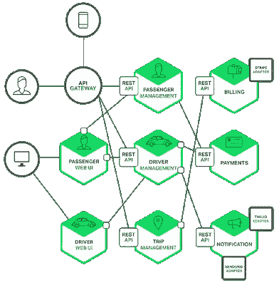
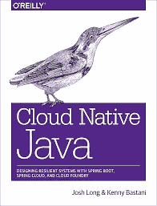

# 2023 年 Java 开发者 5 门最佳春季云和微服务课程

> 原文：<https://medium.com/javarevisited/5-best-courses-to-learn-spring-cloud-and-microservices-1ddea1af7012?source=collection_archive---------0----------------------->

## 我最喜欢的在线课程 2023 年用 Spring Boot 和春云学习微服务开发

image _ credit—[Educative 的微服务架构实际实施](https://www.educative.io/courses/microservice-architecture-practical-implementation?affiliate_id=5073518643380224)

大家好，如果你正在学习用于开发基于云的 Java 微服务的 **Spring Cloud** ，并且正在寻找一些好的资源，比如在线[课程](https://javarevisited.blogspot.com/2018/04/top-5-spring-cloud-courses-for-java.html)和[书籍](/hackernoon/top-5-spring-boot-and-spring-cloud-books-for-java-developers-75df155dcedc)，那么你来对地方了。

以前我分享过 [**最佳 Spring 框架课程**](/javarevisited/10-best-online-courses-to-learn-spring-framework-in-2020-f7f73599c2fd) s、 [**最佳 spring boot 课程**](/javarevisited/top-10-courses-to-learn-spring-boot-in-2020-best-of-lot-6ffce88a1b6e) 、[最佳 Spring MVC 课程](/javarevisited/my-favorite-spring-mvc-courses-for-java-developers-5ede7f85dd88) s、[最佳 Spring data JPA 课程](/javarevisited/5-best-spring-data-jpa-courses-for-java-developers-45e6438be3c9)、[最佳 responsive Spring 课程](/javarevisited/7-best-webflux-and-reactive-spring-boot-courses-for-java-programmers-33b7c6fa8995)、[最佳 Spring Security 课程](/javarevisited/3-best-spring-security-books-and-resources-for-java-programmers-653d05c8afd4)在这篇文章中，我将分享一些学习 Spring Cloud 的*最佳课程*

*学习一项新技术时，一个常见的问题是如何开始？*

*我以前是一个书迷，但现在我个人喜欢从在线课程开始学习。这样效果更好，因为你从讲师的经验中获益良多，而且你也有机会向讲师提问。

一旦你了解了 Spring cloud 这样的新技术的基础知识，这种情况下，你可以挑一本好的 Spring 框架书像 [**Cloud Native Java**](https://www.amazon.com/Cloud-Native-Java-Designing-Resilient/dp/1449374646?tag=javamysqlanta-20) 来进一步固化你的知识和理解。

如果你对用 Java 和其他 [JVM 语言](https://javarevisited.blogspot.com/2018/02/top-3-jvm-languages-java-programmer-learn.html)构建一个基于云的应用感兴趣，那么你可能听说过 Spring Cloud，如果没有，不要担心。在本文中，我将告诉你什么是 Spring Cloud，以及它如何帮助你开发面向云的 Java 应用。*

## *什么是春云？*

*Spring Cloud 只不过是 Spring 保护伞下的一个开源库形式 Pivotal，用来帮助 Java 开发人员创建基于云的应用程序。为云开发，像 [AWS](/javarevisited/top-10-courses-to-learn-amazon-web-services-aws-cloud-in-2020-best-and-free-317f10d7c21d) 、 [Azure](https://javarevisited.blogspot.com/2020/02/top-5-courses-to-crack-az-900-microsoft-azure-fundamentals-certification-exam.html) 和 Openshift、Heroku、 [GCP](https://javarevisited.blogspot.com/2019/07/top-5-google-cloud-platform-gcp-courses-certifications-online.html) 都有自己的问题，Spring Cloud 的座右铭是让它像开发本地应用程序一样简单，如果不是更简单的话。

当你为云开发时，你不需要担心很多事情，比如硬件、安装操作系统、安装数据库等等，但是你的应用仍然需要这些。像 **Cloud Foundry** 和 **Heroku** 这样的云提供商提供这些服务，但是你需要做一些工作来访问这些服务，这就是 **Spring Cloud 帮助**的地方。

它提供了优雅的云连接器来方便地访问那些抽象了所有云特定细节的服务，并允许您使用开发 Java 应用程序时通常使用的主机、端口和其他连接细节来访问那些服务。

例如，如果您的应用程序需要一个数据库，那么您需要基于您的云提供商提供的数据库服务创建一个`DataSource` 对象。Spring Cloud 消除了访问和配置服务连接器所需的所有工作，让您专注于使用这些服务。

它附带了 CloudFoundry 和 Heroku 实现，但其可扩展性足以支持另一个云提供的。您需要做的只是实现一些接口并将 JAR 添加到类路径中。*

## *Spring 云架构*

*这里有一个来自 Spring.io 网站的 Spring 云架构的例子，Spring . io 是 Spring 框架的一个元网站。*

**

# *2023 年面向 Java 开发者的 5 大春季云和微服务课程*

*无论如何，现在你知道了什么是 Spring Cloud，以及它如何帮助创建基于云的 Java 应用程序，让我们从我最喜欢的两个在线学习地点 [Udemy](https://click.linksynergy.com/fs-bin/click?id=JVFxdTr9V80&offerid=323058.9410&type=3&subid=0) 和 [Pluralsight](https://pluralsight.pxf.io/c/1193463/424552/7490?u=https%3A%2F%2Fwww.pluralsight.com%2Flearn) 看看学习 Spring Cloud 的一些最佳课程。*

## *1.春季云基础知识*

*如果你想在 2023 年开发一个云原生 Java 应用，那么这是最好的课程。

在本课程中，[Spring Cloud Fundamentals](https://pluralsight.pxf.io/c/1193463/424552/7490?u=https%3A%2F%2Fwww.pluralsight.com%2Fcourses%2Fspring-cloud-fundamentals)**，**作者@Dustin Schultz 解释了 Spring Cloud 如何帮助您将现有的 Java 应用程序迁移到云上，并从头开始为云开发 Java 应用程序。

您还将了解用于开发微服务架构的基本 Spring cloud 组件，以及诸如服务发现**(网飞尤里卡)**、分布式配置(Spring Cloud Config Server)、智能路由(网飞祖尔)、断路(**网飞海斯特里克斯)**和客户端负载平衡**(网飞丝带)**等补丁。完成本课程后，你将有足够的经验使用 Spring cloud 构建一个真正的云原生应用。*

*以下是加入本课程的链接— [**春云基础**](https://pluralsight.pxf.io/c/1193463/424552/7490?u=https%3A%2F%2Fwww.pluralsight.com%2Fcourses%2Fspring-cloud-fundamentals)*

**

## *2.使用 Spring Cloud 的微服务[最佳 Udemy 课程]*

*如果你想使用 Spring Cloud 在 Java 中开发微服务，那么这是最适合你的课程。

在[使用 Spring Cloud 的微服务](https://click.linksynergy.com/fs-bin/click?id=JVFxdTr9V80&subid=0&offerid=323058.1&type=10&tmpid=14538&RD_PARM1=https%3A%2F%2Fwww.udemy.com%2Fmicroservices-with-spring-cloud%2F)课程中，讲师 Ken Kruger 将向您介绍什么是微服务架构，以及它相对于传统单片 Java 应用程序的优缺点。

在本课程中，您将学习如何使用 Spring Cloud 及其各种子项目 slike Spring Cloud Config Server、Eureka、Ribbon、Feign、Hystrix 等构建微服务应用。

课程还将教你如何使用 web 界面、 [REST](http://javarevisited.blogspot.sg/2017/08/difference-between-restcontroller-and-controller-annotations-spring-mvc-rest.html) 和 Spring 数据开发 [Spring Boot 应用](/javarevisited/10-free-spring-boot-tutorials-and-courses-for-java-developers-53dfe084587e?source=collection_home---4------7-----------------------)。

这也是一门实践课程，你将解决练习题并开发一个应用程序来应用你将学到的知识。总体而言，使用 Spring Cloud 的**微服务是一个很好的开端。***

*以下是加入本课程**——**[**微服务与春云**](https://click.linksynergy.com/fs-bin/click?id=JVFxdTr9V80&subid=0&offerid=323058.1&type=10&tmpid=14538&RD_PARM1=https%3A%2F%2Fwww.udemy.com%2Fmicroservices-with-spring-cloud%2F) 的链接*

**

## *3.使用 Spring Cloud 的 Java 微服务:开发服务*

*这是一个很好的课程，开始学习如何使用 Pluralsight

的 Spring Cloud 在 Java 中开发微服务，讲师@Richard Seroter 是云和应用集成领域的权威。他还为 Spring 框架背后的 Pivotal 公司工作，并撰写了许多关于云和应用程序集成策略的博客文章和书籍。

在 [Java 微服务搭配 Spring Cloud:开发服务](https://pluralsight.pxf.io/c/1193463/424552/7490?u=https%3A%2F%2Fwww.pluralsight.com%2Fcourses%2Fjava-microservices-spring-cloud-developing-services) 课程中，你会学到什么是微服务，以及 Spring Boot 和 Spring Cloud 如何帮助你使用 Java 编程语言开发微服务。

您还将了解不同的微服务模式，并使用分布式跟踪追踪性能问题，这将帮助您构建更好的 Java 微服务。*

***以下是加入本课程的链接—** [使用 Spring Cloud 的 Java 微服务:开发服务](https://pluralsight.pxf.io/c/1193463/424552/7490?u=https%3A%2F%2Fwww.pluralsight.com%2Fcourses%2Fjava-microservices-spring-cloud-developing-services)*

**

*顺便说一句，你需要一个 [**Pluralsight 会员**](https://pluralsight.pxf.io/c/1193463/424552/7490?u=https%3A%2F%2Fwww.pluralsight.com%2Fpricing) 才能加入这个课程，这个课程的费用大约是每月 29 美元，每年 299 美元(14%的折扣)，但是完全值得。另类。你也可以使用他们的 [**10 天免费试用**](https://pluralsight.pxf.io/c/1193463/424552/7490?u=https%3A%2F%2Fwww.pluralsight.com%2Flearn) 来免费观看这个课程。*

* [## 对个人来说

### Pluralsight 帮助个人学习者获得掌握最新软件开发所需的技术技能…

pluralsight.pxf.io](https://pluralsight.pxf.io/c/1193463/424552/7490?u=https%3A%2F%2Fwww.pluralsight.com%2Flearn)* 

## *4.借助 Spring Boot 和春云掌握微服务*

*这是另一个通过 28 分钟官方学习使用 Spring Cloud 开发微服务的很棒的课程。在本课程中，您将从 RESTful web 服务开始，以微服务结束。

Th **e** [主微服务与 Spring Boot 和 Spring Cloud](https://click.linksynergy.com/fs-bin/click?id=JVFxdTr9V80&subid=0&offerid=323058.1&type=10&tmpid=14538&RD_PARM1=https%3A%2F%2Fwww.udemy.com%2Fmicroservices-with-spring-boot-and-spring-cloud%2F) 课程教你一系列的库和框架，从 Spring Boot 开始，RESTful web 服务到 Spring Cloud。您将学习实现客户端负载平衡的 Ribbon、用于服务发现的 Eureka 以及使用 Zuul 的 API 网关。您还将学习使用 Spring Cloud Sleuth 和 Zipkin 对微服务进行分布式跟踪。

整体一门学习用春云开发微服务的综合课程。*

*以下是加入本课程**——**[**大师微服务与 Spring Boot**](https://click.linksynergy.com/fs-bin/click?id=JVFxdTr9V80&subid=0&offerid=323058.1&type=10&tmpid=14538&RD_PARM1=https%3A%2F%2Fwww.udemy.com%2Fmicroservices-with-spring-boot-and-spring-cloud%2F)的链接*

**

## *5.Spring Boot 和 Spring Cloud 的微服务*

*这是一门关于 Spring Cloud 微服务开发的重点课程，与之前的课程一样，您还将了解 Spring Cloud，以及它如何简化云原生 Java 应用的开发。

课程，[Spring Boot 和 Spring Cloud 的微服务](https://click.linksynergy.com/fs-bin/click?id=JVFxdTr9V80&subid=0&offerid=323058.1&type=10&tmpid=14538&RD_PARM1=https%3A%2F%2Fwww.udemy.com%2Fexploring-spring-boot-and-spring-cloud-microservices%2F)从构建基于 Spring Boot 的微服务应用开始，然后使用 Spring Cloud 的功能，如 Eureka、Feign、Ribbon、Spring Cloud Config Server 和 hystirx 断路器。

您不仅可以了解[微服务](/javarevisited/top-5-courses-to-learn-microservices-in-java-and-spring-framework-e9fed1ba804d)、Spring Boot 和 Spring Cloud，还可以获得几个[面试问题](http://javarevisited.blogspot.sg/2018/02/top-20-spring-rest-interview-questions-answers-java.html#axzz57Kv4wGXe)以及设计和架构挑战问题的答案，以顺利通过任何面试。*

*以下是加入本课程的链接**——**[**大师微服务与 Spring Boot 和春云**](https://click.linksynergy.com/fs-bin/click?id=JVFxdTr9V80&subid=0&offerid=323058.1&type=10&tmpid=14538&RD_PARM1=https%3A%2F%2Fwww.udemy.com%2Fmicroservices-with-spring-boot-and-spring-cloud%2F)*

**

## *有没有学春云的书？*

*如果你需要一本书来学习 Spring cloud、微服务和现代云原生 Java 开发，那么 Josh Long 的 [**Cloud Native Java**](https://www.amazon.com/Cloud-Native-Java-Designing-Resilient/dp/1449374646?tag=javamysqlanta-20) ，这是今年 Java 开发人员的必读书籍之一，你可以在完成这些 Spring Cloud 课程后阅读。*

**

*以上就是学习 Spring 云和 Java 微服务开发的一些**最佳课程**。Spring Cloud 提供了为云开发 Java 应用程序所需的所有工具和库，有经验的 Java 开发人员应该利用这一点。

Spring Cloud 通过消除您访问和配置单个服务所需的所有艰苦工作，使之变得非常简单，这就是为什么它是为云开发 Java 应用程序的[最佳框架](/javarevisited/why-spring-is-the-best-framework-for-developing-rest-apis-in-java-784590e484a4?source=collection_home---4------0-----------------------)。

如果你想在 2023 年学习使用 Spring Cloud 进行基于云的 Java 应用开发，这些都是开始的绝佳课程。我向所有有 2 到 5 年经验的 Java 和 Spring 开发人员、技术负责人和解决方案架构师强烈推荐这些课程。

其他 **Java 和 Spring 资源**你可能喜欢探索
[用 Spring 学习微服务的 5 大课程](http://javarevisited.blogspot.sg/2018/02/top-5-spring-microservices-courses-with-spring-boot-and-spring-cloud.html)
[2023 年 Java 开发者应该读的 10 本书](http://www.java67.com/2018/02/10-books-java-developers-should-read-in.html)
[2023 年 Java 开发者应该学的 10 件事](http://javarevisited.blogspot.sg/2017/12/10-things-java-programmers-should-learn.html)
[用 Spring 学习 RESTful Web 服务的 5 大课程](/javarevisited/top-5-books-and-courses-to-learn-restful-web-services-in-java-using-spring-mvc-and-spring-boot-79ec4b351d12)
[Java 程序员的 10 个测试工具【T26](http://javarevisited.blogspot.sg/2018/01/10-unit-testing-and-integration-tools-for-java-programmers.html) [最近 5 年排名前 20 的 Java 书籍](http://javarevisited.blogspot.sg/2017/12/top-20-java-books-of-2017-which-you-can-read-in-2018.html#axzz5D1igXWdM)
[如何使用 Spring Security 进行 LDAP 认证？](http://javarevisited.blogspot.sg/2011/11/ldap-authentication-active-directory.html)
[15 个 Java 开发者 Spring Boot 面试问题](http://www.java67.com/2018/06/top-15-spring-boot-interview-questions-answers-java-jee-programmers.html)
[5 本 Java 开发者应该读的 Spring 框架书](http://javarevisited.blogspot.sg/2018/04/5-spring-framework-books-experienced-Java-developers-2018.html)
[10 个 Java 开发者免费 Spring Boot 课程](/javarevisited/10-free-spring-boot-tutorials-and-courses-for-java-developers-53dfe084587e)

感谢阅读本文至今。如果你喜欢这些春季云课程，请与你的朋友和同事分享。如果您有任何问题或反馈，请留言。*

***P. S.** —如果你想学习 Spring cloud 但负担不起这些课程，或者如果你正在寻找一个*免费的 Spring Cloud 和微服务课程*，那么你也可以查看 Udemy 上的 [**开发带有微服务架构的云原生应用**](https://click.linksynergy.com/deeplink?id=JVFxdTr9V80&mid=39197&murl=https%3A%2F%2Fwww.udemy.com%2Fdeveloping-cloud-native-applications-microservices-architectures%2F) 课程。*

* [## 免费微服务教程——使用微服务架构开发云原生应用

### 在这个官方的 Red Hat 培训课程中，Burr Sutter，Red Hat 的首席开发人员倡导者，将提供…

udemy.com](https://click.linksynergy.com/deeplink?id=JVFxdTr9V80&mid=39197&murl=https%3A%2F%2Fwww.udemy.com%2Fdeveloping-cloud-native-applications-microservices-architectures%2F) 

这是完全免费的，你需要做的就是创建一个 Udemy 帐户来访问这个同样免费的课程。超过 21，000 名学生已经注册了这门课程。*