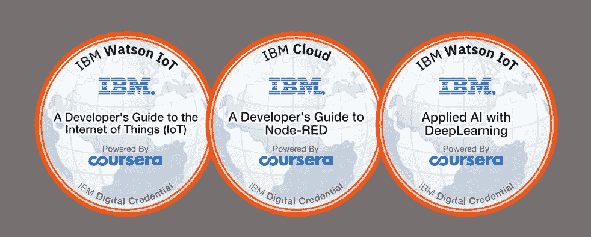
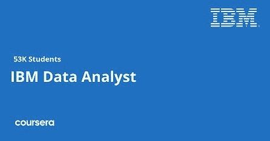
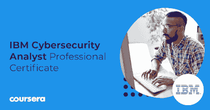
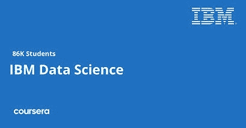
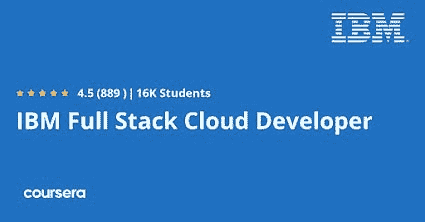
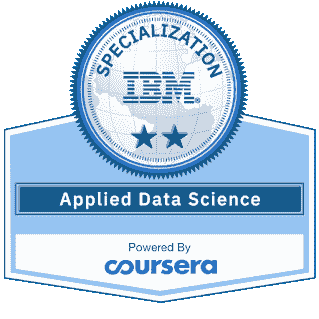

# Coursera 上 IBM 的 5 个最佳数据工程和云认证

> 原文：<https://medium.com/javarevisited/5-best-data-engineering-and-cloud-certifications-from-ibm-on-coursera-88571c6f47e3?source=collection_archive---------1----------------------->

## 在 Coursera 上寻找 IBM 最好的数据工程和云计算课程和专业？以下是 Coursera 列出的 2023 年最好的 IBM 课程

大家好，如果你正在 Coursera 上寻找最好的 IBM 课程，以学习最新的热门技能，如数据科学、机器学习、人工智能、深度学习、全栈开发和云计算，那么你来对地方了。

早些时候，我已经分享了 Coursera 的 [*最佳谷歌课程，以及学习*](/javarevisited/7-best-google-professional-certificates-on-coursera-to-learn-data-analytics-python-and-it-support-42147311cfe2)*[AWS](https://javarevisited.blogspot.com/2020/05/top-5-amazon-web-services-aws-courses-for-beginners-and-experienced-programmers.html)[谷歌云平台](https://javarevisited.blogspot.com/2019/07/top-5-google-cloud-platform-gcp-courses-certifications-online.html)和[微软 Azure 在线课程](https://javarevisited.blogspot.com/2020/02/top-5-courses-to-crack-az-900-microsoft-azure-fundamentals-certification-exam.html)的最佳 Coursera 课程，今天，我将分享 IBM 的最佳 Coursera 课程，IBM 是最大和最古老的技术公司之一。*

假设你只是一个寻找学习 IT 行业新事物的初学者，并倾向于成为一名开发人员、数据科学家、网络安全专家，或者已经在那个职位上。尽管如此，你还是想提高你在那个领域的技能。

那么没有比 [**Coursera 平台**](https://coursera.pxf.io/c/1193463/1164545/14726?u=https%3A%2F%2Fwww.coursera.org%2F) 更好的学习地方了。大公司和大学开设课程，提供给人们免费使用。尽管如此，你还是需要付费才能获得认证。该平台中最好的课程之一是由 IBM 公司为在 IT 行业工作的人提供的，并在现实生活中应用它们。

<https://coursera.pxf.io/c/1193463/1164545/14726?u=https%3A%2F%2Fwww.coursera.org%2F>  

# 2023 年 IBM 在 Coursera 上的 5 个最佳数据和云认证

这里有 IBM 最好的 Coursera 专业化和专业证书，你可以在 2022 年加入，学习数据科学、数据分析、网络安全、云计算，甚至全栈 web 开发。

## 1.IBM 数据分析师专业证书

假设您计划学习数据分析，处理 SQL 数据库，并使用 python 进行数据可视化。那样的话，你可以考虑报读这个叫[**IBM 数据分析师职业证书**](https://coursera.pxf.io/c/3294490/1164545/14726?u=https%3A%2F%2Fwww.coursera.org%2Fprofessional-certificates%2Fibm-data-analyst) 的课程。数据分析师的工作是一个很好的选择，这个职业有数百万个职位空缺。

该专业证书旨在教您为数据分析师的工作做好准备所需的技能，它有超过 38k 的注册人数，评分为 4.6 星，无需参加该课程的背景。

本课程教授您 excel 的基础知识，以及如何使用电子表格创建交互式图表和使用该软件进行数据可视化。然后转到学习 python 语言，用它来和 SQL 数据库交互。最后，学习使用 python 进行数据分析和可视化，并将所学知识应用到项目中。

以下是加入本课程的链接— [**IBM 数据分析师专业证书**](https://coursera.pxf.io/c/3294490/1164545/14726?u=https%3A%2F%2Fwww.coursera.org%2Fprofessional-certificates%2Fibm-data-analyst)

## 2.IBM 网络安全分析师专业证书

假设你想从事网络安全方面的职业，保护组织免受黑客攻击。那样的话，你大概需要看一看这个[**IBM 网络安全分析师职业证书**](https://coursera.pxf.io/c/3294490/1164545/14726?u=https%3A%2F%2Fwww.coursera.org%2Fprofessional-certificates%2Fibm-cybersecurity-analyst) **。**网络安全分析师预计，2019 年至 2029 年间，招聘人数将增长 31%，增长速度非常快。

这种专业证书将为你提供网络安全分析师工作所需的经验，它有超过 48k 的注册人数，评级为 4.6 星。

您将了解网络安全，并了解您在组织内部的职责以及关键的网络安全合规性。您将了解网络安全和数据库漏洞、渗透测试、网络威胁情报。

以下是加入本课程的链接— [**IBM 网络安全分析师职业证书**](https://coursera.pxf.io/c/3294490/1164545/14726?u=https%3A%2F%2Fwww.coursera.org%2Fprofessional-certificates%2Fibm-cybersecurity-analyst)

## 3.IBM 数据科学专业证书

数据科学是世纪工作，因为现在几乎每个公司都需要数据科学家来让公司做出更好的决策。根据 Glassdoor 的数据，数据科学家的平均工资为 117，212 美元。所以如果你想从事这个领域的职业，我推荐你考这个 [**IBM 数据科学专业证书**](https://coursera.pxf.io/c/3294490/1164545/14726?u=https%3A%2F%2Fwww.coursera.org%2Fprofessional-certificates%2Fibm-data-science) 。

这个数据科学专业证书是没有任何前期经验的初学者，你甚至可以在大学里不用花钱和时间学习这个领域就能获得一个好的职位。该证书的注册人数超过 63k，评分为 4.6 星。

您将学习数据科学家使用的工具以及解决问题的数据科学方法。学习 python 语言和 SQL 与数据库交互，还要学习数据分析、数据可视化和机器学习。

以下是加入本课程的链接— [**IBM 数据科学专业证书**。](https://coursera.pxf.io/c/3294490/1164545/14726?u=https%3A%2F%2Fwww.coursera.org%2Fprofessional-certificates%2Fibm-data-science)

## 4.IBM 全栈云开发者专业证书

全栈云开发人员学习 web 开发人员用来构建、部署、测试和运行全栈云原生应用的技术。这是最好的职业之一，因为所有公司都需要一个网站来向用户提供服务。这份 [**职业证书**](https://coursera.pxf.io/c/3294490/1164545/14726?u=https%3A%2F%2Fwww.coursera.org%2Fprofessional-certificates%2Fibm-full-stack-cloud-developer) 将在一个课程中教会你所有这些。

该专业证书包含十个短期课程，教你这些技术，让你为这份工作做好准备，它获得了超过 15k 名学生的注册，并获得了 4.5 颗良好评级星。

您将学习前端 web 开发技术，如 HTML、CSS 和 JavaScript，然后学习一些开发云原生应用程序的技术。您将使用 Node.js 开发一个云原生应用程序，并使用 python 语言和 Django 框架进行反应和学习。

以下是加入本课程的链接— [**IBM 全栈云开发者专业证书**](https://coursera.pxf.io/c/3294490/1164545/14726?u=https%3A%2F%2Fwww.coursera.org%2Fprofessional-certificates%2Fibm-full-stack-cloud-developer)

## 5.R 专业的应用数据科学

我在之前的一门课程中推荐过涉足数据科学行业。尽管如此，这个领域中使用了许多技术，所以这个具有 R 专业的 [**应用数据科学**](https://coursera.pxf.io/c/3294490/1164545/14726?u=https%3A%2F%2Fwww.coursera.org%2Fspecializations%2Fapplied-data-science-r) 将教你使用 R 编程语言应用这些技能。

这种专业化是为没有这种语言或数据科学经验的初学者准备的。在这五门短期课程中，您将培养良好的技能，将数据转化为见解。

您将开始学习使用 R 编程语言的基础知识，开始您的数据科学之旅，并了解用于与数据库交互和提取数据的 SQL 语言。然后使用 R 语言分析数据，并将其可视化。

以下是加入本课程的链接— [**应用数据科学与 R 专业**](https://coursera.pxf.io/c/3294490/1164545/14726?u=https%3A%2F%2Fwww.coursera.org%2Fspecializations%2Fapplied-data-science-r)

以上是关于数据科学和机器学习的**最佳 IBM 课程，以及 Coursera 将于 2023 年加入的云计算**。这份专业证书和专业清单将教会你新的技能，让你为工作和公司的好职位做好准备，因为许多组织已经开始忽视大学学位，而是专注于你的技能。

顺便说一句，如果你计划参加多个 Coursera 课程或专业，那么考虑参加 [**Coursera Plus 订阅**](https://coursera.pxf.io/c/3294490/1164545/14726?u=https%3A%2F%2Fwww.coursera.org%2Fcourseraplus) ，它可以让你无限制地访问他们最受欢迎的课程、专业、专业证书和指导项目。它每年花费大约 399 美元，但很值得，因为你可以访问 7000 多门课程和项目，还可以获得无限的证书。

<https://coursera.pxf.io/c/3294490/1164545/14726?u=https%3A%2F%2Fwww.coursera.org%2Fcourseraplus>  

你可能喜欢的其他 **Python 和** **Coursera 文章**

*   [5 个免费学习 Python 的网站](https://javarevisited.blogspot.com/2019/09/5-websites-to-learn-python-for-free.html)
*   [2023 年学习 Python 的 10 个理由](https://javarevisited.blogspot.com/2018/05/10-reasons-to-learn-python-programming.html)
*   [5 Python 中的数据科学与机器学习课程](https://javarevisited.blogspot.com/2018/03/top-5-data-science-and-machine-learning-online-courses-to-learn-online.html)
*   [开始职业生涯的十大 Coursera 认证](/javarevisited/top-10-coursera-certificates-to-start-your-career-in-cloud-data-science-ai-mainframe-and-it-558690c83587)
*   [初学 Python 的 5 大课程](https://hackernoon.com/top-5-courses-to-learn-python-in-2018-best-of-lot-26644a99e7ec)
*   [Python 开发者的五大 Web 开发框架](https://javarevisited.blogspot.com/2019/04/top-5-python-web-development-frameworks.html)
*   [2023 年程序员 10 大课程课程](https://javarevisited.blogspot.com/2020/08/top-10-coursera-courses-specilizations-and-certifications.html)
*   [Udemy vs Pluralsight？哪个学习平台比较好？](https://javarevisited.blogspot.com/2019/10/udemy-vs-pluralsight-review-which-is-better-to-learn-code.html)
*   [2023 年学习 Python 可以做的 8 个项目](/javarevisited/8-projects-you-can-buil-to-learn-python-in-2020-251dd5350d56)
*   [学习云计算的 10 门最佳 Coursera 课程](https://javarevisited.blogspot.com/2020/08/top-10-coursera-certifications-to-learn-cloud-computing-aws.html#axzz6WK1yC5WW)
*   [面向程序员和开发人员的 Coursera 十大项目](https://javarevisited.blogspot.com/2020/08/top-10-coursera-projects-to-learn-essential-programming-skills.html)
*   Udemy vs Educative vs Codecademy？新手用哪个好
*   Coursera 证书对工作和事业有帮助吗
*   [学习数据科学的十大课程](https://javarevisited.blogspot.com/2020/08/top-10-coursera-certifications-to-learn-Data-Science-Visualization-and-Data-Analysis.html)
*   [Coursera Plus Review——在 Coursera 上学习的更好方式](https://javarevisited.blogspot.com/2020/08/coursera-plus-better-way-to-take-coursera-courses-specilizations-certification.html)
*   Udemy vs CocdeCademy vs OneMonth？
*   [2023 年学习人工智能的 7 门最佳课程](/javarevisited/7-best-courses-to-learn-artificial-intelligence-in-2020-26d59d62f6fe)
*   【Coursera 的 10 项数据科学和机器学习认证

感谢阅读这篇文章。如果你喜欢我对 Coursera 最好的 Python 课程——来自密歇根大学的 Python——的评论，那么请与你的朋友和同事分享。如果您有任何问题或反馈，请留言。

**P. S.** —如果你正在寻找学习 Python 和数据科学的最佳 Udemy 课程，那么我强烈推荐你加入 Udemy 上何塞·波尔蒂利亚的 [**完整 Python 训练营:从零到英雄**](http://bit.ly/2BY5LJC) 课程。这是最受欢迎的 Python 课程，已经有超过 100 万的学生学习了这门课程。它也很实惠，在 Udemy 上只需 10 美元就能买到

<https://javarevisited.blogspot.com/2020/10/the-complete-python-bootcamp-go-from-zero-to-hero-udemy-course-review.html> 