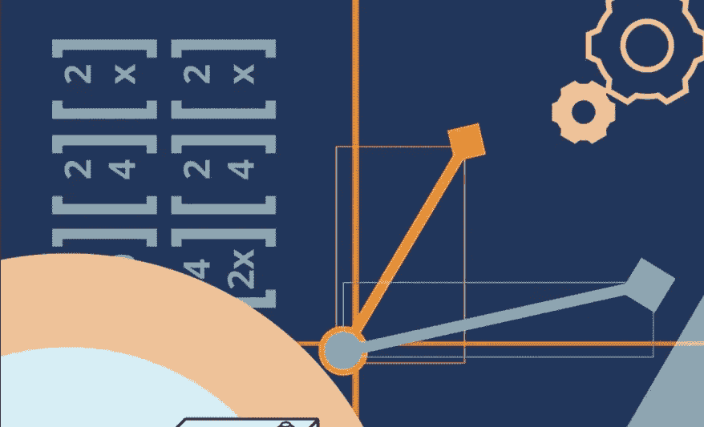
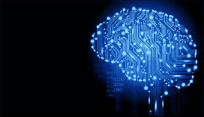
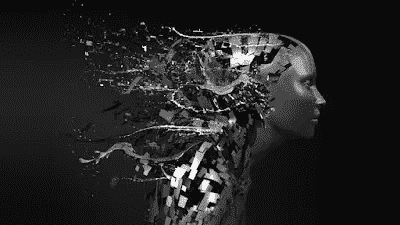
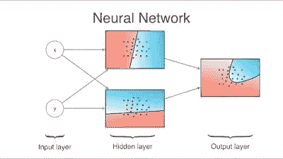
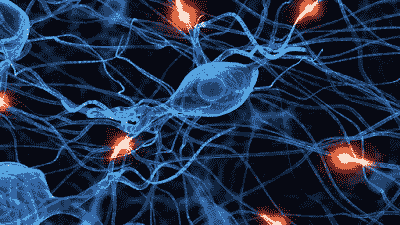

# 2023 年 5 门最佳深度学习在线培训课程

> 原文：<https://medium.com/javarevisited/5-best-deep-learning-online-training-courses-for-beginners-with-certificates-6036efc31236?source=collection_archive---------2----------------------->

## 以上是 2023 年深度学习最好的线上课程，有证书。你将获得 Coursera 和谷歌等知名公司的证书。

**学习深度学习深入？听起来递归？没有吗？**的确是。毫无疑问，机器学习是一门艰难的学科，尤其是深入的知识，需要大量的数学和复杂的术语，非常难以掌握。

如果主题很难，你如何学得更好？选一门能用简单的话解释这个复杂话题的课程。

事实上，我们很幸运，在 Udemy 上有许多优秀的导师，如吴恩达、杰瑞米·霍华德和基里尔·叶列缅科，他们不仅是[深度学习](https://javarevisited.blogspot.com/2018/10/data-science-and-machine-learning-courses-using-python-and-R-programming.html#axzz5gKfbWIIv)的专家，也是优秀的导师和老师。

我坚信每个程序员都应该了解[云计算](https://javarevisited.blogspot.com/2019/07/top-5-online-courses-to-learn-cloud-computing-aws.html)和[人工智能](/javarevisited/10-best-udemy-and-coursera-courses-to-learn-artificial-intelligence-in-2020-ec77ad13bdc1)，因为这两者将在未来几年驱动世界。数据科学、机器学习和深度学习对于在许多方面理解和使用人工智能来说是必不可少的，这也是我花大量业余时间学习这些技术的原因。

我的机器学习之旅始于几年前，当时我在 Coursera 上偶然看到了吴恩达优秀的 [**机器学习课程**](https://coursera.pxf.io/c/3294490/1164545/14726?u=https%3A%2F%2Fwww.coursera.org%2Flearn%2Fmachine-learning)；这也是 Coursera 的第一门课程，因为吴恩达也是 Coursera 的创始人之一。

 [## 监督机器学习:回归和分类

### 在机器学习专业化的第一门课程中，您将:*使用…

coursera.pxf.io](https://coursera.pxf.io/c/3294490/1164545/14726?u=https%3A%2F%2Fwww.coursera.org%2Flearn%2Fmachine-learning) 

除了课程之外，安德鲁还启发我学习机器学习和人工智能，从那以后，每当我阅读他在 Medium 上推出的深度学习课程时，我总是很兴奋地想了解更多关于这个领域的知识。

另一个对我启发很大的故事是一个日本农民，他用谷歌的 [TensorFlow](https://hackernoon.com/top-5-tensorflow-and-ml-courses-for-programmers-8b30111cad2c) 和[机器学习](https://dev.to/javinpaul/10-data-science-and-machine-learning-courses-for-programmers-looking-to-switch-career-57kd)在自己的农场对黄瓜进行过滤和分类，这显然只有他的母亲才能做到，因为她有多年的经验。

故事引人注目；他们不仅教学，而且启发，你会在这些优秀的课程中发现很多，我将与你分享关于深度学习的深入。

如果你是机器学习新手，那么就不要从这些课程开始；最好的起点还是 Coursera 上的[吴恩达原创的机器学习课程](https://coursera.pxf.io/c/3294490/1164545/14726?u=https%3A%2F%2Fwww.coursera.org%2Flearn%2Fmachine-learning)。上完那门课，你要去查这些高级课程，深入学习神经网络和深度学习。

 [## 监督机器学习:回归和分类

### 在机器学习专业化的第一门课程中，您将:*使用…

coursera.pxf.io](https://coursera.pxf.io/c/3294490/1164545/14726?u=https%3A%2F%2Fwww.coursera.org%2Flearn%2Fmachine-learning) 

# 面向初学者的 5 门最佳深度学习在线课程

在不浪费你更多时间的情况下，这里是我列出的深入学习深度学习的最佳课程。我选择的课程既适合初学者，也适合在机器学习和深度学习领域有一定经验的开发者。

即使数学是深度学习不可或缺的一部分，我也选择了不需要学习复杂数学概念的课程；每当需要什么东西的时候，老师都会用简单的语言解释。

## 1.[吴恩达和团队的深度学习专业化](https://coursera.pxf.io/c/3294490/1164545/14726?u=https%3A%2F%2Fwww.coursera.org%2Fspecializations%2Fdeep-learning)

信不信由你，Coursera 可能是在线学习机器学习和深度学习的最好地方，其中一个很大的原因是吴恩达，他让机器学习在开发者中流行起来。如果你不知道，他也是 Coursera 的创始人之一，他在斯坦福开设的经典机器学习课程很可能是 Coursera 上的第一门在线课程。除了那门经典课程，Andrew 还为每个人创造了更多的宝石，如[*AI*](https://coursera.pxf.io/c/3294490/1164545/14726?u=https%3A%2F%2Fwww.coursera.org%2Flearn%2Fai-for-everyone%3F)，我再次向每个程序员和非技术人员推荐。

AI 不只是针对程序员，而是针对所有人，这是所有非技术人员，如项目经理、业务分析师、运营和事件管理团队学习 AI 的最佳课程。

这是 jion 这个课程的链接——吴恩达和团队的[深度学习专业化](https://coursera.pxf.io/c/3294490/1164545/14726?u=https%3A%2F%2Fwww.coursera.org%2Fspecializations%2Fdeep-learning)

回到 Andrew 的深度学习专业化，这是一个以神经网络和深度学习为主的五门课程的集合，如下图:

1。神经网络和深度学习
2。改进深度神经网络:超参数调整、正则化和优化
3。构建机器学习项目
4。卷积神经网络
5。序列模型

Andrew 遵循自下而上的方法，这意味着您将从最小的组件开始，并朝着构建产品的方向前进。在这五门课程中，你会学到[深度学习](/javarevisited/top-5-advanced-deep-learning-and-neural-network-courses-to-learn-in-2020-a273f5eddca5)的基础，如何建立神经网络，如何领导成功的机器学习项目。

您还将了解卷积网络、RNNs、LSTM、Adam、Dropout、BatchNorm、Xavier/He 初始化等。你将从事医疗保健、自动驾驶、手语阅读、音乐生成和自然语言处理的案例研究。这门课程不仅仅是枯燥的理论；动手性和互动性都很强。你将在 [Python](https://hackernoon.com/top-5-courses-to-learn-python-in-2018-best-of-lot-26644a99e7ec) 和 [TensorFlow](https://dev.to/javinpaul/10-of-the-best-tensorflow-courses-to-learn-machine-learning-from-coursera-and-udemy-37bf) 中实践想法，这些你将在课程中学习到。
如果你对深度学习很认真，我强烈建议你加入这个专业，完成全部五门课程。这可能需要 3 到 5 个月的时间，但它完全值得你花时间，超过 50 万名学习者已经从这个专业中受益。

## 2.[深度学习 A-Z:动手人工神经网络](https://click.linksynergy.com/deeplink?id=JVFxdTr9V80&mid=39197&murl=https%3A%2F%2Fwww.udemy.com%2Fdeeplearning%2F)

如果你没有 3 到 5 个月的空闲时间，但又想详细学习深度学习，那么你应该加入这个课程。在这门课程中，你将从两位机器学习和数据科学专家那里学习如何用 Python 创建深度学习算法:基里尔·叶列缅科和哈德林·德·庞特斯。

这门课将教会你作为深度学习专家需要知道的几乎所有东西，虽然没有上一节课那么深入但仍然足够好。它涵盖了从基本到高级深度学习概念(如 ANN 和 CNN)的许多领域。

我真的很喜欢 Kirill 展示模型的直觉部分，Hadelin 为一些现实生活中的项目写代码。

这是加入本课程的链接。[深度学习 A-Z:](https://click.linksynergy.com/deeplink?id=JVFxdTr9V80&mid=39197&murl=https%3A%2F%2Fwww.udemy.com%2Fdeeplearning%2F)

谈到社会证明，这门课程已经得到了超过 17 万名学生的信任，从接近 23K 的评分中平均获得了 4.5 的评分，这太令人惊讶了。

总之，这是一个激动人心的培训项目，包含直觉教程、实践练习和真实案例研究。我强烈向任何对数据科学和深度学习感兴趣的人推荐这门课程。

## 3.[深度学习简介](https://coursera.pxf.io/c/3294490/1164545/14726?u=https%3A%2F%2Fwww.coursera.org%2Flearn%2Fintroduction-to-deep-learning-boulder)

这是科罗拉多大学博尔德分校提供的 Coursera 关于深度学习的另一门令人印象深刻的课程。我不是说过 Coursera 有网上最好的机器学习课程吗？是的，这个课程是他们 [*机器学习的一部分:理论和 Python 专门化*](https://coursera.pxf.io/c/3294490/1164545/14726?u=https%3A%2F%2Fwww.coursera.org%2Fspecializations%2Fmachine-learnin-theory-and-hands-on-practice-with-pythong-cu) 的动手实践。

由 Geena Kim 教授，本课程旨在让学习者对现代神经网络及其在计算机视觉和自然语言理解中的应用有一个基本的了解。

本课程首先回顾线性模型，并讨论用于训练深度神经网络的关键随机优化方法。您将学习神经网络的基本构建模块，以及它如何一层一层地工作。

不过，你应该对 Python 和数学有很好的了解。如果你对 Python 还不熟悉，我建议你参加我之前推荐的[顶级 Python 课程](https://dzone.com/articles/top-5-courses-to-learn-python-in-2018-best-of-lot)。

以下是加入本课程的链接— [深度学习简介](https://coursera.pxf.io/c/3294490/1164545/14726?u=https%3A%2F%2Fwww.coursera.org%2Flearn%2Fintroduction-to-deep-learning-boulder)

而且，如果你觉得 Coursera 课程、专业和认证有用，那么我建议你加入 [**Coursera Plus**](https://coursera.pxf.io/c/3294490/1164545/14726?u=https%3A%2F%2Fwww.coursera.org%2Fcourseraplus) ，这是 Coursera 的一个伟大的订阅计划，让你无限制地访问他们最受欢迎的课程、专业、专业证书和指导项目。它每年花费大约 399 美元，但是它完全值得你的钱，因为你得到了**无限证书**。

 [## Coursera Plus |无限制访问 7，000 多门在线课程

### 在 Coursera 上可以无限制地访问 90%以上的课程、项目、专业和专业证书

coursera.pxf.io](https://coursera.pxf.io/c/3294490/1164545/14726?u=https%3A%2F%2Fwww.coursera.org%2Fcourseraplus) 

## 4.[fast . ai 针对编码员的实用深度学习](https://course.fast.ai/)

这是杰瑞米·霍华德关于深度学习的经典课程。他是另一个令人敬畏的深度学习导师，Coursera 的吴恩达和 Udemy 的基里尔·叶列缅科。说起他的课程，正好和吴恩达的深度学习课程相反。

前一门采用自下而上的方法，这门课采用自上而下的方法。首先向您介绍产品，然后深入了解各个部分。

这门课程最棒的地方在于，它的结构非常好，一步一步地移动，这有助于建立复杂的深度学习和神经网络概念。

似乎这个免费的深度学习课程现在也可以在 YouTube 的 FreeCodeCamp 频道上看到，你可以在 YouTube 上观看

## 5.[数据科学:Python 中的深度学习](https://click.linksynergy.com/deeplink?id=JVFxdTr9V80&mid=39197&murl=https%3A%2F%2Fwww.udemy.com%2Fdata-science-deep-learning-in-python%2F)

最深入的看看神经网络理论以及如何用纯 Python 和 TensorFlow 编码一个。如果你曾经想要一门课程，可以教你如何从零开始创建自己的神经网络，那么这是你应该加入的课程。

在本课程中，你将使用深度学习技术建立你的第一个人工神经网络。你还可以找到对人工神经网络背后的数学的深入解释，这对数据科学家来说非常重要。

课程使用 [Python](https://dzone.com/articles/10-free-courses-to-learn-python-in-2019) 和 [NumPy](https://javarevisited.blogspot.com/2018/10/top-8-python-libraries-for-data-science-machine-learning.html) ，一个用于机器学习的 Python 库来构建完全非线性。它还会教你如何安装 TensorFlow，并使用它来训练你的深度学习模型。我强烈推荐这个课程给任何想知道深度学习真正是如何工作的人。

以下是加入本课程的链接— [数据科学:Python 中的深度学习](https://click.linksynergy.com/deeplink?id=JVFxdTr9V80&mid=39197&murl=https%3A%2F%2Fwww.udemy.com%2Fdata-science-deep-learning-in-python%2F)

以上就是关于掌握神经网络和其他深度学习概念的一些**最佳深度学习在线课程。我们还学习了有用的 Python 库，如 TensorFlow、Pandas 和 Numpy，它们可以帮助您为深度学习模型进行数据清理、解析和分析。

你可以使用这些课程和在线培训中的任何一种来学习深度学习，但我强烈推荐你查看吴恩达和他的团队在 Coursera** 上的 [**深度学习专业化。这是迄今为止最全面的深度学习资源。**](https://javarevisited.blogspot.com/2020/10/deep-learning-specilization-andrew-ng-coursera-review.html)

 [## 深度学习

### 从 deeplearning.ai 学习深度学习，如果你想打入人工智能(ai)，这个专精…

coursera.pxf.io](https://coursera.pxf.io/c/3294490/1164545/14726?u=https%3A%2F%2Fwww.coursera.org%2Fspecializations%2Fdeep-learning) 

如果您喜欢这篇文章，您可能也会喜欢我的其他 Python、数据科学和机器学习文章:

*   [2023 年学习 Python 的 10 个理由](https://javarevisited.blogspot.com/2018/05/10-reasons-to-learn-python-programming.html)
*   [5 Python 中的数据科学和机器学习课程](https://javarevisited.blogspot.com/2018/03/top-5-data-science-and-machine-learning-online-courses-to-learn-online.html)
*   [2023 年学习数据科学的 10 种资源](https://dev.to/javinpaul/11-best-resources-to-learn-data-science-and-machine-learning-in-2020-2od)
*   [初学 Python 的 5 大课程](https://hackernoon.com/top-5-courses-to-learn-python-in-2018-best-of-lot-26644a99e7ec)
*   [学习数据科学的 10 个 Coursera 认证](https://javarevisited.blogspot.com/2020/08/top-10-coursera-certifications-to-learn-Data-Science-Visualization-and-Data-Analysis.html)
*   [面向数据科学和机器学习的 8 大 Python 库](https://javarevisited.blogspot.com/2018/10/top-8-python-libraries-for-data-science-machine-learning.html)
*   [学习机器学习 Python 的前 5 本书](https://javarevisited.blogspot.com/2019/08/top-5-python-books-for-data-science-and-machine-learning.html)
*   [学习机器学习的 10 个课程认证](/javarevisited/10-best-coursera-certifications-courses-for-machine-learning-and-artificial-intelligence-256d9a125822)
*   [Python 和 JavaScript——从哪个开始比较好？](https://javarevisited.blogspot.com/2019/05/python-vs-javascript-which-programming-language-beginners-should-learn.html)
*   [深入学习 Python 的 10 门免费在线课程](https://javarevisited.blogspot.com/2018/12/10-free-python-courses-for-programmers.html)
*   [Python vs . Java——初学者应该学习哪种编程语言？](https://javarevisited.blogspot.com/2018/06/java-vs-python-which-programming-language-to-learn-first.html)
*   [面向程序员的 10 本免费 Python 编程书籍](http://www.java67.com/2017/05/top-7-free-python-programming-books-pdf-online-download.html)
*   [深入学习 Python 的 10 门免费课程](https://hackernoon.com/10-free-python-programming-courses-for-beginners-to-learn-online-38312f3b9912)
*   [Python 编程的 10 门最佳课程](https://javarevisited.blogspot.com/2020/02/10-best-coursera-courses--for-python.html#axzz6fvDCikIM)

感谢您阅读本文。如果你喜欢这些*最好的深度学习在线课程*，那么请分享给你的朋友和同事。如果您有任何问题或反馈，请留言。

**P. S.** —如果你喜欢从免费资源中学习，那么你也可以看看这份为数据科学家和程序员提供的 [**5 种免费资源学习机器学习**](https://www.java67.com/2018/09/top-5-free-R-programming-courses-for-Data-Science-Machine-Learning-Programmers.html) 。它包含一些来自 Udemy、Coursera、Pluralsight 和其他学习 ML 的地方的免费在线课程。

 [## 2023 年面向初学者的 10 门免费深度学习课程

### 我最喜欢的免费在线课程，从零开始学习深度学习和神经网络。该列表包括最好的免费…

medium.com](/javarevisited/10-free-deep-learning-courses-for-beginners-37b5de61f8dc)