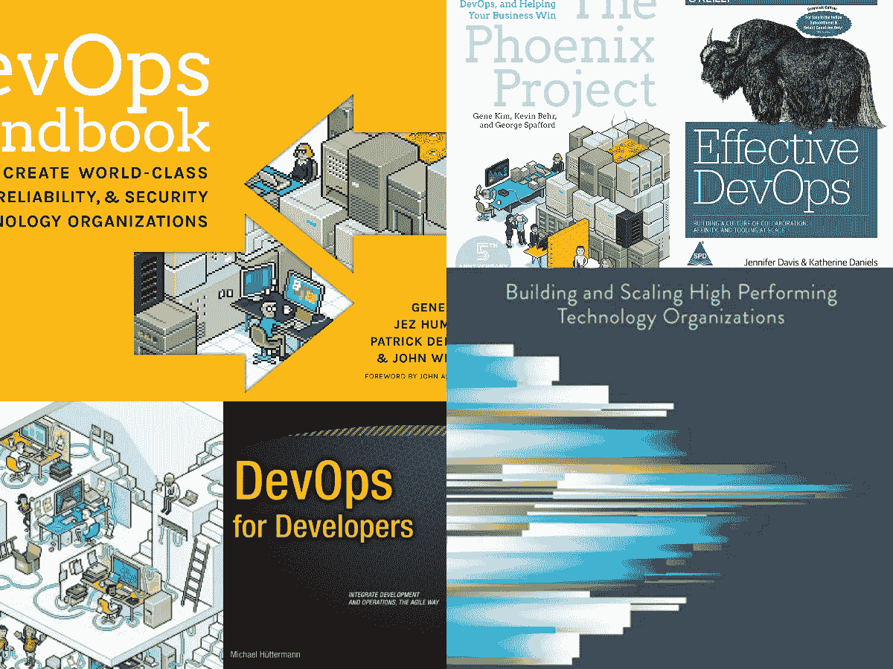
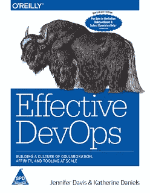
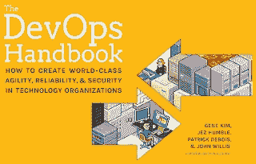
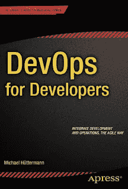
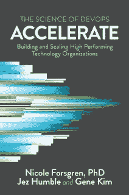
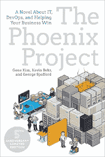

# 2022 年体验的 5 本最佳 DevOps 新手用书

> 原文：<https://medium.com/javarevisited/5-best-devops-books-for-experienced-developers-78f9b4c5e4d5?source=collection_archive---------0----------------------->

## 这些是高级开发人员和 DevOps 工程师学习 DevOps、持续集成和交付的最佳书籍。

你好，伙计们，如果你想学习 DevOps 或者你已经是一名 DevOps 工程师，想把你的技能提升到一个新的水平，并寻找最好的资源，如书籍阅读，那么你来对地方了。

DevOps 是经验丰富的开发人员的必备技能之一。也为那些不想去做项目管理，想保持技术，贴近代码的资深开发者提供了一条职业道路，但是 DevOps 是什么？还有怎么学 DevOps？

在过去，我已经分享了一些 [**最好的 DevOps 课程**](/javarevisited/13-best-courses-to-learn-devops-for-senior-developers-in-2020-a2997ff7c33c) 和一个完整的 [**DevOps 工程师路线图**](/hackernoon/the-2018-devops-roadmap-31588d8670cb) ，在这篇文章中，我将分享给开发者学习 DevOps 的最好的书籍，但在此之前我们先了解一下**什么是 DevOps？它是开发(Dev)和运营(Ops)两个词的结合。**

这里的开发是指软件开发，我指的是写代码，[单元测试](/javarevisited/5-courses-to-learn-junit-and-mockito-in-2019-best-of-lot-f217d8b93688)，调试运行源代码创建软件的过程。而操作是信息技术操作，如部署、支持和创建新环境。

这个开发和运营的神圣联盟，我的意思是 [DevOps](/javarevisited/10-free-online-courses-to-learn-devops-for-beginners-9feadb644f50) 旨在使软件开发时间大大缩短，同时仍然能够开发和交付高质量的软件。2009 年在比利时有一个开发者大会叫做 DevOps day。正是这次会议上讨论的内容后来催生了我们今天所说的 DevOps。从 2012 年到 2014 年，已经有一份 DevOps 报告，并且每年出版。

devo PS 工具链是软件编码、构建、测试、打包、发布、配置、基础设施自动化和监控。这也意味着学习工具，如用于 CI/CD 的 [Jenkins](https://javarevisited.blogspot.com/2018/09/top-5-jenkins-courses-for-java-and-DevOps-Programmers.html) ，用于容器化的 [Docker](/@javinpaul/10-free-courses-to-learn-docker-and-devops-for-frontend-developers-691ac7652cee) ，用于容器部署的 [Kubernetes](https://javarevisited.blogspot.com/2019/05/top-5-courses-to-learn-docker-and-kubernetes-for-devops.html) ，用于基础设施自动化的 [Ansible](https://javarevisited.blogspot.com/2019/11/top-5-course-to-learn-ansible-for-devops.html) 等等。

如果你想了解一些关于 DevOps 的事情，或者想了解一些关于 DevOps 的债务信息，那么这几本书可能就是你的起点。顺便说一句，如果你是 DevOps 世界的完全初学者，那么[**devo PS:plural sight 上的大图**](https://pluralsight.pxf.io/c/1193463/424552/7490?u=https%3A%2F%2Fwww.pluralsight.com%2Fcourses%2Fdevops-big-picture) 课程也是一个很好的开始材料。

 [## DevOps:大局

### 本 DevOps 培训将教您:什么是 DevOps 如何过渡到 DevOps 方法哪些技术在…

pluralsight.pxf.io](https://pluralsight.pxf.io/c/1193463/424552/7490?u=https%3A%2F%2Fwww.pluralsight.com%2Fcourses%2Fdevops-big-picture) 

您将了解自动化和技术如何在开发运维中发挥关键作用，以及为什么开发运维对各种规模的公司都很重要。

此外，如果你有开发背景，负责设置、构建和部署管道，或者想了解更多关于现实世界的专业级 CI 和 CD 流程，那么弗吉尼亚大学 Courser 上的 [**连续交付& DevOps 课程**](https://click.linksynergy.com/deeplink?id=JVFxdTr9V80&mid=40328&murl=https%3A%2F%2Fwww.coursera.org%2Flearn%2Fuva-darden-continous-delivery-devops) 也是一个很好的资源。你也可以免费审计。

 [## 持续交付和开发运营

### 众所周知，亚马逊每 11.6 秒发布一次新代码。就在几年前，这是不可思议的:许多“尖端”…

coursera.com](https://click.linksynergy.com/deeplink?id=JVFxdTr9V80&mid=40328&murl=https%3A%2F%2Fwww.coursera.org%2Flearn%2Fuva-darden-continous-delivery-devops) 

# 2022 年 DevOps 工程师应该阅读的 5 本最佳书籍

不要再浪费你的时间了，这里有一些学习 DevOps 的最好的书，不仅仅是工具链，还有自动化的哲学和思想，这是 devo PS 的核心。您将学习如何设置 CI/CD 管衬管，以便无缝建造、测试和部署。

## 1.[有效 DevOps](https://www.amazon.com/Effective-DevOps-Building-Collaboration-Affinity-ebook/dp/B01GGQKXOE?tag=javamysqlanta-20)

《有效的 DevOps:建立大规模的协作、亲和和工具文化》是奥赖利书籍的另一个集锦。这是一家撰写技术书籍、文章和会议的公司，由一个叫汤姆·雷利的人拥有。然而，这本书是由詹妮弗·戴维斯和瑞恩·丹尼尔斯写的。这本 410 页的特纳探索了 DevOps 的基本原理，并教授如何鼓励开发人员和 IT 之间的协作。

目录包括第一章，概述了 DevOps 文化及其演变。它也给出了两个故事的实例，凯瑟琳的故事和詹妮弗的故事。

然后，它谈到了这两个故事的价值，并用故事来说明 Devops。另一方面，第二章将 DevOps 描述为文化的处方，并解释了 DevOps 方程式。

顺便说一下，如果你觉得这本书有点难读，那么我也建议你将这本书与 Udemy 上 John Hanoi 的 [**DevOps、CI/CD(初学者的持续集成/交付**](https://click.linksynergy.com/deeplink?id=CuIbQrBnhiw&mid=39197&murl=https%3A%2F%2Fwww.udemy.com%2Fcourse%2Fci-cd-devops%2F) )等课程结合起来，以获得一些积极的学习体验。

 [## 2022 年高级开发者学习 DevOps 的 13 大课程

### 这些是 Udemy、Coursera 和 Pluralsight 的最佳 DevOps 课程，将于 2022 年在线学习

medium.com](/javarevisited/13-best-courses-to-learn-devops-for-senior-developers-in-2020-a2997ff7c33c) 

回到这本书，第三章涵盖了 DevOps 和作为运营商的开发人员的历史，专有软件和标准化的软件工程的出现，网络时代，全球社区的开始，应用程序和 Web 的时代，软件开发方法的发展，开源软件，专有服务和敏捷基础设施。

扩展到 DevOps 日的开始， [DevOps 的当前状态](/@javinpaul/10-free-courses-to-learn-docker-and-devops-for-frontend-developers-691ac7652cee)。第四章是基础术语，第五章讨论 DevOps 的误解和反模式。

第六章讲述了*有效发展的四大支柱*，第七章讲述了协作，这意味着教会个人如何一起工作。

第八章仍涵盖协作，但包含误解和故障排除，第十章涵盖密切关系:误解和故障排除。

第 12 章和第 13 章是关于文化、误解和故障排除加速器的工具

第 15 章是扩大误解和故障排除，第 17 章是讲授如何在 DevOps 文化和从我们的故事中学习之间建立一座桥梁。剩下的章节只是总结了用更多的资源创建有效的 Devops

## 2.[devo PS 手册](https://www.amazon.com/DevOps-Handbook-World-Class-Reliability-Organizations/dp/1942788002?tag=javamysqlanta-20)

这本手册是由 Gene Kim、Jez Humble、Patrick Debois 和 John Willis 编写的，自那以后赢得了许多开发人员和程序员的青睐。

网站上的评论也令人惊叹，这本书将负责编写代码的开发团队和负责启动和维护软件的运营团队之间的关系联系起来。

它强调了双方保持沟通的重要性。这本 2016 年出版的 480 页的书将教你“如何在技术组织中创造世界级的敏捷性、可靠性和安全性。”

你也可以把这本书和类似 [**Docker 的课程结合起来——动手 DevOps**](https://click.linksynergy.com/deeplink?id=JVFxdTr9V80&mid=39197&murl=https%3A%2F%2Fwww.udemy.com%2Fcourse%2Flearn-docker%2F) 也可以学习具体的关键工具，比如 Docker、Jenkins、Ansible、Puppet 和 Kubernetes，这些工具对任何 DevOps 工程师来说都是必不可少的。

 [## 2022 年面向 Java 和 Spring Boot 开发者的 5 门最佳 Docker 课程

### 我最喜欢的在线培训课程，从 Udemy、Coursera 和 Pluralsight 学习 Docker 和 Containers from 和…

medium.com](/javarevisited/5-best-docker-courses-for-java-and-spring-boot-developers-bbf01c5e6542) 

## 3.[面向开发者的 DevOps】](https://www.amazon.com/DevOps-Developers-Experts-Voice-Development/dp/1430245697?tag=javamysqlanta-20)

这本书概述了能够使敏捷软件开发人员将软件开发带入交付阶段的方法。它使用 DevOps 工具链，如编码、构建、测试、打包、发布、配置和监控，来集成软件开发和运营。

为开发者讲授 DevOps 的基础知识，并介绍 DevOps 的构建模块。这本书讨论了如何使用度量和测量视图、质量和测试、共享激励和过程视图作为程序，通过统一和整体的方法获得快速反馈。

如果你需要一门课程，那么你也可以将这本书与 Udemy 上 Rahul Shetty 的[**devo PS Fundamentals——CI/CD with AWS+Docker+ansi ble+Jenkins**](https://click.linksynergy.com/deeplink?id=JVFxdTr9V80&mid=39197&murl=https%3A%2F%2Fwww.udemy.com%2Fcourse%2Fdevops-fundamentals-aws%2F)课程结合起来。对于开发者来说，学习一些动手的 DevOps 知识是一门很棒的课程。

## 4.[加速:精益软件和 DevOps 的科学](https://www.amazon.com/Accelerate-Software-Performing-Technology-Organizations/dp/1942788339?tag=javamysqlanta-20)

这本书是一个获奖的 DevOps 关于“建立和扩展高绩效技术组织”的书，作者是 Nicole Forsgren，Jez Humble 和 Gene Kim。这本书是一个关于开发到交付软件的最佳过程的基于研究的文本。

历时四年的努力工作和研究才得以完成，并对结果进行了分析，然后提交给全球的开发人员。有了这本书，读者可以安全地访问他们的团队，并重新分配他们以获得最大的结果。

## 5.[凤凰计划](https://www.amazon.com/Phoenix-Project-DevOps-Helping-Business/dp/0988262592?tag=javamysqlanta-20)

学习书籍很有趣，尤其是那些有一长串“该做什么”和“不该做什么”以及“为什么”和过程的书。不幸的是，如果你不喜欢这么长的类比，或者在第一章就睡着了，那么这本书非常适合你。

“凤凰计划”是一部描述使用 [DevOps 技术](https://javarevisited.blogspot.com/2018/09/10-devops-courses-for-experienced-java-developers.html#axzz6hB6A1qlY)解决 IT 和软件危机的小说。在这里，你将完全被比尔的世界所吸引，他是 Parts Unlimited 的 IT 经理。

《凤凰计划:一部关于 IT 的小说，DevOps，帮助你的企业赢得胜利》这本书已经被很多开发者在多个场合称之为惊险和鬼祟，有那么多人向我推荐，我都数不过来了。

以上是关于初学者和有经验的程序员学习 DevOps 的一些最好的书。DevOps 是现代软件开发领域的一项重要技能，尤其是对高级程序员而言。如果你想在职业生涯中成长为一名技术架构师，或者想继续接近代码，DevOps 提供了另一种选择。

您可能喜欢的其他**开发运维、云计算和编程课程**

*   [完整的 DevOps 开发者路线图](/hackernoon/the-2018-devops-roadmap-31588d8670cb)
*   [面向 Java 和 DevOps 专业人员的 10 门免费 Docker 课程](https://javarevisited.blogspot.sg/2018/02/10-free-docker-container-courses-for-Java-Developers.html)
*   [7 门针对初学者的免费 Kubernetes 课程](/javarevisited/7-free-online-courses-to-learn-kubernetes-in-2020-3b8a68ec7abc)
*   [学习 Jenkins 自动化和开发运维的五大课程](https://javarevisited.blogspot.com/2018/09/top-5-jenkins-courses-for-java-and-DevOps-Programmers.html)
*   [5 门免费 Selenium 课程学习自动化测试](https://javarevisited.blogspot.sg/2018/02/top-5-selenium-webdriver-with-java-courses-for-testers.html)
*   面向程序员的 10 门 Docker 和 Kubernetes 课程
*   [面向 Java 开发人员的 6 门 Maven 课程](http://www.java67.com/2018/02/6-free-maven-and-jenkins-online-courses-for-java-developers.html)
*   [2022 年 Java 开发人员应该学会的 10 件事](http://javarevisited.blogspot.sg/2017/12/10-things-java-programmers-should-learn.html#axzz53ENLS1RB)
*   [10 个面向开发者的 DevOps 培训课程](https://dev.to/javinpaul/top-10-devops-training-courses-for-programmers-and-software-developers-195n)
*   [2022 年 Java 开发人员应该学习的 10 种工具](http://www.java67.com/2018/04/10-tools-java-developers-should-learn.html)
*   [5 个免费弹簧框架和 Spring Boot 课程](http://www.java67.com/2017/11/top-5-free-core-spring-mvc-courses-learn-online.html)
*   [学习 Docker 和 Kubernetes 的十大课程](https://dev.to/javinpaul/top-10-courses-to-learn-docker-and-kubernetes-for-programmers-4lg0)
*   [程序员学习 AWS 和云的 10 门免费课程](/javarevisited/top-10-courses-to-learn-amazon-web-services-aws-cloud-in-2020-best-and-free-317f10d7c21d)

感谢您阅读本文。如果你觉得这些*适合初学者和有经验的开发者的 DevOps 书籍*有用，那么请与你的朋友和同事分享。如果你有任何问题，反馈，或者一本书应该在这个列表上，请随时与我们分享。

**P. S.** —如果您需要一些免费的在线课程来启动您的 DevOps 之旅，那么您也可以看看 Udemy 上的这个 [**免费 DevOps 基础课程**](https://click.linksynergy.com/deeplink?id=JVFxdTr9V80&mid=39197&murl=https%3A%2F%2Fwww.udemy.com%2Fcourse%2Flinux-academy-devops-essentials%2F) ，与 Jenkins、Docker 和 Kubernetes 一起为程序员和开发人员从头开始学习 DevOps。

 [## 我最喜欢的为前端开发者学习 Docker 和 DevOps 的免费课程

### 面向开发人员和 DevOps 专业人员的免费 Docker 课程精选列表

medium.com](/javarevisited/10-free-courses-to-learn-docker-and-devops-for-frontend-developers-691ac7652cee)