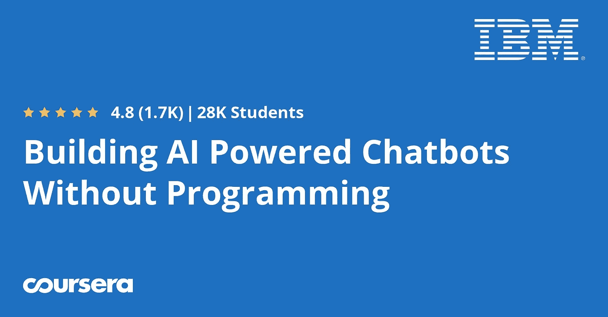
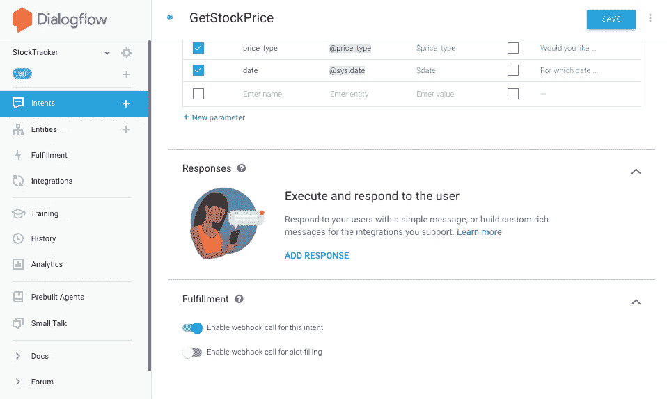

# 2023 年使用 Python、Java 和 Dialog Flow 学习和构建 ChatGPT 等聊天机器人的 7 门最佳课程

> 原文：<https://medium.com/javarevisited/5-best-dialogflow-and-chatbots-courses-to-learn-in-2021-14ce2e85090d?source=collection_archive---------0----------------------->

## 这是我最喜欢的 DiaglogFlow 课程，从 Udemy，Coursera，Pluralsight 等在线学习平台学习如何在 2023 年使用 Python 构建聊天机器人。

image_credit — udemy

你好，伙计们，你们想学习如何建立像 ChatGPT 这样的聊天机器人吗？人工智能的宠儿？如果是的话，那么你来对地方了。早些时候，我已经分享了学习 AI 的[最佳课程](/javarevisited/7-best-courses-to-learn-artificial-intelligence-in-2020-26d59d62f6fe)和学习 Pytho 的[最佳课程](/javarevisited/10-best-python-3-courses-on-udemy-ddd4e3ec5dbf) n，在这个课程中，我将分享初学者的最佳聊天机器人课程。

如果你想建立聊天机器人，但不知道从哪里开始？我认为加入在线课程是一个好主意，如果你正在寻找一些在线课程，那么你会在这里找到一些不错的课程，但在此之前，我们先谈谈聊天机器人。

如果你不是生活在岩石下，你可能会在你的网上银行门户或任何其他网站上看到一些聊天机器人的应用。许多公司，如苹果、[、谷歌、](https://javarevisited.blogspot.com/2012/01/google-interview-questions-answers-top.html#axzz6dHZ7oEpK)[、T5、微软、](https://javarevisited.blogspot.com/2015/12/30-microsoft-interview-questions-for-software-development-engineers.html#axzz6dHZ7oEpK)[和亚马逊等，都在投资数百万美元开发自己的人工智能聊天机器人，如 Siri、谷歌助手、Cortena 和亚马逊的 Alexa。它们都是聊天机器人，主要是基于语音的聊天机器人。聊天机器人只不过是使用人工智能来回答顾客询问的计算机程序。他们有一个庞大的问题和解决方案数据库，并且他们在不断地学习和改进，解决客户的问题。

它们对任何企业来说都是必不可少的，因为它们不仅允许企业提供 24x7 的客户支持，而且具有很强的可扩展性。**例如，如果 1000 个客户有一个客户经理，那么 100 万个客户需要 1000 个经理，**但是如果你使用聊天机器人，你只需要一个聊天机器人就可以完成所有这些工作。根据一项在线预测，到 2022 年，85%的客户与企业的互动将通过自动化方式进行，这意味着聊天机器人和相关技术将统治世界。既然我们清楚了聊天机器人的重要性和好处，那我再告诉你一件事。如果你正在学习](https://javarevisited.blogspot.com/2016/01/top-20-amazon-and-google-programming-interview-questions.html#axzz6dHZ7oEpK)[数据科学](https://www.java67.com/2018/10/top-10-data-science-and-machine-learning-courses.html)、[机器学习](https://javarevisited.blogspot.com/2018/03/top-5-data-science-and-machine-learning-online-courses-to-learn-online.html)和[人工智能](https://javarevisited.blogspot.com/2019/10/top-5-courses-to-learn-artificial-intelligence-AI.html)，那么构建聊天机器人是一项非常吸引人和实用的活动。

它允许你在现实世界中使用不同的 API，比如 [NLP](https://www.java67.com/2020/07/top-5-courses-to-learn-natural-language-processing-NLP.html) ，这就是为什么我强烈建议机器学习爱好者为学习开发至少一个聊天机器人。

# 2022 年用谷歌对话流和人工智能构建聊天机器人的 7 个最佳课程

在这篇文章中，我将分享一些最好的在线课程，这些课程将教你如何在 2022 年构建聊天机器人。你可能听说过 IBM 的聊天机器人 Watson，它可以回答你在银行应用上的大多数问题。

这是你学习这一套极受欢迎的技能的机会，同时不遗余力地介绍这个话题。

## 1.[深度学习和 NLP A-Z:如何创建聊天机器人](https://click.linksynergy.com/deeplink?id=JVFxdTr9V80&mid=39197&murl=https%3A%2F%2Fwww.udemy.com%2Fcourse%2Fchatbot%2F)

这是一门非常好的课程，不仅可以学习如何构建聊天机器人，还可以从人工智能的不同应用中获得灵感。

我是基里尔·叶列缅科和他的超级数据科学团队的忠实粉丝，参加过他的许多课程，如 [**数据科学 A-Z**](https://click.linksynergy.com/deeplink?id=JVFxdTr9V80&mid=39197&murl=https%3A%2F%2Fwww.udemy.com%2Fcourse%2Fdatascience%2F) ，在学习数据科学、机器学习和人工智能方面，我可以说他是 Udemy 上最好的导师之一。这门课程是他们激情和技巧的又一个例子。该课程首先介绍聊天机器人领域正在发生的事情，以及谷歌、脸书、微软和亚马逊等大公司是如何支持聊天机器人的。

慢慢的你会学到理论以及如何在 [Tensorflow](https://javarevisited.blogspot.com/2018/08/top-5-tensorflow-and-machine-learning-courses-online-programmers.html) 和 [Python PyTorch](https://javarevisited.blogspot.com/2018/10/top-8-python-libraries-for-data-science-machine-learning.html) 中实现最先进的深度自然语言处理模型来构建聊天机器人。

如果你想学习现有的人工智能最有吸引力的应用之一，那么这门课程就是为你准备的！我可以推荐它了。超过 15，223 名学生已经注册。

这里是加入聊天机器人课程的链接。[深度学习和 NLP A-Z:如何创建聊天机器人](https://click.linksynergy.com/deeplink?id=JVFxdTr9V80&mid=39197&murl=https%3A%2F%2Fwww.udemy.com%2Fcourse%2Fchatbot%2F)

## 2.[聊天机器人:Messenger 聊天机器人— DialogFlow 和 nodejs](https://click.linksynergy.com/deeplink?id=JVFxdTr9V80&mid=39197&murl=https%3A%2F%2Fwww.udemy.com%2Fcourse%2Fchatbots%2F)

如果你想学习如何在没有任何编程的情况下构建聊天机器人，这是另一个很好的课程。本课程分为两部分，在第一部分，你将为脸书·梅桑格建造一个聊天机器人，在第二部分，你将建造[节点](https://javarevisited.blogspot.com/2018/01/top-5-nodejs-and-express-js-online-courses-for-web-developers.html#axzz5VllnxgVT)。如果你不知道，脸书允许你为你的脸书页面创建一个聊天机器人，你可以使用 DialogFlow 训练你的聊天机器人进行对话。

**DialogFlow** 是谷歌的 AI 创新技术，有助于自然语言对话。DialogFlow 将帮助机器人理解用户想要什么。谈到由 Jana Bergant 创建的社交证明，这门课程在近 2151 名参与者中平均获得 4.4 分，这简直令人惊叹。然后我想到为你的脸书页面建立一个聊天机器人让你兴奋，那么这个课程就是为你准备的。

**这里是加入本课程的链接** — [聊天机器人:Messenger 聊天机器人—对话流和节点](https://click.linksynergy.com/deeplink?id=JVFxdTr9V80&mid=39197&murl=https%3A%2F%2Fwww.udemy.com%2Fcourse%2Fchatbots%2F)

## 3.不用编程就能制造人工智能聊天机器人

说到机器学习和人工智能，Coursera 是我最喜欢在线学习的地方之一。它有一些真正令人印象深刻的机器学习和人工智能课程，如吴恩达的 [***【人人适用的人工智能】***](https://coursera.pxf.io/c/3294490/1164545/14726?u=https%3A%2F%2Fwww.coursera.org%2Flearn%2Fai-for-everyone) 。当我决定学习如何构建聊天机器人时，我开始在 Coursera 上搜索，并登陆了这个令人敬畏的课程，它将教你如何在不编写任何代码或编程技能的情况下构建人工智能驱动的聊天机器人。

本课程利用 IBM Watson 的技术和[自然语言处理](https://javarevisited.blogspot.com/2020/07/top-5-courses-to-learn-natural-language-processing.html#axzz6cRYpiwdu)能力来构建聊天机器人，该技术为全球许多银行客户的聊天机器人提供支持。

你将学习如何计划、实现、测试和部署聊天机器人，让你的用户高兴，而不是让他们失望。

**这是加入 Coursera 课程的链接**——[不用编程就能构建人工智能聊天机器人](https://coursera.pxf.io/c/3294490/1164545/14726?u=https%3A%2F%2Fwww.coursera.org%2Flearn%2Fbuilding-ai-powered-chatbots)

而且，如果你发现 Coursera 专业化和认证有用，特别是像这样的，那么我建议你加入 Coursera Plu**s**，这是 Coursera 的一个伟大的订阅计划，让你可以无限制地访问他们最受欢迎的课程、专业化、专业证书和指导项目。它每年花费大约 399 美元，但是它完全物有所值，因为你可以获得无限制的证书

 [## Coursera Plus |无限制访问 7，000 多门在线课程

### 用 Coursera Plus 投资你的职业目标。无限制访问 90%以上的课程、项目…

coursera.pxf.io](https://coursera.pxf.io/c/3294490/1164545/14726?u=https%3A%2F%2Fwww.coursera.org%2Fcourseraplus) 

## 4.Janani Ravi 在 Pluralsight 上用 Google Dialogflow 构建聊天机器人

这是另一门优秀的在线课程，学习如何使用谷歌的尖端技术 DialogFlow 构建聊天机器人。本课程首先介绍 Google Dialogflow，这是一个用于机器人、设备和应用程序的对话界面。接下来，您将学习 Dialogflow 的基本构件，如代理、意图、实体、注释和实现。

最后，您将看到如何将您的 bot 与外部 API 集成，以便通过 Dialogflow 与 Slack、Viber 和脸书等各种 messenger 应用程序的一键集成来满足用户的请求。

在本课程结束时，您将能够执行 Dialogflow 与 Slack 消息传递平台的端到端集成。

**这里是加入聊天机器人课程的链接** — [用 Google Dialogflow 构建聊天机器人](https://pluralsight.pxf.io/c/1193463/424552/7490?u=https%3A%2F%2Fwww.pluralsight.com%2Fcourses%2Fgoogle-dialogflow-chatbots)

顺便说一句，你需要一个 [**Pluralsight 会员**](https://pluralsight.pxf.io/c/1193463/424552/7490?u=https%3A%2F%2Fwww.pluralsight.com%2Flearn) 才能进入这个课程，费用大约是每月 29 美元或每年 299 美元(14%的折扣)。

如果你没有 Pluralsight 会员资格，我鼓励你申请一个，因为它可以让你访问他们 5000 多门关于所有最新主题的在线课程，如前端和后端开发、机器学习等。

它还包括交互式测验、练习和最新的认证材料。他们还提供 10 天免费通行证，可以免费参加任何课程。

 [## 对个人来说

### Pluralsight 帮助个人学习者获得掌握最新软件开发所需的技术技能…

pluralsight.pxf.io](http://pluralsight.pxf.io/c/1193463/424552/7490?u=https%3A%2F%2Fwww.pluralsight.com%2Flearn) 

## 5.建造不可思议的聊天机器人

这是 Udemy 上的另一门高级课程，学习如何构建聊天机器人。本课程将教你如何使用 Wit 和 DialogFlow 为 Facebook Messenger、WhatsApp、Slack 和 Skype 创建和部署聊天机器人！，这是自然语言对话的两个领先 API。该课程由 Sachin Bhatnagar 创建，包含 8 小时的精彩内容，将一步一步地教你如何构建你一直想要的聊天机器人。

所有的应用程序都是从零开始设计的，完整的步骤及其推理随直觉一起提供。如果 wit.ai 也得到深入报道，那可能会更好，但尽管如此，如果你想使用 [DialogFlow](https://cloud.google.com/dialogflow/docs) 和 [wit.ai](https://wit.ai/)

来构建聊天机器人，这仍然是一门优秀的课程。谈到社交证明，这门课程平均有近 828 名参与者的 4.4 分，超过 6200 名学生信任这门课程，这令人惊叹。如果你也想为脸书·梅桑格、WhatsApp 和 Slack 开发一个聊天机器人，那么这个课程就是为你准备的。

这里是加入聊天机器人在线课程的链接— [构建不可思议的聊天机器人](https://click.linksynergy.com/deeplink?id=JVFxdTr9V80&mid=39197&murl=https%3A%2F%2Fwww.udemy.com%2Fbuild-incredible-chatbots%2F)

## 6.[使用 Google Dialogflow 的实用聊天机器人](https://click.linksynergy.com/deeplink?id=JVFxdTr9V80&mid=39197&murl=https%3A%2F%2Fwww.udemy.com%2Fcourse%2Fhands-on-chatbots-with-google-dialogflow%2F)

这是从 Google 的 Dialogflow 构建聊天机器人开始的精彩课程之一。这是由 LunyCorn 和上一门课程的作者 Janani Ravi 创建的，既简单又有吸引力，非常适合想要学习 DialogFlow API 的初学者。

你不仅会学到像线性和非线性对话这样的基础知识，还会学到像在 Heroku 上部署 flask 应用程序和在 Google 云平台上部署云功能这样的高级知识。

这门课程最棒的地方在于，你可以在 Udemy 上花 10 美元买到它，并从头开始学习 Google 的 DialogFlwo。

**这是加入本课程的链接** - [使用 Google Dialogflow 的实际操作聊天机器人](https://click.linksynergy.com/deeplink?id=JVFxdTr9V80&mid=39197&murl=https%3A%2F%2Fwww.udemy.com%2Fcourse%2Fhands-on-chatbots-with-google-dialogflow%2F)

## 7.[用 Java 开发谷歌助手& Spring & Dialogflow](https://click.linksynergy.com/deeplink?id=JVFxdTr9V80&mid=39197&murl=https%3A%2F%2Fwww.udemy.com%2Fcourse%2Fbuild-a-google-assistant-app-using-java-and-spring-boot%2F)

如果你是一名 Java 开发者，并且想使用 Java 技术和 DialogFlow 来构建智能聊天机器人，那么这是一门非常适合你的课程。在本课程中，您将学习如何在 Google Java SDK & dialog flow & Spring Boot & MySQL & NGROK 上构建 Google 虚拟助手 Java 应用程序开发和操作。

没有多少课程会教你如何使用 Java 和 Spring 构建聊天机器人，而这正是本课程能帮助你的地方。本课程最棒的地方在于，你将使用 Java 和 Spring Boot 框架构建你的第一个谷歌助手应用程序。

**这里是加入本次**——[Google Assistant 用 Java 开发& Spring & Dialogflow](https://click.linksynergy.com/deeplink?id=JVFxdTr9V80&mid=39197&murl=https%3A%2F%2Fwww.udemy.com%2Fcourse%2Fbuild-a-google-assistant-app-using-java-and-spring-boot%2F) 的链接

这就是 2023 年学习如何构建人工智能聊天机器人的一些最佳课程。正如我所说的，聊天机器人正在迅速成为每个企业的需求，这是你学习这一高度需求的技能集的机会，通过温和地介绍这个话题，不遗余力。无论有没有任何编程技能，这些都是学习如何构建聊天机器人的最佳课程。通过使用这些课程，你可以构建能够在 Facebook Messenger、WhatsApp 和 Slack 上交谈和回复消息的聊天机器人。

其他文章**程序员和数据科学家**可能喜欢

*   [初学者学习数据科学的 10 门课程](https://hackernoon.com/10-machine-learning-data-science-and-deep-learning-courses-for-programmers-7edc56078cde)
*   [面向数据科学和机器学习的 8 大 Python 库](https://javarevisited.blogspot.com/2018/10/top-8-python-libraries-for-data-science-machine-learning.html)
*   [2023 年学习 Python 的 5 大课程](https://hackernoon.com/top-5-courses-to-learn-python-in-2018-best-of-lot-26644a99e7ec)
*   [10 张 Coursera 证书开启云计算和数据科学职业生涯](/javarevisited/top-10-coursera-certificates-to-start-your-career-in-cloud-data-science-ai-mainframe-and-it-558690c83587)
*   [面向数据科学家的 10 大 TensorFlow 课程](https://dev.to/javinpaul/10-of-the-best-tensorflow-courses-to-learn-machine-learning-from-coursera-and-udemy-37bf)
*   [面向程序员的 10 门机器学习和深度学习课程](https://hackernoon.com/top-5-courses-to-learn-python-in-2018-best-of-lot-26644a99e7ec)
*   [学习数据科学数学和统计的 5 门课程](https://javarevisited.blogspot.com/2019/09/top-5-statistics-and-mathematics-course-for-data-science.html)
*   [学习数据科学表格的前 5 门课程](https://javarevisited.blogspot.com/2019/07/top-5-tableau-online-courses-and-certifications-for-data-science-engineers.html)
*   [学习数据科学 Python 的 5 本书](https://javarevisited.blogspot.com/2019/08/top-5-python-books-for-data-science-and-machine-learning.html)
*   [学习机器学习的 5 大免费课程](https://www.java67.com/2019/01/5-free-courses-to-learn-machine-and-deep-learning-in-2019.html)
*   [学习高级数据科学的前 5 门课程](https://hackernoon.com/top-5-data-science-and-machine-learning-course-for-programmers-e724cfb9940a)
*   [初学者学习 Python 的 10 门免费课程](https://hackernoon.com/10-free-python-programming-courses-for-beginners-to-learn-online-38312f3b9912)
*   [学习熊猫数据分析的 5 大课程](https://javarevisited.blogspot.com/2019/10/top-5-courses-to-learn-pandas-for-data-analysis-python.html)

感谢您阅读本文。如果你喜欢这些 2023 年最好的用 Java 和 Python 搭配 DialogFlow 库的聊天机器人搭建课程和教程，那么请分享给你的朋友和同事。如果您有任何问题或反馈，请留言。

**p . s .**——如果你不了解 Python，那么我也建议你查看这些 [**顶级 Python 课程和认证**](https://javarevisited.blogspot.com/2018/03/top-5-courses-to-learn-python-in-2018.html) 深入学习 Python，进一步提升你在机器学习和人工智能方面的训练。这是你的武器库中必备的工具之一。

 [## 2023 年学习 Python 的 10 大课程

### Udemy、Coursera 和 Pluaralsight 上面向初学者和中级程序员的 10 个最佳 Python 课程

medium.com](/better-programming/top-5-courses-to-learn-python-in-2018-best-of-lot-26644a99e7ec)