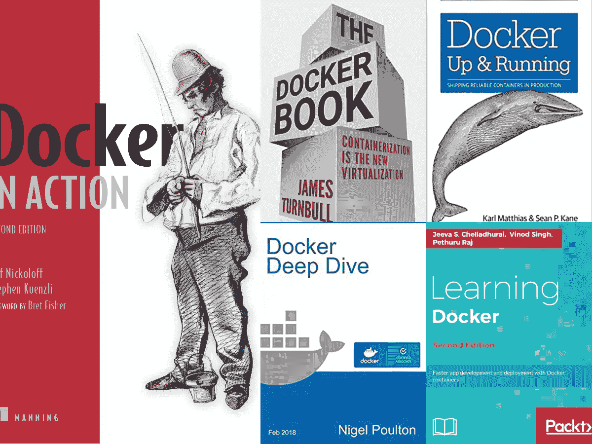
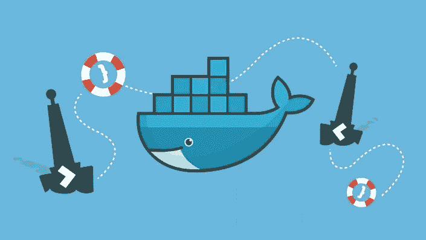
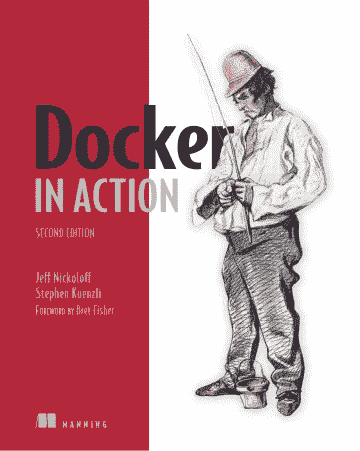
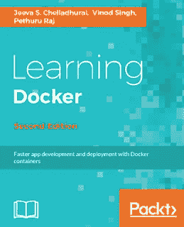
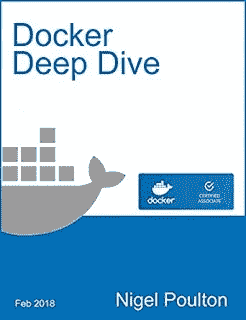

# 2023 年要学习的 5 本最佳码头工人书籍

> 原文：<https://medium.com/javarevisited/5-best-docker-books-for-beginners-and-experienced-developers-5c0cc4da9230?source=collection_archive---------0----------------------->

## 这些是深入学习 Docker、DevOps 和 containers 的最佳书籍

大家好，如果你想学习 Docker 并寻找最好的 Docker 书籍，那么你来对地方了。前面我已经分享了 [**最佳 Docker 课程**](/javarevisited/top-15-online-courses-to-learn-docker-kubernetes-and-aws-for-fullstack-developers-and-devops-d8cc4f16e773) ，[最佳 Kubernetes 课程](/javarevisited/10-best-kubernetes-courses-for-developers-and-devops-engineers-94c35cd3a2fd)，今天我要分享的是深入学习 Docker 的最佳书籍。

如果你是一名开发人员或软件工程师，那么你可能听说过 Docker 和 containers。作为一个 Java 和编程博客的作者，我每天都会收到很多关于 Docker 的问题，比如**Docker 是什么？**

什么是 Docker Compose？我应该学习哪些 Docker 命令，什么是 Docker Hub，如何将我的应用程序迁移到 Docker，如何在 [AWS](https://javarevisited.blogspot.com/2020/02/top-5-courses-to-crack-aws-certified-cloud-practitioner-exam-certification-clf-c01.html) 、 [Azure](https://javarevisited.blogspot.com/2020/02/top-5-courses-to-crack-az-900-microsoft-azure-fundamentals-certification-exam.html) 和 [GCP](https://javarevisited.blogspot.com/2019/07/top-5-google-cloud-platform-gcp-courses-certifications-online.html) 上部署 Docker 容器。

这些也是全世界程序员的一些普遍疑惑。先说什么是 Docker 和[为什么一个程序员要在 202](https://javarevisited.blogspot.com/2020/11/why-devops-engineer-learn-docker-kubernetes.html#axzz6dXsEfLvJ) 3 学习 Docker？

简单地说，Docker 使开发和部署变得容易。使用 Docker，您可以像部署 [C++应用程序](/javarevisited/top-10-courses-to-learn-c-for-beginners-best-and-free-4afc262a544e)一样部署 [Java 微服务](/javarevisited/5-best-courses-to-learn-spring-cloud-and-microservices-1ddea1af7012)，因为您将部署一个容器。正因为如此，你可以轻松地扩大和缩小规模，Kubernetes 会自动为你做到这一点。

像大多数软件技术一样，Docker 提供了一个很好的抽象层次，使得捆绑应用程序及其依赖关系变得容易，这反过来也使得在[云](https://javarevisited.blogspot.com/2019/07/top-5-online-courses-to-learn-cloud-computing-aws.html)上部署应用程序变得容易。

[Docker](https://www.docker.com/) 也旨在解决应用程序在一台机器上工作但在其他机器上不工作的经典问题。它通过对应用程序运行所需的包括操作系统在内的所有东西进行抽象来做到这一点。

Docker 于 2013 年由 Solomon Hykes 首次推出。它是最受欢迎的 [DevOps 工具](https://javarevisited.blogspot.com/2018/09/10-devops-courses-for-experienced-java-developers.html)，非常适合持续部署和测试。Docker 容器确保与多种环境、开发和发布周期保持一致，有助于标准化您的环境。正如我所说，如果你想学习 Docker，那么你来对地方了。过去，我已经分享了学习 Docker 的免费课程和报酬最高的 Docker 课程，今天我将分享任何人都可以从头开始学习 Docker 的五本书。

该列表包含初学者和有经验的程序员的最佳 Docker 书籍，他们希望深入学习 Docker。

不过，为了更好更快地学习，我也建议你参加一个在线课程，比如由 Maximillian Schwarzmuller 和 academy mind 在 Udemy 上开设的 [**Docker & Kubernetes:实用指南**](https://click.linksynergy.com/deeplink?id=JVFxdTr9V80&mid=39197&murl=https%3A%2F%2Fwww.udemy.com%2Fcourse%2Fdocker-kubernetes-the-practical-guide%2F) 课程。这是一门很好的课程，你还将学习 Kubernetes，一个将 Docker 的能力提升到一个新水平的工具。

# 2023 年初学者学习 Docker 的前 5 本书

为了不浪费你的时间，我从初学者的角度列出了 5 本学习 Docker 的好书。不过，这个列表不仅仅是为初学者准备的，也是为想要深入学习 Docker 的有经验的开发人员准备的。

我还收录了像 [Docker Deep Dive](https://www.amazon.com/Docker-Book-Containerization-new-virtualization-ebook/dp/B00LRROTI4?tag=javamysqlanta-20) 这样的书籍，它们对提升你的 Docker 技能并成为每个公司都想雇佣的开发人员非常有帮助。

## 1.[码头工人手册](https://www.amazon.com/Docker-Book-Containerization-new-virtualization-ebook/dp/B00LRROTI4?tag=javamysqlanta-20)

《Docker Book》由詹姆斯·特恩布尔于 2014 年出版，很快成为 Docker 社区的最爱。它基本上是一个傻瓜的 Docker，因为它煞费苦心地解释了 Docker 的所有概念。

如果这是你第一次看 Docker，那么这本书非常适合你。

每节课都教授理论和实践，因此您可以了解 Docker 的优势以及实际操作。从这本书里，你将学会如何用新鲜的眼光看待 docker。

目录包括 Docker 简介、安装 Docker、Docker 入门、使用 Docker 映像和存储库、使用 Docker 进行测试、使用 Docker 构建服务、使用 Docker Compose、Docker Swarm 和 Consul 进行编排、使用 Docker API 以及扩展 Docker。如果你喜欢在线课程，你也可以把这本书和 Udemy 网站上 Stephen Grider 的《Docker 和 Kubernetes:完全指南》 课程结合起来。这是学习 Docker 和 Kubernetes 的最好和最新的课程之一，Stephen 以将复杂的事情变得简单而闻名。

## 2.[码头工人在行动(第二版)](https://www.amazon.com/Docker-Action-Jeff-Nickoloff-dp-1617294764/dp/1617294764?tag=javamysqlanta-20)

顾名思义,《Docker in Action》是一本实用的书，有活生生的例子和工作练习。它是由 Docker 专家 Jeff Nicoloff 编写的，这本书教授了以下内容:

安全地运行程序并打包容器以供部署，以及如何管理共享资源。用户还将学习在 Docker 中创建和部署项目，管理 Docker 容器中托管的应用程序，以及使用 Docker 映像。

还有关于如何使用 DuckerHub 进行分发课程，以及在从开发和测试机器到全面云部署的系统上使用 Docker 的技术。将应用程序打包到容器中，包括测试和分发应用程序的技术。

我也推荐你把这本书和 Udemy 上的 [**Docker 这样的针对绝对初学者的动手课程结合起来——动手 DevOps**](https://click.linksynergy.com/deeplink?id=JVFxdTr9V80&mid=39197&murl=https%3A%2F%2Fwww.udemy.com%2Fcourse%2Flearn-docker%2F) 。这是一个很棒的课程，有很多练习来学习基本的 Docker 命令。您还将学习如何通过练习来编写文件，并详细了解 Docker swarm。

## 3.[学习 Docker](https://www.amazon.com/Learning-Docker-Second-Build-faster/dp/1786462923?tag=javamysqlanta-20)

如果作为一名开发人员，项目部署是你的全部，那么 Docker 上的这本书可能正适合你。虽然学习 Docker 需要一点 web 编程的知识，但是不需要 Docker 或者容器的知识。作者 Pethuru Raj、Vinod Singh 和 Jeeva S. Chelladhurai 还写了其他令人惊叹的编程书籍，并确保任何初学者都能通过阅读这本书来学习 Docker。

通过这本书，您将学习如何使用 Dockerfiles 构建 Docker 映像，在 Docker Hub(类似于存储库的 maven)上推送和发布映像，运行您自己的私有 Docker Hub 并将映像上传到其上，编写、使用和发布 Docker 容器，利用 Docker 的特性部署您现有的应用程序，并探索保护和管理 Docker 容器的真实示例。

而且，如果你需要一门课程来配合这本书，那么[Docker for the Absolute Beginner-hand-On-devo PS](https://click.linksynergy.com/deeplink?id=JVFxdTr9V80&mid=39197&murl=https%3A%2F%2Fwww.udemy.com%2Flearn-docker%2F)是一门很好的课程来配合这本书一起阅读。

## 4.[码头工人:启动并运行](https://www.amazon.com/Docker-Shipping-Reliable-Containers-Production/dp/1491917571?tag=javamysqlanta-20)

这本书是由 Karl Matthias 和 Sean P. Kane 写的，是关于 Docker 的高级和实用方面的内容。如果你是个新手，那么这个不适合你。

它解决了 Docker 概念，如如何在本地测试和部署期间保持内部依赖性、打包应用程序以及维护一致的项目环境。

它还在几个层面上教导 Docker，使得为应用程序部署工作流的依赖管理变得非常简单。与前几本书一样，它涵盖了如何使用实用技术在生产中部署和测试基于 Docker 的 Linux 容器，从而更好地使用 Docker 映像、容器和命令行工具。

如果你已经完成了所有的基础知识，你还想要更多，那么看看[**Docker Mastery:with Kubernetes and Swarm**](https://click.linksynergy.com/deeplink?id=JVFxdTr9V80&mid=39197&murl=https%3A%2F%2Fwww.udemy.com%2Fcourse%2Fdocker-mastery%2F)课程还有一些更高级的概念。这些课程是用非常简单的英语教授的，由 Docker 船长亲自教授，这使得它成为本书的一个很好的伴侣，尤其是对于那些想深入学习 Docker 的人来说。

## 5.[奈杰尔·波尔顿的《多克深潜》](https://www.amazon.com/Docker-Book-Containerization-new-virtualization-ebook/dp/B00LRROTI4?tag=javamysqlanta-20)

顾名思义，这本书提供了一个成为码头大师的机会。它也被吹捧为最好的 Docker 在线书籍。它提供了 Docker 的更深和更高级部分的课程，并解决了 AS(自动化服务器)等设置问题。这本书对初学者和专家都有用。如果你想从头开始学习 Docker，你可以使用这本书，如果你想深入学习 Docker，这也是一本有用的书。

这本书最好的部分是它定期更新，这对学习像 Docker 这样不断更新的东西非常重要。这本书提供了对 Docker 架构的深入解释，并深入探讨了 Docker 图像和容器等概念。

它还涵盖了网络、安全性和卷。这本书还涵盖了[*Docker Certified Associate*](/javarevisited/10-best-courses-and-practice-tests-to-crack-docker-certified-associate-dca-certification-exam-b0b21648df4e)(DCA)认证，也就是说如果你在准备 Docker 认证的话也可以用这本书。

这本书是由 Docker 船长和集装箱生态系统中的领先教育家 Nigel Poulton 编写的，他还创建了一些最好的 Docker 在线课程，如 Pluralsight 上的[**Docker**](https://pluralsight.pxf.io/c/1193463/424552/7490?u=https%3A%2F%2Fwww.pluralsight.com%2Fcourses%2Fdocker-getting-started)和[**Docker Deep Dive**](https://pluralsight.pxf.io/c/1193463/424552/7490?u=https%3A%2F%2Fwww.pluralsight.com%2Fcourses%2Fdocker-deep-dive-update)。

如果你愿意，你可以将这本书与那些课程结合起来，通过一些积极的学习练习和本书作者 Nigel Poulton 的解释来更好地学习 Docker。

以上就是初学者学习 Docker 的**最佳书籍。**正如我之前所说，随着越来越多的公司转向基于容器的部署，Docker 是每个程序员的必备技能。

如果可以的话，我强烈推荐你也学习 Kubernetes，因为 [Docker](/@javinpaul/10-free-courses-to-learn-docker-and-devops-for-frontend-developers-691ac7652cee?source=---------94------------------) 和 [Kubernetes](/javarevisited/7-free-online-courses-to-learn-kubernetes-in-2020-3b8a68ec7abc) 可以很好地配合，因为现在没有人手动部署容器，他们使用 Kubernetes 来大规模部署容器。

其他 **DevOps、云、编程课程**你可能喜欢

*   [2023 年 DevOps 开发者路线图](https://javarevisited.blogspot.com/2018/09/the-2018-devops-roadmap-your-guide-to-become-DevOps-Engineer.html)
*   [面向 Java 和 DevOps 专业人员的 10 门免费 Docker 课程](https://javarevisited.blogspot.sg/2018/02/10-free-docker-container-courses-for-Java-Developers.html)
*   [学习 Jenkins 自动化和开发运维的 5 大课程](https://javarevisited.blogspot.com/2018/09/top-5-jenkins-courses-for-java-and-DevOps-Programmers.html)
*   [2023 年学习 Kubernetes 的 5 大课程](https://javarevisited.blogspot.com/2020/06/top-5-courses-to-learn-kubernetes-for-devops-and-certification.html)
*   [5 门免费硒课程学习自动化测试](https://javarevisited.blogspot.sg/2018/02/top-5-selenium-webdriver-with-java-courses-for-testers.html)
*   [面向程序员的 10 门 Docker 和 Kubernetes 课程](https://dev.to/javinpaul/top-10-courses-to-learn-docker-and-kubernetes-for-programmers-4lg0)
*   [面向 Java 开发人员的 6 门 Maven 课程](http://www.java67.com/2018/02/6-free-maven-and-jenkins-online-courses-for-java-developers.html)
*   [2023 年 Java 开发人员应该学会的 10 件事](http://javarevisited.blogspot.sg/2017/12/10-things-java-programmers-should-learn.html#axzz53ENLS1RB)
*   [初学者学习 Kubernetes 的 7 门免费课程](/javarevisited/7-free-online-courses-to-learn-kubernetes-in-2020-3b8a68ec7abc)
*   [Java 开发者可以从 Spring Framework 学习的 3 个最佳实践](https://javarevisited.blogspot.com/2018/06/3-best-practices-java-programmers-can-learn-from-spring-framework.html)
*   [2023 年 Java 开发人员应该学习的 10 种工具](http://www.java67.com/2018/04/10-tools-java-developers-should-learn.html)
*   [我最喜欢的学习 AWS 和云计算的课程](/javarevisited/top-10-courses-to-learn-amazon-web-services-aws-cloud-in-2020-best-and-free-317f10d7c21d)
*   [5 免费弹簧框架和 Spring Boot 课程](http://www.java67.com/2017/11/top-5-free-core-spring-mvc-courses-learn-online.html)
*   面向 Java JEE 开发者的 5 大 Hibernate 和 JPA 课程
*   [程序员学习 AWS 和云的 10 门免费课程](/javarevisited/top-10-courses-to-learn-amazon-web-services-aws-cloud-in-2020-best-and-free-317f10d7c21d)

感谢您阅读本文。如果你觉得这些 Docker 书籍有用，那么请与你的朋友和同事分享。如果您有任何问题或反馈，请留言。

**附言——**如果你更喜欢在线课程而不是书本，或者只是想主动学习，那么我也推荐你去看看 Udemy 网站上 Maximillian Scwarzmuller 的 [**Docker & Kubernetes:实用指南**](https://click.linksynergy.com/deeplink?id=JVFxdTr9V80&mid=39197&murl=https%3A%2F%2Fwww.udemy.com%2Fcourse%2Fdocker-kubernetes-the-practical-guide%2F) 课程。这是学习 Docker 和 Kubernetes 的最好和最新的课程之一。

 [## Docker & Kubernetes:实用指南

### 从 13 岁开始，我从未停止学习新的编程技能和语言。早期我开始创作…

udemy.com](https://click.linksynergy.com/deeplink?id=JVFxdTr9V80&mid=39197&murl=https%3A%2F%2Fwww.udemy.com%2Fcourse%2Fdocker-kubernetes-the-practical-guide%2F)