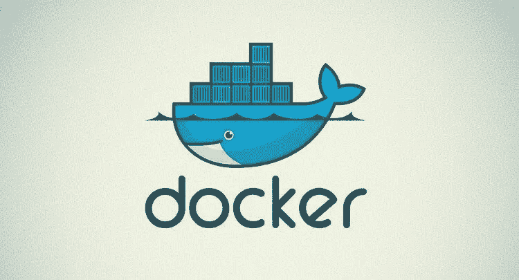
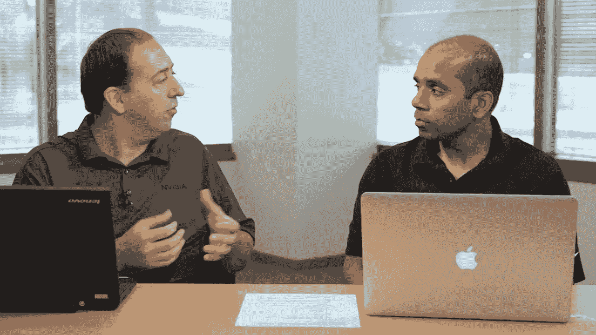
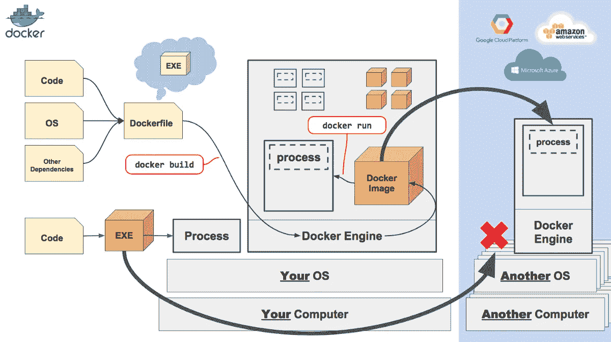

# 深入学习 Docker 和集装箱的 5 大课程——最佳选择

> 原文：<https://medium.com/javarevisited/5-best-docker-courses-for-java-and-spring-boot-developers-bbf01c5e6542?source=collection_archive---------0----------------------->

## 2023 年我最喜欢的学习 Udemy、Coursera 和 Pluralsight 的 Docker 和 Containers 的在线培训课程，面向 Java 和 Spring 开发者

你好 Java 程序员，如果你想学习 Docker 并从 Java 和 Spring Boot 开发者的角度寻找最好的 Docker 课程，那么你来对地方了。

之前，我已经分享了 [**最佳 DevOps 课程**](/javarevisited/13-best-courses-to-learn-devops-for-senior-developers-in-2020-a2997ff7c33c) 以及 [**最佳 Docker 和 Kubernetes 课程**](/javarevisited/top-15-online-courses-to-learn-docker-kubernetes-and-aws-for-fullstack-developers-and-devops-d8cc4f16e773?source=collection_home---4------1-----------------------) 在这篇文章中，我将分享 Java 和 Spring Boot 开发者的最佳 Docker 课程。

Java 是最流行和使用最广泛的编程语言之一。它是一种常青的编程语言。对于 Java 开发人员来说，Docker 是游戏规则的改变者。

Docker[正在迅速崛起，现在它已经成为各类程序员最重要的工具之一，这是有原因的，因为 Docker 使开发和部署变得更加容易。](/javarevisited/top-5-free-courses-to-learn-docker-for-beginners-best-of-lot-b2b1ad2b98ad)

通过使用 Docker，你可以用同样一致的方式部署任何种类的微服务。这也使得使用 Kubernetes 扩展服务变得更加容易。可以进一步阅读 m 帖，为什么每个开发者都应该学习 Docker 来了解更多关于 Docker 的优势。

同时，[学习 Docker](/@javinpaul/10-free-courses-to-learn-docker-and-devops-for-frontend-developers-691ac7652cee) 如果你是一个初学者或者以前从未使用过 Docker，可能会是一个挑战，但是通过适当的指导和正确的资源，你可以很容易地理解 Docker。一旦你知道了 Docker 的基本概念和命令，使用 Java 就变得很容易了。

互联网上没有太多学习 docker 与 [Java 和 Spring](/javarevisited/8-best-spring-and-hibernate-training-courses-for-java-developers-acf09aa0e244) 的资源，但是我已经为 Java 和 Spring 开发人员研究和策划了最好的 Docker 课程，在本文中，我列出了帮助你理解 Docker 与 Java 和 Spring 的前五门课程。

顺便说一句，如果你是 DevOps 的新手，那么我也建议你去参加一个很好的 DevOps 课程，比如 Udemy 上的[**devo PS:CI/CD with Jenkins pipelines，Maven，Gradle**](https://click.linksynergy.com/deeplink?id=CuIbQrBnhiw&mid=39197&murl=https%3A%2F%2Fwww.udemy.com%2Fcourse%2Fdevops-and-continuous-integration-with-jenkins-pipelines%2F) 来学习如何协同工作，以及如何使用它们来创建更好的软件开发过程。

 [## DevOps:与 Jenkins pipelines、Maven 和 Gradle 的 CI/CD

### 这个在线 DevOps 课程将教你如何建立复杂的持续集成和持续交付…

udemy.com](https://click.linksynergy.com/deeplink?id=CuIbQrBnhiw&mid=39197&murl=https%3A%2F%2Fwww.udemy.com%2Fcourse%2Fdevops-and-continuous-integration-with-jenkins-pipelines%2F) 

# 2023 年 Java 和 Spring Boot 开发者学习 Docker 的 5 门最佳在线课程

不浪费你更多的时间，这里是我为 Java 和 Spring 开发者列出的最好的 Docker 课程。该列表包括来自 [Udemy](https://click.linksynergy.com/fs-bin/click?id=JVFxdTr9V80&offerid=323058.9410&type=3&subid=0) 、 [Pluralsight](https://pluralsight.pxf.io/c/1193463/424552/7490?u=https%3A%2F%2Fwww.pluralsight.com%2Flearn) 和其他流行的在线学习门户网站的最佳 Docker 课程。

它还包括初学者和高级 Docker 课程，以满足初学者和有经验的 Java 开发人员的需求。

## 1.[面向 Java 开发人员的 Docker](https://click.linksynergy.com/deeplink?id=JVFxdTr9V80&mid=39197&murl=https%3A%2F%2Fwww.udemy.com%2Fcourse%2Fdocker-for-java-developers%2F)

Udemy 的这门课程是 Java 课程中最受欢迎的 Docker 之一。这是为那些想学习 docker 和 Java 编程语言的人准备的。

本课程涵盖了一些重要主题，如运行 docker 容器、将 docker 映像发布到 docker hub、使用 docker swarm、使用 maven 创建 docker 映像以及许多其他主题。

这门课程是专门为 Java 开发人员开设的。这是一个初级课程，视频总内容为十个小时。

要求

*   Java 基础知识。
*   推荐春天的知识。
*   Linux 的基础知识。

由约翰·汤姆逊创建，他是我最喜欢的 Udemy 导师之一，也是《Spring Framework:[**初学者到大师**](https://click.linksynergy.com/deeplink?id=JVFxdTr9V80&mid=39197&murl=https%3A%2F%2Fwww.udemy.com%2Fcourse%2Fspring-framework-5-beginner-to-guru%2F) 的作者，这是学习 Docker 的最好的 Udemy 课程之一，如果你喜欢约翰的教学风格，即理论和实践的正确结合，那么你会喜欢这门课程。

它也很实惠，你只需花 10 美元就能在 Udemy 上买到，这种事情时有发生，看看这个课程现在可能正在发生。

**这是加入本课程的链接**——[面向 Java 开发者的 Docker](https://click.linksynergy.com/deeplink?id=JVFxdTr9V80&mid=39197&murl=https%3A%2F%2Fwww.udemy.com%2Fcourse%2Fdocker-for-java-developers%2F)

## 2. [Master Docker 与 Java — DevOps for Spring 微服务](https://click.linksynergy.com/deeplink?id=JVFxdTr9V80&mid=39197&murl=https%3A%2F%2Fwww.udemy.com%2Fcourse%2Fdocker-course-with-java-and-spring-boot-for-beginners%2F)

这是另一个在 udemy 上最畅销的带有 Java 课程的 docker。在本课程中，讲师将讲解如何使用 docker 和 Java 来运行 Java 微服务。

本课程还涵盖了其他几个重要主题，例如为 Java Spring boot 创建 docker 映像、使用 docker 容器化 Java Spring Boot React 全栈应用程序、使用 MySQL 和 docker、docker 命令以及 docker 架构。

这是一个初级课程，视频总内容为六个半小时。

要求

*   Java 基础知识。
*   Spring Boot 的基本知识。
*   DevOps 的基础知识

这个课程是由来自 28Minutes 的 Ranga Karnam 创建的，他是 Udemy 上另一位优秀的 Java 讲师，也是像[**Master micro services with Spring Boot 和 Spring Cloud**](https://click.linksynergy.com/deeplink?id=JVFxdTr9V80&mid=39197&murl=https%3A%2F%2Fwww.udemy.com%2Fcourse%2Fmicroservices-with-spring-boot-and-spring-cloud%2F) 这样的优秀课程的作者，是学习微服务最好的人之一。

Ranga 在 Docker、云计算和 Spring 框架方面有着出色的知识，他的教学风格使学习这些现代概念变得很容易，我向任何想在 2023 年学习 Docker 的 Java 开发人员强烈推荐这门课程。

**以下是参加本课程的链接**—[Master Docker with Java—devo PS for Spring micro services](https://click.linksynergy.com/deeplink?id=JVFxdTr9V80&mid=39197&murl=https%3A%2F%2Fwww.udemy.com%2Fcourse%2Fdocker-course-with-java-and-spring-boot-for-beginners%2F)

## 2.[Play by Play:Docker for Java Developers](https://pluralsight.pxf.io/c/1193463/424552/7490?u=https%3A%2F%2Fwww.pluralsight.com%2Fcourses%2Fplay-by-play-docker-java-developers-arun-gupta-michael-hoffman)【plural sight】

这是 Java 的一个详细的 docker 课程。它是 Pluralsight 中最受欢迎的 Java 课程 Docker 之一。在本课程中，java 专家阿伦·古普塔和迈克尔·霍夫曼将深入探讨 Java 的高级 docker 概念。

它们涵盖了许多重要的概念，如 docker 基础、Docker Swarm 和 docker-compose。还是那句话，是初级和中级水平的课程，总视频内容将近两个小时。

要求
Java 基础知识。

这门 Pluralsight Java 和 Docker 课程最棒的地方在于，它是一门未经预演、没有脚本的课程，所以你可以通过人们在日常课程中如何使用 Docker 来学习。

它还涉及一些重要的主题，如 Docker 命令，Docker 由 Arun Gupta 等专家编写和发布，他是 Java 冠军，也是 Docker 的队长。

**这是加入本课程的链接**—[Play by Play:Docker for Java Developers](https://pluralsight.pxf.io/c/1193463/424552/7490?u=https%3A%2F%2Fwww.pluralsight.com%2Fcourses%2Fplay-by-play-docker-java-developers-arun-gupta-michael-hoffman)

顺便说一句，你需要一个 [**Pluralsight 会员**](https://pluralsight.pxf.io/c/1193463/424552/7490?u=https%3A%2F%2Fwww.pluralsight.com%2Flearn) 才能加入这个课程，费用大约是每月 29 美元或每年 299 美元(14%的折扣)。

我向所有程序员强烈推荐这个订阅，因为它提供了超过 7000 个在线课程的即时访问，以学习任何技术技能。或者，你也可以使用他们的 [**10 天免费通行证**](https://pluralsight.pxf.io/c/1193463/424552/7490?u=https%3A%2F%2Fwww.pluralsight.com%2Flearn) 免费观看本课程。

 [## 对个人来说

### Pluralsight 的使命一直是公平的技术竞争环境。不管你想学什么，或者…

pluralsight.pxf.io](https://pluralsight.pxf.io/c/1193463/424552/7490?u=https%3A%2F%2Fwww.pluralsight.com%2Flearn) 

## 4.[Docker—Java 开发者手把手](https://click.linksynergy.com/deeplink?id=JVFxdTr9V80&mid=39197&murl=https%3A%2F%2Fwww.udemy.com%2Fcourse%2Fdocker-hands-on%2F)【Udemy 最佳课程】

udemy 上的另一门热门课程是为那些想体验 docker 与 Java 的真实世界的 Java 开发人员开设的。在本课程中，讲师将首先使用 Spring Boot 构建真正的微服务架构，然后使用 docker 容器部署应用。

是初级课程，总视频内容近九个小时。

**要求**
Java 基础知识。
Spring Boot 的基础知识。建议使用自动气象站。如果你想获得 Docker 的实际操作经验，这是最好的在线课程，因为你将学习如何使用 Docker 和 Docker Swarm 部署 Java 微服务架构。

**以下是加入本课程** — [码头工人 Java 开发人员实践](https://click.linksynergy.com/deeplink?id=JVFxdTr9V80&mid=39197&murl=https%3A%2F%2Fwww.udemy.com%2Fcourse%2Fdocker-hands-on%2F)的链接

## 5.[在 Docker 和 Kubernetes 中运行 Java 的完整指南](https://click.linksynergy.com/deeplink?id=JVFxdTr9V80&mid=39197&murl=https%3A%2F%2Fwww.udemy.com%2Fcourse%2Fthe-complete-guide-to-running-java-in-docker-and-kubernetes%2F)

码头工人和库本内特人通常是同流合污。这是一个很好的选择，以学习 Kubernetes 与码头工人。在本课程中，讲师将深入探讨带有容器的 Java。您不仅将学习如何在 Java 中使用 docker，还将学习如何在 Java 中使用 Kubernetes。

这是一门初级课程，总视频内容为四个半小时，这门课程需要 Java 基础知识。

以下是您将在本课程中学习的内容:

1.  Java 如何在像 Docker 这样的容器中工作
2.  对容器如 Linux c 组和名称空间的深入了解
3.  码头工人和库本内斯
4.  如何为 JVM 应用程序构建生产级 Docker 映像。

本课程最棒的地方在于，讲师用 Docker 和 Kubernetes 解释了理解 Java 所需的每个必要概念。

**以下是加入本课程的链接** — [在 Docker 和 Kubernetes 中运行 Java 的完整指南](https://click.linksynergy.com/deeplink?id=JVFxdTr9V80&mid=39197&murl=https%3A%2F%2Fwww.udemy.com%2Fcourse%2Fthe-complete-guide-to-running-java-in-docker-and-kubernetes%2F)

这就是 Java 和 Spring Boot 开发者的最佳课程。在这个列表中，我们只添加了初级课程。所有这些课程都涵盖了使用 Java 所需的所有重要概念。这些课程有些很长，有些很小。

在选择这些课程之前，请确保您理解 Java 编程语言，因为这些课程都不关注 Java。

您可能会喜欢的其他**开发平台、云和编程资源**

*   [2023 年 Java 开发人员可以学到的 21 项技术技能](https://javarevisited.blogspot.com/2020/03/top-20-skills-java-developers-can-learn.html#axzz6k4XBgTw4)
*   [2023 年 DevOps 开发者路线图](/hackernoon/the-2018-devops-roadmap-31588d8670cb)
*   [詹金斯自动化与开发专业学习的前 5 门课程](https://javarevisited.blogspot.com/2018/09/top-5-jenkins-courses-for-java-and-DevOps-Programmers.html)
*   [2023 年学习 Kubernetes 的 7 门免费在线课程](/javarevisited/7-free-online-courses-to-learn-kubernetes-in-2020-3b8a68ec7abc)
*   [学习亚马逊网络服务我最喜欢的课程](/javarevisited/5-best-aws-courses-for-beginners-and-experienced-developers-to-learn-in-2021-563212409fbd?source=rss-bb36d8439904------2&utm_source=dlvr.it&utm_medium=linkedin)
*   [5 个免费弹簧框架和 Spring Boot 课程](http://www.java67.com/2017/11/top-5-free-core-spring-mvc-courses-learn-online.html)
*   [面向 Java JEE 开发者的 5 大 Hibernate 和 JPA 课程](http://javarevisited.blogspot.sg/2018/01/top-5-hibernate-and-jpa-courses-for-java-programmers-learn-online.html)
*   [面向程序员的 10 门 Docker 和 Kubernetes 课程](https://dev.to/javinpaul/top-10-courses-to-learn-docker-and-kubernetes-for-programmers-4lg0)
*   [2023 年 Java 开发人员应该学习的 10 种工具](http://www.java67.com/2018/04/10-tools-java-developers-should-learn.html)
*   [程序员学习 AWS 和云的 10 门免费课程](/javarevisited/top-10-courses-to-learn-amazon-web-services-aws-cloud-in-2020-best-and-free-317f10d7c21d)

感谢阅读到目前为止。如果你喜欢这些面向 Java 开发人员的在线课程，请与你的朋友和同事分享。如果您有任何问题或反馈，请留言。

**P. S. —** 如果你想从头开始学习 DOCKER 并寻找免费的在线课程，那么你也可以看看 Udemy 上的这个 [**面向 JAVA 开发人员的 Docker 实践课程【免费】、**](https://click.linksynergy.com/deeplink?id=JVFxdTr9V80&mid=39197&murl=https%3A%2F%2Fwww.udemy.com%2Fcourse%2Fintroduction-to-docker-for-java-developers%2F) 免费课程。这是完全免费的，你需要的只是一个免费的 Udemy 帐户来注册这个在线培训课程。

 [## 免费 DOCKER 教程——面向 JAVA 开发人员的 Docker 实践

### 面向 Java 开发人员的完整实践课程-免费课程

udemy.com](https://click.linksynergy.com/deeplink?id=JVFxdTr9V80&mid=39197&murl=https%3A%2F%2Fwww.udemy.com%2Fcourse%2Fintroduction-to-docker-for-java-developers%2F)