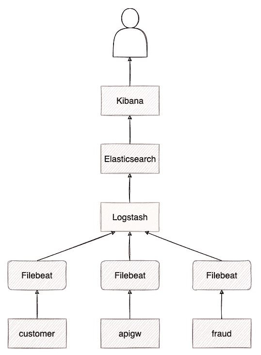
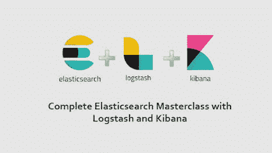
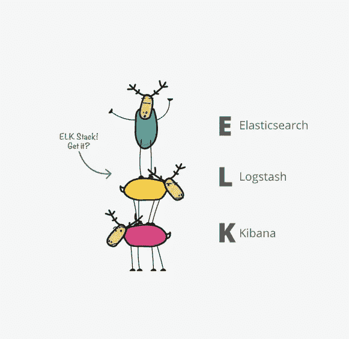
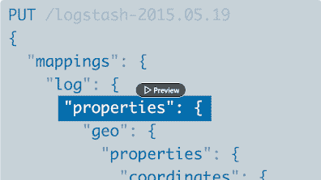
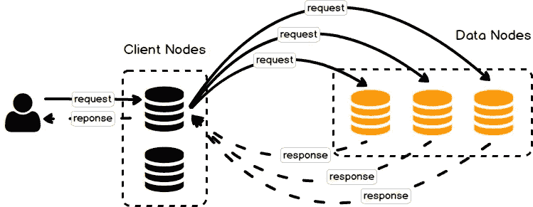

# 2023 年初学者学习 Kibana、Logstash 和 ELK Stack 的 6 个最佳 ElasticSearch 课程

> 原文：<https://medium.com/javarevisited/5-best-elastic-search-courses-for-beginners-to-learn-kibna-logstash-and-elk-stack-in-2022-eb3e1e0015c4?source=collection_archive---------0----------------------->

## 这些是学习 ElasticSearch 和 ELK sack 的最佳在线课程，其中包括用于监控的 logstash 和 Kibana。

你好，伙计们，如果你是一个有经验的开发者或初学者，想了解一般的 **Elasticsearch 和 ELK stack** ，并寻找最好的在线课程和教程，那么你来对地方了。

早些时候，我已经分享了 [**最佳 Kubernetes 课程**](/javarevisited/10-best-kubernetes-courses-for-developers-and-devops-engineers-94c35cd3a2fd) 和 [**最佳 Docker 课程**](/javarevisited/5-best-docker-courses-for-java-and-spring-boot-developers-bbf01c5e6542) 在这篇文章中，我将分享关于最佳弹性搜索课程以学习 ELK Stack、Kibana 和 Logstash。

如果你正在运行一个应用程序或者计划运行一个具有复杂的搜索/存储功能并且主要基于文本的应用程序？弹性搜索可能是你正在寻找的技术！

**我们先来了解一下什么是 Elasticsearch？**

*Elasticsearch* 是一个开源的全文搜索和分析引擎，具有极强的可扩展性。它使您能够近乎实时地快速存储、浏览和分析大量数据。

它通常被用作具有高级搜索功能和需求的应用程序的基础引擎/技术。许多大型组织正在使用 Elasticsearch 实现高速存储和搜索功能。

对于许多常见的数据分析需求，Elasticsearch 将自己定位为 Hadoop、Spark 和 Flink 的更快替代品。这是一个需要理解的重要工具，而且很容易使用！跟我来，我会告诉你这是怎么回事。

# 2023 年初学麋鹿栈的 6 大 ElasticSearch 课程

以下是我列出的 2023 年学习 ElasticSearch 的最佳在线课程。该列表包括来自热门网站和在线学习平台(如 Udemy、Pluralsight 和 LinkedIn Learning)的最佳弹性搜索课程。你可以参加其中一个或几个课程，深入学习 ElasticSearch。

## 1.[使用 Logstash 和 Kibana 完成 Elasticsearch Masterclass】](https://click.linksynergy.com/deeplink?id=JVFxdTr9V80&mid=39197&murl=https%3A%2F%2Fwww.udemy.com%2Fcourse%2Fcomplete-elasticsearch-masterclass-with-kibana-and-logstash%2F)

这个 11 小时的 Elasticsearch 培训课程将向您展示如何在没有任何专业知识的情况下构建一个搜索引擎并掌握大量数据。Elasticsearch 6，Kibana，Logstash 会教你怎么做(麋鹿栈)。

弹性搜索培训课程不仅将帮助您将这项强大的技术添加到您的简历中，还将向您展示如何有效地使用弹性搜索，使您的应用程序快速运行。弹性搜索培训课程充满了从头开始创建搜索引擎的简单、逐步的说明。

在弹性搜索培训课程结束时，您会对弹性搜索 6 非常满意，这是最新和最受欢迎的版本。此外，您还将学习如何对数据进行实时分析。

**以下是参加本课程的链接—** [完整弹性搜索大师班，含 Logstash 和 Kibana](https://click.linksynergy.com/deeplink?id=JVFxdTr9V80&mid=39197&murl=https%3A%2F%2Fwww.udemy.com%2Fcourse%2Fcomplete-elasticsearch-masterclass-with-kibana-and-logstash%2F)

## 2.[弹性研究完整指南](https://click.linksynergy.com/deeplink?id=JVFxdTr9V80&mid=39197&murl=https%3A%2F%2Fwww.udemy.com%2Fcourse%2Felasticsearch-complete-guide%2F)【Udemy】

本弹性搜索培训课程时长约 15 小时，包括 11 种可下载材料，将教会您所有关于 ELK stack(弹性搜索、log Stack 和 Kibana)和 Elastic Stack 的知识。

与之前的 Udemy 弹性搜索课程不同，本课程不适合完全初学者，需要一些基本的 JSON 专业知识。一些终极能力也是有益的。Udemy 弹性搜索课程旨在帮助您在几小时内将新知识付诸实践。

它在理论和实践之间找到了正确的结合点，并且在开始之前您将对每个练习有一个理论上的理解。这将使您能够使用弹性搜索进行强大的搜索，同时更好地了解它在幕后是如何运作的。

值得注意的是，这个 Udemy 弹性搜索课程是为有兴趣使用弹性搜索集群的开发人员设计的。不适合希望保持弹性搜索集群运行的系统管理员。此外，本课程不涵盖 Logstash 和 Kibana。

**以下是参加本课程的链接—** [弹性研究完整指南](https://click.linksynergy.com/deeplink?id=JVFxdTr9V80&mid=39197&murl=https%3A%2F%2Fwww.udemy.com%2Fcourse%2Felasticsearch-complete-guide%2F)

## 3.[弹性堆叠:入门](https://pluralsight.pxf.io/c/1193463/424552/7490?u=https%3A%2F%2Fwww.pluralsight.com%2Fcourses%2Felastic-stack-getting-started)【多通道课程】

这是一个相当广泛的弹性研究课程，面向高级学习者，包含超过 43 小时的内容、40 个视频和 16 个动手实验。Elastic Certified Engineer 认证旨在认可那些对 Elasticsearch 有很好理解的 IT 专业人士。

正如您所料，Elasticsearch 课程将帮助您准备 Elasticsearch 认证，并帮助您成为构建整个 Elasticsearch 解决方案的认证专家。

**以下是加入本课程的链接—** [弹性堆栈:入门](https://pluralsight.pxf.io/c/1193463/424552/7490?u=https%3A%2F%2Fwww.pluralsight.com%2Fcourses%2Felastic-stack-getting-started)

你将从理解弹性搜索的原理开始，剩下的学习将集中在有助于你通过考试的领域。为了试水，Pluralsight 学习平台提供了 [**10 天免费试用**](https://pluralsight.pxf.io/c/1193463/424552/7490?u=https%3A%2F%2Fwww.pluralsight.com%2Fpricing%2Ffree-trial) 。

 [## Pluralsight |个人免费试用

### 立即开始免费试用 Pluralsight！查看我们为个人和团队提供的服务，如果您不确定…

pluralsight.pxf.io](https://pluralsight.pxf.io/c/1193463/424552/7490?u=https%3A%2F%2Fwww.pluralsight.com%2Fpricing%2Ffree-trial) 

## 4. [Elasticsearch 基础培训](https://linkedin-learning.pxf.io/c/1193463/449670/8005?u=https%3A%2F%2Fwww.linkedin.com%2Flearning%2Felasticsearch-essential-training)【LinkedIn 学习】

本 Elasticsearch 课程不面向完全新手，推荐中级水平的学生学习。内容持续时间约为 1 小时 30 分钟。

Elasticsearch 课程会教你关于 Elasticsearch 和 Kibana 的内部运作。在深入研究各种部署选项之前，您将从架构的高级概述开始。您还将学习如何以最有效的方式组织数据。

最后，在 Elasticsearch 课程的后期，您将学习如何使用 Kibana 查询数据和报告您的发现。你也可以在 LinkedIn 平台上免费试用一个月，以确定这个 Elasticsearch 培训课程是否适合你。

以下是 Elasticsearch 课程中涵盖的主要主题:调查聚类时的本地 Elasticsearch 安装、批量数据加载、样本数据类型、标记化和分析直方图以及百分比。

**以下是参加本课程的链接** — [弹性搜索基础培训](https://linkedin-learning.pxf.io/c/1193463/449670/8005?u=https%3A%2F%2Fwww.linkedin.com%2Flearning%2Felasticsearch-essential-training)

## 5.[学习弹性堆栈](https://linkedin-learning.pxf.io/c/1193463/449670/8005?u=https%3A%2F%2Fwww.linkedin.com%2Flearning%2Flearning-the-elastic-stack-2)【LinkedIn Learning】

这是一个新手级别的 Elasticsearch 培训课程，大约有 1 小时 30 分钟的信息，与上述课程不同。本课程首先教你 Elasticsearch 的原理，然后帮助你设置和使用 elastic stack。

Elasticsearch 培训课程不仅会帮助您理解课程内容，还会帮助您理解为什么堆栈非常适合您的工作场所。此外，您将学习如何进行正常安装。

您不仅将了解一个堆栈的许多组件，如 Elasticsearch、Kibana、Logstash、Beats 和 X-Pack，还将探索用例并学习如何调试堆栈。由于 LinkedIn 平台上提供了 Elasticsearch 培训课程，因此还提供了一个月的免费试用。

**这里是加入本课程的链接—** [学习弹性堆叠](https://linkedin-learning.pxf.io/c/1193463/449670/8005?u=https%3A%2F%2Fwww.linkedin.com%2Flearning%2Flearning-the-elastic-stack-2)

顺便说一下，你需要一个 LinkedIn Learning 会员才能观看这个课程，费用大约为每月*29.99 美元*，但你也可以通过参加他们的 [**1 个月免费试用**](http://linkedin-learning.pxf.io/c/1193463/449670/8005?u=https%3A%2F%2Fwww.linkedin.com%2Flearning%2Fsubscription%2Fproducts) 来免费观看这个课程，这是探索他们 17000 多门最新技术在线课程的一个好方法。

 [## LinkedIn Learning 免费试用和订阅价格

### 从初级到高级的 18，000 多门专家指导课程的个性化、高质量内容。基于社区的…

linkedin-learning.pxf.io](http://linkedin-learning.pxf.io/c/1193463/449670/8005?u=https%3A%2F%2Fwww.linkedin.com%2Flearning%2Fsubscription%2Fproducts) 

如果您想知道弹性搜索一般是如何工作的

这里有一个关于**elastic search 如何工作的很好的图表:**

image _ credit—[https://medium . com/@ duy . do/how-elastic search-cluster-works-97d 537071 b87](/@duy.do/how-elasticsearch-cluster-works-97d537071b87)

## 6.[弹性搜索 8 和弹性堆栈:深入和动手](https://click.linksynergy.com/deeplink?id=JVFxdTr9V80&mid=39197&murl=https%3A%2F%2Fwww.udemy.com%2Fcourse%2Felasticsearch-7-and-elastic-stack%2F)

**Elasticsearch 8** 是在几毫秒内分析大数据集的强大工具！这是一项越来越受欢迎的技术，用于大型网站的搜索和分析，也是当今就业市场上一项有价值的技能。

本课程涵盖了从安装到操作的所有内容。在本课程中，您将学习如何使用 Elasticsearch 8，并在接下来的几天内将其应用到您的工作中。您将学习如何使用 Elasticsearch、Kibana、Logstash 和 Beats 搜索、分析和可视化大数据

本课程由 Sundog Education 旗下的 [**Frank Kane**](https://click.linksynergy.com/deeplink?id=JVFxdTr9V80&mid=39197&murl=https%3A%2F%2Fwww.udemy.com%2Fuser%2Ffrank-kane-2%2F) 创建，他是一位大数据大师和百万富翁 Udemy 讲师。所以，你将向最优秀的人学习。

本课程还将教授您 Elastsearch8 的新功能，如 Elasticsearch 命令的新语法要求等。

**这里是加入本课程** — [弹性搜索 8 和弹性堆栈](https://click.linksynergy.com/deeplink?id=JVFxdTr9V80&mid=39197&murl=https%3A%2F%2Fwww.udemy.com%2Fcourse%2Felasticsearch-7-and-elastic-stack%2F)的链接

以上是关于 2023 年你可以加入学习 Kibana、Logstash 和 ELK stack 的**最佳弹性搜索课程**。现在，所有这些最好的弹性搜索课程都展现在你们面前了，我希望你们都能从上面的课程中跳出来学习弹性搜索。各有独特卖点，各有利弊。但是让我告诉你，每一个都是它自己的赢家。

您可能喜欢的其他 Java 和编程资源

*   [如何准备 2023 年系统设计面试](https://javarevisited.blogspot.com/2022/03/how-to-prepare-for-system-design.html)
*   [程序员的 10 门最佳系统设计课程](https://www.java67.com/2019/09/top-5-courses-to-learn-system-design.html)
*   [学习系统设计的 7 个最佳地点](/javarevisited/7-best-places-to-learn-system-design-79e2d261f343)
*   [5 个免费学习数据结构和算法的网站](https://javarevisited.blogspot.com/2017/02/5-websites-for-practicing-data-structure-algorithms-for-coding-interviews.html)
*   免费在线学习 SQL 的 5 个网站
*   [2023 年需要学习的 5 大 Java 框架](http://javarevisited.blogspot.sg/2018/04/top-5-java-frameworks-to-learn-in-2018_27.html)
*   [21 个网站免费在线学习编码](https://www.java67.com/2018/06/21-websites-to-learn-how-to-code-for.html)
*   [苦读系统设计面试课程值得吗？](https://javarevisited.blogspot.com/2022/03/eview-is-grokking-system-design-worth-it.html)
*   [完整的 DevOps 工程师路线图](/hackernoon/the-2018-devops-roadmap-31588d8670cb)
*   [程序员 50+数据结构面试问题](/hackernoon/50-data-structure-and-algorithms-interview-questions-for-programmers-b4b1ac61f5b0)
*   [30 个系统设计面试问题及答案](https://faun.pub/top-30-system-design-interview-questions-and-problems-for-programmers-417e89eadd67)

感谢您阅读本文。如果你喜欢这些*最佳弹性搜索和在线 Kibana 课程*，那么请与你的朋友和同事分享。如果您有任何问题或反馈，请留言。

**附言——**如果你正在寻找学习 ElasticSearch 和相关技术的免费课程，那么你也可以看看这个免费的 Udemy 课程，[**Elasticsearch 入门**](https://click.linksynergy.com/deeplink?id=JVFxdTr9V80&mid=39197&murl=https%3A%2F%2Fwww.udemy.com%2Fcourse%2Felasticsearch101%2F) 从头开始学习 elastic search 的基础知识。完全免费。

 [## 2023 年学习 Elasticsearch、Kibana 和 Logstash 的前 5 个课程——最好的

### 如果您正在运行或计划运行一个具有复杂搜索/存储的应用程序…

javarevisited.blogspot.com](https://javarevisited.blogspot.com/2022/02/top-5-courses-to-learn-elasticsearch.html)