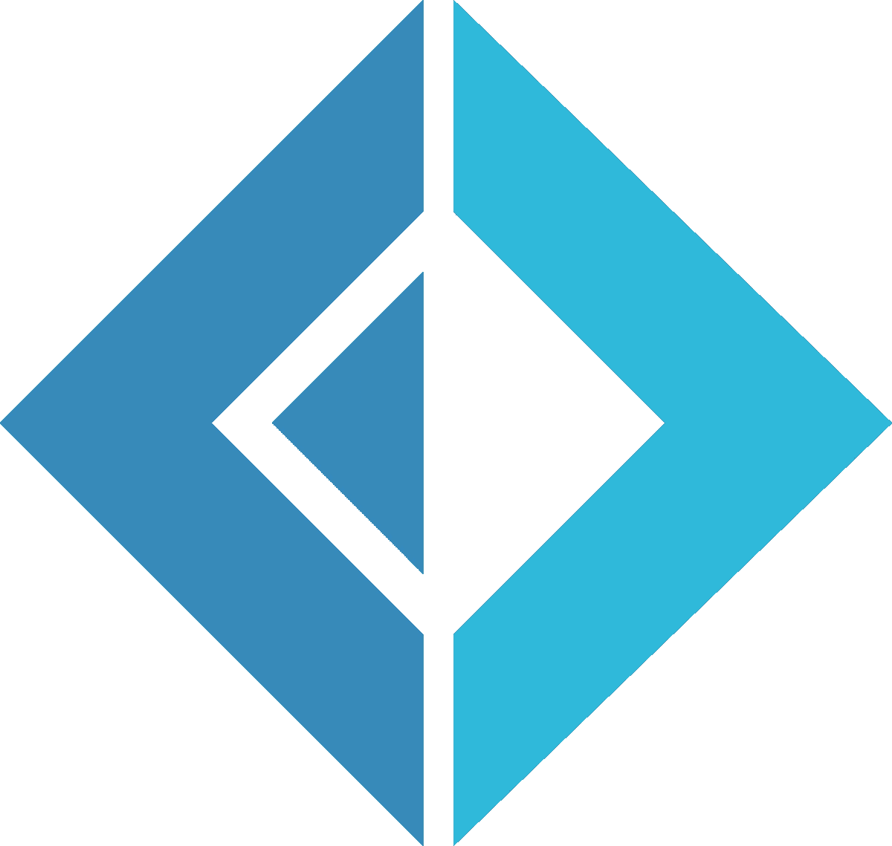
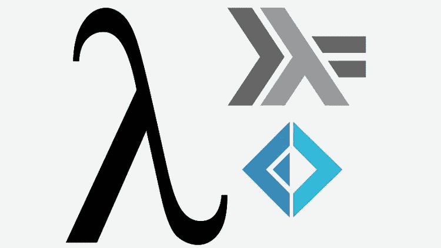
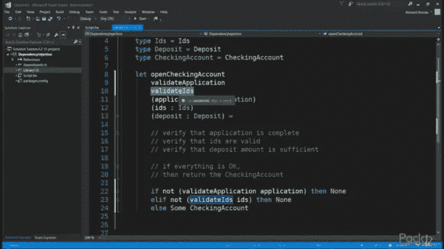
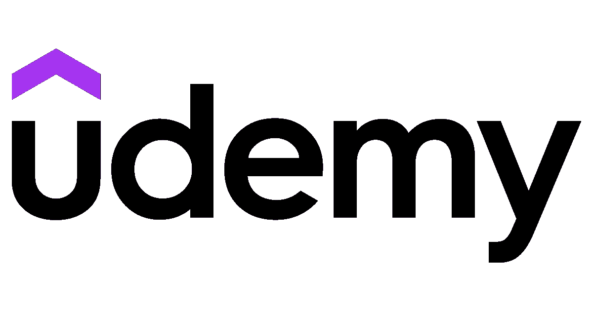
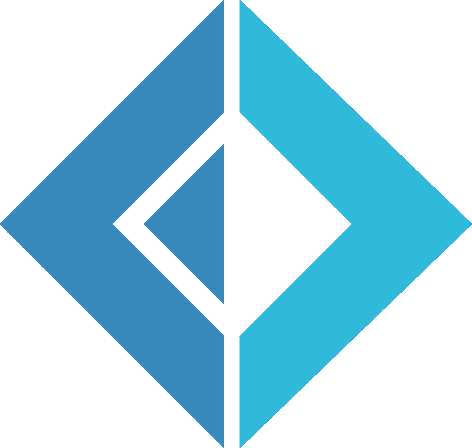

# 2022 年新手在线学习的 5 门最佳 F#编程课程

> 原文：<https://medium.com/javarevisited/5-best-f-programming-courses-for-beginners-to-learn-online-c00fbc189bf1?source=collection_archive---------5----------------------->

## 2022 年想学 F#编程语言？下面是 2022 年学习 F#最好的在线课程。

大家好，如果你想在 2022 年学习 F#编程语言，并寻找最好的在线课程和教程，那么你来对地方了。早些时候，我已经分享了学习函数式编程语言的最佳在线课程，如 [Scala](/javarevisited/10-best-scala-and-functional-programming-online-courses-for-beginners-b6461b27bf) 、 [Haskell](https://javarevisited.blogspot.com/2021/12/top-5-courses-to-learn-haskell-for.html) 、 [Elixir](https://javarevisited.blogspot.com/2022/01/top-5-courses-to-learn-elixir-and-phoneix.html) 和 [Erlang](https://javarevisited.blogspot.com/2022/01/top-5-courses-to-learn-erlang-for.html) ，在这篇文章中，我将分享从头开始学习 F#编程语言的最佳在线课程。

对于新手来说，F#也称为 F sharp，是一种函数式编程语言，它允许您通过编写简单的代码来解决复杂的问题。

F#使得编写能够解决复杂问题的简洁代码变得非常容易。是一种类似 [Scala](https://javarevisited.blogspot.com/2020/09/top-5-courses-to-learn-scala.html) 、 [Haskell](https://javarevisited.blogspot.com/2021/12/top-5-courses-to-learn-haskell-for.html) 、[elixin](https://javarevisited.blogspot.com/2022/01/top-5-courses-to-learn-elixir-and-phoneix.html)、 [Erlang](https://javarevisited.blogspot.com/2022/01/top-5-courses-to-learn-erlang-for.html) 的函数式编程语言。

F#编程语言最大的好处是它可以在所有主要的桌面和移动平台上使用。F#是建立在。NET 框架，并提供良好的互操作性、可移植性和速度。它还提供了简洁性、便利性、正确性、并发性和完整性。

F#最初是微软的一个研究项目，最初只能在 Windows 上使用。但是现在你可以在很多平台上使用 F#，包括 Mac 和 Linux。它还可以在 Android 和 iOS 设备上运行，并使用 HTML5 在网络上运行。也可以应用于 GPU 代码、大数据、游戏。

F#的一个主要亮点是它是高度交互式的，这意味着您可以在执行代码之前测试它。在 [Linux](https://www.java67.com/2020/07/top-5-courses-to-learn-linux-in-depth.html) 上，F#支持 Xamarin Studio、MonoDevelop 和 Emacs。在 Windows 上，它可以与 Visual Studio、Xamarin Studio 和 Emacs 一起工作。

# 初学者学习 F#的 5 个最佳在线课程 2022

我们已经为你做了艰苦的工作，并编制了一份学习 F#的 5 门最佳课程的清单。你可以从这个列表中选择一门课程，把自己变成 F#专家。看看下面的列表。

## 1. [F#从地上爬起来【Udemy】](https://click.linksynergy.com/deeplink?id=JVFxdTr9V80&mid=39197&murl=https%3A%2F%2Fwww.udemy.com%2Fcourse%2Ffsharp-from-the-ground-up%2F)

这个课程一定会帮助你开始你的旅程。NET 的功能优先编程语言。加入本课程后，您将终身获得超过 5 小时的点播视频讲座和 1 个可下载的教育资源。

这个课程是由 Kit 创建的，他已经写了几本与 F#相关的书，最近的一本是 Styllish F#，这也是一本学习 F #编程语言的好书。

在本课程中，您将从学习如何安装开始。在 Windows 上使用 F#的. NET 和 Visual Studio 代码。您还可以使用 F#数据类型，比如记录和选项类型。

**下面是加入本课程** — [F#的链接](https://click.linksynergy.com/deeplink?id=JVFxdTr9V80&mid=39197&murl=https%3A%2F%2Fwww.udemy.com%2Fcourse%2Ffsharp-from-the-ground-up%2F)

## 2.[动手操作函数编程+构建真实应用](https://click.linksynergy.com/deeplink?id=JVFxdTr9V80&mid=39197&murl=https%3A%2F%2Fwww.udemy.com%2Fcourse%2Fhands-on-functional-programming%2F)

本课程将使你能够在 F#的帮助下设计、构建和交付真实世界的应用程序。您将能够为 F#开发设置您的 IDE，并使用 F#友好的工具进行自动化、工具和依赖管理。

您还将能够使用 F#函数构建简单和复杂的应用程序行为。本课程将使你能够在 F#应用程序和其他应用程序之间进行互操作。NET 应用程序。

加入本课程后，您将终身获得超过 5 小时的点播视频讲座和 1 个可下载的教育资源。

**这是加入本课程的链接**——[动手函数编程+构建真实应用](https://click.linksynergy.com/deeplink?id=JVFxdTr9V80&mid=39197&murl=https%3A%2F%2Fwww.udemy.com%2Fcourse%2Fhands-on-functional-programming%2F)

## 3.[用 F #](https://click.linksynergy.com/deeplink?id=JVFxdTr9V80&mid=39197&murl=https%3A%2F%2Fwww.udemy.com%2Fcourse%2Flearn-suave%2F)【Udemy】进行数据编程

在本课程中，您将探索可用于处理现实世界数据编程挑战的不同实用技术。还将向您介绍使用 F#平台处理数据的各种策略。

您将学习如何使用 F#代理管理异步输入和处理大型数据流。您还将被授权使用类型提供者来简化来自关系数据库、web APIs、Azure 服务和非。网络语言。

本课程还将教你如何设计和控制异步工作流。购买本课程后，您将终身获得超过 2 小时的点播视频讲座和 1 个可下载的教育资源。

**这里是加入本课程** — [用 F#](https://click.linksynergy.com/deeplink?id=JVFxdTr9V80&mid=39197&murl=https%3A%2F%2Fwww.udemy.com%2Fcourse%2Flearn-suave%2F) 进行数据编程的链接

## 4.[在 F#中创建自己的迷你 Web 服务器](https://click.linksynergy.com/deeplink?id=JVFxdTr9V80&mid=39197&murl=https%3A%2F%2Fwww.udemy.com%2Fcourse%2Flearn-suave%2F)【Udemy】

在本课程中，您将在 F#的帮助下学习使用功能优先编程的 Suave 库的设计原则。购买本课程后，您将终身获得超过 1 小时的点播视频讲座。

通过本课程，您将了解三步法，这是一种使用函数式编程开发应用程序的有效技术。还将向您介绍 Suave 的内部工作方式，这是一个流行的 F # web 库。

**这是参加本课程的链接—** [在 F#中创建自己的迷你 Web 服务器](https://click.linksynergy.com/deeplink?id=JVFxdTr9V80&mid=39197&murl=https%3A%2F%2Fwww.udemy.com%2Fcourse%2Flearn-suave%2F)

## 5.[用 F#学习函数式编程](https://click.linksynergy.com/deeplink?id=JVFxdTr9V80&mid=39197&murl=https%3A%2F%2Fwww.udemy.com%2Fcourse%2Flearning-functional-programming-with-f%2F)【Udemy】

这是 Udemy 平台上最受欢迎的初级课程之一。本课程将帮助您开始使用 F#构建端到端的 web 应用程序。

您还将学习如何构建交互式 F#概念。购买本课程后，您将终身获得超过 3 小时的点播视频讲座和 1 个可下载的教育资源。

您还将学习 F#应用程序的各个方面和内部逻辑。本课程让你深入了解 F#的界面、属性和组成。

**这里是加入本课程**——[用 F#学习函数式编程](https://click.linksynergy.com/deeplink?id=JVFxdTr9V80&mid=39197&murl=https%3A%2F%2Fwww.udemy.com%2Fcourse%2Flearning-functional-programming-with-f%2F)的链接

# F#常见问题

**1。F#是什么意思？**

F#也叫 F sharp，是一种[函数式编程语言](https://javarevisited.blogspot.com/2021/05/java-8-stream-lambda-expression-d.html)，它允许你通过编写简单的代码来解决复杂的问题。F#最初是微软的一个研究项目，最初只能在 Windows 上使用。但是现在你可以在很多平台上使用 F#，包括 Mac 和 Linux。

**2。F#是做什么用的？**

F#使得编写能够解决复杂问题的简洁代码变得非常容易。它是一种函数式编程语言，可用于所有主要的桌面和移动平台。F#是建立在[上的。NET framework](https://javarevisited.blogspot.com/2019/10/top-5-courses-to-learn-asp-net-in-2019.html) 并提供良好的互操作性、可移植性和速度。它还提供了简洁性、便利性、正确性、并发性和完整性。

**3。谁创造了 F#？**

F#最初是微软的一个研究项目，最初只能在 Windows 上使用。但是现在你可以在很多平台上使用 F#，包括 Mac 和 Linux。

以上就是 2022 年**学习 F#编程的最佳在线课程**。虽然在线学习 F#的资源不多，但这些是我得到的最好的资源。如你所见，我遵守了我的承诺，给了你一份学习 F#的 5 门最佳课程的清单。现在，球在你的球场上。停止滚动，开始学习。

如果你喜欢这份 **5 门学习 F#** 的最佳课程清单，请随意与你的朋友和家人分享。如果您有任何疑问或问题，也可以发表评论，我们会尽快回复您。