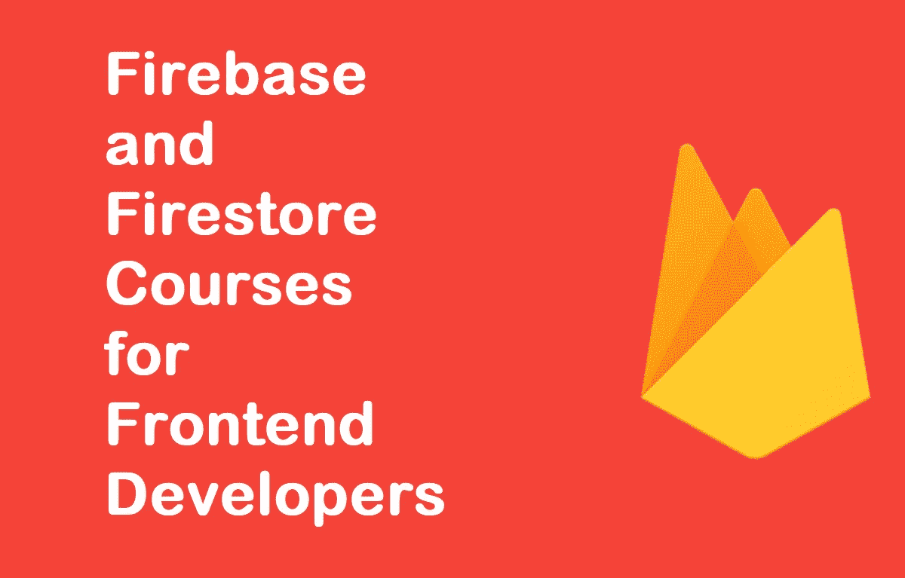
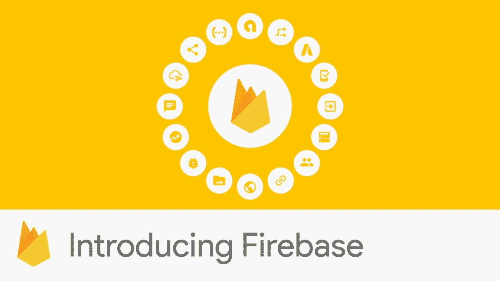
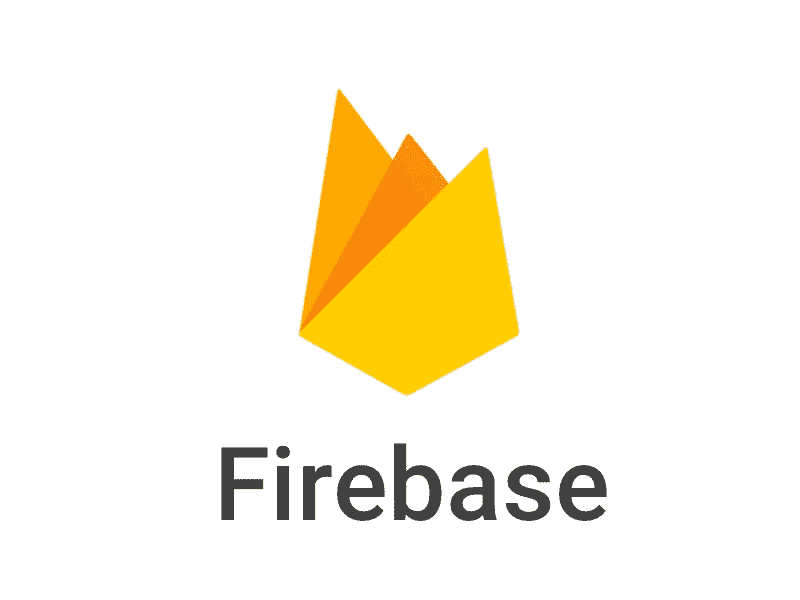

# 2023 年学习 Firebase 和 Firestore 的 6 个最佳在线课程

> 原文：<https://medium.com/javarevisited/5-best-firebase-and-firestore-courses-for-frontend-developers-88052b0d3e74?source=collection_archive---------0----------------------->

## 2023 年在线学习 Udemy、Pluralsight、Coursera 的 6 门最佳 Firebase 课程

大家好，如果你尝试过创建一个 web 应用或移动应用，那么你会知道这并不总是简单的，尤其是如果你不是一个有着多年经验的全栈开发者。

好消息是，如果你不想花时间建立一个成熟的后端，这通常不是小应用程序所需要的，那么 [**Firebase**](https://firebase.google.com/) 真的可以帮助你。

如果你不知道，Firebase 是谷歌的一项在线服务(也可以通过[谷歌云](https://javarevisited.blogspot.com/2019/07/top-5-google-cloud-platform-gcp-courses-certifications-online.html)获得)，它提供实时数据库、认证服务和其他几个标准后端功能。这意味着*你不需要创建自己的后端*，你可以利用 Firebase 快速发布你的移动应用或网络应用。

Firebase 俗称 **BaaS** 或**后端即服务**。建立、使用和拥有各种特性来构建一个可伸缩的复杂的 web 应用程序是很容易的。一些特性包括安全认证、实时数据库和跨多个客户端测试的测试实验室。

不过， *Firebase 最出名的是它的实时数据库，*是基于云的， [NoSQL 数据库](https://javarevisited.blogspot.com/2019/03/top-5-nosql-database-web-developers-should-learn.html)。数据存储为 JSON，并实时同步到所有连接的客户端。

当你用他们的 [iOS](/javarevisited/top-5-online-courses-to-learn-ios-12-swift-in-2019-a35ae1be7b2b?source=---------5------------------) 、 [Android](/hackernoon/top-5-courses-to-learn-android-for-java-programmers-667e03d995b4) 和[JavaScript](/javarevisited/10-best-online-courses-to-learn-javascript-in-2020-af5ed0801645)SDK 构建跨平台应用时，你所有的客户端可以共享一个实时数据库实例，并在新数据可用或现有数据发生变化时自动接收更新。

Firebase 最棒的一点是，它由 Google 拥有和支持，并且可以在 [Google 云平台](https://www.java67.com/2020/10/5-free-courses-to-pass-google-cloud-professional-cloud-devops-engineer-certificaiton.html)上使用。您可以将 Firebase 用于从小型快速演示到大型企业级应用程序的任何事情，我强烈建议前端开发人员学习 Firebase 以加快开发速度。

如果你认同 Firebase 提供的好处，并在 2023 年寻找一些优秀的资源[学习 Firebase，](https://javarevisited.blogspot.com/2020/03/top-5-courses-to-learn-firebase-in-2020.html)那么你来对地方了。

在这篇文章中，我将分享一些从热门在线平台学习 Firebase 的最佳在线课程，如 [Udemy](https://javarevisited.blogspot.com/2019/08/top-10-udemy-courses-and-certifications-for-programmers.html) 、 [Pluralsight](https://javarevisited.blogspot.com/2019/10/udemy-vs-pluralsight-review-which-is-better-to-learn-code.html) 、 [Coursera](https://javarevisited.blogspot.com/2019/10/top-5-coursera-professional-certificates-for-programmers-IT-professionals.html) 和 [Educative](https://javarevisited.blogspot.com/2020/01/top-10-free-interactive-online-courses.html) 。您可以按照自己的时间表，在舒适的办公室或家中使用这些课程来学习 Firebase。

# 2023 年初学者在线学习 Firebase 的 6 门最佳课程

在不浪费你更多时间的情况下，这里是我列出的 2023 年学习 Firebase 的一些最佳课程。

无论是[前端 web 开发人员](https://dev.to/javinpaul/the-2019-web-development-frontend-backend-roadmap-4le2)还是 [*移动开发人员*](/@javinpaul/10-frameworks-and-libraries-mobile-application-developers-can-learn-in-2020-e0b91391cade) 都可以从学习 Firebase 中受益匪浅，这就是为什么我不仅包含了教授 Firebase 的课程，还包含了使用 [JavaScript](/javarevisited/12-free-courses-to-learn-javascript-and-es6-for-beginners-and-experienced-developers-aa35874c9a32) 、 [Vue.js](https://javarevisited.blogspot.com/2019/08/top-5-online-courses-to-learn-vue.js-best.html) 或其他前端框架如 [Angular](/javarevisited/10-courses-to-learn-angular-for-web-development-6da1bd2856dc) 和 [React](/javarevisited/top-10-free-courses-to-learn-react-js-c14edbd3b35f?source=extreme_main_feed----d3a191ac6ed-----5-1--------------------561c2dc6_a2b4_41e0_b7be_1d97edbf631c--8) 的 Firebase。

## 1.[用 Vue JS 2 & Firebase](https://click.linksynergy.com/deeplink?id=JVFxdTr9V80&mid=39197&murl=https%3A%2F%2Fwww.udemy.com%2Fcourse%2Fbuild-web-apps-with-vuejs-firebase%2F) 构建 Web 应用

如果你也在学习 Vue.js，这是我最喜欢的，也可能是学习 Firebase 的最好课程。在这门课程中，你将学习 Vue.js 和 Firebase。它将首先教你 Vue.js 和如何创建一个成熟的 Vue 应用程序，然后转移到 Firebase。

您将学习如何使用 Firebase 向名为 Firestore 的 [NoSQL 数据库](/javarevisited/5-best-nosql-database-programmers-and-developers-can-learn-42a0bdfa9a12)存储和检索数据，以及使用 Firebase Auth 服务验证您应用程序的用户。

该课程还涉及 Firebase 云功能(允许我们在 [Node.js 环境](/javarevisited/top-10-online-courses-to-learn-node-js-in-depth-8ef0e31ca139)中运行服务器端 JavaScript 代码)，以及将我们所有的应用程序部署到 Firebase 主机，这是一项面向 web 开发人员的基本服务。

**这是加入本课程的链接** — [用 Vue JS 2 & Firebase](https://click.linksynergy.com/deeplink?id=JVFxdTr9V80&mid=39197&murl=https%3A%2F%2Fwww.udemy.com%2Fcourse%2Fbuild-web-apps-with-vuejs-firebase%2F) 构建 Web 应用

谈到社交证明，这门课程受到了超过 9491 名学生的信任，平均有近 2600 名参与者给它打了 4.7 分，这简直令人惊讶。我强烈推荐这个课程给所有想在 2023 年学习 Firebase 的[前端开发者](https://javarevisited.blogspot.com/2020/01/10-things-web-developers-should-learn.html)。

## 2.[Joe Eames 的《Firebase Fundamentals》](https://pluralsight.pxf.io/c/1193463/424552/7490?u=https%3A%2F%2Fwww.pluralsight.com%2Fcourses%2Ffirebase-fundamentals)

这是学习 Pluralsight 的 Firebase 基础知识的很好的入门课程。该课程面向前端开发人员，但任何想学习 Firebase 的人都可以从该课程中受益。

在本课程中，我们将从 web 前端学习使用 Firebase 的基础知识，这样您不仅可以利用它极快的数据存储能力，还可以利用它简单的 API。

这是一门实践课程，您将构建一个完整的应用程序，从一个简单的关系数据模型开始，慢慢迁移到一个完整的 NoSQL 优化设计，同时学习 Firebase 的所有功能，以及如何有效地利用它们。

**这里是加入本课程的链接**-[Joe Eames 的《Firebase Fundamentals》](https://pluralsight.pxf.io/c/1193463/424552/7490?u=https%3A%2F%2Fwww.pluralsight.com%2Fcourses%2Ffirebase-fundamentals)

顺便说一句，你需要一个 [**Pluralsight 会员**](https://pluralsight.pxf.io/c/1193463/424552/7490?u=https%3A%2F%2Fwww.pluralsight.com%2Fpricing) 才能进入这个课程，费用大约是每月 29 美元或每年 299 美元(14%的折扣)。

如果你没有 Pluralsight 会员资格，我鼓励你申请一个，因为它可以让你访问他们 5000 多门关于所有最新主题的在线课程，如前端和后端开发、机器学习等。它还包括交互式测验、练习和最新的认证材料。

它更像是软件开发人员的网飞，因为学习是我们工作的重要组成部分，Pluralsight 会员资格是在竞争中保持领先的一个很好的方式。

他们还提供 [**10 天免费试用**](https://pluralsight.pxf.io/c/1193463/424552/7490?u=https%3A%2F%2Fwww.pluralsight.com%2Flearn) 无需任何承诺，这是一个很好的方式，不仅可以免费使用这门课程，还可以在加入 Pluralsight 之前检查课程的质量。

<https://pluralsight.pxf.io/c/1193463/424552/7490?u=https%3A%2F%2Fwww.pluralsight.com%2Flearn>  

## 3.[iOS 版 Firebase Firestore](https://click.linksynergy.com/deeplink?id=JVFxdTr9V80&mid=39197&murl=https%3A%2F%2Fwww.udemy.com%2Fcourse%2Fdevslopes-firestore-ios%2F)

如果你想了解全新的 Firestore，一种基于 NoSQL 文档的 iOS 开发技术，那么这个课程就是为你准备的。在本课程中，您将从头开始学习 Firebase 基础知识、身份验证，并深入了解 Firestore 安全规则。

学完本课程后，您应该能够使用新的 Firestore 实时数据库构建自己的应用程序。您将了解如何创建数据并将其保存到 Firestore，以及如何使用 firebase 身份验证为您的应用程序添加强大的登录功能。

您还将学习如何使用 Firestore 安全功能来保护您的数据库，并限制只有授权用户才能访问。总的来说，这是一门学习 Firestore 的奇妙课程，不仅适用于 iOS 开发者，也适用于 Android 和 T21 开发者。

**这是参加本课程的链接**——[iOS 版 Firebase Firestore】](https://click.linksynergy.com/deeplink?id=JVFxdTr9V80&mid=39197&murl=https%3A%2F%2Fwww.udemy.com%2Fcourse%2Fdevslopes-firestore-ios%2F)

## 4.[基于 Firebase 的全栈网络应用](https://www.educative.io/courses/fullstack-web-apps-with-firebase?affiliate_id=5073518643380224)

这是一个基于文本的交互式课程，学习 Firebase，用于 Educative 上的全栈 web 应用程序开发，Educative 是一个新的在线学习平台。在本课程中，您将学习如何使用 Firebase 极其快速地创建和启动 web 应用程序。

本课程采取基于项目的方式，这也是学习 Firebase 等新技术的最佳方式。在本课程中，您将使用 Firebase 构建四个应用程序。每个应用程序都旨在教你不同的 firebase 服务，包括 Firebase 存储和 Firebase 托管。

每个服务可以单独使用，也可以与其他 Firebase 服务结合使用。为了从本课程中获得最大收益，你应该有一些 JavaScript 经验，因为它是贯穿整个课程的编程语言。

**以下是加入本课程**—[Firebase&Firestore 大师班](https://click.linksynergy.com/deeplink?id=JVFxdTr9V80&mid=39197&murl=https%3A%2F%2Fwww.udemy.com%2Fcourse%2Ffirebase-course%2F)的链接

Educative 还为您提供了购买本课程或获得 [**Educative 订阅**](https://www.educative.io/subscription?affiliate_id=5073518643380224) 的选项，这将为您提供对他们 100 多门软件课程的无限制访问。

如果你在不断地学习，订阅选项会给你更多的钱，而且很容易加入你想要的课程，而不是每次一个一个地购买。

<https://www.educative.io/subscription?affiliate_id=5073518643380224>  

## 5. [Firebase & Firestore 大师班](https://click.linksynergy.com/deeplink?id=JVFxdTr9V80&mid=39197&murl=https%3A%2F%2Fwww.udemy.com%2Fcourse%2Ffirebase-course%2F)

这是另一个学习 2023 年 Angular 9 全栈开发的伟大课程，你将学习一些基本的 Firebase 服务，如 Firestore、Firebase 存储和托管、Firebase 云功能和 AngularFire。

在本课程中，您将学习如何利用整个 Firebase 生态系统，使用无服务器架构设计和构建 Angular 应用程序，其中包括 Firestore [NoSQL](https://javarevisited.blogspot.com/2019/01/top-5-mongodb-online-training-courses.html) 数据存储数据库、Firebase 安全规则、Firebase 托管、Firebase 存储和 Firebase 云功能。

这也是一门高效的实践课程，通过使用 Firebase SDK 和 AngularFire 构建应用程序，您将会以有趣且实用的方式学习 Firebase 和 NoSQL。

在此过程中，您还将学习无服务器设计的主要概念，这是 2023 年云原生开发人员的另一项关键技能。

**这是加入本课程** — [Firebase & Firestore 大师班](https://click.linksynergy.com/deeplink?id=JVFxdTr9V80&mid=39197&murl=https%3A%2F%2Fwww.udemy.com%2Fcourse%2Ffirebase-course%2F)的链接

谈到社会证明，这门课程受到了超过 2236 名学生的信任，它平均得到了 369 名参与者的 4.4 分，非常优秀。总的来说，我强烈推荐这个课程给 2023 年想用 [Angular](https://javarevisited.blogspot.com/2018/06/5-best-courses-to-learn-angular.html) 学习 Firebase 的前端开发者。

## 6.[用 React、Redux 和 Firebase 构建一个 Slack 聊天应用](https://click.linksynergy.com/deeplink?id=JVFxdTr9V80&mid=39197&murl=https%3A%2F%2Fwww.udemy.com%2Fcourse%2Fbuild-a-slack-chat-app-with-react-redux-and-firebase%2F)

到目前为止，我们已经看到了学习 Firebase 和 Firestore 的最佳 Udemy 课程，现在是时候看看基于项目的课程了，在这里您可以应用所有这些技能并构建一个您可以引以为豪的项目。

Reed Barger 的“用 React、Redux 和 Firebase 构建一个 Slack 聊天应用程序”课程就是这样的实践课程之一。在本课程中，您将使用 React、Redux、Firebase 5 和语义 UI React 从前到后创建一个完整的全栈聊天应用程序

在这一过程中，您不仅将[学习反应和还原](https://javarevisited.blogspot.com/2018/08/top-5-react-js-and-redux-courses-to-learn-online.html#axzz5r06B3egD)，还将学习 Firebase 5 的每个主要部分——实时数据库、存储、规则、监听器和使用 Firebase 工具的部署。如果你喜欢项目和基于项目的课程，我强烈推荐这个。

**这是加入本课程(项目)的链接**——[用 React、Redux 和 Firebase 构建一个 Slack 聊天应用](https://click.linksynergy.com/deeplink?id=JVFxdTr9V80&mid=39197&murl=https%3A%2F%2Fwww.udemy.com%2Fcourse%2Fbuild-a-slack-chat-app-with-react-redux-and-firebase%2F)

以上就是 2023 年**学习 Firebase 的最佳在线课程**。有了 Firebase，您可以获得传统后端的所有好处，而从头开始设置后端却很复杂且费力。

此外，一旦您学会了如何利用不同的 Firebase 服务，您将会成倍地减少移动和 web 应用程序的开发和交付时间。

其他**在线编程资源**你可能喜欢
[2023 年 Java 开发者路线图](https://javarevisited.blogspot.com/2019/10/the-java-developer-roadmap.html#123)
[2023 年 DevOps 程序员路线图](https://javarevisited.blogspot.com/2018/09/the-2018-devops-roadmap-your-guide-to-become-DevOps-Engineer.html)
[Java 和 Web 开发者应该学习的 10 个框架](https://javarevisited.blogspot.com/2018/01/10-frameworks-java-and-web-developers-should-learn.html)
[2023 年 React JS 开发者路线图](https://javarevisited.blogspot.com/2018/10/the-2018-react-developer-roadmap.html)
[5 门免费课程 2023 年学习 Maven 和 Jenkins](http://www.java67.com/2018/02/6-free-maven-and-jenkins-online-courses-for-java-developers.html)
[前 5 门课程要 开发者](http://javarevisited.blogspot.sg/2018/01/top-5-nodejs-and-express-js-online-courses-for-web-developers.html)
[2023 年学习 Docker 的 10 门免费课程](http://www.java67.com/2018/02/5-free-docker-courses-for-java-and-DevOps-engineers.html)
[2023 年学习 Scala 的 5 门免费课程](https://javarevisited.blogspot.com/2019/01/5-free-scala-programming-courses-for-java-programmers-learn-online.html)
[2023 年学习 React JS 的前 5 门课程](/@javinpaul/top-5-courses-to-learn-react-js-in-2019-best-of-lot-fa02cd96cdf0)
[5 门面向 Java 开发者的 Android 在线培训课程](https://javarevisited.blogspot.com/2017/12/top-5-android-online-training-courses-for-Java-developers.html)
[10 门面向 Fullstack Java 开发者的免费课程](/javarevisited/10-free-full-stack-java-development-courses-for-beginners-and-experienced-programmers-8473390bec03)
[10 个你能](/javarevisited/10-of-the-most-popular-javascript-frameworks-libraries-for-web-development-in-2019-a2c8cea68094)

感谢您阅读本文。如果你发现这些最好的 Firebase 在线课程对初学者有用，那么请与你的朋友和同事分享。如果您有任何问题或反馈，请留言。

**【p . s .】**—如果你正在寻找学习 iOS 和 Swift 编程语言的最佳免费在线课程，那么你也可以看看我为程序员和开发人员提供的免费 iOS 和 Swift 课程清单<https://javarevisited.blogspot.com/2018/11/5-free-ios-app-development-courses-for.html>**。你也可以在 iOS 移动应用中使用 Firestore。**

**</javarevisited/my-favorite-free-courses-to-learn-ios-app-development-f172e7d3ba5d> **