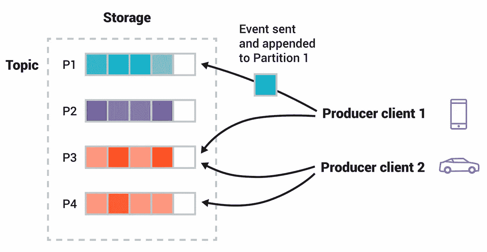
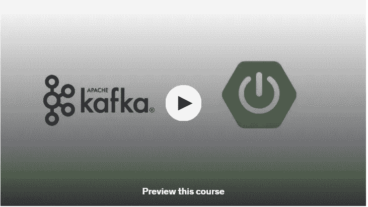
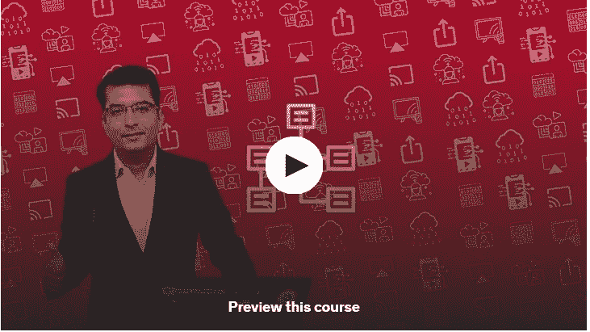
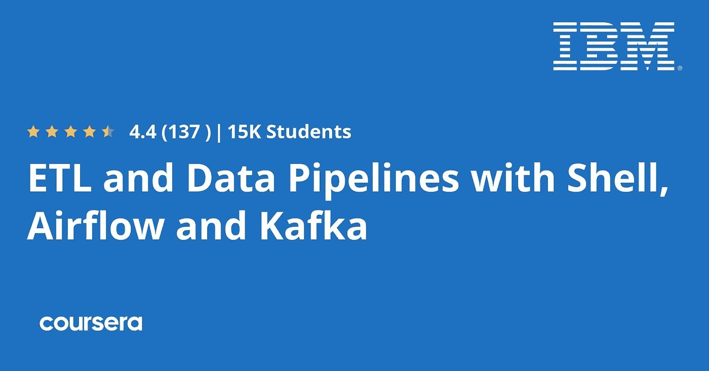
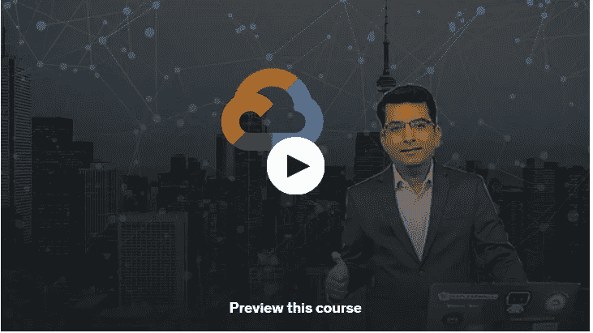
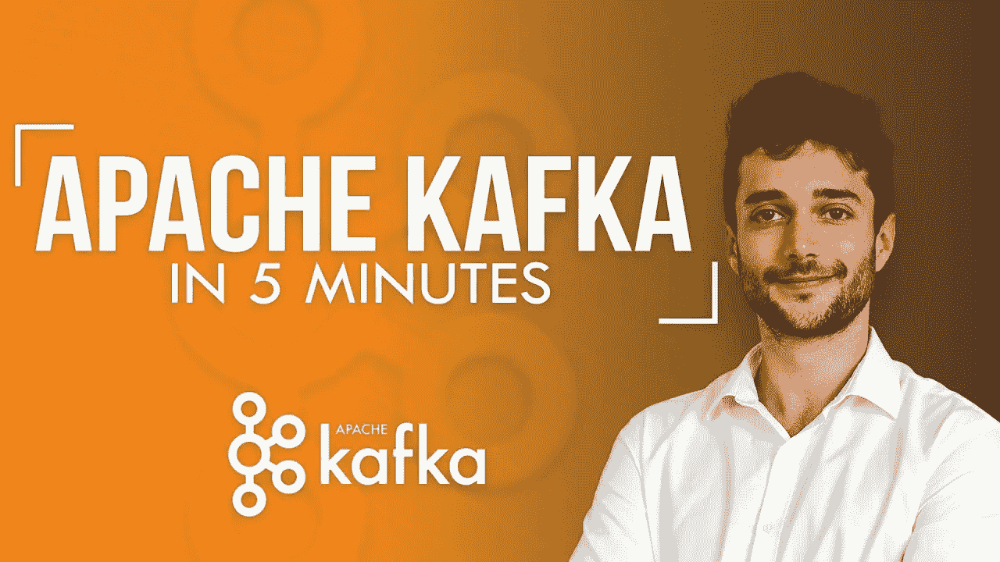

# 2023 年在线学习阿帕奇卡夫卡的 5 门最佳免费课程

> 原文：<https://medium.com/javarevisited/5-best-free-courses-to-learn-apache-kafka-online-12d0c1790e81?source=collection_archive---------1----------------------->

## 2023 年想学阿帕奇卡夫卡？以下是 Udemy 和 Coursera 上最好的免费卡夫卡在线课程，你可以在 2023 年加入学习卡夫卡

image_credit —阿帕奇卡夫卡

大家好，如果你想了解阿帕奇卡夫卡，并寻找最好的免费资源，那么你来对地方了。早些时候，我已经分享了最好的阿帕奇卡夫卡课程 ，在这篇文章中，我将分享你可以在 2023 年用来学习阿帕奇卡夫卡的最好的免费卡夫卡课程。这份名单包括来自 [Udemy](https://click.linksynergy.com/deeplink?id=JVFxdTr9V80&mid=39197&murl=https%3A%2F%2Fwww.udemy.com%2F) 和 [Coursera](https://coursera.pxf.io/c/1193463/1164545/14726?u=https%3A%2F%2Fwww.coursera.org) 的 Kafka 在线课程，并由 be 专家授课。

Apache Kafka ，现代高级分析聊天服务，被优步、Airbnb &等大型组织用来处理成千上万的日常对话。这也是 Java 开发人员的基本技能之一，我已经在我的清单中列出了 Java 开发人员的 22 项技术技能。

如果你已经下定决心，想在 2023 年学习阿帕奇卡夫卡，但正在寻找免费资源来启动你的阿帕奇卡夫卡之旅，那么不要担心。之前我已经分享过[待遇最好的阿帕奇卡夫卡课程](/javarevisited/top-10-apache-kafka-online-training-courses-and-certifications-621f3c13b38c)。

在这篇文章中，我将分享最好的免费阿帕奇卡夫卡课程。我包含了针对 Java 开发人员的一般 Kafka 课程和 Apache Kafka 课程，因为我的大部分经验是在使用 Spring Boot 的 Java 应用程序中使用 Apache Kafka。

如果你也是一名 Java 开发人员，那么你可能会发现[我最喜欢的 Apache Kafka 课程](/javarevisited/top-10-apache-kafka-online-training-courses-and-certifications-621f3c13b38c)很有用，但是即使你不使用 Java，你也可以查看这些课程来学习 Apache Kafka 基础知识。它是领先的消息传递解决方案之一，Java 生态系统之外的许多开发人员也在使用 Apache Kafka。

# 2023 年为初学者提供 5 门免费的阿帕奇卡夫卡课程

在不浪费你更多时间的情况下，这里列出了 2023 年学习阿帕奇卡夫卡的最好的免费在线课程。这些免费课程由专家创建，受到成千上万在线开发者的信任。我从流行的在线学习网站如 Udemy 和 Coursera 创建了这些课程。

## 1.[阿帕奇卡夫卡和 Spring Boot(消费者，生产者)](https://click.linksynergy.com/deeplink?id=CuIbQrBnhiw&mid=39197&murl=https%3A%2F%2Fwww.udemy.com%2Fcourse%2Fapache-kafka-and-spring-boot-consumer-producer%2F)【免费】

Udemy 上的另一个丰富的信息质量课程获得了 4.6 分。
顾名思义，本课程将针对消费者&生产者原料药。因此，它是一门中级课程。

超过 21000 名学生正在学习这个由 Arbi Elezi 创建的项目。[卡夫卡](https://kafka.apache.org/documentation/)利用消费群体的方法，让几个任务区分吸收&制作的工作。

这些组可以通过 Subscribe API 动态设置主题列表。为了更深入地理解上述概念，本课程是一张王牌。

无论您的目标是创建两个 API 还是在它们之间建立连接，这个程序都会相应地教您。通过学习本课程中的 API，你可能能够解决公司在 API 中面临的主要问题，这使得本课程成为工业应用的宝贵资产。

**该计划的主要亮点**

您将学习如何使用 S[spring Boot](/javarevisited/top-10-courses-to-learn-spring-boot-in-2020-best-of-lot-6ffce88a1b6e)开发 Kafka 消费者和生产者。完成本课程大约需要一个小时。更强调提供实用的内容。

由于本课程为中级课程，要求如下:

*   [Spring Boot](/javarevisited/10-free-spring-boot-tutorials-and-courses-for-java-developers-53dfe084587e) 阿帕奇&卡夫卡基础知识。
*   这个项目最适合从事一些 Kafka 集成项目的学生，一些需要掌握特定技能的开发人员或想要探索新技能的人。

**课程链接—** [阿帕奇卡夫卡与 Spring Boot(消费者、生产者)](https://click.linksynergy.com/deeplink?id=CuIbQrBnhiw&mid=39197&murl=https%3A%2F%2Fwww.udemy.com%2Fcourse%2Fapache-kafka-and-spring-boot-consumer-producer%2F)

## 2.[汇合模式注册简介](https://click.linksynergy.com/deeplink?id=CuIbQrBnhiw&mid=39197&murl=https%3A%2F%2Fwww.udemy.com%2Fcourse%2Fan-introduction-to-confluent-schema-registry%2F)【免费课程】

这是另一个伟大的免费在线课程，了解阿帕奇卡夫卡在 2023 年。该课程在平台评价最高的 Udemy 上提供。随着技术的快速发展，现在，我们不仅局限于组织和分析对称数据，还可以组织和分析非对称数据。随着信息资源数量的增长，拓扑结构的数量也急剧增加。

因此，对于无缝调查阶段，在真实数据中管理这些拓扑/模式是需要时间的。为了克服上述情况，由 Apache Kafka & schema registry 组成的平台变得非常方便。

这门初级课程正是要教你如何融入所需的技能。大约 400 名学生正在学习如何整合模式，以便更好、更高效地使用 Kafka 环境。

**本课程的主要亮点:**

*   您将对融合模式注册中心有很好的理解。
*   具有或不具有拓扑结构的卡夫卡建筑知识。
*   额外的好处是你会看到一个实用的演示。
*   这些讲座很短，包含了大量高质量的信息。

**课程链接—** [融合模式注册简介](https://click.linksynergy.com/deeplink?id=CuIbQrBnhiw&mid=39197&murl=https%3A%2F%2Fwww.udemy.com%2Fcourse%2Fan-introduction-to-confluent-schema-registry%2F)

## 3.[使用 Shell、Airflow 和 Kafka 的 ETL 和数据管道](https://coursera.pxf.io/c/3294490/1164545/14726?u=https%3A%2F%2Fwww.coursera.org%2Flearn%2Fetl-and-data-pipelines-shell-airflow-kafka)【免费 Coursera 课程】

这项培训由 Coursera 提供。该平台的评分为 4.8 分，超过 3000 名学生注册了该项目。它是由 IBM 提出的，IBM 是通过云平台和人工智能进行业务转型的全球领导者。

4 位技术高超的导师，他们的职业是数据工程师，将在本课程中全程指导您。这门课程是为新手以及一些想要提高技能的工作专家开设的。该计划的额外好处是，它也可以应用于该平台上的其他专业或证书课程。

**本课程的主要亮点:**

它将向您介绍将普通数据转换为企业信息的方法。这包括 ETL 和 ELT。ELT 操作用于应用程序应用户请求转换数据的情况。存储系统和多维信息需要 ETL 技术。

此外，您将发现从概念上提取信息或梳理收集的信息&将数据集成到源中的过程。通过指定对输入的修改，使它对消费者来说更可信&更有上下文。如何用 Shell 脚本构建 ETL 工作流？

**Course Link** — [ETL 和数据管道与 Shell、Airflow、Kafka](https://coursera.pxf.io/c/3294490/1164545/14726?u=https%3A%2F%2Fwww.coursera.org%2Flearn%2Fetl-and-data-pipelines-shell-airflow-kafka)

顺便说一句，如果你计划参加多个 Coursera 课程或专业，那么考虑参加 **Coursera Plus 订阅**，它为你提供无限制的访问他们最受欢迎的课程、专业、专业证书和指导项目的机会。

<https://coursera.pxf.io/c/1193463/1164545/14726?u=https%3A%2F%2Fwww.coursera.org%2Fcourseraplus>  

## 4.[在 Google Cloud 上设置单节点 Cloudera 集群——部署 Cloudera Hadoop，Spark & Kafka 环境](https://click.linksynergy.com/deeplink?id=JVFxdTr9V80&mid=39197&murl=https%3A%2F%2Fwww.udemy.com%2Fcourse%2Fsetup-single-node-cloudera-cluster-on-google-cloud%2F)【免费 Udemy 课程】

这是你在 Udemy 上能找到的最好的中级或高级课程之一。这个项目在网站上的平均评分为 4.6 分，大约有 4K 的学生在学习，它专注于使用实用的技术来教学。

讲座大约 1 小时 30 分钟长，但你花在上面的每一分钟都会教给你一些对你的工作有用的东西，或者让你学习计算机科学的新课题。

这门课程主要由实用信息和演示组成，所以学习者不会因为一遍又一遍地复习理论而感到厌烦。通过虚拟活动学习使这个过程更加有趣和有意义。

现在最常用的术语是。您将能够创建自己的大数据工程虚拟实验室，并利用 Kafka 和其他使用该程序的应用程序进行工作。

**本课程的主要亮点**

利用 Kafka 创建大数据科学生态系统& [谷歌云平台](https://javarevisited.blogspot.com/2021/11/top-5-websites-to-learn-google-cloud.html)。
了解如何进行 Cloudera 认证。
最低要求是-

对 [Linux](/javarevisited/10-essential-linux-commands-every-developer-and-devops-should-know-9df39391aac7) ， [Spark](/javarevisited/5-best-apache-spark-courses-for-java-and-python-developers-bbd9d63eb76c) & Kafka 有个基本了解就好了。
目标受众是希望利用 Kafka 的大数据集群&云模型的人。

**课程链接** — [在 Google Cloud 上设置单节点 Cloudera 集群](https://click.linksynergy.com/deeplink?id=JVFxdTr9V80&mid=39197&murl=https%3A%2F%2Fwww.udemy.com%2Fcourse%2Fsetup-single-node-cloudera-cluster-on-google-cloud%2F)

## 5.阿帕奇卡夫卡速成班——YouTube[免费]

如果你正在 YouTube 上寻找阿帕奇卡夫卡课程，那么不要再看这个免费的阿帕奇卡夫卡速成班侯赛因纳赛尔。Apache Kafka 是 LinkedIn 开发的分布式流处理软件，用 Scala 和 Java 编写，在这个免费课程中有很好的解释。

以下是你将在这个免费的卡夫卡课程中学到的东西:

1.  阿帕奇·卡夫卡简介
2.  卡夫卡经纪人
3.  卡夫卡制片人
4.  卡夫卡消费者
5.  卡夫卡隔断
6.  队列 vs 发布订阅
7.  消费者群体
8.  动物园管理员
9.  编码示例
10.  卡夫卡的利弊
11.  摘要

它几乎涵盖了一个开发者应该知道的所有重要话题，除了 Kafka 之外，像生产者、消费者、分配、群体等等，最重要的是它完全免费。你也可以在这里观看这个课程。

## 6.[初学阿帕奇卡夫卡 v2- Udemy](https://click.linksynergy.com/deeplink?id=JVFxdTr9V80&mid=39197&murl=https%3A%2F%2Fwww.udemy.com%2Fcourse%2Fapache-kafka%2F) 【付费课程】

转到本系列的最后一门课，这门课是付费的，但它值得一学，因为它对主题和虚拟项目有很好的解释。这是该领域最棒的入门课程之一，包括超过 10 万名学习者。

要在这条路上开始你的探索，不需要以前关于卡夫卡的信息。它提供了对每个基本要素的逐步介绍，以及对 Apache 环境的概述。

导师是夏羽·马瑞克，一位 AWS 和卡夫卡大师。据他说，阿帕奇卡夫卡是非常抢手的专业知识&没有足够的候选人来填补现有的角色。通过学习这个，你可能会增加你的收入或克服新的任务。

**本课程将教会你什么-**

*   建立自己的 Kafka 编程生态圈。
*   你将掌握每一个概念，如主题，断路器等。
*   创建一个基于生产者-消费者的 Twitter 弹性搜索。
*   提高您对日志压缩的了解。

**课程链接-** [初学阿帕奇卡夫卡 v2](https://click.linksynergy.com/deeplink?id=JVFxdTr9V80&mid=39197&murl=https%3A%2F%2Fwww.udemy.com%2Fcourse%2Fapache-kafka%2F)

这就是 2023 年为初学者和有经验的开发者提供的**最佳免费 Apache Kafka 课程**的全部内容。当今的应用程序中引入了多任务处理方法，以促进公司所有部门之间的生产合作。

因此，对实时问题解决技术的需求越来越大。

根据一项研究，人们相信，公司里有一个空缺职位是为了解卡夫卡的人准备的。因此，由于 K 开发者的缺乏，他们的需求正在上升，这使得它成为一项需要学习的技能。

其他**免费的** **编程和开发资源文章**您可能想探索一下

*   [5 个最适合初学者的免费 Golang 课程](https://javarevisited.blogspot.com/2021/12/5-free-courses-to-learn-golang-for.html)
*   [我最喜欢的学习微服务的免费课程](https://www.java67.com/2021/04/5-free-microservice-courses-for-java.html)
*   [面向 Java 开发者的 5 门免费 Spring 框架课程](http://www.java67.com/2017/11/top-5-free-core-spring-mvc-courses-learn-online.html)
*   [卡夫卡关键概念官方文档](https://kafka.apache.org/documentation/#gettingStarted)
*   [学习大数据和 Apache Spark 的 5 门课程](http://javarevisited.blogspot.com/2017/12/top-5-courses-to-learn-big-data-and.html)
*   [跟随 Spring Boot 学习微服务的 5 大课程](/javarevisited/top-5-courses-to-learn-microservices-in-java-and-spring-framework-e9fed1ba804d)
*   [深入学习 Spring 的 10 门最佳课程](/javarevisited/10-best-online-courses-to-learn-spring-framework-in-2020-f7f73599c2fd)
*   [初学者学习 Spring 的 10 门免费课程](/javarevisited/top-10-free-courses-to-learn-spring-framework-for-java-developers-639db9348d25)
*   [5 门免费学习核心 Java 的在线课程](http://javarevisited.blogspot.sg/2017/11/top-5-free-java-courses-for-beginners.html#axzz4zuIICRs9)
*   [初学者学习 Spring MVC 的 5 门最佳课程](https://javarevisited.blogspot.com/2020/08/top-5-courses-to-learn-spring-mvc-for.html)
*   [破解编码面试的 5 个必备技巧](https://javarevisited.blogspot.com/2020/04/5-essential-skills-to-crack-coding-interviews.html)
*   [面向有经验的 Java 开发人员的 5 大 Java 设计模式课程](http://javarevisited.blogspot.sg/2018/02/top-5-java-design-pattern-courses-for-developers.html)
*   [面向 Java 程序员的 10 门高级 Spring Boot 课程](/javarevisited/10-advanced-spring-boot-courses-for-experienced-java-developers-5e57606816bd)
*   [编程/编码工作面试 10 门课程](http://javarevisited.blogspot.sg/2018/02/10-courses-to-prepare-for-programming-job-interviews.html)
*   [10 个面向 Java 开发人员的免费 Spring Boot 教程和课程](/javarevisited/10-free-spring-boot-tutorials-and-courses-for-java-developers-53dfe084587e)
*   [每个 Java 开发人员都应该学习的 5 个基本框架](/javarevisited/5-essential-frameworks-every-java-developer-should-learn-6ed83315f1fb)
*   [10 门针对初学者的免费数据结构课程](https://www.java67.com/2019/02/top-10-free-algorithms-and-data.html)

感谢您阅读本文。如果你觉得 Udemy 和 Coursera 为 Java 开发人员提供的这些最好的免费 Apache Kafka 课程*有用，请与你的朋友和同事分享。如果您有任何问题、反馈或其他收费课程要添加到此列表中，请随时提出建议。*

**P. S.** —如果你想学习 Apache Kafka 平台，并需要一个基于项目的实践资源，那么[**Kafka fundamentals for Java developers**](https://click.linksynergy.com/deeplink?id=CuIbQrBnhiw&mid=39197&murl=https%3A%2F%2Fwww.udemy.com%2Fcourse%2Fkafka-fundamentals-for-java-developers%2F)课程是一个很好的开始。它不是免费的，但价格相当实惠，你可以在 Udemy 上花 10 美元买到。

<https://javarevisited.blogspot.com/2018/04/top-5-apache-kafka-course-to-learn.html> 