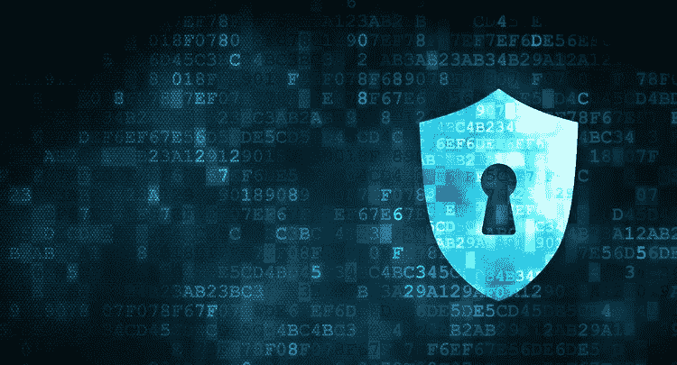
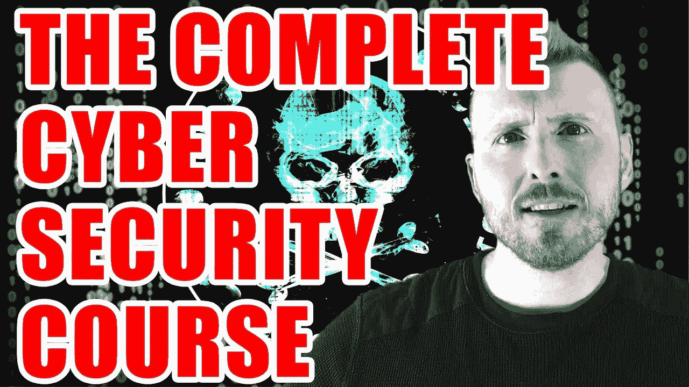
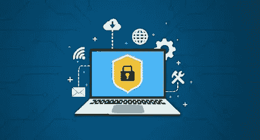
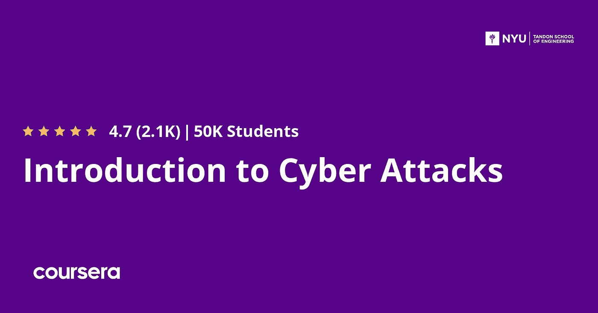
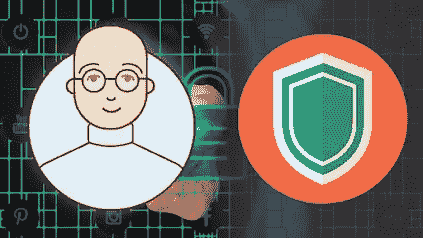

# 2023 年初学者学习的 5 门最佳免费网络安全课程

> 原文：<https://medium.com/javarevisited/5-best-free-cyber-security-courses-for-beginners-a4abec9d5e6c?source=collection_archive---------0----------------------->

## 我为 Udemy、Pluralsight 和 Coursera 的初学者策划的 2023 年从零开始学习网络安全的最佳免费在线课程和教程列表。

image_credit — udemy

大家好，如果你想成为一名网络安全工程师，或者只是想学习网络安全并开始你的安全专家生涯，或者只是想提高你关于网络安全、信息安全、网络安全和计算机安全的知识，那么你来对地方了。

之前，我已经分享了 [**最佳网络安全课程**](/javarevisited/7-best-cyber-security-courses-for-programmers-and-developers-50afafae050b) 和[**最佳网络安全课程**](https://javarevisited.blogspot.com/2021/10/top-5-courses-to-learn-web-security-in.html) ，在这篇文章中，我将分享学习网络安全的免费在线课程，这符合您的需求，因为当我分享付费课程时，许多人要求我分享免费的网络安全课程。

所以，我们开始吧，在这篇文章中，我从 [Udemy](https://javarevisited.blogspot.com/2020/11/top-10-udemy-courses-you-can-buy-in.html) 、 [Coursera](https://coursera.pxf.io/c/3294490/1164545/14726?u=https%3A%2F%2Fwww.coursera.org%2F) 和 [edX](https://www.awin1.com/cread.php?awinmid=6798&awinaffid=631878&clickref=&p=) 编译了免费的网络安全课程，他们绝对可以免费学习和加入。

由于 Covid 19 的疫情，许多公司正专注于将他们的工作转移到在线电子商务，许多人在失业后开始创建在线业务，这带来了一个大问题，即在过去几年中影响个人和公司的网络犯罪的增加。

网络犯罪是指使用电脑或手机做非法事情的行为，如窃取他人的信用卡信息或侵入他们的社交媒体凭据，以及进入人们的电脑并窥探他们的隐私。

黑客使用一些开源工具进行这些非法活动，并且大多数时候使用 Linux 操作系统。

组织现在需要专业的安全人员来保护他们的基础设施，如网络、员工计算机和公司数据库。人们还需要了解这些工具如何保护自己免受这些活动的伤害。

本文将列出一些从零开始学习和理解网络安全的最佳免费资源。这些免费课程对想要转行从事网络安全职业的新手和有经验的 IT 专业人士都很有用。

顺便说一句，如果你决心在网络安全领域发展事业，并且不介意花几个钱学习一门有用的技能，比如网络和网络安全，那么我也推荐你加入内森·豪斯在 Udemy 开设的 [**完整网络安全课程**](https://click.linksynergy.com/deeplink?id=JVFxdTr9V80&mid=39197&murl=https%3A%2F%2Fwww.udemy.com%2Fcourse%2Fthe-complete-internet-security-privacy-course-volume-1%2F) 。

Nathan 是一位著名的网络安全专家，这门课程非常有价值，但你可以在 Udemy sales 上花 9.9 美元获得，这是一种免费的学习。我向专业开发人员和任何想开始网络安全职业生涯的人强烈推荐这门网络安全课程。

# 2023 年学习网络安全的 5 门最佳免费课程

在不浪费你更多时间的情况下，这里有一个最好的免费网络安全课程列表，初学者可以在线学习网络安全概念、工具、技术和方法。

这些课程是免费的，但它们充满了知识，是由网络安全专家创建的，受到了成千上万想学习网络安全的 IT 专业人士的信任。

所有这些都有 4 星评级和很好的评论，只是出于教育和营销的原因才免费提供。

很多时候，Udemy 的讲师在达到他们的营销目标时会将他们的免费课程转换为付费课程，所以最好在他们免费时加入课程，即使你没有时间或不想以后学习。你也可以在有空的时候学习，因为一旦你加入，课程将终身免费。

## 1.[初学者网络安全课程](https://click.linksynergy.com/deeplink?id=CuIbQrBnhiw&mid=39197&murl=https%3A%2F%2Fwww.udemy.com%2Fcourse%2Fcertified-secure-netizen%2F)

学习如何保护自己免受黑客攻击是你必须知道的一件重要事情，因为人们现在有许多免费下载的黑客工具，可以用来攻击他人。安全研究人员开发这些工具是为了发现特定系统或软件中的漏洞。

然而，邪恶的人正在利用它们窃取你的信息，并在以后利用它们来对付你。

你会得到一个互联网安全的介绍。您将配置 Google chrome 的安全参数以及如何匿名冲浪，然后在 Firefox 和 internet explorer 浏览器上应用相同的设置。

您还将了解身份盗窃、数据加密、在线扫描文件、保护电子邮件等内容。

**这里是加入本课程的链接**——[初学者网络安全课程](https://click.linksynergy.com/deeplink?id=CuIbQrBnhiw&mid=39197&murl=https%3A%2F%2Fwww.udemy.com%2Fcourse%2Fcertified-secure-netizen%2F)

## 2.[网络攻击入门](https://coursera.pxf.io/c/3294490/1164545/14726?u=https%3A%2F%2Fwww.coursera.org%2Flearn%2Fintro-cyber-attacks)【Coursera 审计免费课程】

如果你打算成为一名网络安全专家，这是一门很好的课程，因为它将向你展示在投身这一职业之前你必须了解的所有必要概念，因此你将学习许多东西，如网络安全、物联网安全、防御网络攻击等等。

首先，您将对网络攻击有一个总体的了解，比如漏洞、风险以及网络攻击在现实世界中的应用。然后学习一些防御这些攻击的技术，比如使用一些身份验证解决方案和加密技术。

本课程也是 Coursera 的 [**网络安全专业**](https://coursera.pxf.io/c/3294490/1164545/14726?u=https%3A%2F%2Fwww.coursera.org%2Fspecializations%2Fintro-cyber-security) 介绍的一部分，由 Tandem 工程学院 NYU 提供。

稍后，您将了解网络安全和防火墙以及保护它们的最佳配置。最后，概述企业基础架构安全性。

**以下是加入本课程** — [网络攻击简介](https://coursera.pxf.io/c/3294490/1164545/14726?u=https%3A%2F%2Fwww.coursera.org%2Flearn%2Fintro-cyber-attacks)的链接

顺便说一下，如果你觉得 Coursera 的课程很有用，因为它们是由世界各地知名的公司和大学创建的，我建议你加入 Coursera Plus 的订阅计划，它可以让你无限制地访问他们最受欢迎的课程、专业知识、专业证书和指导项目。它每月花费大约 59 美元，但是可以让你获得无限的认证，这是无价的。

<https://coursera.pxf.io/c/3294490/1164545/14726?u=https%3A%2F%2Fwww.coursera.org%2Fcourseraplus>  

## 3.[保持在线安全](https://click.linksynergy.com/deeplink?id=CuIbQrBnhiw&mid=39197&murl=https%3A%2F%2Fwww.udemy.com%2Fcourse%2Fcybersecurity-for-kids%2F)【Udemy 免费课程】

对于开始使用 YouTube 等互联网和浏览其他网站来保护自己免受黑客和社会工程攻击的孩子来说，这门课程可能是最好的。人们现在正利用孩子们黑他们的账户和照片，并用它们来对付他们。

您将从介绍密码以及黑客如何使用不同的方法破解密码开始。

稍后，您将了解使用社交媒体的好处和坏处，以及黑客可以从您的个人资料中获取哪些信息，从而了解哪些信息不应该发布在您的社交媒体帐户上。

最后，您将了解网络钓鱼和社会工程以及如何保护您的计算机。

**这是加入本课程的链接**——[保持在线安全](https://click.linksynergy.com/deeplink?id=CuIbQrBnhiw&mid=39197&murl=https%3A%2F%2Fwww.udemy.com%2Fcourse%2Fcybersecurity-for-kids%2F)

## 4.[信息安全大局](https://pluralsight.pxf.io/c/1193463/424552/7490?u=https%3A%2F%2Fwww.pluralsight.com%2Fcourses%2Finformation-security-big-picture)【plural sight 免费试用】

本课程可能是第一次学习网络安全，并了解一些关于如何保护的错误信息，如使用防病毒软件，这意味着您可以完全保护恶意软件和许多其他东西。

你将开始了解人们在这个行业中面临的一些安全问题，例如，如何使用反病毒软件不会给你你认为的完全安全。

此外，您还将学习密码的安全性和如何保护自己免受密码攻击，以及许多其他与移动设备、加密和网络相关的问题。

**这是参加本课程** — [信息安全大图](https://pluralsight.pxf.io/c/1193463/424552/7490?u=https%3A%2F%2Fwww.pluralsight.com%2Fcourses%2Finformation-security-big-picture)的链接

顺便说一下，你需要一个 [*Pluralsight 会员*](https://pluralsight.pxf.io/c/1193463/424552/7490?u=https%3A%2F%2Fwww.pluralsight.com%2Fpricing%2Ffree-trial) 才能加入这个课程，费用大约是每月 29 美元或每年 299 美元(14%的折扣)。我向所有程序员强烈推荐这个订阅，因为它提供了超过 7000 个在线课程的即时访问，以学习任何技术技能。

或者，你也可以使用他们的 [**10 天免费试用**](https://pluralsight.pxf.io/c/1193463/424552/7490?u=https%3A%2F%2Fwww.pluralsight.com%2Fpricing%2Ffree-trial) 免费进入这个课程。

<https://pluralsight.pxf.io/c/1193463/424552/7490?u=https%3A%2F%2Fwww.pluralsight.com%2Fpricing%2Ffree-trial>  

## 5.[网络安全【免费 Udemy 课程】](https://click.linksynergy.com/deeplink?id=CuIbQrBnhiw&mid=39197&murl=https%3A%2F%2Fwww.udemy.com%2Fcourse%2Fnew-web-security-2020%2F)

本课程是学习网络安全以及黑客如何利用网站内部的不同漏洞来完全控制和窃取整个数据库，甚至将你踢出网站并代之以管理员的绝佳开端。

当他完全控制你的网站时，他可以做的和危害你的网站的选项是无止境的。

本课程将教您探索如何工作，从学习 DNS & HTTP 攻击和会话劫持开始，它们通常以浏览器为目标来利用您的计算机或系统以及跨站点请求伪造。

最后，你将了解 SQL 注入。超过 5 万名学生已经在 Udemy 上参加了这个 5 小时的免费网络安全课程，平均 4.4 分。来自超过 3K 学生的评价。

**这里是加入这个免费课程** — [网络安全](https://click.linksynergy.com/deeplink?id=CuIbQrBnhiw&mid=39197&murl=https%3A%2F%2Fwww.udemy.com%2Fcourse%2Fnew-web-security-2020%2F)的链接

以上就是 2023 年学习网络安全的**最佳免费在线课程。**网络安全对于每个人来说都是至关重要的，因为近年来攻击的数量有所增加，这将对组织声誉造成重大损害，并带来巨大的资金成本。

其他**认证资源**面向 **IT 专业人员**和 Java 程序员

*   [学习 Linux 命令行的 5 门免费课程](https://hackernoon.com/top-5-free-linux-courses-for-programmers-4a433b4edade)
*   [经验丰富的 Java 开发人员的五大职业选择](https://javarevisited.blogspot.com/2018/10/top-5-carrer-options-for-experienced-java-programmers.html)
*   [完整的前端和后端开发者路线图](https://javarevisited.blogspot.com/2019/02/the-2019-web-developer-roadmap.html)
*   [现代网络开发人员应该学习的 10 件事](/javarevisited/10-things-aspiring-web-developers-should-learn-in-2021-6747bfbfc12e)
*   [十大移动应用开发框架和库](/@javinpaul/10-frameworks-and-libraries-mobile-application-developers-can-learn-in-2020-e0b91391cade)
*   [完整的 Java 开发者路线图](https://javarevisited.blogspot.com/2019/10/the-java-developer-roadmap.html)
*   Java 程序员在 2023 年可以学到的 21 项技术技能
*   [破解任何编码面试的 5 个关键技巧](https://javarevisited.blogspot.com/2020/04/5-essential-skills-to-crack-coding-interviews.html)
*   [针对初学者的 6 门最佳道德黑客课程](/javarevisited/6-best-ethical-hacking-courses-to-learn-online-fe1fe171d05)
*   [如何在 2023 年成为 DevOps 工程师](https://javarevisited.blogspot.com/2018/09/the-2018-devops-roadmap-your-guide-to-become-DevOps-Engineer.html)
*   [2023 年通过 CompTIA Security+考试的 5 门最佳课程](https://javarevisited.blogspot.com/2020/06/top-5-courses-to-crack-comptia-security-certification-exam-sy0-501.html)
*   [每个软件开发人员都应该学习的 10 件事](https://dev.to/javinpaul/10-things-every-software-developer-should-know-39pe)
*   [每个开发人员都应该学习的 10 个 Linux 命令选项](https://javarevisited.blogspot.com/2020/08/10-examples-of-essential-linux-commands.html#axzz6nH4euiJX)
*   [5 个免费学习 Python 编码的网站](https://javarevisited.blogspot.com/2019/09/5-websites-to-learn-python-for-free.html)
*   [面向开发人员和安全工程师的 7 门 Linux 课程](/javarevisited/7-best-linux-courses-for-developers-cloud-engineers-and-devops-in-2021-7415314087e1)
*   [10 门针对初学者的免费渗透测试课程](/javarevisited/10-free-courses-to-learn-ethical-hacking-and-penetration-testing-for-beginners-84e40104aa6c)

感谢您阅读本文。如果你喜欢这些*最好的免费网络安全在线课程*，那么请与你的朋友和同事分享。如果您有任何问题或反馈，请留言。

**p . s .**——如果你需要一个全面和最新的课程来学习网络安全，并且你不怕花钱学习有用的技能，如网络安全和道德黑客，那么我也推荐你参加 Udemy 上内森·豪斯的 [**完整的网络安全课程**](https://click.linksynergy.com/deeplink?id=JVFxdTr9V80&mid=39197&murl=https%3A%2F%2Fwww.udemy.com%2Fcourse%2Fthe-complete-internet-security-privacy-course-volume-1%2F) 。

<https://javarevisited.blogspot.com/2020/03/top-5-courses-to-learn-cyber-security.html> 