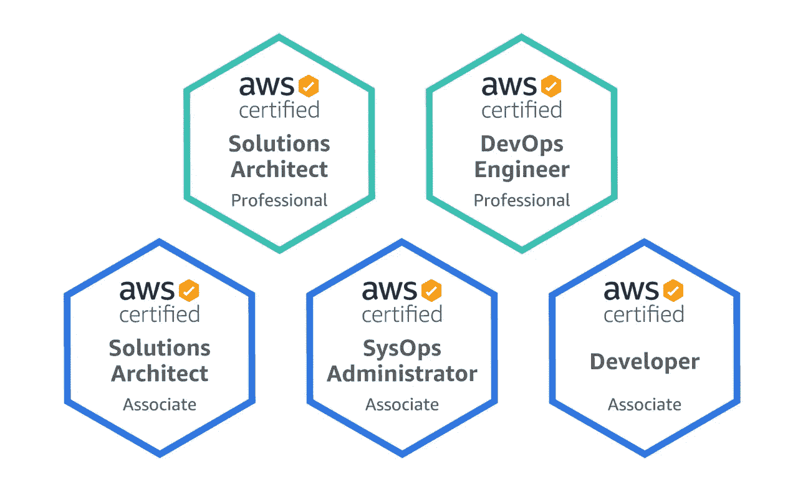
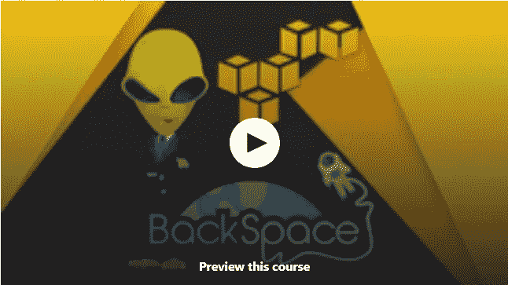
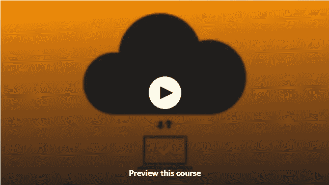
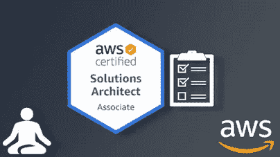
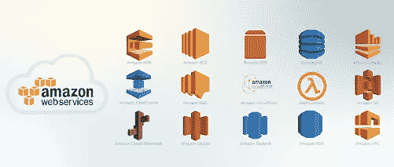
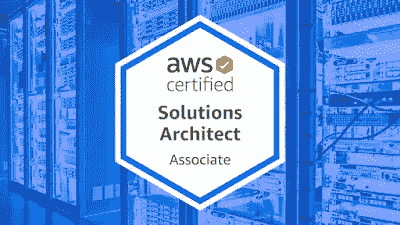
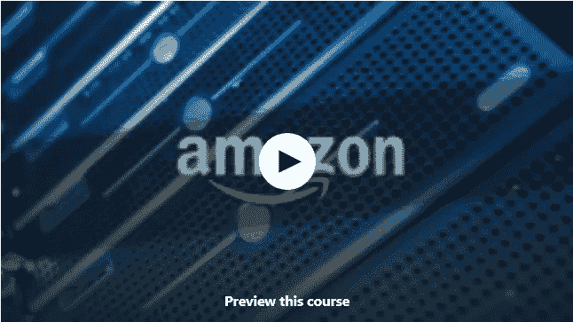

# 2023 年 AWS 认证考试准备的 6 门最佳免费在线课程

> 原文：<https://medium.com/javarevisited/5-best-free-online-courses-for-aws-certification-exams-preparation-51af06c258e9?source=collection_archive---------0----------------------->

## 这些是一些最好的免费在线课程，您可以参加这些课程来为 2023 年的 AWS 云认证做准备。

大家好，如果你正在准备 AWS 认证，并想成为一名认证的 AWS 从业者、系统管理员、开发人员和架构师，并且正在寻找最好的免费资源，如免费书籍、免费在线课程和[免费实践测试](/javarevisited/6-best-free-resources-for-aws-solution-architect-associate-exam-practice-tests-and-dumps-9a8843c69cad)，那么你来对地方了。

在过去，我分享了免费和最好的在线课程，以准备 [AWS 云从业者](https://www.java67.com/2020/08/top-5-free-courses-to-pass-aws-cloud.html)、 [AWS 开发人员](https://www.java67.com/2020/08/top-5-free-courses-to-pass-aws-developer-associate-certification.html)、 [AWS 架构师助理](https://javarevisited.blogspot.com/2019/08/top-5-free-aws-solution-architect-Associate-certification-dumps-practice-questions.html)和 [SysOps 管理员](https://www.java67.com/2020/08/top-5-free-courses-to-pass-aws-sysops-administrator-associate-exam.html)认证，今天我将分享免费的在线课程，以准备任何 AWS 认证，包括 2023 年的 AWS 解决方案架构师专业认证考试。

[A **WS 解决方案架构师专业考试**](https://aws.amazon.com/certification/certified-solutions-architect-professional/) 是最负盛名且最具挑战性的 AWS 认证考试之一。对于这次考试，你必须做好足够的准备来回答 AWS 任何角落的问题。

一旦你通过了这个考试，没有什么可以阻止你在 IT 行业，或者更确切地说，在云计算行业取得成功。你也将获得更高的工资和额外津贴，因为对熟练的和[认证的 AWS 架构师有巨大的需求。](https://dev.to/javinpaul/top-5-courses-to-pass-amazon-aws-certified-solutions-architect-associate-exam-saa-c01-in-2020-56g7)

但由于这是最艰难的考试之一，只有有限数量的候选人获得这一认证。如果你想成为其中的一员，你必须准备好全方位的 AWS。你不能不触及任何概念。你必须浏览与 AWS 相关的每一点信息。

为了帮助您通过 AWS 解决方案架构师专业考试，我创建了一个包含 5 门免费课程的列表，帮助您顺利通过 AWS 解决方案架构师专业考试。

顺便说一句，如果你不介意花几块钱投资一个综合课程和培训，以便在第一次尝试时通过这个困难的考试，那么我强烈推荐由夏羽·马瑞克教授的 [**终极 AWS 认证解决方案架构师专业人员 2023**](https://click.linksynergy.com/deeplink?id=JVFxdTr9V80&mid=39197&murl=https%3A%2F%2Fwww.udemy.com%2Fcourse%2Faws-solutions-architect-professional%2F) 课程，他是最有成就的 AWS 讲师和 AWS 英雄之一。

# 2023 年通过 AWS 解决方案架构师助理和专家考试的前 6 名免费在线课程

在进行列表之前，让我告诉你，所有这些课程都以特定的方式排列，要学习与 AWS 相关的一切，建议逐一注册所有这些课程。

第一个课程是初级水平，随着你在列表中的进一步移动，他们的专业水平将逐渐提高。

## 1.亚马逊网络服务(AWS)——从零到英雄[免费]

这是一门基础课程，将简要介绍 AWS 的各种概念。本课程由业界领先的学院(即 BlackSpace 学院)创建。还有什么比从行业领导者那里开始准备更好的呢？

这门课程最精彩的部分之一是它的演示。视频的每个方面都很清楚，解释得很好。在整个过程中，你不会觉得有什么东西被跳过或保持不变。

在本课程中，您将了解以下内容:

*   什么是云？
*   什么是 AWS 平台？
*   AWS 是如何工作的？
*   AWS 提供哪些服务？
*   你如何使用这些服务？

除此之外，课程中还展示了适当的插图，如果您有任何困惑，可以使用聊天选项直接询问您的讲师。它是一门完整的视觉和概念课程；因此，本课程的每一秒都是信息性的。

如果你刚刚开始准备，那么这个课程是最适合你的。这是一个 80 分钟长的视频讲座。因此，你可以一次完成，或者在旅行途中完成，甚至是在睡觉的时候。

**这是加入本课程的链接**——[亚马逊网络服务(AWS)——零到英雄](https://click.linksynergy.com/deeplink?id=JVFxdTr9V80&mid=39197&murl=https%3A%2F%2Fwww.udemy.com%2Fcourse%2Famazon-web-services-aws-v%2F)

## 2.[亚马逊网络服务——学习和实施 AWS 解决方案](https://click.linksynergy.com/deeplink?id=CuIbQrBnhiw&mid=39197&murl=https%3A%2F%2Fwww.udemy.com%2Fcourse%2Famazon-web-services-aws%2F)

一旦你完成了基本的介绍，是时候深入 AWS 的概念了。

这是一门 2 小时的课程，评分为 4.3，到目前为止，超过 89，000 名学生注册了这门课程。在本课程中，讲师将讲述以下主题:

*   了解如何实现 Amazon Web Services AWS 的端到端实现
*   在现代 IT 的复杂 AWS 技术方面领先一步
*   获得以后在 AWS 中学习更复杂内容的机会(例如，SSHING)

本课程的每个视频都是完全可视化的，每个概念都使用适当的插图和示例进行了详细解释，甚至还有现场实施演示。老师是清晰而微妙的，因此，理解对你来说不是问题。

**这里是免费参加本课程的链接** — [亚马逊网络服务—学习和实施 AWS 解决方案](https://click.linksynergy.com/deeplink?id=CuIbQrBnhiw&mid=39197&murl=https%3A%2F%2Fwww.udemy.com%2Fcourse%2Famazon-web-services-aws%2F)

## 3. [AWS 认证解决方案架构师助理介绍](https://click.linksynergy.com/deeplink?id=JVFxdTr9V80&mid=39197&murl=https%3A%2F%2Fwww.udemy.com%2Fcourse%2Faws-certified-solutions-architect-associate-in-30-days%2F)

到目前为止，我们已经完成了基础工作；现在，是时候进入特定主题的课程了。Premraj Jeyaprakash 创建了这门课程，超过 98，000 名学生注册了这门课程。它在 Udemy 上的评分是 4.3。

在本课程中，讲师将帮助您学习使您能够成功成为 [AWS 解决方案架构师助理专家](https://javarevisited.blogspot.com/2020/04/top-5-course-to-crack-aws-solution-architect-professional-sap-c01-certification-exam.html#axzz6dCbHWcGY)的技能。本课程将确保在完成本课程后，您将有足够的能力开始您的 AWS 专业人员生涯。

除此之外，在本课程中，你将学习不同的策略，通过这些策略你可以在 30 天内准备好考试。讲师会教你这个 AWS 解决方案架构师专业考试非常隐秘的秘密。有了这些秘密，你就能在考试中比别人表现得更好。

如果你正在寻找一门能教你并为考试做好各方面准备的课程，那么你必须报读这门课程。

**以下是参加本课程的链接** — [AWS 认证解决方案架构师助理介绍](https://click.linksynergy.com/deeplink?id=JVFxdTr9V80&mid=39197&murl=https%3A%2F%2Fwww.udemy.com%2Fcourse%2Faws-certified-solutions-architect-associate-in-30-days%2F)

## 4.[解决方案架构师 AWS 专业认证准备](https://cloudacademy.com/learning-paths/solutions-architect-professional-certification-preparation-for-aws-2019-377/)

这是您准备解决方案架构师助理专家考试的完整路线图。它在 cloudacademy.com 有售。尽管这是一个付费平台，但在试用期的帮助下，你可以完成本课程，因为云学院在有限的时间内提供免费访问，有了访问权，你就可以完成本课程。

本课程的一个重要特点是讲师会定期更新。它被评为 4.6 星(满分 5 分)。到目前为止，已经有 4676 名学生注册了这个 62 小时的视频课程。

在本课程中，您将了解各种 AWS 服务的实现。使用适当的动画和插图深入解释了 [AWS 的每个基本组件](/javarevisited/5-best-aws-courses-for-beginners-and-experienced-developers-to-learn-in-2021-563212409fbd)。

如果您正在寻找一套完整的方案，可以为您的解决方案架构师助理专家考试提供全面的培训，那么这是最适合您的课程。

## 5. [AWS 认证解决方案架构师助理](https://click.linksynergy.com/deeplink?id=JVFxdTr9V80&mid=39197&murl=https%3A%2F%2Fwww.udemy.com%2Fcourse%2Faws-certified-solution-architect-associate-2019%2F)

到目前为止，我们已经完成了 AWS 考试准备的所有基础课程和一门专题课程，现在，让我们学习下一门专题课程。

我觉得这门课唯一的缺点是你需要先了解 Linux 操作系统。

但是本课程的优势在于视频非常详细，并且您将有现场项目、测验和模拟考试的实践经验。

Vijay Patel 创建了这门课程，有超过 14000 名学生注册了这门课程。这是一个 3 小时长的视频课程，有很好的视觉效果和适当的插图。如果你觉得上面讨论的课程没意思，你可以试试这个。

**这是参加本课程的链接** — [AWS 认证解决方案架构师助理](https://click.linksynergy.com/deeplink?id=JVFxdTr9V80&mid=39197&murl=https%3A%2F%2Fwww.udemy.com%2Fcourse%2Faws-certified-solution-architect-associate-2019%2F)

## 6.[使用亚马逊网络服务的云计算](https://click.linksynergy.com/deeplink?id=CuIbQrBnhiw&mid=39197&murl=https%3A%2F%2Fwww.udemy.com%2Fcourse%2Fcloud-computing-with-amazon-web-services-part-1%2F)

这是 Udemy 的另一个免费云计算和 AWS 课程，初学者可以用来学习 AWS 解决方案架构师考试的基本云计算概念。

这是一门初级课程，内容超过 2 小时 40 分钟，超过 134K 人加入了这门课程，学习 AWS 的云计算基础知识。

以下是您将在本文中学到的关键技能:

1.  如何在云中创建虚拟服务器
2.  如何配置监控服务
3.  如何在云中配置存储服务
4.  如何设置负载平衡器并自动扩展现有基础架构
5.  学完本课程后，您应该能够建立自己的基础架构

这也是一门很好的课程，适合任何准备面试@ Amazon 的人，你只需要和 Amazon 一起实际工作就可以了。

**这是加入本课程的链接** — [使用亚马逊网络服务的云计算](https://click.linksynergy.com/deeplink?id=CuIbQrBnhiw&mid=39197&murl=https%3A%2F%2Fwww.udemy.com%2Fcourse%2Fcloud-computing-with-amazon-web-services-part-1%2F)

以上是为 AWS 解决方案架构师专业考试做准备的**免费在线课程。这是 AWS 最有声望和终极的考试之一，因此它显然很有挑战性，仅仅参加一门课程可能是不够的。**

在本教程中，我列举了几门课程，可以帮助你通过 [*AWS 解决方案架构师专业考试*](https://javarevisited.blogspot.com/2020/09/top-10-aws-certifications-for-cloud-professionals.html) ，但这一次，五门课程都是相通的。

如果您刚刚开始学习 AWS，那么您应该连续注册每门课程。不建议跳过任何课程，因为这些条款中的每一个都将在你准备这个具有挑战性的考试中发挥至关重要的作用。

你可能喜欢的其他最好的 **AWS 和云计算文章**

*   [我最喜欢的深入学习 AWS 的课程](/javarevisited/top-10-courses-to-learn-amazon-web-services-aws-cloud-in-2020-best-and-free-317f10d7c21d)
*   [学习亚马逊网络服务的 5 门免费课程](https://www.java67.com/2018/05/top-5-amazon-web-services-or-aws-courses-to-learn-online.html)
*   [成为 AWS 解决方案架构师专家的前 5 门课程](https://javarevisited.blogspot.com/2020/04/top-5-course-to-crack-aws-solution-architect-professional-sap-c01-certification-exam.html)
*   [成为 AWS DevOps 工程师专家的 5 门课程](https://javarevisited.blogspot.com/2020/04/top-5-course-to-crack-aws-certified-devops-engineer-professional-exam-certification.html)
*   [5 次免费的 AWS 解决方案架构师实践测试、转储和模拟考试](https://javarevisited.blogspot.com/2019/08/top-5-free-aws-solution-architect-Associate-certification-dumps-practice-questions.html)
*   [破解 AWS DevOps 工程师考试的前 5 门课程](https://javarevisited.blogspot.com/2020/04/top-5-course-to-crack-aws-certified-devops-engineer-professional-exam-certification.html)
*   [破解 AWS 解决方案架构师专业考试的前 5 门课程](https://javarevisited.blogspot.com/2020/04/top-5-course-to-crack-aws-solution-architect-professional-sap-c01-certification-exam.html)
*   [排名前五的谷歌云课程和认证](https://javarevisited.blogspot.com/2019/07/top-5-google-cloud-platform-gcp-courses-certifications-online.html)
*   [破解 AWS 解决方案架构师助理认证的前 5 门课程](https://javarevisited.blogspot.com/2019/05/top-5-courses-to-crack-aws-solutions-architect-associate-certification-exam-SAA-C01.html#axzz5rHwAwycj)
*   [面向 Java 开发人员的五大 AWS 和云课程](https://javarevisited.blogspot.com/2020/05/top-5-cloud-courses-for-java-and-spring-boot-developers.html)
*   [通过谷歌云 DevOps 工程师认证的 5 门免费课程](https://www.java67.com/2020/08/top-5-free-courses-to-become-google.html)
*   [成为谷歌云专业云架构师的 5 门最佳课程](https://javarevisited.blogspot.com/2020/07/top-5-courses-to-become-google-cloud-professional-architect.html)
*   [破解 AWS 开发人员助理考试的 5 门免费课程](https://www.java67.com/2020/08/top-5-free-courses-to-pass-aws-cloud.html)
*   [5 门课程成为谷歌云平台协理云工程师](https://javarevisited.blogspot.com/2020/05/top-5-course-to-crack-google-cloud-associate-cloud-engineer-certification-exam.html)
*   [初学者和有经验的开发者学习 AWS 的 5 大课程](https://javarevisited.blogspot.com/2020/05/top-5-amazon-web-services-aws-courses-for-beginners-and-experienced-programmers.html)
*   [通过 AWS 认证开发人员助理考试的前 5 门课程](https://javarevisited.blogspot.com/2020/05/top-5-courses-to-crack-aws-certified-developer-associate-certification-exam.html)
*   [如何破解 AWS 解决方案架构师助理考试](https://javarevisited.blogspot.com/2019/08/how-to-crack-aws-certified-solution-architect-exam.html)
*   [AWS 云从业者(CLF-C01)前 5 名模拟测试和考试转储](https://javarevisited.blogspot.com/2020/03/top-5-aws-certified-cloud-practitioner-mock-test-practice-questions.html)
*   [通过 AWS 云从业者考试的 5 门最佳课程](https://javarevisited.blogspot.com/2020/02/top-5-courses-to-crack-aws-certified-cloud-practitioner-exam-certification-clf-c01.html)
*   [通过谷歌云专业数据工程师认证的前 5 门课程](https://javarevisited.blogspot.com/2020/06/top-5-course-to-crack-google-cloud-professional-data-engineer-certification.html)
*   [如何准备 AWS 解决方案架构师认证](/javarevisited/top-10-courses-to-learn-amazon-web-services-aws-cloud-in-2020-best-and-free-317f10d7c21d)

感谢您阅读本文。如果您喜欢这些*最佳免费 AWS 解决方案架构师助理和专业课程*，请与您的朋友和同事分享。如果您有任何问题或反馈，请留言。

如果你真的想第一次就通过 AWS 开发人员助理认证，并能花 10 美元购买高质量的培训材料，那么我强烈推荐你参加 Udemy 网站上由夏羽·马瑞克举办的 [**终极 AWS 认证解决方案架构师专家 2023**](https://click.linksynergy.com/deeplink?id=JVFxdTr9V80&mid=39197&murl=https%3A%2F%2Fwww.udemy.com%2Fcourse%2Faws-solutions-architect-professional%2F) 课程。我强烈推荐任何认真对待这一有价值的认证的人。

</javarevisited/6-best-courses-for-aws-certified-solution-architect-professional-exam-in-2020-df5850a9279a> 