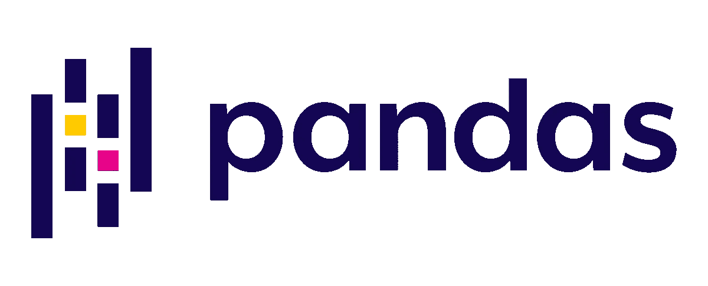
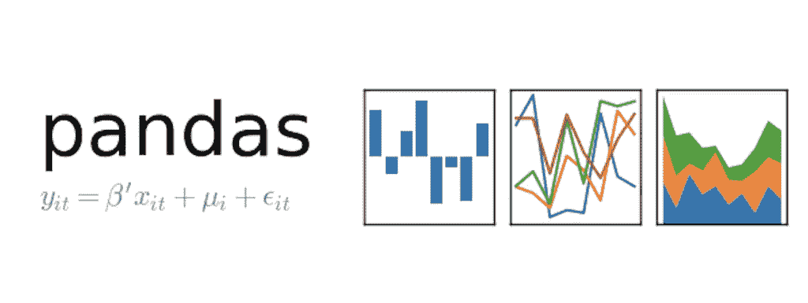
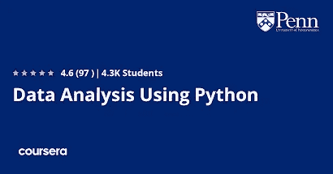

# 2023 年要学的 5 门免费熊猫课程和教程

> 原文：<https://medium.com/javarevisited/5-best-free-pandas-courses-for-beginners-in-2022-d7dbe017b90c?source=collection_archive---------1----------------------->

## 这些是我最喜欢的免费在线课程，从 Udemy、Coursera 和其他在线学习网站学习 Python 开发的熊猫库和数据科学家。

大家好，如果你想在 2023 年学习 Pandas library，这是最受数据科学家和机器学习工程师欢迎的 Python 库之一，并寻找最好的资源，如在线课程、书籍、教程和培训班，那么你来对地方了。

此前，我已经分享了 [**最佳数据科学课程**](/javarevisited/my-favorite-data-science-and-machine-learning-courses-from-coursera-udemy-and-pluralsight-eafc73acc73f) 和 [**最佳机器学习课程**](/javarevisited/top-10-machine-learning-and-data-science-certifications-and-training-courses-for-beginners-and-a6308497b764) 并且在这篇文章中，我将分享 2023 年供初学者学习的免费熊猫课程。

许多开发人员转而学习 [python 编程语言](https://javarevisited.blogspot.com/2020/05/top-10-udemy-courses-to-learn-python-programming.html)，因为它为开发人员提供了各种各样的库，比如使用 [Django](https://www.java67.com/2020/06/top-5-courses-to-learn-django-and-python-for-web-development.html) 创建 web 应用。

使用 [**scikit-learn**](https://javarevisited.blogspot.com/2021/10/top-5-courses-to-learn-scikit-learn.html) 制作机器学习模型，或者使用自然语言处理库与人类文本和语音进行交互。数据科学家也非常依赖这种语言，他们使用最多的库之一叫做 Pandas。

[Pandas](https://pandas.pydata.org/) 是一个用不同语言编写的 python 库，用于在对数据集应用机器学习或数据可视化之前进行数据处理和操作。

该库以在大多数项目中导入多种格式的数据集而闻名，如 CSV、JSON、SQL 数据库文件等。

今天，您将看到一些最好的免费在线资源，包括在线课程和免费教程，以了解这个惊人的库，它几乎是任何处理数据的职业所必需的，例如数据科学家或机器学习工程师。

如果你想在 2023 年成为一名数据分析师，数据科学家，或者机器学习工程师，我强烈推荐你学习熊猫库。这将提高你的数据工程技能。

顺便说一句，如果你负担得起，我强烈推荐你去 Udemy 上的 Boris Paskhaver 的 u [**数据分析与熊猫和 Python**](https://click.linksynergy.com/deeplink?id=CuIbQrBnhiw&mid=39197&murl=https%3A%2F%2Fwww.udemy.com%2Fcourse%2Fdata-analysis-with-pandas%2F) 课程。这个 20.5 小时的熊猫课程是我在网上遇到的最好的熊猫课程。

# 2023 年 5 个最好的免费熊猫初学者课程和教程

在不浪费你更多时间的情况下，这里列出了 2023 年向熊猫学习的最好的免费课程。这些是法律上免费的在线课程，由他们的讲师出于教育和营销目的免费提供，你可以在流行的在线学习门户网站上加入它们，如 [Udemy](/javarevisited/10-best-udemy-online-courses-for-java-developers-4c9ab70cd01f) 和 [Coursera](/javarevisited/my-favorite-data-science-and-machine-learning-courses-from-coursera-udemy-and-pluralsight-eafc73acc73f) 。

## 1.给你爷爷的 Python 熊猫 a【免费课程&教程】

熊猫图书馆是广泛的，它可能需要大量的时间和实践来掌握这个图书馆，但如果你想涵盖基础知识，那么你已经登陆正确的免费课程。

Udemy 上的这个免费熊猫课程提供了最清晰、最简洁、最优雅的熊猫图书馆介绍，即使是一个 5 岁的孩子也能理解。例子也是有意义的，增加了教程的内容。

这个 2 小时的免费熊猫课程是由本·戈尔曼创建的，可以在 Udemy 上免费获得。它包含超过 28 个讲座，涵盖重要主题，如:

*   导入和安装熊猫
*   系列和数据框架
*   索引(包括多索引)
*   读取和写入 CSV
*   合并、整形、聚合操作
*   日期和时间
*   缺少值
*   用线串
*   范畴，等等。

首先，您将下载课程材料，并开始使用 Jupyter 笔记本 IDE。

接下来，您将了解 pandas 库并使用 DataFrame 和 Series，了解不同类型的数据并处理缺失值和数据探索，选择项目中的数据子集，并使用布尔索引。

**这是加入本课程的链接** — [Python 熊猫给你的爷爷](https://click.linksynergy.com/deeplink?id=JVFxdTr9V80&mid=39197&murl=https%3A%2F%2Fwww.udemy.com%2Fcourse%2Fpython-pandas-for-your-grandpa%2F) a

## 2.[python 中的数据科学介绍](https://coursera.pxf.io/c/3294490/1164545/14726?u=https%3A%2F%2Fwww.coursera.org%2Flearn%2Fpython-data-analysis) n【免费 Coursera 课程】

密歇根大学通过 Coursera 平台提供了另一门很棒的课程，学习如何使用熊猫图书馆和 [NumPy](/javarevisited/5-best-free-pandas-courses-for-beginners-in-2022-d7dbe017b90c) 进行数学计算。

该课程面向至少对 [python 编程语言](/javarevisited/10-best-python-3-courses-on-udemy-ddd4e3ec5dbf)有所了解的中级人士，包含近 30 个小时的视频和内容。

从 python 中一些将用于数据科学家和熊猫的方法和函数开始，比如日期和时间、lambda 函数和正则表达式。

然后转到 pandas，学习系列的抽象&数据帧、索引、处理缺失值。此外，您还将学习如何合并数据框和生成汇总表。

**这是加入本课程**—[Python 中的数据科学简介](https://coursera.pxf.io/c/3294490/1164545/14726?u=https%3A%2F%2Fwww.coursera.org%2Flearn%2Fpython-data-analysis)的链接

本课程也是 Python 专业 [**应用数据科学**](https://coursera.pxf.io/c/3294490/1164545/14726?u=https%3A%2F%2Fwww.coursera.org%2Fspecializations%2Fdata-science-python) 的一部分，完成本课程将计入该认证，这也是 Coursera 最受欢迎的数据科学认证之一。

<https://coursera.pxf.io/c/3294490/1164545/14726?u=https%3A%2F%2Fwww.coursera.org%2Fspecializations%2Fdata-science-python>  

## 3.[学习核心 Python、Numpy、熊猫](https://click.linksynergy.com/deeplink?id=CuIbQrBnhiw&mid=39197&murl=https%3A%2F%2Fwww.udemy.com%2Fcourse%2Flearn-core-python-numpy-and-pandas%2F)【免费 Udemy 课程】

如果你是这门语言的新手，并且想从零开始成为一名数据科学家，那么你应该看看这个课程，因为如果你是初学者，你不仅会看到使用 pandas 进行数据处理和操作，而且还会学习 python 语言。

本课程还讨论了数学计算的数值，这是一门经常被推荐学习的课程。

从 python 语言的基础开始，比如变量、for 循环、if 语句、布尔值、函数、面向对象编程等等。然后，您将从执行简单数学计算和处理数据(如整形)的 [NumPy 库](https://becominghuman.ai/10-free-courses-to-learn-python-machine-learning-libraries-scikit-learn-numpy-pandas-keras-3c77ba1a6907)开始。

最后，了解 pandas 系列和一些功能，如 Loc & iLoc，并使用数据框。

**这里是加入这个免费熊猫课程的链接**——[学习核心的 Python、Numpy 和熊猫](https://click.linksynergy.com/deeplink?id=CuIbQrBnhiw&mid=39197&murl=https%3A%2F%2Fwww.udemy.com%2Fcourse%2Flearn-core-python-numpy-and-pandas%2F)

## 4.[熊猫与蟒蛇](https://click.linksynergy.com/deeplink?id=JVFxdTr9V80&mid=39197&murl=https%3A%2F%2Fwww.udemy.com%2Fcourse%2Fpandas-with-python%2F)【免费课程 Udemy】

对于那些对 python 编程语言至少有一些基本了解，并且希望深入了解 panda 的库并学习它的一些高级特性的人，我建议开设这门课程，它甚至会教你如何分组和连接数据，以及处理非常复杂的数据等等。

首先，在 pandas 中最基本的操作是数据框和系列，当您在项目中使用它们时。然后学习日期范围&检查数据，并使用数据框进行切片。

您还将了解连接和描述性统计、合并数据框、处理文本数据、从不同文件格式加载数据以及[数据可视化](/javarevisited/8-best-data-visualization-tools-and-libraries-data-analysts-and-scientists-can-learn-d2734371df16)。

这里是加入这个免费课程的链接— [熊猫与蟒蛇](https://click.linksynergy.com/deeplink?id=JVFxdTr9V80&mid=39197&murl=https%3A%2F%2Fwww.udemy.com%2Fcourse%2Fpandas-with-python%2F)

## 5.[使用 Python 进行数据分析](https://coursera.pxf.io/c/3294490/1164545/14726?u=https%3A%2F%2Fwww.coursera.org%2Flearn%2Fdata-analysis-python)【免费 Coursera 课程】

Pandas library 主要由数据分析领域的工作人员使用，如果您想在这一领域发展，请考虑本课程，因为您将学习使用 CSV 数据，还将使用 Pandas 处理数据并可视化您的最终结果。

本课程也是 Coursera 广受欢迎的 Python 和 Java 专业 编程 [**入门课程的一部分，完成本课程将计入该专业。**](https://coursera.pxf.io/c/3294490/1164545/14726?u=https%3A%2F%2Fwww.coursera.org%2Fspecializations%2Fprogramming-python-java)

本课程首先介绍简单的 CSV 库，以及它如何帮助您加载、查询、过滤 CSV 文件中的数据以及处理数据错误。

接下来，您将做同样的事情，但使用 panda 的库，如加载和过滤真实世界的数据集、高级索引和构建简单的推荐系统。最后，使用 matplotlib 像散点图一样执行数据可视化。

**这里是加入本课程** — [使用 Python 进行数据分析](https://coursera.pxf.io/c/3294490/1164545/14726?u=https%3A%2F%2Fwww.coursera.org%2Flearn%2Fdata-analysis-python)的链接

顺便说一句，如果你计划参加多个 Coursera 课程或专业，那么考虑参加 [**Coursera Plus 订阅**](https://coursera.pxf.io/c/3294490/1164545/14726?u=https%3A%2F%2Fwww.coursera.org%2Fcourseraplus) ，它为你提供无限制的访问他们最受欢迎的课程、专业、专业证书和指导项目的机会。它每月花费大约 59 美元，但它完全值得你的钱，因为你可以获得无限的证书。

<https://coursera.pxf.io/c/3294490/1164545/14726?u=https%3A%2F%2Fwww.coursera.org%2Fcourseraplus>  

这就是为初学者和有经验的 Python 开发者和数据科学家提供的最好的免费熊猫课程。Pandas 是一个巨大的 python 库，包含许多模块，要有效地学习它并执行复杂的数据处理，可能需要花费大量的时间和练习。不过，这些免费资源可以帮助您开始学习这个包。

您可能喜欢的其他**数据科学和机器学习**文章

*   [2023 年学习 Python 的 5 大课程](https://hackernoon.com/top-5-courses-to-learn-python-in-2018-best-of-lot-26644a99e7ec)
*   [2023 年约翰霍普金斯大学学习数据科学的最佳课程](https://javarevisited.blogspot.com/2021/05/best-johns-hopkins-courses-for-data-science-coursera.html)
*   [学习高级数据科学的前 5 门课程](https://hackernoon.com/top-5-data-science-and-machine-learning-course-for-programmers-e724cfb9940a)
*   [十大 Coursera 数据科学课程和认证](https://javarevisited.blogspot.com/2020/08/top-10-coursera-certifications-to-learn-Data-Science-Visualization-and-Data-Analysis.html)
*   [面向数据科学家的 10 大 TensorFlow 课程](https://dev.to/javinpaul/10-of-the-best-tensorflow-courses-to-learn-machine-learning-from-coursera-and-udemy-37bf)
*   [学习 QlikView 和 QlikSense 的五大课程](https://javarevisited.blogspot.com/2020/07/top-5-courses-to-learn-qlikview-and-qlik-sense.html)
*   [初学者学习 Python 的 10 门免费课程](https://hackernoon.com/10-free-python-programming-courses-for-beginners-to-learn-online-38312f3b9912)
*   [初学者学习 TensorFlow 的 5 大课程](https://hackernoon.com/top-5-tensorflow-and-ml-courses-for-programmers-8b30111cad2c)
*   [学习机器学习的 5 大免费课程](https://www.java67.com/2019/01/5-free-courses-to-learn-machine-and-deep-learning-in-2019.html)
*   [5 门最适合初学者的计算机视觉课程](https://javarevisited.blogspot.com/2020/09/top-5-computer-vision-and-open-cv-courses-projects.html)
*   [你可以在线获得 5 个数据科学学位](https://www.java67.com/2020/06/top-5-data-science-degree-you-can-earn-online-coursera-edx.html)
*   [学习数据科学 Python 的 5 本书](https://javarevisited.blogspot.com/2019/08/top-5-python-books-for-data-science-and-machine-learning.html)
*   [学习数据科学表格的前 5 门课程](https://javarevisited.blogspot.com/2019/07/top-5-tableau-online-courses-and-certifications-for-data-science-engineers.html)
*   [面向数据科学和机器学习的 8 大 Python 库](https://javarevisited.blogspot.com/2018/10/top-8-python-libraries-for-data-science-machine-learning.html)

感谢您阅读本文。如果你喜欢这些*适合初学者的最好的 Python 熊猫在线培训课程*，那么请与你的朋友和同事分享它们。如果您有任何问题或反馈，请留言。

**P. S.** —如果你热衷于学习熊猫，并寻找更全面和最新的熊猫和数据分析课程，那么我也建议你查看 Udemy 上的 [**熊猫和 Python 的数据分析**](https://click.linksynergy.com/deeplink?id=CuIbQrBnhiw&mid=39197&murl=https%3A%2F%2Fwww.udemy.com%2Fcourse%2Fdata-analysis-with-pandas%2F) 课程。鲍里斯·帕斯卡弗教授的 20.5 小时的熊猫课程是 Udemy 上最受欢迎和推荐的熊猫课程之一。

<https://javarevisited.blogspot.com/2019/10/top-5-courses-to-learn-pandas-for-data-analysis-python.html> 