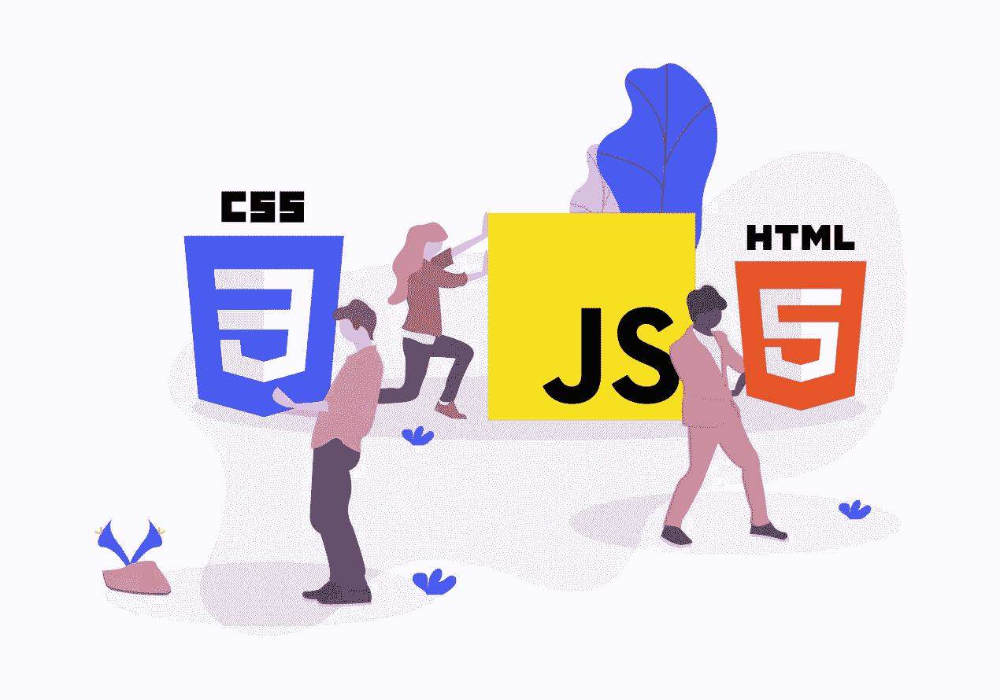
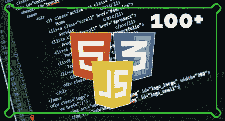
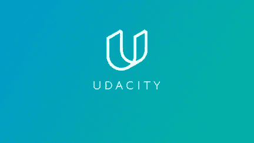

# 5 门最佳前端开发人员面试课程

> 原文：<https://medium.com/javarevisited/5-best-frontend-developer-interview-courses-b9c0809efbf3?source=collection_archive---------2----------------------->

## 2022 年准备前端开发者面试有最好的在线课程。它包括关于 HTML，CSS，JavaScript，Bootstrap，React 等的问题。

你好，伙计们，如果你正在准备一个前端开发人员面试，并寻找最好的面试准备资源，如在线课程，书籍和教程，那么你来对地方了。

前面我已经分享过 [**最佳编码面试准备课程**](https://javarevisited.blogspot.com/2018/02/10-courses-to-prepare-for-programming-job-interviews.html)**和[书籍](https://javarevisited.blogspot.com/2016/06/top-5-books-for-programming-coding-interviews-best.html#axzz5YWji1wWP)，在这篇文章里，我要分享的是最佳前端开发者面试课程。Web 开发一般分为两部分——前端(客户端)开发和后端(服务器端)开发。一个 web 开发者既可以是前端开发的高手，也可以是后端开发的高手。**

**前端开发和后端开发的结合称为全栈开发。所有这三种类型的发展在就业市场上都有巨大的需求。**

**如今，从事 web 工作的 IT 公司总是在寻找专门从事前端开发的高质量 web 开发人员。前端开发由许多编程语言、脚本语言、web 框架和库组成。技术来来去去。**

**一个前端开发人员要了解 [HTML](https://www.java67.com/2020/08/5-best-online-courses-to-learn-html-5.html) 、 [CSS](https://javarevisited.blogspot.com/2020/09/top-5-css-cascading-style-sheet-courses-for-beginners.html#axzz6rtXMHF8g) 、 [JavaScript](https://javarevisited.blogspot.com/2018/06/top-10-courses-to-learn-javascript-in.html) 等强制性的前端技术，同时一个前端开发人员要熟悉最新的更新技术。**

**要破解一个前端面试，需要具备这样必备的语言和技术知识。在本文中，我们将列出前五门课程，帮助您准备前端面试。**

**顺便说一下，如果你正在寻找一个完整的课程来准备技术面试，没有比 Udemy 上 Andrei Negaoie 的 [**掌握编码面试:大技术(FAANG)面试**](https://click.linksynergy.com/deeplink?id=JVFxdTr9V80&mid=39197&murl=https%3A%2F%2Fwww.udemy.com%2Fcourse%2Fmaster-the-coding-interview-big-tech-faang-interviews%2F) 课程更好的资源了。这是编写采访代码的绝佳资源。**

**<https://academy.zerotomastery.io/a/aff_rml6679s/external?affcode=441520_zytgk2dn>  

# 2022 年 5 门最佳前端开发者面试课程

下面是我列出的最好的在线课程，你可以参加这些课程来准备参加开发者面试。这些课程是从像 [Udemy](https://javarevisited.blogspot.com/2020/05/top-10-udemy-courses-to-learn-python-programming.html) 、 [Educative](https://javarevisited.blogspot.com/2020/05/top-10-educative-courses-for-programmers.html) 、Udacity 等网站策划的，它们涵盖了所有面试所需的基本前端技术和概念，如 HTML、CSS、JavaScript 以及现代网页设计和网页开发概念。它们也非常实惠，而且大多数都是最新的，可以为您提供 2022 年最好的前端面试准备。

## 1. [100 个前端面试问题挑战](https://click.linksynergy.com/deeplink?id=JVFxdTr9V80&mid=39197&murl=https%3A%2F%2Fwww.udemy.com%2Fcourse%2F100-front-end-interview-questions-challenge%2F)

这是 Udemy 最畅销的课程之一，为前端面试做准备。本课程涵盖了与 JavaScript、异步 JavaScript、HTML、CSS 等相关的重要概念。没有多少课程完全专注于前端面试准备，但这是其中之一，也是一个很好的课程。

它包含 100 个与重要前端技术相关的实际问题，如 HTML、CSS、JavaScript 和其他前端开发概念。此外，它也有关于面试技巧的问题。

要求
推荐前端基础知识。

该课程将近十个小时，包括准备内容和实际问题。谈到社交证明，超过 1800 名开发人员参加了这个课程，为前端面试做准备，它的平均评分为 4.5，这很棒。

**这里是加入本课程的链接**——[100 个前端面试问题挑战](https://click.linksynergy.com/deeplink?id=JVFxdTr9V80&mid=39197&murl=https%3A%2F%2Fwww.udemy.com%2Fcourse%2F100-front-end-interview-questions-challenge%2F)

**

## **2.[王牌前端面试](https://www.educative.io/path/ace-front-end-interview?affiliate_id=5073518643380224)【教育性】**

**基于本文的教育资源是准备前端面试的最佳课程和资源。也是前端开发者面试准备最全面的资源之一。它包含五个子课程，几乎涵盖了每一个强制性的前端概念。**

**这些子课程是**

*   **“用于前端和面试的 HTML”，**
*   **《JavaScript 面试手册:100+面试问题》，**
*   **“编码采访的 JavaScript 设计模式”，**
*   **“前端面试的 CSS”，以及**
*   **“用 JavaScript 编码采访的数据结构”。**

**它们涵盖了几乎所有你作为前端开发人员需要了解的概念和技术，HTML、Javascript、CSS、编码、模式，甚至是后端和全栈面试最需要的数据结构和算法。**

**要求
精通 HTML、CSS 和 JavaScript。**

**所有这些课程都有准备材料和练习题。你可以从这些分课程中选择，也可以购买整套课程。这些课程大多是长中级的。**

****这是参加本课程的链接** — [参加前端面试](https://www.educative.io/path/ace-front-end-interview?affiliate_id=5073518643380224)**

****

**你既可以单独购买这些课程，也可以每月花 14.9 美元订阅<https://javarevisited.blogspot.com/2021/10/top-5-courses-to-prepare-for-frontend>**教育课程，以获取他们所有 250 多门基于文本的在线互动课程。它们确实是准备编码和开发面试的最佳场所，我强烈推荐给任何准备技术面试的人。****

****<https://www.educative.io/subscription?affiliate_id=5073518643380224> **** 

## ****3.[前端面试准备— Udacity](https://imp.i115008.net/c/3294490/786224/11298?u=https%3A%2F%2Fwww.udacity.com%2Fcourse%2Ffront-end-interview-prep--ud250)****

****这是准备前端开发人员面试的另一个很好的课程。这门课程的 USP 是免费的，在 Udacity 是专门为那些想测试他们的前端准备的人创建的。在本课程中，您将经历由前端专家设计的模拟面试。****

****本课程还解释了前端面试中常见的重要和关键概念。****

****要求****

*   ****HTML、CSS 和 JavaScript 知识。****
*   ****前端开发知识。****

****最重要的是，它是 Udacity 的免费课程，而且是中级课程。如果你是一个有 1 到 2 年经验的前端开发人员，正在寻找下一份工作，那么这个课程就是为你准备的。我强烈建议你检查一下本课程中给出的概念和问题。****

******这里是参加本课程的链接** — [前端面试准备— Udacity](https://imp.i115008.net/c/3294490/786224/11298?u=https%3A%2F%2Fwww.udacity.com%2Fcourse%2Ffront-end-interview-prep--ud250)****

********

## ****4.[破解前端面试——提问&回答](https://click.linksynergy.com/deeplink?id=CuIbQrBnhiw&mid=39197&murl=https%3A%2F%2Fwww.udemy.com%2Fcourse%2Fcrackthefrontendinterview%2F)【Udemy】****

****这是 udemy 的一门新课程，是为那些想要突破前端面试的人而开设的。本课程中提供的准备材料已根据最新内容进行了更新。****

****本课程包含一些关于前端技术的材料，如 HTML5、CSS3、Bootstrap、Flexbox、JavaScript、React、Redux 和 Angular。此外，它有两百个前端问题和答案，以及近四十五分钟的前端练习测试。****

****要求****

*   ****HTML、CSS 和 JavaScript 知识。****
*   ****React、Redux 和 Angular 的知识。****

****这是一个简短的课程，总视频内容为一个半小时。我喜欢这种简短扼要的面试准备课程，因为你可以在更短的时间内了解最重要的事情。它有助于修改，尤其是对 2 到 3 年的前端开发人员面试经验非常重要。****

******以下是加入本课程的链接—** [破解前端面试—问题&答案](https://click.linksynergy.com/deeplink?id=CuIbQrBnhiw&mid=39197&murl=https%3A%2F%2Fwww.udemy.com%2Fcourse%2Fcrackthefrontendinterview%2F)****

********

## ****5. [JavaScript —马拉松面试问题系列](https://click.linksynergy.com/deeplink?id=JVFxdTr9V80&mid=39197&murl=https%3A%2F%2Fwww.udemy.com%2Fcourse%2Fjavascript-marathon-interview-questions-series%2F)****

****这又是一门牛逼的 Udmey 课程，为前端开发者面试做准备。它完全专注于 JavaScript，这是 2022 年任何前端开发人员或 Fulstack 开发人员最重要的技能之一。****

****JavaScript 是前端面试最重要的部分。面试官非常关注 JavaScript。udemy 的这门课是 JavaScript 面试的演练。它包含了常见的 JavaScript 面试问题。****

****本课程涵盖了基本的 JavaScirpt 主题，如:****

*   ****JavaScript 语言特性****
*   ****数组和关键方法，如 map、foreach、async 等****
*   ****面向对象的 javascript****
*   ****DOM & Web，****
*   ****异步 Javascript****
*   ****和自动化测试。****

****你需要的只是一点 JavaScript 知识，然后你就可以为你的前端面试做好准备了。谈到社会证明，这门课程是评分最高和最畅销的 Udemy 课程，平均评分为 4.8。已经有 2000 多人参加了这个课程。****

****以下是加入本课程的链接— [JavaScript —马拉松面试问题系列](https://click.linksynergy.com/deeplink?id=JVFxdTr9V80&mid=39197&murl=https%3A%2F%2Fwww.udemy.com%2Fcourse%2Fjavascript-marathon-interview-questions-series%2F)****

********

****以上就是**为 2022 年**前端面试准备的最好的网络课程。如果你的概念不清晰，很难破解一个前端面试。前端最重要的部分是 JavaScript，然后是 HTML 和 CSS，以及 web 框架和库等其他技术。在这篇文章中，我们列出了前五门课程，这将有助于你准备前端面试。有些课程是付费的，而有些是免费的。****

****你可能喜欢的其他**编程和采访文章******

*   ****[面向 Java 和 Web 开发人员的 5 个节点 JS 课程](http://javarevisited.blogspot.sg/2018/01/top-5-nodejs-and-express-js-online-courses-for-web-developers.html)****
*   ****[学习数据结构和算法的前 5 门课程](https://javarevisited.blogspot.com/2018/11/top-5-data-structures-and-algorithm-online-courses.html)****
*   ****[学习面试系统设计的前 5 门课程](https://www.java67.com/2019/09/top-5-courses-to-learn-system-design.html)****
*   ****[学习编码面试动态编程的前 5 门课程](https://javarevisited.blogspot.com/2019/12/top-5-courses-to-learn-dynamic-programming-for-interivews.html)****
*   ****[面向 Java 开发者的 5 门免费 Spring 框架课程](http://www.java67.com/2017/11/top-5-free-core-spring-mvc-courses-learn-online.html)****
*   ****[学习 Learn Shell 脚本的 5 门课程](http://javarevisited.blogspot.sg/2018/02/5-courses-to-learn-shell-scripting-in-linux.html)****
*   ****[5 门免费学习核心 Java 的在线课程](http://javarevisited.blogspot.sg/2017/11/top-5-free-java-courses-for-beginners.html#axzz4zuIICRs9)****
*   ****[5 门免费学习棱角的在线培训课程](http://www.java67.com/2018/01/top-5-free-angular-js-online-courses-for-web-developers.html)****
*   ****[学习大数据和 Apache Spark 的 5 门课程](http://javarevisited.blogspot.com/2017/12/top-5-courses-to-learn-big-data-and.html)****
*   ****[5 门学习数据结构和算法的免费课程](http://javarevisited.blogspot.sg/2018/01/top-5-free-data-structure-and-algorithm-courses-java--c-programmers.html#axzz55lOcYrUM)****
*   ****[Java 开发者学习 Android 的 5 门课程](http://javarevisited.blogspot.sg/2017/12/top-5-android-online-training-courses-for-Java-developers.html)****
*   ****[学习 Git 和 Github 的 5 门免费课程](http://javarevisited.blogspot.sg/2018/01/5-free-git-courses-for-programmers-to-learn-online.html#axzz568Oo1Jao)****
*   ****[Java 开发人员学习 Kotlin 编程的 5 门课程](http://javarevisited.blogspot.sg/2018/02/5-courses-to-learn-kotlin-programming-java-android.html#axzz56R4AatoQ)****
*   ****[100+编码难题破解你的编码面试](https://codeburst.io/100-coding-interview-questions-for-programmers-b1cf74885fb7)****

****感谢您阅读本文。如果你喜欢这些*最好的在线课程来为前端开发人员的工作面试做好准备*，那么请与你的朋友和同事分享它们。如果您有任何问题或反馈，请留言。****

******p . s .**——如果你正在准备一个全栈开发者面试，那么你也需要准备后端问题，这些问题主要集中在硬代码编码、数据结构和算法，以及设计模式和编码实践上。如果你需要资源，我强烈推荐你去参加 Udemy 上 Andrei Negaoie 的 [**掌握编码面试:大科技(FAANG)面试**](https://click.linksynergy.com/deeplink?id=JVFxdTr9V80&mid=39197&murl=https%3A%2F%2Fwww.udemy.com%2Fcourse%2Fmaster-the-coding-interview-big-tech-faang-interviews%2F) 课程。这是编写采访代码的绝佳资源。****

****<https://academy.zerotomastery.io/a/aff_rml6679s/external?affcode=441520_zytgk2dn> ****