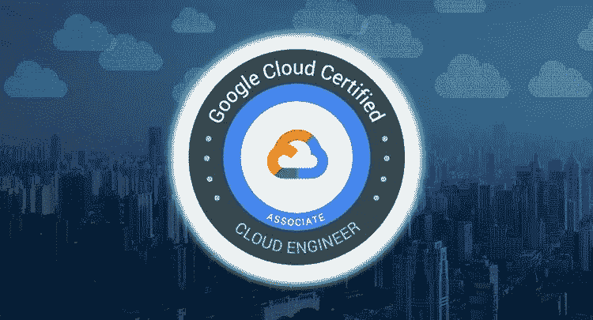
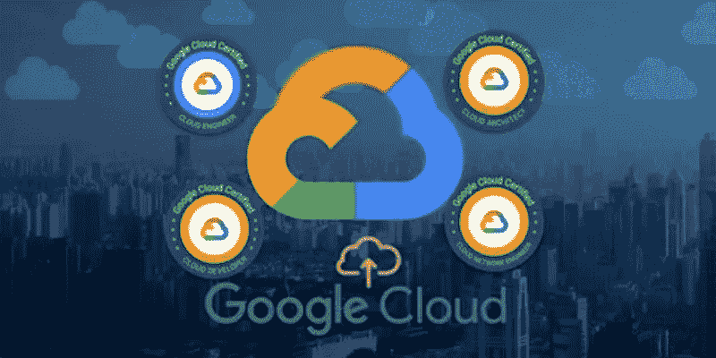
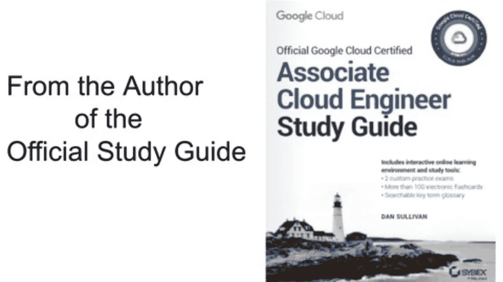
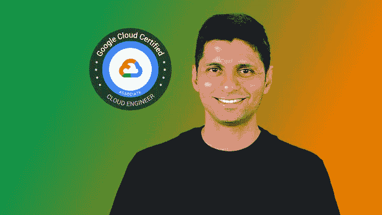
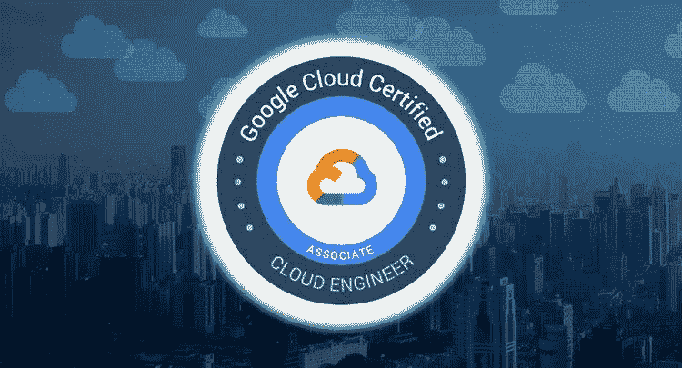

# 2023 年 10 门最佳谷歌云平台(GCP)助理云工程师认证考试课程

> 原文：<https://medium.com/javarevisited/5-best-gcp-associate-cloud-engineer-certification-courses-in-2021-c93d7e35228a?source=collection_archive---------0----------------------->

## 以上是 2023 年破解谷歌云平台协理云工程师认证的最佳在线课程

你好，伙计们，如果你想在 2023 年从事谷歌云工程师的职业，或者只是想获得一个云证书，为你丰富多彩的简历锦上添花，那么参加**谷歌云工程师考试**可能对你来说是正确的事情。

谷歌云平台或 GCP 是三大公共云提供商之一，另外两个是 [AWS](https://javarevisited.blogspot.com/2020/05/top-5-amazon-web-services-aws-courses-for-beginners-and-experienced-programmers.html) 和[微软 Azure](https://javarevisited.blogspot.com/2020/04/how-to-crack-microsoft-azure-fundamentals-certification-az-900-exam.html) ，由于越来越多的人采用谷歌云平台，对认证谷歌云专业人员的需求呈指数级增长。

如果你已经有相当多的经验，那么你可能想参加专业云考试。但是，如果你是一个新手，或者希望添加更多的认证来增加你的简历，那么云工程师助理考试是一条路要走。

该考试测试您设置云解决方案、规划、配置、部署和实施云解决方案的能力。它还检查配置访问和安全性的能力，确保使用谷歌云平台服务和技术的云解决方案的成功运行。谷歌云工程师考试持续两个小时，有日语、西班牙语、印度尼西亚语和英语四种版本。注册费约为 125 美元，可以远程参加，也可以亲自到考试中心参加。

除了查看考试大纲和[考试指南](https://cloud.google.com/certification/guides/cloud-engineer)关于 Google Cloud Engineering，你还应该加入在线培训课程，在考试前做好充分准备。最好有六个月以上的背景知识和实践经验，但这是可选的，并不是考试的真正要求。

如果你没有使用谷歌云的实践经验，你仍然可以参加这些课程，并在他们的动手实验室中练习。 [**Coursera 和谷歌云的 GCP 培训课程**](https://coursera.pxf.io/c/3294490/1164545/14726?u=https%3A%2F%2Fwww.coursera.org%2Fprofessional-certificates%2Fcloud-engineering-gcp) (此列表中的第三个课程)与 Quiklabs 合作在谷歌云上练习，它就像在现实世界中工作一样。谷歌甚至有谷歌云免费层的几个产品供每月使用。

 [## 准备谷歌云认证:云工程师

### 我们帮助数以百万计的组织提高员工的能力，服务他们的客户，并为他们的…

coursera.pxf.io](https://coursera.pxf.io/c/3294490/1164545/14726?u=https%3A%2F%2Fwww.coursera.org%2Fprofessional-certificates%2Fcloud-engineering-gcp) 

# 2023 年破解谷歌云专业协理云工程师考试的 10 门在线课程

在不浪费你更多时间的情况下，这里是你可以参加的最好的课程，为 Google Cloud Professional Associate Cloud Engineer 认证考试做好准备。这些课程将帮助你更好地准备不同的主题，并牢记考试模式。

## 1.[终极谷歌认证助理云工程师 2023](https://click.linksynergy.com/deeplink?id=JVFxdTr9V80&mid=39197&murl=https%3A%2F%2Fwww.udemy.com%2Fcourse%2Fgoogle-cloud-associate-cloud-engineer-certification%2F)

这是在 Udemy 上准备 Google Cloud 协理工程师认证最好的课程之一。这门课程有近 60，000 名学生注册，评分为 4.2 分(满分为 5.0 分)，成功率令人印象深刻。它通过学习云和谷歌云平台的基础知识，为学生获得云工程师认证做准备。

由于本课程只涵盖了协理云工程师考试，所以大部分环节都是偏重于理论，实践应用较少。

尽管大多数用户对这门课程感到满意，但一些学生评论说，大部分内容都是重复的，使得它比最初看起来更庞大。然而，大多数人的正面评价多于负面评价，所以我们觉得这个课程值得一试。

**以下是加入本在线课程**—[2023 年谷歌认证云工程师助理终极课程](https://click.linksynergy.com/deeplink?id=JVFxdTr9V80&mid=39197&murl=https%3A%2F%2Fwww.udemy.com%2Fcourse%2Fgoogle-cloud-associate-cloud-engineer-certification%2F)的链接

## 2.[谷歌助理云工程师:获得丹·沙利文颁发的 2023 年认证](https://click.linksynergy.com/deeplink?id=JVFxdTr9V80&mid=39197&murl=https%3A%2F%2Fwww.udemy.com%2Fcourse%2Fgoogle-certified-associate-cloud-engineer-2019-prep-course%2F)

这是谷歌云助理工程师认证的又一个牛逼的 Udemy 课程。这门课程最棒的一点是，它是由丹·沙利文准备的，他是谷歌官方认证指南的作者。

本课程旨在通过介绍考试中涵盖的所有主要 GCP 服务来帮助您准备 Google 协理云工程师考试，包括计算引擎、应用引擎、Kubernetes 引擎、云函数、云 SQL、BigQuery、Bigtable、VPCs、VPN、Stackdriver 等。

在本课程中，您将学习如何:

*   如何使用云控制台和命令行在计算引擎中创建和配置虚拟机实例
*   如何使用身份和访问管理(IAM)，这是考试的一个重要部分
*   如何培养在计算、存储和网络选项中进行选择的决策技能
*   熟悉考试的结构以及如何准备考试，包括其他学习资源的提示
*   通过了解如何监控云中的应用程序，提高您的系统管理和开发运维技能

谷歌助理云工程师考试时长两小时，包含 50 道选择题和多项选择题。本课程通过演示和讲座来确保您知道如何使用 GCP，并理解其关键设计和操作概念。

**这里是加入这个令人敬畏的课程的链接**——[谷歌助理云工程师:获得认证 2023](https://click.linksynergy.com/deeplink?id=JVFxdTr9V80&mid=39197&murl=https%3A%2F%2Fwww.udemy.com%2Fcourse%2Fgoogle-certified-associate-cloud-engineer-2019-prep-course%2F)

而且，如果你喜欢阅读书籍和学习指南，那么你也可以看看丹·沙利文在亚马逊写的 [**官方谷歌云认证助理云工程师学习指南**](https://www.amazon.com/Google-Cloud-Certified-Associate-Engineer/dp/1119564417?tag=javamysqlanta-20) 。

 [## 官方谷歌云认证助理云工程师学习指南

### 亚马逊网站:官方谷歌云认证助理云工程师学习指南(9781119564416):沙利文，丹:书籍

www.amazon.com](https://www.amazon.com/Google-Cloud-Certified-Associate-Engineer/dp/1119564417?tag=javamysqlanta-20) 

## 3.[拥有谷歌云专业证书的云工程](https://coursera.pxf.io/c/3294490/1164545/14726?u=https%3A%2F%2Fwww.coursera.org%2Fprofessional-certificates%2Fcloud-engineering-gcp)

该课程完全免费，已有超过 22，580 名学生注册。它提供了履行云工程角色和准备云工程师认证所需技能的课程。

它还讲授 Google 云平台提供的基础设施和平台服务，对云工程师助理认证的目的和意图及其与其他 Google 云认证的关系有一个基本和高级的理解。

**这里是加入谷歌云专业证书** e — [云工程](https://coursera.pxf.io/c/3294490/1164545/14726?u=https%3A%2F%2Fwww.coursera.org%2Fprofessional-certificates%2Fcloud-engineering-gcp)课程的链接

顺便说一下，如果你计划参加多个 Coursera 课程或专业，那么考虑参加 [**Coursera Plus 订阅**](https://coursera.pxf.io/c/3294490/1164545/14726?u=https%3A%2F%2Fwww.coursera.org%2Fcourseraplus) ，它将为你提供无限制的访问他们最受欢迎的课程、专业、专业证书和指导项目的机会。它每年花费大约 399 美元，但是它完全值得你的钱，因为你可以获得无限的证书。

 [## Coursera Plus |无限制访问 7，000 多门在线课程

### 用 Coursera Plus 投资你的职业目标。无限制访问 90%以上的课程、项目…

coursera.pxf.io](https://coursera.pxf.io/c/3294490/1164545/14726?u=https%3A%2F%2Fwww.coursera.org%2Fcourseraplus) 

## 4.[准备谷歌云助理云工程师考试](https://pluralsight.pxf.io/c/1193463/424552/7490?u=https%3A%2F%2Fwww.pluralsight.com%2Fcourses%2Fpreparing-google-cloud-associate-cloud-engineer-exam)

这门课程与其他课程相比最令人惊讶的地方在于它是由谷歌云提供的。这意味着学生将获得一点点足够通过考试的材料。

本课程大约需要 7 天时间，指导学生熟悉考试的结构和形式，以及它与其他 [Google Cloud 认证](https://javarevisited.blogspot.com/2019/07/top-5-google-cloud-platform-gcp-courses-certifications-online.html)的关系。

这个课程会让你成为一个更好的谷歌云工程师，尤其是如果你是第一次，而且之前没有经验的话。然而，学生仍然需要额外的材料和学习计划来通过考试。幸运的是，这门课程提供了这些材料和平台。

**以下是参加 GCP 课程的链接**——[准备谷歌云助理云工程师考试](https://pluralsight.pxf.io/c/1193463/424552/7490?u=https%3A%2F%2Fwww.pluralsight.com%2Fcourses%2Fpreparing-google-cloud-associate-cloud-engineer-exam)

顺便说一句，你需要一个 [Pluralsight 会员](/javarevisited/pluralsight-or-udemy-d9a94d2e8ee)才能进入这个课程，这个课程的费用大约是每月 29 美元或每年 299 美元(14%的折扣)，但是可以进入他们 5000 多个关于各种云认证、软件开发、编码和其他技术主题的在线课程。

我强烈建议程序员拥有 Pluralsight 会员资格，因为作为一名程序员和 IT 专业人士，你需要不断地学习和更新自己。即使你没有 Pluralsight 会员资格，你也可以查看他们的 [**10 天免费试用**](https://pluralsight.pxf.io/c/1193463/424552/7490?u=https%3A%2F%2Fwww.pluralsight.com%2Flearn) 来免费访问这个课程。

 [## 个人技术技能|多视角

### 借助 Pluralsight，在开发运维、机器学习、云、安全基础设施等领域构建所需技能…

pluralsight.pxf.io](https://pluralsight.pxf.io/c/1193463/424552/7490?u=https%3A%2F%2Fwww.pluralsight.com%2Flearn) 

## 5. [GCP 助理云工程师——谷歌云认证](https://click.linksynergy.com/deeplink?id=JVFxdTr9V80&mid=39197&murl=https%3A%2F%2Fwww.udemy.com%2Fcourse%2Fgoogle-cloud-certification-associate-cloud-engineer%2F)

除了成为 Udemy 上最畅销的课程之一，并保证 30 天退款外，该课程还提供了谷歌云平台(GCP)的实践体验，旨在帮助学生通过 ACE 考试，成为谷歌认证的助理云工程师。

该课程由 28 分钟创建，注册学生约 41289 人，学习该课程不需要任何背景知识。

它还将为你提供学习基于谷歌云平台的其他技能所需的所有基础知识。所以如果你想拓展你的技能，那么这个课程就是为你准备的。

该课程也是互动和积极的，所以你必须愿意投入和学习。如果你很忙，不能完全提交，那么你可能想跳过这一步。

**这里是加入谷歌云课程的链接**——[GCP 助理云工程师——谷歌云认证](https://click.linksynergy.com/deeplink?id=JVFxdTr9V80&mid=39197&murl=https%3A%2F%2Fwww.udemy.com%2Fcourse%2Fgoogle-cloud-certification-associate-cloud-engineer%2F)

## 6.[终极谷歌云认证:全包(4)](https://click.linksynergy.com/deeplink?id=JVFxdTr9V80&mid=39197&murl=https%3A%2F%2Fwww.udemy.com%2Fcourse%2Fgoogle-certified-architect-developer-engineer-data-devops%2F)

该课程结合了四种 Google 云认证，即助理云工程师、云架构师、云开发人员和网络工程师。它的评级为 4.2，注册学生约为 66，000 人。

它涵盖了从初级到高级的水平，但你不需要任何编程或编码经验来跟上。

然而，最需要记住的是，这门课程是紧张的。你可以选择谷歌云的所有四个方面，或者你可以直接选择谷歌云工程师。它从头开始课程，将帮助您了解谷歌云平台和认证。

**这里是参加 GCP 课程的链接**——[终极谷歌云认证:一切尽在其中](https://click.linksynergy.com/deeplink?id=JVFxdTr9V80&mid=39197&murl=https%3A%2F%2Fwww.udemy.com%2Fcourse%2Fgoogle-certified-architect-developer-engineer-data-devops%2F)

## 7.[破解谷歌云协理云工程师认证](https://www.educative.io/courses/google-cloud-assoc-certification?affiliate_id=5073518643380224)【教育性】

这是另一个很棒的互动课程，从 Educative(一个基于文本的互动在线学习门户网站)准备和学习谷歌云平台。

本课程不仅能帮助您磨练云计算技能，还能帮助您通过认证考试，脱颖而出。

即使你是一个 AWS 用户，考虑到它们的相似性，你也会发现这个课程很有价值并且很容易上手。本课程提供了通过云开发人员助理认证所需的所有主题和资源，因此您可以将它视为一份包含所有信息的备忘单。

您将了解 GCP 提供的许多服务，最后，您将参加一个有 50 个问题的限时模拟考试。这会给你在考试中获胜所需的信心。

**以下是加入本课程的链接—** [破解 Google Cloud 协理云工程师认证](https://www.educative.io/courses/google-cloud-assoc-certification?affiliate_id=5073518643380224)

而且，如果你发现教育平台和他们的互动课程在学习新技术或准备编码面试方面很有用，那么考虑购买 [**教育订阅**](https://www.educative.io/subscription?affiliate_id=5073518643380224) ，每月只需 14.9 美元就可以访问他们的 250 多门课程。非常划算，非常适合准备编码面试。

 [## 教育无限:保持领先

### 我们听到了您的反馈。你现在只需支付一次费用，就可以获得 Educative 上的所有课程。

www.educative.io](https://www.educative.io/subscription?affiliate_id=5073518643380224) 

## 8.[谷歌云助理云工程师实践考试](https://click.linksynergy.com/deeplink?id=JVFxdTr9V80&mid=39197&murl=https%3A%2F%2Fwww.udemy.com%2Fcourse%2Fgoogle-cloud-associate-cloud-engineer-practice-examspractice-exams%2F)

对于准备谷歌云助理云工程师考试的人来说，这是另一个很棒的资源。本模拟测试由 Dan Sullivan 准备，他编写了官方认证指南，也是本列表中第二门课程的作者。

Dan Sullivan 是云工程师、架构师和数据工程师考试的*官方学习指南*的作者，本模拟测试包含两个测试，共 50 个问题，以模拟真实的考试形式，您需要在 2 小时内解决 50 个问题。

你应该把这个模拟测试作为你最后准备的一部分，并提高你的速度和准确性。你也可以用这个来衡量你的准备水平，找到你的强项和弱项。

**以下是参加本次实践考试** — [谷歌云助理云工程师实践考试](https://click.linksynergy.com/deeplink?id=JVFxdTr9V80&mid=39197&murl=https%3A%2F%2Fwww.udemy.com%2Fcourse%2Fgoogle-cloud-associate-cloud-engineer-practice-examspractice-exams%2F)的链接

以上就是通过谷歌云平台助理云工程师认证考试的**最佳课程。这些课程涵盖了考试指南中给出的大多数考试主题，有助于学习 GCP 平台以及通过认证。无论你选择哪个选项，参加一个课程都可以帮助你学习一个新程序或者保持你的谷歌云技能。谷歌甚至有谷歌云免费层的几个产品供每月使用。**

云计算技术(如 GCP)已经成为大多数组织的基本要求，因为这些技术相对易于使用和维护，可以随着您的业务扩展，并且价格合理。

云工程也是一个非常热门的市场，几乎是每个行业的基础。为了成为一名云工程师，你必须在某些方面与众不同。这就是云认证的用武之地，通过谷歌云平台云工程师助理考试，你将在竞争中领先一步。

其他 **IT 和云认证文章**您可能喜欢:

*   [破解 AWS DevOps 工程师考试的前 5 门课程](https://javarevisited.blogspot.com/2020/04/top-5-course-to-crack-aws-certified-devops-engineer-professional-exam-certification.html)
*   [如何成为 DevOps 工程师？](https://hackernoon.com/the-2018-devops-roadmap-31588d8670cb?gi=8829080e6d7d)
*   [通过 AWS 认证开发人员考试的前 5 门课程](https://javarevisited.blogspot.com/2020/05/top-5-courses-to-crack-aws-certified-developer-associate-certification-exam.html)
*   [如何成为 Azure 认证管理员助理？](https://javarevisited.blogspot.com/2020/04/how-to-crack-microsoft-az-103-azure-administrator-associate-exam-certification.html)
*   [程序员前 5 名 AZ-900 模拟测试](https://javarevisited.blogspot.com/2020/02/top-5-AZ-900-exam-Azure-Fundamentals-certification-practice-tests-and-mock-exams-to.html)
*   [如何破解甲骨文 2023 年 Java 认证？](https://medium.freecodecamp.org/how-to-pass-oracles-java-certifications-a-practical-guide-for-developers-e9b607ba6173)
*   [Spring 专业认证值得吗？](https://javarevisited.blogspot.com/2017/07/does-spring-certification-help-in-job-and-career.html)
*   [破解 AWS 解决方案架构师专业考试的前 5 门课程](https://javarevisited.blogspot.com/2020/04/top-5-course-to-crack-aws-solution-architect-professional-sap-c01-certification-exam.html)
*   [如何通过 Spring Core Professional 5.0 认证](https://javarevisited.blogspot.com/2018/08/how-to-crack-spring-core-professional-certification-exam-java-latest.html)
*   [破解 Azure 云架构师(AZ-300)考试的前 5 门课程](https://javarevisited.blogspot.com/2019/07/top-5-courses-to-crack-azure-architecture-technologies-certification-az-300-exam.html#axzz6E6VuRMsx)
*   [OCAJP 和 OCPJP 考试 10 道免费样题](http://www.java67.com/2017/05/10-free-java-8-certification-sample-questions-OCAJP8-OCPJP8-Mock-Exams.html)
*   [如何破解 Azure Fundamentals (AZ-900)认证](https://javarevisited.blogspot.com/2020/04/how-to-crack-microsoft-azure-fundamentals-certification-az-900-exam.html)
*   [学习 Docker 和 Kubernetes 的十大课程](https://dev.to/javinpaul/top-10-courses-to-learn-docker-and-kubernetes-for-programmers-4lg0)
*   [如何通过 AZ-300 Azure 解决方案架构师考试？](https://javarevisited.blogspot.com/2020/04/how-to-crack-microsoft-azure-solution-architect-exam-az-300.html)
*   [通过谷歌助理云工程师认证的前 5 门课程](https://javarevisited.blogspot.com/2019/07/top-5-google-cloud-platform-gcp-courses-certifications-online.html)
*   [通过 AWS 云从业者认证的前 5 门课程](https://javarevisited.blogspot.com/2020/02/top-5-courses-to-crack-aws-certified-cloud-practitioner-exam-certification-clf-c01.html)

感谢您阅读本文。如果你觉得这些*最佳谷歌云助理云工程师认证课程*有用，那么请与你的朋友和同事分享。如果您有任何问题或反馈，请留言。

**附页** —除了学习这些 GCP 云工程师助理课程之外，您还可以查看考试指南或参加[**实践考试**](https://click.linksynergy.com/deeplink?id=JVFxdTr9V80&mid=39197&murl=https%3A%2F%2Fwww.udemy.com%2Fcourse%2Fgcp-ace-practice-tests-latest%2F) ，这将有助于您在准备过程中确定并关注主要领域。

 [## 谷歌认证助理云工程师实践测试

### 第一次通过云工程师助理考试，成为 GCP 谷歌认证云工程师助理…

udemy.com](https://click.linksynergy.com/deeplink?id=JVFxdTr9V80&mid=39197&murl=https%3A%2F%2Fwww.udemy.com%2Fcourse%2Fgcp-ace-practice-tests-latest%2F)