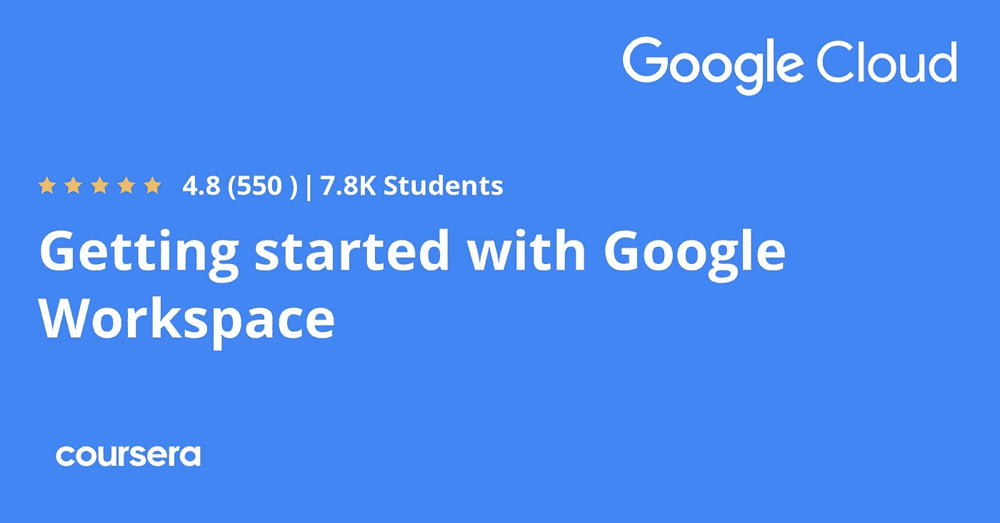
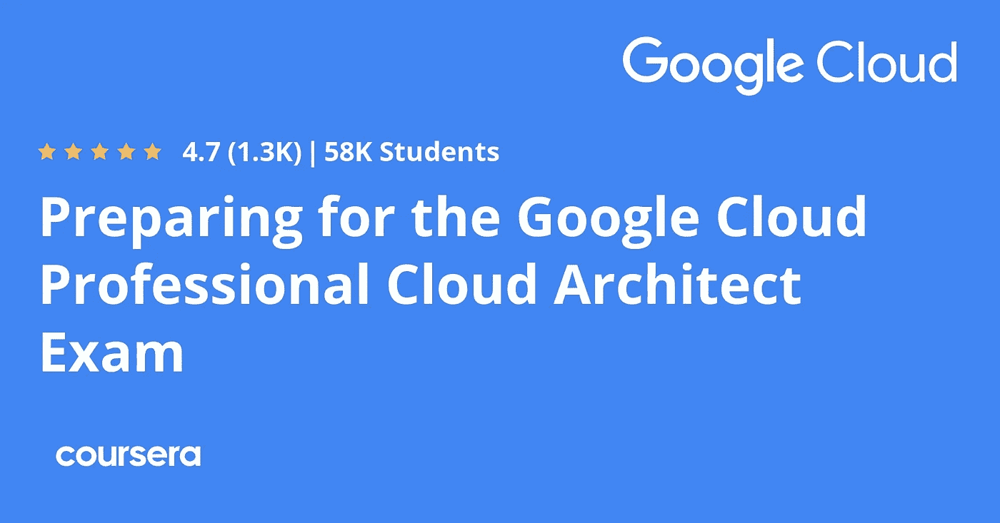

# 2023 年学习基本技术技能的十大谷歌认证

> 原文：<https://medium.com/javarevisited/5-best-google-certifications-and-coursers-to-learn-python-it-support-data-analytics-and-ui-86cb1ddfa2dd?source=collection_archive---------2----------------------->

## 这些是最好的谷歌课程，用于学习必要的技术技能，如 Python、数据科学、云计算和 Coursera 上的 2023 年 UI 设计。

Coursera 上的最佳谷歌认证和 Coursera

伙计们，如果你想在 IT 和技术领域开始你的职业生涯，特别是热门和热门的数据分析、UI 和 UX 设计、IT 支持、项目管理领域，或者你想学习热门的技术技能，如 Python、云计算、Google Sheets 等，并寻找可靠的资源，那么没有比谷歌自己创建的课程和认证更好的资源了。

你不需要加入谷歌就可以访问它们，它们很容易在 Coursera 上找到，这是一个受欢迎的在线学习平台，它带来了来自世界各地世界级最好的大学和公司的培训材料。

前面我已经分享了[最佳云计算](/javarevisited/10-best-aws-google-cloud-and-azure-courses-and-certification-from-coursera-to-join-in-2021-5c5e2029a8e7)、[最佳软件开发](/javarevisited/10-best-software-development-courses-certifications-from-coursera-4ccc59aae201)、[最佳 web 开发](/javarevisited/10-best-coursera-courses-for-web-development-and-web-design-9ec54ed92dd9)、[、**最佳数据分析 Coursera 课程**、](https://javarevisited.blogspot.com/2020/08/top-10-coursera-certifications-to-learn-Data-Science-Visualization-and-Data-Analysis.html)、[、**项目**、](https://javarevisited.blogspot.com/2020/08/top-10-coursera-projects-to-learn-essential-programming-skills.html)，在这篇文章中，我将分享 Coursera 的最佳 Google 认证。

这些是来自 Coursera 的*最有名的、*最受欢迎的、和*最受欢迎的专业证书*，原因很多，但谷歌的名字和名声是最重要的。

不管怎样，**人们盲目地相信任何与 Google** 相关的东西，这也是为什么这些认证在新手和想要转行的有经验的开发者中非常受欢迎的原因。这就是谷歌的力量。

许多人希望学习新的信息技术、数据分析、机器学习、python 和许多其他领域，但他们不知道从哪里以及如何开始。像 YouTube 和 Udemy 这样的平台有时会是一个很好的开始选择。

尽管如此，向有经验的专业人士学习会更好，因为许多爱好创造并分享他们的知识。通过 [Coursera 平台](https://coursera.pxf.io/c/3294490/1164545/14726?u=https%3A%2F%2Fwww.coursera.org%2F)学习信息技术最好的公司之一是谷歌，因为它有许多与编程、数据分析和机器学习相关的不同课程。

<https://coursera.pxf.io/c/3294490/1164545/14726?u=https%3A%2F%2Fwww.coursera.org%2F>  

# 2023 年学习 Python、IT 支持、数据分析和 UI 设计的 10 个最佳谷歌课程和认证

以下是 Coursera 提供的最佳谷歌认证列表，你可以加入这些认证，学习数据分析、IT 支持、Python、UI 和 UX 设计、项目管理、工作空间等热门技能，甚至还可以参加一项专业课程，为久负盛名的谷歌云专业架构师考试做准备。

我只包括了 5 个最好的认证，但 Coursera 上有超过 20 个这样的课程。

## 1.[谷歌数据分析专业证书](https://coursera.pxf.io/c/3294490/1164545/14726?u=https%3A%2F%2Fwww.coursera.org%2Fprofessional-certificates%2Fgoogle-data-analytics)

数据分析通过清理、转换和分析数据来处理数据，以提取有价值的信息用于决策。Coursera 学习数据分析最好的课程之一是**谷歌数据分析专业证书**。

Google 提供的这个专业证书有超过 446k 的注册人数。他们承诺，加入他们的项目后，你将在短短六个月内为数据分析工作做好准备，不需要任何经验。

您将了解数据分析师的工作方式以及用于数据分析的工具。了解不同的数据类型，以及如何使用 SQL 语言，创建数据可视化，并使用 R 语言分析数据。

**以下是加入本次谷歌认证的链接—** [谷歌数据分析专业证书](https://coursera.pxf.io/c/3294490/1164545/14726?u=https%3A%2F%2Fwww.coursera.org%2Fprofessional-certificates%2Fgoogle-data-analytics)

## 2.[谷歌 IT 自动化与 Python 专业证书](https://coursera.pxf.io/c/3294490/1164545/14726?u=https%3A%2F%2Fwww.coursera.org%2Fprofessional-certificates%2Fgoogle-it-automation)

如果你想学习一门几乎在任何行业都使用的编程语言，我推荐你学习 python。这种编程语言用于数据科学、机器学习、人工智能。本课程， [***Google IT 自动化搭配 Python***](https://coursera.pxf.io/c/3294490/1164545/14726?u=https%3A%2F%2Fwww.coursera.org%2Fprofessional-certificates%2Fgoogle-it-automation) 很推荐开始学习 Python。

该专业证书将帮助您学习 python 语言以及如何使用它来自动化您的日常任务，这在某些情况下可能非常有帮助。你也会发现这种语言的力量和能力。

您将从学习 python 语言的速成课程开始，然后使用它与您的操作系统进行交互。然后您将学习如何使用 Git & Github 以及一些调试技术。最后，学习如何将 python 自动化用于云和现实世界的任务。

**以下是在 Coursera 上加入谷歌认证的链接—** [谷歌 IT 自动化与 Python 专业证书](https://coursera.pxf.io/c/3294490/1164545/14726?u=https%3A%2F%2Fwww.coursera.org%2Fprofessional-certificates%2Fgoogle-it-automation)

## 3.[谷歌 IT 支持专业证书](https://coursera.pxf.io/c/3294490/1164545/14726?u=https%3A%2F%2Fwww.coursera.org%2Fprofessional-certificates%2Fgoogle-it-support)

信息技术在我们的日常生活中无处不在，从我们的电话到火箭，人们认为通过使用计算机理解简单的事情，他们就是专家。你可以从这个叫**谷歌 IT 支持专业证书**的课程中学到。

这个专业证书将帮助你学习它，并在几个月内成为这个行业的专家。也许在一家公司有一份工作，因为所有的企业都要求人们至少具备基本的 IT 知识。

您将开始学习 IT 支持专家的角色，以及计算机如何在二进制等底层工作。然后转到学习计算机网络和协议，学习 Linux、Windows、macOS 等操作系统，学习系统管理。

**以下是在 Coursera 上加入谷歌认证的链接—** [谷歌 IT 支持专业证书](https://coursera.pxf.io/c/3294490/1164545/14726?u=https%3A%2F%2Fwww.coursera.org%2Fprofessional-certificates%2Fgoogle-it-support)

## 4.[谷歌工作空间专业化入门](https://coursera.pxf.io/c/3294490/1164545/14726?u=https%3A%2F%2Fwww.coursera.org%2Fspecializations%2Fgetting-started-with-google-workspace)

人们认为谷歌的大部分收入来自其搜索引擎上的广告，但谷歌有超过 270 种产品，从这些产品中产生了数十亿美元。这篇**谷歌工作空间专业化入门**将帮助你学习其中的一些。

当你学习它们时，这种专业化将帮助你更有效率，甚至大多数公司都使用它们来经营他们的业务，所以没有比这更好的时间开始学习这门评级为 4.8 星的课程了。

你将开始学习如何使用 Gmail 和它的一些大多数人不知道的选项。然后学习如何使用谷歌日历安排会议，并使用谷歌驱动器存储您的文件。你也可以使用谷歌工作表来编辑电子表格和许多其他服务。

**以下是加入谷歌认证的链接—** [谷歌工作空间专业化入门](https://coursera.pxf.io/c/3294490/1164545/14726?u=https%3A%2F%2Fwww.coursera.org%2Fspecializations%2Fgetting-started-with-google-workspace)

## 5.[准备谷歌云架构师认证](https://coursera.pxf.io/c/3294490/1164545/14726?u=https%3A%2F%2Fwww.coursera.org%2Fprofessional-certificates%2Fcloud-engineering-gcp)

谷歌云是一项服务，它为你提供电脑，你可以用它来在线管理你的产品和服务，苹果等许多公司和数百万人用它来存储他们的网站。这个**准备谷歌云认证**会帮你学会怎么用。

这个专业证书将帮助你在几个月后找到工作，开始谷歌云工程师的职业生涯。这门课程有近 19k 的注册人数，有 4.8 个相当不错的明星。

首先，您将学习谷歌云的基础知识，并使用不同的可用服务，如谷歌应用引擎和谷歌云存储。然后学习如何通过控制台和 shell 使用 Google Cloud 并在云和 Google Kubernetes 引擎上部署一个实用的解决方案。

**这里是加入本次谷歌认证的链接-** [准备谷歌云认证](https://coursera.pxf.io/c/3294490/1164545/14726?u=https%3A%2F%2Fwww.coursera.org%2Fprofessional-certificates%2Fcloud-engineering-gcp)

Coursera 上最佳谷歌云计算课程

除了这些，你还可以在 Coursera 上获得一些更有趣、更受欢迎的谷歌专业认证，我在这里没有详细介绍，但它们绝对值得一提，它们是:

以下是其中的佼佼者。

[谷歌项目管理:专业证书](https://coursera.pxf.io/c/3294490/1164545/14726?u=https%3A%2F%2Fwww.coursera.org%2Fprofessional-certificates%2Fgoogle-project-management)【报名人数 332 万】

<https://coursera.pxf.io/c/3294490/1164545/14726?u=https%3A%2F%2Fwww.coursera.org%2Fprofessional-certificates%2Fgoogle-project-management>  

[谷歌 UX 设计专业证书](https://coursera.pxf.io/c/3294490/1164545/14726?u=https%3A%2F%2Fwww.coursera.org%2Fprofessional-certificates%2Fgoogle-ux-design)【27 万学生】

<https://coursera.pxf.io/c/3294490/1164545/14726?u=https%3A%2F%2Fwww.coursera.org%2Fprofessional-certificates%2Fgoogle-ux-design>  

[谷歌数字营销&电子商务专业证书](https://coursera.pxf.io/c/3294490/1164545/14726?u=https%3A%2F%2Fwww.coursera.org%2Fprofessional-certificates%2Fgoogle-digital-marketing-ecommerce)

<https://coursera.pxf.io/c/3294490/1164545/14726?u=https%3A%2F%2Fwww.coursera.org%2Fprofessional-certificates%2Fgoogle-digital-marketing-ecommerce>  

这就是你可以在 Coursera 上学习热门技术技能的所有谷歌最佳课程和认证，比如 Python、云计算、项目管理、IT 支持 UI 和 UX 设计等等。Coursera 有许多大学和公司创建课程并免费发布。

尽管如此，你还是需要付费才能拿到证书。但这些课程只是从 Coursera 上的谷歌课程中了解 IT 行业的最佳课程的一瞥。

顺便说一下，除了单独加入这些课程和专业，你还可以加入 [**Coursera Plus**](https://coursera.pxf.io/c/3294490/1164545/14726?u=https%3A%2F%2Fwww.coursera.org%2Fcourseraplus) ，这是 Coursera 的一个订阅计划，让你可以无限制地访问他们最受欢迎的课程、专业、专业证书和指导项目。

<https://coursera.pxf.io/c/3294490/1164545/14726?u=https%3A%2F%2Fwww.coursera.org%2Fcourseraplus>  

它每年花费约 399 美元，但可以访问 Coursera 上的 7000 多门顶级课程和认证，这使它成为一项值得的投资。在有限的时间内，你还可以花 299 美元购买 Coursera Plus，因为他们现在提供 Coursera Plus 的[**【100 美元】折扣，点击那个链接可以获得你的折扣。**](https://bit.ly/3d3ftiq)

你可能喜欢的其他 **Coursera 和编程文章**

*   [学习云计算的 10 门最佳 Coursera 课程](https://javarevisited.blogspot.com/2020/08/top-10-coursera-certifications-to-learn-cloud-computing-aws.html#axzz6WK1yC5WW)
*   [Coursera Plus Review——在 Coursera 上学习的更好方式](https://javarevisited.blogspot.com/2020/08/coursera-plus-better-way-to-take-coursera-courses-specilizations-certification.html)
*   [学习 Web 开发的十大 Coursera 课程](https://javarevisited.blogspot.com/2020/08/top-10-coursera-certifications-to-learn-web-development.html)
*   [2023 年程序员十大课程](https://javarevisited.blogspot.com/2020/08/top-10-coursera-courses-specilizations-and-certifications.html)
*   [你可以在 Coursera Online 上获得 5 个数据科学学位](https://www.java67.com/2020/06/top-5-data-science-degree-you-can-earn-online-coursera-edx.html)
*   [面向程序员和开发人员的 Coursera 十大项目](https://javarevisited.blogspot.com/2020/08/top-10-coursera-projects-to-learn-essential-programming-skills.html)
*   [你可以在 Coursera 上在线申请的前 5 个计算机科学学位](https://javarevisited.blogspot.com/2020/04/is-it-possible-to-get-master-of-computer-science-degree-online-coursera.html)
*   [Udemy vs Coursera？学理工和编程哪个好](https://javarevisited.blogspot.com/2020/01/coursera-vs-udemy-which-is-better-for-programming-tech.html)
*   Coursera 证书对工作和事业有帮助吗
*   [5 个最佳 Coursera 程序员职业证书](https://javarevisited.blogspot.com/2019/10/top-5-coursera-professional-certificates-for-programmers-IT-professionals.html)
*   [2023 年学习 Python 可以做的 8 个项目](/javarevisited/8-projects-you-can-buil-to-learn-python-in-2020-251dd5350d56)
*   [开始职业生涯的十大 Coursera 认证](/javarevisited/top-10-coursera-certificates-to-start-your-career-in-cloud-data-science-ai-mainframe-and-it-558690c83587)
*   [2023 年学习人工智能的 7 门最佳课程](/javarevisited/7-best-courses-to-learn-artificial-intelligence-in-2020-26d59d62f6fe)
*   [Udemy vs Pluralsight？哪个学习平台比较好？](https://javarevisited.blogspot.com/2019/10/udemy-vs-pluralsight-review-which-is-better-to-learn-code.html)
*   [Udemy vs CocdeCademy vs one month？](https://javarevisited.blogspot.com/2019/09/codecademy-vs-udemy-vs-onemonth-which-is-better-for-learning-code.html#axzz6VYKcmyZz)
*   Udemy vs Educative vs Codecademy？新手用哪个好
*   [Coursera 的 10 项数据科学和机器学习认证](/javarevisited/top-10-machine-learning-and-data-science-certifications-and-training-courses-for-beginners-and-a6308497b764)

感谢阅读这篇文章。如果你喜欢 Google Courier 上的这些*最佳专业证书，以学习用户界面设计、UX 设计、数据分析和项目管理等热门技术和技能，那么*请与你的朋友和同事分享。如果您有任何问题或反馈，请留言。

**p . s .**——如果你正在寻找学习 Java 和软件开发技能的最佳 Udemy 课程，你也可以查看我列出的 [**程序员和软件开发人员最佳 Udemy 课程**](https://javarevisited.blogspot.com/2019/08/top-10-udemy-courses-and-certifications-for-programmers.html) 。包含了最好的 Udemy 课程，学习 Java、Python、Git，以及其他软件开发所需的必备技能。

</javarevisited/15-best-udemy-courses-programmers-can-buy-on-black-friday-and-cyber-monday-2020-a803874f41d9> 