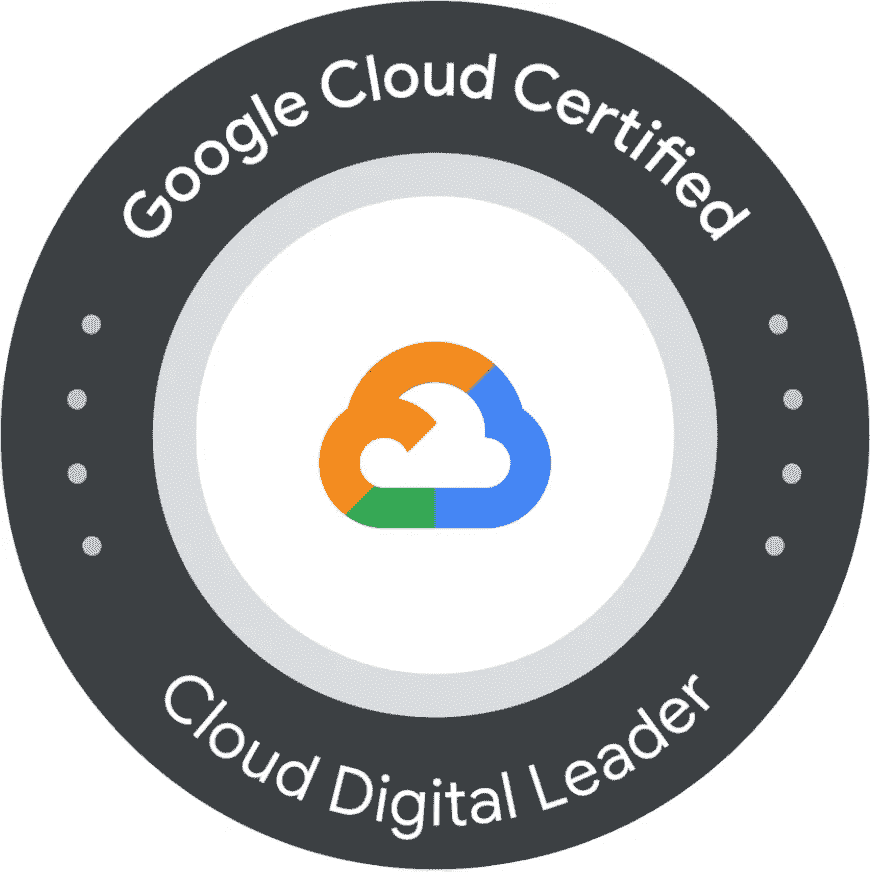
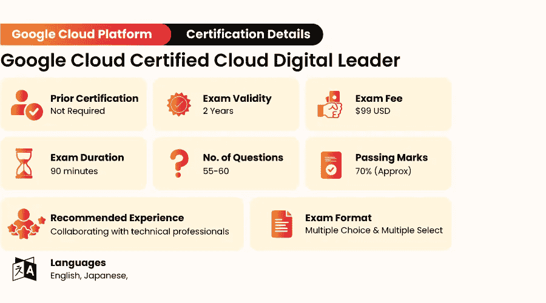
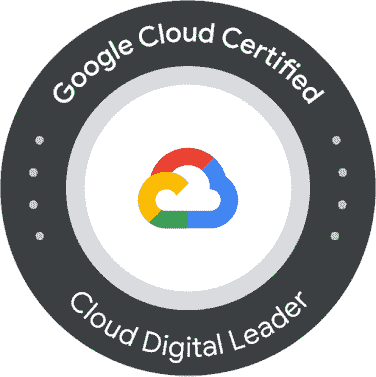
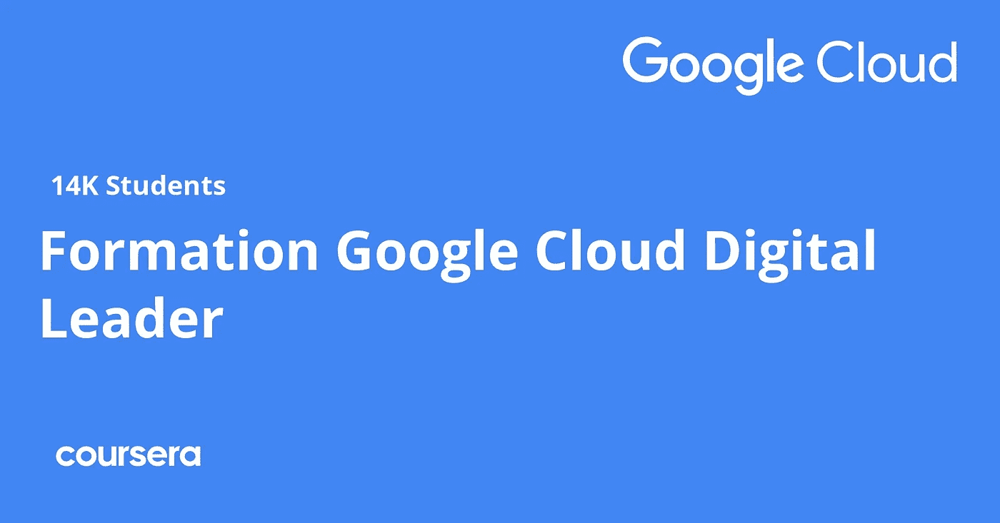
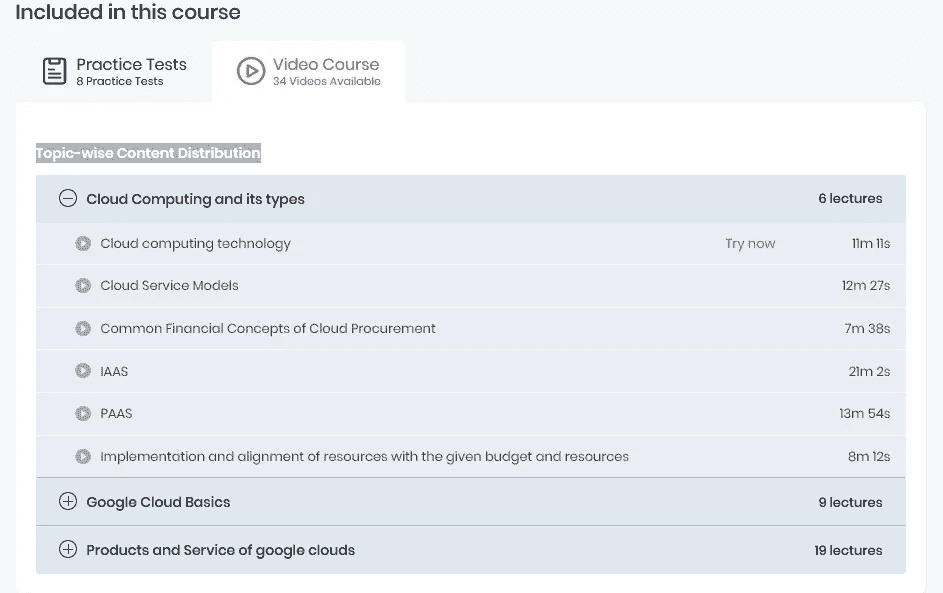
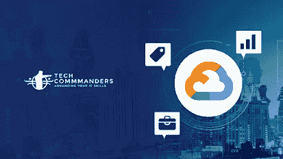
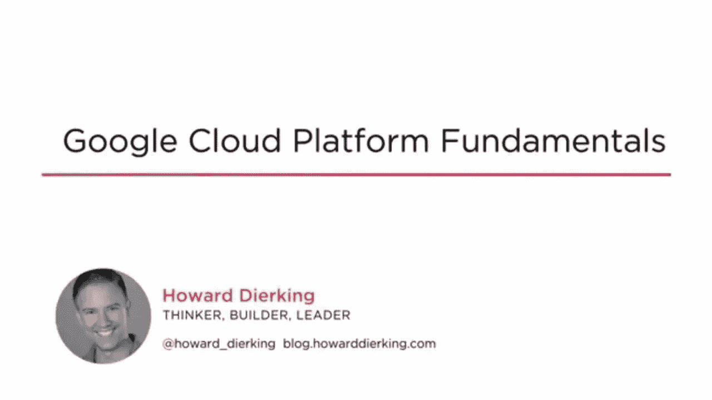

# 2023 年面向初学者的 6 门最佳谷歌云数字领袖认证课程

> 原文：<https://medium.com/javarevisited/5-best-google-cloud-digital-leader-certification-courses-for-beginners-5d8f25d587?source=collection_archive---------0----------------------->

## 我最喜欢的在线课程 2023 年破解谷歌云数字领导者认证考试，成为谷歌云认证的云数字领导者

朋友们，如果你想在 2023 年成为一名认证的谷歌云数字领导者，或者只是想学习谷歌云并寻找最好的在线课程，那么你来对地方了。早些时候，我已经分享了适合初学者的最佳谷歌云课程**，今天我们将在线看看最佳的谷歌云课程。**

**谷歌云平台数字认证非常实用，有可能给你带来高薪工作。**

**现在，每一个阅读这篇文章的人一定会熟悉谷歌，毕竟，每个人都知道如何在网上搜索信息，谷歌是互联网搜索的同义词。 [GCP](/javarevisited/my-favorite-free-google-cloud-platform-gcp-professional-cloud-developer-certification-courses-856ef69a56bb) 是谷歌的云程序。今天，我们将看到一些 GCP 数字领导者认证的最佳课程。**

**但是，在此之前，让我们了解一下**什么是谷歌云数字领导者认证**以及在现实世界中对谷歌认证的云数字领导者有什么期望？了解这次考试的目的将有助于你更好地准备和调整你的职业发展目标。**

**谷歌云认证是展示你对谷歌云平台了解的一个很好的方式。谷歌云数字领袖认证是你开始谷歌云职业生涯的绝佳场所。它是 [Google Cloud 专业云架构师](https://javarevisited.blogspot.com/2020/07/top-5-courses-to-become-google-cloud-professional-architect.html)、[开发者](/javarevisited/my-favorite-free-google-cloud-platform-gcp-professional-cloud-developer-certification-courses-856ef69a56bb)和 [DevOps 认证](/javarevisited/7-free-google-cloud-devops-engineer-certification-courses-f0046ac39f7e)的绝佳敲门砖。**

**对于刚接触云计算的人来说，这个认证是一个很好的起点，可以作为更高级别的认证的垫脚石。云数字领导者能够解释谷歌云主要产品和服务的功能，以及它们如何帮助企业。**

**云数字领导者还可能解释常见的业务用例，以及云技术如何帮助公司取得成功。如果您是该认证的新手，以下是您应该了解的关于 Google Cloud Digital Leader 认证的重要细节:**

****

# **2023 年面向初学者的 5 门最佳谷歌云数字领导者在线课程**

**以下是 2023 年准备谷歌云数字领袖认证的最佳在线课程列表。这些课程是由 Udemy、T2、Coursera、T4、Pluralsight 和 freeCodecamp 创建的，很有可能在 2023 年成为谷歌云的数字领导者。**

**让我们详细地看看每一个。**

## **1.[初学者的 GCP——成为谷歌云数字领导者](https://click.linksynergy.com/deeplink?id=CuIbQrBnhiw&mid=39197&murl=https%3A%2F%2Fwww.udemy.com%2Fcourse%2Fgoogle-cloud-digital-leader-certification%2F)**

**这是为谷歌云数字领导者认证做准备的最好的在线课程之一。本课程来自 Udemy，由 Ranga Karnam 创建，他是我最喜欢的讲师之一，也是最畅销的 Udemy Java 和 Spring Boot 课程以及谷歌云和 AWS 课程的讲师之一。**

**在参加了他的 Java 和 Spring Boot 课程后，我毫不犹豫地加入了这个课程，因为我喜欢 Ranga 的 80/20 学习模式，他专注于 20%的重要内容，而 80%的时间都在使用。这意味着在探索罕见的、鲜为人知的概念之前，你将首先学习最基本的概念。**

**本课程也是专门为您准备 Google Cloud Leader 认证而设计的，它遵循考试主题和百分比划分。它不仅涵盖了云计算的基本要素，还涵盖了云数字领导者应该知道的重要谷歌云产品和服务。**

****独特点当然****

*   **立即开始成为谷歌云认证的云数字领导者。**
*   **获得使用谷歌云平台的计算、网络、存储和数据库服务的实践经验。**
*   **了解如何使用最佳实践在 Google 云平台上创建应用程序。**

**简而言之，为 2023 年 Google Cloud 数字领袖认证做准备的最好、最新的课程之一。这个课程也很实惠，你只需花 10 美元就可以在 Udemy 上买到，这种事情时有发生。**

****以下是参加本课程的链接** — [GCP 初学者——成为谷歌云数字领导者](https://click.linksynergy.com/deeplink?id=CuIbQrBnhiw&mid=39197&murl=https%3A%2F%2Fwww.udemy.com%2Fcourse%2Fgoogle-cloud-digital-leader-certification%2F)**

****

## **2.[谷歌云数字领袖培训专业证书](https://coursera.pxf.io/c/3294490/1164545/14726?u=https%3A%2F%2Fwww.coursera.org%2Fprofessional-certificates%2Fgoogle-cloud-digital-leader-training)**

**云数字领袖计划是一套课程，旨在为您提供对云技术和数据的坚实理解。**

**本课程还概述了有助于企业数字化转型的谷歌云产品和服务。本课程将使您和您的团队能够参与整个公司的云相关业务活动。**

**在每个模块和每个课程结束时，通过练习和分级考试，学生将能够确认他们在课程中获得的知识。学习成果的验证和演示是通过实践和分级考试来完成的。**

****独特点当然是****

*   **你们将会学到一些很棒的话题和技巧，如下所述。**
*   **回想一下云术语的基础知识。**
*   **确定哪些谷歌云产品和服务有助于数字化转型。**
*   **解释如何使用云技术和数据来帮助企业创新。**
*   **对于基础设施和应用程序现代化，确定重要的变更模式和 Google 云产品。**

**本课程最棒的一点是，它是由谷歌云专家设计和教授的，这意味着 100%遵循考试模式，并涵盖您需要了解的所有基本谷歌云主题、产品和服务，以通过数字云领导者考试。除此之外，你还将获得 Coursera 颁发的证书。**

****这里是加入这个项目的链接**——[谷歌云数字领袖培训专业证书](https://coursera.pxf.io/c/3294490/1164545/14726?u=https%3A%2F%2Fwww.coursera.org%2Fprofessional-certificates%2Fgoogle-cloud-digital-leader-training)**

****

**顺便说一下，如果你计划参加多个 Coursera 课程或专业，那么考虑参加 [**Coursera Plus 订阅**](https://coursera.pxf.io/c/3294490/1164545/14726?u=https%3A%2F%2Fwww.coursera.org%2Fcourseraplus) ，它将为你提供无限制的访问他们最受欢迎的课程、专业、专业证书和指导项目的机会。它每年花费大约 399 美元，但它是值得的，因为你可以获得无限的证书。**

** [## Coursera Plus |无限制访问 7，000 多门在线课程

### 用 Coursera Plus 投资你的职业目标。无限制访问 90%以上的课程、项目…

coursera.pxf.io](https://coursera.pxf.io/c/3294490/1164545/14726?u=https%3A%2F%2Fwww.coursera.org%2Fcourseraplus)** 

## **3.[谷歌云数字领袖认证考试 2023](https://shareasale.com/r.cfm?b=413930&u=880419&m=43514&urllink=https%3A%2F%2Fwww%2Ewhizlabs%2Ecom%2Fgoogle%2Dcloud%2Dcertified%2Dcloud%2Ddigital%2Dleader%2F&afftrack=)【whiz labs】**

**这是为 2023 年谷歌云数字领导者认证考试做好准备的另一个很棒的资源。这个是由 Whizlabs 提供的，是准备 IT 认证的最佳场所之一。**

**在本次 GCP 云数字领导者培训课程中，您将可以无限制地参加两次各有 55 个独特问题的模拟测试，以及一次有 20 个独特问题的免费测试，总共有 172 个问题。**

**所有这 100 多个问题都类似于实际的考试问题，您可以将它们视为模拟考试。通过本次培训为 GCP 云数字领导者认证考试做准备和练习。**

**还有一个视频课程，详细解释了每个主题，有利于复习。您可以先通过视频课程复习基础知识，然后参加免费测试和全程模拟测试，在参加实际考试之前验证您的理解。**

****这里是加入本课程和测试**的链接——[谷歌云数字领导者认证测试](https://shareasale.com/r.cfm?b=413930&u=880419&m=43514&urllink=https%3A%2F%2Fwww%2Ewhizlabs%2Ecom%2Fgoogle%2Dcloud%2Dcertified%2Dcloud%2Ddigital%2Dleader%2F&afftrack=)**

****

**顺便说一句，如果您正在准备认证，可以考虑参加 [**Whizlabs 订阅**](https://shareasale.com/r.cfm?b=413930&u=880419&m=43514&urllink=https%3A%2F%2Fwww%2Ewhizlabs%2Ecom%2Fpricing%2F&afftrack=) ，它提供了对他们所有在线培训课程的完全访问权限，并为不同的认证进行模拟测试，每年仅需 99 美元(现在有 50%的折扣)。我强烈推荐这个订阅计划，因为 Whizlabs 有最好的材料来准备 IT 认证。您还可以使用我们的 JAVAREVISITED 优惠券享受 20%的折扣。**

## **4.[谷歌云数字云领导者认证速成班](https://click.linksynergy.com/deeplink?id=JVFxdTr9V80&mid=39197&murl=https%3A%2F%2Fwww.udemy.com%2Fcourse%2Fgoogle-cloud-digital-cloud-leader-certification-crash-course%2F)**

**在撰写本文时，谷歌的最新证书是谷歌云数字领袖认证。我对这项认证非常感兴趣，因为它让谷歌在入门级认证方面与 AWS/Azure 不相上下。**

**云数字领导者能够解释谷歌云主要产品和服务的功能，以及它们如何帮助企业。云数字领导者还可能解释常见的业务用例，以及云技术如何帮助公司取得成功。**

**谷歌云平台的云数字领导者认证面向企业专业人士，如营销人员、高管和销售团队，本课程将帮助您通过入门级谷歌云认证，成为 GCP 的认证数字云领导者。**

****课程的独特点:****

*   **解释什么是云技术，为什么云时代正在改变企业的运营方式。**
*   **创建适合您公司的转型挑战。**
*   **确定安全计划的哪些方面要包括在您的过渡中。**
*   **使用提供的模板，为您的整个转换项目创建一个业务案例和摘要页面。**

**总之是为 2023 年 Google 云平台数字云领导者认证考试做准备的最好的 Udemy 课程之一。**

****这里是加入本课程的链接**——[谷歌云数字云领导者认证速成班](https://click.linksynergy.com/deeplink?id=JVFxdTr9V80&mid=39197&murl=https%3A%2F%2Fwww.udemy.com%2Fcourse%2Fgoogle-cloud-digital-cloud-leader-certification-crash-course%2F)**

****

## **5.[谷歌云数字领袖认证学习课程](https://www.freecodecamp.org/news/google-cloud-digital-leader-course/)**

**云社区多年来一直在呼吁类似于 AWS 认证云从业者(CLF-C01)或微软 Azure 基础(AZ-900)的 GCP 基础认证，随着谷歌发布云数字领导者，这种等待现在终于结束了。**

**然而，谷歌选择做一些不同的事情，增加了认证要求的总难度和范围，使其比 AWS 认证的云从业者严格三倍**

**与 AWS 和 Azure 相比，谷歌云证书(即使在专业水平上)被指责为过于简单，基础证书也被认为过于简单，因此这可能是谷歌对这两种批评的回应。**

****独特点当然****

*   **该课程由以下内容组成:**
*   **构建基于云的解决方案环境**
*   **创建云解决方案并进行定制**
*   **创建和部署云解决方案**
*   **确保云解决方案平稳运行。**
*   **配置安全性和访问**

**简而言之，准备 2023 年谷歌云数字领袖认证的最好的免费在线课程之一。你可以在这里观看这个课程，也可以在 FreeCodecamp 的 Youtube 频道上观看。**

****

## **6.[plural sight 上的谷歌云数字领导者培训路径](https://pluralsight.pxf.io/c/1193463/424552/7490?u=https%3A%2F%2Fwww.pluralsight.com%2Fpaths%2Fgoogle-cloud-digital-leader-training)**

**这又是一个牛逼又全面的资源，为 Google 云平台，数字云领袖认证做准备。这是一个 Pluralsight 课程的集合，它将教你基本的谷歌云概念、产品和服务。**

**我真的很喜欢多视训练，它几乎总是高质量的，因为它们是由真正的专家教授的，它们的时间足够长，所以你可以学习而不会感到无聊。**

**以下是本培训计划涵盖的主要主题:**

*   **一般云计算知识，如 Paas、IaaS 等**
*   **一般谷歌云知识，如计算引擎**
*   **Google 云产品和服务，如 BigTable、BigQuery**
*   **数字转换、数据和人工智能/人工智能**
*   **实现公司 IT 基础设施和应用的现代化**

**您将需要大约 10 个小时来完成 GCP 的 Pluralsight 数字云领导者培训，我强烈建议任何准备参加 2023 年 GCP 数字云领导者认证考试的人参加此培训。**

****这是参加本课程的链接**——[谷歌云数字领导者培训路径](https://pluralsight.pxf.io/c/1193463/424552/7490?u=https%3A%2F%2Fwww.pluralsight.com%2Fpaths%2Fgoogle-cloud-digital-leader-training)**

****

**顺便说一下，你需要一个 Pluralsight 会员才能参加这个课程，费用大约是每月 29 美元或每年 299 美元(14%的折扣)。我向所有程序员强烈推荐这个订阅，因为它提供了超过 7000 个在线课程的即时访问，以学习任何技术技能。或者，你也可以使用他们的 [**10 天免费通行证**](https://pluralsight.pxf.io/c/1193463/424552/7490?u=https%3A%2F%2Fwww.pluralsight.com%2Fpricing%2Ffree-trial) 免费观看这个课程。**

** [## Pluralsight |个人免费试用

### 了解有关 Pluralsight 免费试用版的更多信息。

pluralsight.pxf.io](https://pluralsight.pxf.io/c/1193463/424552/7490?u=https%3A%2F%2Fwww.pluralsight.com%2Fpricing%2Ffree-trial)** 

# **谷歌云数字领袖认证常见问题**

**以下是准备 2023 年谷歌云数字领袖认证的人的一些常见疑惑和问题。**

***1。****GCP 认证有多重要？*****

**技术组织需要谷歌云平台认证，以确认求职者拥有该领域所有必要的技能和人才。**

**2.***2023 年 GCP 认证值得吗，有需求吗？*****

**是的，在这个人人都在向云迁移的时代，GCP 认证是值得的！对有能力的 GCP 从业者的需求不断增加，因此，大量的人进入了 GCP 领域。**

*****3。Google Cloud Leader 认证需要准备哪些题目？*****

**根据谷歌云官方文档，云数字领导者考试评估您在三个方面的知识:**

*   **一般云知识(大约占考试的 15–25%)**
*   **一般谷歌云知识(大约占考试的 25–35%)**
*   **Google 云产品和服务(大约占考试的 45–55%)**

**以上是为谷歌云数字领袖认证准备的**最佳在线课程。**这是一个以 2023 年为目标的很好的认证，因为它不是特定角色的，任何人都可以获得该认证。希望你们都喜欢这篇文章，并准备好参加谷歌云数字领导者课程，以解决认证问题。希望在下一篇文章中看到你们，在那之前，继续谷歌:D**

**您可能喜欢的其他**谷歌云认证资源**:**

*   **[2023 年学习谷歌云平台的前 5 门课程](https://javarevisited.blogspot.com/2019/07/top-5-google-cloud-platform-gcp-courses-certifications-online.html)**
*   **[学习谷歌云平台概念的 5 个最佳网站](https://javarevisited.blogspot.com/2021/11/top-5-websites-to-learn-google-cloud.html)**
*   **[谷歌云专业架构师考试前 5 名课程](https://javarevisited.blogspot.com/2020/07/top-5-courses-to-become-google-cloud-professional-architect.html)**
*   **[官方谷歌云数字领袖考试指南](https://cloud.google.com/certification/cloud-digital-leader)**
*   **[Coursera 十大谷歌云课程](https://javarevisited.blogspot.com/2020/08/top-10-coursera-certifications-to-learn-cloud-computing-aws.html)**
*   **[谷歌云数据工程师考试前 5 名课程](https://javarevisited.blogspot.com/2020/06/top-5-course-to-crack-google-cloud-professional-data-engineer-certification.html)**
*   **[学习谷歌云平台的 5 门免费课程](https://www.java67.com/2020/07/5-free-courses-to-learn-google-cloud-platform-and-concepts.html)**
*   **[准备谷歌云助理工程师考试的前 5 门课程](https://javarevisited.blogspot.com/2020/05/top-5-course-to-crack-google-cloud-associate-cloud-engineer-certification-exam.html)**
*   **[Google Cloud devo PS 工程师考试前 5 名课程](https://javarevisited.blogspot.com/2020/10/top-5-free-google-cloud-professional-certification-courses.html)**
*   **[10 谷歌云认证瞄准 2023 年](https://www.java67.com/2021/01/top-10-google-cloud-certifications.html)**

**感谢您阅读本文。如果你觉得这些*最佳谷歌云数字领袖在线课程*有用，请与你的朋友和同事分享。如果您有任何问题或反馈，请留言。

**【p . s .】**—如果你是谷歌云平台的新手，正在寻找免费的在线课程来学习基本的谷歌云概念，我建议你去看看 Udemy 上的谷歌云平台大师们的免费课程[**GCP——谷歌云平台概念**](https://click.linksynergy.com/deeplink?id=JVFxdTr9V80&mid=39197&murl=https%3A%2F%2Fwww.udemy.com%2Fcourse%2Fgcp-google-cloud-platform-concepts%2F) 。课程完全免费，你只需要一个 Udemy 账号就可以在线加入这个课程。**

** [## 2023 年面向初学者的 5 大免费谷歌云平台课程——最佳选择

### 大家好，如果你也想学习 2023 年的谷歌云平台，并且正在寻找一些免费的在线谷歌云…

www.java67.com](https://www.java67.com/2020/07/5-free-courses-to-learn-google-cloud-platform-and-concepts.html)**