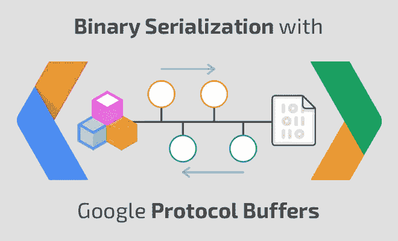
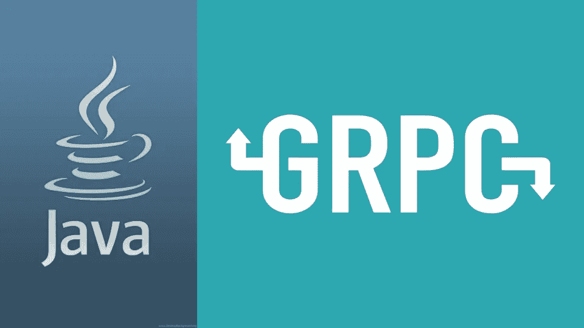
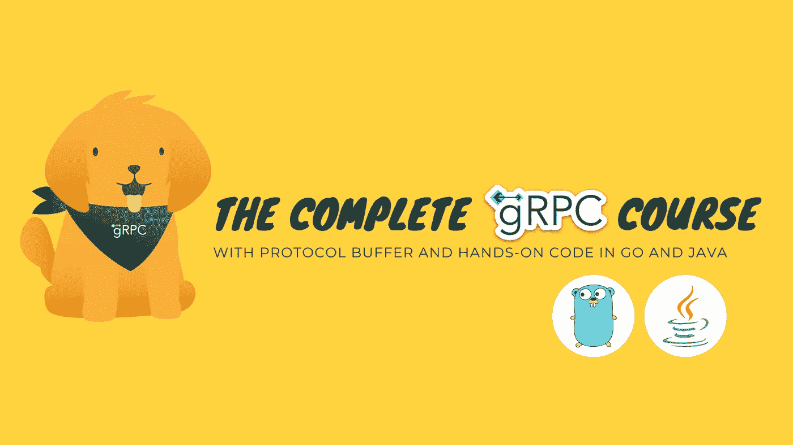
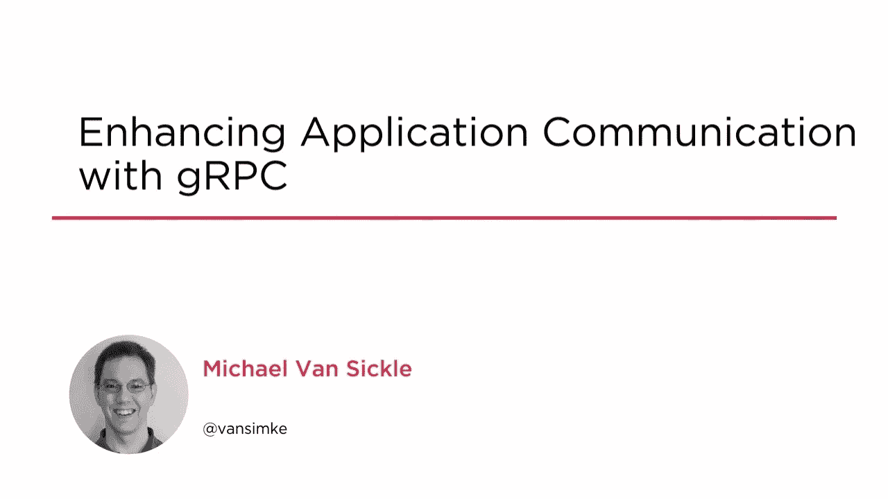

# 2023 年 7 门最佳 Google 协议缓冲区和 gRPC 初学者课程

> 原文：<https://medium.com/javarevisited/5-best-google-protocol-buffer-and-gprc-courses-for-beginners-22633658983e?source=collection_archive---------0----------------------->

## 这些是学习 gPRC 和 Google Protobuf for Java，Golang，C#，和。NET 开发者来构建下一代微服务。

大家好，如果你想学习 gRPC 和谷歌协议缓冲区，并寻找最好的在线课程，那么你来对地方了。早些时候，我已经分享了学习微服务 的 [**最佳课程，在这篇文章中，我将分享学习 gRPC 和 Google Protocol Buffer 的最佳在线课程，这两项最新技术可以帮助开发微服务和分布式应用程序。**](/javarevisited/top-5-courses-to-learn-microservices-in-java-and-spring-framework-e9fed1ba804d)

如果你关注科技新闻，那么你可能听说过 **gRPC** 、**谷歌远程过程调用**解决方案。这是科技圈的最新热门话题，人们正在热烈地谈论它。

嗡嗡声很明显，因为它来自谷歌，如 [Angular](https://javarevisited.blogspot.com/2018/06/5-best-courses-to-learn-angular.html) 、 [Golang](https://www.java67.com/2019/12/top-5-courses-to-learn-go-or-golang.html) 、 [Flutter](https://javarevisited.blogspot.com/2019/07/top-5-online-training-courses-to-learn-flutter.html) 、 [Dart](https://javarevisited.blogspot.com/2020/01/top-5-courses-to-learn-dart-programming.html) 、 [TensorFlow](https://javarevisited.blogspot.com/2018/08/top-5-tensorflow-and-machine-learning-courses-online-programmers.html) 以及其他最新技术。对于那些不知道的人来说，gRPC 是一个超快速、超高效的远程过程调用(PRC)系统，它将帮助您开发类似微服务的分布式系统。

这意味着**你可以使用 gRPC 以超快的速度在你的微服务之间进行通信**。与 SOAP 等其他 RPC 解决方案一样，它允许客户端应用程序调用服务器上的方法，因为它是一个本地对象。

服务器定义服务，并指示可以用方法参数和返回类型远程调用它，然后提供实现和可以处理客户端调用的 RPC 服务器。这个 RPC 服务器负责将您的数据转换成字节(序列化),以便它可以传输到服务器，然后将响应反馈给客户端。对于客户端代码来说，这都是 RPC 框架完成的，它不知道也不关心。

**最棒的是客户端和服务器可以在不同的技术上**。例如，您可以用 [Java](https://javarevisited.blogspot.com/2019/10/the-java-developer-roadmap.html) 或 [C++](/@javinpaul/top-10-courses-to-learn-c-for-beginners-best-and-free-4afc262a544e) 构建开发服务器，并用 [Python](https://hackernoon.com/top-5-courses-to-learn-python-in-2020-best-of-lot-bdq3y42) 、 [JavaScript](/javarevisited/my-favorite-free-tutorials-and-courses-to-learn-javascript-8f4d0a71faf2) 、 [Ruby](https://www.java67.com/2018/02/5-free-ruby-and-rails-courses-to-learn-online.html) 、 [Golang](/javarevisited/7-online-courses-to-learn-golang-or-go-programming-languages-in-2020-f599a25cf14a) 、 [Dart](/javarevisited/my-favorite-flutter-and-dart-programming-courses-for-beginners-9e8355710d78) 或任何其他编程语言编写您的客户端应用程序。

在 gRPC 的情况下，序列化位是使用 Google 协议缓冲区完成的，也称为 proto。虽然这不是强制性的，但是您也可以使用其他数据格式，如 [JSON](https://javarevisited.blogspot.com/2017/02/how-to-consume-json-from-restful-web-services-Spring-RESTTemplate-Example.html) 在客户机和服务器之间交换数据。

**gRPC**协议基于 HTTP2，并使用了它的许多特性，如压缩报头、持久的单一 TCP 连接、取消以及客户机和服务器之间的超时契约。gRPC 支持两种类型客户端-服务器通信——一元和流。一元就像一个异步请求，它会阻塞直到收到响应。同时，流非常强大，允许客户端和服务器推送消息以及双向流，其中客户端和服务器以相同的方法在两个流中发送数据。

[gRP](https://grpc.io/)C 的另一个好处是，最新版本的 Google APIs 也将拥有 gRPC 支持，这样你就可以轻松创建一个使用 gRPC 协议的客户端。如果您想了解更多关于 gRPC 的知识，并寻找一些优秀的资源，那么您来对地方了。

# 2023 年学习 gRPC 和 Google 协议缓冲区的 7 门最佳在线课程

我经常说，没有比参加在线课程更好的学习新技术的方法了。它通过支持消除了你的第一个障碍，你看到事情正在进行，这使得理解更大的画面以及底层工作变得更容易。自从我写了关于 [Google Protocol Buffer](https://javarevisited.blogspot.com/2015/06/google-protocol-buffers-or-protobuf-java-serialization-alternative.html) 以及它如何被用来替代 Java 中的序列化，已经有很长时间了，但是等待终于结束了。在这篇文章中，我将分享一些程序员学习 gRPC 协议和 Google 协议缓冲区的最佳课程。

这些课程将帮助你深入了解 gRPC 和 Google Protobuf。无论如何，不浪费你更多的时间，这里是我为程序员和软件开发人员列出的学习 gRPC 和 protobuf 的最佳在线课程。

## 1.[协议缓冲区完整指南 3【Java、Golang、Python】](https://click.linksynergy.com/deeplink?id=JVFxdTr9V80&mid=39197&murl=https%3A%2F%2Fwww.udemy.com%2Fcourse%2Fprotocol-buffers%2F)

在了解 gRPC 之前，了解一下 google 的协议缓冲区是必不可少的，这是夏羽·马雷克学习 Google 协议缓冲区的最佳课程之一。在参加了夏羽的 AWS 课程后，我非常兴奋地发现他也创建了一个关于 gPRC 的课程，这是一个很好的例子。

如果你不知道，协议缓冲区(protobuf)是一种原始的数据序列化格式，每个程序员都应该知道。它被谷歌等许多顶级科技公司所利用，使微服务能够以安全高效的方式传输数据。

在本课程中，您将通过示例和练习来学习 Google Protobuf。您还将使用 [Java](/javarevisited/top-5-java-online-courses-for-beginners-best-of-lot-1e1e240a758) 、 [Python](/swlh/5-free-python-courses-for-beginners-to-learn-online-e1ca90687caf) 和 Golang 编写代码，并通过实践讲座深入学习 gRPC，包括协议缓冲区 3 的所有方面。

**还有，这里是加入本课程的链接**——[协议缓冲区完整指南 3【Java、Golang、Python】](https://click.linksynergy.com/deeplink?id=JVFxdTr9V80&mid=39197&murl=https%3A%2F%2Fwww.udemy.com%2Fcourse%2Fprotocol-buffers%2F)

学完本课程后，你将了解创造简单和复杂所需的一切。proto 文件，并用自己喜欢的编程语言编写代码，比如 [Java](/javarevisited/10-free-courses-to-learn-java-in-2019-22d1f33a3915) 、 [Python](/javarevisited/best-python-books-a93d1a0d842d) 和 [Go](https://www.java67.com/2019/12/top-5-courses-to-learn-go-or-golang.html) 。简而言之，从一个优秀的老师那里学习 gRPC 的更好的课程之一。

## 2.[gRPC+proto buf[Java+Spring Boot]完全指南](https://click.linksynergy.com/deeplink?id=JVFxdTr9V80&mid=39197&murl=https%3A%2F%2Fwww.udemy.com%2Fcourse%2Fgrpc-the-complete-guide-for-java-developers%2F)

这是 Udemy 上的一门新课程，用 Java 和 Spring Boot 学习 gRPC 和 Google 协议缓冲区。本课程由 Vinoth Selvaraj 创建，将教您如何使用 gRPC 和 Protobuf 构建下一代微服务。

以下是您将在本 Udemy gRPC 课程中学到的内容

*   从头开始完成 gRPC
*   Spring Boot 一体化
*   军种间通信
*   一元、客户端流、服务器流和双向流 API
*   负载平衡
*   截击机
*   协议缓冲区/协议缓冲区
*   SSL / TLS

完成本课程后，您将从头开始熟悉用于设计您的类的 **gRPC** &所有 RPC 类型和 P**rotocol Buffers**/proto buf。

**这里是加入本课程的链接**—[gRPC+Protobuf[Java+Spring Boot]完全指南](https://click.linksynergy.com/deeplink?id=JVFxdTr9V80&mid=39197&murl=https%3A%2F%2Fwww.udemy.com%2Fcourse%2Fgrpc-the-complete-guide-for-java-developers%2F)

## 3. [gRPC [Java] Master Class:构建现代 API &微服务](https://click.linksynergy.com/deeplink?id=JVFxdTr9V80&mid=39197&murl=https%3A%2F%2Fwww.udemy.com%2Fcourse%2Fgrpc-java%2F)

现在，您已经知道了什么是 Google 协议缓冲区，以及如何使用它在您的微服务之间传输数据，是时候学习如何使用 gRPC 开发服务器端代码了。

这是 Java 开发者学习 gRPC 最好的课程之一。它将教你如何用 gRPC 和谷歌协议缓冲区(protobuf)

为你的微服务架构构建一个快速可扩展的 HTTP2 API 在这篇文章中，你将首先在那里了解 gRPC 和**gRPC 到底是如何工作的**。之后，您将学习如何使用？proto 文件以及如何实现一元、服务器流、客户端流和双向流 API。

您还将了解 gRPC 和 [REST API](https://javarevisited.blogspot.com/2020/02/top-5-postman-tutorials-and-courses-for-web-developers.html) 范例之间的区别，并理解 gRPC 框架提供的好处。您还将学习如何实现高级概念，如错误处理和 SSL 安全性。

总体来说，是 Java 开发者学习 gRPC 构建现代 API 和高速微服务的深度课程。

**这里是加入这个 gRPC 课程** — [gRPC [Java]大师班:构建现代 API &微服务](https://click.linksynergy.com/deeplink?id=JVFxdTr9V80&mid=39197&murl=https%3A%2F%2Fwww.udemy.com%2Fcourse%2Fgrpc-java%2F)的链接

## 4.[完整 gRPC 课程 2023【Golang+Java+proto buf】](https://click.linksynergy.com/deeplink?id=JVFxdTr9V80&mid=39197&murl=https%3A%2F%2Fwww.udemy.com%2Fcourse%2Fthe-complete-grpc-course%2F)

这是 Udemy 为 Java 和 Golang 开发人员提供的另一个很棒的 gRPC 课程。本课程由 TECH SCHOOL 创建，将教您如何为微服务和移动应用构建高效的生产级 API。

您将从 gRPC 是什么开始，它是如何工作的，为什么我们应该使用它，以及它适合在哪里使用，并比较 gRPC 和 REST。本课程还概述了 gRPC 所基于的 HTTP/2 协议

以下是您将在 gRPC 课程中学到的内容:

*   如何使用 Go + Java 编写和序列化协议缓冲区消息
*   如何用协议缓冲区定义 gRPC 服务并生成 Go + Java 代码
*   如何使用 Go + Java 实现 4 种类型的 gRPC:一元、服务器流、客户端流和双向流
*   如何处理上下文期限、gRPC 错误和状态代码
*   如何为 gRPC 服务编写带有接口和单元测试的生产级应用程序
*   如何使用 gRPC 拦截器通过 JWT 认证和授权用户
*   如何保护 gRPC 与服务器端和双向 SSL/TLS 的连接

您还将了解如何启用 gRPC 反射进行服务发现、负载平衡 gRPC 服务，以及如何使用 gRPC gateway 生成 RESTful 服务和 swagger API，这使得本课程成为 Udemy 上面向 Java 和 Golang 开发人员的最全面的 gRPC 课程之一。

**这里是加入这个综合 gRPC 课程的链接**——[2023 年完整 gRPC 课程【Golang+Java+proto buf】](https://click.linksynergy.com/deeplink?id=JVFxdTr9V80&mid=39197&murl=https%3A%2F%2Fwww.udemy.com%2Fcourse%2Fthe-complete-grpc-course%2F)

## 5.[增强与 gRPC 的应用通信](https://pluralsight.pxf.io/c/1193463/424552/7490?u=https%3A%2F%2Fwww.pluralsight.com%2Fcourses%2Fgrpc-enhancing-application-communication)

多年来，有许多不同的策略可以让用一种语言编写的软件与用另一种语言编写的软件进行交流。已经发展起来的两种主要方法是 RESTful 服务(通常使用 JSON 文档来传输数据)和 RPC(远程过程调用),它们使用各种不同的传输技术。

在本课程中，您将了解 gRPC 框架，Google 将其用于大部分服务间通信。首先，您将了解 gRPC 应用程序的组件。

接下来，您将了解如何使用协议缓冲区来定义 gRPC 服务。

最后，您将学习如何使用 [C#](https://www.java67.com/2019/03/5-free-c-net-courses-to-learn-online.html) 、 [Java](/javarevisited/10-free-courses-to-learn-java-in-2019-22d1f33a3915) 、 [Node.js](https://www.java67.com/2019/07/top-5-free-nodejs-courses-for-web-development.html) 和 [Go](/@javinpaul/what-is-go-or-golang-programming-language-why-learn-go-in-2020-1cbf0afc71db) 创建 gRPC 客户端和服务器。本课程结束时，您将知道如何在您的分布式系统应用程序中使用 gRPC。

**这里是参加本课程的链接** — [增强与 gRPC 的应用程序通信](https://pluralsight.pxf.io/c/1193463/424552/7490?u=https%3A%2F%2Fwww.pluralsight.com%2Fcourses%2Fgrpc-enhancing-application-communication)

## 6.gRPC [Golang]大师班:构建现代 API 和微服务

比 REST API 好！使用 gRPC 为 Golang 微服务构建快速、可扩展的 HTTP/2 API，协议缓冲区(protobuf)

gRPC 是一个全新的现代框架，用于构建可扩展、时尚、快速的 API。谷歌、Square 和网飞等许多顶级科技公司都在利用它。

它使程序员能够用他们想要的任何语言编写[微服务](/javarevisited/10-best-java-microservices-courses-with-spring-boot-and-spring-cloud-6d04556bdfed?source=rss-bb36d8439904------2&utm_source=dlvr.it&utm_medium=linkedin)，同时保持在这些服务之间轻松创建通信的能力。它依赖 Google 协议缓冲区作为传输机制和服务定义语言。

在本课程中，我们将通过实践讲座深入探索 gRPC 入门的各个方面。本课程是实践操作，您将实现两个服务:Greet 和一个计算器服务。在短短的几个小时内，你将知道你需要知道的一切来写你的。原型文件，用您喜欢的编程生成代码，用 Golang 实现您的服务、服务器和客户端。将会有大量的实践讲座和练习供你练习新学到的技能。

**这里是加入本课程的链接**-[gRPC【Golang】大师班:构建现代 API 和微服务](https://click.linksynergy.com/deeplink?id=JVFxdTr9V80&mid=39197&murl=https%3A%2F%2Fwww.udemy.com%2Fcourse%2Fgrpc-golang%2F)

## 7.[g*RPC #主类*:构建现代 API &微服务](https://click.linksynergy.com/deeplink?id=JVFxdTr9V80&mid=39197&murl=https%3A%2F%2Fwww.udemy.com%2Fcourse%2Fgrpc-csharp%2F)

如果你是一个 C#开发者，并且想学习 gRPC，那么这是一门非常好的课程。在本课程中，您将学习如何使用 gRPC、协议缓冲区(protobuf)

为. NET 微服务创建快速、可扩展的 HTTP/2 API。这是夏羽·马拉克的另一门实践课程，您将从 [C#开发人员](/javarevisited/5-best-c-c-sharp-programming-courses-for-beginners-in-2020-494f7afc7a5c)的角度学习 gRPC 入门的所有方面。作为课程的一部分，您将开发两个服务:Greet 和 Calculator 服务。完成这个课程后，你将知道如何写你的。原型文件，用您喜欢的编程语言生成代码，并在[中实现您的服务、服务器和客户端。网](https://javarevisited.blogspot.com/2019/10/top-5-courses-to-learn-asp-net-in-2019.html)。

总之，学习 gRPC 的最佳课程为 C#和。NET 开发人员。以下是加入本课程的链接— [gRPC C#大师班:构建现代 API &微服务](https://click.linksynergy.com/deeplink?id=JVFxdTr9V80&mid=39197&murl=https%3A%2F%2Fwww.udemy.com%2Fcourse%2Fgrpc-csharp%2F)

以上就是关于 Java、C#和 Golang 学习 gRPC 和 Google Protocol Buffer 的**最佳在线课程。如您所见，gRPC 来自 Google，并承诺提供微服务之间的高性能通信，这使得它真正适合于云和分布式应用程序开发。**

如果你想在今年学习一项新技术，我建议你用你最喜欢的编程语言探索 gRPC 和 Google Protocol buffer，比如 [Java](/javarevisited/top-5-java-online-courses-for-beginners-best-of-lot-1e1e240a758) 、 [Python](https://javarevisited.blogspot.com/2020/06/top-5-courses-to-learn-python-full-stack-web-development.html) 、Golang 或者 [C#](/javarevisited/9-free-c-c-sharp-courses-and-tutorials-for-beginners-and-intermediate-programmers-best-of-lot-dc8c793aab31) 。

您可能想探索的其他**编程资源文章**

*   [学习 Java 微服务的 5 大课程](/javarevisited/5-best-courses-to-learn-spring-cloud-and-microservices-1ddea1af7012)
*   [面向有经验程序员的 10 门高级核心 Java 课程](https://javarevisited.blogspot.com/2020/04/top-10-advanced-core-java-courses-for-experienced-developers.html#axzz6K9piJ9MB)
*   [面向 Java 开发者的 5 门免费 Spring 框架课程](http://www.java67.com/2017/11/top-5-free-core-spring-mvc-courses-learn-online.html)
*   [2023 年学习 Web 开发的 5 门课程](http://javarevisited.blogspot.sg/2018/02/top-5-online-courses-to-learn-web-development.html#axzz57wed1PWd)
*   [学习正则表达式的前 5 门课程](https://javarevisited.blogspot.com/2020/04/top-5-courses-to-learn-regular-expression-regex.html)
*   [面向有经验的 Java 开发人员的 5 大 Java 设计模式课程](http://javarevisited.blogspot.sg/2018/02/top-5-java-design-pattern-courses-for-developers.html)
*   [编程/编码工作面试的 10 门课程](http://javarevisited.blogspot.sg/2018/02/10-courses-to-prepare-for-programming-job-interviews.html)
*   [深入学习 Spring 的五大课程](https://javarevisited.blogspot.com/2018/06/top-6-spring-framework-online-courses-Java-programmers.html)
*   [面向 Java 开发人员的 10 门高级 Spring Boot 课程](/javarevisited/10-advanced-spring-boot-courses-for-experienced-java-developers-5e57606816bd)
*   [初学者学习 Spring Cloud 的 5 大课程](https://javarevisited.blogspot.com/2018/04/top-5-spring-cloud-courses-for-java.html)
*   [5 门免费学习核心 Java 的在线课程](http://javarevisited.blogspot.sg/2017/11/top-5-free-java-courses-for-beginners.html#axzz4zuIICRs9)
*   [学习 learn Shell 脚本的 5 门课程](http://javarevisited.blogspot.sg/2018/02/5-courses-to-learn-shell-scripting-in-linux.html)
*   面向 Java 开发者的 10 个免费 Spring Boot 教程和课程

感谢您阅读本文。如果你觉得这些课程对**学习 gRPC 和 Google 协议缓冲**有用，那么请分享给你的朋友和同事。如果您有任何问题或反馈，请留言。

**【p . s .】**—如果您是 Java 和微服务领域的新手，并且正在寻找一些在线课程来开始学习 Java 和微服务，并且已经建立了像 Spring Boot 这样的框架，那么您也可以查看此列表中的 [**Java 微服务和 Spring Boot 课程**](https://javarevisited.blogspot.com/2018/02/top-5-spring-microservices-courses-with-spring-boot-and-spring-cloud.html) 来开始您的旅程。

 [## Spring Boot 和 Spring Cloud 的 10 个最佳 Java 微服务课程

### 大家好，如果你想学习 Java 微服务开发，并寻找最好的微服务课程…

medium.com](/javarevisited/10-best-java-microservices-courses-with-spring-boot-and-spring-cloud-6d04556bdfed)  [## 用 Spring Boot 和 ReactiveJ 为 Java 程序员学习微服务的 7 门最佳免费课程…

### 我最喜欢的学习 Java 微服务的免费在线课程来自 Udemy，Coursera，，和其他流行的在线…

medium.com](/javarevisited/7-free-microservices-courses-for-java-programmers-c9b2f3a2ea7d)