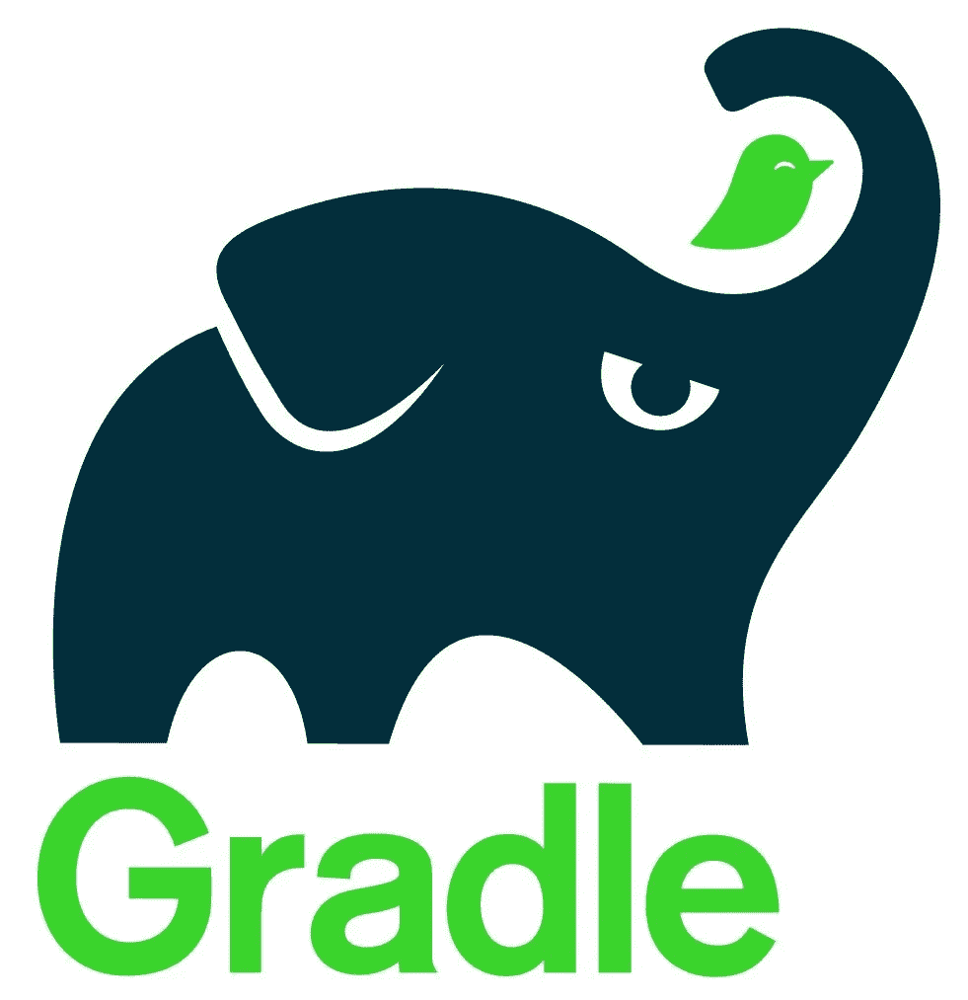
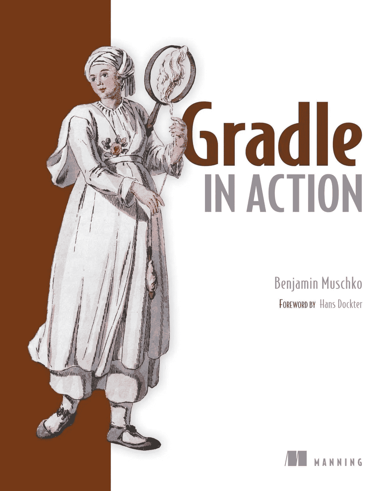
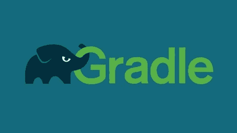

# 2023 年要学的 5 门最佳研究生课程和书籍

> 原文：<https://medium.com/javarevisited/5-best-gradle-courses-and-books-to-learn-in-2021-93f49ce8ff8e?source=collection_archive---------0----------------------->

## 这些是 Java 开发人员和 DevOps 工程师学习 Gradle 的最佳书籍和课程。

你好，伙计们，如果你想学习 Gradle 并寻找最好的 Gradle 课程和书籍，那么你来对地方了。之前我已经分享了[最佳 Maven 课程](/javarevisited/6-best-maven-courses-for-beginners-in-2020-23ea3cba89)，今天我将分享 Java 开发者和 DevOps 工程师的最佳 Gradle 课程和书籍。

[Gradle](https://gradle.com/) 是 Java 开发者创建构建脚本和管理依赖关系的最新工具之一。这是对 [Maven](https://javarevisited.blogspot.com/2019/03/top-5-course-to-learn-apache-maven-for.html) 的一个很好的替代，Gradle 最大的好处是，你最终拥有了可读性更强、更简洁的构建脚本。

使用 [Maven](/javarevisited/top-10-free-courses-to-learn-maven-jenkins-and-docker-for-java-developers-51fa7a1e66f6?source=collection_home---4------3-----------------------) ，构建脚本使用 pom.xml 文件中的 XML 编写，这非常冗长，但是使用 Gradle，构建脚本使用 [Groovy](https://javarevisited.blogspot.com/2017/08/top-5-books-to-learn-groovy-for-java.html) 编写，这在设计上非常简洁。

这意味着同样的 **100 行 Maven 构建脚本可以被 10 到 20 行 Gradle 脚本**替代。举个例子，这里有一个图表，比较了 Gradle 脚本和 Maven pom.xml 文件。

[格雷尔 vs 梅文](https://javarevisited.blogspot.com/2020/06/maven-vs-gradle-beginners-introduction.html#axzz6dHZ7oEpK)

由于这种清晰和简洁，Gradle 逐渐成为 Java 开发人员和 DevOps 工程师的首选构建工具。还有，越来越多的公司在使用 Gradle 而不是 Maven。

我预计这种增长会继续，因为在构建脚本的质量方面有明显的原因。我个人喜欢阅读 Gradle 构建脚本，并尽可能使用它们。

Gradle 也用于 [Android Studio](https://javarevisited.blogspot.com/2018/09/top-5-courses-to-learn-intellij-idea-java-and-android-development.html) 构建 Android 应用。Gradle 允许您编译和测试您的代码，为您的应用程序创建 jar 和 war，生成 Javadoc，等等。

如果您也对 Gradle 的产品感兴趣，并想了解更多关于 Gradle 的信息，以便在您的项目中使用，无论是家庭项目还是办公室项目，那么您来对地方了。在这篇文章中，我将分享一些 2023 年在 Gradle 学习的**最好的课程和书籍。这些是一些很棒的教程、在线课程和课程，你可以用来快速学习 Gradle，而无需参加任何编码训练营式的课堂培训。

了解 [Groovy](https://groovy-lang.org/) 肯定有助于读写 Gradle 脚本，但不是强制性的。在编写 Gradle build 脚本时，你会选择足够多的 groovy，但是如果你可以的话，尽一切办法学习 Groovy。对于 Java 开发人员来说，这是一个非常有用的工具，你也可以使用 Groovy 来编写使用 Spock 框架的数据驱动测试用例。**

# 5 本适合初学者的最佳课程和书籍

不浪费你更多的时间，这里是我列出的 2023 年最好的网上交易课程。我已经尝试包含了适合初学者和中级开发人员的课程。正如我以前说过的，一些 Groovy 知识会有所帮助，但不是强制性的。

## 1.[格拉德大师班](https://click.linksynergy.com/deeplink?id=JVFxdTr9V80&mid=39197&murl=https%3A%2F%2Fwww.udemy.com%2Fcourse%2Fgradle-masterclass%2F)

这是 Java 开发人员学习 Gradle 的最佳课程之一。在本课程中，您将从头开始了解 Gradle。这门课程包括诸如 Gradle 的基础知识；领域特定语言或 DSL、领域对象模型和生命周期。

如果你不知道 Gradle 非常依赖 DSL，也被称为 D **领域专用语言**，而 [Groovy](https://javarevisited.blogspot.com/2018/02/top-3-jvm-languages-java-programmer-learn.html) 对 DSL 来说很棒。pom.xml 中 Maven 的 200 行构建文件在 Gradle 构建文件中通常需要 10 或 20 行，因为 Groovy 的语法很简洁。Btw，也可以用 Kotlin 当 DSL。

长期以来，Groovy 一直被 Gradles 转到 DSL 语言。因此，学习 Groovy 并了解如何使用 Groovy 和 Gradle 是有意义的，这样您就可以从两者中获得最大的好处。

本课程不仅如此，还将向您展示如何使用 Kotlin 作为 DSL，以及这种令人惊叹的编程语言有哪些 IDE 支持。

简而言之，这是学习 Gradle 与 Groovy 和 Kotlin 的绝佳课程，我强烈推荐任何想使用 Gradle 构建 Java 应用程序的 Java 或 Groovy 开发人员学习这门课程。

**这里是加入这个研究生课程**——[研究生大师班](https://click.linksynergy.com/deeplink?id=JVFxdTr9V80&mid=39197&murl=https%3A%2F%2Fwww.udemy.com%2Fcourse%2Fgradle-masterclass%2F)的链接

## [2。Gradle 速成班 2023(带 Groovy)](https://click.linksynergy.com/deeplink?id=JVFxdTr9V80&mid=39197&murl=https%3A%2F%2Fwww.udemy.com%2Fcourse%2Fthe-gradle-crash-course%2F)

无论您是正在寻找构建代码(免费)方法的大学生，还是正在寻找一站式构建项目或从 Maven 升级的行业专业人士。

Gradle 可以处理一切事情，从文件管理到构建扫描，再到与持续集成平台的集成，如 [Jenkins](https://dev.to/javinpaul/10-free-devops-courses-to-learn-jenkins-docker-and-maven-for-programmers-ohp) 和 TeamCity。

你会很快掌握格拉德。它是最好的构建自动化工具之一，能够用 [Groovy](http://www.java67.com/2018/06/top-5-books-to-learn-grails-framework-Java-Groovy.html) 或 [Kotlin](/javarevisited/top-5-courses-to-learn-kotlin-in-2020-dfc3fa7706d8?source=---------16------------------) 编写快速且高度可定制的构建。

课程分为几个板块，每个板块本身独立形成一个模块和一门课程。每个部分都有测验和作业支持，让你跟上进度。无论你是想获得自动化构建经验的大学生，还是想寻找构建和测试代码工具的专业人士，你都会在这里找到你所需要的。一切都有据可查，分门别类，你可以找到你需要的。

**这里是加入这个梯度速成班**——[梯度速成班](https://click.linksynergy.com/deeplink?id=JVFxdTr9V80&mid=39197&murl=https%3A%2F%2Fwww.udemy.com%2Fcourse%2Fthe-gradle-crash-course%2F)的链接

## 3.[凯文·琼斯的《格拉德基础》](https://pluralsight.pxf.io/c/1193463/424552/7490?u=https%3A%2F%2Fwww.pluralsight.com%2Fcourses%2Fgradle-fundamentals)

如果你有 Pluralsight 会员资格，并且正在寻找一个好的 Gradle 课程，那么你必须查看 Keven Jones 的 Gradle 基础课程。

Gradle 是最新最棒的 Java 构建工具，在构建 Java 项目和管理依赖关系方面提供了 Maven 的强大功能，但具有更好的可读性、可维护性和强大的开发模型。这门课程是对格雷尔的介绍。它是高度和容易扩展的。虽然 Gradle 本身是用 [Java](/javarevisited/top-5-java-online-courses-for-beginners-best-of-lot-1e1e240a758) 编写的，但它提供了一个用 Groovy 编写的 DSL，您可以在其中编写配置脚本。

本课程涵盖了 Gradle 的基础知识，从用 DSL 编写任务，到运行 Java 构建和单元测试，再到扩展构建语言本身的方法。Gradle 没有提供自己的依赖管理系统，但它可以使用 [Maven](https://www.java67.com/2018/02/6-free-maven-and-jenkins-online-courses-for-java-developers.html) 或 Ivy 的依赖管理功能，你将学习如何配置和使用这两个系统。

最后，您将了解 Gradle“包装器”，一种确保您的开发人员始终使用正确版本的 Gradle 的机制。

**这里是加入这个梯度课程** — [梯度基础](https://pluralsight.pxf.io/c/1193463/424552/7490?u=https%3A%2F%2Fwww.pluralsight.com%2Fcourses%2Fgradle-fundamentals)的链接

顺便说一句，你需要一个 [**Pluralsight 会员**](https://pluralsight.pxf.io/c/1193463/424552/7490?u=https%3A%2F%2Fwww.pluralsight.com%2Flearn) 才能加入这个课程，费用大约是每月 29 美元或每年 179 美元(现在有 40%的折扣)。我向所有程序员强烈推荐这个订阅，因为它提供了超过 7000 个在线课程的即时访问，以学习任何技术技能。或者，你也可以使用他们的 [10 天免费通行证](https://pluralsight.pxf.io/c/1193463/424552/7490?u=https%3A%2F%2Fwww.pluralsight.com%2Flearn)免费观看这个课程。

 [## 对个人来说

### Pluralsight 帮助个人学习者获得掌握最新软件开发所需的技术技能…

pluralsight.pxf.io](https://pluralsight.pxf.io/c/1193463/424552/7490?u=https%3A%2F%2Fwww.pluralsight.com%2Flearn) 

## 4.[行动中的梯度](https://www.amazon.com/Gradle-Action-Benjamin-Muschko/dp/1617291307?tag=javamysqlanta-20)

到目前为止，我们已经从 Udemy 和 Pluralsight 看到了多个学习 Gradle 的在线课程，这些课程是由一些具有实际 Gradle 经验的 Gradle 专家和开发人员创建的。虽然课程有助于学习常见的东西，并帮助你快速入门，但它们不像一本书那样全面。如果你想深入学习 Gradle，最好的方法是将上述课程与一本像曼宁的《Gradle in Action》这样的综合性书籍结合起来。

这本书不仅教你什么是 Gradle 的基础知识，告诉你相对于其他 Java 构建工具，grad le 提供了什么好处，还教你测试、持续集成和监控代码质量等高级话题。Gradle 是一个用于编程项目的广泛的构建工具和依赖管理器。Gradle 可以自动构建、测试、发布、部署更多软件包或其他类型的项目，如生成静态网站、生成文档或任何其他内容。

这本书帮助你了解一个开发人员或开发工程师需要知道的一切。

**这里是购买这本书的链接**——[格雷德在行动](https://www.amazon.com/Gradle-Action-Benjamin-Muschko/dp/1617291307?tag=javamysqlanta-20)

## [5。梯度基础知识](https://click.linksynergy.com/deeplink?id=JVFxdTr9V80&mid=39197&murl=https%3A%2F%2Fwww.udemy.com%2Fcourse%2Fgradle-fundamentals%2F)

这是在 Udemy 中学习 Gradle 基础知识的另一个很棒的课程。
在本课程中，学生将学习 Gradle 的核心概念，以及如何使用 Gradle 来管理 Java 应用程序的构建、测试和部署。您将首先浏览一些 Gradle 基础知识，并了解一些常见任务，如如何使用 Gradle 构建 Java 项目、向项目添加依赖项以及创建库模块。我们还将了解 Gradle 项目结构、Gradle 任务、云中的 Gradle 等等。

这也是一门实践性很强的课程，您将通过练习和常见任务来学习 Gradle，例如如何设置和使用 Gradle，如何创建 Gradle 任务和在云中使用 Gradle，以及如何向项目添加依赖项和创建库模块。

**这里是加入本研究生课程**——[研究生基础](https://click.linksynergy.com/deeplink?id=JVFxdTr9V80&mid=39197&murl=https%3A%2F%2Fwww.udemy.com%2Fcourse%2Fgradle-fundamentals%2F)的链接

谈到社会证明，这是 Udemy 上评分最高的课程之一。近 253 名参与者对该课程的平均评分为 4.4，超过 1，420 名学生注册了该课程。总的来说，这是一门很好的在线学习课程。

以上是关于 2023 年在 Gradle 学习的一些最好的课程和书籍。如果你想为 2023 年的 [DevOps 学习一些工具，我认为 Docker 和 Gradle 应该是你的首选。](/javarevisited/13-best-courses-to-learn-devops-for-senior-developers-in-2020-a2997ff7c33c?source=extreme_sidebar---------0-2----------------------)

它们是我最喜欢的工具，因为它们真正帮助了开发人员的工作。它们简化了开发过程，这在大型复杂的企业 Java 项目中非常重要。

其他 **DevOps 资源和文章**你可能喜欢

*   [2023 年 DevOps 开发者路线图](https://javarevisited.blogspot.com/2018/09/the-2018-devops-roadmap-your-guide-to-become-DevOps-Engineer.html)
*   [面向 Java 和 DevOps 专业人员的 10 门免费 Docker 课程](https://javarevisited.blogspot.sg/2018/02/10-free-docker-container-courses-for-Java-Developers.html)
*   [学习 Jenkins 自动化和开发运维的五大课程](https://javarevisited.blogspot.com/2018/09/top-5-jenkins-courses-for-java-and-DevOps-Programmers.html)
*   [开发人员需要学习的前 5 门课程](https://javarevisited.blogspot.com/2019/11/top-5-course-to-learn-ansible-for-devops.html)
*   [5 门免费 Selenium 课程学习自动化测试](https://javarevisited.blogspot.sg/2018/02/top-5-selenium-webdriver-with-java-courses-for-testers.html)
*   [面向 Java 开发人员的 6 门 Maven 课程](http://www.java67.com/2018/02/6-free-maven-and-jenkins-online-courses-for-java-developers.html)
*   [学习 Docker 和 Kubernetes 的前 5 门课程](https://javarevisited.blogspot.com/2019/05/top-5-courses-to-learn-docker-and-kubernetes-for-devops.html)
*   [2023 年 Java 开发人员应该学会的 10 件事](http://javarevisited.blogspot.sg/2017/12/10-things-java-programmers-should-learn.html#axzz53ENLS1RB)
*   [面向高级开发人员的 10 门 DevOps 课程](https://javarevisited.blogspot.com/2018/09/10-devops-courses-for-experienced-java-developers.html)
*   [学习 Docker、Kubernetes 和 AWS 的 15 门课程](/javarevisited/top-15-online-courses-to-learn-docker-kubernetes-and-aws-for-fullstack-developers-and-devops-d8cc4f16e773)
*   [2023 年 Java 开发人员应该学习的 10 种工具](http://www.java67.com/2018/04/10-tools-java-developers-should-learn.html)
*   [深入学习 AWS 的 10 门免费课程](/javarevisited/top-10-courses-to-learn-amazon-web-services-aws-cloud-in-2020-best-and-free-317f10d7c21d)
*   [5 个免费弹簧框架和 Spring Boot 课程](http://www.java67.com/2017/11/top-5-free-core-spring-mvc-courses-learn-online.html)
*   [面向 Java JEE 开发者的 5 大 Hibernate 和 JPA 课程](http://javarevisited.blogspot.sg/2018/01/top-5-hibernate-and-jpa-courses-for-java-programmers-learn-online.html)

感谢阅读 ar 的这篇文章。如果你喜欢这些最好的课程和书籍，请与你的朋友和同事分享。如果您有任何问题或反馈，请留言。

**P. S.** —如果您是一名经验丰富的 Java 开发人员，并且正在寻找一些课程来开始您的 DevOps 之旅并学习 Jenkins、Maven 和 Gradle 等基本工具，那么您还可以查看[**DevOps:CI/CD with Jenkins、Maven 和 Gradle**](https://click.linksynergy.com/deeplink?id=JVFxdTr9V80&mid=39197&murl=https%3A%2F%2Fwww.udemy.com%2Fcourse%2Fdevops-and-continuous-integration-with-jenkins-pipelines%2F) 以与 Jenkins 和 Gradle 一起构建持续集成、交付和 devo PS 管道。

 [## DevOps:与 Jenkins pipelines、Maven 和 Gradle 的 CI/CD

### 这个在线 DevOps 课程将教你如何建立一个复杂的持续集成和持续交付…

udemy.com](https://click.linksynergy.com/deeplink?id=JVFxdTr9V80&mid=39197&murl=https%3A%2F%2Fwww.udemy.com%2Fcourse%2Fdevops-and-continuous-integration-with-jenkins-pipelines%2F)