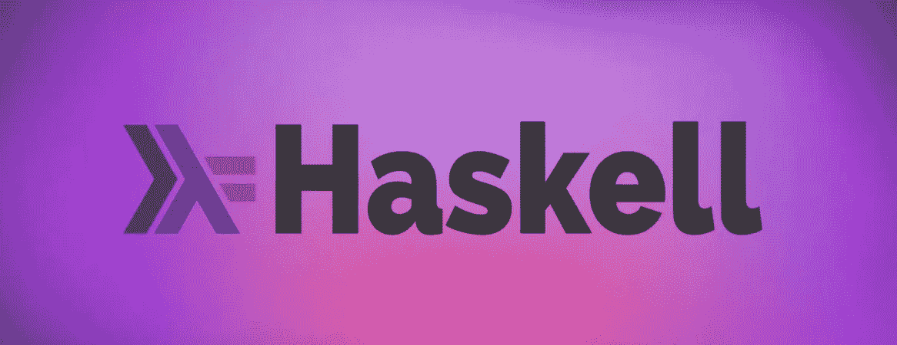
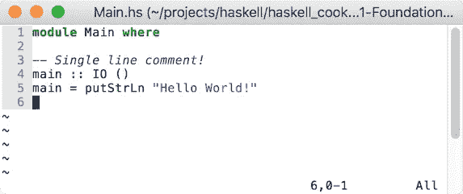
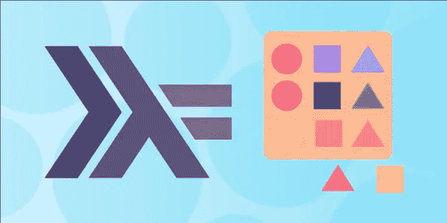
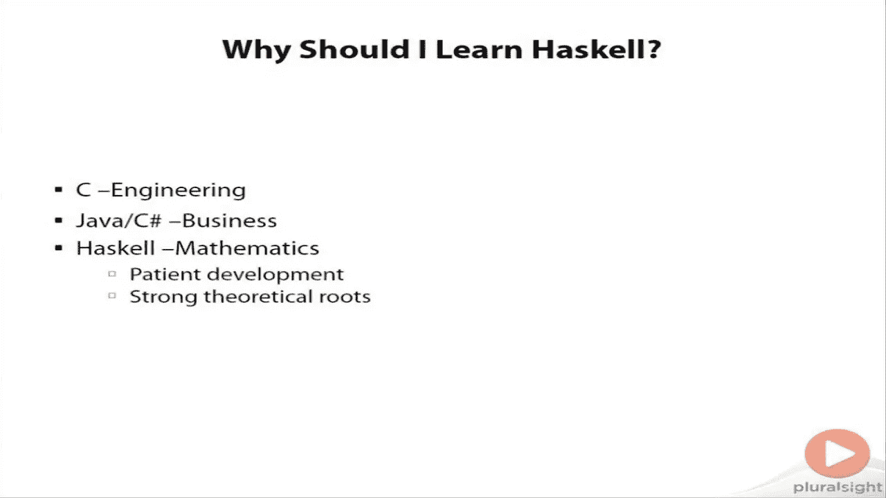
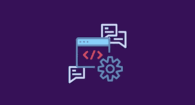

# 2023 年在线学习函数式编程的 5 门最佳 Haskell 课程

> 原文：<https://medium.com/javarevisited/5-best-haskell-programming-courses-to-learn-online-d9849335a5c?source=collection_archive---------0----------------------->

## 2023 年想学 Haskell？这里是你可以用来从头开始学习 Haskell 的最好的在线课程和资源。

大家好，如果你想学习 Haskell，2023 年最好的函数式编程语言之一，并寻找最好的在线课程，那么你来对地方了。

早些时候，我已经分享了 [**最好的 Scala 编程课程，**](https://javarevisited.blogspot.com/2020/09/top-5-courses-to-learn-scala.html) 另一种顶级函数式编程语言，在这篇文章中，我将分享来自 Udemy 和 Pluralsight 的最好的 Haskell 课程，这是学习编程和软件开发的两个最好的网站。

这些是我找到的学习 Haskell 的最好资源，因为这也是我 2023 年的目标之一。但是，在学习 Haskell 之前，您需要了解什么是函数式编程。

函数式编程的基础是数学函数。Haskell 是一种纯粹的函数式语言。

Haskell 的第一个版本发布于 1990 年。它的名字来自著名的数学家哈斯凯尔·布鲁克斯·加里，他是函数编程和组合逻辑之父。Haskell 语言基于一种叫做 lambda calculus 的东西。

Haskell 程序总是被表达为数学函数。需要注意的重要一点是，这些功能从来没有副作用。你可以在每个函数上使用相同的输入，它会在不改变程序状态的情况下产生相同的结果。这意味着函数的结果只取决于当前的输入参数。

Haskell 自首次发布以来已经走过了漫长的道路，现在被认为是函数式编程语言的标准。Haskell 衍生出了许多其他语言。其中包括 Parallel Haskell、Eager Haskell、Haskell ++和 Eden。

Haskell 为开发人员提供了许多优势，如提高生产率、易于维护、错误少、可靠性高，并且可以用于广泛的应用程序。

# 2023 年学习 Haskell 的 5 门最佳在线课程

如果你想知道在哪里可以学习 Haskell 和函数式编程，那么不要担心。下面你可以找到学习 Haskell 的前 5 门课程的列表。看看下面的列表。

## 1.[学习路径:Haskell:函数式编程和 Haskell](https://click.linksynergy.com/deeplink?id=JVFxdTr9V80&mid=39197&murl=https%3A%2F%2Fwww.udemy.com%2Fcourse%2Flearning-haskell-programming%2F)

本课程将轻松让你成为 Haskell 编程专家，Haskell 是一种高级的纯函数式编程语言。通过本课程，你将看到函数式编程是如何解决复杂性问题的。

在学习更大的 Haskell 程序的结构之前，您将从学习 Haskell 数据类型和函数的基础开始。本课程结束时，您将能够编写和部署一个简单的 web 应用程序。这将有助于你理解函数式程序和传统命令式程序的异同。

**课程时长:13 小时**

**球场评分:4.5 星(满分 5 分)**

**课程讲师:Packt 出版**

**课程价格:16 美元**

**以下是加入本课程** — [学习路径:Haskell:函数式编程和 Haskell](https://click.linksynergy.com/deeplink?id=JVFxdTr9V80&mid=39197&murl=https%3A%2F%2Fwww.udemy.com%2Fcourse%2Flearning-haskell-programming%2F)

## 2.[哈斯克尔基础第一部分](https://pluralsight.pxf.io/c/1193463/424552/7490?u=https%3A%2F%2Fwww.pluralsight.com%2Fcourses%2Fhaskell-fundamentals-part1)【复数视线】

这是帮助你开始学习 Haskell 的完美课程，Haskell 是一种独特而强大的函数式编程语言。你将成为一个用一种非常容易编译的语言表达更丰富、更简洁的程序员。

您还将了解 Haskell 区别于所有其他语言的不同特性。另一个需要注意的重要事情是，尽管这是一门中级课程，但这门课程不需要事先有函数式编程的经验。

**课程时长:3 小时**

**课程评分:4.5 星(满分 5 分)**

**课程讲师:Pluralsight**

**课程价格:高级计划每年 140 美元**

**这里是加入本课程的链接** — [**哈斯克尔基础第一部分**](https://pluralsight.pxf.io/c/1193463/424552/7490?u=https%3A%2F%2Fwww.pluralsight.com%2Fcourses%2Fhaskell-fundamentals-part1)

## 3. [Haskell for 初学者(编程语言)](https://click.linksynergy.com/deeplink?id=CuIbQrBnhiw&mid=39197&murl=https%3A%2F%2Fwww.udemy.com%2Fcourse%2Fhaskell-tutorial%2F)【Udemy】

这是一个非常短的课程，正如标题所示，无论您是在 PC、平板电脑还是智能手机上，它都非常适合学习 Haskell 的基础知识。购买本课程后，您将终身获得 1 小时的点播视频讲座。

该课程涵盖了与 Haskell 核心语法相关的所有主题，如数据类型、模块、条件、记录和元组。您还可以通过打印字符串和数字来创建函数和变量。还将向您介绍列表、循环和递归的概念。通过本课程，您还将了解更多关于数学库以及如何获取用户输入的信息。

**课程时长:1 小时**

**球场评分:4.2 星(满分 5 分)**

**课程讲师:ProgLang MainSt**

**课程价格:16 美元**

**这里是加入本课程的链接—** [**Haskell for 初学者(编程语言)**](https://click.linksynergy.com/deeplink?id=CuIbQrBnhiw&mid=39197&murl=https%3A%2F%2Fwww.udemy.com%2Fcourse%2Fhaskell-tutorial%2F)

## 4.[哈斯克尔基础第二部分](https://pluralsight.pxf.io/c/1193463/424552/7490?u=https%3A%2F%2Fwww.pluralsight.com%2Fcourses%2Fhaskell-fundamentals-part2)

本课程是 Pluralsight 平台上“Haskell 基础第 1 部分”课程的后续课程。在本课程中，您将学习使用 Haskell(一种独特的函数式编程语言)编写有效程序的关键概念。

本课程将带你深入 Haskell 的神奇世界，教你如何组织更大的项目和重用你的代码。因为这是本系列的第二部分，所以需要一些 Haskell 的知识。

**课程时长:2 小时**

**课程评分:4.5 星(满分 5 分)**

课程讲师:Pluralsight

**课程价格:高级计划每年 140 美元**

这是加入 Haskell 课程的链接— [Haskell 基础第二部分](https://pluralsight.pxf.io/c/1193463/424552/7490?u=https%3A%2F%2Fwww.pluralsight.com%2Fcourses%2Fhaskell-fundamentals-part2)

顺便说一下，你需要一个 Pluralsight 会员才能参加这个课程，费用大约是每月 29 美元或每年 299 美元(14%的折扣)。我向所有程序员强烈推荐这个订阅，因为它提供了超过 7000 个在线课程的即时访问，以学习任何技术技能。或者，你也可以使用他们的 [**10 天免费通行证**](https://pluralsight.pxf.io/c/1193463/424552/7490?u=https%3A%2F%2Fwww.pluralsight.com%2Fpricing%2Ffree-trial) 免费观看这个课程。

 [## Pluralsight |个人免费试用

### 立即开始免费试用 Pluralsight！查看我们为个人和团队提供的服务，如果您不确定…

pluralsight.pxf.io](https://pluralsight.pxf.io/c/1193463/424552/7490?u=https%3A%2F%2Fwww.pluralsight.com%2Fpricing%2Ffree-trial) 

## 5.编写 Haskell 程序

在本课程中，您将学习如何创建、构建、运行和测试 Haskell 程序，以及重用现有的 Haskell 包。您将学习如何查看代码的构建和执行测试周期。

您还将学习如何使用堆栈构建工具，以及发现 Cabal 文件的不同用途。通过本课程，您将了解如何使用模块来组织程序，并学习如何在 Hackage 和 Stackage 中搜索包。

**课程时长:3 小时**

**课程评分:4.5 星(满分 5 分)**

**课程讲师:Packt Publishing**

**课程价格:16 美元**

**这里是加入本课程** — [**编写 Haskell 程序**](https://click.linksynergy.com/deeplink?id=CuIbQrBnhiw&mid=39197&murl=https%3A%2F%2Fwww.udemy.com%2Fcourse%2Fwriting-haskell-programs%2F) 的链接

# 2023 年学 Haskell？常见问题

现在，让我们看看人们在开始学习 Haskell 时问的几个常见问题。

**1。Haskell 是用来做什么的？**

Haskell 是一种纯粹的函数式语言。函数式编程的基础是数学函数。Haskell 主要用于研究目的和学术界。

**2。Haskell 是什么时候创建的？**

Haskell 的第一个版本发布于 1990 年。它的名字来自著名的数学家哈斯凯尔·布鲁克斯·加里，他是函数编程和组合逻辑之父。

**3。Haskell 是好的编程语言吗？**

Haskell 为开发人员提供了许多优势，如提高生产率、易于维护、错误少、可靠性高，并且可以用于广泛的应用程序。

**4。学习 Haskell 需要多长时间？**

嗯，这真的取决于你所说的学习是什么意思。你可以在一天内开始编写像 HelloWorld 这样的小程序，并在一周内开始阅读 Haskell 代码，但在现实世界的 Haskell 项目中工作可能需要 2 到 4 周，并且可能需要 6 个月到一年才能真正掌握 Haskell。

**5。我在哪里可以找到更多的 Haskell 教程和例子**

您可以随时查看 Haskell 编程语言的官方网站[haskell.org](https://www.haskell.org/documentation/)，了解更多信息，并获得文档和入门指南。

以上就是 2023 年学习 Haskell 编程语言的**最佳在线课程。这些课程会在几周内让你轻松成为 Haskell 专家。你唯一需要做的就是从这个列表中选择一门课程，然后开始学习。你可以以后再谢我。**

其他**资源**学习顶级编程语言:

*   [2023 年学习 Java 编程的 5 门最佳课程](https://javarevisited.blogspot.com/2018/05/top-5-java-courses-for-beginners-to-learn-online.html)
*   [初学者学习的 5 门最好的 Python 3 课程](https://javarevisited.blogspot.com/2018/03/top-5-courses-to-learn-python-in-2018.html)
*   [2023 年初学者学习的 5 个最佳 Golang 课程](https://www.java67.com/2019/12/top-5-courses-to-learn-go-or-golang.html)
*   [2023 年初学者学习的 10 门最佳 JavaScript 课程](https://www.java67.com/2020/10/best-javascript-courses-for.html)
*   [2023 年学习 C 编程的前 5 门课程](https://javarevisited.blogspot.com/2019/11/top-5-courses-to-learn-c-programming-in.html)
*   [我最喜欢的深入学习 C++的课程](https://javarevisited.blogspot.com/2020/07/top-10-courses-to-learn-c-in-depth-best.html)
*   [10 个最适合初学者的 Ruby 在线课程](https://javarevisited.blogspot.com/2021/04/top-10-online-courses-to-learn-ruby-on.html)
*   [2023 年初学 PHP 我最喜欢的课程](https://javarevisited.blogspot.com/2020/11/top-10-courses-to-learn-php-for.html)
*   [初学者学习 C#的 10 门在线课程](https://javarevisited.blogspot.com/2019/11/top-5-courses-to-learn-c-sharp-in.html)
*   [2023 年学习打字稿的前 5 门课程](https://javarevisited.blogspot.com/2018/07/top-5-courses-to-learn-typescript.html)
*   [学习 Rust 编程的 5 门最佳在线课程](https://javarevisited.blogspot.com/2020/01/top-5-courses-and-books-to-learn-rust-programming-language.html#axzz6grO2U4Lp)
*   [我最喜欢的学习 Julia 编程语言的课程](/javarevisited/top-5-julia-programming-books-courses-and-tutorials-for-beginners-e5b4bd7067ec)
*   [5 门面向初学者的免费 Scala 开发课程](https://javarevisited.blogspot.com/2019/01/5-free-scala-programming-courses-for-java-programmers-learn-online.html)

如果你喜欢这份*学习 Haskell 的 5 大课程列表，*请随意与你的朋友和家人分享。此外，如果您有任何疑问或问题，请留下您的评论，我们将立即回复您。

 [## 2023 年初学者学习 Haskell 的前 5 门课程——最好的

### 大家好，如果你想学习 Haskell，2022 年最好的函数式编程语言之一，并寻找…

javarevisited.blogspot.com](https://javarevisited.blogspot.com/2021/12/top-5-courses-to-learn-haskell-for.html)