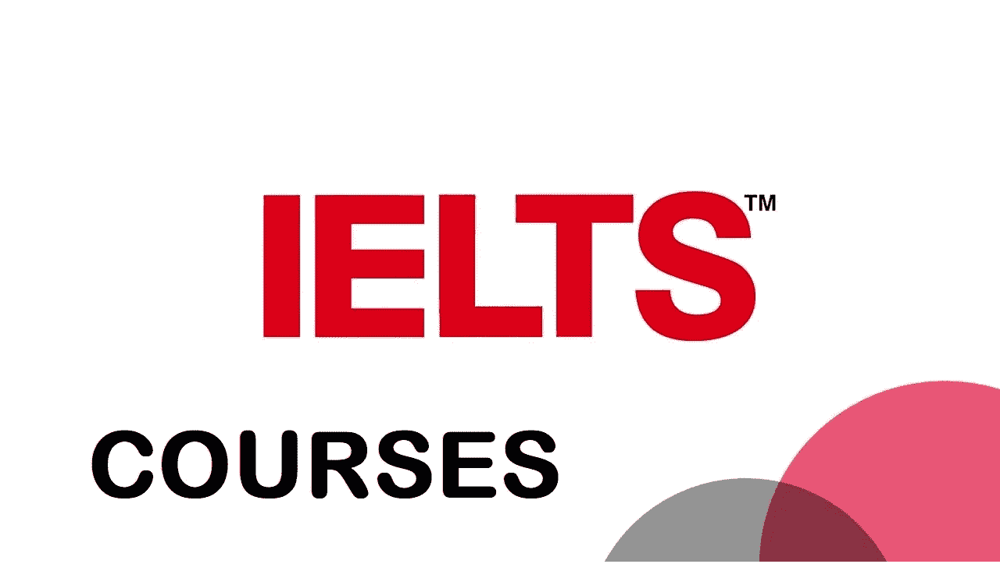
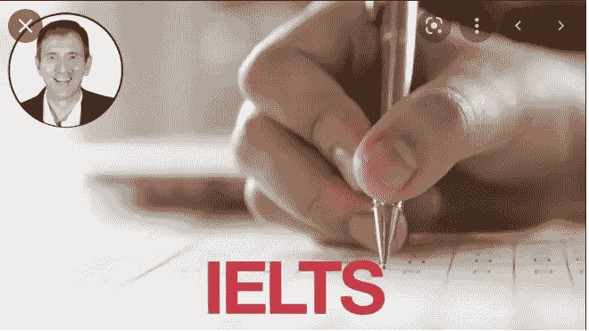
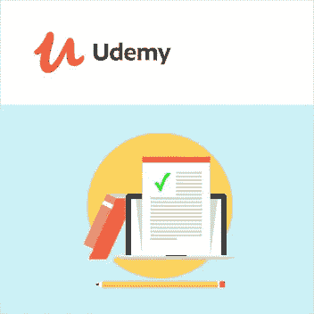
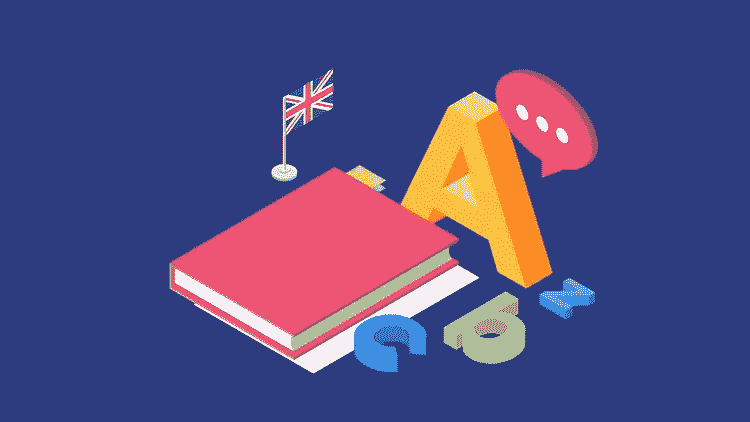

# 2023 年 IT 支持专业人士最佳雅思 5 门课程

> 原文：<https://medium.com/javarevisited/5-best-ielts-courses-for-beginners-in-2022-9efd3337851c?source=collection_archive---------0----------------------->

## 我最喜欢的准备 2023 年雅思考试的在线课程

大家好，如果你正在准备雅思考试，并且需要最好的资源来更好地准备，那么你来对地方了。早些时候，我已经分享了技术考试的备考材料，如 [CompTIA A+](/javarevisited/6-best-comptia-a-220-1001-and-220-1002-online-training-courses-practice-tests-and-dumps-cfc25759b808) 、[Microsoft Azure Fundamentals](/javarevisited/5-best-azure-fundamentals-courses-to-pass-az-900-certification-exam-in-2020-9e602aea035d)和 [AWS Cloud 从业者](/javarevisited/5-best-aws-cloud-practitioner-certification-clf-c01-practice-questions-mock-tests-and-exam-55330b140e58)，在这篇文章中，我将分享准备雅思考试的最佳在线课程。

国际英语语言测试系统，通常被称为雅思，是最受欢迎的移民、学习和工作英语语言测试。雅思成绩被一万多家机构认可。

这些组织包括教育机构、专业协会、雇主和政府。

雅思涵盖了所有主要的语言技能——阅读、写作、口语和听力。

每年有超过 300 万人参加雅思考试。考试很难，如果你的英语技能没有达到标准，考试会更难。为了获得理想的结果，你需要把注意力集中在所有四种语言技能上。

# 2023 年 5 门最佳雅思初学者在线课程

在这篇文章中，我们将列出五门有助于备考的雅思课程。你不需要参加所有的课程，只需检查预览，如果你能连接到讲师，然后参加课程。

你如何发现这个课程是否适合你？我通常会看预习，如果我看的时候没有停顿，没有前进，也没有厌烦，这是一个好的迹象，表明我和课程和老师有联系。

## 1.[雅思 7+完整预备课程— Udemy](https://click.linksynergy.com/deeplink?id=CuIbQrBnhiw&mid=39197&murl=https%3A%2F%2Fwww.udemy.com%2Fcourse%2Fielts-band-7-preparation-course%2F)

有超过 94000 名学生注册，这是 udemy 最畅销的雅思备考课程。在这门课程中，教师将重点逐一讲解所有主要的语言技能。

教师为备考提供了优秀的学术和一般策略。这门课程有二十多项作业。根据导师的说法，如果你认真对待这门课程，你将达到七级以上。

要求
中级英语

这是一个很长的课程，总视频内容为 74 小时。它是一门中级课程。

**这里是加入本课程的链接**——[雅思 7+完整预备课程](https://click.linksynergy.com/deeplink?id=CuIbQrBnhiw&mid=39197&murl=https%3A%2F%2Fwww.udemy.com%2Fcourse%2Fielts-band-7-preparation-course%2F)

## 2.[雅思备考大师班:雅思考试完全指南](https://click.linksynergy.com/deeplink?id=CuIbQrBnhiw&mid=39197&murl=https%3A%2F%2Fwww.udemy.com%2Fcourse%2Fielts-preparation-course%2F)

这是 udemy 另一个热门的雅思备考课程。在本课程中，教师提供了通过雅思考试所需的所有基本信息。

你将学习如何准备阅读、写作、口语和听力，并得到有价值的建议和提示。本课程也有有用的范例测验。

本课程相当小，总共只有五个小时的视频内容。它是一门中级课程。

要求
中级英语

谈到社会证明，超过 19，354 名学生参加了这门课程，近 4600 名参与者对这门课程的平均评分为 4.4，这是非常了不起的，充分显示了这门课程的质量。

**这里是加入本课程的链接** — [雅思备考大师班:雅思考试完全指南](https://click.linksynergy.com/deeplink?id=CuIbQrBnhiw&mid=39197&murl=https%3A%2F%2Fwww.udemy.com%2Fcourse%2Fielts-preparation-course%2F)

## 3.[雅思口语:为 7.0+级提高你的语言水平](https://click.linksynergy.com/deeplink?id=CuIbQrBnhiw&mid=39197&murl=https%3A%2F%2Fwww.udemy.com%2Fcourse%2Fprepare-for-ielts-speaking-with-former-ielts-examiners%2F)

口语考试是雅思考试中最难的部分之一。这门课程是专门为那些说话有困难的人设计的。它将帮助你掌握没有语法错误的说话技巧。如果说是你的弱项，那么这门课程是你的最佳选择。

要求
需要很强的英语能力

这门课将近 37 个小时。这是一个中级课程，最适合那些想提高英语口语技能以及准备雅思考试的人。

**以下是参加本课程的链接** — [雅思口语:提高你的语言水平以达到 7.0+级](https://click.linksynergy.com/deeplink?id=CuIbQrBnhiw&mid=39197&murl=https%3A%2F%2Fwww.udemy.com%2Fcourse%2Fprepare-for-ielts-speaking-with-former-ielts-examiners%2F)

## 4.[掌握雅思写作:任务 2(6 小时内达到 7+级](https://click.linksynergy.com/deeplink?id=CuIbQrBnhiw&mid=39197&murl=https%3A%2F%2Fwww.udemy.com%2Fcourse%2Fmastering-ielts-writing-task-2%2F)

写作是雅思的另一个难点。如果你的母语不是英语，通过写作考试是不容易的。udemy 的这门课程将为我准备雅思写作考试。

在这门课程中，你将学会如何写出高质量的英语。如果写作是你的弱项，那么这门课程是你的最佳选择。

要求
得体的英语

这也是一门中级课程，总视频内容超过七个半小时。

**这是加入本课程**——[掌握雅思写作:任务 2(6 小时内达到 7+级](https://click.linksynergy.com/deeplink?id=CuIbQrBnhiw&mid=39197&murl=https%3A%2F%2Fwww.udemy.com%2Fcourse%2Fmastering-ielts-writing-task-2%2F))的链接

## 5.[雅思 7 Plus:完整雅思备考【学术】— Udemy](https://click.linksynergy.com/deeplink?id=CuIbQrBnhiw&mid=39197&murl=https%3A%2F%2Fwww.udemy.com%2Fcourse%2Fielts-7-plus-ielts-preparation%2F)

这是 udemy 雅思备考的另一个热门课程。在这门课程中，你将学习如何准备雅思考试以达到六七级以上。

本课程由几个练习活动和练习测试组成。此外，讲师还会解释如何奖励乐队，以及获得理想结果的最佳策略。

要求
中级英语

这是一个预中级水平的课程，总视频内容为 24 小时。

**这里是加入本课程的链接**——[ELTS 7 Plus:完成雅思备考【学术】](https://click.linksynergy.com/deeplink?id=CuIbQrBnhiw&mid=39197&murl=https%3A%2F%2Fwww.udemy.com%2Fcourse%2Fielts-7-plus-ielts-preparation%2F)

以上就是 2023 年**破解雅思考试的最佳在线课程**。如前所述，在雅思考试中获得理想的成绩是一项艰巨的任务。你应该适当地掌握听、读、写和说。

只有你对英语有适当的理解，你才能得到七分以上的分数。在这篇文章中，我们列出了帮助你在雅思考试中获得七分以上的前五门课程。

其他**认证资源**针对 **IT 专业人员**和 Java 程序员

*   [破解 AWS 解决方案架构师认证的 5 大课程](https://javarevisited.blogspot.com/2019/05/top-5-courses-to-crack-aws-solutions-architect-associate-certification-exam-SAA-C01.html#axzz5rHwAwycj)
*   [学习 Docker 和 Kubernetes 的十大课程](https://dev.to/javinpaul/top-10-courses-to-learn-docker-and-kubernetes-for-programmers-4lg0)
*   [程序员前 5 名 AZ-900 模拟测试](https://javarevisited.blogspot.com/2020/02/top-5-AZ-900-exam-Azure-Fundamentals-certification-practice-tests-and-mock-exams-to.html)
*   [如何破解 2023 年 AZ-103 Azure 行政考试](https://javarevisited.blogspot.com/2020/04/how-to-crack-microsoft-az-103-azure-administrator-associate-exam-certification.html)
*   [10 门数据科学和机器学习认证课程](https://dev.to/javinpaul/10-data-science-and-machine-learning-courses-for-programmers-looking-to-switch-career-57kd)
*   [每个软件开发人员都应该学习的 10 件事](https://dev.to/javinpaul/10-things-every-software-developer-should-know-39pe)
*   [如何通过 Spring Core Professional 5.0 认证](https://javarevisited.blogspot.com/2018/08/how-to-crack-spring-core-professional-certification-exam-java-latest.html)
*   [破解 Azure 管理员认证的 5 门最佳课程(AZ-103/104)](https://javarevisited.blogspot.com/2020/06/top-5-course-to-become-microsoft-azure-administrator-certification-exam.html)
*   [通过 Azure 开发人员助理认证的 5 门在线课程](https://javarevisited.blogspot.com/2020/06/top-5-course-to-crack-Microsoft-Azure-Developer-Certification-Exam-AZ-203.html)
*   [通过谷歌助理云工程师认证的前 5 门课程](https://javarevisited.blogspot.com/2019/07/top-5-google-cloud-platform-gcp-courses-certifications-online.html)
*   [破解 Azure 云架构师(AZ-303)考试的前 5 门课程](https://javarevisited.blogspot.com/2019/07/top-5-courses-to-crack-azure-architecture-technologies-certification-az-300-exam.html#axzz6E6VuRMsx)
*   [如何准备 Azure 解决方案架构师(AZ-304)认证](https://javarevisited.blogspot.com/2020/04/how-to-crack-microsoft-azure-solution-architect-exam-az-300.html)
*   [破解 Azure 基础知识(AZ-900)考试的前 5 门课程](https://javarevisited.blogspot.com/2020/02/top-5-courses-to-crack-az-900-microsoft-azure-fundamentals-certification-exam.html)
*   [如何成为 DevOps 工程师？](https://javarevisited.blogspot.com/2018/09/the-2018-devops-roadmap-your-guide-to-become-DevOps-Engineer.html)
*   [如何破解甲骨文 2023 年 Java 认证？](https://medium.freecodecamp.org/how-to-pass-oracles-java-certifications-a-practical-guide-for-developers-e9b607ba6173)
*   【Pivotal 的 Spring 认证对工作和职业生涯有帮助吗？
*   [10 门学习数据结构和算法的免费课程](http://www.java67.com/2019/02/top-10-free-algorithms-and-data.html)
*   [破解 Azure 云架构师(AZ-300)考试的前 5 门课程](https://javarevisited.blogspot.com/2019/07/top-5-courses-to-crack-azure-architecture-technologies-certification-az-300-exam.html#axzz6E6VuRMsx)
*   [OCAJP 和 OCPJP 考试 10 道免费样题](http://www.java67.com/2017/05/10-free-java-8-certification-sample-questions-OCAJP8-OCPJP8-Mock-Exams.html)

感谢您阅读本文。如果你喜欢这些*最好的雅思考试资源和在线课程*，那么请分享给你的朋友和同事。如果您有任何问题或反馈，请留言。

如果你正在准备雅思考试，但正在寻找免费的资源，比如免费的在线课程，那么你也可以看看 [**雅思热门提示**](https://click.linksynergy.com/deeplink?id=CuIbQrBnhiw&mid=39197&murl=https%3A%2F%2Fwww.udemy.com%2Fcourse%2Fielts-top-tips%2F) (免费课程)，这对任何准备 2023 年雅思考试的人来说都是一个很好的资源。

 [## 2023 年雅思考试前五名在线课程-最佳选择

### 国际英语语言测试系统，俗称雅思，是最受欢迎的英语语言测试…

javarevisited.blogspot.com](https://javarevisited.blogspot.com/2021/10/top-5-online-courses-to-crack-ielts-in.html)