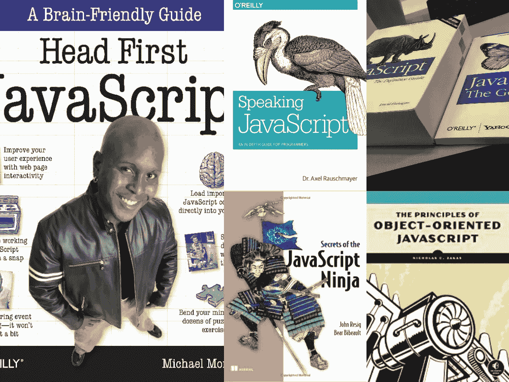
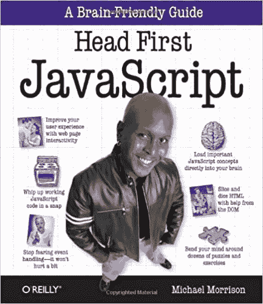
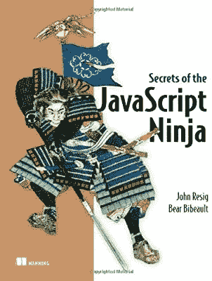
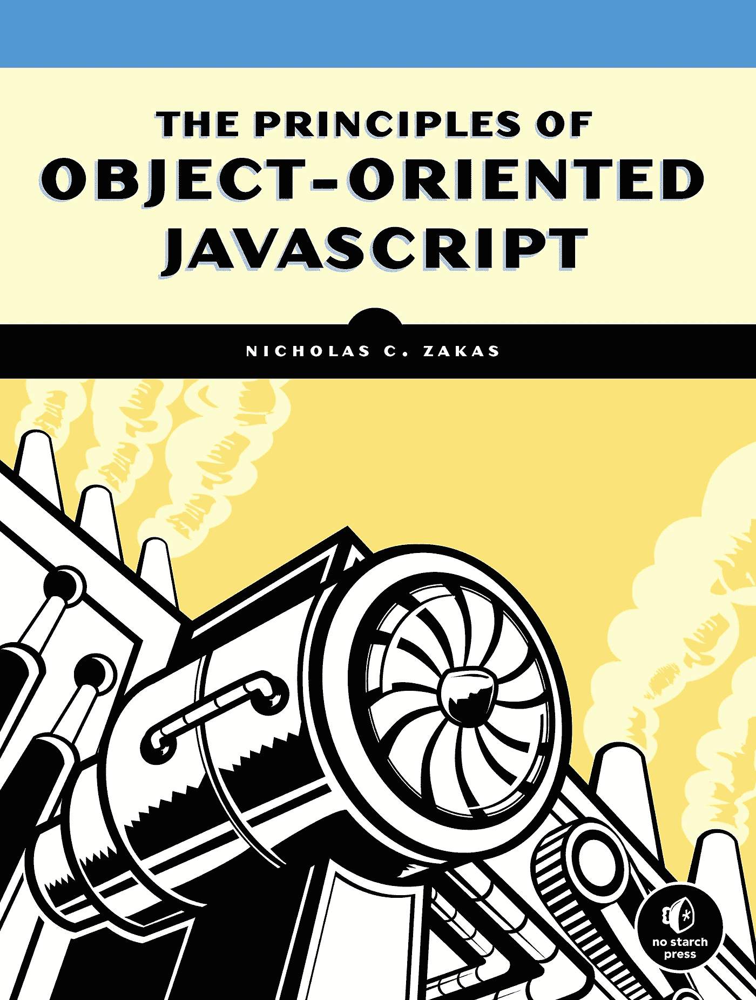
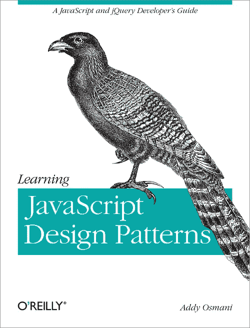
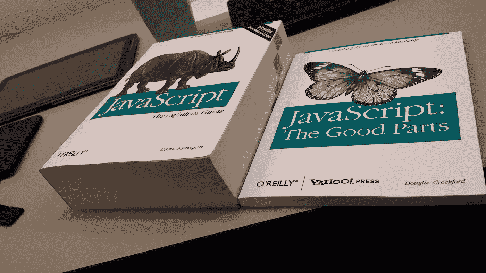

# 2023 年最适合初学者的 5 本 JavaScript 书籍和课程

> 原文：<https://medium.com/javarevisited/5-best-javascript-books-for-beginners-and-experienced-web-developers-2c6353d1cc85?source=collection_archive---------2----------------------->

## 这些都是 2023 年学习 JavaScript 最好的书籍搭配补充在线课程快速学习 JavaScript。

大家好，如果你想学习 JavaScript 并寻找最好的 JavaScript 书籍，那么你来对地方了。以前我分享过 [**最好的 JavaScript 课程**](/javarevisited/10-best-online-courses-to-learn-javascript-in-2020-af5ed0801645) 、 [**最好的学习 JavaScript 的平台**](/javarevisited/my-favorite-free-tutorials-and-courses-to-learn-javascript-8f4d0a71faf2) ，今天我要分享的是你学习 JavaScript 可以看的最好的书。

JavaScript 是网络上最流行的编程语言，远远领先于流行的语言，如 [Java](/javarevisited/10-books-java-developers-should-read-in-2020-e6222f25cc72) 、 [Ruby](/javarevisited/top-5-free-courses-to-learn-ruby-and-rails-for-beginners-best-of-lot-e149fe03c964) 和 [Python](/javarevisited/my-favorite-books-to-learn-python-in-depth-77465633b46e) 。这也是任何一个 Web 开发人员的必备技能之一。这甚至是 Fullstack Java 开发人员的一项重要技能。

如果你的简历或 LinkedIn 档案中有 JavaScript，你将有可能获得许多工作机会。

每个人都想要通晓多种编程语言的程序员，因为大多数现实世界的项目都是用多种技术开发的，你总会发现一些组件是用 [Java](/javarevisited/top-10-free-courses-to-learn-spring-framework-for-java-developers-639db9348d25) 编写的，一些是用 [C++](/@javinpaul/top-10-courses-to-learn-c-for-beginners-best-and-free-4afc262a544e) 编写的，然后你就有了 [JSP](/javarevisited/6-free-courses-to-learn-servlet-jsp-and-java-fx-in-2020-best-of-lot-720201c84f63) ，Servlet，jQuery， [JavaScript](/javarevisited/12-free-courses-to-learn-javascript-and-es6-for-beginners-and-experienced-developers-aa35874c9a32) 等等。对于网页等等。简而言之，在当今竞争激烈的世界里，学习 JavaScript 是必不可少的。

市场上有大量学习 JavaScript 的书籍，你甚至可以找到许多免费的电子书、pdf，声称教授 JavaScript，但其中许多要么不是最新的，要么只是包含必要的信息，而没有关注开发现代网站所需的基本概念。

在本文中，我将分享一些学习 JavaScript 的最佳书籍。这份清单既包括初学者和刚开始学习 JavaScript 的新程序员，也包括有几年专业 JavaScript 经验的有经验的 JavaScript 开发人员。

近年来，网络课程也成为了在极短时间内学习 JavaScript 的好方法。我通常从一门课程开始，然后选择一本书来深入学习这些概念。

如果你也遵循类似的套路，你也可以在 Udemy 上查看 Jonas 的 [**完整 JavaScript 课程 2023:构建真实项目**](https://click.linksynergy.com/deeplink?id=JVFxdTr9V80&mid=39197&murl=https%3A%2F%2Fwww.udemy.com%2Fcourse%2Fthe-complete-javascript-course%2F) 课程。这是一块真正的宝石，通过做项目和应用你所学的 JavaScript 概念，你会学到很多东西。

<https://click.linksynergy.com/deeplink?id=JVFxdTr9V80&mid=39197&murl=https%3A%2F%2Fwww.udemy.com%2Fcourse%2Fthe-complete-javascript-course%2F>  

# 2023 年初学者学习 JavaScript 的前 5 本书

这里是我整理的学习和掌握 JavaScript 的书籍列表。该列表包含了初学者和有经验的程序员的书籍，如 [Head First JavaScript](https://javarevisited.blogspot.com/2017/02/top-5-javascript-books-to-learn-best-of-lot-must-read.html) 是一本从 JavaScript 开始的优秀书籍，一旦你掌握了一些 JavaScript 知识,《JavaScript:精彩部分》也是一本优秀的书籍。

这样，你会更快更好地学习先进的概念。

## 1.[头先 JavaScript](https://www.amazon.com/Head-First-JavaScript-Programming-Brain-Friendly/dp/144934013X?tag=javamysqlanta-20)

我是 Head First 系列的忠实粉丝，看过他们的很多书，像 [Head First 设计模式](/javarevisited/7-best-books-to-learn-design-patterns-for-java-programmers-5627b93eefdb)、 [Head First Java](https://javarevisited.blogspot.com/2018/07/top-9-java-programming-books-best-must-read.html) 、 [Head First jQuery](https://javarevisited.blogspot.com/2013/07/top-5-jquery-books-for-web-developers-learn.html) 、 [Head First SQL](/javarevisited/5-best-books-to-learn-sql-and-database-design-for-programmers-and-developers-1e7839df2f3e) 等等。

这是 head first 系列的另一个亮点，它将教你 Head First 风格的 JavaScript，我的意思是，大量的交互式阅读和练习。这本书对任何想学习 JavaScript 的人来说都是极好的，是任何 JavaScript 初学者的必读之作。

你将很快学会 JavaScript 的所有基本概念，比如数据类型、函数、如何编写 JavaScript 代码、如何运行它们以及如何测试它们。它还解释了一些关键概念，如 DOM 结构、事件处理以及使用 JavaScript 开发交互式跨浏览器网站。

这里是购买这本书的链接— [Head First JavaScript](https://www.amazon.com/Head-First-JavaScript-Programming-Brain-Friendly/dp/144934013X?tag=javamysqlanta-20)

简而言之，这是最好的 JavaScript 书籍之一，每个 JS 开发人员都应该阅读……并多次阅读。读 Head First 系列书很有趣。

如果你想把这本书和一门综合课程结合起来，我建议你从一开始就挑 [**现代 JavaScript**](https://click.linksynergy.com/deeplink?id=JVFxdTr9V80&mid=39197&murl=https%3A%2F%2Fwww.udemy.com%2Fcourse%2Fmodern-javascript-from-the-beginning%2F)**Udemy 上 Brad Traversy 的一门动手操作、基于项目的课程。**

**<https://click.linksynergy.com/deeplink?id=JVFxdTr9V80&mid=39197&murl=https%3A%2F%2Fwww.udemy.com%2Fcourse%2Fmodern-javascript-from-the-beginning%2F> ** 

## **2.[JavaScript 忍者的秘密](http://www.amazon.com/Secrets-JavaScript-Ninja-John-Resig/dp/193398869X?tag=javamysqlanta-20)**

**你可能以前听说过 John Resig 这个名字，如果你不知道，让我提醒你，他是 jQuery 的作者，jQuery 是最流行的 JavaScript 框架之一，它真正帮助 JavaScript 成为 web 开发的第一编程语言。

John Resig 和 Bear Bibeault 的《JavaScript Ninja 第 1 版的秘密》不是为初学者编写的，而是为熟悉 JavaScript 的开发人员编写的。**

**这是一本精彩的书，它清楚地解释了为什么 JavaScript 已经成为在客户机和服务器上开发 web 应用程序的首选。

它不仅解释了 JavaScript 的基本原理，如函数、闭包、递归、[正则表达式](https://javarevisited.blogspot.com/2020/04/top-5-courses-to-learn-regular-expression-regex.html)等。而且还教您如何编写正确的 JavaScript 代码。**

**这里是购买这本书的链接—[JavaScript 忍者的秘密](http://www.amazon.com/Secrets-JavaScript-Ninja-John-Resig/dp/193398869X?tag=javamysqlanta-20)**

****

**这本书最好的部分是，每一点理论都用一些来自流行的 JavaScript 库(如 jQuery 和 Prototype)的真实代码示例进行了解释。让约翰辞去这本书的作者确实有所帮助。**

**尽管这本书的目标读者是中级 JavaScript 开发人员，但即使是相对较新的 JavaScript 程序员也可以通过捕捉其他 JavaScript 书中忽略的概念而受益。简而言之，任何 web 开发人员的必读 JavaScript 书。**

**而且，如果你需要一门高级 Javascript 课程来配合这本书，我推荐 ZTM 学院的[安德烈·尼戈瓦](https://medium.com/u/942670ffec21?source=post_page-----2c6353d1cc85--------------------------------)的 [JavaScript:高级概念](https://academy.zerotomastery.io/p/advanced-javascript-concepts?affcode=441520_zytgk2dn)。**

**<https://academy.zerotomastery.io/p/advanced-javascript-concepts?affcode=441520_zytgk2dn>  

顺便说一句，你需要一个 [ZTM 会员](https://academy.zerotomastery.io/p/academy?affcode=441520_zytgk2dn)才能观看这个课程，这个课程每月花费大约 29 美元，但也提供了许多超级吸引人和有用的课程，如这个 [Python 课程](https://academy.zerotomastery.io/p/complete-python-developer-zero-to-mastery?affcode=441520_zytgk2dn)和他的 [JavaScript Web 项目:20 个项目来建立你的投资组合](https://academy.zerotomastery.io/p/javascript-projects?affcode=441520_zytgk2dn)课程。** 

## **3.[面向对象 JavaScript 的原理](https://www.amazon.com/Principles-Object-Oriented-JavaScript-Nicholas-Zakas/dp/1593275404?tag=javamysqlanta-20)**

**JavaScript 成功的众多原因之一是其面向对象的能力，但当我第一次开始学习 JavaScript 时，它对我来说就像一种脚本语言，因为没有类的概念，你不需要定义任何对象来编写代码。那时候的我很幼稚。

尼古拉斯·c·扎卡斯(Nicholas C. Zakas)的《面向对象 JavaScript 原理》完全改变了我对 JavaScript 的理解。它探索了 JavaScprit 的[面向对象的](/javarevisited/my-favorite-courses-to-learn-object-oriented-programming-and-design-in-2019-197bab351733?source=---------103------------------)本质，并揭示了继承和其他关键特征的独特实现。这本书最好的部分是它简洁的本质和解释概念的方式。这本书既适合初学者，也适合有经验的 Javascript 开发人员，但是你必须了解 OOP 基础知识才能充分理解这本书。**

**这本书将主要教你对象如何在 JavaScript 中工作。即使你知道面向对象的 JavaScript，你也可以通过阅读这本书来了解一二。**

****这里是购买这本书的链接**——[面向对象 JavaScript 的原理](https://www.amazon.com/Principles-Object-Oriented-JavaScript-Nicholas-Zakas/dp/1593275404?tag=javamysqlanta-20)**

****

**你也可以把这本书和 [**ES6 Javascript:完整开发者指南**](https://click.linksynergy.com/fs-bin/click?id=JVFxdTr9V80&subid=0&offerid=323058.1&type=10&tmpid=14538&RD_PARM1=https%3A%2F%2Fwww.udemy.com%2Fjavascript-es6-tutorial%2F) 课程结合起来，学习 Javascript 的现代语法和改进的 OOP 特性，以便更好地开发。**

**<https://click.linksynergy.com/fs-bin/click?id=JVFxdTr9V80&subid=0&offerid=323058.1&type=10&tmpid=14538&RD_PARM1=https%3A%2F%2Fwww.udemy.com%2Fjavascript-es6-tutorial%2F> ** 

## **4. [JavaScript 模式](https://www.amazon.com/JavaScript-Patterns-Better-Applications-Coding/dp/0596806752/?tag=javamysqlanta-20)**

**对于有经验的 JavaScript 程序员来说，这是另一本优秀的书。这本书将通过教你大量的 JavaScript 编码模式和最佳实践，教你一些开发真实世界 JavaScript 应用程序的最佳方法。

Stoyan Stefanov 的《JavaScript 模式:用编码和设计模式构建更好的应用程序》有效地补充了*《JavaScript:好的部分》*，避免了使用全局变量、使用单个 var 声明等不好的做法。您将了解为什么文字符号模式是构造函数更简单的替代方式，以及在 JavaScript 中定义函数的不同方式。更重要的是，您将了解 JavaScript 中可用于代码重用和继承的不同选项。**

****这里是购买这本书的链接**——[JavaScript 模式](https://www.amazon.com/JavaScript-Patterns-Better-Applications-Coding/dp/0596806752/?tag=javamysqlanta-20)**

****

**而且，如果你需要一个在线课程来配合这本书并学习 JavaScript 设计模式，那么我强烈推荐@DmitriNestruk 在 Udemy 上的 Javascript 设计模式 [**课程。这是一个学习经典设计模式的现代实现的好课程。**](https://click.linksynergy.com/deeplink?id=JVFxdTr9V80&mid=39197&murl=https%3A%2F%2Fwww.udemy.com%2Fcourse%2Fdesign-patterns-javascript%2F)**

**<https://click.linksynergy.com/deeplink?id=JVFxdTr9V80&mid=39197&murl=https%3A%2F%2Fwww.udemy.com%2Fcourse%2Fdesign-patterns-javascript%2F> ** 

## **5.JavaScript:好的部分**

**这是市场上又一本优秀的 JavaScript 书。顾名思义，它专注于只教你 JavaScript 的好的部分；因此它很小。**

**如果你将这本书与“JavaScript:权威指南”这本书相比较，你会发现为什么这是一本伟大的书。

这本书是针对*中级 JavaScript 开发者*的，期望你对 JavaScript 有一个基本的了解，你知道如何编写 JS 代码并运行它们。

在本书中，作者@道格拉斯·克洛克福特分享了他使用 JavaScript 的经验，教你所有的最佳实践和方法*来编写有效的 JavaScript 代码*。它聚焦于使 JavaScript 成为优秀的面向对象编程语言的好主意，如数组、函数、松散类型和富于表现力的对象文字符号。

当我第一次读这本书的时候，我对我所获得的知识感到惊讶，尽管我在 JavaScript 方面有一些经验。简而言之，这是一本优秀的 JavaScript 书籍，每个 web 开发人员都应该至少阅读一次，并且越早理解越好。**

****这里是购买这本书的链接**——[JavaScript:精彩部分](https://www.amazon.com/JavaScript-Good-Parts-Douglas-Crockford/dp/0596517742?tag=javamysqlanta-20)**

****

**Udemy 上还有一门 [**JavaScript:理解怪异部分**](https://click.linksynergy.com/fs-bin/click?id=JVFxdTr9V80&subid=0&offerid=323058.1&type=10&tmpid=14538&RD_PARM1=https%3A%2F%2Fwww.udemy.com%2Funderstand-javascript%2F) 课程，有效补充了这本书。如果你感兴趣，你也可以看看 JavaScript 有时有多复杂。**

**<https://click.linksynergy.com/fs-bin/click?id=JVFxdTr9V80&subid=0&offerid=323058.1&type=10&tmpid=14538&RD_PARM1=https%3A%2F%2Fwww.udemy.com%2Funderstand-javascript%2F>  

以上是关于学习 JavaScript 的一些**最佳书籍。这个列表包含了面向 JavaScript 初学者和有经验的程序员的书籍。还包括各种书籍，帮助你从不同角度理解 JavaScript，成为一名 [*专家 JavaScript 开发者*](/javarevisited/top-10-online-courses-to-become-a-fullstack-web-developer-in-2020-d608a6b63232) 。

一开始，你可以先拿起头 JavaScript，然后慢慢前进到高级 JavaScript 书籍，如*《JavaScript:精彩部分》*和*《JavaScript 忍者》。*这些书对于任何想为新项目学习 JavaScript 的 Java、Dot NET 或 C++程序员来说都是理想的。

**深造**
[完整的 JavaScript 课程 2023:构建真实项目](https://click.linksynergy.com/deeplink?id=JVFxdTr9V80&mid=39197&murl=https%3A%2F%2Fwww.udemy.com%2Fcourse%2Fthe-complete-javascript-course%2F)
[JavaScript 基础由利亚姆·麦克伦南](https://pluralsight.pxf.io/c/1193463/424552/7490?u=https%3A%2F%2Fwww.pluralsight.com%2Fcourses%2Fjscript-fundamentals)
[现代 JavaScript 完全指南](https://www.educative.io/courses/complete-guide-to-modern-javascript?affiliate_id=5073518643380224)

其他推荐书籍 **Java 和 Web 开发者**:**

*   [完整的 FullStack Web 开发者路线图](/javarevisited/the-2019-web-developer-roadmap-ab89ac3c380e)
*   [初学者学习 Javascript 的十大课程](https://javarevisited.blogspot.com/2018/06/top-10-courses-to-learn-javascript-in.html)
*   JavaScript 开发人员学习 jQuery 的 5 本书([列表](http://javarevisited.blogspot.sg/2013/07/top-5-jquery-books-for-web-developers-learn.html))
*   前端开发人员学习 jQuery 的前 5 门课程([课程](/better-programming/my-favorite-free-courses-to-learn-jquery-for-beginners-60e126c977ce))
*   学习 REST 和 RESTful Web 服务的 5 本书([列表](http://javarevisited.blogspot.sg/2017/02/top-5-books-to-learn-rest-and-restful-web-services-in-java.html))
*   前端开发人员学习 REST API 的 5 大课程([课程](https://javarevisited.blogspot.com/2020/02/top-5-postman-tutorials-and-courses-for-web-developers.html))
*   5 本有经验的软件开发和项目管理书籍([列表](http://javarevisited.blogspot.sg/2016/11/top-10-software-development-and-project.html)
*   我最喜欢的学习软件架构的课程([课程](/javarevisited/top-5-courses-to-learn-software-architecture-in-2020-best-of-lot-5d34ebc52e9)
*   学习 Hibernate 框架的 5 本书([阅读](http://javarevisited.blogspot.sg/2014/01/top-5-hibernate-books-for-java-programmers-learning.html))
*   深入学习 Hibernate 和 JPA 的五大课程([课程](https://javarevisited.blogspot.com/2018/01/top-5-hibernate-and-jpa-courses-for-java-programmers-learn-online.html))
*   Java 程序员学习 Spring MVC 的 5 本书([列举](http://www.java67.com/2016/12/5-spring-framework-books-for-java-programmers.html))
*   深入学习 Spring 框架的 5 门课程([门课程](https://javarevisited.blogspot.com/2018/06/top-6-spring-framework-online-courses-Java-programmers.html))
*   6 个免费在线学习 JavaScript 的网站([列表](http://java67.com/2015/12/best-websites-to-learn-javascript-online.html))

感谢您阅读本文如果您喜欢这些*最好的 JavaScript 书籍和课程*，那么请与您的朋友和同事分享。如果您有问题、反馈、建议或任何 JavaScript 书籍想推荐给我们，请随时发表评论。

**P. S. —** 如果您是 JavaScript 和前端开发的新手，并且正在寻找最好的 JavaScript 在线课程来启动您的 web 开发之旅，那么您也可以在 Udemy 上查看 J[**avaScript—2023 年完整指南(初级+高级)**](https://click.linksynergy.com/deeplink?id=JVFxdTr9V80&mid=39197&murl=https%3A%2F%2Fwww.udemy.com%2Fcourse%2Fjavascript-the-complete-guide-2020-beginner-advanced%2F) 课程，作者是 Maximilian Schwarzmuller。这是最全面的课程，有 52 个多小时的内容，你可以在 Udemy sale 上花 10 美元购买。

<https://click.linksynergy.com/deeplink?id=JVFxdTr9V80&mid=39197&murl=https%3A%2F%2Fwww.udemy.com%2Fcourse%2Fjavascript-the-complete-guide-2020-beginner-advanced%2F> **