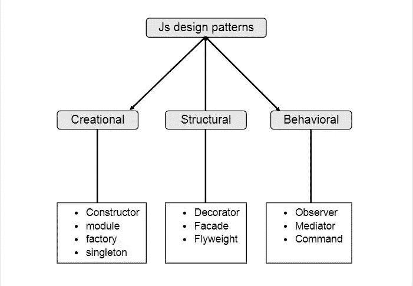
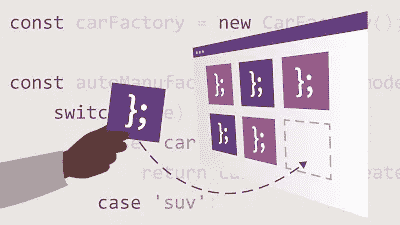

# 面向有经验的 Web 开发人员的 5 门最佳 JavaScript 设计模式课程

> 原文：<https://medium.com/javarevisited/5-best-javascript-design-pattern-courses-for-experienced-web-developers-7f1b152e782e?source=collection_archive---------1----------------------->

## 我最喜欢的 JavaScirpt 在线课程和资源，了解设计模式、可靠和干净的代码

伙计们，如果你是一名 JavaScript web 开发人员，想要学习设计模式、坚实的原则、编码最佳实践和干净的代码原则，以进一步提高你的编码和开发技能，并寻找 JavaScript 中最好的设计模式课程，那么你来对地方了。

前面我已经分享过 [**初学者最佳 JavaScript 课程**](/javarevisited/10-best-online-courses-to-learn-javascript-in-2020-af5ed0801645) 。今天，我将分享 Udemy、Pluralsight、Udacity 和 LinkedIn Learning 在 JavaScript 中学习设计模式的最佳课程。这些都是非常棒的在线课程，你可以加入学习这种有用的技能，成为一名更好的 JavaScript 开发人员。

一个人是好的还是有经验的程序员并不重要；他们将在[编程](/javarevisited/10-free-python-tutorials-and-courses-from-google-microsoft-and-coursera-for-beginners-96b9ad20b4e6)时面临问题。当代码中出现几个问题时，您可能会发现其中的一些相似之处，当将尝试解决这些问题时，您可能会注意到一些常见的模式。这就是术语**“设计模式”**的由来。

因此，当软件工程中遇到一个常见的问题时，通用的可重用解决方案称为设计模式。

随着 [Node.js](/javarevisited/top-10-online-courses-to-learn-node-js-in-depth-8ef0e31ca139) 的出现，Javascript 已经成为 web 开发社区中最突出的编程语言。它既用于客户端，也用于服务器端。所以 Javascript 中的设计模式是趋势。编写糟糕的代码很容易，但是如果理解了设计模式，编写好的代码是可能的。本文将列出帮助您学习和理解 Javascript 设计模式的前五门课程。

顺便说一下，如果你是一个 JavaScript 初学者，那么我强烈建议你首先通过一个全面的 JavaScript 课程来学习现代语法和功能，如箭头函数，这使得编码更加简洁明了。

如果你需要资源，我建议查看 [**完整的 JavaScript 课程 2021:构建真实项目！**](https://click.linksynergy.com/deeplink?id=JVFxdTr9V80&mid=39197&murl=https%3A%2F%2Fwww.udemy.com%2Fcourse%2Fthe-complete-javascript-course%2F) 课程由 Jonas Schemedtmann 在 Udemy 上开设。

# 学习 JavaScript 设计模式的 5 门最佳课程

在不浪费你更多时间的情况下，这里列出了学习 JavaScript 设计模式的最佳在线课程。这些课程是由专家创建的，受到成千上万已经加入这个课程来学习模式和改进编码的开发人员的信任。

你也可以这样做。它们也非常划算，尤其是 Udemy 课程，在促销期间你只需花 10 美元就能买到。

## 1.[用 JavaScript 设计模式](https://click.linksynergy.com/deeplink?id=JVFxdTr9V80&mid=39197&murl=https%3A%2F%2Fwww.udemy.com%2Fcourse%2Fdesign-patterns-javascript%2F)【Udemy】

对于想要学习 JavaScript 设计模式的现代实现的 JavaScript 开发人员来说，这是 udemy 最好的课程之一。这门课程有 25 个部分和 103 个讲座，包含 10 多个小时的视频。

讲师深入讲解概念，聚焦每个主要话题。本课程涉及的一些主题是可靠的设计原则、构建器、工厂、原型、单例、适配器、桥、装饰器、轻量级、代理、迭代器、观察者、状态、策略、模板方法等等。

要求
1。对 JavaScript 的理解
2。了解面向对象编程
3。了解 JavaScript 的最新特性

本课程的主要重点是识别和应用设计模式。讲师还解释了如何折射现有的设计来使用设计模式。它是一门中级课程。如果你只能参加一门课程，我建议你参加这门课程。

**这是加入本课程**—[JavaScript 设计模式](https://click.linksynergy.com/deeplink?id=JVFxdTr9V80&mid=39197&murl=https%3A%2F%2Fwww.udemy.com%2Fcourse%2Fdesign-patterns-javascript%2F)的链接

## 2. [JavaScript 设计模式:专家代码的 20 种模式](https://click.linksynergy.com/deeplink?id=JVFxdTr9V80&mid=39197&murl=https%3A%2F%2Fwww.udemy.com%2Fcourse%2Fjavascript-design-patterns-20-patterns-for-expert-code%2F)【Udemy】

这是 udemy 的另一门高级 JavaScript 课程。它是为那些想要深入研究设计模式的人设计的。讲师主要讲述如何在现实生活中编写出色的代码。

要求
1。对 JavaScript
2 有很强的理解。JavaScript 经验
3。理解面向对象编程

由于这是一门高级课程，因此讲师将介绍模块化和压缩代码、优化内存以及解决设计问题等概念。

本课程中的其他重要主题是在应用程序设计中实现抽象，控制多个对象，以及使用结构化设计模式共享 API。

**这里是加入本课程的链接—** [JavaScript 设计模式:专家代码的 20 种模式](https://click.linksynergy.com/deeplink?id=JVFxdTr9V80&mid=39197&murl=https%3A%2F%2Fwww.udemy.com%2Fcourse%2Fjavascript-design-patterns-20-patterns-for-expert-code%2F)

## 3.[JavaScript 中的实用设计模式](https://pluralsight.pxf.io/c/1193463/424552/7490?u=https%3A%2F%2Fwww.pluralsight.com%2Fjavascript-practical-design-patterns)【plural sight】

这是在 Pluralsight 学习设计模式的最佳课程。本课程将帮助你理解在 JavaScript 中使用设计模式来整洁地编写代码的技术。它是一门中级课程。教师增加了一个特殊的章节来解释 JavaScript 中设计模式的含义。其他章节涵盖了 Javascript 中的面向对象编程、创造和结构设计模式以及行为设计模式。

要求
1。理解 JavaScript。
2。JavaScript 方面的经验。

顺便说一下，你需要一个 Pluralsight 会员才能参加这个课程，费用大约是每月 29 美元或每年 299 美元(14%的折扣)。我向所有程序员强烈推荐这个订阅，因为它提供了超过 7000 个在线课程的即时访问，以学习任何技术技能。或者，你也可以使用他们的 [**10 天免费通行证**](https://pluralsight.pxf.io/c/1193463/424552/7490?u=https%3A%2F%2Fwww.pluralsight.com%2Flearn) 免费观看这门课程。

## 4. [JavaScript 设计模式](https://www.udacity.com/course/javascript-design-patterns--ud989)

这是 Udacity 的高级课程，免费。本课程旨在让你了解如何在 [JavaScript](/javarevisited/10-best-online-courses-to-learn-javascript-in-2020-af5ed0801645) 中组织代码。它分为五节课和一个期末专题。

因为这是一门高级课程，所以课程要求对现代 JavaScript 有适当的知识和理解。

要求
1。理解 JavaScript。
2。理解高级 JavaScript 概念。

**这里是加入本课程**——[JavaScript 设计模式](https://www.udacity.com/course/javascript-design-patterns--ud989)的链接

## 5. [JavaScript 设计模式— LinkedIn 学习](http://linkedin-learning.pxf.io/c/1193463/449670/8005?u=https%3A%2F%2Fwww.linkedin.com%2Flearning%2Fjavascript-patterns-2)

这是 Lynda 或 LinkedIn Learning 的 JavaScript 设计模式的最佳课程。这是一门简短的中级课程，涵盖了所有必要的概念，如创造模式、结构模式和行为模式。

要求
1。理解 JavaScript。
2。JavaScript 方面的经验。

讲师简要地关注关键概念。如果你没有时间去上冗长详细的课程，你可以去上少于两个小时的课程。

**这里是加入本课程的链接**——[JavaScript 设计模式](http://linkedin-learning.pxf.io/c/1193463/449670/8005?u=https%3A%2F%2Fwww.linkedin.com%2Flearning%2Fjavascript-patterns-2)

顺便说一句，你需要 LinkedIn Learning 会员才能观看这门课程，每月费用约为 29.99 美元，但你也可以通过参加他们的 [**30 天免费试用**](http://linkedin-learning.pxf.io/c/1193463/449670/8005?u=https%3A%2F%2Fwww.linkedin.com%2Flearning%2Fsubscription%2Fproducts) 来免费观看这门课程，这是探索他们 16000 多门最新技术在线课程的好方法。

以上是学习 JavaScript 设计模式的最佳在线课程。这些课程将教你如何编写好的面向对象的代码来解决现实世界中的问题，因为你将使用季节性开发人员提供的久经考验的解决方案。

以一种有组织的、恰当的方式写出好的代码和掌握编程概念一样重要。同样，编程时面临的问题也要妥善解决。程序员通常会忽略这样重要的方面。在本文中，我们列出了帮助您理解 JavaScript 设计模式的前五门课程。文章中已经提到了设计模式对于编写好代码和解决错误的重要性。所以你可以浏览这些课程，并做出相应的选择。但是请记住，这些课程需要对 JavaScript 有适当的理解。

您可能想探索的其他 **JavaScript 和 Web 开发课程**

*   [全栈开发者路线图](/javarevisited/the-2019-web-developer-roadmap-ab89ac3c380e)
*   [2021 年学习 JavaScript 的 13 门免费课程](/javarevisited/12-free-courses-to-learn-javascript-and-es6-for-beginners-and-experienced-developers-aa35874c9a32)
*   [学习 Learn RESTful Web 服务的 3 本书和课程](http://www.java67.com/2018/02/3-books-and-courses-to-learn-restful-web-services-with-spring.html)
*   [完整的 React JS 开发者路线图](https://javarevisited.blogspot.com/2018/10/the-2018-react-developer-roadmap.html#axzz5dPh5g7tg)
*   [2021 年学习 MERN 堆栈的 5 门最佳课程](https://www.java67.com/2020/06/top-5-courses-to-learn-mern-stack-for-web-development.html)
*   [前端和后端开发者路线图](https://javarevisited.blogspot.com/2019/02/the-2019-web-developer-roadmap.html)
*   成为全栈网络开发者的 10 门课程
*   [2021 年学习打字稿的 10 门免费课程](/javarevisited/top-10-free-typescript-courses-to-learn-online-best-of-lot-44bce9da41d1)
*   [我最喜欢的初学者学习棱角的课程](/javarevisited/10-courses-to-learn-angular-for-web-development-6da1bd2856dc)
*   [免费学习 Ruby 和 Rails 的 5 门课程](http://www.java67.com/2018/02/5-free-ruby-and-rails-courses-to-learn-online.html)
*   [2021 年学习 Angular 的 5 门免费课程](https://javarevisited.blogspot.com/2018/06/5-best-courses-to-learn-angular.html)
*   [2021 年学习 MEAN Stack 的前 5 门课程](/javarevisited/5-best-courses-to-learn-mean-stack-for-beginners-and-experienced-developers-31162f8e3c03?source=extreme_sidebar---------0-2----------------------)
*   【Fullstack 开发者应该学习的 10 个框架
*   [初学者学习 Node.js 的 5 门免费课程](/javarevisited/7-free-courses-to-learn-node-js-in-2020-2f1dd6722b49)
*   Web 设计师的 6 门最佳 HTML 5 和 CSS 3 课程

感谢您阅读本文。如果你喜欢这些*最好的 JavaScript 设计模式课程*，请分享给你的朋友和同事。如果您有任何问题或反馈，请发表评论。

**P. S. —** 如果你是 JavaScript 新手，正在寻找免费的 JavaScript 课程，你也可以看看 Udemy 的这个 [**免费的 Javascript 基础课程**](http://bit.ly/2zNH9Tj) 。这是完全免费的，你只需要一个 Udemy 账号就可以加入这个课程

<https://www.java67.com/2018/04/top-5-free-javascript-courses-to-learn.html> 